# VGU Student Companion Platform — Complete Implementation Plan v2.1

> **Transforming VGU Buddy Program Website → VGU Student Companion Platform**
> A production-quality student companion system with research-depth in matching algorithms, RAG systems, and interactive campus features.
>
> **v2 Changes**: RBAC architecture (USER/ADMIN) deeply integrated into all layers. Free hosting strategy. EN/DE only.
>
> **v2.1 Changes**: Event Slider is admin-managed dynamic content backed by PostgreSQL/API and Supabase Storage. Frontend mock data is development-only.

---

## PART 1 — CURRENT WEBSITE AUDIT

### Current Architecture

| Layer | Technology | Assessment |
|-------|-----------|------------|
| Structure | HTML (single `index.html` ~1600 lines) | ❌ Monolithic, unmaintainable |
| Styling | TailwindCSS CDN + custom CSS (style.css, chatbot.css) | ⚠️ CDN usage = no tree-shaking, no build-time optimization |
| Logic | Vanilla JavaScript (script.js ~726 lines, chatbot.js ~181 lines) | ❌ Global scope pollution, no modules |
| AI | Gemini API via Vercel serverless proxy (api/gemini.js) | ⚠️ Naive prompt-stuffing, no RAG |
| Deployment | Vercel (static + serverless functions) | ✅ Keep for frontend |
| i18n | Manual data-i18n attribute + embedded JSON translations | ⚠️ Functional but not scalable |

### Current Pages & Features

| Page | Status | Notes |
|------|--------|-------|
| Landing page (index.html) | ✅ Well-designed | Hero, Events slider, About, Benefits, Testimonials, CTA, Footer |
| Merchandise (merchandise/) | ✅ Separate page | Product cards with hover effects |
| Calendar (calendar/) | ✅ Separate page | Event calendar with JS-driven rendering |
| Event posts (post/*) | ✅ 6 event pages | Halloween, Recruit, Welcome Day, Scavenger, International Day, Go Out Day |
| AI Chatbot | ⚠️ Functional but naive | Loads entire systemPrompt.txt (22KB) into every API call |
| Survival Book | ✅ PDF download | Links to PDF file |

### What to KEEP
- ✅ Brand identity: VGU orange (#FF670D) color palette, dark theme aesthetic
- ✅ Content: Testimonials data, event content, system prompt knowledge base
- ✅ Images: All existing photos, logos, event posters
- ✅ Vercel deployment infrastructure
- ✅ Google Analytics integration (GA4)
- ✅ i18n concept (EN/DE language toggle)

### What to REWRITE
- ❌ Entire HTML → React components
- ❌ Vanilla JS → TypeScript modules
- ❌ CDN Tailwind → build-time Tailwind
- ❌ Manual i18n → react-i18next
- ❌ Naive chatbot → RAG-powered assistant
- ❌ Inline translations → JSON locale files

### What to REMOVE
- ❌ Exposed Gemini API key in `.env` (committed to git — must rotate immediately)
- ❌ "Technical Support" linking to chatgpt.com
- ❌ `showSignUp()` alert placeholder
- ❌ Cloudflare challenge scripts in HTML

> [!CAUTION]
> **A Gemini API key was committed to the legacy repository in `.env`**: `[REDACTED]`. The exposed legacy key must be rotated immediately, and `.env` must remain excluded by `.gitignore`.

---

## PART 2 — PRODUCT VISION

### The End State

```
VGU Student Companion Platform
├── 🏠 Public Landing (migrated from current site)
├── 🔐 Dual Auth (User Login + Admin Login)
├── 👤 User Dashboard
│   ├── Student Profiles
│   ├── Buddy Matching
│   ├── AI Assistant
│   ├── Campus Map
│   ├── Events (view)
│   └── Notifications
├── 🛡️ Admin Dashboard
│   ├── User Management
│   ├── Event Management (full CRUD)
│   ├── Event Slider Management (full CRUD + ordering/publishing)
│   ├── Matching Management
│   ├── Knowledge Base Management
│   ├── Campus Management
│   ├── Announcements
│   ├── Analytics
│   └── Audit Logs
└── 🔬 Research Dashboard (Benchmarking)
```

### Student Journey Map

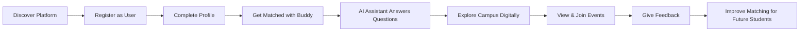

---

## PART 3 — USER PERSONAS

### Persona 1: Exchange Student (Anna, 22, Germany)
- **Role**: USER
- **Goal**: Smooth transition to VGU, find local buddy, understand campus life
- **Pain points**: Language barrier, don't know campus, bureaucratic processes
- **Needs**: Matched buddy, instant answers about visa/dorm, campus navigation

### Persona 2: Local Buddy (Minh, 21, Vietnam)
- **Role**: USER
- **Goal**: Help exchange students, improve English/German, cultural exchange
- **Pain points**: Overwhelming questions, scheduling conflicts
- **Needs**: Compatible match, clear communication, recognition

### Persona 3: Program Coordinator (Thuy, 30, VGU Staff)
- **Role**: ADMIN
- **Goal**: Efficient program management, high satisfaction, data-driven decisions
- **Pain points**: Manual matching, no feedback loop, scattered communication
- **Needs**: Dashboard, matching oversight, event management, analytics

---

## PART 4 — FEATURE ROADMAP

### MVP Strategy & Rationale

| MVP | Focus | Why This Order |
|-----|-------|----------------|
| **MVP 1** | Foundation + UI Migration | Must have working frontend before anything else |
| **MVP 2** | Auth + RBAC + Profiles | Users AND admins must exist before any feature works |
| **MVP 3** | Admin Dashboard + Event and Event Slider Management | Admin must be able to manage events and landing-page promotions without code changes |
| **MVP 4** | Intelligent Matching | Core differentiator, highest portfolio value |
| **MVP 5** | RAG Assistant | Natural extension; reuses profile data infrastructure |
| **MVP 6** | Interactive Campus | Independent feature; can be built after core systems |
| **MVP 7** | Gamification + Social | Engagement layer on top of all systems |

---

## PART 5 — RECOMMENDED TECH STACK (Confirmed)

### Frontend

| Technology | Why This | Why NOT Alternatives |
|-----------|----------|---------------------|
| **React 18** | Component model, ecosystem, portfolio recognition | Vue/Svelte have smaller job markets |
| **TypeScript** | Type safety, refactoring confidence | JS alone lacks compile-time safety |
| **Vite** | Fast HMR, native ESM, simple config | CRA is deprecated; Next.js overkill for SPA |
| **Tailwind CSS v3** | Already used in current site; utility-first | Vanilla CSS slower for component-based dev |
| **shadcn/ui** | Copy-paste components, highly customizable | MUI/Chakra add heavy bundle |
| **React Router v6** | Client-side routing, nested layouts | Standard choice for React SPAs |
| **TanStack Query v5** | Server state management, caching | SWR lacks mutation support |
| **Zustand** | Lightweight client state (auth, UI) | Redux excessive boilerplate |
| **React Hook Form + Zod** | Performant forms + runtime validation | Formik heavier; Yup lacks TS inference |
| **react-i18next** | i18n with JSON locale files (EN/DE) | Custom solution can't handle plurals |

### Backend

| Technology | Why This |
|-----------|----------|
| **FastAPI (Python)** | AI/ML integration, async, auto-docs |
| **SQLAlchemy 2.0** | Modern async ORM, Alembic migrations |
| **PostgreSQL + pgvector** | Relational + vector search in one DB |
| **Supabase** | Managed PostgreSQL, free tier, pgvector |
| **Alembic** | Database migration version control |
| **Pydantic v2** | Request/response validation, schema generation |

### AI/ML

| Technology | Purpose |
|-----------|---------|
| **Sentence Transformers** (`all-MiniLM-L6-v2`) | Profile + document embeddings |
| **Gemini API** | LLM for RAG generation |
| **RAGAS** | RAG evaluation framework |

### Infrastructure — Free Hosting Strategy

| Service | Plan | Monthly Cost | Tradeoff |
|---------|------|-------------|----------|
| **Vercel** | Hobby (Free) | $0 | Frontend, no limits for personal projects |
| **Render** | Free tier | $0 | Backend spins down after 15min inactivity (cold start ~30s) |
| **Supabase** | Free tier | $0 | 500MB DB, 1GB storage, 50K monthly active users |
| **GitHub Actions** | Free tier | $0 | 2000 min/month CI/CD |
| **Gemini API** | Free tier | $0 | 15 RPM, 1M tokens/day |
| **Total** | | **$0/month** | Cold start on backend is only tradeoff |

> [!TIP]
> **$0/month is achievable.** The only noticeable tradeoff is Render's free tier cold start (~30s after 15min inactivity). For a student project, this is acceptable. Upgrade to Render Starter ($7/month) when you need always-on backend for demos or interviews.

---

## PART 6 — SYSTEM ARCHITECTURE

### Level 1: High-Level System Architecture

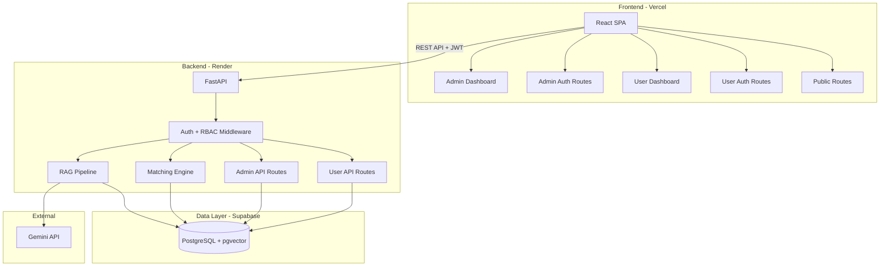

### Level 1A: Admin-Managed Event Slider Data Flow

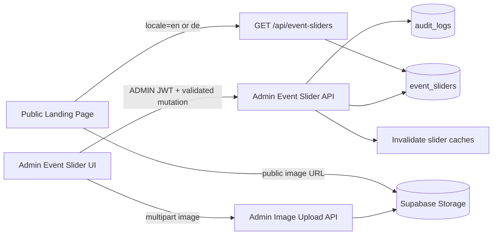

Production frontend code reads slider records only through the public API repository. The local six-slide migration dataset is isolated behind a development-only adapter and is removed by build-time dead-code elimination when `import.meta.env.PROD` is true.

### Level 2: Authentication & Authorization Flow

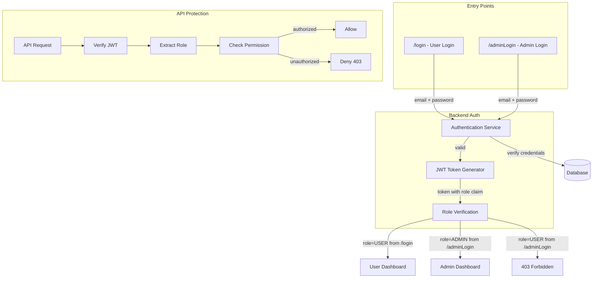

### Level 3: Frontend Route Architecture

```mermaid
graph TB
    ROOT["/"]

    ROOT --> PUBLIC[Public Routes]
    PUBLIC --> LANDING["/ - Landing Page"]
    PUBLIC --> LOGIN["/login - User Login"]
    PUBLIC --> REGISTER["/register - User Register"]
    PUBLIC --> ADMIN_LOGIN["/adminLogin - Admin Login"]

    ROOT --> USER[User Protected Routes - role=USER]
    USER --> U_DASH["/user/dashboard"]
    USER --> U_PROFILE["/user/profile"]
    USER --> U_MATCHING["/user/matching"]
    USER --> U_BUDDY["/user/buddy"]
    USER --> U_ASSIST["/user/assistant"]
    USER --> U_CAMPUS["/user/campus"]
    USER --> U_EVENTS["/user/events"]
    USER --> U_SETTINGS["/user/settings"]

    ROOT --> ADMIN[Admin Protected Routes - role=ADMIN]
    ADMIN --> A_DASH["/admin/dashboard"]
    ADMIN --> A_USERS["/admin/users"]
    ADMIN --> A_MATCHING["/admin/matching"]
    ADMIN --> A_EVENTS["/admin/events"]
    ADMIN --> A_EVENT_SLIDERS["/admin/event-sliders"]
    ADMIN --> A_ANNOUNCE["/admin/announcements"]
    ADMIN --> A_KB["/admin/knowledge-base"]
    ADMIN --> A_CAMPUS["/admin/campus"]
    ADMIN --> A_ANALYTICS["/admin/analytics"]
    ADMIN --> A_AUDIT["/admin/audit-log"]
    ADMIN --> A_SETTINGS["/admin/settings"]
```

> [!IMPORTANT]
> **Public authentication entry-point policy**: The public Navbar `Sign in` menu exposes only `/login` (User Login) and `/register` (Create Student Account). `/adminLogin` must not be linked from the Navbar, mobile drawer, Footer, User Login page, or User Registration page. Administrators access `/adminLogin` directly by its known URL. This discoverability decision is not a security boundary; Admin authorization remains enforced by JWT role checks, `RoleGuard`, and backend `require_role("ADMIN")`.

### Level 5: Matching Pipeline

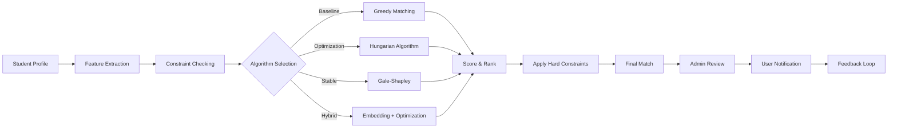

### Level 6: RAG Pipeline

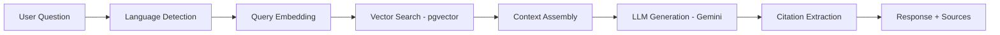

### Level 8: Deployment Architecture

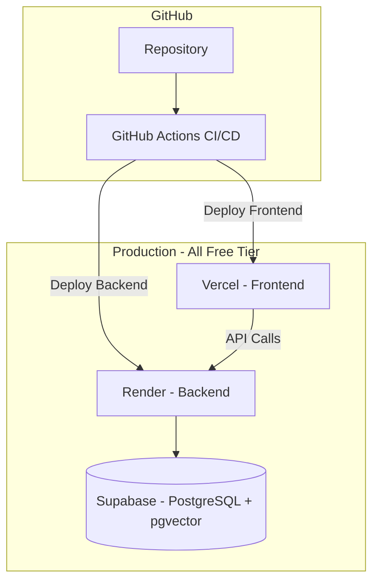

---

## PART 7 — DATABASE DESIGN (Updated with RBAC)

### Core Entity Relationship Diagram

```mermaid
erDiagram
    USER ||--o| STUDENT_PROFILE : has
    USER ||--o| BUDDY_PROFILE : has
    USER ||--o{ AUDIT_LOG : generates
    USER ||--o{ EVENT_SLIDER : manages
    EVENT o|--o{ EVENT_SLIDER : "optionally promoted by"
    USER {
        uuid id PK
        string email UK
        string password_hash
        enum role "USER | ADMIN"
        boolean is_active
        boolean email_verified
        timestamp last_login
        timestamp created_at
        timestamp updated_at
        timestamp deleted_at
    }

    STUDENT_PROFILE {
        uuid id PK
        uuid user_id FK
        string first_name
        string last_name
        string nationality
        string home_university
        string major
        string semester
        enum student_type "exchange | local"
        date arrival_date
        date departure_date
        text bio
        jsonb preferences
    }

    BUDDY_PROFILE {
        uuid id PK
        uuid user_id FK
        string first_name
        string last_name
        string major
        string year
        int max_students
        int current_students
        jsonb availability
        text bio
    }

    USER_INTEREST {
        uuid id PK
        uuid user_id FK
        string category
        string interest
    }

    USER_LANGUAGE {
        uuid id PK
        uuid user_id FK
        string language
        enum proficiency "native | fluent | intermediate | beginner"
    }

    MATCH {
        uuid id PK
        uuid student_id FK
        uuid buddy_id FK
        float score
        jsonb score_breakdown
        enum status "proposed | accepted | rejected | active | completed"
        string algorithm_used
        boolean is_manual_override
        uuid overridden_by FK "admin user_id if manual"
        timestamp matched_at
        timestamp accepted_at
    }

    MATCH_FEEDBACK {
        uuid id PK
        uuid match_id FK
        uuid user_id FK
        int rating
        text comment
        jsonb survey_data
        timestamp created_at
    }

    EVENT {
        uuid id PK
        string title
        text description
        timestamp start_date
        timestamp end_date
        uuid location_id FK "nullable"
        string image_url
        string category
        string organizer
        string contact_info
        int max_participants
        timestamp registration_deadline
        enum status "DRAFT | PUBLISHED | REGISTRATION_OPEN | REGISTRATION_CLOSED | CANCELLED | COMPLETED"
        uuid created_by FK "admin user_id"
        uuid updated_by FK "admin user_id"
        timestamp created_at
        timestamp updated_at
    }

    EVENT_REGISTRATION {
        uuid id PK
        uuid event_id FK
        uuid user_id FK
        timestamp registered_at
        enum status "registered | cancelled | attended"
    }

    EVENT_SLIDER {
        uuid id PK
        uuid event_id FK "nullable; ON DELETE SET NULL"
        string title_en
        string title_de
        text description_en "nullable"
        text description_de "nullable"
        string image_url
        string image_alt_en
        string image_alt_de
        timestamp event_start_at "nullable"
        timestamp event_end_at "nullable"
        string location_en "nullable"
        string location_de "nullable"
        string cta_label_en "nullable"
        string cta_label_de "nullable"
        string cta_url "nullable; relative or HTTPS"
        enum status "DRAFT | PUBLISHED | ARCHIVED"
        boolean is_active
        int sort_order
        timestamp display_start_at "nullable"
        timestamp display_end_at "nullable"
        uuid created_by FK "admin user_id"
        uuid updated_by FK "admin user_id"
        timestamp created_at
        timestamp updated_at
    }

    ANNOUNCEMENT {
        uuid id PK
        string title
        text content
        enum priority "LOW | NORMAL | HIGH | URGENT"
        enum target_audience "ALL_USERS | EXCHANGE_STUDENTS | BUDDIES"
        timestamp publish_date
        timestamp expiration_date
        enum status "DRAFT | PUBLISHED | EXPIRED"
        uuid created_by FK
        timestamp created_at
        timestamp updated_at
    }

    DOCUMENT {
        uuid id PK
        string title
        string source_url
        string category
        string language
        text content
        enum status "UPLOADED | PROCESSING | INDEXED | FAILED"
        uuid uploaded_by FK "admin user_id"
        timestamp created_at
    }

    DOCUMENT_CHUNK {
        uuid id PK
        uuid document_id FK
        text content
        int chunk_index
        vector embedding "pgvector 384-dim"
        jsonb metadata
    }

    CAMPUS_LOCATION {
        uuid id PK
        string name
        enum type "building | room | service | poi"
        string building
        int floor
        float x_coord
        float y_coord
        text description
        string opening_hours
        string image_url
        jsonb metadata
        uuid created_by FK
        timestamp created_at
        timestamp updated_at
    }

    CONVERSATION {
        uuid id PK
        uuid user_id FK
        string title
        timestamp created_at
    }

    CHAT_MESSAGE {
        uuid id PK
        uuid conversation_id FK
        enum role "user | assistant"
        text content
        jsonb sources
        float latency_ms
        int tokens_used
        timestamp created_at
    }

    AUDIT_LOG {
        uuid id PK
        uuid admin_id FK
        string action
        string resource_type
        uuid resource_id
        jsonb old_value "nullable"
        jsonb new_value "nullable"
        jsonb metadata
        timestamp created_at
    }

    NOTIFICATION {
        uuid id PK
        uuid user_id FK
        string title
        text message
        enum type "match | event | announcement | system"
        boolean is_read
        jsonb metadata
        timestamp created_at
    }
```

### Key Design Decisions

| Decision | Rationale |
|----------|-----------|
| `role` as enum on User | Simple, extensible to `SUPER_ADMIN \| MODERATOR` later |
| `is_manual_override` on Match | Admin vs algorithm transparency |
| `created_by` / `updated_by` on Event | Track which admin modified what |
| `AUDIT_LOG` table | Every admin mutation is logged with old/new values |
| `status` enum on Event | Full lifecycle: DRAFT → PUBLISHED → COMPLETED |
| Event Slider as a separate entity | Keeps landing-page promotion independent from Event registration and lifecycle management |
| Nullable `event_id` on Event Slider | Supports either an internal Event CTA or standalone/external promotional content; deleting an Event sets the FK to NULL |
| `status` plus `is_active` on Event Slider | Separates editorial publish workflow from an emergency visibility toggle |
| EN/DE columns on Event Slider | Matches the confirmed product languages; Vietnamese is not part of v2.1 |
| `target_audience` on Announcement | Selective notification delivery |
| Soft delete via `deleted_at` | User data retention for GDPR compliance |

### Indexes

```sql
CREATE INDEX idx_user_email ON users(email);
CREATE INDEX idx_user_role ON users(role);
CREATE INDEX idx_user_active ON users(is_active);
CREATE INDEX idx_match_student ON matches(student_id);
CREATE INDEX idx_match_buddy ON matches(buddy_id);
CREATE INDEX idx_match_status ON matches(status);
CREATE INDEX idx_event_status ON events(status);
CREATE INDEX idx_event_date ON events(start_date);
CREATE INDEX idx_event_slider_public
  ON event_sliders(status, is_active, display_start_at, display_end_at, sort_order);
CREATE INDEX idx_event_slider_event ON event_sliders(event_id);
CREATE INDEX idx_announcement_status ON announcements(status, publish_date);
CREATE INDEX idx_audit_admin ON audit_logs(admin_id, created_at);
CREATE INDEX idx_audit_resource ON audit_logs(resource_type, resource_id);
CREATE INDEX idx_notification_user ON notifications(user_id, is_read);
CREATE INDEX idx_document_chunk_embedding ON document_chunks
  USING ivfflat (embedding vector_cosine_ops) WITH (lists = 100);
```

---

## PART 8 — MATCHING SYSTEM

### Algorithm Comparison Strategy

| Algorithm | Approach | Strengths | Weaknesses |
|-----------|----------|-----------|------------|
| **Random** | Random assignment | Baseline benchmark | No quality guarantee |
| **Greedy** | Best pair first | Fast, simple | Local optima |
| **Gale-Shapley** | Stable matching | Guarantees stability | Only optimizes one side |
| **Hungarian** | Optimal assignment | Global optimum | O(n³), only 1:1 |
| **CSP/ILP** | Constraint satisfaction | Handles all constraints | Requires solver |
| **Embedding-based** | Semantic similarity | Captures nuance | Needs training data |
| **Hybrid** | Embedding → ILP | Best of both worlds | Complex pipeline |

### Compatibility Scoring

```python
MATCHING_WEIGHTS = {
    "interest_similarity": 0.25,
    "language_compatibility": 0.20,
    "schedule_overlap": 0.15,
    "major_compatibility": 0.15,
    "personality_fit": 0.10,
    "activity_preference": 0.10,
    "other_factors": 0.05,
}
```

### Admin Matching Controls

- Admin can trigger algorithm execution via `/api/admin/matching/run`
- Admin can preview results before publishing to users
- Admin can manually override any match with audit trail
- Admin can view algorithm vs manual match distinction
- Admin can reassign buddies with reason logged

---

## PART 9 — RAG SYSTEM

### Knowledge Base Management (Admin-Controlled)

| Action | Who | Endpoint |
|--------|-----|----------|
| Upload document | ADMIN | `POST /api/admin/knowledge-base/documents` |
| Delete document | ADMIN | `DELETE /api/admin/knowledge-base/documents/:id` |
| Re-index document | ADMIN | `POST /api/admin/knowledge-base/documents/:id/reindex` |
| View all documents | ADMIN | `GET /api/admin/knowledge-base/documents` |
| Ask question | USER | `POST /api/assistant/chat` |
| View conversations | USER | `GET /api/assistant/conversations` |

### Pipeline

```
User Question → Embedding → pgvector Search (top-5) → Context Assembly → Gemini API → Citation Extraction → Response
```

### Hallucination Mitigation
- System prompt: "Only answer based on provided context"
- Every claim must reference a chunk
- "I couldn't find this in the knowledge base" for unknowns
- Show retrieved source documents to user

---

## PART 10 — VIRTUAL CAMPUS

### MVP: 2D Interactive SVG Map

- Interactive SVG campus map with clickable buildings
- Search buildings/services/rooms
- Info panel: rooms, services, hours
- Basic pathfinding between buildings (A* on graph)

### Admin Campus Controls
- Add/edit/delete buildings, rooms, facilities, POIs
- Upload building images
- Set opening hours
- Manage point-of-interest categories

> [!NOTE]
> 3D rendering (Three.js), real-time multiplayer (WebSocket), and gamified exploration are DEFERRED.

---

## PART 11 — SECURITY & GDPR (Updated with RBAC)

### Authentication Architecture

```
┌─────────────────────────────────────────────────┐
│                   Platform                       │
└────────────────────┬────────────────────────────┘
                     │
          ┌──────────┴──────────┐
          │                     │
      USER LOGIN            ADMIN LOGIN
          │                     │
          ↓                     ↓
     /login                /adminLogin
          │                     │
          ↓                     ↓
   Same Auth Endpoint      Same Auth Endpoint
   POST /api/auth/login    POST /api/auth/login
          │                     │
          ↓                     ↓
   JWT with role=USER      JWT with role=ADMIN
          │                     │
          ↓                     ↓
   → /user/dashboard       → /admin/dashboard
```

> [!IMPORTANT]
> Both `/login` and `/adminLogin` call the **same backend endpoint** (`POST /api/auth/login`). The backend returns a JWT with the user's role. The frontend then routes to the appropriate dashboard. If a USER logs in at `/adminLogin`, the frontend sees `role=USER` and redirects to `/` with a "not authorized" message.

### Three Layers of Protection

```
Layer 1: Frontend Route Guards
  → ProtectedRoute (must be authenticated)
  → RoleGuard (must have correct role)
  → Redirect unauthorized users

Layer 2: Backend Authorization Middleware
  → Verify JWT on every request
  → Extract role from token
  → Check permission for endpoint
  → Reject with 403 if unauthorized

Layer 3: Database Constraints
  → Role enum enforced at DB level
  → Foreign keys prevent orphaned data
  → Audit log captures all admin actions
```

### Security Implementation

| Concern | Implementation |
|---------|---------------|
| Password hashing | bcrypt (12 rounds) |
| JWT access token | 15-minute expiry, httpOnly cookie |
| JWT refresh token | 7-day expiry, httpOnly cookie, rotate on use |
| RBAC | `require_role("ADMIN")` FastAPI dependency |
| IDOR prevention | Always filter queries by `current_user.id` for user routes |
| Privilege escalation | Role can only be set via DB seed/CLI, never via API |
| Rate limiting | slowapi: 60 req/min for users, 120 req/min for admins |
| SQL injection | SQLAlchemy parameterized queries |
| XSS | React auto-escaping + CSP headers |
| CSRF | SameSite cookie attribute |
| Prompt injection | Input sanitization, system prompt isolation |
| Admin login brute force | 5 failed attempts → 15-minute lockout |

### Admin Account Creation

> [!IMPORTANT]
> **Admin accounts cannot be self-registered.** Admin creation is done exclusively through:

**Recommended approach**: CLI seed command during deployment.

```bash
# Create initial admin (run once during deployment)
python -m app.cli create-admin --email admin@vgu.edu.vn --password <secure>

# Or via environment variable for first boot
INITIAL_ADMIN_EMAIL=admin@vgu.edu.vn
INITIAL_ADMIN_PASSWORD=<secure>
```

The app checks on startup: if no ADMIN exists and env vars are set, create one. This is simple, secure, and appropriate for a student project. Future expansion can add admin invitation flows.

### GDPR Compliance

- Explicit consent checkbox at registration
- Data minimization: only necessary profile fields
- Right to access: user can export data (JSON)
- Right to deletion: soft delete + hard delete after 30 days
- Admin audit log tracks all data access

---

## PART 12 — TESTING STRATEGY

| Layer | Tool | Scope |
|-------|------|-------|
| Frontend Unit | Vitest | Utility functions, hooks, role guards |
| Frontend Component | Vitest + React Testing Library | Components, role-based rendering |
| Frontend E2E | Playwright | User login flow, Admin login flow, permission checks |
| Backend Unit | pytest | Services, algorithms, role verification |
| Backend API | pytest + httpx | Endpoint contracts, 403 for unauthorized |
| Backend Auth | pytest | JWT generation, role extraction, permission denial |
| Backend Integration | pytest + testcontainers | Database + auth + RBAC integration |
| AI Retrieval | RAGAS | Precision, Recall, MRR |
| Matching | pytest + synthetic data | Algorithm correctness, constraints |

### Critical Auth Test Cases

```
✅ User can login at /login → gets USER role JWT
✅ User cannot access /admin/* routes → 403
✅ User cannot call POST /api/admin/* → 403
✅ Admin can login at /adminLogin → gets ADMIN role JWT
✅ Admin can access /admin/* routes
✅ User at /adminLogin → redirected with "not authorized"
✅ Expired JWT → 401
✅ Tampered JWT → 401
✅ Missing JWT → 401
✅ Role claim cannot be modified by client
```

---

## PART 13 — DEVOPS

### Git Workflow (Solo Developer)

```
main (production)
  └── feature branches
        ├── feat/foundation
        ├── feat/auth-rbac
        ├── feat/admin-dashboard
        ├── feat/matching
        └── feat/rag
```

### CI/CD Pipeline (GitHub Actions)

```yaml
# On every push:
- Lint (ESLint + Ruff)
- Type check (tsc + mypy)
- Unit tests (Vitest + pytest)
- Build check

# On merge to main:
- All above + E2E tests
- Deploy frontend to Vercel
- Deploy backend to Render
```

### Hosting: $0/month Strategy

| Service | What | Free Tier Limits |
|---------|------|-----------------|
| **Vercel** | Frontend | Unlimited for personal, 100GB bandwidth |
| **Render** | Backend (Docker) | 750 hours/month, sleeps after 15min idle |
| **Supabase** | PostgreSQL + pgvector | 500MB DB, 1GB file storage, 50K MAU |
| **GitHub Actions** | CI/CD | 2000 min/month |
| **Gemini API** | LLM | 15 RPM, 1M tokens/day |

> [!TIP]
> When Render cold starts (~30s), add a loading indicator on the frontend. For interview demos, hit the API 1 minute before to "warm up" the server.

---

## PART 14 — RESEARCH PLAN

| RQ | Question | Metrics |
|----|----------|---------|
| RQ1 | Does hybrid optimization matching outperform greedy/stable matching? | Avg compatibility, constraint violations, stability |
| RQ2 | Do embedding-based semantic profiles improve match quality? | Satisfaction score, acceptance rate |
| RQ3 | Does hybrid retrieval improve RAG accuracy over dense-only? | Precision@5, Recall@5, MRR |
| RQ4 | How does local LLM compare to cloud LLM for student Q&A? | Accuracy, latency, cost, groundedness |
| RQ5 | Does structured onboarding improve student preparedness? | Task completion rate |
| RQ6 | Can feedback-weighted learning improve matching weights? | Score improvement over baseline |
| RQ7 | Does multilingual embedding outperform translate-then-embed? | Cross-language retrieval accuracy |

---

## PART 15 — COMPLETE IMPLEMENTATION ROADMAP (Updated)

> [!IMPORTANT]
> Phase numbers group parallel workstreams; they are not the canonical single-developer execution sequence. **PART 24 — NEW MASTER IMPLEMENTATION ORDER is authoritative.** At the current project stage, complete Phase 3 tasks FE-014 through FE-020 before starting BE-001. FE-014 builds against the approved API contract with a development-only mock, while EVS-001 through EVS-007, ADMIN-SLIDER-001 through ADMIN-SLIDER-004, and FE-014B later activate end-to-end Admin-managed production content.

### Dependency Graph

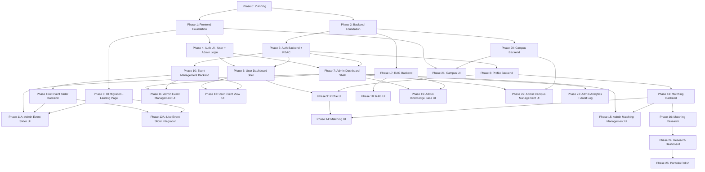

### Phase Timeline

| Phase | Name | Tasks | Hours | Weeks (10h/wk) | Priority |
|-------|------|-------|-------|-----------------|----------|
| 0 | Planning & Design | 5 | 8 | 0.8 | P0 |
| 1 | Frontend Foundation | 10 | 15 | 1.5 | P0 |
| 2 | Backend Foundation | 7 | 12 | 1.2 | P0 |
| 3 | UI Migration (Landing) | 10 | 20 | 2.0 | P0 |
| 4 | Auth UI (User + Admin Login) | 6 | 10 | 1.0 | P0 |
| 5 | Auth Backend + RBAC | 10 | 18 | 1.8 | P0 |
| 6 | User Dashboard Shell | 4 | 6 | 0.6 | P0 |
| 7 | Admin Dashboard Shell | 5 | 8 | 0.8 | P0 |
| 8 | Profile Backend | 5 | 8 | 0.8 | P0 |
| 9 | Profile UI | 5 | 10 | 1.0 | P0 |
| 10 | Event Management Backend | 6 | 10 | 1.0 | P0 |
| 10A | Event Slider Backend | 7 | 14 | 1.4 | P0 |
| 11 | Admin Event Management UI | 8 | 14 | 1.4 | P0 |
| 11A | Admin Event Slider UI | 4 | 8 | 0.8 | P0 |
| 12 | User Event View UI | 3 | 5 | 0.5 | P1 |
| 12A | Live Event Slider Integration | 1 | 2 | 0.2 | P0 |
| 13 | Matching Backend | 10 | 22 | 2.2 | P1 |
| 14 | Matching UI | 6 | 12 | 1.2 | P1 |
| 15 | Admin Matching Management | 5 | 8 | 0.8 | P1 |
| 16 | Matching Research | 8 | 25 | 2.5 | P2 |
| 17 | RAG Backend | 8 | 20 | 2.0 | P1 |
| 18 | RAG UI | 4 | 8 | 0.8 | P1 |
| 19 | Admin Knowledge Base UI | 4 | 8 | 0.8 | P1 |
| 20 | Campus Backend | 4 | 8 | 0.8 | P2 |
| 21 | Campus UI | 4 | 10 | 1.0 | P2 |
| 22 | Admin Campus Management | 4 | 6 | 0.6 | P2 |
| 23 | Admin Analytics + Audit | 5 | 10 | 1.0 | P1 |
| 24 | Research Dashboard | 4 | 10 | 1.0 | P2 |
| 25 | Portfolio Polish | 5 | 10 | 1.0 | P1 |
| **Total** | | **~165** | **~327** | **~33 weeks** | |

---

## PART 16 — VIBE CODING TASKS (Complete Breakdown)

### Phase 1: Frontend Foundation

| ID | Task | Cx | Deps | Pri |
|----|------|----|------|-----|
| FE-001 | Initialize React + TypeScript + Vite project | 1 | — | P0 |
| FE-002 | Configure ESLint + Prettier | 1 | FE-001 | P0 |
| FE-003 | Configure Tailwind CSS v3 with VGU brand | 1 | FE-001 | P0 |
| FE-004 | Install and configure shadcn/ui | 2 | FE-003 | P0 |
| FE-005 | Create design system (colors, typography, buttons, cards) | 2 | FE-003 | P0 |
| FE-006 | Setup React Router with layout structure | 2 | FE-001 | P0 |
| FE-007 | Configure environment variables (.env.example) | 1 | FE-001 | P0 |
| FE-008 | Create folder structure (features/, pages/, lib/, stores/) | 1 | FE-001 | P0 |
| FE-009 | Configure react-i18next with EN/DE | 2 | FE-001 | P0 |
| FE-010 | Migrate translations to JSON locale files | 2 | FE-009 | P0 |

### Phase 2: Backend Foundation

| ID | Task | Cx | Deps | Pri |
|----|------|----|------|-----|
| BE-001 | Initialize FastAPI project with pyproject.toml | 1 | — | P0 |
| BE-002 | Create project structure (api/, core/, models/, schemas/, services/) | 2 | BE-001 | P0 |
| BE-003 | Configure SQLAlchemy 2.0 + Alembic | 2 | BE-001 | P0 |
| BE-004 | Setup Supabase PostgreSQL connection + env config | 2 | BE-003 | P0 |
| BE-005 | Create Docker Compose for local dev (PostgreSQL + pgvector) | 2 | BE-001 | P0 |
| BE-006 | Create base model class with audit fields (id, created_at, updated_at, deleted_at) | 1 | BE-003 | P0 |
| BE-007 | Configure CORS middleware for frontend origin | 1 | BE-001 | P0 |

### Phase 3: UI Migration (Landing Page)

| ID | Task | Cx | Deps | Pri |
|----|------|----|------|-----|
| FE-011 | Create Navbar component (desktop + mobile menu + language toggle) | 3 | FE-005, FE-006, FE-009 | P0 |
| FE-012 | Create Footer component | 2 | FE-005 | P0 |
| FE-013 | Create Hero section with gradient + animations | 3 | FE-005 | P0 |
| FE-014 | Create API-ready Events Slider with development-only mock datasource | 4 | FE-005, FE-007, FE-009 | P0 |
| FE-015 | Create About section | 2 | FE-005 | P0 |
| FE-016 | Create Benefits grid (6 feature cards) | 2 | FE-005 | P0 |
| FE-017 | Create Testimonials marquee | 3 | FE-005 | P0 |
| FE-018 | Create CTA section | 2 | FE-005 | P0 |
| FE-019 | Assemble Landing Page from all sections | 2 | FE-011..FE-018 | P0 |
| FE-020 | Create Language Toggle component (EN/DE with flag icons) | 2 | FE-009, FE-011 | P0 |

### Phase 3A: Frontend Completion Remediation

This phase is an approved completion gate inserted after FE-020 and before Backend Foundation.

| ID | Task | Deps | Pri |
|----|------|------|-----|
| FE-HYGIENE-001 | Review and commit the FE-016..FE-020 baseline | FE-020 | P0 |
| FE-FIX-001 | Hide duplicated testimonial clones from the accessibility tree | FE-HYGIENE-001 | P0 |
| FE-FIX-002 | Fully localize Language Toggle accessible labels and tooltips | FE-HYGIENE-001 | P0 |
| FE-FIX-003 | Remove duplicate SVG IDs from language flag instances | FE-FIX-002 | P1 |
| FE-FIX-004 | Correct Landing Page anchor and layout integration coverage | FE-HYGIENE-001 | P1 |
| FE-FIX-005 | Harden marquee timing, reduced-motion behavior, and interaction tests | FE-FIX-001 | P1 |
| FE-DEMO-001 | Migrate Demo.mp4 and create a WebP poster | FE-HYGIENE-001 | P1 |
| FE-DEMO-002 | Create an accessible responsive Demo Video dialog | FE-DEMO-001, FE-FIX-002 | P1 |
| FE-DEMO-003 | Connect Watch Demo to the video dialog | FE-DEMO-002 | P1 |

### Phase 4: Auth UI

| ID | Task | Cx | Deps | Pri |
|----|------|----|------|-----|
| AUTH-001 | Create User Login page (/login) | 2 | FE-005, FE-006 | P0 |
| AUTH-002 | Create User Registration page (/register) | 3 | FE-005, FE-006 | P0 |
| AUTH-003 | Create Admin Login page (/adminLogin) — distinct visual | 2 | FE-005, FE-006 | P0 |
| AUTH-004 | Create Zustand auth store (token, user, role) | 2 | FE-001 | P0 |
| AUTH-005 | Create ProtectedRoute component (requires auth) | 2 | AUTH-004, FE-006 | P0 |
| AUTH-006 | Create RoleGuard component (requires specific role) | 2 | AUTH-005 | P0 |

> [!IMPORTANT]
> **Approved UI-first exception**: AUTH-001, AUTH-002, and AUTH-003 are implemented as UI-only pages before Backend Foundation. They may include responsive layouts, accessible forms, client-side validation, and loading/error presentation contracts, but must not simulate successful authentication, create fake tokens, or perform fake role redirects. Backend connectivity remains exclusively in AUTH-021 through AUTH-023.
>
> AUTH-003 remains reachable only through the direct `/adminLogin` URL and must not be advertised in public navigation. Admin self-registration is prohibited.

### Phase 4A: Public Auth Entry Integration

| ID | Task | Deps | Pri |
|----|------|------|-----|
| FE-AUTH-ENTRY-001 | Add desktop Sign in menu with User Login and Create Student Account only | AUTH-001, AUTH-002 | P0 |
| FE-AUTH-ENTRY-002 | Add direct User Login and Create Student Account actions to the mobile drawer | AUTH-001, AUTH-002 | P0 |
| FE-AUTH-ENTRY-003 | Route Join the Community to `/register` | AUTH-002 | P1 |
| FE-TECH-001 | Assess and enable TypeScript strict mode without introducing `any` | Frontend functional fixes | P2 |
| FE-VERIFY-001 | Run the final Frontend completion gate | All selected Frontend completion tasks | P0 |

### Phase 5: Auth Backend + RBAC

| ID | Task | Cx | Deps | Pri |
|----|------|----|------|-----|
| AUTH-007 | Define UserRole enum (USER, ADMIN) in models | 1 | BE-006 | P0 |
| AUTH-008 | Create User database model with role field | 2 | AUTH-007 | P0 |
| AUTH-009 | Create Alembic migration for users table | 1 | AUTH-008 | P0 |
| AUTH-010 | Create password hashing service (bcrypt) | 2 | BE-001 | P0 |
| AUTH-011 | Create JWT service (create/verify access + refresh tokens) | 3 | BE-001 | P0 |
| AUTH-012 | Create auth service (register, login, verify role) | 3 | AUTH-008, AUTH-010, AUTH-011 | P0 |
| AUTH-013 | Create `POST /api/auth/register` endpoint (role=USER always) | 2 | AUTH-012 | P0 |
| AUTH-014 | Create `POST /api/auth/login` endpoint (returns JWT with role) | 2 | AUTH-012 | P0 |
| AUTH-015 | Create `POST /api/auth/refresh` endpoint | 2 | AUTH-011 | P0 |
| AUTH-016 | Create `GET /api/auth/me` endpoint (return current user) | 1 | AUTH-011 | P0 |
| AUTH-017 | Create `require_auth` FastAPI dependency (verify JWT) | 2 | AUTH-011 | P0 |
| AUTH-018 | Create `require_role(role)` FastAPI dependency (verify role) | 2 | AUTH-017 | P0 |
| AUTH-019 | Create admin seed CLI command (`python -m app.cli create-admin`) | 2 | AUTH-008, AUTH-010 | P0 |
| AUTH-020 | Create rate limiting middleware (slowapi) | 2 | BE-001 | P0 |
| AUTH-021 | Connect frontend auth store to backend login API | 2 | AUTH-004, AUTH-014 | P0 |
| AUTH-022 | Implement login flow: User login → role check → redirect | 2 | AUTH-021, AUTH-006 | P0 |
| AUTH-023 | Implement admin login flow: Admin login → role=ADMIN check → redirect | 2 | AUTH-021, AUTH-006 | P0 |

### Phase 6: User Dashboard Shell

| ID | Task | Cx | Deps | Pri |
|----|------|----|------|-----|
| FE-021 | Create UserLayout component (sidebar + content area) | 3 | FE-005, AUTH-006 | P0 |
| FE-022 | Create User Sidebar navigation | 2 | FE-021 | P0 |
| FE-023 | Create User Dashboard home page (welcome + quick links) | 2 | FE-021 | P0 |
| FE-024 | Create User Settings page (change password, logout) | 2 | FE-021 | P0 |

### Phase 7: Admin Dashboard Shell

| ID | Task | Cx | Deps | Pri |
|----|------|----|------|-----|
| ADMIN-001 | Create AdminLayout component (sidebar + content) — clean, data-dense | 3 | FE-005, AUTH-006 | P0 |
| ADMIN-002 | Create Admin Sidebar navigation (all 11 modules) | 2 | ADMIN-001 | P0 |
| ADMIN-003 | Create Admin Dashboard overview page (stats cards placeholder) | 2 | ADMIN-001 | P0 |
| ADMIN-004 | Create reusable DataTable component (sort, filter, search, pagination) | 4 | FE-005 | P0 |
| ADMIN-005 | Create reusable ConfirmDialog component | 1 | FE-004 | P0 |

### Phase 8: Profile Backend

| ID | Task | Cx | Deps | Pri |
|----|------|----|------|-----|
| BE-008 | Create StudentProfile + BuddyProfile models | 2 | AUTH-008 | P0 |
| BE-009 | Create UserInterest + UserLanguage models | 2 | AUTH-008 | P0 |
| BE-010 | Create Alembic migration for profile tables | 1 | BE-008, BE-009 | P0 |
| BE-011 | Create profile CRUD service | 2 | BE-008 | P0 |
| BE-012 | Create `GET/PUT /api/profile` endpoints (user's own profile) | 2 | BE-011, AUTH-017 | P0 |
| BE-013 | Create `GET /api/admin/users` endpoint (admin view all users) | 2 | BE-011, AUTH-018 | P0 |

### Phase 9: Profile UI

| ID | Task | Cx | Deps | Pri |
|----|------|----|------|-----|
| FE-025 | Create multi-step profile form — Step 1: Basic info | 3 | FE-021 | P0 |
| FE-026 | Create multi-step profile form — Step 2: Interests & Languages | 3 | FE-025 | P0 |
| FE-027 | Create multi-step profile form — Step 3: Availability & Preferences | 3 | FE-026 | P0 |
| FE-028 | Create profile view page | 2 | FE-025 | P0 |
| FE-029 | Create profile edit page | 2 | FE-028 | P0 |

### Phase 10: Event Management Backend

| ID | Task | Cx | Deps | Pri |
|----|------|----|------|-----|
| EVT-001 | Create Event model with status enum | 2 | BE-006, AUTH-008 | P0 |
| EVT-002 | Create EventRegistration model | 1 | EVT-001 | P0 |
| EVT-003 | Create Alembic migration for event tables | 1 | EVT-001, EVT-002 | P0 |
| EVT-004 | Create event CRUD service | 3 | EVT-001 | P0 |
| EVT-005 | Create `GET /api/events` (public/user — PUBLISHED only) | 2 | EVT-004, AUTH-017 | P0 |
| EVT-006 | Create `POST/PUT/DELETE /api/admin/events` (admin CRUD) | 3 | EVT-004, AUTH-018 | P0 |
| EVT-007 | Create `POST /api/events/:id/register` (user registers for event) | 2 | EVT-002, AUTH-017 | P1 |
| EVT-008 | Create AuditLog model + service | 2 | AUTH-008 | P0 |
| EVT-009 | Integrate audit logging into admin event operations | 2 | EVT-006, EVT-008 | P0 |

### Phase 10A: Event Slider Backend

| ID | Task | Cx | Deps | Pri |
|----|------|----|------|-----|
| EVS-001 | Create EventSlider model, status enum, Pydantic schemas, and EN/DE field contract | 3 | BE-006, AUTH-008, EVT-001 | P0 |
| EVS-002 | Create EventSlider migration, indexes, nullable Event FK with `ON DELETE SET NULL` | 2 | EVS-001 | P0 |
| EVS-003 | Create Supabase Storage service and `event-slider-images` bucket policy | 3 | BE-004, AUTH-018 | P0 |
| EVS-004 | Create EventSlider CRUD, ordering, publish-window, and validation service | 4 | EVS-001, EVS-003, EVT-008 | P0 |
| EVS-005 | Create public `GET /api/event-sliders` endpoint | 2 | EVS-004 | P0 |
| EVS-006 | Create Admin EventSlider CRUD, status, visibility, reorder, and upload endpoints | 4 | EVS-004, AUTH-018 | P0 |
| EVS-007 | Add EventSlider API/storage/RBAC/audit tests and cache invalidation contract | 3 | EVS-005, EVS-006 | P0 |

### Phase 11: Admin Event Management UI

| ID | Task | Cx | Deps | Pri |
|----|------|----|------|-----|
| ADMIN-006 | Create Admin Events list page (DataTable with status filters) | 3 | ADMIN-004, EVT-006 | P0 |
| ADMIN-007 | Create Create Event form (all fields + image upload) | 3 | ADMIN-006 | P0 |
| ADMIN-008 | Create Edit Event form | 2 | ADMIN-007 | P0 |
| ADMIN-009 | Create Event status change controls (publish, cancel, complete) | 2 | ADMIN-006 | P0 |
| ADMIN-010 | Create Delete Event with confirmation dialog | 2 | ADMIN-005, ADMIN-006 | P0 |
| ADMIN-011 | Create Event detail view (registrations list) | 2 | ADMIN-006 | P1 |
| ADMIN-012 | Create Admin User Management page (DataTable) | 3 | ADMIN-004, BE-013 | P0 |
| ADMIN-013 | Create User detail view (profile, match status, activity) | 2 | ADMIN-012 | P0 |

### Phase 11A: Admin Event Slider UI

| ID | Task | Cx | Deps | Pri |
|----|------|----|------|-----|
| ADMIN-SLIDER-001 | Create `/admin/event-sliders` list with status/visibility filters and loading/error/empty states | 3 | ADMIN-004, EVS-006 | P0 |
| ADMIN-SLIDER-002 | Create EN/DE EventSlider create/edit form with Event link, CTA, schedule, and image upload | 4 | ADMIN-SLIDER-001, EVS-003 | P0 |
| ADMIN-SLIDER-003 | Add publish/draft/archive, active toggle, and delete confirmation controls | 3 | ADMIN-005, ADMIN-SLIDER-001 | P0 |
| ADMIN-SLIDER-004 | Add transactional drag/drop ordering with optimistic UI and rollback | 3 | ADMIN-SLIDER-001, EVS-006 | P0 |

### Phase 12: User Event View UI

| ID | Task | Cx | Deps | Pri |
|----|------|----|------|-----|
| FE-030 | Create User Events list page (published events only) | 2 | FE-021, EVT-005 | P1 |
| FE-031 | Create Event detail page | 2 | FE-030 | P1 |
| FE-032 | Create Event registration button | 1 | FE-031, EVT-007 | P1 |

### Phase 12A: Live Event Slider Integration

| ID | Task | Cx | Deps | Pri |
|----|------|----|------|-----|
| FE-014B | Validate FE-014 against live API, disable development mock, and verify refetch/cache behavior without rewriting carousel UI | 2 | FE-014, EVS-005 | P0 |

### Phase 13: Matching Backend

| ID | Task | Cx | Deps | Pri |
|----|------|----|------|-----|
| MATCH-001 | Create Match model + migration | 2 | BE-008 | P1 |
| MATCH-002 | Create MatchFeedback model + migration | 1 | MATCH-001 | P1 |
| MATCH-003 | Create compatibility scoring functions | 4 | BE-009 | P1 |
| MATCH-004 | Implement greedy matching algorithm | 3 | MATCH-003 | P1 |
| MATCH-005 | Implement Gale-Shapley algorithm | 4 | MATCH-003 | P1 |
| MATCH-006 | Implement Hungarian algorithm | 4 | MATCH-003 | P1 |
| MATCH-007 | Create constraint validation service | 3 | MATCH-001 | P1 |
| MATCH-008 | Create `POST /api/admin/matching/run` (admin triggers matching) | 3 | MATCH-004, AUTH-018 | P1 |
| MATCH-009 | Create `GET /api/matching/my-match` (user views own match) | 2 | MATCH-001, AUTH-017 | P1 |
| MATCH-010 | Create `POST /api/matching/respond` (accept/reject) | 2 | MATCH-001, AUTH-017 | P1 |
| MATCH-011 | Create `POST /api/matching/feedback` (user feedback) | 2 | MATCH-002, AUTH-017 | P1 |
| MATCH-012 | Create synthetic dataset generator (500 profiles) | 3 | MATCH-003 | P1 |

### Phase 14: Matching UI

| ID | Task | Cx | Deps | Pri |
|----|------|----|------|-----|
| FE-033 | Create matching preferences form | 3 | FE-027 | P1 |
| FE-034 | Create match results page (score + buddy profile) | 3 | FE-033, MATCH-009 | P1 |
| FE-035 | Create match accept/reject UI | 2 | FE-034 | P1 |
| FE-036 | Create match feedback form | 2 | FE-034 | P1 |
| FE-037 | Create "My Buddy" page | 2 | FE-034 | P1 |

### Phase 15: Admin Matching Management UI

| ID | Task | Cx | Deps | Pri |
|----|------|----|------|-----|
| ADMIN-014 | Create Admin Matching overview (stats cards) | 2 | ADMIN-003 | P1 |
| ADMIN-015 | Create "Run Matching" control panel (algorithm selection) | 3 | ADMIN-014, MATCH-008 | P1 |
| ADMIN-016 | Create matching results preview table | 2 | ADMIN-015 | P1 |
| ADMIN-017 | Create manual match override UI (with audit logging) | 3 | ADMIN-016 | P1 |
| ADMIN-018 | Create match history table | 2 | ADMIN-014 | P1 |

---

## PART 17 — AI CODING AGENT PROMPT TEMPLATE

```markdown
## Task: {TASK_ID} — {TASK_TITLE}

### Context
You are working on the VGU Student Companion Platform.
- Frontend: React + TypeScript + Vite + Tailwind + shadcn/ui
- Backend: FastAPI + Python + SQLAlchemy + PostgreSQL (Supabase)
- The project uses RBAC with two roles: USER and ADMIN
- Project root: `vgu-student-companion/`
- Frontend: `apps/web/`
- Backend: `apps/api/`

### Current Architecture
Read the following files before implementing:
- {LIST_OF_RELEVANT_FILES}

### Objective
{DETAILED_DESCRIPTION}

### Files to Create/Modify
{FILE_TREE}

### Implementation Requirements
1. {REQUIREMENT_1}
2. {REQUIREMENT_2}
3. {REQUIREMENT_3}

### Security Requirements
- All user endpoints must use `require_auth` dependency
- All admin endpoints must use `require_role("ADMIN")` dependency
- Never trust client-side role checks alone
- Filter database queries by current_user.id for user routes
- Log admin actions to audit_log

### Constraints
- Do NOT modify files outside the scope of this task
- Do NOT install unlisted packages
- Do NOT change existing architecture or folder structure
- Follow existing code conventions
- TypeScript strict mode (no `any`)
- All API responses use consistent error format: { "detail": "..." }

### Acceptance Criteria
- [ ] {CRITERION_1}
- [ ] {CRITERION_2}
- [ ] No TypeScript errors (`npm run typecheck`)
- [ ] No lint errors (`npm run lint`)
- [ ] Build succeeds (`npm run build`)

### Git Commit
{CONVENTIONAL_COMMIT_MESSAGE}

### STOP CONDITIONS
- After implementing this task, STOP.
- Do NOT proceed to the next task.
- Report: files changed, tests passed, known issues.
```

---

## PART 18 — FIRST 20 TASKS (Execution Order)

### Task 1: FE-001 — Initialize React + TypeScript + Vite

**Objective**: Create new React project in `vgu-student-companion/apps/web/`
**Command**: `npx -y create-vite@latest ./apps/web -- --template react-ts`
**Acceptance**: `npm run dev` works, `npm run build` succeeds
**Commit**: `feat: initialize react + typescript + vite project`
**Deps**: None

---

### Task 2: FE-002 — Configure ESLint + Prettier

**Objective**: Consistent code style
**Files**: `.eslintrc.cjs`, `.prettierrc`, `package.json` scripts
**Acceptance**: `npm run lint` and `npm run format` work
**Commit**: `chore: configure eslint and prettier`
**Deps**: FE-001

---

### Task 3: FE-003 — Configure Tailwind CSS v3

**Objective**: Install Tailwind with VGU brand colors
**Colors**: `vgu-orange: #FF670D`, `vgu-black: #000000`, `vgu-surface: #1F1F1F`, `vgu-text: #EFEFEF`, `vgu-muted: #BDBDBD`
**Font**: Poppins (Google Fonts)
**Commit**: `feat: configure tailwind css with vgu brand theme`
**Deps**: FE-001

---

### Task 4: FE-004 — Install shadcn/ui

**Commit**: `feat: configure shadcn/ui component library`
**Deps**: FE-003

---

### Task 5: FE-005 — Create Design System

**Objective**: Reusable tokens — buttons (primary/secondary), cards, typography
**Commit**: `feat: create design system with vgu brand tokens`
**Deps**: FE-003, FE-004

---

### Task 6: FE-006 — Setup React Router

**Objective**: Create route structure with 3 layout types:
- **PublicLayout**: Landing, Login, Register, AdminLogin
- **UserLayout**: `/user/*` routes (sidebar + content)
- **AdminLayout**: `/admin/*` routes (sidebar + content)
**Commit**: `feat: setup react router with public/user/admin layouts`
**Deps**: FE-001

---

### Task 7: FE-007 — Configure Environment Variables

**Objective**: `.env.example` with `VITE_API_URL`, `VITE_GA_ID`
**Commit**: `chore: configure environment variables`
**Deps**: FE-001

---

### Task 8: FE-008 — Create Folder Structure

```
src/
├── assets/
├── components/ (ui/, layout/)
├── features/ (auth/, profile/, matching/, assistant/, campus/, admin/)
├── hooks/
├── lib/ (api.ts, utils.ts)
├── locales/ (en/, de/)
├── pages/ (public/, user/, admin/)
├── stores/
└── types/
```
**Commit**: `chore: create standardized folder structure`
**Deps**: FE-001

---

### Task 9: FE-009 — Configure react-i18next

**Objective**: i18n with EN/DE, language detection, localStorage persistence
**Commit**: `feat: configure i18n with en/de locales`
**Deps**: FE-001

---

### Task 10: FE-010 — Migrate Translations

**Objective**: Extract existing EN/DE translations from old `script.js` into `locales/en/common.json` and `locales/de/common.json`
**Commit**: `feat: migrate existing translations to json locale files`
**Deps**: FE-009

---

### Task 11: FE-011 — Create Navbar Component

**Objective**: Responsive navbar — sticky header, mobile hamburger menu, logo, nav links, language toggle placeholder
**Commit**: `feat(frontend): implement responsive navbar component`
**Deps**: FE-005, FE-006, FE-009

---

### Task 12: FE-012 — Create Footer Component

**Objective**: Footer with quick links, social media (Facebook, Instagram), VGU Buddy branding
**Commit**: `feat(frontend): implement footer component`
**Deps**: FE-005

---

### Task 13: FE-013 — Create Hero Section

**Objective**: Hero with gradient background (`hero-gradient`), animated title ("Connect with VGU Buddy"), CTA button, welcome card
**Commit**: `feat(frontend): implement hero section with animations`
**Deps**: FE-005

---

### Task 14: FE-014 — Create Events Slider

**Objective**: API-ready, responsive Event Slider with auto-play, infinite loop, previous/next controls, EN/DE content, and loading/error/empty states. Production data must come from `GET /api/event-sliders`; the six migrated legacy slides may be exposed only through a development mock repository.

**Architecture**:
- Define a runtime-validated `EventSlider` contract with Zod.
- Access data through an `EventSliderRepository`; UI components never import mock records directly.
- Provide an API repository for production and a development-only mock adapter selected by `VITE_EVENT_SLIDER_USE_MOCKS`. Production must reject/ignore mock mode even if the variable is misconfigured.
- Use TanStack Query for request lifecycle, 60-second background refetch, refetch-on-focus, and query invalidation compatibility.
- Pause auto-play on pointer hover and keyboard focus; disable auto-play when `prefers-reduced-motion` is enabled.
- Do not link legacy static `post/*.html` routes. CTA is rendered only when supplied by the API record.

**Acceptance Criteria**:
- [ ] No production slide content is hard-coded or bundled from the development mock datasource.
- [ ] Switching from mock to API requires configuration only; carousel UI is unchanged.
- [ ] Responsive carousel supports previous/next controls, seamless looping, keyboard-accessible controls, localized labels, and preserved poster content without cropping.
- [ ] Loading skeleton, retryable error, and empty state are implemented and localized in EN/DE.
- [ ] API responses are runtime-validated; invalid payloads enter the error state safely.
- [ ] Auto-play runs every 3 seconds, pauses on hover/focus, resumes consistently, and respects reduced-motion preferences.
- [ ] Public data automatically refetches within 60 seconds and when the window regains focus.
- [ ] Component tests cover data states and carousel navigation; lint and production build pass.

**Commit**: `feat(frontend): implement events carousel slider`
**Deps**: FE-005, FE-007, FE-009

---

### Task 15: FE-015 — Create About Section

**Objective**: "Why Choose VGU Buddy?" with 3 feature cards (Social, Events, Campus) + group photo
**Commit**: `feat(frontend): implement about section`
**Deps**: FE-005

---

### Task 16: FE-016 — Create Benefits Grid

**Status**: Completed (✅)
**Objective**: 6-card grid (Merchandise, Calendar, Library, Sports, International Office, Dormitory) with hover effects
**Commit**: `feat(frontend): implement benefits grid`
**Deps**: FE-005

**Implementation Notes**:
- Implemented `BenefitsGrid` in `apps/web/src/components/landing/benefits-grid.tsx`.
- 6 informational cards with icons (Lucide), titles, descriptions, and 3 localized bullet points each.
- Cards are informational (no links/buttons); card navigation is deferred until related pages/routing strategies are established.
- 5 component tests in `apps/web/src/components/landing/benefits-grid.test.tsx`.
- Integrated into `LandingPage` in `apps/web/src/pages/public/landing-page.tsx`.

---

### Task 17: FE-017 — Create Testimonials Marquee

**Status**: Completed (✅)
**Objective**: Horizontally scrolling testimonial cards with requestAnimationFrame, pause on hover, clone-for-seamless-loop
**Commit**: `feat(frontend): implement testimonials marquee`
**Deps**: FE-005

**Architecture & Implementation Details**:
- Implemented `TestimonialsMarquee` in `apps/web/src/components/landing/testimonials-marquee.tsx`.
- 12 testimonials split into 2 marquee rows (top row moving left, bottom row moving right).
- High-performance 60fps scrolling using `requestAnimationFrame` and CSS `translateX`.
- Seamless looping achieved by duplicating cards (`[...keys, ...keys]`) and wrapping offset when half-width is traversed.
- Interactive pause on pointer hover (`onPointerEnter` / `onPointerLeave`).
- Accessibility: respects `prefers-reduced-motion: reduce` by disabling auto-scroll.
- Dark theme styling using `bg-black`, `bg-zinc-900/70`, `border-white/10`, and semantic typography.
- Fully localized in English and German via `react-i18next` (`community.*` translation keys).
- 5 comprehensive component tests in `apps/web/src/components/landing/testimonials-marquee.test.tsx` verifying header rendering, all 12 cards + clones (24 blockquotes), EN/DE language switching, and absence of extraneous interactive elements.
- Integrated directly into `LandingPage` in `apps/web/src/pages/public/landing-page.tsx`.

---

### Task 18: FE-018 — Create CTA Section

**Status**: Completed (✅)
**Objective**: "Ready to Transform Your University Experience?" with Join + Demo buttons
**Commit**: `feat(frontend): implement cta section`
**Deps**: FE-005

**Architecture & Implementation Details**:
- Implemented `CtaSection` in `apps/web/src/components/landing/cta-section.tsx`.
- Centered layout with responsive container, subtle radial ambient glow (`bg-vgu-orange/10 blur-3xl`), and dark surface background (`bg-vgu-surface`).
- Typography tokens using `Typography variant="h2"` with responsive font sizing and `Typography variant="lead"` for the supporting subtitle.
- Action buttons: Primary gradient button ("Join the Community") with VGU orange glow and secondary outline button ("Watch Demo"). Buttons adapt to mobile by stacking vertically with full width, and align side-by-side on desktop.
- Both buttons use accessible `type="button"` with proper focus ring and keyboard navigation; routing is cleanly deferred until Auth Phase (AUTH-002) and media modal specifications are defined to prevent speculative links.
- Fully localized in English and German via `react-i18next` (`cta.*` translation keys).
- 5 comprehensive component tests in `apps/web/src/components/landing/cta-section.test.tsx` covering title/subtitle rendering, button accessibility roles, EN/DE localization, keyboard focusability, and absence of external navigation leaks.
- Integrated directly into `LandingPage` in `apps/web/src/pages/public/landing-page.tsx`.

---

### Task 19: FE-019 — Assemble Landing Page

**Status**: Completed (✅)
**Objective**: Compose all section components into complete Landing page matching current visual flow
**Commit**: `feat(frontend): assemble landing page from components`
**Deps**: FE-011 through FE-018

**Architecture & Implementation Details**:
- Assembled all section components into `LandingPage` (`apps/web/src/pages/public/landing-page.tsx`) wrapped by `PublicLayout` (`apps/web/src/components/layout/public-layout.tsx`).
- Complete vertical sequence faithfully reproduces the target structure and visual flow:
  1. Header / Navbar (`FE-011`): Brand logo, anchor navigation links, external survival book link, language toggle placeholder, mobile drawer menu.
  2. Hero Section (`FE-013`): `id="home"`, single `<h1>` tag ("Connect with VGU Buddy"), animated subtitle, CTA anchor button, welcome interactive card.
  3. Events Slider (`FE-014`): Dynamic API/mock carousel with autoplay, infinite loop, accessible prev/next controls, localized EN/DE data.
  4. About Section (`FE-015`): `id="about"`, 3 feature cards (Social, Events, Campus), group photo with gradient glow accent.
  5. Benefits Grid (`FE-016`): `id="features"`, 6-card informational benefit grid with hover glow effects and bulleted item lists.
  6. Testimonials Marquee (`FE-017`): `id="community"`, two-row bidirectional infinite loop with `requestAnimationFrame`, hover-to-pause, `prefers-reduced-motion` compliance.
  7. CTA Section (`FE-018`): `id="cta"`, action-driving section with "Join the Community" and "Watch Demo" buttons with ambient backdrop glow.
  8. Footer (`FE-012`): `id="contact"`, branding description, quick links, social media links, localized copyright notice.
- Validated HTML5 semantic structure: single `<header>`, single `<main>`, and single `<footer>`.
- In-page navigation anchors (`/#home`, `/#about`, `/#features`, `/#community`, `/#contact`) tested and verified with smooth scrolling.
- 5 comprehensive integration tests in `apps/web/src/pages/public/landing-page.test.tsx` verifying section sequence, single `<h1>` constraint, section headings, bilingual EN/DE rendering, and anchor existence.

---

### Task 20: FE-020 — Create Language Toggle

**Status**: Completed (✅)
**Objective**: EN/DE toggle button with flag icons, persists to localStorage, updates all i18n text
**Commit**: `feat(frontend): implement language toggle component`
**Deps**: FE-009, FE-011

**Architecture & Implementation Details**:
- Implemented `LanguageToggle` in `apps/web/src/components/layout/language-toggle.tsx` with sharp, scalable inline SVG flag icons for UK (`UkFlag`) and Germany (`GermanFlag`).
- Integrated into `Navbar` (`apps/web/src/components/layout/navbar.tsx`):
  - Desktop: compact button in the header right actions (`<div className="hidden sm:inline-flex"><LanguageToggle /></div>`).
  - Mobile: interactive full-width row in the drawer menu (`<LanguageToggle variant="mobile" onToggle={closeMenu} />`) that toggles language and closes the drawer cleanly.
- Language switching via `i18n.changeLanguage(nextLang)` updates document language `<html lang="...">` and immediately re-renders all localized UI text across the entire platform.
- Persistence: writes to `localStorage` under key `'vgu-language'` managed by `i18next-browser-languagedetector` and confirmed on toggle.
- Accessibility: includes descriptive `aria-label` with current and target languages, tooltips, focus rings, and keyboard accessibility.
- 5 comprehensive unit/component tests in `apps/web/src/components/layout/language-toggle.test.tsx` and 3 integration tests in `apps/web/src/components/layout/navbar.test.tsx`.

---

## PART 18A — FRONTEND COMPLETION REMEDIATION & UI-FIRST AUTH

### Approved Product Decisions

- The public desktop `Sign in` menu contains only User Login (`/login`) and Create Student Account (`/register`).
- The mobile drawer exposes the same two User actions directly, without a nested menu.
- `/adminLogin` is direct-URL-only and is not linked from any public UI surface.
- AUTH-001, AUTH-002, and AUTH-003 may be completed as UI-only pages before Backend Foundation. API authentication, JWT persistence, role redirects, and protected-route behavior remain deferred to AUTH-021 through AUTH-023.
- `Join the Community` will route to `/register` after AUTH-002 exists.
- The approved legacy demo source is `C:/Users/phuoc/Downloads/VGU_Buddy_Website/VGU_Buddy_Website/main/images/Demo.mp4`; its project destination is `apps/web/public/media/vgu-buddy-demo.mp4`, accompanied by a WebP poster.
- The Demo dialog must not autoplay. It must support close button, backdrop click, Escape, focus containment/return, scroll locking, responsive sizing, loading/error fallback, and pause plus reset-to-start on close.
- Captions are not required for the approved demo migration.

### Completion Task Contracts

#### FE-HYGIENE-001 — Establish Frontend Baseline

**Status**: Completed (✅)

- Review FE-016 through FE-020 source, tests, plan notes, and Git status.
- Commit only files belonging to the approved Frontend baseline and plan update.
- Do not include unrelated or unexplained generated files.
- Acceptance: the baseline is recoverable from Git and unrelated working-tree changes remain untouched.

#### FE-FIX-001 — Testimonials Clone Accessibility

**Status**: Completed (✅)

- Preserve the two-row seamless visual loop while exposing each of the 12 unique testimonials only once to assistive technology.
- Mark visual clone groups as accessibility-hidden and update tests so duplicate accessible quotes are treated as a failure.

**Implementation Notes**:
- The 12 duplicated visual cards remain in the DOM so the two marquee rows loop without a seam.
- Each duplicated card is marked with `aria-hidden="true"`; only the 12 unique originals remain in the accessibility tree.
- The component test now verifies both the 24-card visual DOM contract and the 12-blockquote accessibility contract.

#### FE-FIX-002 — Language Toggle Localization

**Status**: Completed (✅)

- Move all current-language, target-language, and tooltip prose into EN/DE locale resources.
- Acceptance: German UI contains no English `Switch to` fragment; language persistence and `<html lang>` behavior remain intact.

**Implementation Notes**:
- Added localized target-language names and `switchToLanguage` templates to both EN and DE locale resources.
- Desktop `aria-label` and tooltip text now share the active locale; the mobile accessible label uses the same localized contract.
- Exact-string tests prevent mixed-language accessible labels from regressing while preserving localStorage and EN/DE toggle behavior.

#### FE-FIX-003 — Language Flag SVG IDs

**Status**: Completed (✅)

- Ensure multiple flag instances cannot create duplicate DOM IDs.
- Preserve the current flag appearance in desktop and mobile variants.

**Implementation Notes**:
- Removed the fixed `uk-flag-clip` definition and its URL reference from `UkFlag`, eliminating the collision rather than introducing runtime-generated IDs.
- The SVG now clips through its existing rounded, `overflow-hidden` outer element while retaining the same viewBox and flag geometry.
- Added a regression test that renders multiple UK flags and verifies that they introduce no IDs or clip paths.

#### FE-FIX-004 — Landing Integration Coverage

**Status**: Completed (✅)

- Test `home`, `about`, `features`, `community`, and `contact` anchors.
- Render through the real PublicLayout/router composition and verify exactly one header, main, footer, and h1.

**Implementation Notes**:
- The Landing integration helper now renders the production composition through `MemoryRouter`, `Routes`, `PublicLayout`, and the index `LandingPage` route.
- Anchor coverage now includes the Footer-owned `contact` target in addition to `home`, `about`, `features`, and `community`.
- A dedicated semantic-layout test verifies exactly one `header`, `main`, and `footer`; the existing SEO test continues to enforce exactly one `h1`.

#### FE-FIX-005 — Marquee Motion Robustness

**Status**: Completed (✅)

- Cover pointer pause, reduced-motion disablement, RAF cleanup, and loop behavior with deterministic tests.
- Use elapsed-time-based movement if timing is changed so refresh rate does not alter perceived speed.

**Implementation Notes**:
- Replaced frame-count-based movement with a 30-pixel-per-second calculation driven by the elapsed `requestAnimationFrame` timestamp, preserving the previous 60 Hz visual speed without tying motion to display refresh rate.
- Pointer pause now uses refs only and continues updating the frame timestamp while paused, so resuming does not create an accumulated-time position jump.
- Added a reactive reduced-motion listener: enabling the preference cancels active RAF loops, and disabling it safely restarts them.
- Loop normalization handles both left- and right-moving rows at the duplicated-content boundary, including elapsed intervals that cross more than one boundary.
- Added deterministic coverage for elapsed-time movement, bidirectional looping, pointer pause/resume, initial and runtime reduced-motion disablement, and two-row RAF cleanup on unmount.

#### FE-DEMO-001 — Demo Video Asset Migration

**Status**: Completed (✅)

- Place the approved MP4 and generated WebP poster under `apps/web/public/media/` without importing the MP4 into the JavaScript graph.

**Implementation Notes**:
- Copied the approved legacy `Demo.mp4` byte-for-byte to `apps/web/public/media/vgu-buddy-demo.mp4`; the source and destination SHA-256 hashes match.
- Generated `apps/web/public/media/vgu-buddy-demo-poster.webp` from the video's designed opening frame at its native 720 × 960 dimensions.
- Kept both assets in Vite's public directory so FE-DEMO-002 can reference stable `/media/...` URLs without adding the MP4 to the JavaScript module graph.
- No dialog, route, or Landing Page trigger was added in this asset-only task.

#### FE-DEMO-002 — Accessible Demo Video Dialog

**Status**: Completed (✅)

- Implement the dialog as an isolated Landing component without creating a new route.
- Mount/load video only after an explicit User action; use native controls and `playsInline`; pause and reset on every close.

**Implementation Notes**:
- Added a portal-based `DemoVideoDialog` controlled through `open` and `onOpenChange`, leaving trigger ownership to FE-DEMO-003.
- The MP4 is mounted only while the dialog is open, uses native controls, `playsInline`, metadata-only preload, the approved WebP poster, and no autoplay or captions track.
- Added localized EN/DE dialog title, description, media label, close action, loading status, and error fallback.
- Implemented close button, backdrop click, Escape, keyboard focus containment and return, body scroll locking, responsive viewport-constrained sizing, and cleanup that pauses and resets playback to the beginning.
- Added seven component tests covering lazy media mounting, playback attributes, every close path, focus management, scroll restoration, media cleanup, loading/error states, and German accessibility copy.

#### FE-DEMO-003 — Connect Watch Demo Trigger

**Status**: Completed (✅)

- Connect the existing `Watch Demo` CTA button to `DemoVideoDialog` without creating a new route.

**Implementation Notes**:
- `CtaSection` now owns the dialog's open state and opens it only from the existing localized `Watch Demo` / `Demo ansehen` button.
- Added `aria-haspopup`, `aria-expanded`, and `aria-controls` to expose the trigger-dialog relationship while preserving the existing responsive CTA layout.
- Kept the MP4 out of the initial DOM and network lifecycle until the User explicitly activates the trigger; no route or external navigation was added.
- Added CTA integration coverage for lazy media mounting, dialog opening, expanded state, closing, and focus return to the trigger.

#### AUTH-001 — UI-only User Login Page

**Status**: Completed (✅)

- Provide an accessible User Login form at `/login`, with a link to `/register` and no Admin Login link.
- The UI-only page must not fake authentication success, JWT creation, or dashboard redirects before the backend contract is connected.

**Implementation Notes**:
- Replaced the `/login` placeholder route with `UserLoginPage` while retaining the existing public layout.
- Added responsive, localized email and password controls with explicit labels, browser-appropriate autocomplete attributes, inline validation, invalid-state announcements, and focus movement to the first invalid field.
- A valid UI-only submit displays a neutral backend-pending status in place; it does not call an API, persist credentials or tokens, or navigate away from `/login`.
- The only auth discovery link on the page points to `/register`; `/adminLogin` is not exposed.
- Added EN/DE locale resources and route-level tests for accessibility semantics, validation, focus behavior, UI-only submission, localization, and the absence of an Admin Login link.

#### AUTH-002 — UI-only Student Registration Page

**Status**: Completed (✅)

- Provide an accessible Student Registration form at `/register`, with no role selector and no ability to register an Admin.
- The UI-only page must not fake account creation, JWT creation, or dashboard redirects before the backend contract is connected.

**Implementation Notes**:
- Replaced the `/register` placeholder route with `UserRegistrationPage` while retaining the existing public layout.
- Limited account fields to the plan's User account contract: email and password. Student profile data remains deferred to the Profile UI phase.
- Added the explicit consent checkbox required by the plan's GDPR section; no role field, Admin option, or `/adminLogin` link is exposed.
- Added responsive EN/DE UI, field-level validation, browser-appropriate autocomplete attributes, and focus movement to the first invalid field.
- A valid UI-only submit displays a neutral backend-pending status without calling an API, persisting account/token data, or navigating away from `/register`.
- Added route-level tests covering semantics, validation, consent, focus behavior, localization, UI-only submission, and the absence of Admin registration paths.

#### AUTH-003 — Remaining UI-only Admin Login Page

- Provide a visually distinct Admin Login form at `/adminLogin`, reachable by direct URL only.
- The UI-only page must not fake authentication success, JWT creation, or dashboard redirects before the backend contract is connected.

#### FE-AUTH-ENTRY-001 through FE-AUTH-ENTRY-003 — Public Auth Discovery

- Desktop uses one compact `Sign in` trigger so the header is not overloaded.
- Its menu contains only User Login and Create Student Account.
- Mobile exposes those two actions directly in the existing drawer.
- `Join the Community` becomes an internal navigation action to `/register` only after AUTH-002 exists.

#### FE-TECH-001 and FE-VERIFY-001 — Completion Gate

- Assess strict TypeScript without masking errors with `any`.
- Final verification includes lint, type-check, all tests, production build, browser console, EN/DE, mobile/tablet/desktop, keyboard focus, accessibility tree, auth entry points, and Demo dialog behavior.
- Backend Foundation may begin only after selected Frontend completion tasks pass this gate and deferred work is explicitly recorded.

---

## PART 19 — EVENT MANAGEMENT SYSTEM

### Event Status Workflow

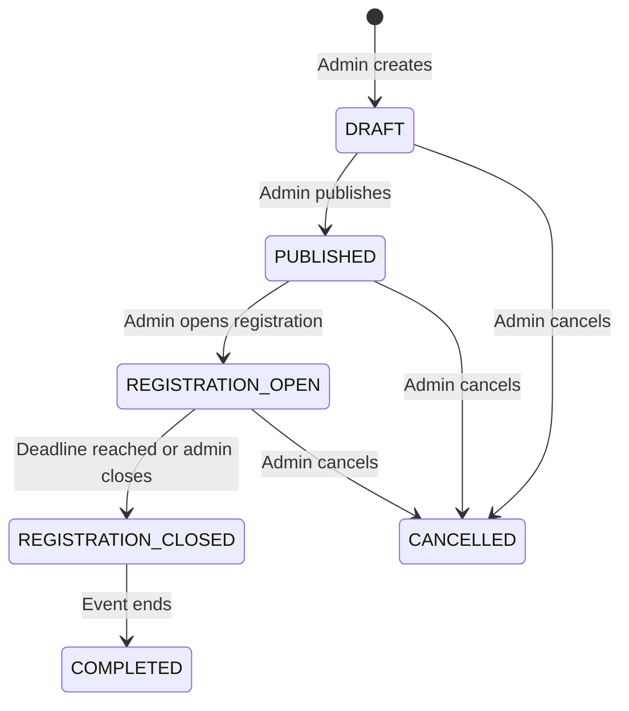

### Event Permissions

| Action | User | Admin |
|--------|------|-------|
| View published events | ✅ | ✅ |
| View draft events | ❌ | ✅ |
| Create event | ❌ | ✅ (audit logged) |
| Edit event | ❌ | ✅ (audit logged) |
| Delete event | ❌ | ✅ (audit logged) |
| Change event status | ❌ | ✅ (audit logged) |
| Register for event | ✅ | ❌ |
| View registrations | ❌ | ✅ |

### Event Slider Boundary and Lifecycle

`EventSlider` is a landing-page content entity, not a replacement for `Event`. It has its own publishing, visibility, ordering, localization, and display scheduling. An optional `event_id` can connect a slide to an Event detail page; standalone slides can use a relative internal CTA or an HTTPS external CTA. Deleting an Event sets `event_id` to `NULL` and does not delete or republish the slide.

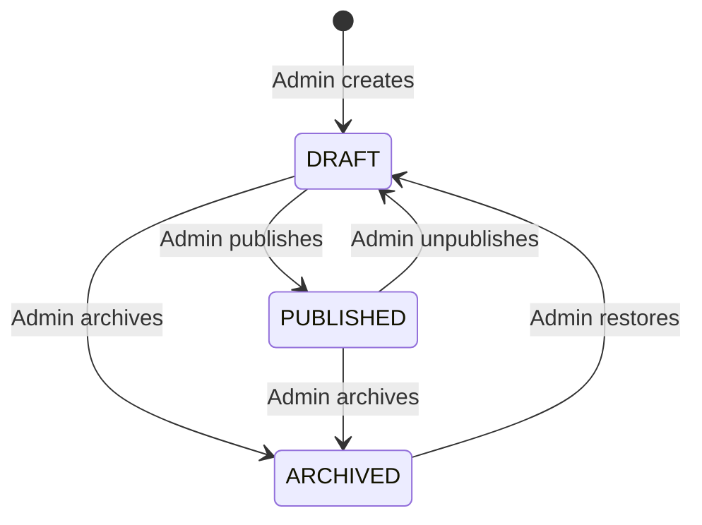

`is_active` is an independent emergency toggle. The public API returns a slide only when it is `PUBLISHED`, active, and inside its optional `display_start_at`/`display_end_at` window.

The public response is localized and does not expose draft metadata or both language columns:

```ts
interface PublicEventSlider {
  id: string
  title: string
  description: string | null
  imageUrl: string
  imageAlt: string
  eventStartAt: string | null
  eventEndAt: string | null
  location: string | null
  cta: { label: string; href: string } | null
  sortOrder: number
}
```

Admin read/write schemas expose both EN/DE variants, status, visibility, display window, optional `event_id`, audit timestamps, and storage metadata required to replace or clean up an image.

### Event Slider Permissions

| Action | Public/User | Admin |
|--------|-------------|-------|
| View active published sliders | ✅ | ✅ |
| View drafts, archived, inactive, or scheduled sliders | ❌ | ✅ |
| Create/edit/delete slider | ❌ | ✅ (audit logged) |
| Publish/unpublish/archive slider | ❌ | ✅ (audit logged) |
| Toggle visibility | ❌ | ✅ (audit logged) |
| Reorder sliders | ❌ | ✅ (transactional + audit logged) |
| Upload/replace slider image | ❌ | ✅ |

### Event Slider Validation and Storage

- Languages are EN/DE only. Both titles and image alt texts are required; descriptions, CTA labels, event dates, and locations are optional but must be complete in both languages when provided.
- Published records require titles of 1–120 characters and image alt texts of 1–200 characters in both languages. Descriptions are limited to 500 characters, locations to 200 characters, and CTA labels to 40 characters per language. Drafts may be incomplete but cannot be published until the full publish schema passes.
- `display_end_at` must be after `display_start_at`; `event_end_at` must be after `event_start_at`.
- CTA accepts a safe relative path or HTTPS URL only. A CTA label requires either `event_id` or `cta_url`; conflicting Event and custom destinations are rejected. When `event_id` is set, the API emits the canonical Event detail URL; legacy static `post/*.html` links are forbidden.
- `sort_order` is a non-negative integer. Reordering is validated and committed in one database transaction.
- Images are stored in the public Supabase Storage bucket `event-slider-images`. Only verified JPEG, PNG, and WebP files up to 5 MB and 4096×4096 are accepted; SVG and MIME/extension mismatches are rejected.
- Replacing or deleting a slider cleans up the superseded object after the database transaction succeeds. A periodic orphan cleanup is retained as a recovery mechanism.

### Event Slider Freshness and Cache Invalidation

- Public responses use revalidation-friendly cache headers and are invalidated after successful Admin mutations.
- TanStack Query keys include locale. Admin mutations invalidate both admin and public Event Slider query families in the current client.
- Public clients refetch on mount, window focus, and every 60 seconds. This provides dynamic updates without source changes or frontend redeployment; real-time WebSocket/Supabase Realtime push is outside MVP scope.
- The Admin UI uses optimistic ordering with rollback on API failure. Create/edit/status/delete operations update only after server confirmation.
- Public UI must provide localized loading, retryable error, and empty states. A failed slider request must not block the rest of the landing page.

### Event Slider End-to-End Acceptance Criteria

- [ ] Admin can create, edit, publish/unpublish/archive, activate/deactivate, reorder, and delete sliders without changing frontend source or redeploying it.
- [ ] Public API requires no authentication and returns only active `PUBLISHED` records inside their display window, ordered by `sort_order` and localized for `locale=en|de`.
- [ ] Admin API returns both language variants and rejects unauthenticated requests with 401 and non-Admin requests with 403.
- [ ] Every successful Admin mutation is recorded in `AUDIT_LOG` with old/new values; reorder is represented as one logical audited operation.
- [ ] Image upload rejects invalid type, MIME mismatch, oversize, and over-dimension files; replacement/deletion does not leave permanent orphan objects.
- [ ] A linked Event can be removed without deleting the slider or breaking Event registration/management; the slider FK becomes `NULL`.
- [ ] Public users see confirmed Admin changes on the next mount/focus or within the 60-second refetch interval, without a source edit or frontend deployment.
- [ ] Loading, error/retry, empty, single-slide, multiple-slide, reduced-motion, and EN/DE behaviors are tested.
- [ ] Production builds contain no development mock records or legacy event-poster assets.

---

## PART 20 — ADMIN DASHBOARD ARCHITECTURE

### 11 Admin Modules

| Module | Path | Purpose |
|--------|------|---------|
| **Overview** | `/admin/dashboard` | Stats cards, quick metrics |
| **Users** | `/admin/users` | View/search/filter users, view profiles |
| **Matching** | `/admin/matching` | Run algorithms, preview, override, history |
| **Events** | `/admin/events` | Full CRUD, status management |
| **Event Sliders** | `/admin/event-sliders` | Localized slider CRUD, image upload, publish/visibility controls, ordering |
| **Announcements** | `/admin/announcements` | Create/publish announcements to target audiences |
| **Knowledge Base** | `/admin/knowledge-base` | Upload/manage RAG documents |
| **Campus** | `/admin/campus` | Manage buildings, rooms, POIs |
| **Analytics** | `/admin/analytics` | Charts for users, matching, events, AI |
| **Audit Log** | `/admin/audit-log` | Searchable log of all admin actions |
| **Settings** | `/admin/settings` | Admin account settings |

### Admin Overview Stats Cards

```
┌──────────────────┬──────────────────┬──────────────────┬──────────────────┐
│  Total Users     │  Active Matches  │  Published Events│  AI Queries Today│
│  142             │  67              │  12              │  89              │
└──────────────────┴──────────────────┴──────────────────┴──────────────────┘
┌──────────────────┬──────────────────┐
│ Unmatched        │ Upcoming Events  │
│ Students: 8      │ 3 this week      │
└──────────────────┴──────────────────┘
```

### Admin UI Design Principles

- **Clean, functional, data-dense** — not flashy
- **Tables with sort/filter/search** for all list views
- **Forms with validation** for all create/edit operations
- **Confirmation dialogs** for destructive actions
- **Loading/empty/error states** on every data view
- **VGU brand colors** but clearly distinguishable from User UI (e.g., darker sidebar, admin badge)
- **Responsive** — works on tablet but optimized for desktop

---

## PART 21 — COMPLETE API PERMISSION MATRIX

### Authentication

| Endpoint | Method | User | Admin | Auth Required |
|----------|--------|------|-------|---------------|
| `/api/auth/register` | POST | ✅ (creates USER) | ❌ | No |
| `/api/auth/login` | POST | ✅ | ✅ | No |
| `/api/auth/refresh` | POST | ✅ | ✅ | Yes (refresh token) |
| `/api/auth/me` | GET | ✅ | ✅ | Yes |
| `/api/auth/change-password` | POST | ✅ | ✅ | Yes |
| `/api/auth/logout` | POST | ✅ | ✅ | Yes |

### Profile

| Endpoint | Method | User | Admin |
|----------|--------|------|-------|
| `/api/profile` | GET | ✅ (own) | ❌ |
| `/api/profile` | PUT | ✅ (own) | ❌ |
| `/api/profile/interests` | PUT | ✅ (own) | ❌ |
| `/api/profile/languages` | PUT | ✅ (own) | ❌ |

### Events

| Endpoint | Method | User | Admin |
|----------|--------|------|-------|
| `/api/events` | GET | ✅ (published only) | ✅ (all statuses) |
| `/api/events/:id` | GET | ✅ (if published) | ✅ |
| `/api/events/:id/register` | POST | ✅ | ❌ |
| `/api/admin/events` | POST | ❌ | ✅ |
| `/api/admin/events/:id` | PUT | ❌ | ✅ |
| `/api/admin/events/:id` | DELETE | ❌ | ✅ |
| `/api/admin/events/:id/status` | PATCH | ❌ | ✅ |
| `/api/admin/events/:id/registrations` | GET | ❌ | ✅ |

### Event Sliders

| Endpoint | Method | Public/User | Admin | Auth Required |
|----------|--------|-------------|-------|---------------|
| `/api/event-sliders?locale=en\|de` | GET | ✅ (active published only) | ✅ | No |
| `/api/admin/event-sliders` | GET | ❌ | ✅ | ADMIN JWT |
| `/api/admin/event-sliders` | POST | ❌ | ✅ | ADMIN JWT |
| `/api/admin/event-sliders/:id` | GET | ❌ | ✅ | ADMIN JWT |
| `/api/admin/event-sliders/:id` | PUT | ❌ | ✅ | ADMIN JWT |
| `/api/admin/event-sliders/:id` | DELETE | ❌ | ✅ | ADMIN JWT |
| `/api/admin/event-sliders/:id/status` | PATCH | ❌ | ✅ | ADMIN JWT |
| `/api/admin/event-sliders/:id/visibility` | PATCH | ❌ | ✅ | ADMIN JWT |
| `/api/admin/event-sliders/reorder` | PATCH | ❌ | ✅ | ADMIN JWT |
| `/api/admin/event-sliders/images` | POST | ❌ | ✅ | ADMIN JWT |

### Matching

| Endpoint | Method | User | Admin |
|----------|--------|------|-------|
| `/api/matching/preferences` | PUT | ✅ (own) | ❌ |
| `/api/matching/my-match` | GET | ✅ (own) | ❌ |
| `/api/matching/respond` | POST | ✅ (own match) | ❌ |
| `/api/matching/feedback` | POST | ✅ | ❌ |
| `/api/admin/matching/run` | POST | ❌ | ✅ |
| `/api/admin/matching/preview` | GET | ❌ | ✅ |
| `/api/admin/matching/override` | POST | ❌ | ✅ |
| `/api/admin/matching/stats` | GET | ❌ | ✅ |
| `/api/admin/matching/history` | GET | ❌ | ✅ |

### AI Assistant

| Endpoint | Method | User | Admin |
|----------|--------|------|-------|
| `/api/assistant/chat` | POST | ✅ | ✅ |
| `/api/assistant/conversations` | GET | ✅ (own) | ❌ |
| `/api/admin/knowledge-base/documents` | GET | ❌ | ✅ |
| `/api/admin/knowledge-base/documents` | POST | ❌ | ✅ |
| `/api/admin/knowledge-base/documents/:id` | DELETE | ❌ | ✅ |
| `/api/admin/knowledge-base/documents/:id/reindex` | POST | ❌ | ✅ |

### Campus

| Endpoint | Method | User | Admin |
|----------|--------|------|-------|
| `/api/campus/locations` | GET | ✅ | ✅ |
| `/api/campus/locations/:id` | GET | ✅ | ✅ |
| `/api/campus/search` | GET | ✅ | ✅ |
| `/api/admin/campus/locations` | POST | ❌ | ✅ |
| `/api/admin/campus/locations/:id` | PUT | ❌ | ✅ |
| `/api/admin/campus/locations/:id` | DELETE | ❌ | ✅ |

### Admin Management

| Endpoint | Method | User | Admin |
|----------|--------|------|-------|
| `/api/admin/users` | GET | ❌ | ✅ |
| `/api/admin/users/:id` | GET | ❌ | ✅ |
| `/api/admin/users/:id/activate` | PATCH | ❌ | ✅ |
| `/api/admin/users/:id/deactivate` | PATCH | ❌ | ✅ |
| `/api/admin/announcements` | GET/POST | ❌ | ✅ |
| `/api/admin/announcements/:id` | PUT/DELETE | ❌ | ✅ |
| `/api/admin/analytics/*` | GET | ❌ | ✅ |
| `/api/admin/audit-log` | GET | ❌ | ✅ |

### Notifications

| Endpoint | Method | User | Admin |
|----------|--------|------|-------|
| `/api/notifications` | GET | ✅ (own) | ✅ (own) |
| `/api/notifications/:id/read` | PATCH | ✅ (own) | ✅ (own) |

---

## PART 22 — AUTHENTICATION ARCHITECTURE ASSESSMENT

### Design: Same Backend, Different Frontend Entry Points

```
/login              →  POST /api/auth/login  →  JWT(role=USER)   →  /user/dashboard
/adminLogin         →  POST /api/auth/login  →  JWT(role=ADMIN)  →  /admin/dashboard

If USER tries /adminLogin:
/adminLogin         →  POST /api/auth/login  →  JWT(role=USER)   →  ❌ Frontend shows "Not authorized as admin"  →  redirect to /
```

> [!IMPORTANT]
> **This is secure because:**
> 1. The backend doesn't care which page the login request came from — it returns the real role
> 2. Frontend checks if `role === "ADMIN"` when on `/adminLogin` — if not, redirects
> 3. Even if user manually navigates to `/admin/*`, the `RoleGuard` blocks rendering
> 4. Even if user calls admin APIs directly, `require_role("ADMIN")` dependency rejects with 403
> 5. `/adminLogin` is NOT a security boundary — it's a UX convenience

---

## PART 23 — ADMIN ACCOUNT CREATION

### Recommended: CLI Seed + Environment Bootstrap

```python
# app/cli.py
@click.command()
@click.option("--email", required=True)
@click.option("--password", prompt=True, hide_input=True)
def create_admin(email: str, password: str):
    """Create an admin account."""
    user = User(
        email=email,
        password_hash=hash_password(password),
        role=UserRole.ADMIN,
        is_active=True,
        email_verified=True,
    )
    db.add(user)
    db.commit()
    print(f"✅ Admin created: {email}")
```

```python
# app/core/startup.py — runs on app boot
async def seed_initial_admin():
    """Create admin from env vars if no admin exists."""
    admin_exists = await db.scalar(select(User).where(User.role == UserRole.ADMIN))
    if not admin_exists:
        email = os.getenv("INITIAL_ADMIN_EMAIL")
        password = os.getenv("INITIAL_ADMIN_PASSWORD")
        if email and password:
            user = User(
                email=email,
                password_hash=hash_password(password),
                role=UserRole.ADMIN,
                is_active=True,
                email_verified=True,
            )
            db.add(user)
            await db.commit()
            logger.info(f"Initial admin created: {email}")
```

> [!NOTE]
> **Future expansion**: Add admin invitation flow where existing ADMIN can invite new admins via email. Not needed at MVP.

---

## PART 24 — NEW MASTER IMPLEMENTATION ORDER

The exact sequence to build the project from scratch is defined by line order and task ID below. Legacy ordinal labels are retained for cross-reference and are not required to remain contiguous after the approved UI-first insertion.

```
Task 1:  FE-001  Initialize React + TypeScript + Vite
Task 2:  FE-002  Configure ESLint + Prettier
Task 3:  FE-003  Configure Tailwind CSS v3 with VGU brand
Task 4:  FE-004  Install shadcn/ui
Task 5:  FE-005  Create design system (buttons, cards, typography)
Task 6:  FE-006  Setup React Router (public/user/admin layouts)
Task 7:  FE-007  Configure environment variables
Task 8:  FE-008  Create folder structure
Task 9:  FE-009  Configure react-i18next (EN/DE)
Task 10: FE-010  Migrate existing translations to JSON
Task 11: FE-011  Create Navbar component
Task 12: FE-012  Create Footer component
Task 13: FE-013  Create Hero section
Task 14: FE-014  Create API-ready Events Slider with development-only mock repository
Task 15: FE-015  Create About section
Task 16: FE-016  Create Benefits grid
Task 17: FE-017  Create Testimonials marquee
Task 18: FE-018  Create CTA section
Task 19: FE-019  Assemble Landing Page
Task 20: FE-020  Create Language Toggle
                 ── Frontend completion remediation ──
Next:    FE-HYGIENE-001  Establish recoverable FE-016..FE-020 baseline
Next:    FE-FIX-001      Fix testimonial clone accessibility
Next:    FE-FIX-002      Fully localize Language Toggle labels/tooltips
Next:    FE-FIX-003      Remove duplicate flag SVG IDs
Next:    FE-FIX-004      Correct Landing integration coverage
Next:    FE-FIX-005      Harden marquee motion and tests
Next:    FE-DEMO-001     Migrate Demo.mp4 and create WebP poster
Next:    FE-DEMO-002     Create accessible Demo Video dialog
Next:    FE-DEMO-003     Connect Watch Demo to the dialog
                 ── UI-only authentication pages (approved before backend) ──
Next:    AUTH-001        Create User Login UI (/login)
Next:    AUTH-002        Create Student Registration UI (/register)
Next:    AUTH-003        Create direct-URL-only Admin Login UI (/adminLogin)
Next:    FE-AUTH-ENTRY-001  Add desktop User Sign in menu
Next:    FE-AUTH-ENTRY-002  Add mobile User auth actions
Next:    FE-AUTH-ENTRY-003  Route Join the Community to /register
Next:    FE-TECH-001        Assess TypeScript strict mode
Next:    FE-VERIFY-001      Run Frontend completion gate
                 ── Frontend UI complete ──
Task 21: BE-001  Initialize FastAPI project
Task 22: BE-002  Create backend project structure
Task 23: BE-003  Configure SQLAlchemy + Alembic
Task 24: BE-004  Setup Supabase PostgreSQL connection
Task 25: BE-005  Create Docker Compose for local dev
Task 26: BE-006  Create base model class (audit fields)
Task 27: BE-007  Configure CORS middleware
                 ── Backend foundation complete ──
Task 28: AUTH-007 Define UserRole enum (USER, ADMIN)
Task 29: AUTH-008 Create User model with role
Task 30: AUTH-009 Create Alembic migration (users table)
Task 31: AUTH-010 Create password hashing service (bcrypt)
Task 32: AUTH-011 Create JWT service (access + refresh tokens)
Task 33: AUTH-012 Create auth service (register, login, verify)
Task 34: AUTH-013 Create POST /api/auth/register (role=USER)
Task 35: AUTH-014 Create POST /api/auth/login (returns JWT+role)
Task 36: AUTH-015 Create POST /api/auth/refresh
Task 37: AUTH-016 Create GET /api/auth/me
Task 38: AUTH-017 Create require_auth dependency
Task 39: AUTH-018 Create require_role(role) dependency
Task 40: AUTH-019 Create admin seed CLI command
Task 41: AUTH-020 Create rate limiting middleware
                 ── Auth backend complete; AUTH-001..AUTH-003 already completed UI-only ──
Task 45: AUTH-004 Create Zustand auth store
Task 46: AUTH-005 Create ProtectedRoute component
Task 47: AUTH-006 Create RoleGuard component
Task 48: AUTH-021 Connect auth store to backend API
Task 49: AUTH-022 Implement user login flow
Task 50: AUTH-023 Implement admin login flow
                 ── Auth UI complete ──
Task 51: FE-021  Create UserLayout (sidebar + content)
Task 52: FE-022  Create User Sidebar navigation
Task 53: FE-023  Create User Dashboard home page
Task 54: FE-024  Create User Settings page
                 ── User dashboard shell complete ──
Task 55: ADMIN-001 Create AdminLayout (sidebar + content)
Task 56: ADMIN-002 Create Admin Sidebar (11 modules)
Task 57: ADMIN-003 Create Admin Dashboard overview
Task 58: ADMIN-004 Create reusable DataTable component
Task 59: ADMIN-005 Create reusable ConfirmDialog
                 ── Admin dashboard shell complete ──
Task 60: BE-008   Create StudentProfile + BuddyProfile models
Task 61: BE-009   Create UserInterest + UserLanguage models
Task 62: BE-010   Create migration for profile tables
Task 63: BE-011   Create profile CRUD service
Task 64: BE-012   Create GET/PUT /api/profile endpoints
Task 65: BE-013   Create GET /api/admin/users endpoint
                 ── Profile backend complete ──
Task 66: FE-025  Profile form Step 1: Basic info
Task 67: FE-026  Profile form Step 2: Interests & Languages
Task 68: FE-027  Profile form Step 3: Availability & Preferences
Task 69: FE-028  Profile view page
Task 70: FE-029  Profile edit page
                 ── Profile UI complete ──
Task 71: EVT-001  Create Event model + status enum
Task 72: EVT-002  Create EventRegistration model
Task 73: EVT-003  Create migration for event tables
Task 74: EVT-004  Create event CRUD service
Task 75: EVT-005  Create GET /api/events (published only)
Task 76: EVT-006  Create POST/PUT/DELETE /api/admin/events
Task 77: EVT-008  Create AuditLog model + service
Task 78: EVT-009  Integrate audit logging into events
                 ── Event backend complete ──
Task 79: EVS-001  Create EventSlider model, status enum, and schemas
Task 80: EVS-002  Create EventSlider migration and indexes
Task 81: EVS-003  Create Supabase image storage service and bucket policy
Task 82: EVS-004  Create EventSlider CRUD/order/publish-window service
Task 83: EVS-005  Create public GET /api/event-sliders
Task 84: EVS-006  Create Admin EventSlider CRUD/status/visibility/reorder/upload APIs
Task 85: EVS-007  Add EventSlider tests, audit coverage, and cache invalidation
                 ── Event Slider backend complete ──
Task 86: ADMIN-006 Admin Events list (DataTable)
Task 87: ADMIN-007 Create Event form
Task 88: ADMIN-008 Edit Event form
Task 89: ADMIN-009 Event status controls
Task 90: ADMIN-010 Delete Event with confirmation
Task 91: ADMIN-012 Admin User Management page
Task 92: ADMIN-013 User detail view
                 ── Admin event + user management complete ──
Task 93: ADMIN-SLIDER-001 Event Slider list and filters
Task 94: ADMIN-SLIDER-002 Event Slider EN/DE form and image upload
Task 95: ADMIN-SLIDER-003 Event Slider status/visibility/delete controls
Task 96: ADMIN-SLIDER-004 Event Slider transactional ordering UI
                 ── Admin Event Slider management complete ──
Task 97: FE-030  User Events list page
Task 98: FE-031  Event detail page
Task 99: FE-032  Event registration button
Task 100: FE-014B Validate live Event Slider API and disable development mock
                 ── MVP 1 COMPLETE ──
                 (Landing + Auth + RBAC + Profiles + Events + Admin-managed Event Sliders)

Task 101+: Matching Backend (MATCH-001..012)
Task 113+: Matching UI (FE-033..037)
Task 118+: Admin Matching (ADMIN-014..018)
Task 123+: RAG Backend (BE-023..029)
Task 130+: RAG UI (FE-035..037)
Task 133+: Admin Knowledge Base (ADMIN-019..022)
Task 137+: Campus Backend + UI
Task 142+: Admin Analytics + Audit Log UI (ADMIN-023..027)
Task 147+: Announcements + Notifications
Task 152+: Research Dashboard
Task 157+: Portfolio Polish
```

---

## Repository Structure (Final)

```
vgu-student-companion/
├── apps/
│   ├── web/                    # React frontend
│   │   ├── src/
│   │   │   ├── assets/
│   │   │   ├── components/
│   │   │   │   ├── ui/         # shadcn/ui
│   │   │   │   ├── layout/     # PublicLayout, UserLayout, AdminLayout
│   │   │   │   └── landing/    # Hero, dynamic Event Slider, About, Benefits, Testimonials, CTA
│   │   │   ├── features/
│   │   │   │   ├── auth/       # Login, Register, AdminLogin, guards
│   │   │   │   ├── events/     # Event + Event Slider contracts, repositories, queries, dev mocks
│   │   │   │   ├── profile/
│   │   │   │   ├── matching/
│   │   │   │   ├── assistant/
│   │   │   │   ├── campus/
│   │   │   │   └── admin/      # All admin module components
│   │   │   ├── hooks/
│   │   │   ├── lib/            # api.ts, utils.ts
│   │   │   ├── locales/        # en/, de/
│   │   │   ├── pages/          # public/, user/, admin/
│   │   │   ├── stores/         # authStore.ts, uiStore.ts
│   │   │   └── types/
│   │   ├── public/
│   │   ├── package.json
│   │   └── vite.config.ts
│   └── api/                    # FastAPI backend
│       ├── app/
│       │   ├── api/
│       │   │   ├── auth.py
│       │   │   ├── profile.py
│       │   │   ├── events.py
│       │   │   ├── event_sliders.py
│       │   │   ├── matching.py
│       │   │   ├── assistant.py
│       │   │   ├── campus.py
│       │   │   ├── notifications.py
│       │   │   └── admin/      # Admin-only endpoints
│       │   │       ├── users.py
│       │   │       ├── events.py
│       │   │       ├── event_sliders.py
│       │   │       ├── matching.py
│       │   │       ├── knowledge_base.py
│       │   │       ├── campus.py
│       │   │       ├── announcements.py
│       │   │       ├── analytics.py
│       │   │       └── audit_log.py
│       │   ├── core/
│       │   │   ├── config.py
│       │   │   ├── security.py   # JWT, hashing, require_auth, require_role
│       │   │   ├── database.py
│       │   │   └── startup.py    # Admin seed on boot
│       │   ├── models/
│       │   │   ├── user.py       # User + UserRole enum
│       │   │   ├── profile.py
│       │   │   ├── event.py
│       │   │   ├── event_slider.py
│       │   │   ├── match.py
│       │   │   ├── document.py
│       │   │   ├── campus.py
│       │   │   ├── notification.py
│       │   │   ├── announcement.py
│       │   │   └── audit_log.py
│       │   ├── schemas/          # Pydantic schemas
│       │   ├── services/
│       │   │   ├── auth.py
│       │   │   ├── profile.py
│       │   │   ├── event.py
│       │   │   ├── event_slider.py
│       │   │   ├── storage.py
│       │   │   ├── matching/
│       │   │   ├── rag/
│       │   │   ├── campus.py
│       │   │   └── audit.py
│       │   ├── cli.py            # create-admin command
│       │   └── main.py
│       ├── alembic/
│       ├── tests/
│       ├── pyproject.toml
│       └── Dockerfile
├── docs/
├── research/
├── scripts/
├── docker-compose.yml
├── .github/workflows/ci.yml
└── README.md
```

---

## OPEN QUESTIONS (Resolved from v1)

| Question | Decision |
|----------|----------|
| Tech stack | ✅ Confirmed: FastAPI + React/TS + Supabase |
| Database | ✅ Supabase managed PostgreSQL + pgvector |
| Repository | ✅ New repository: `vgu-student-companion` |
| Hosting budget | ✅ $0/month with Vercel + Render + Supabase free tiers |
| Vietnamese language | ✅ Not needed. EN/DE only |
| RBAC | ✅ USER + ADMIN roles, integrated throughout |
| Event Slider ownership | ✅ Admin-managed dynamic entity with optional Event link; never production-hard-coded |
| Event Slider freshness | ✅ API-driven; refetch on mount/focus and every 60 seconds; no real-time push in MVP |
| Event Slider storage | ✅ Supabase Storage; JPEG/PNG/WebP, 5 MB, 4096×4096 limits |
