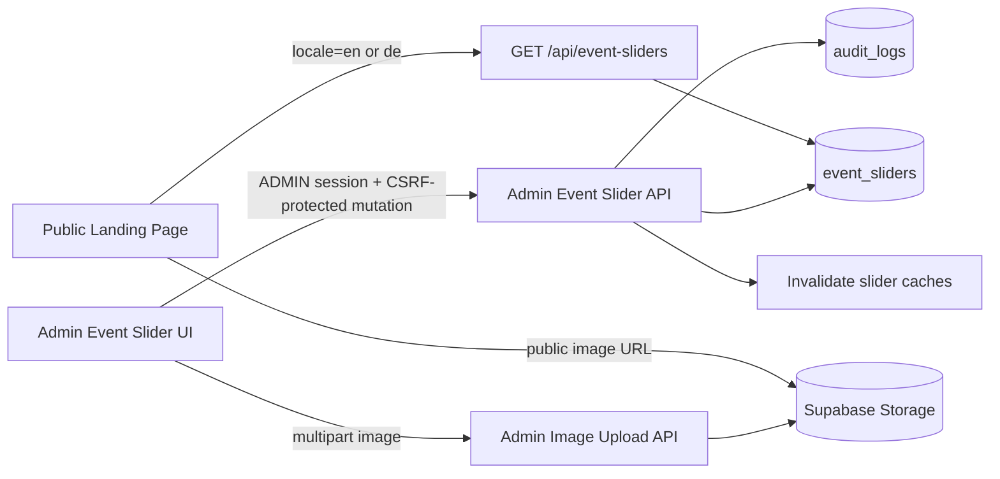
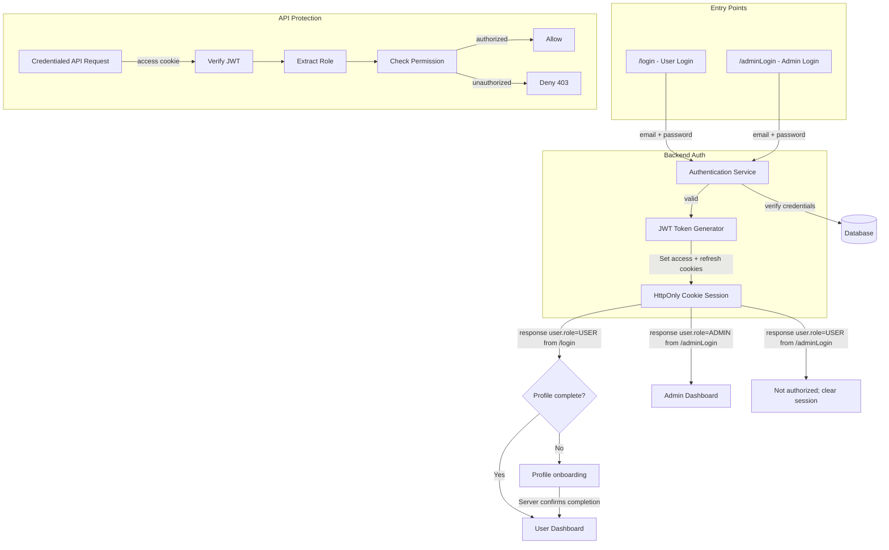
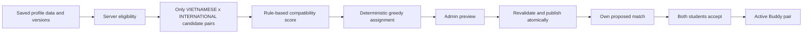
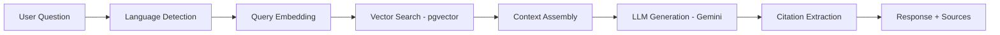
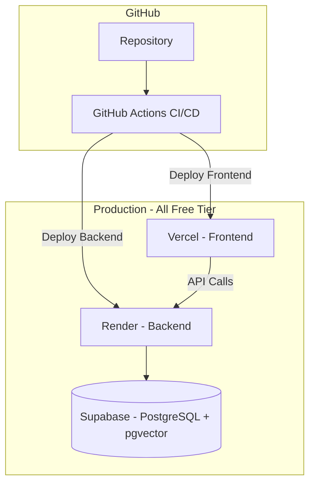
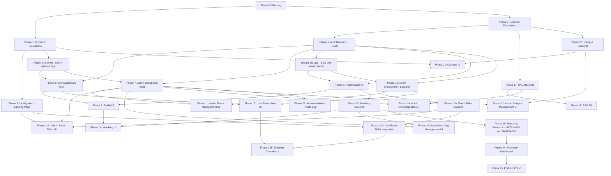
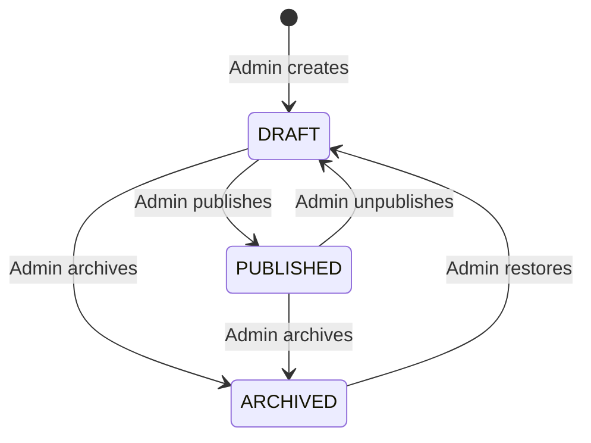

# VGU Student Companion Platform — Complete Implementation Plan v2.2

> **Transforming VGU Buddy Program Website → VGU Student Companion Platform**
> A production-quality student companion system with research-depth in matching algorithms, RAG systems, and interactive campus features.
>
> **v2 Changes**: RBAC architecture (USER/ADMIN) deeply integrated into all layers. Free hosting strategy. EN/DE only.
>
> **v2.1 Changes**: Event Slider is admin-managed dynamic content backed by PostgreSQL/API and Supabase Storage. Frontend mock data is development-only.

---

> **v2.2 — 2026-09-12, planning only:** Source-backed profile/buddy/events audit, unified profile, private media, hard cross-group matching, recap model and task dependencies. See [feature audit](docs/feature-implementation-plan-audit.md). No new runtime feature is implemented by this revision.
>
> **Reading order:** Parts 6–8 and 19 define the updated architecture; Part 16 is the task registry; Part 24 is the execution order; Part 25 supplies full contracts for every new/updated task. Historical completed contracts in Parts 18/18A retain their original status and text.

## PART 1 — LEGACY WEBSITE AUDIT (Historical)

### Current rebuild checkpoint (2026-09-12)

Audited local repository: `buddyWebVer2`, HEAD `fced9f33413aef4dd2c794cce16701bc17fe1440`. The working tree already contains README/documentation edits from another task; they are preserved. Source of truth is this local tree, not an assumed deployed GitHub version.

`apps/web/src/main.tsx` mounts React Router and TanStack Query; `App.tsx` renders real public/auth UI but only unguarded User/Admin placeholders. The auth forms validate then show backend-pending notices. `features/events` implements a production API adapter and development-only six-poster datasource. BE-001 supplies the minimal installable FastAPI project in `apps/api`, BE-002 establishes the `api`, `core`, `models`, `schemas` and `services` package boundaries, BE-003 configures SQLAlchemy 2.0 plus Alembic, BE-004 adds the server-only async PostgreSQL boundary, database health probe and private-schema security migration, BE-005 supplies local PostgreSQL plus pgvector, BE-006 adds the shared declarative model base, and BE-007 enforces an explicit credentialed-CORS boundary; domain models, session-backed business services and the matching engine remain unimplemented. The old `calendar/calendar.html` is a static upcoming-event list; its event articles/gallery are references, not a reusable backend or a completed calendar in the rebuild.

### Current Architecture (Legacy)

| Layer | Technology | Assessment |
|-------|-----------|------------|
| Structure | HTML (single `index.html` ~1600 lines) | ❌ Monolithic, unmaintainable |
| Styling | TailwindCSS CDN + custom CSS (style.css, chatbot.css) | ⚠️ CDN usage = no tree-shaking, no build-time optimization |
| Logic | Vanilla JavaScript (script.js ~726 lines, chatbot.js ~181 lines) | ❌ Global scope pollution, no modules |
| AI | Gemini API via Vercel serverless proxy (api/gemini.js) | ⚠️ Naive prompt-stuffing, no RAG |
| Deployment | Vercel (static + serverless functions) | ✅ Keep for frontend |
| i18n | Manual data-i18n attribute + embedded JSON translations | ⚠️ Functional but not scalable |

### Current Pages & Features

| Page | Status | Notes |
|------|--------|-------|
| Landing page (index.html) | ✅ Well-designed | Hero, Events slider, About, Benefits, Testimonials, CTA, Footer |
| Merchandise (merchandise/) | ✅ Separate page | Product cards with hover effects |
| Calendar (calendar/) | Reference only | Static upcoming-event cards in HTML; no date-grid or event API |
| Event posts (post/*) | ✅ 6 event pages | Halloween, Recruit, Welcome Day, Scavenger, International Day, Go Out Day |
| AI Chatbot | ⚠️ Functional but naive | Loads entire systemPrompt.txt (22KB) into every API call |
| Survival Book | ✅ PDF download | Links to PDF file |

### What to KEEP
- ✅ Brand identity: VGU orange (#FF670D) color palette, dark theme aesthetic
- ✅ Content: Testimonials data, event content, system prompt knowledge base
- ✅ Images: All existing photos, logos, event posters
- ✅ Vercel deployment infrastructure
- ✅ Google Analytics integration (GA4)
- ✅ i18n concept (EN/DE language toggle)

### What to REWRITE
- ❌ Entire HTML → React components
- ❌ Vanilla JS → TypeScript modules
- ❌ CDN Tailwind → build-time Tailwind
- ❌ Manual i18n → react-i18next
- ❌ Naive chatbot → RAG-powered assistant
- ❌ Inline translations → JSON locale files

### What to REMOVE
- ❌ Legacy Gemini API key exposure in tracked chatbot source/history (remediation pending: revoke before future Gemini work)
- ❌ "Technical Support" linking to chatgpt.com
- ❌ `showSignUp()` alert placeholder
- ❌ Cloudflare challenge scripts in HTML

> [!CAUTION]
> **Security remediation TODO (pending):** A Gemini API key was committed in the legacy repository's chatbot source/history and has not yet been revoked. It must never be reused and must be revoked before any future Gemini/chatbot integration. The current `buddyWebVer2` working tree and history contain no detected actual key; keep every replacement credential in ignored server-side environment configuration and out of frontend code, source, documentation and tests.

---

## PART 2 — PRODUCT VISION

### The End State

```
VGU Student Companion Platform
├── 🏠 Public Landing (migrated from current site)
├── 🔐 Dual Auth (User Login + Admin Login)
├── 👤 User Dashboard
│   ├── Student Profiles
│   ├── Buddy Matching
│   ├── AI Assistant
│   ├── Campus Map
│   ├── Events (view)
│   └── Notifications
├── 🛡️ Admin Dashboard
│   ├── User Management
│   ├── Event Management (full CRUD)
│   ├── Event Slider Management (full CRUD + ordering/publishing)
│   ├── Matching Management
│   ├── Knowledge Base Management
│   ├── Campus Management
│   ├── Announcements
│   ├── Analytics
│   └── Audit Logs
└── 🔬 Research Dashboard (Benchmarking)
```

### Core release boundary (v2.2)

MVP 1–4 are delivery increments toward one **core Buddy MVP**, not claims that the earlier landing-only release fulfills buddy matching. MUST HAVE: real auth/RBAC and logout, own profile/type/avatar/interests/languages, server readiness, onboarding, guarded user dashboard, greedy cross-group matching with review/acceptance, admin Event CRUD/media/basic recap, public event detail and live Event Slider. SHOULD HAVE: calendar UI, full recap gallery, numerical progress UI, notifications, advanced filters and internal RSVP. LATER: embeddings, learned weights, solver comparisons, public social feeds, multi-photo profile UI, RAG/campus/gamification. Backend completion rules and calendar query support are required now even when their enhanced UI is deferred.

### Student Journey Map

```mermaid
graph LR
    A[Discover Platform] --> B[Register as User]
    B --> LOGIN[Login]
    LOGIN --> C[Complete Profile and choose student type]
    C --> D[Get Matched with Buddy]
    D --> E[AI Assistant Answers Questions]
    E --> F[Explore Campus Digitally]
    F --> G[View & Join Events]
    G --> H[Give Feedback]
    H --> I[Improve Matching for Future Students]
```



---

## PART 3 — USER PERSONAS

### Persona 1: Exchange Student (Anna, 22, Germany)
- **Role**: USER
- **Goal**: Smooth transition to VGU, find local buddy, understand campus life
- **Pain points**: Language barrier, don't know campus, bureaucratic processes
- **Needs**: Matched buddy, instant answers about visa/dorm, campus navigation

### Persona 2: Local Buddy (Minh, 21, Vietnam)
- **Role**: USER
- **Goal**: Help exchange students, improve English/German, cultural exchange
- **Pain points**: Overwhelming questions, scheduling conflicts
- **Needs**: Compatible match, clear communication, recognition

### Persona 3: Program Coordinator (Thuy, 30, VGU Staff)
- **Role**: ADMIN
- **Goal**: Efficient program management, high satisfaction, data-driven decisions
- **Pain points**: Manual matching, no feedback loop, scattered communication
- **Needs**: Dashboard, matching oversight, event management, analytics

---

## PART 4 — FEATURE ROADMAP

### MVP Strategy & Rationale

| MVP | Focus | Why This Order |
|-----|-------|----------------|
| **MVP 1** | Foundation + UI Migration | Must have working frontend before anything else |
| **MVP 2** | Auth + RBAC + Profiles | Users AND admins must exist before any feature works |
| **MVP 3** | Admin Dashboard + Event and Event Slider Management | Admin must be able to manage events and landing-page promotions without code changes |
| **MVP 4** | Rule-based cross-group Buddy Matching | Required for the first usable Buddy Program; advanced algorithms move to research |
| **MVP 5** | RAG Assistant | Natural extension; reuses profile data infrastructure |
| **MVP 6** | Interactive Campus | Independent feature; can be built after core systems |
| **MVP 7** | Gamification + Social | Engagement layer on top of all systems |

---

## PART 5 — RECOMMENDED TECH STACK (Confirmed)

### Frontend

| Technology | Why This | Why NOT Alternatives |
|-----------|----------|---------------------|
| **React 19 (current manifest)** | Component model, ecosystem, portfolio recognition | Vue/Svelte have smaller job markets |
| **TypeScript** | Type safety, refactoring confidence | JS alone lacks compile-time safety |
| **Vite** | Fast HMR, native ESM, simple config | CRA is deprecated; Next.js overkill for SPA |
| **Tailwind CSS v3** | Already used in current site; utility-first | Vanilla CSS slower for component-based dev |
| **shadcn/ui** | Copy-paste components, highly customizable | MUI/Chakra add heavy bundle |
| **React Router 8 (current manifest)** | Client-side routing, nested layouts | Standard choice for React SPAs |
| **TanStack Query v5** | Server state management, caching | Reuse the already integrated TanStack Query client |
| **Zustand** | Lightweight non-sensitive client state (session status, user, role, UI); never stores JWTs | Redux excessive boilerplate |
| **React Hook Form + Zod** | Performant forms + runtime validation | Formik heavier; Yup lacks TS inference |
| **react-i18next** | i18n with JSON locale files (EN/DE) | Custom solution can't handle plurals |

### Backend

| Technology | Why This |
|-----------|----------|
| **FastAPI (Python)** | AI/ML integration, async, auto-docs |
| **SQLAlchemy 2.0** | Modern async ORM, Alembic migrations |
| **PostgreSQL + pgvector** | Relational + vector search in one DB |
| **Supabase** | Managed PostgreSQL, free tier, pgvector |
| **Alembic** | Database migration version control |
| **Pydantic v2** | Request/response validation, schema generation |

### AI/ML (Later / Research; not required for core MVP)

| Technology | Purpose |
|-----------|---------|
| **Sentence Transformers** (`all-MiniLM-L6-v2`) | Profile + document embeddings |
| **Gemini API** | LLM for RAG generation |
| **RAGAS** | RAG evaluation framework |

### Infrastructure — Free Hosting Strategy

The cost/quota tables below are historical estimates, not verified current guarantees. Recheck provider terms and quotas at deployment; the architecture does not depend on those exact free-tier numbers.

| Service | Plan | Monthly Cost | Tradeoff |
|---------|------|-------------|----------|
| **Vercel** | Hobby (Free) | $0 | Frontend, no limits for personal projects |
| **Render** | Free tier | $0 | Backend spins down after 15min inactivity (cold start ~30s) |
| **Supabase** | Free tier | $0 | 500MB DB, 1GB storage, 50K monthly active users |
| **GitHub Actions** | Free tier | $0 | 2000 min/month CI/CD |
| **Gemini API** | Free tier | $0 | 15 RPM, 1M tokens/day |
| **Total** | | **$0/month** | Cold start on backend is only tradeoff |

> [!TIP]
> **$0/month is achievable.** The only noticeable tradeoff is Render's free tier cold start (~30s after 15min inactivity). For a student project, this is acceptable. Upgrade to Render Starter ($7/month) when you need always-on backend for demos or interviews.

---

## PART 6 — SYSTEM ARCHITECTURE

### Level 1: High-Level System Architecture


### Level 1A: Admin-Managed Event Slider Data Flow



Production frontend code reads slider records only through the public API repository. The local six-slide migration dataset is isolated behind a development-only adapter and is removed by build-time dead-code elimination when `import.meta.env.PROD` is true.

### Level 2: Authentication & Authorization Flow



### Level 3: Frontend Route Architecture

```mermaid
graph TB
    ROOT["/"]

    ROOT --> PUBLIC[Public Routes]
    PUBLIC --> LANDING["/ - Landing Page"]
    PUBLIC --> DETAIL["/events/:id - audience-aware detail and recap"]
    PUBLIC --> LOGIN["/login - User Login"]
    PUBLIC --> REGISTER["/register - User Register"]
    PUBLIC --> ADMIN_LOGIN["/adminLogin - Admin Login"]

    ROOT --> USER[User Protected Routes - role=USER]
    USER --> U_DASH["/user/dashboard"]
    USER --> U_PROFILE["/user/profile"]
    USER --> U_EDIT["/user/profile/edit"]
    USER --> U_ONBOARD["/user/onboarding"]
    USER --> U_CAL["/user/calendar - later"]
    USER --> U_MATCHING["/user/matching"]
    USER --> U_BUDDY["/user/buddy"]
    USER --> U_ASSIST["/user/assistant"]
    USER --> U_CAMPUS["/user/campus"]
    USER --> U_EVENTS["/user/events"]
    USER --> U_SETTINGS["/user/settings"]

    ROOT --> ADMIN[Admin Protected Routes - role=ADMIN]
    ADMIN --> A_DASH["/admin/dashboard"]
    ADMIN --> A_USERS["/admin/users"]
    ADMIN --> A_MATCHING["/admin/matching"]
    ADMIN --> A_EVENTS["/admin/events"]
    ADMIN --> A_EVENT_SLIDERS["/admin/event-sliders"]
    ADMIN --> A_ANNOUNCE["/admin/announcements"]
    ADMIN --> A_KB["/admin/knowledge-base"]
    ADMIN --> A_CAMPUS["/admin/campus"]
    ADMIN --> A_ANALYTICS["/admin/analytics"]
    ADMIN --> A_AUDIT["/admin/audit-log"]
    ADMIN --> A_SETTINGS["/admin/settings"]
```



> [!IMPORTANT]
> **Public authentication entry-point policy**: The public Navbar `Sign in` menu exposes only `/login` (User Login) and `/register` (Create Student Account). `/adminLogin` must not be linked from the Navbar, mobile drawer, Footer, User Login page, or User Registration page. Administrators access `/adminLogin` directly by its known URL. This discoverability decision is not a security boundary; Admin authorization remains enforced by JWT role checks, `RoleGuard`, and backend `require_role("ADMIN")`.

### Level 5: Matching Pipeline



Hard constraints run before scoring and again at persistence, acceptance and manual override. Research algorithms consume the same allowed candidate set later; they cannot bypass the opposite-group rule. No vector index or embedding service is needed to start.

### Level 6: RAG Pipeline



### Level 8: Deployment Architecture



---

## PART 7 — DATABASE DESIGN (Updated with RBAC)

### Core Entity Relationship Diagram

```mermaid
erDiagram
    USER ||--o| STUDENT_PROFILE : has
    STUDENT_PROFILE ||--o{ PROFILE_PHOTO : owns
    STUDENT_PROFILE ||--o{ USER_INTEREST : selects
    INTEREST ||--o{ USER_INTEREST : categorizes
    STUDENT_PROFILE ||--o{ USER_LANGUAGE : speaks
    LANGUAGE ||--o{ USER_LANGUAGE : defines
    STUDENT_PROFILE ||--o{ MATCH : international_participant
    STUDENT_PROFILE ||--o{ MATCH : vietnamese_participant
    EVENT ||--o| EVENT_RECAP : has
    EVENT ||--o{ EVENT_MEDIA : owns
    USER ||--o{ EVENT : manages
    USER ||--o{ EVENT_RECAP : authors
    USER ||--o{ AUDIT_LOG : generates
    USER ||--o{ EVENT_SLIDER : manages
    EVENT o|--o{ EVENT_SLIDER : "optionally promoted by"
    USER {
        uuid id PK
        string email UK
        string password_hash
        enum role "USER | ADMIN"
        boolean is_active
        boolean email_verified
        timestamp last_login
        timestamp created_at
        timestamp updated_at
        timestamp deleted_at
    }

    STUDENT_PROFILE {
        uuid id PK
        uuid user_id FK,UK
        string full_name
        string display_name "nullable"
        enum student_type "VIETNAMESE or INTERNATIONAL; nullable in draft"
        string nationality "optional; not the pairing role"
        string major "nullable"
        int study_year "nullable 1..10"
        text bio "nullable max 500"
        string home_university "optional"
        date arrival_date "optional"
        date departure_date "optional"
        jsonb availability "validated weekly slots + IANA timezone"
        jsonb preferences "validated activity IDs; no sensitive free-form blob"
        boolean matching_opt_in "default false"
        int version "optimistic concurrency"
        timestamp onboarding_completed_at "milestone only; readiness is derived"
        timestamp created_at
        timestamp updated_at
    }

    PROFILE_PHOTO {
        uuid id PK
        uuid profile_id FK
        string bucket
        string object_key UK
        string mime_type
        int byte_size
        int width
        int height
        boolean is_avatar
        enum processing_status "READY or FAILED"
        timestamp created_at
    }

    INTEREST {
        uuid id PK
        string code UK
        string label_en
        string label_de
        string category
        boolean is_active
    }

    USER_INTEREST {
        uuid profile_id PK,FK
        uuid interest_id PK,FK
    }

    LANGUAGE {
        string code PK
        string label_en
        string label_de
        boolean is_active
    }

    USER_LANGUAGE {
        uuid profile_id PK,FK
        string language_code PK,FK
        enum proficiency "native or fluent or intermediate or beginner"
    }

    MATCH {
        uuid id PK
        uuid student_id FK "INTERNATIONAL profile"
        uuid buddy_id FK "VIETNAMESE profile"
        float score
        jsonb score_breakdown
        enum status "proposed | accepted | rejected | active | completed"
        string algorithm_used
        boolean is_manual_override
        uuid overridden_by FK "admin user_id if manual"
        timestamp matched_at
        timestamp accepted_at
        enum student_response "pending or accepted or rejected"
        enum buddy_response "pending or accepted or rejected"
        int version
        uuid run_id FK
        int student_profile_version
        int buddy_profile_version
        string weights_version
    }

    MATCH_FEEDBACK {
        uuid id PK
        uuid match_id FK
        uuid user_id FK
        int rating
        text comment
        jsonb survey_data
        timestamp created_at
    }

    EVENT {
        uuid id PK
        string title_en
        string title_de
        text description_en
        text description_de
        timestamptz start_date
        timestamptz end_date
        string timezone "default Asia/Ho_Chi_Minh"
        string location_en
        string location_de
        string category
        string organizer
        string registration_url "nullable HTTPS"
        uuid cover_media_id FK "nullable while draft"
        enum status "DRAFT or PUBLISHED or CANCELLED"
        enum visibility "PUBLIC or MEMBERS"
        boolean registration_enabled "default false; later internal RSVP"
        int max_participants "nullable; internal RSVP only"
        timestamptz registration_deadline "nullable"
        uuid created_by FK
        uuid updated_by FK
        timestamptz published_at
        int version
        timestamptz created_at
        timestamptz updated_at
    }

    EVENT_RECAP {
        uuid id PK
        uuid event_id FK,UK
        string title_en
        string title_de
        text summary_en
        text summary_de
        text content_en
        text content_de
        jsonb highlights "optional EN/DE text lists"
        int participant_count "optional aggregate; never attendee names"
        uuid cover_media_id FK
        enum status "DRAFT or PUBLISHED"
        uuid author_id FK
        timestamptz published_at
        int version
        timestamptz created_at
        timestamptz updated_at
    }

    EVENT_MEDIA {
        uuid id PK
        uuid event_id FK
        string bucket
        string object_key UK
        enum usage "EVENT_COVER or RECAP_COVER or RECAP_GALLERY"
        string alt_en
        string alt_de
        string mime_type
        int byte_size
        int width
        int height
        int sort_order
        enum processing_status "READY or FAILED"
        uuid created_by FK
        timestamptz created_at
    }

    EVENT_REGISTRATION {
        uuid id PK
        uuid event_id FK
        uuid user_id FK
        timestamp registered_at
        enum status "registered | cancelled | attended"
    }

    EVENT_SLIDER {
        uuid id PK
        uuid event_id FK "nullable; ON DELETE SET NULL"
        string title_en
        string title_de
        text description_en "nullable"
        text description_de "nullable"
        string image_url
        string image_alt_en
        string image_alt_de
        timestamp event_start_at "nullable"
        timestamp event_end_at "nullable"
        string location_en "nullable"
        string location_de "nullable"
        string cta_label_en "nullable"
        string cta_label_de "nullable"
        string cta_url "nullable; relative or HTTPS"
        enum status "DRAFT | PUBLISHED | ARCHIVED"
        boolean is_active
        int sort_order
        timestamp display_start_at "nullable"
        timestamp display_end_at "nullable"
        uuid created_by FK "admin user_id"
        uuid updated_by FK "admin user_id"
        timestamp created_at
        timestamp updated_at
    }

    ANNOUNCEMENT {
        uuid id PK
        string title
        text content
        enum priority "LOW | NORMAL | HIGH | URGENT"
        enum target_audience "ALL_USERS | EXCHANGE_STUDENTS | BUDDIES"
        timestamp publish_date
        timestamp expiration_date
        enum status "DRAFT | PUBLISHED | EXPIRED"
        uuid created_by FK
        timestamp created_at
        timestamp updated_at
    }

    DOCUMENT {
        uuid id PK
        string title
        string source_url
        string category
        string language
        text content
        enum status "UPLOADED | PROCESSING | INDEXED | FAILED"
        uuid uploaded_by FK "admin user_id"
        timestamp created_at
    }

    DOCUMENT_CHUNK {
        uuid id PK
        uuid document_id FK
        text content
        int chunk_index
        vector embedding "pgvector 384-dim"
        jsonb metadata
    }

    CAMPUS_LOCATION {
        uuid id PK
        string name
        enum type "building | room | service | poi"
        string building
        int floor
        float x_coord
        float y_coord
        text description
        string opening_hours
        string image_url
        jsonb metadata
        uuid created_by FK
        timestamp created_at
        timestamp updated_at
    }

    CONVERSATION {
        uuid id PK
        uuid user_id FK
        string title
        timestamp created_at
    }

    CHAT_MESSAGE {
        uuid id PK
        uuid conversation_id FK
        enum role "user | assistant"
        text content
        jsonb sources
        float latency_ms
        int tokens_used
        timestamp created_at
    }

    AUDIT_LOG {
        uuid id PK
        uuid admin_id FK
        string action
        string resource_type
        uuid resource_id
        jsonb old_value "nullable"
        jsonb new_value "nullable"
        jsonb metadata
        timestamp created_at
    }

    NOTIFICATION {
        uuid id PK
        uuid user_id FK
        string title
        text message
        enum type "match | event | announcement | system"
        boolean is_read
        jsonb metadata
        timestamp created_at
    }
```



### Key Design Decisions

| Decision | Rationale |
|----------|-----------|
| `role` as enum on User | Simple, extensible to `SUPER_ADMIN \| MODERATOR` later |
| `is_manual_override` on Match | Admin vs algorithm transparency |
| `created_by` / `updated_by` on Event | Track which admin modified what |
| `AUDIT_LOG` table | Every admin mutation is logged with old/new values |
| Event editorial status and derived phase | DRAFT/PUBLISHED/CANCELLED are admin-controlled; UPCOMING/ONGOING/COMPLETED derive from timestamps |
| Event Slider as a separate entity | Keeps landing-page promotion independent from Event registration and lifecycle management |
| Nullable `event_id` on Event Slider | Internal canonical Event projection or standalone promotion; deleting Event sets FK NULL and affected slide DRAFT/no CTA atomically |
| `status` plus `is_active` on Event Slider | Separates editorial publish workflow from an emergency visibility toggle |
| EN/DE columns on Event Slider | Matches the confirmed product languages; Vietnamese is not part of v2.1 |
| `target_audience` on Announcement | Selective notification delivery |
| Soft delete via `deleted_at` | Operational recovery only; not proof of legal compliance; retention/erasure needs a defined policy |

### Profile, readiness and privacy contract (v2.2)

- Replace the two unimplemented StudentProfile/BuddyProfile designs with one profile per USER. This avoids duplicated name/bio/language rules and ambiguous users owning both roles. `student_type` is self-selected program participation type: `VIETNAMESE` seeks an International Buddy and `INTERNATIONAL` seeks a Vietnamese Buddy. It is not authorization and is not inferred from nationality or UI language. Both are USER accounts; ADMIN has no automatic matching profile. No gender field is collected for MVP.
- Required for COMPLETE: trimmed `full_name` (1–120 chars), explicit student_type, one processed private avatar, 1–20 valid interests, 1–10 languages with proficiency. Bio, display name (1–80), major/year, nationality, availability and activities are optional. Percentage = completed required groups / 5 × 100; completion is derived, never accepted from a client. `onboarding_completed_at` is a historical milestone, not an authorization flag. Removing a required field makes the profile incomplete immediately.
- Eligibility for a new pairing additionally requires active, non-deleted USER, explicit `matching_opt_in`, and no proposed/accepted/active reservation. Do not add an email-verification gate without delivering that workflow. Readiness API returns `{status, percentage, missing_fields, matching_eligible, reasons}`; reason codes are localized by frontend. API errors retain the existing `{detail: ...}` envelope.
- Registration keeps email/password/consent only and redirects to login after backend success. Login and reload first resolve `/auth/me`, then readiness. Incomplete users enter `/user/onboarding`; complete users enter `/user/dashboard`. Profile editing, logout/settings and allowed events remain reachable. ADMIN bypasses onboarding. Invalid session and temporary profile-service failure are distinct states.
- Interests and hobbies share an extensible Interest catalog (including all examples in the brief); Language uses stable codes and proficiency. Admin taxonomy UI is deferred; a documented idempotent backend seed/import expands data without frontend changes. Availability is validated JSON weekly slots, ISO weekday, minutes from midnight, timezone; overnight slots split across days. Preferred activities reference catalog IDs. No duplicate preferences storage: FE-033 writes the own-profile API.
- Type changes are allowed before matching; any proposed/accepted/active pair blocks type changes with 409 until coordinator ends/reassigns the match. Use the same profile row lock for type edits, opt-out and match publication. Existing active buddies may still view their relationship after optional edits; incomplete/opted-out profiles cannot enter a new pair. Declining a proposal is always allowed for the participant.
- Owner can read/update only their profile; coordinator can read minimal list and audited detail via admin endpoints, not edit arbitrary profiles. Safe buddy card is available only through own-match data: display name (fallback full name), bio, type, major/year, interests, languages, optional nationality and authorized avatar. No account email, contact information, exact schedule, raw preferences, credentials or signed URLs in logs. No public profile directory in MVP.
- Unique `user_id`, unique profile/interest and profile/language pairs, one avatar per profile, FK media ownership and appropriate reverse catalog indexes are enforced by migration. `Match` references profiles, not ambiguous user/buddy records; live-participant uniqueness and opposite-type validation apply on all writes. Service and DB trigger lock both profiles in stable ID order before checking reservations; profile type changes use the same invariant. MatchingRun (schema in MATCH-001, orchestration in MATCH-008) stores id, creator, algorithm/weights versions, candidate profile versions, proposal JSON, status, created_at and expires_at; expires after 24 hours, and any candidate/version change requires rerun.

### Event and recap relationship decision (v2.2)

Choose **Option A: Event + optional EventRecap (1:0..1)**. An Event remains the scheduling source; a recap needs independent draft/publish content after the event. One small related row is simpler than merging scheduling and recap publication flags into Event. EventMedia belongs to Event and can serve its cover or recap. EventRecap inherits Event visibility and date; no duplicate event schedule or attendee directory. Event status is editorial; time phase is derived. Location is localized text in MVP, so events do not wait for Campus schema.

### Indexes

```sql
CREATE INDEX idx_user_email ON users(email);
CREATE INDEX idx_user_role ON users(role);
CREATE INDEX idx_user_active ON users(is_active);
CREATE INDEX idx_match_student ON matches(student_id);
CREATE INDEX idx_match_buddy ON matches(buddy_id);
CREATE INDEX idx_match_status ON matches(status);
CREATE INDEX idx_event_status ON events(status);
CREATE INDEX idx_event_date ON events(start_date);
CREATE INDEX idx_event_slider_public
  ON event_sliders(status, is_active, display_start_at, display_end_at, sort_order);
CREATE INDEX idx_event_slider_event ON event_sliders(event_id);
CREATE INDEX idx_announcement_status ON announcements(status, publish_date);
CREATE INDEX idx_audit_admin ON audit_logs(admin_id, created_at);
CREATE INDEX idx_audit_resource ON audit_logs(resource_type, resource_id);
CREATE INDEX idx_notification_user ON notifications(user_id, is_read);
-- Later RAG/research only; not a Backend/Profile/Matching MVP prerequisite.
CREATE INDEX idx_document_chunk_embedding ON document_chunks
  USING ivfflat (embedding vector_cosine_ops) WITH (lists = 100);
```

---

## PART 8 — MATCHING SYSTEM

### Algorithm Comparison Strategy

| Algorithm | Approach | Strengths | Weaknesses |
|-----------|----------|-----------|------------|
| **Random** | Random assignment | Baseline benchmark | No quality guarantee |
| **Greedy** | Best pair first | Fast, simple | Local optima |
| **Gale-Shapley** | Stable matching | Guarantees stability | Only optimizes one side |
| **Hungarian** | Optimal assignment | Global optimum | O(n³), only 1:1 |
| **CSP/ILP** | Constraint satisfaction | Handles all constraints | Requires solver |
| **Embedding-based** | Semantic similarity | Captures nuance | Needs training data |
| **Hybrid** | Embedding → ILP | Best of both worlds | Complex pipeline |

### Compatibility Scoring — MVP contract

First load canonical eligible profiles and form only VIETNAMESE × INTERNATIONAL candidate pairs (MATCH-007). Score normalized catalog IDs and structured preferences, never auth fields or a separate mock profile store.

| Signal | Initial weight | Rule (0..1) |
|--------|----------------|-------------|
| Interests/hobbies | 0.40 | Jaccard overlap of Interest IDs |
| Languages | 0.25 | Maximum shared-language minimum proficiency; beginner=.25, intermediate=.5, fluent=.75, native=1 |
| Weekly availability | 0.15 | Overlap / union of normalized slots for the run's UTC reference week |
| Major | 0.10 | Case/whitespace-normalized equality; 0 otherwise |
| Preferred activities | 0.10 | Jaccard overlap of selected catalog IDs |

If either side lacks an optional signal, omit that signal and renormalize available weights; do not invent a positive match or silently penalize a skipped optional step. Required interest/language signals are always evaluated. Score = 100 × normalized weighted sum; expose rounded value but sort by full precision and then stable profile IDs. Store signal breakdown, reference week, profile versions, algorithm and weights version in the run/match. Initial weights are product defaults to evaluate, not empirically proven compatibility probabilities. Low score does not override constraints; no additional language/gender/nationality hard rule is introduced.

MVP: deterministic greedy, 1:1 reservation, coordinator preview → explicit atomic publish → proposed → one accept remains proposed → both accept active; rejection releases the reservation. Research: MATCH-005/006 stable/optimal comparisons, followed by embeddings/hybrid and feedback learning after opt-in data/evaluation exist. No ML infrastructure is required to release basic matching.

### Admin Matching Controls

- Admin can trigger algorithm execution via `/api/admin/matching/run`
- Admin can preview results before publishing to users; publish revalidates profile versions and eligibility atomically
- Admin can manually override a match only after the same eligibility/opposite-type/reservation checks, with reason and audit trail
- Admin can view algorithm vs manual match distinction
- Admin can reassign buddies with reason logged

---

## PART 9 — RAG SYSTEM

### Knowledge Base Management (Admin-Controlled)

| Action | Who | Endpoint |
|--------|-----|----------|
| Upload document | ADMIN | `POST /api/admin/knowledge-base/documents` |
| Delete document | ADMIN | `DELETE /api/admin/knowledge-base/documents/:id` |
| Re-index document | ADMIN | `POST /api/admin/knowledge-base/documents/:id/reindex` |
| View all documents | ADMIN | `GET /api/admin/knowledge-base/documents` |
| Ask question | USER | `POST /api/assistant/chat` |
| View conversations | USER | `GET /api/assistant/conversations` |

### Pipeline

```
User Question → Embedding → pgvector Search (top-5) → Context Assembly → Gemini API → Citation Extraction → Response
```

### Hallucination Mitigation
- System prompt: "Only answer based on provided context"
- Every claim must reference a chunk
- "I couldn't find this in the knowledge base" for unknowns
- Show retrieved source documents to user

---

## PART 10 — VIRTUAL CAMPUS

### MVP: 2D Interactive SVG Map

- Interactive SVG campus map with clickable buildings
- Search buildings/services/rooms
- Info panel: rooms, services, hours
- Basic pathfinding between buildings (A* on graph)

### Admin Campus Controls
- Add/edit/delete buildings, rooms, facilities, POIs
- Upload building images
- Set opening hours
- Manage point-of-interest categories

> [!NOTE]
> 3D rendering (Three.js), real-time multiplayer (WebSocket), and gamified exploration are DEFERRED.

---

## PART 11 — SECURITY & GDPR (Updated with RBAC)

### Authentication Architecture

```
┌─────────────────────────────────────────────────┐
│                   Platform                       │
└────────────────────┬────────────────────────────┘
                     │
          ┌──────────┴──────────┐
          │                     │
      USER LOGIN            ADMIN LOGIN
          │                     │
          ↓                     ↓
     /login                /adminLogin
          │                     │
          ↓                     ↓
   Same Auth Endpoint      Same Auth Endpoint
   POST /api/auth/login    POST /api/auth/login
          │                     │
          ↓                     ↓
   HttpOnly JWT cookies    HttpOnly JWT cookies
   + user.role=USER        + user.role=ADMIN
          │                     │
          ↓                     ↓
   → /user/dashboard       → /admin/dashboard
```

> [!IMPORTANT]
> Both `/login` and `/adminLogin` call the **same backend endpoint** (`POST /api/auth/login`). The backend sets access and refresh JWTs only as HttpOnly cookies and returns a sanitized `user` object containing the role; it never returns either token in the JSON body. The frontend routes from `user.role`, while backend authorization independently verifies the access cookie on every protected request. If a USER logs in at `/adminLogin`, the frontend calls logout to clear the newly issued session, shows "not authorized", and redirects to `/`.

### Three Layers of Protection

```
Layer 1: Frontend Route Guards
  → ProtectedRoute (must be authenticated)
  → RoleGuard (must have correct role)
  → Redirect unauthorized users

Layer 2: Backend Authorization Middleware
  → Verify JWT on every request
  → Extract role from token
  → Check permission for endpoint
  → Reject with 403 if unauthorized

Layer 3: Database Constraints
  → Role enum enforced at DB level
  → Foreign keys prevent orphaned data
  → Audit log captures all admin actions
```

### Security Implementation

| Concern | Implementation |
|---------|---------------|
| Password hashing | bcrypt (12 rounds) |
| JWT access token | 15-minute expiry; `HttpOnly`, `Secure`, `SameSite=Lax`, `Path=/` cookie in production |
| JWT refresh token | 7-day expiry; `HttpOnly`, `Secure`, `SameSite=Lax`, `Path=/` cookie; rotate on every use and reject reuse |
| RBAC | `require_role("ADMIN")` FastAPI dependency |
| IDOR prevention | Always filter queries by `current_user.id` for user routes |
| Privilege escalation | Role can only be set via DB seed/CLI, never via API |
| Rate limiting | slowapi: 60 req/min for users, 120 req/min for admins |
| SQL injection | SQLAlchemy parameterized queries |
| XSS | React auto-escaping + CSP headers |
| CSRF | Signed session-bound double-submit token in `X-CSRF-Token`, plus exact Origin/Referer validation; SameSite is defense in depth |
| Prompt injection | Input sanitization, system prompt isolation |
| Admin login brute force | 5 failed attempts → 15-minute lockout |

### Approved Authentication Transport Contract (`AUTH-ARCH-001`)

- **Transport**: JWT access and refresh tokens are stored only in backend-set HttpOnly cookies. The API never returns tokens in JSON, and frontend JavaScript never reads, persists, or sends bearer tokens.
- **Cookie policy**: Production uses `Secure`, `HttpOnly`, `SameSite=Lax`, and `Path=/`; omit `Domain` and use a `__Host-` cookie prefix when the final deployment host supports it. Local HTTP development may use explicitly named non-`__Host-`, non-`Secure` development cookies only.
- **Frontend state**: Zustand holds only `status: unknown | loading | authenticated | unauthenticated`, a sanitized `user`, and `role`. It has no `token` or `refreshToken` field and is not persisted to Web Storage. `/api/auth/me` restores the session after reload.
- **Route guards**: `ProtectedRoute` and `RoleGuard` show a neutral pending state while session status is `unknown` or `loading`; they redirect only after `/api/auth/me` resolves, preventing reload-time redirect flicker.
- **API client**: All API calls use a single client configured with `credentials: "include"`. A 401 may trigger one single-flight refresh attempt and one request retry; refresh failure clears in-memory session state and redirects through the normal unauthenticated flow.
- **CSRF**: `GET /api/auth/csrf` establishes a pre-auth CSRF context and returns a signed double-submit value; successful login rotates it and binds the replacement to the refresh session. The readable CSRF value is held in memory and sent as `X-CSRF-Token` on every state-changing request, including register, login, refresh, logout, uploads, and Admin mutations. The backend also validates `Origin`/`Referer`; safe methods never change state.
- **CORS/deployment**: Production must expose the API on the same site as the frontend, preferably through a Vercel `/api` reverse proxy to Render or an equivalent first-party API host. Credentialed CORS uses an explicit origin allowlist and explicit methods/headers—never `*`. Frontend environment configuration points to the same-site API boundary.
- **RBAC boundary**: Frontend `RoleGuard` is UX only. Every protected backend route derives identity and role solely from the verified access-cookie JWT and enforces `require_auth`/`require_role`; no role value supplied by the client is trusted.
- **Cache/logout**: Auth responses use `Cache-Control: no-store`. Logout revokes/invalidates the refresh session, clears both auth cookies and the CSRF cookie, and clears the frontend session state.

### Admin Account Creation

> [!IMPORTANT]
> **Admin accounts cannot be self-registered.** Admin creation is done exclusively through:

**Recommended approach**: CLI seed command during deployment.

```bash
# Create initial admin (run once during deployment)
python -m app.cli create-admin --email admin@vgu.edu.vn --password <secure>

# Or via environment variable for first boot
INITIAL_ADMIN_EMAIL=admin@vgu.edu.vn
INITIAL_ADMIN_PASSWORD=<secure>
```

The app checks on startup: if no ADMIN exists and env vars are set, create one. This is simple, secure, and appropriate for a student project. Future expansion can add admin invitation flows.

### GDPR Compliance

These are planned privacy controls, not a verified legal-compliance claim. Full erasure/export workflows require scoped later tasks before being advertised; the core profile release must still enforce minimization, ownership, private images and removal/replacement.

- Explicit consent checkbox at registration
- Data minimization: only necessary profile fields
- Right to access: user can export data (JSON)
- Right to deletion: soft delete + hard delete after 30 days
- Admin audit log tracks all data access

---

## PART 12 — TESTING STRATEGY

| Layer | Tool | Scope |
|-------|------|-------|
| Frontend Unit | Vitest | Utility functions, hooks, role guards |
| Frontend Component | Vitest + React Testing Library | Components, role-based rendering |
| Frontend E2E | Playwright | User login flow, Admin login flow, permission checks |
| Backend Unit | pytest | Services, algorithms, role verification |
| Backend API | pytest + HTTPX2 | Endpoint contracts, 403 for unauthorized; HTTPX2 is the current Starlette-supported successor to HTTPX |
| Backend Auth | pytest | JWT generation, role extraction, permission denial |
| Backend Integration | pytest + testcontainers | Database + auth + RBAC integration |
| AI Retrieval | RAGAS | Precision, Recall, MRR |
| Matching | pytest + synthetic data | Algorithm correctness, constraints |

### Critical Auth Test Cases

```
✅ User can login at /login → auth cookies set; response and /auth/me report USER
✅ User cannot access /admin/* routes → 403
✅ User cannot call POST /api/admin/* → 403
✅ Admin can login at /adminLogin → auth cookies set; response and /auth/me report ADMIN
✅ Admin can access /admin/* routes
✅ User at /adminLogin → redirected with "not authorized"
✅ Expired JWT → 401
✅ Tampered JWT → 401
✅ Missing JWT → 401
✅ Role claim cannot be modified by client
✅ Login/refresh JSON never exposes access or refresh JWT
✅ Zustand/localStorage/sessionStorage never contains access or refresh JWT
✅ Missing/invalid CSRF header on state-changing request → 403
✅ Credentialed CORS accepts allowlisted frontend origin and rejects unknown origins
✅ Refresh token rotation rejects reuse; logout clears cookies and invalidates refresh session
```

---

## PART 13 — DEVOPS

### Git Workflow (Solo Developer)

```
main (production)
  └── feature branches
        ├── feat/foundation
        ├── feat/auth-rbac
        ├── feat/admin-dashboard
        ├── feat/matching
        └── feat/rag
```

### CI/CD Pipeline (GitHub Actions)

```yaml
# On every push:
- Lint (ESLint + Ruff)
- Type check (tsc + mypy)
- Unit tests (Vitest + pytest)
- Build check

# On merge to main:
- All above + E2E tests
- Deploy frontend to Vercel
- Deploy backend to Render
```

### Hosting: $0/month Strategy

| Service | What | Free Tier Limits |
|---------|------|-----------------|
| **Vercel** | Frontend | Unlimited for personal, 100GB bandwidth |
| **Render** | Backend (Docker) | 750 hours/month, sleeps after 15min idle |
| **Supabase** | PostgreSQL + pgvector | 500MB DB, 1GB file storage, 50K MAU |
| **GitHub Actions** | CI/CD | 2000 min/month |
| **Gemini API** | LLM | 15 RPM, 1M tokens/day |

> [!TIP]
> When Render cold starts (~30s), add a loading indicator on the frontend. For interview demos, hit the API 1 minute before to "warm up" the server.

---

## PART 14 — RESEARCH PLAN

| RQ | Question | Metrics |
|----|----------|---------|
| RQ1 | Does hybrid optimization matching outperform greedy/stable matching? | Avg compatibility, constraint violations, stability |
| RQ2 | Do embedding-based semantic profiles improve match quality? | Satisfaction score, acceptance rate |
| RQ3 | Does hybrid retrieval improve RAG accuracy over dense-only? | Precision@5, Recall@5, MRR |
| RQ4 | How does local LLM compare to cloud LLM for student Q&A? | Accuracy, latency, cost, groundedness |
| RQ5 | Does structured onboarding improve student preparedness? | Task completion rate |
| RQ6 | Can feedback-weighted learning improve matching weights? | Score improvement over baseline |
| RQ7 | Does multilingual embedding outperform translate-then-embed? | Cross-language retrieval accuracy |

---

## PART 15 — COMPLETE IMPLEMENTATION ROADMAP (Updated)

> [!IMPORTANT]
> Phase numbers group parallel workstreams; they are not the canonical single-developer execution sequence. **PART 24 — NEW MASTER IMPLEMENTATION ORDER is authoritative.** The Frontend completion and AUTH-ARCH-001 gates plus BE-001 through BE-007 are recorded complete; AUTH-007 is the next implementation task. Parts 18/18A remain historical evidence, not a request to redo completed UI. FE-014 builds against the approved API contract with a development-only mock, while EVS-001 through EVS-007, ADMIN-SLIDER-001 through ADMIN-SLIDER-004, and FE-014B later activate end-to-end Admin-managed production content.

### Dependency Graph



### Phase Timeline — historical estimates (not current commitments)

The original counts/hours below predate added auth, media and recap work and are retained only as historical estimates. The task registry and dependency-driven order in Parts 16/24 govern v2.2. Re-estimate each pending task when scheduling; do not use the ~165/~327 totals as the updated forecast.

| Phase | Name | Tasks | Hours | Weeks (10h/wk) | Priority |
|-------|------|-------|-------|-----------------|----------|
| 0 | Planning & Design | 5 | 8 | 0.8 | P0 |
| 1 | Frontend Foundation | 10 | 15 | 1.5 | P0 |
| 2 | Backend Foundation | 7 | 12 | 1.2 | P0 |
| 3 | UI Migration (Landing) | 10 | 20 | 2.0 | P0 |
| 4 | Auth UI (User + Admin Login) | 6 | 10 | 1.0 | P0 |
| 5 | Auth Backend + RBAC | 10 | 18 | 1.8 | P0 |
| 6 | User Dashboard Shell | 4 | 6 | 0.6 | P0 |
| 7 | Admin Dashboard Shell | 5 | 8 | 0.8 | P0 |
| 8 | Profile Backend | 5 | 8 | 0.8 | P0 |
| 9 | Profile UI | 5 | 10 | 1.0 | P0 |
| 10 | Event Management Backend | 6 | 10 | 1.0 | P0 |
| 10A | Event Slider Backend | 7 | 14 | 1.4 | P0 |
| 11 | Admin Event Management UI | 8 | 14 | 1.4 | P0 |
| 11A | Admin Event Slider UI | 4 | 8 | 0.8 | P0 |
| 12 | User Event View UI | 3 | 5 | 0.5 | P1 |
| 12A | Live Event Slider Integration | 1 | 2 | 0.2 | P0 |
| 13 | Matching Backend | 10 | 22 | 2.2 | P1 |
| 14 | Matching UI | 6 | 12 | 1.2 | P1 |
| 15 | Admin Matching Management | 5 | 8 | 0.8 | P1 |
| 16 | Matching Research | 8 | 25 | 2.5 | P2 |
| 17 | RAG Backend | 8 | 20 | 2.0 | P1 |
| 18 | RAG UI | 4 | 8 | 0.8 | P1 |
| 19 | Admin Knowledge Base UI | 4 | 8 | 0.8 | P1 |
| 20 | Campus Backend | 4 | 8 | 0.8 | P2 |
| 21 | Campus UI | 4 | 10 | 1.0 | P2 |
| 22 | Admin Campus Management | 4 | 6 | 0.6 | P2 |
| 23 | Admin Analytics + Audit | 5 | 10 | 1.0 | P1 |
| 24 | Research Dashboard | 4 | 10 | 1.0 | P2 |
| 25 | Portfolio Polish | 5 | 10 | 1.0 | P1 |
| **Total** | | **~165** | **~327** | **~33 weeks** | |

---

## PART 16 — VIBE CODING TASKS (Complete Breakdown)

### Phase 1: Frontend Foundation

| ID | Task | Cx | Deps | Pri |
|----|------|----|------|-----|
| FE-001 | Initialize React + TypeScript + Vite project | 1 | — | P0 |
| FE-002 | Configure ESLint + Prettier | 1 | FE-001 | P0 |
| FE-003 | Configure Tailwind CSS v3 with VGU brand | 1 | FE-001 | P0 |
| FE-004 | Install and configure shadcn/ui | 2 | FE-003 | P0 |
| FE-005 | Create design system (colors, typography, buttons, cards) | 2 | FE-003 | P0 |
| FE-006 | Setup React Router with layout structure | 2 | FE-001 | P0 |
| FE-007 | Configure environment variables (.env.example) | 1 | FE-001 | P0 |
| FE-008 | Create folder structure (features/, pages/, lib/, stores/) | 1 | FE-001 | P0 |
| FE-009 | Configure react-i18next with EN/DE | 2 | FE-001 | P0 |
| FE-010 | Migrate translations to JSON locale files | 2 | FE-009 | P0 |

### Phase 2: Backend Foundation

| ID | Task | Cx | Deps | Pri |
|----|------|----|------|-----|
| BE-001 | Initialize FastAPI project with pyproject.toml — ✅ Completed | 1 | — | P0 |
| BE-002 | Create project structure (api/, core/, models/, schemas/, services/) — ✅ Completed | 2 | BE-001 | P0 |
| BE-003 | Configure SQLAlchemy 2.0 + Alembic — ✅ Completed | 2 | BE-001 | P0 |
| BE-004 | Configure Supabase PostgreSQL connection and database access boundary — ✅ Completed | 2 | BE-003 | P0 |
| BE-005 | Create Docker Compose for local dev (PostgreSQL + pgvector) — ✅ Completed | 2 | BE-001 | P0 |
| BE-006 | Create base model class with audit fields (id, created_at, updated_at, deleted_at) — ✅ Completed | 1 | BE-003 | P0 |
| BE-007 | Configure credentialed CORS with explicit frontend origins, methods, and headers — ✅ Completed | 1 | BE-001, AUTH-ARCH-001 | P0 |

### Phase 3: UI Migration (Landing Page)

| ID | Task | Cx | Deps | Pri |
|----|------|----|------|-----|
| FE-011 | Create Navbar component (desktop + mobile menu + language toggle) | 3 | FE-005, FE-006, FE-009 | P0 |
| FE-012 | Create Footer component | 2 | FE-005 | P0 |
| FE-013 | Create Hero section with gradient + animations | 3 | FE-005 | P0 |
| FE-014 | Create API-ready Events Slider with development-only mock datasource | 4 | FE-005, FE-007, FE-009 | P0 |
| FE-015 | Create About section | 2 | FE-005 | P0 |
| FE-016 | Create Benefits grid (6 feature cards) | 2 | FE-005 | P0 |
| FE-017 | Create Testimonials marquee | 3 | FE-005 | P0 |
| FE-018 | Create CTA section | 2 | FE-005 | P0 |
| FE-019 | Assemble Landing Page from all sections | 2 | FE-011..FE-018 | P0 |
| FE-020 | Create Language Toggle component (EN/DE with flag icons) | 2 | FE-009, FE-011 | P0 |

### Phase 3A: Frontend Completion Remediation

This phase is an approved completion gate inserted after FE-020 and before Backend Foundation.

| ID | Task | Deps | Pri |
|----|------|------|-----|
| FE-HYGIENE-001 | Review and commit the FE-016..FE-020 baseline | FE-020 | P0 |
| FE-FIX-001 | Hide duplicated testimonial clones from the accessibility tree | FE-HYGIENE-001 | P0 |
| FE-FIX-002 | Fully localize Language Toggle accessible labels and tooltips | FE-HYGIENE-001 | P0 |
| FE-FIX-003 | Remove duplicate SVG IDs from language flag instances | FE-FIX-002 | P1 |
| FE-FIX-004 | Correct Landing Page anchor and layout integration coverage | FE-HYGIENE-001 | P1 |
| FE-FIX-005 | Harden marquee timing, reduced-motion behavior, and interaction tests | FE-FIX-001 | P1 |
| FE-DEMO-001 | Migrate Demo.mp4 and create a WebP poster | FE-HYGIENE-001 | P1 |
| FE-DEMO-002 | Create an accessible responsive Demo Video dialog | FE-DEMO-001, FE-FIX-002 | P1 |
| FE-DEMO-003 | Connect Watch Demo to the video dialog | FE-DEMO-002 | P1 |

### Phase 4: Auth UI

| ID | Task | Cx | Deps | Pri |
|----|------|----|------|-----|
| AUTH-001 | Create User Login page (/login) | 2 | FE-005, FE-006 | P0 |
| AUTH-002 | Create User Registration page (/register) | 3 | FE-005, FE-006 | P0 |
| AUTH-003 | Create Admin Login page (/adminLogin) — distinct visual | 2 | FE-005, FE-006 | P0 |
| AUTH-004 | Create non-persisted Zustand session store (status, user, role; no tokens) | 2 | FE-001, AUTH-ARCH-001 | P0 |
| AUTH-005 | Create ProtectedRoute component (requires auth) | 2 | AUTH-004, FE-006 | P0 |
| AUTH-006 | Create RoleGuard component (requires specific role) | 2 | AUTH-005 | P0 |

> [!IMPORTANT]
> **Approved UI-first exception**: AUTH-001, AUTH-002, and AUTH-003 are implemented as UI-only pages before Backend Foundation. They may include responsive layouts, accessible forms, client-side validation, and loading/error presentation contracts, but must not simulate successful authentication, create fake tokens, or perform fake role redirects. Backend connectivity remains exclusively in AUTH-021 through AUTH-023.
>
> AUTH-003 remains reachable only through the direct `/adminLogin` URL and must not be advertised in public navigation. Admin self-registration is prohibited.

### Phase 4A: Public Auth Entry Integration

| ID | Task | Deps | Pri |
|----|------|------|-----|
| FE-AUTH-ENTRY-001 | Add desktop Sign in menu with User Login and Create Student Account only | AUTH-001, AUTH-002 | P0 |
| FE-AUTH-ENTRY-002 | Add direct User Login and Create Student Account actions to the mobile drawer | AUTH-001, AUTH-002 | P0 |
| FE-AUTH-ENTRY-003 | Route Join the Community to `/register` | AUTH-002 | P1 |
| FE-TECH-001 | Assess and enable TypeScript strict mode without introducing `any` | Frontend functional fixes | P2 |
| FE-VERIFY-001 | Run the final Frontend completion gate | All selected Frontend completion tasks | P0 |
| FE-CLOSEOUT-001 | Restore formatting and type-check quality gates | FE-VERIFY-001 | P0 |
| FE-CLOSEOUT-002 | Isolate modal background content from assistive technology | FE-CLOSEOUT-001 | P0 |
| FE-CLOSEOUT-003 | Finalize public route scroll restoration | FE-CLOSEOUT-002 | P0 |
| FE-HYGIENE-002 | Verify pending auth layout changes and restore a clean working tree | FE-CLOSEOUT-003 | P0 |
| AUTH-ARCH-001 | Decide JWT transport and frontend auth-state boundary before Auth Backend | FE-HYGIENE-002 | P0 |

### Phase 5: Auth Backend + RBAC

| ID | Task | Cx | Deps | Pri |
|----|------|----|------|-----|
| AUTH-007 | Define UserRole enum (USER, ADMIN) in models | 1 | BE-006 | P0 |
| AUTH-008 | Create User database model with role field | 2 | AUTH-007 | P0 |
| AUTH-009 | Create Alembic migration for users table | 1 | AUTH-008 | P0 |
| AUTH-010 | Create password hashing service (bcrypt) | 2 | BE-001 | P0 |
| AUTH-011 | Create JWT cookie service (create/verify access + rotating refresh tokens) | 3 | BE-001, AUTH-ARCH-001 | P0 |
| AUTH-011A | Create signed CSRF service and `GET /api/auth/csrf` endpoint | 2 | BE-001, AUTH-ARCH-001 | P0 |
| AUTH-012 | Create auth service (register, login, verify role) | 3 | AUTH-008, AUTH-010, AUTH-011 | P0 |
| AUTH-013 | Create CSRF-protected `POST /api/auth/register` endpoint (role=USER always) | 2 | AUTH-012, AUTH-011A | P0 |
| AUTH-014 | Create CSRF-protected `POST /api/auth/login` endpoint (sets cookies; returns sanitized user) | 2 | AUTH-012, AUTH-011A | P0 |
| AUTH-015 | Create CSRF-protected `POST /api/auth/refresh` endpoint with rotation/reuse detection | 2 | AUTH-011, AUTH-011A | P0 |
| AUTH-016 | Create sanitized current-session endpoint | 1 | AUTH-017 | P0 |
| AUTH-017 | Create verified-current-user authentication dependency | 2 | AUTH-011, AUTH-009 | P0 |
| AUTH-018 | Create `require_role(role)` FastAPI dependency (verify role) | 2 | AUTH-017 | P0 |
| AUTH-019 | Create admin seed CLI command (`python -m app.cli create-admin`) | 2 | AUTH-008, AUTH-010 | P0 |
| AUTH-020 | Create rate limiting middleware (slowapi) | 2 | BE-001 | P0 |
| AUTH-021 | Connect session client, registration, and auth bootstrap | 2 | AUTH-004, AUTH-013, AUTH-014, AUTH-015, AUTH-016, AUTH-024 | P0 |
| AUTH-022 | Implement login flow: User login → role check → redirect | 2 | AUTH-021, AUTH-006 | P0 |
| AUTH-023 | Implement admin login flow: Admin login → role=ADMIN check → redirect | 2 | AUTH-021, AUTH-006 | P0 |
| AUTH-024 | Implement session logout endpoint | 2 | AUTH-015, AUTH-017, AUTH-011A | P0 |
| AUTH-025 | Implement authenticated password change endpoint | 2 | AUTH-024, AUTH-010 | P1 |

### Phase 6: User Dashboard Shell

| ID | Task | Cx | Deps | Pri |
|----|------|----|------|-----|
| FE-021 | Create UserLayout component (sidebar + content area) | 3 | FE-005, AUTH-006 | P0 |
| FE-022 | Create User Sidebar navigation | 2 | FE-021 | P0 |
| FE-023 | Create profile-aware User Dashboard home | 2 | FE-021, FE-022, BE-012, BE-016, FE-038 | P0 |
| FE-024 | Create User Settings page with real session actions | 2 | FE-021, AUTH-021, AUTH-025 | P1 |

### Phase 7: Admin Dashboard Shell

| ID | Task | Cx | Deps | Pri |
|----|------|----|------|-----|
| ADMIN-001 | Create AdminLayout component (sidebar + content) — clean, data-dense | 3 | FE-005, AUTH-006 | P0 |
| ADMIN-002 | Create Admin Sidebar navigation (all 11 modules) | 2 | ADMIN-001 | P0 |
| ADMIN-003 | Create Admin Dashboard overview page (stats cards placeholder) | 2 | ADMIN-001 | P0 |
| ADMIN-004 | Create reusable DataTable component (sort, filter, search, pagination) | 4 | FE-005 | P0 |
| ADMIN-005 | Create reusable ConfirmDialog component | 1 | FE-004 | P0 |

### Phase 8: Profile Backend

Shared storage is pulled forward from Phase 10A; its existing task ID is retained.

| ID | Task | Cx | Deps | Pri |
|----|------|----|------|-----|
| EVS-003 | Create shared Supabase image storage service and bucket policies | 3 | BE-004, AUTH-018, AUTH-011A | P0 |
| BE-008 | Define unified StudentProfile and ProfilePhoto models | 2 | AUTH-008 | P0 |
| BE-009 | Define Interest catalog and profile interest/language relations | 2 | BE-008 | P0 |
| BE-010 | Create profile, catalog and photo migrations | 1 | BE-008, BE-009, AUTH-009, BE-004 | P0 |
| BE-011 | Create own-profile persistence service | 2 | BE-010 | P0 |
| BE-012 | Create own-profile read/update endpoints | 2 | BE-011, AUTH-017, AUTH-011A | P0 |
| BE-013 | Create authorized admin user list and detail reads | 2 | BE-011, AUTH-018, EVT-008 | P0 |
| BE-014 | Implement own profile photo upload and removal | 2 | BE-010, BE-012, EVS-003 | P0 |
| BE-015 | Implement profile interest and language catalog APIs | 2 | BE-009, BE-012 | P0 |
| BE-016 | Implement profile completion and matching eligibility read model | 2 | BE-012, BE-014, BE-015 | P0 |

### Phase 9: Profile UI

| ID | Task | Cx | Deps | Pri |
|----|------|----|------|-----|
| FE-025 | Create onboarding Step 1: identity and student type | 3 | FE-021, BE-012 | P0 |
| FE-026 | Create onboarding Step 2: interests and languages | 3 | FE-025, BE-015 | P0 |
| FE-027 | Create onboarding Step 3: availability and preferences | 3 | FE-026, BE-012, BE-016, FE-039 | P0 |
| FE-028 | Create own social-style profile view | 2 | FE-025, BE-012, BE-014, BE-015 | P0 |
| FE-029 | Create profile edit page using onboarding field components | 2 | FE-028, FE-027, BE-016 | P0 |
| FE-038 | Integrate onboarding routing and readiness gate | 2 | AUTH-022, AUTH-023, BE-016, FE-027 | P0 |
| FE-039 | Create reusable profile avatar upload control | 2 | FE-025, BE-014 | P0 |

### Phase 10: Event Management Backend

| ID | Task | Cx | Deps | Pri |
|----|------|----|------|-----|
| EVT-001 | Define Event editorial state, time and visibility model | 2 | BE-006, AUTH-008 | P0 |
| EVT-002 | Create EventRegistration model | 1 | EVT-001 | P0 |
| EVT-003 | Create Event, EventMedia and registration migrations | 1 | EVT-001, EVT-002, EVT-010, AUTH-009, BE-004 | P0 |
| EVT-004 | Create event CRUD and publication service | 3 | EVT-003 | P0 |
| EVT-005 | Create audience-safe event list, detail and calendar queries | 2 | EVT-004, AUTH-017 | P0 |
| EVT-006 | Create admin event list, detail, CRUD and status APIs | 3 | EVT-004, AUTH-018, AUTH-011A | P0 |
| EVT-007 | Create `POST /api/events/:id/register` (user registers for event) | 2 | EVT-002, AUTH-017 | P1 |
| EVT-008 | Create audit log model, migration and service | 2 | AUTH-009 | P0 |
| EVT-009 | Integrate event audit and content freshness | 2 | EVT-006, EVT-008 | P0 |
| EVT-010 | Define EventMedia ownership model | 2 | EVT-001 | P0 |
| EVT-011 | Implement authorized event media lifecycle API | 2 | EVT-010, EVS-003, EVT-006, EVT-009 | P0 |
| EVT-012 | Define EventRecap model and migration | 2 | EVT-003, EVT-010 | P0 |
| EVT-013 | Implement recap editing and publication APIs | 2 | EVT-012, EVT-011 | P0 |

### Phase 10A: Event Slider Backend

| ID | Task | Cx | Deps | Pri |
|----|------|----|------|-----|
| EVS-001 | Create EventSlider model, status enum, Pydantic schemas, and EN/DE field contract | 3 | BE-006, AUTH-008, EVT-001 | P0 |
| EVS-002 | Create EventSlider migration and Event linkage constraints | 2 | EVS-001, EVT-003 | P0 |
| EVS-004 | Create EventSlider CRUD and canonical linked-event projection | 4 | EVS-002, EVS-003, EVT-009 | P0 |
| EVS-005 | Create public `GET /api/event-sliders` endpoint | 2 | EVS-004 | P0 |
| EVS-006 | Create Admin EventSlider CRUD, status, visibility, reorder, and upload endpoints | 4 | EVS-004, AUTH-018 | P0 |
| EVS-007 | Add EventSlider API/storage/RBAC/audit tests and cache invalidation contract | 3 | EVS-005, EVS-006 | P0 |

### Phase 11: Admin Event Management UI

| ID | Task | Cx | Deps | Pri |
|----|------|----|------|-----|
| ADMIN-006 | Create Admin Events list with editorial/time filters | 3 | ADMIN-004, EVT-006, EVT-009 | P0 |
| ADMIN-007 | Create Event form with managed cover upload | 3 | ADMIN-006, EVT-011 | P0 |
| ADMIN-008 | Create Edit Event form | 2 | ADMIN-007 | P0 |
| ADMIN-009 | Create event publish, unpublish and cancel controls | 2 | ADMIN-006, EVT-009 | P0 |
| ADMIN-010 | Create event deletion with dependency-aware confirmation | 2 | ADMIN-005, ADMIN-006, EVT-009 | P0 |
| ADMIN-011 | Create admin event registration detail view | 2 | ADMIN-006, EVT-007 | P1 |
| ADMIN-012 | Create Admin User Management page (DataTable) | 3 | ADMIN-004, BE-013 | P0 |
| ADMIN-013 | Create User detail view (profile, match status, activity) | 2 | ADMIN-012 | P0 |
| ADMIN-EVT-001 | Create recap editor and publish controls | 2 | ADMIN-008, EVT-013 | P0 |
| ADMIN-EVT-002 | Create recap gallery upload and ordering UI | 2 | ADMIN-EVT-001, EVT-011 | P1 |

### Phase 11A: Admin Event Slider UI

| ID | Task | Cx | Deps | Pri |
|----|------|----|------|-----|
| ADMIN-SLIDER-001 | Create `/admin/event-sliders` list with status/visibility filters and loading/error/empty states | 3 | ADMIN-004, EVS-006 | P0 |
| ADMIN-SLIDER-002 | Create EN/DE EventSlider create/edit form with Event link, CTA, schedule, and image upload | 4 | ADMIN-SLIDER-001, EVS-003 | P0 |
| ADMIN-SLIDER-003 | Add publish/draft/archive, active toggle, and delete confirmation controls | 3 | ADMIN-005, ADMIN-SLIDER-001 | P0 |
| ADMIN-SLIDER-004 | Add transactional drag/drop ordering with optimistic UI and rollback | 3 | ADMIN-SLIDER-001, EVS-006 | P0 |

### Phase 12: User Event View UI

| ID | Task | Cx | Deps | Pri |
|----|------|----|------|-----|
| FE-030 | Create published event list for users | 2 | FE-021, EVT-005 | P1 |
| FE-031 | Create audience-aware Event detail and recap view | 2 | FE-006, EVT-005, EVT-013 | P0 |
| FE-032 | Create Event registration button | 1 | FE-031, EVT-007 | P1 |

### Phase 12A: Live Event Slider Integration

| ID | Task | Cx | Deps | Pri |
|----|------|----|------|-----|
| FE-014B | Verify live Event Slider integration and linked Event freshness | 2 | FE-014, EVS-007, ADMIN-SLIDER-004, ADMIN-010, FE-031 | P0 |

### Phase 12B: Deferred Event Calendar UI

| ID | Task | Cx | Deps | Pri |
|----|------|----|------|-----|
| FE-EVENT-CALENDAR-001 | Create Event Calendar UI after stable Event API | 2 | FE-030, FE-031, FE-014B | P1 |

### Phase 13: Matching Backend

| ID | Task | Cx | Deps | Pri |
|----|------|----|------|-----|
| MATCH-001 | Create Match model and persistence constraints | 2 | BE-010 | P0 |
| MATCH-002 | Create MatchFeedback model + migration | 1 | MATCH-001 | P1 |
| MATCH-003 | Create deterministic rule-based compatibility scoring | 4 | MATCH-007, BE-009 | P0 |
| MATCH-004 | Implement deterministic greedy buddy assignment | 3 | MATCH-003, MATCH-007 | P0 |
| MATCH-007 | Implement shared eligibility and candidate hard-constraint policy | 3 | MATCH-001, BE-016 | P0 |
| MATCH-008 | Create admin matching run and preview persistence | 3 | MATCH-004, AUTH-018, EVT-008 | P0 |
| MATCH-009 | Create own-match result endpoint | 2 | MATCH-014, AUTH-017 | P0 |
| MATCH-010 | Create own-match accept/reject endpoint | 2 | MATCH-009, MATCH-007, AUTH-011A | P0 |
| MATCH-011 | Create `POST /api/matching/feedback` (user feedback) | 2 | MATCH-002, AUTH-017 | P1 |
| MATCH-012 | Create synthetic dataset generator (500 profiles) | 3 | MATCH-003 | P1 |
| MATCH-013 | Create admin matching preview and history read APIs | 2 | MATCH-008 | P0 |
| MATCH-014 | Create guarded match publication and override APIs | 2 | MATCH-013, MATCH-007 | P0 |

### Phase 14: Matching UI

| ID | Task | Cx | Deps | Pri |
|----|------|----|------|-----|
| FE-033 | Create matching participation/preferences form | 3 | FE-027, BE-012, BE-016 | P0 |
| FE-034 | Create match result and safe buddy card | 3 | FE-033, MATCH-009 | P0 |
| FE-035 | Create buddy match accept/reject UI | 2 | FE-034, MATCH-010 | P0 |
| FE-036 | Create match feedback form | 2 | FE-034, MATCH-011 | P1 |
| FE-037 | Create My Buddy page | 2 | FE-034, FE-035 | P0 |

### Phase 15: Admin Matching Management UI

| ID | Task | Cx | Deps | Pri |
|----|------|----|------|-----|
| ADMIN-014 | Create Admin Matching overview | 2 | ADMIN-003, MATCH-013 | P0 |
| ADMIN-015 | Create Run Matching control panel | 3 | ADMIN-014, MATCH-008 | P0 |
| ADMIN-016 | Create matching preview and publish table | 2 | ADMIN-015, MATCH-013, MATCH-014 | P0 |
| ADMIN-017 | Create constrained manual match override UI | 3 | ADMIN-016, MATCH-014 | P0 |
| ADMIN-018 | Create match history table | 2 | ADMIN-014, MATCH-013 | P1 |

### Phase 16: Matching Research

| ID | Task | Cx | Deps | Pri |
|----|------|----|------|-----|
| MATCH-005 | Implement Gale-Shapley comparison algorithm | 4 | MATCH-003, MATCH-007 | P2 |
| MATCH-006 | Implement Hungarian comparison algorithm | 4 | MATCH-003, MATCH-007 | P2 |

---

## PART 17 — AI CODING AGENT PROMPT TEMPLATE

```markdown
## Task: {TASK_ID} — {TASK_TITLE}

### Context
You are working on the VGU Student Companion Platform.
- Frontend: React + TypeScript + Vite + Tailwind + shadcn/ui
- Backend: FastAPI + Python + SQLAlchemy + PostgreSQL (Supabase)
- The project uses RBAC with two roles: USER and ADMIN
- Project root: `vgu-student-companion/`
- Frontend: `apps/web/`
- Backend: `apps/api/`

### Current Architecture
Read the following files before implementing:
- {LIST_OF_RELEVANT_FILES}

### Objective
{DETAILED_DESCRIPTION}

### Files to Create/Modify
{FILE_TREE}

### Implementation Requirements
1. {REQUIREMENT_1}
2. {REQUIREMENT_2}
3. {REQUIREMENT_3}

### Security Requirements
- All user endpoints must use `require_auth` dependency
- All admin endpoints must use `require_role("ADMIN")` dependency
- Never trust client-side role checks alone
- Filter database queries by current_user.id for user routes
- Log admin actions to audit_log

### Constraints
- Do NOT modify files outside the scope of this task
- Do NOT install unlisted packages
- Do NOT change existing architecture or folder structure
- Follow existing code conventions
- TypeScript strict mode (no `any`)
- All API responses use consistent error format: { "detail": "..." }

### Acceptance Criteria
- [ ] {CRITERION_1}
- [ ] {CRITERION_2}
- [ ] No TypeScript errors (`npm run typecheck`)
- [ ] No lint errors (`npm run lint`)
- [ ] Build succeeds (`npm run build`)

### Git Commit
{CONVENTIONAL_COMMIT_MESSAGE}

### STOP CONDITIONS
- After implementing this task, STOP.
- Do NOT proceed to the next task.
- Report: files changed, tests passed, known issues.
```

---

## PART 18 — FIRST 20 TASKS (Execution Order)

### Task 1: FE-001 — Initialize React + TypeScript + Vite

**Objective**: Create new React project in `vgu-student-companion/apps/web/`
**Command**: `npx -y create-vite@latest ./apps/web -- --template react-ts`
**Acceptance**: `npm run dev` works, `npm run build` succeeds
**Commit**: `feat: initialize react + typescript + vite project`
**Deps**: None

---

### Task 2: FE-002 — Configure ESLint + Prettier

**Objective**: Consistent code style
**Files**: `.eslintrc.cjs`, `.prettierrc`, `package.json` scripts
**Acceptance**: `npm run lint` and `npm run format` work
**Commit**: `chore: configure eslint and prettier`
**Deps**: FE-001

---

### Task 3: FE-003 — Configure Tailwind CSS v3

**Objective**: Install Tailwind with VGU brand colors
**Colors**: `vgu-orange: #FF670D`, `vgu-black: #000000`, `vgu-surface: #1F1F1F`, `vgu-text: #EFEFEF`, `vgu-muted: #BDBDBD`
**Font**: Poppins (Google Fonts)
**Commit**: `feat: configure tailwind css with vgu brand theme`
**Deps**: FE-001

---

### Task 4: FE-004 — Install shadcn/ui

**Commit**: `feat: configure shadcn/ui component library`
**Deps**: FE-003

---

### Task 5: FE-005 — Create Design System

**Objective**: Reusable tokens — buttons (primary/secondary), cards, typography
**Commit**: `feat: create design system with vgu brand tokens`
**Deps**: FE-003, FE-004

---

### Task 6: FE-006 — Setup React Router

**Objective**: Create route structure with 3 layout types:
- **PublicLayout**: Landing, Login, Register, AdminLogin
- **UserLayout**: `/user/*` routes (sidebar + content)
- **AdminLayout**: `/admin/*` routes (sidebar + content)
**Commit**: `feat: setup react router with public/user/admin layouts`
**Deps**: FE-001

---

### Task 7: FE-007 — Configure Environment Variables

**Objective**: `.env.example` with `VITE_API_URL`, `VITE_GA_ID`
**Commit**: `chore: configure environment variables`
**Deps**: FE-001

---

### Task 8: FE-008 — Create Folder Structure

```
src/
├── assets/
├── components/ (ui/, layout/)
├── features/ (auth/, profile/, matching/, assistant/, campus/, admin/)
├── hooks/
├── lib/ (api.ts, utils.ts)
├── locales/ (en/, de/)
├── pages/ (public/, user/, admin/)
├── stores/
└── types/
```
**Commit**: `chore: create standardized folder structure`
**Deps**: FE-001

---

### Task 9: FE-009 — Configure react-i18next

**Objective**: i18n with EN/DE, language detection, localStorage persistence
**Commit**: `feat: configure i18n with en/de locales`
**Deps**: FE-001

---

### Task 10: FE-010 — Migrate Translations

**Objective**: Extract existing EN/DE translations from old `script.js` into `locales/en/common.json` and `locales/de/common.json`
**Commit**: `feat: migrate existing translations to json locale files`
**Deps**: FE-009

---

### Task 11: FE-011 — Create Navbar Component

**Objective**: Responsive navbar — sticky header, mobile hamburger menu, logo, nav links, language toggle placeholder
**Commit**: `feat(frontend): implement responsive navbar component`
**Deps**: FE-005, FE-006, FE-009

---

### Task 12: FE-012 — Create Footer Component

**Objective**: Footer with quick links, social media (Facebook, Instagram), VGU Buddy branding
**Commit**: `feat(frontend): implement footer component`
**Deps**: FE-005

---

### Task 13: FE-013 — Create Hero Section

**Objective**: Hero with gradient background (`hero-gradient`), animated title ("Connect with VGU Buddy"), CTA button, welcome card
**Commit**: `feat(frontend): implement hero section with animations`
**Deps**: FE-005

---

### Task 14: FE-014 — Create Events Slider

**Objective**: API-ready, responsive Event Slider with auto-play, infinite loop, previous/next controls, EN/DE content, and loading/error/empty states. Production data must come from `GET /api/event-sliders`; the six migrated legacy slides may be exposed only through a development mock repository.

**Architecture**:
- Define a runtime-validated `EventSlider` contract with Zod.
- Access data through an `EventSliderRepository`; UI components never import mock records directly.
- Provide an API repository for production and a development-only mock adapter selected by `VITE_EVENT_SLIDER_USE_MOCKS`. Production must reject/ignore mock mode even if the variable is misconfigured.
- Use TanStack Query for request lifecycle, 60-second background refetch, refetch-on-focus, and query invalidation compatibility.
- Pause auto-play on pointer hover and keyboard focus; disable auto-play when `prefers-reduced-motion` is enabled.
- Do not link legacy static `post/*.html` routes. CTA is rendered only when supplied by the API record.

**Acceptance Criteria**:
- [ ] No production slide content is hard-coded or bundled from the development mock datasource.
- [ ] Switching from mock to API requires configuration only; carousel UI is unchanged.
- [ ] Responsive carousel supports previous/next controls, seamless looping, keyboard-accessible controls, localized labels, and preserved poster content without cropping.
- [ ] Loading skeleton, retryable error, and empty state are implemented and localized in EN/DE.
- [ ] API responses are runtime-validated; invalid payloads enter the error state safely.
- [ ] Auto-play runs every 3 seconds, pauses on hover/focus, resumes consistently, and respects reduced-motion preferences.
- [ ] Public data automatically refetches within 60 seconds and when the window regains focus.
- [ ] Component tests cover data states and carousel navigation; lint and production build pass.

**Commit**: `feat(frontend): implement events carousel slider`
**Deps**: FE-005, FE-007, FE-009

---

### Task 15: FE-015 — Create About Section

**Objective**: "Why Choose VGU Buddy?" with 3 feature cards (Social, Events, Campus) + group photo
**Commit**: `feat(frontend): implement about section`
**Deps**: FE-005

---

### Task 16: FE-016 — Create Benefits Grid

**Status**: Completed (✅)
**Objective**: 6-card grid (Merchandise, Calendar, Library, Sports, International Office, Dormitory) with hover effects
**Commit**: `feat(frontend): implement benefits grid`
**Deps**: FE-005

**Implementation Notes**:
- Implemented `BenefitsGrid` in `apps/web/src/components/landing/benefits-grid.tsx`.
- 6 informational cards with icons (Lucide), titles, descriptions, and 3 localized bullet points each.
- Cards are informational (no links/buttons); card navigation is deferred until related pages/routing strategies are established.
- 5 component tests in `apps/web/src/components/landing/benefits-grid.test.tsx`.
- Integrated into `LandingPage` in `apps/web/src/pages/public/landing-page.tsx`.

---

### Task 17: FE-017 — Create Testimonials Marquee

**Status**: Completed (✅)
**Objective**: Horizontally scrolling testimonial cards with requestAnimationFrame, pause on hover, clone-for-seamless-loop
**Commit**: `feat(frontend): implement testimonials marquee`
**Deps**: FE-005

**Architecture & Implementation Details**:
- Implemented `TestimonialsMarquee` in `apps/web/src/components/landing/testimonials-marquee.tsx`.
- 12 testimonials split into 2 marquee rows (top row moving left, bottom row moving right).
- High-performance 60fps scrolling using `requestAnimationFrame` and CSS `translateX`.
- Seamless looping achieved by duplicating cards (`[...keys, ...keys]`) and wrapping offset when half-width is traversed.
- Interactive pause on pointer hover (`onPointerEnter` / `onPointerLeave`).
- Accessibility: respects `prefers-reduced-motion: reduce` by disabling auto-scroll.
- Dark theme styling using `bg-black`, `bg-zinc-900/70`, `border-white/10`, and semantic typography.
- Fully localized in English and German via `react-i18next` (`community.*` translation keys).
- 5 comprehensive component tests in `apps/web/src/components/landing/testimonials-marquee.test.tsx` verifying header rendering, all 12 cards + clones (24 blockquotes), EN/DE language switching, and absence of extraneous interactive elements.
- Integrated directly into `LandingPage` in `apps/web/src/pages/public/landing-page.tsx`.

---

### Task 18: FE-018 — Create CTA Section

**Status**: Completed (✅)
**Objective**: "Ready to Transform Your University Experience?" with Join + Demo buttons
**Commit**: `feat(frontend): implement cta section`
**Deps**: FE-005

**Architecture & Implementation Details**:
- Implemented `CtaSection` in `apps/web/src/components/landing/cta-section.tsx`.
- Centered layout with responsive container, subtle radial ambient glow (`bg-vgu-orange/10 blur-3xl`), and dark surface background (`bg-vgu-surface`).
- Typography tokens using `Typography variant="h2"` with responsive font sizing and `Typography variant="lead"` for the supporting subtitle.
- Action buttons: Primary gradient button ("Join the Community") with VGU orange glow and secondary outline button ("Watch Demo"). Buttons adapt to mobile by stacking vertically with full width, and align side-by-side on desktop.
- The primary action is an accessible internal link to `/register` (connected by FE-AUTH-ENTRY-003); the Demo action remains a keyboard-accessible `type="button"` that opens the local media dialog.
- Fully localized in English and German via `react-i18next` (`cta.*` translation keys).
- 6 comprehensive component tests in `apps/web/src/components/landing/cta-section.test.tsx` covering title/subtitle rendering, action semantics, the approved `/register` route, EN/DE localization, keyboard focusability, Demo dialog integration, and absence of external/Admin navigation leaks.
- Integrated directly into `LandingPage` in `apps/web/src/pages/public/landing-page.tsx`.

---

### Task 19: FE-019 — Assemble Landing Page

**Status**: Completed (✅)
**Objective**: Compose all section components into complete Landing page matching current visual flow
**Commit**: `feat(frontend): assemble landing page from components`
**Deps**: FE-011 through FE-018

**Architecture & Implementation Details**:
- Assembled all section components into `LandingPage` (`apps/web/src/pages/public/landing-page.tsx`) wrapped by `PublicLayout` (`apps/web/src/components/layout/public-layout.tsx`).
- Complete vertical sequence faithfully reproduces the target structure and visual flow:
  1. Header / Navbar (`FE-011`): Brand logo, anchor navigation links, external survival book link, language toggle placeholder, mobile drawer menu.
  2. Hero Section (`FE-013`): `id="home"`, single `<h1>` tag ("Connect with VGU Buddy"), animated subtitle, CTA anchor button, welcome interactive card.
  3. Events Slider (`FE-014`): Dynamic API/mock carousel with autoplay, infinite loop, accessible prev/next controls, localized EN/DE data.
  4. About Section (`FE-015`): `id="about"`, 3 feature cards (Social, Events, Campus), group photo with gradient glow accent.
  5. Benefits Grid (`FE-016`): `id="features"`, 6-card informational benefit grid with hover glow effects and bulleted item lists.
  6. Testimonials Marquee (`FE-017`): `id="community"`, two-row bidirectional infinite loop with `requestAnimationFrame`, hover-to-pause, `prefers-reduced-motion` compliance.
  7. CTA Section (`FE-018`): `id="cta"`, action-driving section with "Join the Community" and "Watch Demo" buttons with ambient backdrop glow.
  8. Footer (`FE-012`): `id="contact"`, branding description, quick links, social media links, localized copyright notice.
- Validated HTML5 semantic structure: single `<header>`, single `<main>`, and single `<footer>`.
- In-page navigation anchors (`/#home`, `/#about`, `/#features`, `/#community`, `/#contact`) tested and verified with smooth scrolling.
- 5 comprehensive integration tests in `apps/web/src/pages/public/landing-page.test.tsx` verifying section sequence, single `<h1>` constraint, section headings, bilingual EN/DE rendering, and anchor existence.

---

### Task 20: FE-020 — Create Language Toggle

**Status**: Completed (✅)
**Objective**: EN/DE toggle button with flag icons, persists to localStorage, updates all i18n text
**Commit**: `feat(frontend): implement language toggle component`
**Deps**: FE-009, FE-011

**Architecture & Implementation Details**:
- Implemented `LanguageToggle` in `apps/web/src/components/layout/language-toggle.tsx` with sharp, scalable inline SVG flag icons for UK (`UkFlag`) and Germany (`GermanFlag`).
- Integrated into `Navbar` (`apps/web/src/components/layout/navbar.tsx`):
  - Desktop: compact button in the header right actions (`<div className="hidden sm:inline-flex"><LanguageToggle /></div>`).
  - Mobile: interactive full-width row in the drawer menu (`<LanguageToggle variant="mobile" onToggle={closeMenu} />`) that toggles language and closes the drawer cleanly.
- Language switching via `i18n.changeLanguage(nextLang)` updates document language `<html lang="...">` and immediately re-renders all localized UI text across the entire platform.
- Persistence: writes to `localStorage` under key `'vgu-language'` managed by `i18next-browser-languagedetector` and confirmed on toggle.
- Accessibility: includes descriptive `aria-label` with current and target languages, tooltips, focus rings, and keyboard accessibility.
- 5 comprehensive unit/component tests in `apps/web/src/components/layout/language-toggle.test.tsx` and 3 integration tests in `apps/web/src/components/layout/navbar.test.tsx`.

---

## PART 18A — FRONTEND COMPLETION REMEDIATION & UI-FIRST AUTH

### Approved Product Decisions

- The public desktop `Sign in` menu contains only User Login (`/login`) and Create Student Account (`/register`).
- The mobile drawer exposes the same two User actions directly, without a nested menu.
- `/adminLogin` is direct-URL-only and is not linked from any public UI surface.
- AUTH-001, AUTH-002, and AUTH-003 may be completed as UI-only pages before Backend Foundation. API authentication, JWT persistence, role redirects, and protected-route behavior remain deferred to AUTH-021 through AUTH-023.
- `Join the Community` will route to `/register` after AUTH-002 exists.
- The approved legacy demo source is `C:/Users/phuoc/Downloads/VGU_Buddy_Website/VGU_Buddy_Website/main/images/Demo.mp4`; its project destination is `apps/web/public/media/vgu-buddy-demo.mp4`, accompanied by a WebP poster.
- The Demo dialog must not autoplay. It must support close button, backdrop click, Escape, focus containment/return, scroll locking, responsive sizing, loading/error fallback, and pause plus reset-to-start on close.
- Captions are not required for the approved demo migration.

### Completion Task Contracts

#### FE-HYGIENE-001 — Establish Frontend Baseline

**Status**: Completed (✅)

- Review FE-016 through FE-020 source, tests, plan notes, and Git status.
- Commit only files belonging to the approved Frontend baseline and plan update.
- Do not include unrelated or unexplained generated files.
- Acceptance: the baseline is recoverable from Git and unrelated working-tree changes remain untouched.

#### FE-FIX-001 — Testimonials Clone Accessibility

**Status**: Completed (✅)

- Preserve the two-row seamless visual loop while exposing each of the 12 unique testimonials only once to assistive technology.
- Mark visual clone groups as accessibility-hidden and update tests so duplicate accessible quotes are treated as a failure.

**Implementation Notes**:
- The 12 duplicated visual cards remain in the DOM so the two marquee rows loop without a seam.
- Each duplicated card is marked with `aria-hidden="true"`; only the 12 unique originals remain in the accessibility tree.
- The component test now verifies both the 24-card visual DOM contract and the 12-blockquote accessibility contract.

#### FE-FIX-002 — Language Toggle Localization

**Status**: Completed (✅)

- Move all current-language, target-language, and tooltip prose into EN/DE locale resources.
- Acceptance: German UI contains no English `Switch to` fragment; language persistence and `<html lang>` behavior remain intact.

**Implementation Notes**:
- Added localized target-language names and `switchToLanguage` templates to both EN and DE locale resources.
- Desktop `aria-label` and tooltip text now share the active locale; the mobile accessible label uses the same localized contract.
- Exact-string tests prevent mixed-language accessible labels from regressing while preserving localStorage and EN/DE toggle behavior.

#### FE-FIX-003 — Language Flag SVG IDs

**Status**: Completed (✅)

- Ensure multiple flag instances cannot create duplicate DOM IDs.
- Preserve the current flag appearance in desktop and mobile variants.

**Implementation Notes**:
- Removed the fixed `uk-flag-clip` definition and its URL reference from `UkFlag`, eliminating the collision rather than introducing runtime-generated IDs.
- The SVG now clips through its existing rounded, `overflow-hidden` outer element while retaining the same viewBox and flag geometry.
- Added a regression test that renders multiple UK flags and verifies that they introduce no IDs or clip paths.

#### FE-FIX-004 — Landing Integration Coverage

**Status**: Completed (✅)

- Test `home`, `about`, `features`, `community`, and `contact` anchors.
- Render through the real PublicLayout/router composition and verify exactly one header, main, footer, and h1.

**Implementation Notes**:
- The Landing integration helper now renders the production composition through `MemoryRouter`, `Routes`, `PublicLayout`, and the index `LandingPage` route.
- Anchor coverage now includes the Footer-owned `contact` target in addition to `home`, `about`, `features`, and `community`.
- A dedicated semantic-layout test verifies exactly one `header`, `main`, and `footer`; the existing SEO test continues to enforce exactly one `h1`.

#### FE-FIX-005 — Marquee Motion Robustness

**Status**: Completed (✅)

- Cover pointer pause, reduced-motion disablement, RAF cleanup, and loop behavior with deterministic tests.
- Use elapsed-time-based movement if timing is changed so refresh rate does not alter perceived speed.

**Implementation Notes**:
- Replaced frame-count-based movement with a 30-pixel-per-second calculation driven by the elapsed `requestAnimationFrame` timestamp, preserving the previous 60 Hz visual speed without tying motion to display refresh rate.
- Pointer pause now uses refs only and continues updating the frame timestamp while paused, so resuming does not create an accumulated-time position jump.
- Added a reactive reduced-motion listener: enabling the preference cancels active RAF loops, and disabling it safely restarts them.
- Loop normalization handles both left- and right-moving rows at the duplicated-content boundary, including elapsed intervals that cross more than one boundary.
- Added deterministic coverage for elapsed-time movement, bidirectional looping, pointer pause/resume, initial and runtime reduced-motion disablement, and two-row RAF cleanup on unmount.

#### FE-DEMO-001 — Demo Video Asset Migration

**Status**: Completed (✅)

- Place the approved MP4 and generated WebP poster under `apps/web/public/media/` without importing the MP4 into the JavaScript graph.

**Implementation Notes**:
- Copied the approved legacy `Demo.mp4` byte-for-byte to `apps/web/public/media/vgu-buddy-demo.mp4`; the source and destination SHA-256 hashes match.
- Generated `apps/web/public/media/vgu-buddy-demo-poster.webp` from the video's designed opening frame at its native 720 × 960 dimensions.
- Kept both assets in Vite's public directory so FE-DEMO-002 can reference stable `/media/...` URLs without adding the MP4 to the JavaScript module graph.
- No dialog, route, or Landing Page trigger was added in this asset-only task.

#### FE-DEMO-002 — Accessible Demo Video Dialog

**Status**: Completed (✅)

- Implement the dialog as an isolated Landing component without creating a new route.
- Mount/load video only after an explicit User action; use native controls and `playsInline`; pause and reset on every close.

**Implementation Notes**:
- Added a portal-based `DemoVideoDialog` controlled through `open` and `onOpenChange`, leaving trigger ownership to FE-DEMO-003.
- The MP4 is mounted only while the dialog is open, uses native controls, `playsInline`, metadata-only preload, the approved WebP poster, and no autoplay or captions track.
- Added localized EN/DE dialog title, description, media label, close action, loading status, and error fallback.
- Implemented close button, backdrop click, Escape, keyboard focus containment and return, body scroll locking, responsive viewport-constrained sizing, and cleanup that pauses and resets playback to the beginning.
- Added seven component tests covering lazy media mounting, playback attributes, every close path, focus management, scroll restoration, media cleanup, loading/error states, and German accessibility copy.

#### FE-DEMO-003 — Connect Watch Demo Trigger

**Status**: Completed (✅)

- Connect the existing `Watch Demo` CTA button to `DemoVideoDialog` without creating a new route.

**Implementation Notes**:
- `CtaSection` now owns the dialog's open state and opens it only from the existing localized `Watch Demo` / `Demo ansehen` button.
- Added `aria-haspopup`, `aria-expanded`, and `aria-controls` to expose the trigger-dialog relationship while preserving the existing responsive CTA layout.
- Kept the MP4 out of the initial DOM and network lifecycle until the User explicitly activates the trigger; no route or external navigation was added.
- Added CTA integration coverage for lazy media mounting, dialog opening, expanded state, closing, and focus return to the trigger.

#### AUTH-001 — UI-only User Login Page

**Status**: Completed (✅)

- Provide an accessible User Login form at `/login`, with a link to `/register` and no Admin Login link.
- The UI-only page must not fake authentication success, JWT creation, or dashboard redirects before the backend contract is connected.

**Implementation Notes**:
- Replaced the `/login` placeholder route with `UserLoginPage` while retaining the existing public layout.
- Added responsive, localized email and password controls with explicit labels, browser-appropriate autocomplete attributes, inline validation, invalid-state announcements, and focus movement to the first invalid field.
- A valid UI-only submit displays a neutral backend-pending status in place; it does not call an API, persist credentials or tokens, or navigate away from `/login`.
- The only auth discovery link on the page points to `/register`; `/adminLogin` is not exposed.
- Added EN/DE locale resources and route-level tests for accessibility semantics, validation, focus behavior, UI-only submission, localization, and the absence of an Admin Login link.

#### AUTH-002 — UI-only Student Registration Page

**Status**: Completed (✅)

- Provide an accessible Student Registration form at `/register`, with no role selector and no ability to register an Admin.
- The UI-only page must not fake account creation, JWT creation, or dashboard redirects before the backend contract is connected.

**Implementation Notes**:
- Replaced the `/register` placeholder route with `UserRegistrationPage` while retaining the existing public layout.
- Limited account fields to the plan's User account contract: email and password. Student profile data remains deferred to the Profile UI phase.
- Added the explicit consent checkbox required by the plan's GDPR section; no role field, Admin option, or `/adminLogin` link is exposed.
- Added responsive EN/DE UI, field-level validation, browser-appropriate autocomplete attributes, and focus movement to the first invalid field.
- A valid UI-only submit displays a neutral backend-pending status without calling an API, persisting account/token data, or navigating away from `/register`.
- Added route-level tests covering semantics, validation, consent, focus behavior, localization, UI-only submission, and the absence of Admin registration paths.

#### AUTH-003 — UI-only Admin Login Page

**Status**: Completed (✅)

- Provide a visually distinct Admin Login form at `/adminLogin`, reachable by direct URL only.
- The UI-only page must not fake authentication success, JWT creation, or dashboard redirects before the backend contract is connected.

**Implementation Notes**:
- Replaced the `/adminLogin` placeholder with `AdminLoginPage`, using a distinct restricted-area visual treatment and explicit administration context.
- Added accessible email/password controls, localized field validation, browser-appropriate autocomplete attributes, and focus movement to the first invalid field.
- Kept the route direct-URL-only: no `/adminLogin` link exists in the Navbar, mobile drawer, Footer, User Login page, or Student Registration page.
- Exposed no registration or role-selection controls and states that Admin accounts are provisioned during deployment, consistent with the plan's no-self-registration policy.
- A valid UI-only submit displays a neutral backend-pending status without calling an API, persisting tokens, checking a fake role, or navigating to an Admin route.
- Added EN/DE resources and route-level tests for the distinct Admin surface, validation, focus, localization, UI-only behavior, and public-discovery boundary.

#### FE-AUTH-ENTRY-001 — Desktop User Auth Discovery

**Status**: Completed (✅)

- Desktop uses one compact `Sign in` trigger so the header is not overloaded.
- Its menu contains only User Login and Create Student Account.

**Implementation Notes**:
- Added a desktop-only localized `Sign in` disclosure to the existing Navbar action area, adjacent to the language toggle.
- The disclosure exposes exactly two internal routes: User Login (`/login`) and Create Student Account (`/register`). It contains no Admin Login entry.
- Added `aria-expanded`, `aria-controls`, a localized navigation label, Escape-to-close with focus return, outside-click dismissal, visible focus states, and close-on-selection behavior.
- Left the mobile drawer unchanged for FE-AUTH-ENTRY-002.
- Added Navbar tests for the closed/open contract, exact route boundary, Escape/focus behavior, outside-click dismissal, and EN/DE localization.

#### FE-AUTH-ENTRY-002 — Mobile User Auth Discovery

**Status**: Completed (✅)

- Mobile exposes those two actions directly in the existing drawer.

**Implementation Notes**:
- Added direct User Login (`/login`) and Create Student Account (`/register`) links to the existing mobile drawer without introducing a nested menu.
- Both actions use internal React Router navigation, share the drawer's visible focus treatment, and close the drawer after selection.
- Preserved the existing dialog semantics, focus containment, Escape handling, focus return, scroll lock, language toggle, and public navigation items.
- Added vertical overflow handling for short mobile viewports so the expanded navigation remains usable.
- Confirmed through EN/DE tests that the mobile drawer contains both User actions and no `/adminLogin` link.

#### FE-AUTH-ENTRY-003 — Connect Landing CTA to Registration

**Status**: Completed (✅)

- `Join the Community` becomes an internal navigation action to `/register` only after AUTH-002 exists.

**Implementation Notes**:
- Converted the CTA Section's localized `Join the Community` action from an inert button to a React Router link targeting `/register`.
- Preserved the existing primary Button visual, responsive full-width/mobile behavior, hover treatment, and visible keyboard focus style through the Button `asChild` composition.
- Kept `Watch Demo` as an independent button with its existing accessible dialog behavior; Hero actions remain outside this task's scope.
- Updated EN/DE component tests to require link semantics, the exact internal destination, keyboard focusability, and the absence of external or Admin navigation.

#### FE-TECH-001 — Enable TypeScript Strict Mode

**Status**: Completed (✅)

- Assess strict TypeScript without masking errors with `any`.

**Implementation Notes**:
- Audited both referenced TypeScript projects with strict mode forced from the CLI before changing configuration; the application source and Vite configuration passed without type errors.
- Enabled `strict: true` explicitly in both `tsconfig.app.json` and `tsconfig.node.json`, ensuring `tsc -b` applies strict checks to browser code, tests, and build tooling.
- Confirmed the source contains no `any` type escape hatch, `@ts-ignore`, or `@ts-expect-error`; no runtime logic or compiler suppression was introduced.
- Kept additional opt-in checks such as `noUncheckedIndexedAccess` and `exactOptionalPropertyTypes` outside this task because they are not part of TypeScript's `strict` family or the approved contract.

#### FE-VERIFY-001 — Frontend Completion Gate

- Final verification includes lint, type-check, all tests, production build, browser console, EN/DE, mobile/tablet/desktop, keyboard focus, accessibility tree, auth entry points, and Demo dialog behavior.
- Backend Foundation may begin only after selected Frontend completion tasks pass this gate and deferred work is explicitly recorded.

#### FE-CLOSEOUT-001 — Restore Formatting and Type-check Gates

**Status**: Completed (✅)

- Restore Prettier compliance for the Testimonials Marquee implementation and its component tests without changing runtime behavior.
- Add a dedicated `typecheck` package script so the strict TypeScript gate can run independently from the production build.

**Implementation Notes**:
- Applied Prettier-only formatting changes to `apps/web/src/components/landing/testimonials-marquee.tsx` and `apps/web/src/components/landing/testimonials-marquee.test.tsx`; no marquee logic or test assertions changed.
- Added `"typecheck": "tsc -b"` to `apps/web/package.json`.
- Confirmed the full Frontend quality suite: Prettier check, ESLint, strict type-check, all 76 tests, and production build pass.
- Existing scroll-to-top test-environment warnings and the remaining accessibility closeout findings stay outside this task and remain pending.

#### FE-CLOSEOUT-002 — Isolate Modal Background Content

**Status**: Completed (✅)

- Prevent content outside the mobile navigation drawer and Demo Video dialog from remaining available to keyboard or assistive-technology navigation while either modal is open.
- Preserve the existing Escape handling, focus containment and return, backdrop behavior, body scroll locking, localization, and responsive presentation.

**Implementation Notes**:
- Added reusable `useModalIsolation` behavior that applies both `inert` and `aria-hidden="true"` to content outside the active modal and restores each element's previous attributes during cleanup.
- Applied the shared behavior to the inline mobile navigation overlay and the portal-based Demo Video dialog without changing their public component contracts.
- Extended Navbar and Demo dialog tests to prevent background-isolation and cleanup regressions.
- Browser verification confirmed the Landing content is isolated while each modal is open, attributes are removed on close, and focus returns to the original trigger.
- Prettier, ESLint, strict type-check, all 76 tests, and production build pass; scroll-to-top test-environment warnings remain assigned to the next closeout task.

#### FE-CLOSEOUT-003 — Finalize Public Route Scroll Restoration

**Status**: Completed (✅)

- Reset the browser scroll position to the top whenever the public route pathname changes, including `/login`, `/register`, and `/adminLogin`.
- Preserve hash-only navigation within the same pathname so Landing page anchor links continue to control their own scroll behavior.
- Add deterministic regression coverage without relying on jsdom's unimplemented native `window.scrollTo` behavior.

**Implementation Notes**:
- Added the reusable `useScrollToTop` hook and mounted it once in `PublicLayout`, covering every current and future public child route through the shared router boundary.
- Scoped the effect to `location.pathname`; query-string or hash-only changes do not cause an unintended jump to the top.
- Added four regression tests covering all three auth path transitions and the same-path hash-navigation exception.
- Added a test-environment `window.scrollTo` mock, removing the previous jsdom warning while keeping calls directly assertable.
- Browser verification confirmed `/ → /register → /login` route transitions reset `scrollY` to `0`, `/adminLogin` opens at the top, and no console error is emitted.
- Prettier, ESLint, strict type-check, all 80 tests, and production build pass. The existing Vite chunk-size advisory remains deferred and is unrelated to scroll restoration.

#### FE-HYGIENE-002 — Verify Auth Layout Changes and Restore Repository Hygiene

**Status**: Completed (✅)

- Review the pending User Login, Student Registration, and Admin Login layout changes before accepting them into the baseline.
- Keep only changes that improve centering, responsive sizing, and overflow containment without altering the UI-only authentication behavior or public Admin discovery policy.
- Remove the two empty, untracked `package-lock.json` files generated outside the actual Frontend package while retaining the canonical tracked `apps/web/package-lock.json`.
- Finish with a clean, recoverable Git working tree and a dedicated scoped commit.

**Implementation Notes**:
- Added horizontal centering to the shared flex layout pattern used by `/login`, `/register`, and `/adminLogin`.
- Balanced the Admin Login desktop grid, increased its bounded maximum width, added shrink-safe `min-w-0` containment to both columns, and made the administration heading scale across breakpoints.
- Browser verification in German at 375, 768, 1280, and 1440 px confirmed centered auth surfaces, the intended one-column/two-column Admin layout, no document-level horizontal overflow, no clipped form content, and no console warnings or errors.
- Removed the empty untracked lockfiles at the repository root and `apps/`; `apps/web/package-lock.json` remains the single canonical npm lockfile.
- Prettier, ESLint, strict type-check, all 80 tests, and production build pass. The existing Vite chunk-size advisory remains deferred.

#### AUTH-ARCH-001 — Finalize JWT Transport and Frontend Session Boundary

**Status**: Completed (✅)

- Choose exactly one browser authentication transport before Backend Foundation and remove the conflict between the existing HttpOnly-cookie security table and the token-bearing Zustand task.
- Define cookie, CSRF, credentialed-request, refresh, logout, RBAC, CORS/deployment, and frontend bootstrap contracts precisely enough for backend and frontend auth tasks to share one implementation target.
- Do not add runtime authentication code during this architecture-only gate.

**Decision**: Use HttpOnly access/refresh JWT cookies. Do not use a frontend-managed bearer token and do not persist auth tokens in Zustand, localStorage, sessionStorage, or IndexedDB.

**Implementation Notes**:
- Updated architecture diagrams, security controls, API permissions, test cases, task descriptions, dependencies, and the Part 22 assessment to use one cookie-based session contract.
- Defined Zustand as a non-persisted view of sanitized session state, restored from `/api/auth/me`; the backend remains the sole authorization authority.
- Added the signed, session-bound double-submit CSRF contract and explicit Origin/Referer validation because SameSite alone is defense in depth, not the complete CSRF control.
- Required a same-site production API boundary, preferably a Vercel `/api` reverse proxy to Render, plus exact credentialed CORS configuration for any cross-origin development or deployment topology.
- Added `AUTH-011A` so CSRF service and endpoint work is independently testable before register/login/refresh mutations are implemented.
- Decision basis: OWASP advises against storing session identifiers in Web Storage and recommends HttpOnly cookies; OWASP also recommends CSRF tokens in addition to SameSite for general deployments. MDN documents cookie credential behavior and secure cookie attributes, while FastAPI requires explicit origins/methods/headers when credentialed CORS is enabled.
- No runtime source or dependency was changed in this architecture-only task. Prettier, ESLint, strict type-check, all 80 Frontend tests, and production build pass; the existing Vite chunk-size advisory remains non-blocking.
- The Frontend completion and authentication architecture gates are satisfied. Backend Foundation may begin with `BE-001`; the literal production hostname/proxy target remains environment-specific deployment configuration, while the required first-party/same-site topology is fixed by this contract.

**Authoritative References**:
- [OWASP HTML5 Security Cheat Sheet](https://cheatsheetseries.owasp.org/cheatsheets/HTML5_Security_Cheat_Sheet.html)
- [OWASP Session Management Cheat Sheet](https://cheatsheetseries.owasp.org/cheatsheets/Session_Management_Cheat_Sheet.html)
- [OWASP CSRF Prevention Cheat Sheet](https://cheatsheetseries.owasp.org/cheatsheets/Cross-Site_Request_Forgery_Prevention_Cheat_Sheet.html)
- [MDN Set-Cookie](https://developer.mozilla.org/en-US/docs/Web/HTTP/Reference/Headers/Set-Cookie)
- [MDN Fetch credentials](https://developer.mozilla.org/en-US/docs/Web/API/Fetch_API/Using_Fetch#including_credentials)
- [FastAPI CORS](https://fastapi.tiangolo.com/tutorial/cors/)

---

## PART 18B — BACKEND IMPLEMENTATION RECORD

### BE-001 — Initialize FastAPI project with pyproject.toml

**Status**: Completed (✅) on 2026-09-12
**Objective**: Establish an installable, runnable and verifiable FastAPI foundation in `apps/api/` without implementing later Backend Foundation concerns.

The original registry supplied the task title, priority and dependency only; it did not include a dedicated BE-001 task contract. The operational acceptance checks below make the implemented scope explicit without expanding into BE-002 through BE-007.

**Operational Acceptance Criteria**:

- [x] `apps/api/pyproject.toml` contains valid PEP 621 metadata, requires Python 3.12 or newer, and installs successfully with runtime and development extras.
- [x] `app.main:app` imports as a FastAPI application and serves the generated `/openapi.json` metadata through both an in-process ASGI request and a real Uvicorn smoke start.
- [x] pytest, Ruff, strict mypy, dependency consistency and isolated sdist/wheel builds pass.
- [x] No database, migration, CORS, authentication, authorization or business endpoint is introduced ahead of its planned task.

**Files Created**:

- `apps/api/pyproject.toml`
- `apps/api/README.md`
- `apps/api/app/__init__.py`
- `apps/api/app/main.py`
- `apps/api/tests/test_app.py`

**Implementation Notes**:

- Declared FastAPI, Pydantic v2 and Uvicorn runtime ranges and centralised pytest, Ruff and strict mypy configuration in `pyproject.toml`.
- Used setuptools as the build backend so the project can be installed and built with standard Python tooling; no separate package manager is required.
- Used HTTPX2 2.x for ASGI tests. Current FastAPI 0.141.1 resolves Starlette 1.6, which deprecates legacy HTTPX in `TestClient` and selects HTTPX2 when installed; this is the documented deviation from the older Part 12 `httpx` label.
- Kept the entry point intentionally minimal. BE-002 subsequently established `api/`, `core/`, `models/`, `schemas/` and `services/`; BE-003+ remain responsible for persistence and infrastructure.

**Verification Results**:

- `python -m pip install -e ".[dev]"` — PASS
- `python -m pip check` — PASS, no broken requirements
- `python -m pytest` — PASS, 2 tests, no warnings
- `python -m ruff check .` — PASS
- `python -m mypy app tests` — PASS, strict mode
- `python -m build` — PASS, sdist and wheel created
- Uvicorn request to `/openapi.json` — PASS (`VGU Buddy API` 0.1.0)

**Database Changes**: None.
**Business API Changes**: None; only FastAPI's generated documentation/OpenAPI routes exist.
**Next Task**: `BE-002 — Create project structure (api/, core/, models/, schemas/, services/)`.

### BE-002 — Create project structure (api/, core/, models/, schemas/, services/)

**Status**: Completed (✅) on 2026-09-12
**Objective**: Establish explicit backend module boundaries under `apps/api/app/` without implementing persistence, configuration, routing or business behavior assigned to later tasks.

The original registry supplied the task title, priority and BE-001 dependency only; it did not include a dedicated BE-002 task contract. The operational acceptance checks below keep the implementation narrow and verifiable without expanding into BE-003 or later work.

**Operational Acceptance Criteria**:

- [x] `app.api`, `app.core`, `app.models`, `app.schemas` and `app.services` are explicit Python packages and import successfully.
- [x] Package initialization has no side effects or cross-package imports, so BE-002 introduces no circular import path.
- [x] The existing FastAPI application still passes lint, strict type checking, tests and a real Uvicorn startup smoke check.
- [x] No dependency, environment variable, database change, route, domain model, schema or service implementation is introduced ahead of its planned task.
- [x] Existing frontend lint, type checking, tests and production build remain successful.

**Files Created**:

- `apps/api/app/api/__init__.py`
- `apps/api/app/core/__init__.py`
- `apps/api/app/models/__init__.py`
- `apps/api/app/schemas/__init__.py`
- `apps/api/app/services/__init__.py`
- `apps/api/tests/test_structure.py`

**Architecture Result**:

- `app.api` is reserved for HTTP routes and request dependencies.
- `app.core` is reserved for application infrastructure and configuration.
- `app.models` is reserved for persistence models.
- `app.schemas` is reserved for API validation and serialization schemas.
- `app.services` is reserved for business use cases.
- Each boundary currently contains only a package docstring. No premature implementation or coupling was added.

**Verification Results**:

- Direct import of all five packages — PASS
- `python -m pip check` — PASS, no broken requirements
- `python -m pytest` — PASS, 7 tests
- `python -m ruff check .` — PASS
- `python -m mypy app tests` — PASS, strict mode
- Uvicorn request to `/openapi.json` — PASS (`VGU Buddy API` 0.1.0)
- Frontend `npm run lint` — PASS
- Frontend `npm run typecheck` — PASS
- Frontend `npm test` — PASS, 80 tests
- Frontend `npm run build` — PASS; the existing non-blocking chunk-size warning remains
- Current repository secret scan — PASS, no secret candidate in the working tree or Git history

**Database Changes**: None.
**Environment Variables Added**: None.
**Business API Changes**: None.
**Security Remediation TODO**: The exposed legacy Gemini API key remains pending revocation and must be revoked before any future Gemini/chatbot integration. It was not used by BE-002 and does not block unrelated backend foundation work.
**Next Task**: `BE-003 — Configure SQLAlchemy 2.0 + Alembic`.

### BE-003 — Configure SQLAlchemy 2.0 + Alembic

**Status**: Completed (✅) on 2026-09-12
**Objective**: Establish the ORM and migration-tool foundation without connecting to a database or implementing declarative models and domain revisions assigned to later tasks.

The original registry supplied the task title, priority and BE-001 dependency only; it did not include a dedicated BE-003 task contract. The operational acceptance checks below make the minimal configuration explicit without expanding into BE-004, BE-006 or domain migrations.

**Operational Acceptance Criteria**:

- [x] Runtime dependencies constrain SQLAlchemy to the 2.0 series with asyncio support and Alembic to a compatible pre-2.0 release.
- [x] Alembic reads its project-relative script location from `pyproject.toml`; both `history` and `heads` load successfully with an intentionally empty revision graph.
- [x] The migration environment is async-ready, uses SQLAlchemy's public 2.0 APIs and reserves `target_metadata` for the BE-006 declarative base.
- [x] No database URL, PostgreSQL driver, engine, session, model, migration revision, environment variable or credential is introduced ahead of BE-004/BE-006 and domain tasks.
- [x] Backend quality gates, package build, real startup smoke check and existing frontend regression gates pass.

**Files Created**:

- `apps/api/alembic/README`
- `apps/api/alembic/env.py`
- `apps/api/alembic/script.py.mako`
- `apps/api/alembic/versions/.gitkeep`
- `apps/api/tests/test_migrations.py`

**Files Modified**:

- `apps/api/pyproject.toml`
- `apps/api/README.md`

**Implementation Notes**:

- Added `sqlalchemy[asyncio]>=2.0.0,<2.1.0` and `alembic>=1.16.0,<2.0.0`; verification resolved SQLAlchemy 2.0.52 and Alembic 1.20.0.
- Used Alembic's supported `[tool.alembic]` TOML configuration with a project-relative script directory, avoiding duplicate INI configuration.
- Added an async migration environment based on `async_engine_from_config` and `NullPool`. Database-bound commands fail with a focused message until BE-004 supplies the runtime URL.
- Kept the versions directory intentionally empty; schema revisions belong to BE-006 and later domain tasks.

**Verification Results**:

- `python -m pip install -e ".[dev]"` — PASS
- SQLAlchemy 2.0.52 and Alembic 1.20.0 import/install verification — PASS
- `python -m alembic -c pyproject.toml history` — PASS, empty history
- `python -m alembic -c pyproject.toml heads` — PASS, no heads
- `python -m pip check` — PASS, no broken requirements
- `python -m pytest` — PASS, 10 tests
- `python -m ruff check .` — PASS
- `python -m mypy app alembic tests` — PASS, strict mode
- `python -m build` — PASS, sdist and wheel created
- Uvicorn request to `/openapi.json` — PASS (`VGU Buddy API` 0.1.0)
- Frontend `npm run lint` — PASS
- Frontend `npm run typecheck` — PASS
- Frontend `npm test` — PASS, 80 tests
- Frontend `npm run build` — PASS; the existing non-blocking chunk-size warning remains
- Current repository secret scan — PASS, no secret candidate in the working tree or Git history

**Database Changes**: None.
**Environment Variables Added**: None.
**Business API Changes**: None.
**Security Remediation TODO**: The exposed legacy Gemini API key remains pending revocation and must be revoked before any future Gemini/chatbot integration. It was not used by BE-003 and does not block unrelated backend foundation work.
**Next Task**: `BE-004 — Configure Supabase PostgreSQL connection and database access boundary`.

### BE-004 — Configure Supabase PostgreSQL connection and database access boundary

**Status**: Completed (✅) on 2026-09-12
**Objective**: Provide a server-only async PostgreSQL access boundary with separated runtime/migration credentials and a non-exposed application schema, without provisioning a production Supabase project or adopting Supabase Auth.

**Acceptance Criteria**:

- [x] FastAPI exposes a database smoke endpoint that returns success only after `SELECT 1`; missing or unreachable configuration produces a sanitized 503 response.
- [x] `DATABASE_URL` is isolated to the least-privilege runtime settings while `DATABASE_MIGRATION_URL` is loaded only by Alembic; representations and API responses do not reveal credential values.
- [x] Remote URLs require TLS; direct/session connections use a bounded SQLAlchemy pool, while Supavisor transaction mode disables local pooling and prepared-statement caches.
- [x] Baseline migration creates `app_private`, revokes current and default access from `PUBLIC` and Supabase Data API roles, and grants bounded table/sequence defaults only to `vgu_buddy_runtime`.
- [x] No populated secret or database environment variable appears in frontend code or any `VITE_*` variable.

**Files Created**:

- `apps/api/.env.example`
- `apps/api/app/api/health.py`
- `apps/api/app/core/config.py`
- `apps/api/app/core/database.py`
- `apps/api/app/schemas/health.py`
- `apps/api/app/services/database_health.py`
- `apps/api/alembic/versions/0001_private_app_schema.py`
- `apps/api/tests/test_database.py`

**Files Modified**:

- `apps/api/pyproject.toml`
- `apps/api/README.md`
- `apps/api/app/main.py`
- `apps/api/alembic/env.py`
- `apps/api/tests/test_app.py`
- `apps/api/tests/test_migrations.py`

**Implementation Notes**:

- Added asyncpg 0.31.x and normalized Supabase PostgreSQL URLs to SQLAlchemy's asyncpg dialect without logging or returning raw URLs.
- Kept the engine/session factory lazy so the API and OpenAPI start without database credentials; lifespan cleanup disposes an engine only when one was created.
- Added `GET /api/health/database`; tests exercise the successful SQL round trip through a FastAPI dependency override and the sanitized unconfigured path. No live project credential was used because production provisioning is explicitly out of scope.
- Used a separate Alembic-only URL and rejected transaction-pooler port 6543 for migrations. Offline upgrade compilation validates the PostgreSQL security migration without contacting a database.
- The private schema is outside Supabase's default exposed `public` schema. Explicit revocations remain protective if exposure settings later change; future table migrations must add table-specific RLS/grant tests.

**Verification Results**:

- `python -m pip install -e ".[dev]"` — PASS; asyncpg 0.31.0 installed
- `python -m alembic -c pyproject.toml history` / `heads` — PASS; one linear baseline head
- Alembic offline `upgrade head --sql` through pytest — PASS; schema, role and Data API revocations rendered
- `python -m pip check` — PASS, no broken requirements
- `python -m pytest` — PASS, 18 tests
- `python -m ruff check .` — PASS
- `python -m mypy app alembic tests` — PASS, strict mode over 18 source files
- `python -m build` — PASS, sdist and wheel created
- Uvicorn `/openapi.json` startup smoke — PASS; unconfigured database health returns sanitized 503
- Frontend `npm run lint` and `npm run typecheck` — PASS
- Frontend `npm test` — PASS, 80 tests
- Frontend `npm run build` — PASS; the existing non-blocking chunk-size warning remains
- Current repository secret scan — PASS, no secret candidate in the working tree or Git history

**Database Changes**: One Alembic baseline revision defines the private schema/runtime-role boundary; it was compiled offline but not applied to a live database.
**Environment Variables Added**: `DATABASE_URL` (runtime) and `DATABASE_MIGRATION_URL` (Alembic), both server-only and empty in `.env.example`.
**Business API Changes**: None; `/api/health/database` is an infrastructure health endpoint.
**Security Remediation TODO**: The exposed legacy Gemini API key remains pending revocation and must be revoked before any future Gemini/chatbot integration. It was not used by BE-004 and does not block unrelated backend foundation work.
**Next Task**: `BE-005 — Create Docker Compose for local dev (PostgreSQL + pgvector)`.

### BE-005 — Create Docker Compose for local dev (PostgreSQL + pgvector)

**Status**: Completed (✅) on 2026-09-13
**Objective**: Provide a secure, reproducible local PostgreSQL 17 service with the pgvector package while keeping Alembic as the only application-schema migration source.

**Acceptance Criteria**:

- [x] Repository-level Compose configuration uses a version-and-digest-pinned official pgvector image aligned with PostgreSQL 17.
- [x] PostgreSQL is exposed only on `127.0.0.1`, requires a non-empty local password, has a readiness healthcheck, and persists data in a named volume.
- [x] Safe local environment placeholders and start/stop/migration/runtime-role instructions are documented without committing a populated credential.
- [x] `docker compose config --quiet` validates the resolved configuration and confirms the expected image, binding, healthcheck, and volume.
- [x] A live container proves PostgreSQL readiness, pgvector extension loading and vector-distance queries, Alembic upgrade/downgrade/re-upgrade, and `GET /api/health/database` through the least-privilege runtime role.

**Files Created**:

- `docker-compose.yml`

**Files Modified**:

- `apps/api/.env.example`
- `apps/api/README.md`
- `apps/api/alembic/env.py`
- `apps/api/app/core/database.py`
- `apps/api/tests/test_database.py`
- `apps/api/tests/test_migrations.py`
- `implementation_plan_vgu_buddy.md`

**Implementation Notes**:

- Pinned `pgvector/pgvector:0.8.6-pg17-bookworm` to its multi-platform OCI digest rather than using a moving tag. PostgreSQL 17 matches Supabase's current default major version.
- Required `POSTGRES_PASSWORD` at Compose interpolation time, enabled SCRAM host initialization, and avoided embedding any development or production credential.
- Bound the published port to loopback, added `pg_isready`, a bounded startup window, graceful shutdown, 256 MiB shared memory, and a named `postgres_data` volume.
- The image supplies pgvector, but Compose does not create extensions or application objects. Alembic remains the migration source of truth; the temporary live acceptance probe will create and remove the extension only in an isolated probe database.
- Documented the separate privileged Alembic URL and least-privilege runtime URL, including interactive runtime-role password setup and destructive-volume-reset warning.
- Live acceptance exposed two BE-004 boundary defects: SQLAlchemy expanded `sslmode` into an unsupported asyncpg keyword, and Alembic's environment read an INI-only option despite using `pyproject.toml`. The URL boundary now translates validated `sslmode` values to asyncpg's `ssl` keyword, rejects conflicts, and Alembic reads `get_alembic_option()`.
- Added regression coverage for asyncpg SSL translation/conflicts and for the real Alembic CLI loading `pyproject.toml` during an offline upgrade.

**Verification Results**:

- Official pgvector registry manifest lookup — PASS; the pinned digest resolves for linux/amd64 and linux/arm64.
- `docker compose config --quiet` — PASS; resolved configuration confirms the pinned digest, localhost-only port, password requirement, readiness check, and named volume.
- Docker Desktop 4.80.0 status, `docker version`, `docker info`, Compose version, context and WSL2 backend — PASS; `desktop-linux` is current, Linux Engine 29.6.1 is running, and current-startup logs contain no AF_UNIX/backend-crash match.
- PostgreSQL container — PASS; PostgreSQL 17.11 reached Docker `healthy` state and accepted backend TCP connections on a loopback-only random host port.
- pgvector — PASS; extension 0.8.6 loaded in an isolated probe database and returned the expected nearest neighbor for a real vector-distance query.
- Alembic live migration — PASS; upgraded to `0001_private_app_schema`, verified schema/runtime-role/security grants, downgraded to base with schema/role removal, then re-upgraded to head.
- FastAPI database health — PASS; Uvicorn connected as `vgu_buddy_runtime` and returned HTTP 200 with `{"status":"ok"}` after a real `SELECT 1` round trip.
- Isolated acceptance cleanup — PASS; only the test Compose container, network, probe database and named volume were removed. No pre-existing image, container, volume or development data was deleted.
- `python -m pip check` — PASS, no broken requirements.
- `python -m pytest` — PASS, 20 tests.
- `python -m ruff check .` — PASS.
- `python -m mypy app alembic tests` — PASS, strict mode over 18 source files.
- `python -m build` — PASS, sdist and wheel created.
- Alembic `history` / `heads` — PASS; one linear baseline head.
- Frontend `npm run lint` and `npm run typecheck` — PASS.
- Frontend `npm test -- --run` — PASS, 80 tests.
- Frontend `npm run build` — PASS; the existing non-blocking chunk-size warning remains.
- Current repository secret scan — PASS, no secret candidate in the working tree or Git history.

**Database Changes**: The baseline migration was applied, reverted, and re-applied only in an isolated disposable acceptance database; the test volume was removed afterward. No persistent or production database was changed.
**Environment Variables Added**: `POSTGRES_DB`, `POSTGRES_USER`, `POSTGRES_PASSWORD`, and `POSTGRES_PORT` for local Compose only; the password remains empty in `.env.example`.
**Business API Changes**: None.
**Security Remediation TODO**: The exposed legacy Gemini API key remains pending revocation and must be revoked before any future Gemini/chatbot integration. It was not used by BE-005 and does not block unrelated backend foundation work.
**Next Task**: `BE-006 — Create base model class with audit fields (id, created_at, updated_at, deleted_at)`.

### BE-006 — Create base model class with audit fields (id, created_at, updated_at, deleted_at)

**Status**: Completed (✅) on 2026-09-16
**Objective**: Provide one typed SQLAlchemy declarative foundation for future private-schema domain models without creating a domain table or an empty migration revision.

The registry supplied the task title, priority and BE-003 dependency but no dedicated contract. The operational acceptance criteria below define the minimal shared behavior required by AUTH-008, EVT-001 and later persistence tasks.

**Operational Acceptance Criteria**:

- [x] `Base` is an unmapped SQLAlchemy 2.0 declarative base; every concrete subclass inherits `id`, `created_at`, `updated_at` and `deleted_at`.
- [x] Metadata defaults all application tables to `app_private` and uses deterministic Alembic constraint/index naming conventions.
- [x] `id` is a native UUID primary key with Python `uuid4` generation for ORM writes and PostgreSQL `gen_random_uuid()` as a server fallback.
- [x] Audit timestamps compile to timezone-aware PostgreSQL `timestamptz`; creation/update values are non-null, while `deleted_at` is nullable.
- [x] SQLAlchemy writes automatically include `updated_at = now()` when the caller updates a row without supplying that field.
- [x] Alembic `target_metadata` uses `Base.metadata`; no domain table or unnecessary empty migration is introduced.
- [x] Unit, strict typing, PostgreSQL DDL and isolated PostgreSQL 17 round-trip checks pass, including runtime-role default grants and acceptance cleanup.

**Files Created**:

- `apps/api/app/models/base.py`
- `apps/api/tests/test_models.py`

**Files Modified**:

- `apps/api/app/models/__init__.py`
- `apps/api/alembic/env.py`
- `apps/api/README.md`
- `implementation_plan_vgu_buddy.md`

**Implementation Notes**:

- Reused the BE-004 `APPLICATION_SCHEMA` constant so model metadata, migrations and the runtime search boundary cannot silently diverge.
- Added deterministic names for primary keys, foreign keys, unique constraints, checks and indexes so future Alembic diffs remain stable.
- Used native `Uuid(as_uuid=True)` and timezone-aware `DateTime`; PostgreSQL DDL resolves these to `UUID` and `TIMESTAMP WITH TIME ZONE`.
- `updated_at` is an SQLAlchemy `onupdate=now()` expression. Direct SQL writers must maintain it themselves; PostgreSQL has no implicit cross-client update trigger in this task.
- `deleted_at` is an explicit persistence primitive only. It does not install a hidden ORM filter and is not a retention/erasure policy.
- Kept domain tables and migrations out of scope; the revision graph remains the single `0001_private_app_schema` baseline head.

**Verification Results**:

- `python -m pip check` — PASS, no broken requirements.
- `python -m pytest -q` — PASS, 24 tests.
- `python -m ruff check .` — PASS.
- `python -m mypy app alembic tests` — PASS, strict mode over 20 source files.
- `python -m build` — PASS, sdist and wheel include the model base.
- Alembic `history` / `heads` / live `upgrade head` — PASS; `0001_private_app_schema` remains the only head.
- Docker Desktop 4.80.0 / Linux Engine 29.6.1 — PASS after moving only stale AF_UNIX runtime-socket directories to recoverable BE-006 backups; no image, volume or development database was removed.
- Isolated PostgreSQL 17.11 container — PASS, Docker health `healthy`.
- Live model probe — PASS for UUID generation, timezone-aware timestamps, `updated_at` refresh, soft-delete persistence, deterministic primary-key name and runtime-role DML grants.
- Acceptance cleanup — PASS; the probe table was dropped and the isolated container, network and volume were removed, with zero project resources remaining.
- Current repository secret scan — PASS, no secret candidate in the working tree or Git history.

**Database Changes**: No persistent schema change. The disposable acceptance database received the baseline migration and a temporary `app_private.be006_live_probe` table; both its table and isolated volume were removed afterward.
**Environment Variables Added**: None.
**Business API Changes**: None.
**Security Remediation TODO**: The exposed legacy Gemini API key remains pending revocation and must be revoked before any future Gemini/chatbot integration. It was not used by BE-006 and does not block unrelated backend foundation work.
**Next Task**: `BE-007 — Configure credentialed CORS with explicit frontend origins, methods, and headers`.

---

### BE-007 — Configure credentialed CORS with explicit frontend origins, methods, and headers

**Status**: Completed (✅) on 2026-09-16  
**Objective**: Enforce the approved HttpOnly-cookie browser boundary with an exact frontend-origin allowlist and explicit credentialed CORS methods and headers, without implementing authentication endpoints ahead of their tasks.

The original registry supplied the task title and its BE-001/AUTH-ARCH-001 dependencies only. The operational acceptance checks below make the minimal security boundary explicit without expanding into AUTH-007 or later authentication work.

**Operational Acceptance Criteria**:

- [x] FastAPI installs `CORSMiddleware` with credentials enabled and no wildcard origin, method, header or origin regex.
- [x] Local development defaults only to `http://localhost:5173` and `http://127.0.0.1:5173`; `CORS_ALLOWED_ORIGINS` supplies deployment-specific exact origins.
- [x] Configured origins are trimmed, normalized and deduplicated; wildcard, non-HTTP(S), credential-bearing, path/query/fragment, empty and invalid-port values fail fast.
- [x] Allowed methods are explicitly limited to `GET`, `POST`, `PUT`, `PATCH`, `DELETE` and `OPTIONS`; allowed application headers are `Accept`, `Content-Type` and `X-CSRF-Token`.
- [x] Allowlisted credentialed simple requests and preflights return the exact origin plus `Access-Control-Allow-Credentials: true` and `Vary: Origin`.
- [x] Unknown origins, methods and request headers fail preflight without emitting an allow-origin header.
- [x] Existing API, database, migration and model tests remain green; no authentication route, dependency or database change is introduced.

**Files Created**:

- `apps/api/tests/test_cors.py`

**Files Modified**:

- `apps/api/app/core/config.py`
- `apps/api/app/main.py`
- `apps/api/.env.example`
- `apps/api/README.md`
- `implementation_plan_vgu_buddy.md`

**Implementation Notes**:

- Kept deployment origins server-only and comma-separated. Missing configuration uses only the two documented Vite development origins; production must set its first-party frontend origin explicitly.
- Canonicalized host casing and default ports before deduplication so equivalent entries do not silently create policy drift.
- Rejected a trailing slash as a path because a CORS origin is scheme, host and optional non-default port only.
- Allowed `X-CSRF-Token` now so the approved double-submit CSRF transport can be implemented later without widening CORS to arbitrary headers. `Authorization` remains disallowed because AUTH-ARCH-001 prohibits frontend-managed bearer tokens.
- Added no dependency: FastAPI exposes Starlette's `CORSMiddleware` directly.

**Verification Results**:

- Targeted CORS suite — PASS, 19 tests.
- `python -m pip check` — PASS, no broken requirements.
- `python -m pytest -q -p no:cacheprovider` — PASS, 43 tests.
- `python -m ruff check --no-cache .` — PASS.
- `python -m mypy app alembic tests` — PASS, strict mode over 21 source files.
- `python -m build` — PASS, sdist and wheel include the CORS configuration.
- Real Uvicorn preflight — PASS: configured origin returned 200 with exact allow-origin and credentials; unknown origin returned 400 without allow-origin; credentialed simple request returned 200 with the exact origin.

**Database Changes**: None.  
**Environment Variables Added**: `CORS_ALLOWED_ORIGINS` (server-only exact-origin list; no secret value).  
**Business API Changes**: None; only the cross-origin browser boundary changed.  
**Security Remediation TODO**: The exposed legacy Gemini API key remains pending revocation and must be revoked before any future Gemini/chatbot integration. It was not used by BE-007 and does not block unrelated backend foundation work.  
**Next Task**: `AUTH-007 — Define UserRole enum (USER, ADMIN) in models`.

---

## PART 19 — EVENT MANAGEMENT SYSTEM

### Event Status Workflow

Store editorial `status = DRAFT | PUBLISHED | CANCELLED` and `visibility = PUBLIC | MEMBERS` (default MEMBERS). Admin may publish/unpublish/cancel; a cancelled event may return to DRAFT for correction before republishing. Derive `phase` in API at request time: UPCOMING if now < start; ONGOING if start <= now < end; COMPLETED if now >= end. No scheduled worker or manual complete button is required. A cancelled published event stays readable to its intended audience with cancellation state; it cannot accept registration. A cancelled never-published draft remains hidden (`published_at` absent).

`registration_enabled` and deadline/capacity belong to optional internal RSVP, not editorial status. MVP external registration link is optional HTTPS; internal registration (EVT-007/FE-032) is SHOULD HAVE and must enforce capacity/deadline atomically when implemented.

All event timestamps are timezone-aware instants persisted in UTC; `timezone` defaults to `Asia/Ho_Chi_Minh` for admin entry/display. `GET /api/events?from=...&to=...&phase=...&category=...&locale=en|de` powers both lists and the deferred Calendar. Overlap means `start_date < to AND end_date > from`, not just start within range. Date bounds must include offsets, use half-open intervals, default to an upcoming view when omitted, allow at most 93 days per range, and paginate (20 default, 100 max). Dates for multi-day and exact-midnight events require tests. No separate Calendar table.

Public API exposes only audience-safe event DTOs. Optional valid USER session adds MEMBERS events; an invalid supplied session gets 401 rather than being silently trusted. ADMIN uses `/api/admin/events` for drafts and all statuses. Canonical public detail route is `/events/:id`, also shared by the user-area event list. Member-only content must never enter a shared cache; private results use no-store. Public updates are visible at the next successful refetch within 60 seconds; background tab/network suspension is not a real-time guarantee.

### Content validation bounds

Event titles: 1–120 chars per language; descriptions: 1–10,000; location: 1–200; category: 1–80; organizer: 1–200. Recap titles: 1–120; summaries: 1–500; bodies: 1–20,000; highlights: at most 10 items of 200 chars per language. Media alt text: 1–200. Drafts may omit publish-required fields, but supplied values still obey type/length rules. URLs must parse as HTTPS; public DTOs omit participant/contact and internal creator IDs. Linked slide descriptions derive a plain-text excerpt of at most 500 characters so the existing slider parser never rejects a long Event description; its title already shares the 120-char bound. UI may shorten presentation further without modifying source content.

### Recap lifecycle and media

Admin creates one draft recap under an existing Event, uploads a cover, edits localized title/summary/body and optional highlights/count, then publishes only after the non-cancelled Event has ended and is published. Content is plain text/structured text (no arbitrary HTML). Basic recap is MVP; multi-photo gallery management is SHOULD HAVE. Gallery order/alt metadata uses EventMedia. Unpublishing an Event hides its recap; changing the event into a future occurrence requires first unpublishing the recap. Delete of an event with a published recap or active registrations returns 409; admin resolves those dependencies explicitly. Eligible delete removes draft recap/media references transactionally, preserves detached slider rows as DRAFT, then retries storage cleanup.

EventMedia upload/read is authorized against parent Event and, for recap media, recap publication. Store bucket/key/size/type/dimensions, not client URLs. Event/recap originals remain in private `event-media`; API returns short-lived signed HTTPS URLs only after verifying audience, with a maximum 5-minute validity. Revoking visibility prevents new URLs immediately; already issued URLs may remain usable until expiry. If immediate revocation becomes required, use authenticated streaming instead. No public participant names or contact details; count is optional aggregate.

### Event Permissions

| Action | User | Admin |
|--------|------|-------|
| View published events | ✅ | ✅ |
| View draft events | ❌ | ✅ |
| Create event | ❌ | ✅ (audit logged) |
| Edit event | ❌ | ✅ (audit logged) |
| Delete event | ❌ | ✅ (audit logged) |
| Change event status | ❌ | ✅ (audit logged) |
| Register for event | ✅ | ❌ |
| View registrations | ❌ | ✅ |

### Event Slider Boundary and Lifecycle

`EventSlider` is a landing-page content entity, not a replacement for `Event`. It has its own publishing, visibility, ordering, localization, and display scheduling. An optional `event_id` connects a slide to `/events/:id`; standalone slides retain safe relative/HTTPS CTAs. Linked public title/description/dates/location derive from Event at read time; the slide owns poster, localized alt/CTA label, order and promotion window. A linked slide requires a PUBLIC PUBLISHED Event; cancelled/unpublished/member-only events are suppressed. Deleting an Event sets `event_id` to NULL and sets affected slides to DRAFT with no CTA in the same transaction; it preserves the promotion row without accidentally exposing stale content.



`is_active` is an independent emergency toggle. The public API returns a slide only when it is `PUBLISHED`, active, and inside its optional `display_start_at`/`display_end_at` window.

The public response is localized and does not expose draft metadata or both language columns. **Wire format uses snake_case**, matching `features/events/event-slider.ts`; the existing parser maps to the following frontend camelCase model. Keep the JSON array shape unchanged:

```ts
interface PublicEventSlider {
  id: string
  title: string
  description: string | null
  imageUrl: string
  imageAlt: string
  eventStartAt: string | null
  eventEndAt: string | null
  location: string | null
  cta: { label: string; href: string } | null
  sortOrder: number
}
```

Admin read/write schemas expose both EN/DE variants, status, visibility, display window, optional `event_id`, audit timestamps, and storage metadata required to replace or clean up an image.

### Event Slider Permissions

| Action | Public/User | Admin |
|--------|-------------|-------|
| View active published sliders | ✅ | ✅ |
| View drafts, archived, inactive, or scheduled sliders | ❌ | ✅ |
| Create/edit/delete slider | ❌ | ✅ (audit logged) |
| Publish/unpublish/archive slider | ❌ | ✅ (audit logged) |
| Toggle visibility | ❌ | ✅ (audit logged) |
| Reorder sliders | ❌ | ✅ (transactional + audit logged) |
| Upload/replace slider image | ❌ | ✅ |

### Event Slider Validation and Storage

- Languages are EN/DE only. Both titles and image alt texts are required; descriptions, CTA labels, event dates, and locations are optional but must be complete in both languages when provided.
- Published records require titles of 1–120 characters and image alt texts of 1–200 characters in both languages. Descriptions are limited to 500 characters, locations to 200 characters, and CTA labels to 40 characters per language. Drafts may be incomplete but cannot be published until the full publish schema passes.
- `display_end_at` must be after `display_start_at`; `event_end_at` must be after `event_start_at`.
- CTA accepts a safe relative path or HTTPS URL only. A CTA label requires either `event_id` or `cta_url`; conflicting Event and custom destinations are rejected. When `event_id` is set, the API emits the canonical Event detail URL; legacy static `post/*.html` links are forbidden.
- `sort_order` is a non-negative integer. Reordering is validated and committed in one database transaction.
- Slider posters keep the existing public `event-slider-images` bucket, for non-sensitive promotional assets only; drafts are not confidential media because public URLs are readable by anyone holding them. Private event/profile images are never copied here automatically. Only verified JPEG/PNG/WebP up to 5 MiB and 4096×4096 are accepted; shared EVS-003 decoding/metadata removal/security rules apply. A private event may not be attached to public promotion.
- Replacing or deleting a slider cleans up the superseded object after the database transaction succeeds. A periodic orphan cleanup is retained as a recovery mechanism.

### Event Slider Freshness and Cache Invalidation

- Public responses use no-cache revalidation or max-age no greater than 60 seconds and are invalidated after successful Admin mutations, including linked Event edits. Private/signed-URL responses use no-store; global shared caches never hold member content.
- TanStack Query keys include locale. Admin mutations invalidate both admin and public Event Slider query families in the current client.
- Public clients refetch on mount, window focus, and every 60 seconds. This provides dynamic updates without source changes or frontend redeployment; real-time WebSocket/Supabase Realtime push is outside MVP scope.
- The Admin UI uses optimistic ordering with rollback on API failure. Create/edit/status/delete operations update only after server confirmation.
- Public UI must provide localized loading, retryable error, and empty states. A failed slider request must not block the rest of the landing page.

### Event Slider End-to-End Acceptance Criteria

- [ ] Admin can create, edit, publish/unpublish/archive, activate/deactivate, reorder, and delete sliders without changing frontend source or redeploying it.
- [ ] Public API requires no authentication and returns only active `PUBLISHED` records inside their display window, ordered by `sort_order` and localized for `locale=en|de`.
- [ ] Admin API returns both language variants and rejects unauthenticated requests with 401 and non-Admin requests with 403.
- [ ] Every successful Admin mutation is recorded in `AUDIT_LOG` with old/new values; reorder is represented as one logical audited operation.
- [ ] Image upload rejects invalid type, MIME mismatch, oversize, and over-dimension files; replacement/deletion does not leave permanent orphan objects.
- [ ] An eligible linked Event deletion preserves slider rows with NULL FK, DRAFT status and no CTA; blocked dependencies return 409. Linked Event date/title changes propagate from the database without editing a slide separately.
- [ ] Public users see confirmed Admin changes on the next mount/focus or within the 60-second refetch interval, without a source edit or frontend deployment.
- [ ] Loading, error/retry, empty, single-slide, multiple-slide, reduced-motion, and EN/DE behaviors are tested.
- [ ] Production builds contain no development mock records or legacy event-poster assets.

---

## PART 20 — ADMIN DASHBOARD ARCHITECTURE

### 11 Admin Modules

| Module | Path | Purpose |
|--------|------|---------|
| **Overview** | `/admin/dashboard` | Stats cards, quick metrics |
| **Users** | `/admin/users` | View/search/filter users, view profiles |
| **Matching** | `/admin/matching` | Run algorithms, preview, override, history |
| **Events** | `/admin/events` | CRUD, publication, cover media, recap tab; later gallery |
| **Event Sliders** | `/admin/event-sliders` | Localized slider CRUD, image upload, publish/visibility controls, ordering |
| **Announcements** | `/admin/announcements` | Create/publish announcements to target audiences |
| **Knowledge Base** | `/admin/knowledge-base` | Upload/manage RAG documents |
| **Campus** | `/admin/campus` | Manage buildings, rooms, POIs |
| **Analytics** | `/admin/analytics` | Charts for users, matching, events, AI |
| **Audit Log** | `/admin/audit-log` | Searchable log of all admin actions |
| **Settings** | `/admin/settings` | Admin account settings |

### Admin Overview Stats Cards

```
┌──────────────────┬──────────────────┬──────────────────┬──────────────────┐
│  Total Users     │  Active Matches  │  Published Events│  AI Queries Today│
│  142             │  67              │  12              │  89              │
└──────────────────┴──────────────────┴──────────────────┴──────────────────┘
┌──────────────────┬──────────────────┐
│ Unmatched        │ Upcoming Events  │
│ Students: 8      │ 3 this week      │
└──────────────────┴──────────────────┘
```

### Admin UI Design Principles

- **Clean, functional, data-dense** — not flashy
- **Tables with sort/filter/search** for all list views
- **Forms with validation** for all create/edit operations
- **Confirmation dialogs** for destructive actions
- **Loading/empty/error states** on every data view
- **VGU brand colors** but clearly distinguishable from User UI (e.g., darker sidebar, admin badge)
- **Responsive** — works on tablet but optimized for desktop

---

## PART 21 — COMPLETE API PERMISSION MATRIX

### Authentication

| Endpoint | Method | User | Admin | Auth Required |
|----------|--------|------|-------|---------------|
| `/api/auth/csrf` | GET | ✅ | ✅ | No |
| `/api/auth/register` | POST | ✅ (creates USER) | ❌ | No; CSRF required |
| `/api/auth/login` | POST | ✅ | ✅ | No; CSRF required |
| `/api/auth/refresh` | POST | ✅ | ✅ | Yes (refresh token) |
| `/api/auth/me` | GET | ✅ | ✅ | Yes |
| `/api/auth/change-password` | POST | ✅ | ✅ | Yes; CSRF required |
| `/api/auth/logout` | POST | ✅ | ✅ | Yes; CSRF required |

All authenticated requests rely on HttpOnly cookies and `credentials: "include"`; state-changing endpoints additionally require the approved CSRF header. No endpoint accepts a frontend-managed bearer token as the browser session contract.

### Profile

All these reads are authenticated, no-store; all mutations require CSRF. Photo delivery checks ownership/coordinator/live-match relationship and never trusts a client object path.

| Endpoint | Method | USER | ADMIN | Owner task |
|----------|--------|------|-------|------------|
| `/api/profile` | GET/PUT | Own only | No | BE-012 |
| `/api/interests`, `/api/languages` | GET | Yes | Yes | BE-015 |
| `/api/profile/interests`, `/api/profile/languages` | PUT | Own only | No | BE-015 |
| `/api/profile/completion` | GET | Own only | No | BE-016 |
| `/api/profile/photos` | POST | Own only | No | BE-014 |
| `/api/profile/photos/:id` | DELETE | Own only | No | BE-014 |
| `/api/profile/photos/:id/url` | GET | Own or live-match photo | Audited coordinator access | BE-014 |
| `/api/admin/users`, `/api/admin/users/:id` | GET | No | Minimal list / audited detail | BE-013 |

### Events and Recaps

Admin routes always require verified ADMIN; mutations additionally require CSRF. Public/member reads use the audience rule even when the request happens to come from an ADMIN.

| Endpoint | Method | Access / behavior | Owner task |
|----------|--------|-------------------|------------|
| `/api/events`, `/api/events/:id` | GET | PUBLIC published/cancelled; valid USER additionally MEMBERS; no drafts | EVT-005 |
| `/api/admin/events`, `/api/admin/events/:id` | GET | ADMIN all editorial states | EVT-006 |
| `/api/admin/events` | POST | ADMIN create draft | EVT-006 |
| `/api/admin/events/:id` | PUT/DELETE | ADMIN edit/delete with dependency and version checks | EVT-006 |
| `/api/admin/events/:id/status` | PATCH | ADMIN editorial transition | EVT-006 |
| `/api/admin/events/:id/media` | POST | ADMIN upload to private storage | EVT-011 |
| `/api/admin/events/:id/media/:mediaId` | PATCH/DELETE | ADMIN same-event metadata/order/removal | EVT-011 |
| `/api/events/:id/media/:mediaId/url` | GET | Parent/recap audience authorization; short-lived URL | EVT-011 |
| `/api/admin/events/:id/recap` | GET/PUT/DELETE | ADMIN own event recap management | EVT-013 |
| `/api/admin/events/:id/recap/status` | PATCH | ADMIN publish/unpublish after ended-event validation | EVT-013 |
| `/api/events/:id/recap` | GET | Published recap AND readable published parent | EVT-013 |
| `/api/events/:id/register` | POST | USER, optional internal registration later | EVT-007 |
| `/api/admin/events/:id/registrations` | GET | ADMIN, later internal registration | EVT-007 / ADMIN-011 |

### Event Sliders

| Endpoint | Method | Public/User | Admin | Auth Required |
|----------|--------|-------------|-------|---------------|
| `/api/event-sliders?locale=en\|de` | GET | ✅ (active published only) | ✅ | No |
| `/api/admin/event-sliders` | GET | ❌ | ✅ | ADMIN session |
| `/api/admin/event-sliders` | POST | ❌ | ✅ | ADMIN session + CSRF |
| `/api/admin/event-sliders/:id` | GET | ❌ | ✅ | ADMIN session |
| `/api/admin/event-sliders/:id` | PUT | ❌ | ✅ | ADMIN session + CSRF |
| `/api/admin/event-sliders/:id` | DELETE | ❌ | ✅ | ADMIN session + CSRF |
| `/api/admin/event-sliders/:id/status` | PATCH | ❌ | ✅ | ADMIN session + CSRF |
| `/api/admin/event-sliders/:id/visibility` | PATCH | ❌ | ✅ | ADMIN session + CSRF |
| `/api/admin/event-sliders/reorder` | PATCH | ❌ | ✅ | ADMIN session + CSRF |
| `/api/admin/event-sliders/images` | POST | ❌ | ✅ | ADMIN session + CSRF |

### Matching

| Endpoint | Method | User | Admin |
|----------|--------|------|-------|
| `/api/profile` (matching preference fields) | PUT | ✅ (own; BE-012) | ❌ |
| `/api/matching/my-match` | GET | ✅ (own) | ❌ |
| `/api/matching/respond` | POST | ✅ (own match) | ❌ |
| `/api/matching/feedback` | POST | ✅ | ❌ |
| `/api/admin/matching/run` | POST | ❌ | ✅ |
| `/api/admin/matching/preview` | GET | ❌ | ✅ (MATCH-013) |
| `/api/admin/matching/publish` | POST | ❌ | ✅ (MATCH-014; revalidate + CSRF) |
| `/api/admin/matching/override` | POST | ❌ | ✅ |
| `/api/admin/matching/stats` | GET | ❌ | ✅ |
| `/api/admin/matching/history` | GET | ❌ | ✅ |

### AI Assistant

| Endpoint | Method | User | Admin |
|----------|--------|------|-------|
| `/api/assistant/chat` | POST | ✅ | ✅ |
| `/api/assistant/conversations` | GET | ✅ (own) | ❌ |
| `/api/admin/knowledge-base/documents` | GET | ❌ | ✅ |
| `/api/admin/knowledge-base/documents` | POST | ❌ | ✅ |
| `/api/admin/knowledge-base/documents/:id` | DELETE | ❌ | ✅ |
| `/api/admin/knowledge-base/documents/:id/reindex` | POST | ❌ | ✅ |

### Campus

| Endpoint | Method | User | Admin |
|----------|--------|------|-------|
| `/api/campus/locations` | GET | ✅ | ✅ |
| `/api/campus/locations/:id` | GET | ✅ | ✅ |
| `/api/campus/search` | GET | ✅ | ✅ |
| `/api/admin/campus/locations` | POST | ❌ | ✅ |
| `/api/admin/campus/locations/:id` | PUT | ❌ | ✅ |
| `/api/admin/campus/locations/:id` | DELETE | ❌ | ✅ |

### Admin Management

| Endpoint | Method | User | Admin |
|----------|--------|------|-------|
| `/api/admin/users` | GET | ❌ | ✅ |
| `/api/admin/users/:id` | GET | ❌ | ✅ |
| `/api/admin/users/:id/activate` | PATCH | ❌ | ✅ |
| `/api/admin/users/:id/deactivate` | PATCH | ❌ | ✅ |
| `/api/admin/announcements` | GET/POST | ❌ | ✅ |
| `/api/admin/announcements/:id` | PUT/DELETE | ❌ | ✅ |
| `/api/admin/analytics/*` | GET | ❌ | ✅ |
| `/api/admin/audit-log` | GET | ❌ | ✅ |

### Notifications

| Endpoint | Method | User | Admin |
|----------|--------|------|-------|
| `/api/notifications` | GET | ✅ (own) | ✅ (own) |
| `/api/notifications/:id/read` | PATCH | ✅ (own) | ✅ (own) |

---

## PART 22 — AUTHENTICATION ARCHITECTURE ASSESSMENT

### Design: Same Backend, Different Frontend Entry Points

The existing auth diagram below shows role routing. In v2.2, FE-038 adds a readiness check before the USER dashboard destination: incomplete profile → onboarding, complete profile → dashboard. This does not change the completed HttpOnly-cookie transport decision.

```
/login              →  POST /api/auth/login  →  Set HttpOnly cookies + user.role=USER   →  /user/dashboard
/adminLogin         →  POST /api/auth/login  →  Set HttpOnly cookies + user.role=ADMIN  →  /admin/dashboard

If USER tries /adminLogin:
/adminLogin         →  POST /api/auth/login  →  user.role=USER  →  logout/clear cookies  →  ❌ "Not authorized as admin"  →  redirect to /
```

> [!IMPORTANT]
> **This is secure because:**
> 1. The backend doesn't care which page the login request came from — it sets HttpOnly auth cookies and returns the real role in a sanitized user object, never a token
> 2. Frontend checks if `role === "ADMIN"` when on `/adminLogin` — if not, redirects
> 3. Even if user manually navigates to `/admin/*`, the `RoleGuard` blocks rendering
> 4. Even if user calls admin APIs directly, `require_role("ADMIN")` dependency rejects with 403
> 5. `/adminLogin` is NOT a security boundary — it's a UX convenience
> 6. Zustand contains only non-sensitive session state; reload recovery comes from `/api/auth/me`, and backend authorization never trusts the client-side role

---

## PART 23 — ADMIN ACCOUNT CREATION

### Recommended: CLI Seed + Environment Bootstrap

```python
# app/cli.py
@click.command()
@click.option("--email", required=True)
@click.option("--password", prompt=True, hide_input=True)
def create_admin(email: str, password: str):
    """Create an admin account."""
    user = User(
        email=email,
        password_hash=hash_password(password),
        role=UserRole.ADMIN,
        is_active=True,
        email_verified=True,
    )
    db.add(user)
    db.commit()
    print(f"✅ Admin created: {email}")
```

```python
# app/core/startup.py — runs on app boot
async def seed_initial_admin():
    """Create admin from env vars if no admin exists."""
    admin_exists = await db.scalar(select(User).where(User.role == UserRole.ADMIN))
    if not admin_exists:
        email = os.getenv("INITIAL_ADMIN_EMAIL")
        password = os.getenv("INITIAL_ADMIN_PASSWORD")
        if email and password:
            user = User(
                email=email,
                password_hash=hash_password(password),
                role=UserRole.ADMIN,
                is_active=True,
                email_verified=True,
            )
            db.add(user)
            await db.commit()
            logger.info(f"Initial admin created: {email}")
```

> [!NOTE]
> **Future expansion**: Add admin invitation flow where existing ADMIN can invite new admins via email. Not needed at MVP.

---

## PART 24 — NEW MASTER IMPLEMENTATION ORDER

Historical completed steps are retained below; the pending dependency-sorted sequence is updated for v2.2. Legacy ordinal labels are retained for cross-reference and are not required to remain contiguous after the approved UI-first insertion.

```
Task 1:  FE-001  Initialize React + TypeScript + Vite
Task 2:  FE-002  Configure ESLint + Prettier
Task 3:  FE-003  Configure Tailwind CSS v3 with VGU brand
Task 4:  FE-004  Install shadcn/ui
Task 5:  FE-005  Create design system (buttons, cards, typography)
Task 6:  FE-006  Setup React Router (public/user/admin layouts)
Task 7:  FE-007  Configure environment variables
Task 8:  FE-008  Create folder structure
Task 9:  FE-009  Configure react-i18next (EN/DE)
Task 10: FE-010  Migrate existing translations to JSON
Task 11: FE-011  Create Navbar component
Task 12: FE-012  Create Footer component
Task 13: FE-013  Create Hero section
Task 14: FE-014  Create API-ready Events Slider with development-only mock repository
Task 15: FE-015  Create About section
Task 16: FE-016  Create Benefits grid
Task 17: FE-017  Create Testimonials marquee
Task 18: FE-018  Create CTA section
Task 19: FE-019  Assemble Landing Page
Task 20: FE-020  Create Language Toggle
                 ── Frontend completion remediation ──
Next:    FE-HYGIENE-001  Establish recoverable FE-016..FE-020 baseline
Next:    FE-FIX-001      Fix testimonial clone accessibility
Next:    FE-FIX-002      Fully localize Language Toggle labels/tooltips
Next:    FE-FIX-003      Remove duplicate flag SVG IDs
Next:    FE-FIX-004      Correct Landing integration coverage
Next:    FE-FIX-005      Harden marquee motion and tests
Next:    FE-DEMO-001     Migrate Demo.mp4 and create WebP poster
Next:    FE-DEMO-002     Create accessible Demo Video dialog
Next:    FE-DEMO-003     Connect Watch Demo to the dialog
                 ── UI-only authentication pages (approved before backend) ──
Next:    AUTH-001        Create User Login UI (/login)
Next:    AUTH-002        Create Student Registration UI (/register)
Next:    AUTH-003        Create direct-URL-only Admin Login UI (/adminLogin)
Next:    FE-AUTH-ENTRY-001  Add desktop User Sign in menu
Next:    FE-AUTH-ENTRY-002  Add mobile User auth actions
Next:    FE-AUTH-ENTRY-003  Route Join the Community to /register
Next:    FE-TECH-001        Assess TypeScript strict mode
Next:    FE-VERIFY-001      Run Frontend completion gate
Next:    FE-CLOSEOUT-001    Restore formatting and type-check gates
Next:    FE-CLOSEOUT-002    Isolate modal background content
Next:    FE-CLOSEOUT-003    Finalize public route scroll restoration
Next:    FE-HYGIENE-002     Verify auth layouts and restore repository hygiene
Next:    AUTH-ARCH-001      Decide JWT transport and frontend auth-state boundary
                 ── Frontend UI and auth architecture complete ──
Done: BE-001                  Initialize FastAPI project with pyproject.toml [P0; Phase 2; completed 2026-09-12]
Done: BE-002                  Create project structure (api/, core/, models/, schemas/, services/) [P0; Phase 2; completed 2026-09-12]
Done: BE-003                  Configure SQLAlchemy 2.0 + Alembic [P0; Phase 2; completed 2026-09-12]
Done: BE-004                  Configure Supabase PostgreSQL connection and database access boundary [P0; Phase 2; completed 2026-09-12]
Done: BE-005                  Create Docker Compose for local dev (PostgreSQL + pgvector) [P0; Phase 2; completed 2026-09-13]
Done: BE-006                  Create base model class with audit fields (id, created_at, updated_at, deleted_at) [P0; Phase 2; completed 2026-09-16]
Done: BE-007                  Configure credentialed CORS with explicit frontend origins, methods, and headers [P0; Phase 2; completed 2026-09-16]
Next: AUTH-007                Define UserRole enum (USER, ADMIN) in models [P0; Phase 5]
Next: AUTH-008                Create User database model with role field [P0; Phase 5]
Next: AUTH-009                Create Alembic migration for users table [P0; Phase 5]
Next: AUTH-010                Create password hashing service (bcrypt) [P0; Phase 5]
Next: AUTH-011                Create JWT cookie service (create/verify access + rotating refresh tokens) [P0; Phase 5]
Next: AUTH-011A               Create signed CSRF service and `GET /api/auth/csrf` endpoint [P0; Phase 5]
Next: AUTH-012                Create auth service (register, login, verify role) [P0; Phase 5]
Next: AUTH-013                Create CSRF-protected `POST /api/auth/register` endpoint (role=USER always) [P0; Phase 5]
Next: AUTH-014                Create CSRF-protected `POST /api/auth/login` endpoint (sets cookies; returns sanitized user) [P0; Phase 5]
Next: AUTH-015                Create CSRF-protected `POST /api/auth/refresh` endpoint with rotation/reuse detection [P0; Phase 5]
Next: AUTH-017                Create verified-current-user authentication dependency [P0; Phase 5]
Next: AUTH-016                Create sanitized current-session endpoint [P0; Phase 5]
Next: AUTH-018                Create `require_role(role)` FastAPI dependency (verify role) [P0; Phase 5]
Next: AUTH-019                Create admin seed CLI command (`python -m app.cli create-admin`) [P0; Phase 5]
Next: AUTH-020                Create rate limiting middleware (slowapi) [P0; Phase 5]
Next: AUTH-024                Implement session logout endpoint [P0; Phase 5]
Next: AUTH-004                Create non-persisted Zustand session store (status, user, role; no tokens) [P0; Phase 4]
Next: AUTH-021                Connect session client, registration, and auth bootstrap [P0; Phase 5]
Next: AUTH-005                Create ProtectedRoute component (requires auth) [P0; Phase 4]
Next: AUTH-006                Create RoleGuard component (requires specific role) [P0; Phase 4]
Next: AUTH-022                Implement login flow: User login → role check → redirect [P0; Phase 5]
Next: AUTH-023                Implement admin login flow: Admin login → role=ADMIN check → redirect [P0; Phase 5]
Next: FE-021                  Create UserLayout component (sidebar + content area) [P0; Phase 6]
Next: FE-022                  Create User Sidebar navigation [P0; Phase 6]
Next: ADMIN-001               Create AdminLayout component (sidebar + content) — clean, data-dense [P0; Phase 7]
Next: ADMIN-002               Create Admin Sidebar navigation (all 11 modules) [P0; Phase 7]
Next: ADMIN-003               Create Admin Dashboard overview page (stats cards placeholder) [P0; Phase 7]
Next: ADMIN-004               Create reusable DataTable component (sort, filter, search, pagination) [P0; Phase 7]
Next: ADMIN-005               Create reusable ConfirmDialog component [P0; Phase 7]
Next: EVT-008                 Create audit log model, migration and service [P0; Phase 10]
Next: EVS-003                 Create shared Supabase image storage service and bucket policies [P0; Phase 8]
Next: BE-008                  Define unified StudentProfile and ProfilePhoto models [P0; Phase 8]
Next: BE-009                  Define Interest catalog and profile interest/language relations [P0; Phase 8]
Next: BE-010                  Create profile, catalog and photo migrations [P0; Phase 8]
Next: BE-011                  Create own-profile persistence service [P0; Phase 8]
Next: BE-012                  Create own-profile read/update endpoints [P0; Phase 8]
Next: BE-013                  Create authorized admin user list and detail reads [P0; Phase 8]
Next: BE-014                  Implement own profile photo upload and removal [P0; Phase 8]
Next: BE-015                  Implement profile interest and language catalog APIs [P0; Phase 8]
Next: BE-016                  Implement profile completion and matching eligibility read model [P0; Phase 8]
Next: FE-025                  Create onboarding Step 1: identity and student type [P0; Phase 9]
Next: FE-026                  Create onboarding Step 2: interests and languages [P0; Phase 9]
Next: FE-028                  Create own social-style profile view [P0; Phase 9]
Next: FE-039                  Create reusable profile avatar upload control [P0; Phase 9]
Next: FE-027                  Create onboarding Step 3: availability and preferences [P0; Phase 9]
Next: FE-029                  Create profile edit page using onboarding field components [P0; Phase 9]
Next: FE-038                  Integrate onboarding routing and readiness gate [P0; Phase 9]
Next: FE-023                  Create profile-aware User Dashboard home [P0; Phase 6]
Next: EVT-001                 Define Event editorial state, time and visibility model [P0; Phase 10]
Next: EVT-002                 Create EventRegistration model [P0; Phase 10]
Next: EVT-010                 Define EventMedia ownership model [P0; Phase 10]
Next: EVT-003                 Create Event, EventMedia and registration migrations [P0; Phase 10]
Next: EVT-004                 Create event CRUD and publication service [P0; Phase 10]
Next: EVT-005                 Create audience-safe event list, detail and calendar queries [P0; Phase 10]
Next: EVT-006                 Create admin event list, detail, CRUD and status APIs [P0; Phase 10]
Next: EVT-009                 Integrate event audit and content freshness [P0; Phase 10]
Next: EVT-011                 Implement authorized event media lifecycle API [P0; Phase 10]
Next: EVT-012                 Define EventRecap model and migration [P0; Phase 10]
Next: EVT-013                 Implement recap editing and publication APIs [P0; Phase 10]
Next: EVS-001                 Create EventSlider model, status enum, Pydantic schemas, and EN/DE field contract [P0; Phase 10A]
Next: EVS-002                 Create EventSlider migration and Event linkage constraints [P0; Phase 10A]
Next: EVS-004                 Create EventSlider CRUD and canonical linked-event projection [P0; Phase 10A]
Next: EVS-005                 Create public `GET /api/event-sliders` endpoint [P0; Phase 10A]
Next: EVS-006                 Create Admin EventSlider CRUD, status, visibility, reorder, and upload endpoints [P0; Phase 10A]
Next: EVS-007                 Add EventSlider API/storage/RBAC/audit tests and cache invalidation contract [P0; Phase 10A]
Next: ADMIN-006               Create Admin Events list with editorial/time filters [P0; Phase 11]
Next: ADMIN-007               Create Event form with managed cover upload [P0; Phase 11]
Next: ADMIN-008               Create Edit Event form [P0; Phase 11]
Next: ADMIN-009               Create event publish, unpublish and cancel controls [P0; Phase 11]
Next: ADMIN-010               Create event deletion with dependency-aware confirmation [P0; Phase 11]
Next: ADMIN-012               Create Admin User Management page (DataTable) [P0; Phase 11]
Next: ADMIN-013               Create User detail view (profile, match status, activity) [P0; Phase 11]
Next: ADMIN-EVT-001           Create recap editor and publish controls [P0; Phase 11]
Next: ADMIN-SLIDER-001        Create `/admin/event-sliders` list with status/visibility filters and loading/error/empty states [P0; Phase 11A]
Next: ADMIN-SLIDER-002        Create EN/DE EventSlider create/edit form with Event link, CTA, schedule, and image upload [P0; Phase 11A]
Next: ADMIN-SLIDER-003        Add publish/draft/archive, active toggle, and delete confirmation controls [P0; Phase 11A]
Next: ADMIN-SLIDER-004        Add transactional drag/drop ordering with optimistic UI and rollback [P0; Phase 11A]
Next: FE-031                  Create audience-aware Event detail and recap view [P0; Phase 12]
Next: FE-014B                 Verify live Event Slider integration and linked Event freshness [P0; Phase 12A]
Next: MATCH-001               Create Match model and persistence constraints [P0; Phase 13]
Next: MATCH-007               Implement shared eligibility and candidate hard-constraint policy [P0; Phase 13]
Next: MATCH-003               Create deterministic rule-based compatibility scoring [P0; Phase 13]
Next: MATCH-004               Implement deterministic greedy buddy assignment [P0; Phase 13]
Next: MATCH-008               Create admin matching run and preview persistence [P0; Phase 13]
Next: MATCH-013               Create admin matching preview and history read APIs [P0; Phase 13]
Next: MATCH-014               Create guarded match publication and override APIs [P0; Phase 13]
Next: MATCH-009               Create own-match result endpoint [P0; Phase 13]
Next: MATCH-010               Create own-match accept/reject endpoint [P0; Phase 13]
Next: FE-033                  Create matching participation/preferences form [P0; Phase 14]
Next: FE-034                  Create match result and safe buddy card [P0; Phase 14]
Next: FE-035                  Create buddy match accept/reject UI [P0; Phase 14]
Next: FE-037                  Create My Buddy page [P0; Phase 14]
Next: ADMIN-014               Create Admin Matching overview [P0; Phase 15]
Next: ADMIN-015               Create Run Matching control panel [P0; Phase 15]
Next: ADMIN-016               Create matching preview and publish table [P0; Phase 15]
Next: ADMIN-017               Create constrained manual match override UI [P0; Phase 15]
Next: AUTH-025                Implement authenticated password change endpoint [P1; Phase 5]
Next: FE-024                  Create User Settings page with real session actions [P1; Phase 6]
Next: EVT-007                 Create `POST /api/events/:id/register` (user registers for event) [P1; Phase 10]
Next: ADMIN-011               Create admin event registration detail view [P1; Phase 11]
Next: ADMIN-EVT-002           Create recap gallery upload and ordering UI [P1; Phase 11]
Next: FE-030                  Create published event list for users [P1; Phase 12]
Next: FE-032                  Create Event registration button [P1; Phase 12]
Next: FE-EVENT-CALENDAR-001   Create Event Calendar UI after stable Event API [P1; Phase 12B]
Next: MATCH-002               Create MatchFeedback model + migration [P1; Phase 13]
Next: MATCH-011               Create `POST /api/matching/feedback` (user feedback) [P1; Phase 13]
Next: MATCH-012               Create synthetic dataset generator (500 profiles) [P1; Phase 13]
Next: FE-036                  Create match feedback form [P1; Phase 14]
Next: ADMIN-018               Create match history table [P1; Phase 15]
Next: MATCH-005               Implement Gale-Shapley comparison algorithm [P2; Phase 16]
Next: MATCH-006               Implement Hungarian comparison algorithm [P2; Phase 16]
```

### Execution gates and independent tracks

The list above is topologically sorted; completed task IDs and historical ordinal labels are retained above it. Phase labels group responsibilities; storage is Phase 8 shared work, and FE-023 is integrated after profile readiness even though it remains in Dashboard Phase 6. Dependencies take precedence over a numeric ID. P0 is the core release; P1/P2 tasks follow it unless explicitly a prerequisite. No completed task is reopened by this audit.

Shared: **BE-001 → BE-002..007 → Auth Backend/RBAC + AUTH-024 → AUTH-004..006/021..023 → guarded layouts**, plus EVT-008 audit and EVS-003 storage.

User/Profile/Matching: **BE-008/009 → BE-010 → BE-011/012 → BE-014/015 → BE-016 → FE-025/026/039/027 → FE-038 → FE-023/028/029 → MATCH-001 → MATCH-007 → MATCH-003 → MATCH-004 → MATCH-008/013/014 → MATCH-009/010 → FE-033/034/035/037 + ADMIN-014/015/016/017**. Profile backend readiness allows matching backend to proceed while profile UI is being finished.

Event/Admin: **EVT-001/002/010 → EVT-003 → EVT-004/005/006 → EVT-009/011 → EVT-012/013 → ADMIN-006..010 + ADMIN-EVT-001 → EVS-001/002/004/005/006/007 → ADMIN-SLIDER-001..004 → FE-031 → FE-014B**. Existing EVS-003 has already supplied shared storage. The two tracks may proceed independently after shared auth/storage/audit; this is sequencing guidance, not an instruction to spawn agents.

Core release gate: all P0 contracts, including basic matching and basic recap, pass their integration/security acceptance criteria. The landing-only milestone in the previous order is not the complete Buddy MVP. A working API plus admin-to-public checks must prove content updates without a redeploy. Calendar UI (FE-EVENT-CALENDAR-001), full recap gallery (ADMIN-EVT-002), internal registration (EVT-007/FE-032), settings password change and feedback follow as P1. MATCH-005/006 are Phase 16 research.

Later RAG/Knowledge Base/Campus/Analytics/Notifications/Portfolio tracks retain their product intent in Parts 9–14. The old master-order shorthand reused FE-035..037 for RAG and ADMIN-019..027 without actual task contracts; those ambiguous aliases are withdrawn, not renumbered completed tasks. Allocate unique IDs and full contracts before starting those future tracks. Numerical completion progress is optional UI in FE-023; notifications remain a later track, not a prerequisite for reading a match or an event.

**Next implementation task: AUTH-007 — Define UserRole enum (USER, ADMIN) in models. BE-001 through BE-007 are complete; stop before executing AUTH-007 in this session.**

---

## Repository Structure (Final)

```
vgu-student-companion/
├── apps/
│   ├── web/                    # React frontend
│   │   ├── src/
│   │   │   ├── assets/
│   │   │   ├── components/
│   │   │   │   ├── ui/         # shadcn/ui
│   │   │   │   ├── layout/     # PublicLayout, UserLayout, AdminLayout
│   │   │   │   └── landing/    # Hero, dynamic Event Slider, About, Benefits, Testimonials, CTA
│   │   │   ├── features/
│   │   │   │   ├── auth/       # Login, Register, AdminLogin, guards
│   │   │   │   ├── events/     # Event + Event Slider contracts, repositories, queries, dev mocks
│   │   │   │   ├── profile/
│   │   │   │   ├── matching/
│   │   │   │   ├── assistant/
│   │   │   │   ├── campus/
│   │   │   │   └── admin/      # All admin module components
│   │   │   ├── hooks/
│   │   │   ├── lib/            # api.ts, utils.ts
│   │   │   ├── locales/        # en/, de/
│   │   │   ├── pages/          # public/, user/, admin/
│   │   │   ├── stores/         # authStore.ts, uiStore.ts
│   │   │   └── types/
│   │   ├── public/
│   │   ├── package.json
│   │   └── vite.config.ts
│   └── api/                    # FastAPI backend
│       ├── app/
│       │   ├── api/
│       │   │   ├── auth.py
│       │   │   ├── profile.py
│       │   │   ├── events.py
│       │   │   ├── event_sliders.py
│       │   │   ├── matching.py
│       │   │   ├── assistant.py
│       │   │   ├── campus.py
│       │   │   ├── notifications.py
│       │   │   └── admin/      # Admin-only endpoints
│       │   │       ├── users.py
│       │   │       ├── events.py
│       │   │       ├── event_sliders.py
│       │   │       ├── matching.py
│       │   │       ├── knowledge_base.py
│       │   │       ├── campus.py
│       │   │       ├── announcements.py
│       │   │       ├── analytics.py
│       │   │       └── audit_log.py
│       │   ├── core/
│       │   │   ├── config.py
│       │   │   ├── security.py   # JWT, hashing, require_auth, require_role
│       │   │   ├── database.py
│       │   │   └── startup.py    # Admin seed on boot
│       │   ├── models/
│       │   │   ├── user.py       # User + UserRole enum
│       │   │   ├── profile.py
│       │   │   ├── event.py
│       │   │   ├── event_slider.py
│       │   │   ├── match.py
│       │   │   ├── document.py
│       │   │   ├── campus.py
│       │   │   ├── notification.py
│       │   │   ├── announcement.py
│       │   │   └── audit_log.py
│       │   ├── schemas/          # Pydantic schemas
│       │   ├── services/
│       │   │   ├── auth.py
│       │   │   ├── profile.py
│       │   │   ├── event.py
│       │   │   ├── event_slider.py
│       │   │   ├── storage.py
│       │   │   ├── matching/
│       │   │   ├── rag/
│       │   │   ├── campus.py
│       │   │   └── audit.py
│       │   ├── cli.py            # create-admin command
│       │   └── main.py
│       ├── alembic/
│       ├── tests/
│       ├── pyproject.toml
│       └── Dockerfile
├── docs/
├── research/
├── scripts/
├── docker-compose.yml
├── .github/workflows/ci.yml
└── README.md
```

---

## OPEN QUESTIONS (Resolved from v1)

| Question | Decision |
|----------|----------|
| Tech stack | ✅ Confirmed: FastAPI + React/TS + Supabase |
| Database | ✅ Supabase managed PostgreSQL + pgvector |
| Repository | ✅ New repository: `vgu-student-companion` |
| Hosting budget | ✅ $0/month with Vercel + Render + Supabase free tiers |
| Vietnamese language | ✅ Not needed. EN/DE only |
| RBAC | ✅ USER + ADMIN roles, integrated throughout |
| Event Slider ownership | ✅ Admin-managed dynamic entity with optional Event link; never production-hard-coded |
| Event Slider freshness | ✅ API-driven; refetch on mount/focus and every 60 seconds; no real-time push in MVP |
| Event Slider storage | ✅ Supabase Storage; JPEG/PNG/WebP, 5 MB, 4096×4096 limits |


---

## PART 25 — PROFILE, MATCHING AND EVENT TASK CONTRACTS (v2.2)

Tasks in this section remain **PLANNED / NOT IMPLEMENTED** unless their own status records completion; BE-004 was completed after this audit on 2026-09-12. Existing IDs extend their original responsibility; newly added IDs fill missing API/UI work. Priority: P0=MUST HAVE, P1=SHOULD HAVE, P2=LATER/RESEARCH. Shared acceptance requirements apply in addition to each task's criteria: backend mutations enforce server auth/role/ownership, approved CSRF and input validation; private reads never use shared caches; user-facing UI preserves EN/DE and keyboard access. Backend tasks include relevant API/service/migration tests; UI integration tasks verify the real contract and failure states.

### BE-004 — Configure Supabase PostgreSQL connection and database access boundary

**Task ID:** `BE-004`  
**Change:** Updated existing; **Status:** Completed (✅) on 2026-09-12; **Priority:** P0; **Phase:** 2  
**Goal:** Use the existing database provider without creating a second authentication authority.  
**Dependencies:** BE-003  
**Scope:** SQLAlchemy server connection, separate migration/runtime credentials, non-exposed application schema, environment documentation.

**Acceptance Criteria:**

- [x] A database smoke check succeeds through FastAPI; no database or service secret is emitted in a VITE variable.
- [x] Application tables cannot be read through anonymous Supabase Data API; migrations explicitly preserve grants/RLS boundaries.

**Out of Scope:** Supabase Auth migration, provider changes, production provisioning in this audit.

### AUTH-017 — Create verified-current-user authentication dependency

**Task ID:** `AUTH-017`  
**Change:** Updated existing; **Status:** Planned; **Priority:** P0; **Phase:** 5  
**Goal:** Give profile/media/matching endpoints a current server identity.  
**Dependencies:** AUTH-011, AUTH-009  
**Scope:** Verify access-cookie JWT and load active, non-deleted User; role is checked against the database.

**Acceptance Criteria:**

- [ ] Invalid/expired/missing cookie or deleted/inactive user is rejected; stale JWT role cannot restore removed privileges.
- [ ] Current identity is never supplied by a body, query string or UI store.

**Out of Scope:** Replacing the completed auth transport design.

### AUTH-016 — Create sanitized current-session endpoint

**Task ID:** `AUTH-016`  
**Change:** Updated existing; **Status:** Planned; **Priority:** P0; **Phase:** 5  
**Goal:** Restore a verified session before profile routing.  
**Dependencies:** AUTH-017  
**Scope:** GET /api/auth/me through require_auth with no-store and sanitized User DTO.

**Acceptance Criteria:**

- [ ] Reload returns verified current role without tokens/password hash; unauthenticated request returns 401.
- [ ] Profile absence does not prevent authentication; onboarding readiness is fetched separately by FE-038.

**Out of Scope:** Returning whole profile or modifying AUTH-ARCH-001.

### AUTH-024 — Implement session logout endpoint

**Task ID:** `AUTH-024`  
**Change:** New; **Status:** Planned; **Priority:** P0; **Phase:** 5  
**Goal:** Make the approved logout and wrong-role admin-login flows executable.  
**Dependencies:** AUTH-015, AUTH-017, AUTH-011A  
**Scope:** POST /api/auth/logout; revoke refresh session and clear cookies.

**Acceptance Criteria:**

- [ ] CSRF-protected logout revokes the current refresh session and clears auth/CSRF cookies; repeated logout safely clears cookies.
- [ ] A revoked refresh token cannot mint another session; frontend clears session and private query caches.

**Out of Scope:** New authentication transport, logout UI redesign.

### AUTH-021 — Connect session client, registration, and auth bootstrap

**Task ID:** `AUTH-021`  
**Change:** Updated existing; **Status:** Planned; **Priority:** P0; **Phase:** 5  
**Goal:** Connect existing auth forms and session state to real backend responses.  
**Dependencies:** AUTH-004, AUTH-013, AUTH-014, AUTH-015, AUTH-016, AUTH-024  
**Scope:** Credentialed client, CSRF, single-flight refresh, registration submission, /auth/me bootstrap, private-cache clearing.

**Acceptance Criteria:**

- [ ] Registration creates USER and returns to /login; valid login restores actual role without local tokens.
- [ ] Session errors expose retry/pending states; logout or account switch clears profile/match/private-media queries; current public slider GETs continue working.

**Out of Scope:** Redesigning completed AUTH-001..003; profile routing is FE-038.

### FE-022 — Create User Sidebar navigation

**Task ID:** `FE-022`  
**Change:** Updated existing; **Status:** Planned; **Priority:** P0; **Phase:** 6  
**Goal:** Keep a coherent student area while features arrive incrementally.  
**Dependencies:** FE-021  
**Scope:** Dashboard, My Profile, Edit Profile, Buddy Matching, My Buddy, Events and Settings; Calendar and Notifications only when delivered.

**Acceptance Criteria:**

- [ ] Active-route and keyboard behavior work in EN/DE; no link points at an undelivered page.
- [ ] Sidebar uses existing /user route names; no admin link is exposed to USER.

**Out of Scope:** New social feed or messaging navigation.

### EVT-008 — Create audit log model, migration and service

**Task ID:** `EVT-008`  
**Change:** Updated existing; **Status:** Planned; **Priority:** P0; **Phase:** 10  
**Goal:** Make admin content changes attributable before they ship.  
**Dependencies:** AUTH-009  
**Scope:** Audit schema/migration and service shared by events, sliders, profile admin reads and matching.

**Acceptance Criteria:**

- [ ] Successful mutation and audit commit atomically; failed changes never report success.
- [ ] Log actor/action/resource/time and redacted changes; exclude passwords, tokens, signed URLs and full profile content.

**Out of Scope:** Audit-log dashboard or separate logging infrastructure.

### EVS-003 — Create shared Supabase image storage service and bucket policies

**Task ID:** `EVS-003`  
**Change:** Updated existing; **Status:** Planned; **Priority:** P0; **Phase:** 8  
**Goal:** Reuse the existing storage decision for profile, event, recap and slider images.  
**Dependencies:** BE-004, AUTH-018, AUTH-011A  
**Scope:** Shared validation/encoding/object-key service; private profile-images and event-media buckets; existing public event-slider-images bucket; cleanup reconciliation command.

**Acceptance Criteria:**

- [ ] Verify signatures, MIME and extension, decode/re-encode JPEG/PNG/WebP, strip metadata, reject SVG/animated files, enforce 5 MiB and 4096x4096 plus decoded-pixel limits.
- [ ] Generate UUID keys server-side; reject client bucket/path selection and external URL ingestion. Unauthorized uploads and CSRF failures leave no object.
- [ ] Storage failures preserve old references; failed DB attachment cleans new objects; post-commit cleanup is retryable and protects referenced objects.

**Out of Scope:** Cloudinary/S3 migration, generic media CMS, client-side direct privileged uploads.

### BE-008 — Define unified StudentProfile and ProfilePhoto models

**Task ID:** `BE-008`  
**Change:** Updated existing; **Status:** Planned; **Priority:** P0; **Phase:** 8  
**Goal:** Provide one canonical profile for both sides of the Buddy Program.  
**Dependencies:** AUTH-008  
**Scope:** StudentProfile 1:1 User, VIETNAMESE/INTERNATIONAL student_type, photos and matching preferences; replace unimplemented duplicated BuddyProfile proposal.

**Acceptance Criteria:**

- [ ] One profile per USER; student_type is independent of USER/ADMIN and nationality; draft fields may be null.
- [ ] Models include fields, ownership and constraints in Part 7; no password/credentials or required gender in profile.

**Out of Scope:** Multi-photo UI, social interactions, embeddings; no existing database data migration is assumed.

### BE-009 — Define Interest catalog and profile interest/language relations

**Task ID:** `BE-009`  
**Change:** Updated existing; **Status:** Planned; **Priority:** P0; **Phase:** 8  
**Goal:** Use extensible normalized inputs for onboarding and scoring.  
**Dependencies:** BE-008  
**Scope:** Interest catalog, ProfileInterest join, Language catalog, ProfileLanguage proficiency.

**Acceptance Criteria:**

- [ ] Stable unique codes and unique profile/catalog pairs; EN/DE labels; inactive catalog values retained for historical references.
- [ ] Hobbies and interests share one catalog; arbitrary duplicate strings are not separate matching dimensions.

**Out of Scope:** Admin taxonomy UI or free-form user taxonomy creation.

### BE-010 — Create profile, catalog and photo migrations

**Task ID:** `BE-010`  
**Change:** Updated existing; **Status:** Planned; **Priority:** P0; **Phase:** 8  
**Goal:** Persist the canonical model with reversible migrations.  
**Dependencies:** BE-008, BE-009, AUTH-009, BE-004  
**Scope:** Profile tables, catalog seeds, indexes and privacy grants.

**Acceptance Criteria:**

- [ ] Clean DB upgrade/downgrade works, unique owners/catalog pairs and one-avatar constraint reject invalid records.
- [ ] Seed interests cover the examples in the brief and can grow through idempotent data import without frontend edits.

**Out of Scope:** Importing nonexistent profile data or destructive resets.

### BE-011 — Create own-profile persistence service

**Task ID:** `BE-011`  
**Change:** Updated existing; **Status:** Planned; **Priority:** P0; **Phase:** 8  
**Goal:** Support resumable onboarding and safe edits.  
**Dependencies:** BE-010  
**Scope:** Idempotent lazy draft creation on own GET; PUT documented as partial field update, field allowlist, version checking and validated preferences.

**Acceptance Criteria:**

- [ ] Two simultaneous first reads create one profile; omitted fields retain values and explicit null clears only optional fields.
- [ ] Server derives owner from session; supplied role/user_id/completion fields fail validation; stale version returns 409.

**Out of Scope:** Editing another user or matching score calculation.

### BE-012 — Create own-profile read/update endpoints

**Task ID:** `BE-012`  
**Change:** Updated existing; **Status:** Planned; **Priority:** P0; **Phase:** 8  
**Goal:** Expose profile persistence without IDOR.  
**Dependencies:** BE-011, AUTH-017, AUTH-011A  
**Scope:** GET/PUT /api/profile and own-only DTO; no-store responses.

**Acceptance Criteria:**

- [ ] USER can save/reload each onboarding step; anonymous request is 401, ADMIN on own student endpoint is 403.
- [ ] Unknown fields and cross-user identifiers are rejected; validation failures do not partly mutate relations.

**Out of Scope:** Public profile directory; photo bytes and completion calculations belong to BE-014/016.

### BE-013 — Create authorized admin user list and detail reads

**Task ID:** `BE-013`  
**Change:** Updated existing; **Status:** Planned; **Priority:** P0; **Phase:** 8  
**Goal:** Allow coordinators to inspect profiles with a bounded permission.  
**Dependencies:** BE-011, AUTH-018, EVT-008  
**Scope:** GET /api/admin/users and /:id, pagination/search, minimal summaries, audited detail access.

**Acceptance Criteria:**

- [ ] USER receives 403; lists exclude credentials, raw preferences and storage paths; detail includes only coordinator-needed fields.
- [ ] No admin edit profile capability is implied; profile inspection is audited without copying full personal content.

**Out of Scope:** Admin profile mutation and broad activity analytics.

### BE-014 — Implement own profile photo upload and removal

**Task ID:** `BE-014`  
**Change:** New; **Status:** Planned; **Priority:** P0; **Phase:** 8  
**Goal:** Store a validated private avatar with a reliable replacement lifecycle.  
**Dependencies:** BE-010, BE-012, EVS-003  
**Scope:** POST /api/profile/photos, DELETE /api/profile/photos/:id, authorized image delivery and metadata attachment.

**Acceptance Criteria:**

- [ ] One MVP avatar; uploaded object belongs to current profile; other-user metadata/object IDs cannot be attached, read or deleted.
- [ ] Replacement preserves prior photo on failure; removal updates completion on next read; private URLs expire within 5 minutes and are never persisted in DB.

**Out of Scope:** Profile gallery UI, photo moderation service, public avatar URLs.

### BE-015 — Implement profile interest and language catalog APIs

**Task ID:** `BE-015`  
**Change:** New; **Status:** Planned; **Priority:** P0; **Phase:** 8  
**Goal:** Connect the existing Step 2 UI tasks to real catalog data.  
**Dependencies:** BE-009, BE-012  
**Scope:** GET /api/interests and /api/languages; PUT /api/profile/interests and /languages; owner/version validation.

**Acceptance Criteria:**

- [ ] Localized catalogs allow selection by stable ID; unknown IDs, duplicates, excessive counts and invalid proficiency fail safely.
- [ ] Updating one relation preserves unrelated profile fields; edits invalidate completion/candidate snapshots.

**Out of Scope:** Additional taxonomy provider or hard-coded frontend option list.

### BE-016 — Implement profile completion and matching eligibility read model

**Task ID:** `BE-016`  
**Change:** New; **Status:** Planned; **Priority:** P0; **Phase:** 8  
**Goal:** Make readiness a backend-owned result shared by onboarding and matching.  
**Dependencies:** BE-012, BE-014, BE-015  
**Scope:** GET /api/profile/completion; derived readiness, percentage and reason codes under Part 7 rules. Before MATCH-001 ships, reservation count is zero; MATCH-007 integrates the real reservation reader and removes this staged assumption before matching release.

**Acceptance Criteria:**

- [ ] Missing type, full name, processed avatar, interest or language prevents COMPLETE; client cannot set readiness.
- [ ] Complete but opted-out, inactive or already-reserved profiles are ineligible for new pairing; persisted draft survives logout/reload.
- [ ] Tests cover every required field removal, invalid avatar, opt-out and draft-to-complete transition.

**Out of Scope:** Progress analytics or storing a second mutable completion flag.

### FE-025 — Create onboarding Step 1: identity and student type

**Task ID:** `FE-025`  
**Change:** Updated existing; **Status:** Planned; **Priority:** P0; **Phase:** 9  
**Goal:** Begin a real resumable profile, separate from account registration.  
**Dependencies:** FE-021, BE-012  
**Scope:** Full/display name, major/year, nationality, bio; explicit Vietnamese/International choice; save/resume.

**Acceptance Criteria:**

- [ ] No preselected student type based on nationality; EN/DE help explains the opposite-group buddy.
- [ ] Save/reload preserves data; failed save stays on the step with accessible server validation.

**Out of Scope:** Changing completed registration UI or adding gender requirement.

### FE-026 — Create onboarding Step 2: interests and languages

**Task ID:** `FE-026`  
**Change:** Updated existing; **Status:** Planned; **Priority:** P0; **Phase:** 9  
**Goal:** Collect structured compatibility data.  
**Dependencies:** FE-025, BE-015  
**Scope:** Searchable interest selection and language/proficiency picker from API.

**Acceptance Criteria:**

- [ ] No static short list; saved selections round-trip and localized labels preserve stable IDs.
- [ ] Unavailable catalogs show retry; duplicate selections and over-limit counts are prevented.

**Out of Scope:** Free-form interest creation or embeddings.

### FE-028 — Create own social-style profile view

**Task ID:** `FE-028`  
**Change:** Updated existing; **Status:** Planned; **Priority:** P0; **Phase:** 9  
**Goal:** Present a student identity useful for the Buddy Program.  
**Dependencies:** FE-025, BE-012, BE-014, BE-015  
**Scope:** Avatar, display/full name, type, bio, major/year, nationality, interests and languages; edit link.

**Acceptance Criteria:**

- [ ] View reflects persisted fields and handles missing optional values; private image renewal works.
- [ ] Passwords, raw credentials and private matching details never appear in a shareable card.

**Out of Scope:** Public directory, likes, posts or Tinder-style browsing.

### FE-039 — Create reusable profile avatar upload control

**Task ID:** `FE-039`  
**Change:** New; **Status:** Planned; **Priority:** P0; **Phase:** 9  
**Goal:** Provide upload/replace/remove in onboarding and editing.  
**Dependencies:** FE-025, BE-014  
**Scope:** Accessible file input, preview, optional client resize, pending/error/retry; server remains final validator.

**Acceptance Criteria:**

- [ ] Failed uploads preserve saved avatar; file input and preview are keyboard accessible; local object URLs are revoked.
- [ ] Upload/removal refetches own profile and completion; browser never sees privileged storage credentials.

**Out of Scope:** Camera capture, gallery or image editor.

### FE-027 — Create onboarding Step 3: availability and preferences

**Task ID:** `FE-027`  
**Change:** Updated existing; **Status:** Planned; **Priority:** P0; **Phase:** 9  
**Goal:** Finish onboarding with explicit participation choice.  
**Dependencies:** FE-026, BE-012, BE-016, FE-039  
**Scope:** Weekly availability/timezone, preferred activities, opt-in, final server completion check.

**Acceptance Criteria:**

- [ ] Optional availability can be skipped without fabricating a schedule; matching opt-in is explicit and revocable.
- [ ] Finish refetches authoritative completion; missing fields link back to the step and a successful complete profile opens dashboard.

**Out of Scope:** Calendar integration, personality questionnaire or learned preferences.

### FE-029 — Create profile edit page using onboarding field components

**Task ID:** `FE-029`  
**Change:** Updated existing; **Status:** Planned; **Priority:** P0; **Phase:** 9  
**Goal:** Let users maintain their own profile without duplicate form logic.  
**Dependencies:** FE-028, FE-027, BE-016  
**Scope:** Reuse onboarding fields and photo control; reload and version-conflict resolution.

**Acceptance Criteria:**

- [ ] Saving/removing a required field refreshes readiness and disables new matching; stale edits show conflict recovery.
- [ ] Student-type changes during a reserved/live match show backend 409 and preserve existing data.

**Out of Scope:** Editing another user profile.

### FE-038 — Integrate onboarding routing and readiness gate

**Task ID:** `FE-038`  
**Change:** New; **Status:** Planned; **Priority:** P0; **Phase:** 9  
**Goal:** Extend the approved login redirect with profile readiness.  
**Dependencies:** AUTH-022, AUTH-023, BE-016, FE-027  
**Scope:** /user/onboarding and readiness-aware /user/dashboard and /user/matching entry; /auth/me resolves first.

**Acceptance Criteria:**

- [ ] Incomplete USER after login goes to onboarding; complete USER to dashboard; ADMIN bypasses student onboarding.
- [ ] Direct matching URL cannot bypass eligibility; loading or network failure does not masquerade as incomplete profile.
- [ ] Own profile editing, settings/logout and event viewing stay reachable; reload, back navigation and resume have no redirect loop.

**Out of Scope:** Changing the cookie/CSRF design or redirecting all authenticated routes blindly.

### FE-023 — Create profile-aware User Dashboard home

**Task ID:** `FE-023`  
**Change:** Updated existing; **Status:** Planned; **Priority:** P0; **Phase:** 6  
**Goal:** Give completed users a useful home after login.  
**Dependencies:** FE-021, FE-022, BE-012, BE-016, FE-038  
**Scope:** Own profile card, completeness/missing-field callout, matching and events entry points.

**Acceptance Criteria:**

- [ ] Dashboard uses saved own profile; loading/error/retry are distinct from incomplete status.
- [ ] Links use delivered routes; no invented match, notification or event counts.

**Out of Scope:** Full analytics, social feed, live notifications.

### EVT-001 — Define Event editorial state, time and visibility model

**Task ID:** `EVT-001`  
**Change:** Updated existing; **Status:** Planned; **Priority:** P0; **Phase:** 10  
**Goal:** Represent events independently of promotion and registration.  
**Dependencies:** BE-006, AUTH-008  
**Scope:** Part 7 fields; DRAFT/PUBLISHED/CANCELLED editorial status plus derived temporal phase; visibility and external registration URL.

**Acceptance Criteria:**

- [ ] Timezone-aware start/end with end > start; text location works without Campus module.
- [ ] DRAFT and member-only events cannot leak to public listing; UPCOMING/ONGOING/COMPLETED are derived, never manually stale.

**Out of Scope:** Recurring events and mandatory internal registration.

### EVT-010 — Define EventMedia ownership model

**Task ID:** `EVT-010`  
**Change:** New; **Status:** Planned; **Priority:** P0; **Phase:** 10  
**Goal:** Store media ownership and lifecycle outside source files.  
**Dependencies:** EVT-001  
**Scope:** EventMedia FK, bucket/key, dimensions/MIME/size, owner, usage, order and localized alt text.

**Acceptance Criteria:**

- [ ] Cover and recap-media ownership belongs to one Event; keys are unique and metadata records processing state.
- [ ] Deletion/replacement reference checks can detect retained cover/gallery media; no signed URL is persisted.

**Out of Scope:** Migration execution (EVT-003), upload transport or advanced gallery UI.

### EVT-003 — Create Event, EventMedia and registration migrations

**Task ID:** `EVT-003`  
**Change:** Updated existing; **Status:** Planned; **Priority:** P0; **Phase:** 10  
**Goal:** Install Event and cover-media foreign keys in a valid migration order.  
**Dependencies:** EVT-001, EVT-002, EVT-010, AUTH-009, BE-004  
**Scope:** Create Event/registration/media tables; add circular cover FK after tables exist; indexes and grants.

**Acceptance Criteria:**

- [ ] Clean upgrade/downgrade works; cover must reference media owned by the same Event and deletion constraints are enforced.
- [ ] Timestamp ordering and visibility/status values reject invalid records; later recap migration can add its FK without rebuilding Event.

**Out of Scope:** Recap content or internal RSVP implementation.

### EVT-004 — Create event CRUD and publication service

**Task ID:** `EVT-004`  
**Change:** Updated existing; **Status:** Planned; **Priority:** P0; **Phase:** 10  
**Goal:** Allow event updates without repository edits.  
**Dependencies:** EVT-003  
**Scope:** Draft save, validated publish/cancel, version checking, deletion policy and API projections.

**Acceptance Criteria:**

- [ ] Publish requires EN/DE titles/descriptions, cover, valid times and location; drafts permit incomplete fields.
- [ ] Delete rejects published recap or active registrations with 409; removing an eligible event detaches sliders and schedules safe media cleanup.
- [ ] Editing dates beyond a published recap boundary is rejected until recap is unpublished.

**Out of Scope:** Manual completion, recurrence and recurring jobs for temporal phase.

### EVT-005 — Create audience-safe event list, detail and calendar queries

**Task ID:** `EVT-005`  
**Change:** Updated existing; **Status:** Planned; **Priority:** P0; **Phase:** 10  
**Goal:** Provide one Event API for upcoming list, detail and later calendar.  
**Dependencies:** EVT-004, AUTH-017  
**Scope:** GET /api/events and /:id; optional verified session, locale/category/phase/from/to and pagination.

**Acceptance Criteria:**

- [ ] Anonymous reads only PUBLIC published/cancelled records; USER additionally reads MEMBERS; admin drafts are available only under /api/admin/events.
- [ ] Calendar uses start < to AND end > from, half-open range, UTC instants and timezone metadata; date-spanning events appear once.
- [ ] Invalid/reversed or >93-day ranges return 422; default pagination 20, max 100; no raw participant list in public payload.

**Out of Scope:** Separate calendar entity/API or month-grid UI.

### EVT-006 — Create admin event list, detail, CRUD and status APIs

**Task ID:** `EVT-006`  
**Change:** Updated existing; **Status:** Planned; **Priority:** P0; **Phase:** 10  
**Goal:** Supply every operation required by existing Admin Event tasks.  
**Dependencies:** EVT-004, AUTH-018, AUTH-011A  
**Scope:** GET/POST /api/admin/events, GET/PUT/DELETE /:id, PATCH /:id/status.

**Acceptance Criteria:**

- [ ] Anonymous is 401, USER is 403 on every read/write; mutations verify CSRF and derive creator/updater from session.
- [ ] Validation/version conflicts preserve existing content; publish/cancel/delete work with storage and audit through release dependencies.

**Out of Scope:** Recap endpoints or accepting client role/creator fields.

### EVT-009 — Integrate event audit and content freshness

**Task ID:** `EVT-009`  
**Change:** Updated existing; **Status:** Planned; **Priority:** P0; **Phase:** 10  
**Goal:** Close the release gap between CRUD and observable public content.  
**Dependencies:** EVT-006, EVT-008  
**Scope:** Transactional audit; invalidate event and linked-slider query/cache families.

**Acceptance Criteria:**

- [ ] Every admin event operation including status/deletion is audited; rollback leaves neither partial content nor false audit.
- [ ] A separate public client observes changed title/date/cancellation within 60 seconds on successful requests; private responses are no-store.

**Out of Scope:** WebSocket, Supabase Realtime or global event bus.

### EVT-011 — Implement authorized event media lifecycle API

**Task ID:** `EVT-011`  
**Change:** New; **Status:** Planned; **Priority:** P0; **Phase:** 10  
**Goal:** Let admins upload event and recap images through Dashboard.  
**Dependencies:** EVT-010, EVS-003, EVT-006, EVT-009  
**Scope:** POST /api/admin/events/:id/media; PATCH/DELETE /:id/media/:mediaId; private read delivery via authorized API.

**Acceptance Criteria:**

- [ ] Reject cross-event media attachment and USER access; cover selection requires ready media; replacing/deleting is failure-safe.
- [ ] Draft/member images remain private; anonymous delivery requires currently published PUBLIC parent and published recap for recap media.
- [ ] MVP supports event and recap cover; backend order/alt metadata supports later gallery with max 20 images per event.

**Out of Scope:** Putting images into /public/images, anonymous bucket listing or rich gallery editing.

### EVT-012 — Define EventRecap model and migration

**Task ID:** `EVT-012`  
**Change:** New; **Status:** Planned; **Priority:** P0; **Phase:** 10  
**Goal:** Allow an event to gain a recap without overwriting its original description.  
**Dependencies:** EVT-003, EVT-010  
**Scope:** Separate optional 1:1 recap, localized content, publication fields, author and cover relationship.

**Acceptance Criteria:**

- [ ] UNIQUE(event_id), FK author, valid editorial enum; recap cover must belong to same event.
- [ ] Original event date/title/content remain accessible; published recap does not require internal registration records.

**Out of Scope:** Generic CMS, comments, multiple recap versions.

### EVT-013 — Implement recap editing and publication APIs

**Task ID:** `EVT-013`  
**Change:** New; **Status:** Planned; **Priority:** P0; **Phase:** 10  
**Goal:** Make recap publishing an admin action with safe audience reads.  
**Dependencies:** EVT-012, EVT-011  
**Scope:** GET/PUT/DELETE /api/admin/events/:id/recap, PATCH /recap/status; GET /api/events/:id/recap.

**Acceptance Criteria:**

- [ ] Only ADMIN+CSRF can mutate; publish needs ended, non-cancelled published Event, localized title/summary/body and valid cover.
- [ ] Unpublished recap is hidden even for public Event; event visibility applies to recap/media; plain text or safe structured text only.
- [ ] Author and published_at are server-set; edits audit and invalidate event/recap caches; participant data is aggregate count only.

**Out of Scope:** Arbitrary HTML, attendee directory or gallery editor.

### EVS-002 — Create EventSlider migration and Event linkage constraints

**Task ID:** `EVS-002`  
**Change:** Updated existing; **Status:** Planned; **Priority:** P0; **Phase:** 10A  
**Goal:** Create slider storage after its referenced Event table exists.  
**Dependencies:** EVS-001, EVT-003  
**Scope:** Migration, indexes and nullable Event FK; retain slider rows on Event deletion.

**Acceptance Criteria:**

- [ ] Upgrade/downgrade works on migrated Event schema; FK rejects nonexistent Event IDs.
- [ ] Deletion preserves slider row; EVS-004 applies DRAFT/no-CTA behavior transactionally with Event deletion.

**Out of Scope:** New carousel model or storage provider.

### EVS-004 — Create EventSlider CRUD and canonical linked-event projection

**Task ID:** `EVS-004`  
**Change:** Updated existing; **Status:** Planned; **Priority:** P0; **Phase:** 10A  
**Goal:** Keep promotion independent while avoiding duplicate event facts.  
**Dependencies:** EVS-002, EVS-003, EVT-009  
**Scope:** Existing ordering/publish window rules plus effective Event-derived content for linked slides.

**Acceptance Criteria:**

- [ ] Linked slides use canonical event title/description/date/location and /events/:id CTA; slide image and promo timing/order remain independent.
- [ ] Public linked slides require PUBLIC published Event; cancelled linked events are suppressed; deletes detach and draft affected slides atomically, preserving slide rows.
- [ ] Standalone slides retain existing bilingual fields; URLs disallow protocol-relative/backslash destinations and legacy post/*.html.

**Out of Scope:** Duplicating Events or auto-creating a slide for every Event.

### ADMIN-006 — Create Admin Events list with editorial/time filters

**Task ID:** `ADMIN-006`  
**Change:** Updated existing; **Status:** Planned; **Priority:** P0; **Phase:** 11  
**Goal:** Let coordinators find and manage event content.  
**Dependencies:** ADMIN-004, EVT-006, EVT-009  
**Scope:** Event table, status/visibility/date filters, pagination and loading/error/empty states.

**Acceptance Criteria:**

- [ ] List includes drafts via admin API and derives phase labels correctly.
- [ ] Create/edit/recap links use authorized routes; cancelled events are distinguishable.

**Out of Scope:** Calendar grid or analytics charts.

### ADMIN-007 — Create Event form with managed cover upload

**Task ID:** `ADMIN-007`  
**Change:** Updated existing; **Status:** Planned; **Priority:** P0; **Phase:** 11  
**Goal:** Create upcoming event content without code changes.  
**Dependencies:** ADMIN-006, EVT-011  
**Scope:** EN/DE fields, time/timezone, text location, category, organizer, visibility, optional HTTPS registration URL and cover upload.

**Acceptance Criteria:**

- [ ] Create draft before upload; failed upload/save remains recoverable; no manual image path entry.
- [ ] Client displays backend field errors and refuses incomplete publication.

**Out of Scope:** Bulk import or recurrence.

### ADMIN-008 — Create Edit Event form

**Task ID:** `ADMIN-008`  
**Change:** Updated existing; **Status:** Planned; **Priority:** P0; **Phase:** 11  
**Goal:** Maintain existing event content safely.  
**Dependencies:** ADMIN-007  
**Scope:** Reuse event fields, replace cover, optimistic version check.

**Acceptance Criteria:**

- [ ] Edit persists to API and survives reload; conflicting updates offer reload/review.
- [ ] Successful edit invalidates event and linked-slider data; no source edit or deployment is necessary.

**Out of Scope:** Different form schema or copied hard-coded events.

### ADMIN-009 — Create event publish, unpublish and cancel controls

**Task ID:** `ADMIN-009`  
**Change:** Updated existing; **Status:** Planned; **Priority:** P0; **Phase:** 11  
**Goal:** Expose editorial actions separately from the clock.  
**Dependencies:** ADMIN-006, EVT-009  
**Scope:** DRAFT/PUBLISHED/CANCELLED controls; display derived temporal phase.

**Acceptance Criteria:**

- [ ] No manual Complete action; publication checks show actionable missing fields.
- [ ] Cancellation remains visible to intended audience, disables registration, and unpublishing hides linked public promotion.

**Out of Scope:** Automated emails or notifications.

### ADMIN-010 — Create event deletion with dependency-aware confirmation

**Task ID:** `ADMIN-010`  
**Change:** Updated existing; **Status:** Planned; **Priority:** P0; **Phase:** 11  
**Goal:** Delete eligible content without leaving broken relationships.  
**Dependencies:** ADMIN-005, ADMIN-006, EVT-009  
**Scope:** Confirm dialog and API dependency/conflict feedback.

**Acceptance Criteria:**

- [ ] Blocking registrations/published recap are explained; 409 leaves UI record intact.
- [ ] Successful deletion refreshes lists and linked sliders; users never type filesystem paths.

**Out of Scope:** Bulk destructive deletion.

### ADMIN-EVT-001 — Create recap editor and publish controls

**Task ID:** `ADMIN-EVT-001`  
**Change:** New; **Status:** Planned; **Priority:** P0; **Phase:** 11  
**Goal:** Allow coordinators to publish summaries of completed events.  
**Dependencies:** ADMIN-008, EVT-013  
**Scope:** Recap tab under /admin/events/:id; localized title/summary/body, cover and publication.

**Acceptance Criteria:**

- [ ] Draft recap survives reload; publishing invalid or future-event recap reports server validation.
- [ ] Published recap opens on canonical detail route and appears without frontend redeployment.

**Out of Scope:** Rich text HTML editor and gallery ordering.

### FE-031 — Create audience-aware Event detail and recap view

**Task ID:** `FE-031`  
**Change:** Updated existing; **Status:** Planned; **Priority:** P0; **Phase:** 12  
**Goal:** Provide a working destination for public sliders and published recaps.  
**Dependencies:** FE-006, EVT-005, EVT-013  
**Scope:** /events/:id under PublicLayout; same detail component reachable from User Events; authorized recap and image reads.

**Acceptance Criteria:**

- [ ] Public event link works without login; member-only detail asks for login without leaking content; nonexistent/hidden event returns safe not-found.
- [ ] Event details plus published recap render from API in EN/DE; draft recap is absent; text is escaped and external URLs are safe.

**Out of Scope:** Calendar grid and rich social interactions.

### FE-014B — Verify live Event Slider integration and linked Event freshness

**Task ID:** `FE-014B`  
**Change:** Updated existing; **Status:** Planned; **Priority:** P0; **Phase:** 12A  
**Goal:** Finish the existing carousel integration without rebuilding its UI.  
**Dependencies:** FE-014, EVS-007, ADMIN-SLIDER-004, ADMIN-010, FE-031  
**Scope:** Existing repository/schema, live admin-to-public exercise and build-time mock boundary.

**Acceptance Criteria:**

- [ ] Live API returns snake_case array accepted by current Zod parser; production contains no mock poster records.
- [ ] Separate browser session sees admin edit within 60 seconds on successful request; event date/title/cancel/unpublish/delete tests also update linked slide.
- [ ] No broken internal CTA; reject protocol-relative/backslash URL tricks; verify timezone display and existing carousel accessibility.

**Out of Scope:** Replacing /api/event-sliders with a new carousel endpoint or redesigning completed FE-014.

### MATCH-001 — Create Match model and persistence constraints

**Task ID:** `MATCH-001`  
**Change:** Updated existing; **Status:** Planned; **Priority:** P0; **Phase:** 13  
**Goal:** Record accountable pairs without duplicate active allocations.  
**Dependencies:** BE-010  
**Scope:** Match and MatchingRun models/migrations (run table before run_id FK); international student_id and Vietnamese buddy_id reference profiles; score metadata, statuses and user responses.

**Acceptance Criteria:**

- [ ] No self-pair, duplicate live participant or pair; proposed/accepted/active reserve both users in MVP 1:1.
- [ ] Database trigger validates opposite stored student types and serializes participant reservations; service locking also rechecks eligibility.

**Out of Scope:** Multiple concurrent program cohorts or 1:N capacity scheduling.

### MATCH-007 — Implement shared eligibility and candidate hard-constraint policy

**Task ID:** `MATCH-007`  
**Change:** Updated existing; **Status:** Planned; **Priority:** P0; **Phase:** 13  
**Goal:** Filter impossible candidates before any scoring or algorithm.  
**Dependencies:** MATCH-001, BE-016  
**Scope:** Build opposite-group candidate pairs from complete active opted-in profiles; exclude reserved users; policy reused at run/publish/respond/override.

**Acceptance Criteria:**

- [ ] VIETNAMESE↔VIETNAMESE and INTERNATIONAL↔INTERNATIONAL are always rejected, including admin override.
- [ ] Both profiles require valid name/type/avatar/interest/language, and no self/disabled/opted-out/reserved candidates; empty or unequal pools leave explicit unmatched reasons.
- [ ] Concurrent type changes or match allocation cannot bypass commit-time checks.

**Out of Scope:** Algorithm ranking, nationality inference or gender constraint.

### MATCH-003 — Create deterministic rule-based compatibility scoring

**Task ID:** `MATCH-003`  
**Change:** Updated existing; **Status:** Planned; **Priority:** P0; **Phase:** 13  
**Goal:** Score real saved profile data after admissibility filtering.  
**Dependencies:** MATCH-007, BE-009  
**Scope:** Part 8 normalized interest/language/schedule/major/activity score, versioned weights and explanations.

**Acceptance Criteria:**

- [ ] Candidate input uses profile IDs and versions; scoring cannot admit an invalid pair; weights sum to one before missing-data normalization.
- [ ] Fixtures cover disjoint/shared interests and languages, absent availability, stable ties and bounded 0..100 results.

**Out of Scope:** Personality inference, embeddings, learning-to-rank and vector DB requirement.

### MATCH-004 — Implement deterministic greedy buddy assignment

**Task ID:** `MATCH-004`  
**Change:** Updated existing; **Status:** Planned; **Priority:** P0; **Phase:** 13  
**Goal:** Produce understandable MVP recommendations for 100–150 users.  
**Dependencies:** MATCH-003, MATCH-007  
**Scope:** Sort allowed pairs by score then stable profile IDs; select non-conflicting pairs and unmatched reasons.

**Acceptance Criteria:**

- [ ] Same input yields same pair set; each profile used at most once; empty/unequal groups never force invalid pairs.
- [ ] Tests cover same-type exclusion and reservation conflicts; run remains bounded for 150 profiles.

**Out of Scope:** Optimization solvers or second algorithm required for MVP.

### MATCH-008 — Create admin matching run and preview persistence

**Task ID:** `MATCH-008`  
**Change:** Updated existing; **Status:** Planned; **Priority:** P0; **Phase:** 13  
**Goal:** Generate a reviewable proposal before user-visible publication.  
**Dependencies:** MATCH-004, AUTH-018, EVT-008  
**Scope:** POST /api/admin/matching/run; persisted MatchingRun with algorithm/weights/profile versions and expiry.

**Acceptance Criteria:**

- [ ] Run computes proposals from DB profiles and returns a run ID; no user-visible match is created until publish.
- [ ] MVP only accepts greedy; ADMIN+CSRF enforced; audit contains no unnecessary personal data.

**Out of Scope:** Publishing automatically or executing research algorithms before delivery.

### MATCH-013 — Create admin matching preview and history read APIs

**Task ID:** `MATCH-013`  
**Change:** New; **Status:** Planned; **Priority:** P0; **Phase:** 13  
**Goal:** Supply the existing admin preview/history UI with real data.  
**Dependencies:** MATCH-008  
**Scope:** GET /api/admin/matching/preview?run_id=..., /history and /stats with pagination.

**Acceptance Criteria:**

- [ ] ADMIN reads run scores, explanations and unmatched reasons; USER receives 403.
- [ ] Expired/stale preview is labelled and cannot be mistaken for an active match; no candidate directory is exposed publicly.

**Out of Scope:** Finalizing or overriding pairs.

### MATCH-014 — Create guarded match publication and override APIs

**Task ID:** `MATCH-014`  
**Change:** New; **Status:** Planned; **Priority:** P0; **Phase:** 13  
**Goal:** Apply reviewed assignments atomically without breaking hard rules.  
**Dependencies:** MATCH-013, MATCH-007  
**Scope:** POST /api/admin/matching/publish and /override; idempotency, row locks, revalidation, reason/audit.

**Acceptance Criteria:**

- [ ] Publish rejects changed profile versions, expired run, same-type pair or occupied participant with 409; all-or-nothing transaction.
- [ ] Repeated publication creates no duplicates; override must pass same policy and log reason; failure rolls back match and audit.
- [ ] Pending pair responses reset on reassignment; users see only published proposals for themselves.

**Out of Scope:** Admin ability to bypass eligibility, multi-service queues or notifications backend.

### MATCH-009 — Create own-match result endpoint

**Task ID:** `MATCH-009`  
**Change:** Updated existing; **Status:** Planned; **Priority:** P0; **Phase:** 13  
**Goal:** Show students only their authorized published match.  
**Dependencies:** MATCH-014, AUTH-017  
**Scope:** GET /api/matching/my-match including safe buddy card, own response and explanation.

**Acceptance Criteria:**

- [ ] Membership check filters both participants; no foreign match ID yields another pair; no-match is a normal empty result.
- [ ] Buddy view excludes email/contact/raw availability and private preferences; private avatar access requires owner/coordinator/live-match relationship.

**Out of Scope:** Global candidate browsing or public profiles.

### MATCH-010 — Create own-match accept/reject endpoint

**Task ID:** `MATCH-010`  
**Change:** Updated existing; **Status:** Planned; **Priority:** P0; **Phase:** 13  
**Goal:** Make assignment confirmation explicit for both students.  
**Dependencies:** MATCH-009, MATCH-007, AUTH-011A  
**Scope:** POST /api/matching/respond with match/version; two participant responses and transactional status changes.

**Acceptance Criteria:**

- [ ] Only a participant can respond; retries are idempotent; first accept keeps proposal reserved, both accept activate, rejection releases both.
- [ ] Recheck hard constraints before activation; stale/withdrawn match yields 409; participants can decline even after profile becomes incomplete.

**Out of Scope:** Direct messaging, reminders or automatic reassignment after rejection.

### FE-033 — Create matching participation/preferences form

**Task ID:** `FE-033`  
**Change:** Updated existing; **Status:** Planned; **Priority:** P0; **Phase:** 14  
**Goal:** Reuse profile preferences as matching input.  
**Dependencies:** FE-027, BE-012, BE-016  
**Scope:** /user/matching eligibility notice and preferences using own-profile API, explicit opt-in/out.

**Acceptance Criteria:**

- [ ] Ineligible user sees server reason and onboarding/edit action; client cannot fabricate eligibility.
- [ ] Saved preferences invalidate readiness; no duplicate matching-preferences store or dead API endpoint.

**Out of Scope:** Advanced filtering or AI controls.

### FE-034 — Create match result and safe buddy card

**Task ID:** `FE-034`  
**Change:** Updated existing; **Status:** Planned; **Priority:** P0; **Phase:** 14  
**Goal:** Display actual published proposals and current assignments.  
**Dependencies:** FE-033, MATCH-009  
**Scope:** Results, compatibility explanation, pending/no-match/error states and private avatar.

**Acceptance Criteria:**

- [ ] Shows only current user result and approved buddy DTO; no fictitious score in empty state.
- [ ] Refresh/logout clears private data; locale and accessible keyboard controls work.

**Out of Scope:** Candidate swiping or public match directory.

### FE-035 — Create buddy match accept/reject UI

**Task ID:** `FE-035`  
**Change:** Updated existing; **Status:** Planned; **Priority:** P0; **Phase:** 14  
**Goal:** Connect both-party decision workflow to backend.  
**Dependencies:** FE-034, MATCH-010  
**Scope:** Versioned respond mutation and actual pending/active/rejected states.

**Acceptance Criteria:**

- [ ] Stale/conflict response refetches and explains the current state; buttons prevent duplicate submission.
- [ ] One-sided acceptance is not shown as active; rejection updates result.

**Out of Scope:** Notifications or chat.

### FE-037 — Create My Buddy page

**Task ID:** `FE-037`  
**Change:** Updated existing; **Status:** Planned; **Priority:** P0; **Phase:** 14  
**Goal:** Keep an authenticated home for the active Buddy relationship.  
**Dependencies:** FE-034, FE-035  
**Scope:** /user/buddy uses same authorized result query, status and safe profile card.

**Acceptance Criteria:**

- [ ] Active relationship is shown only after both accept; no-match and proposed states are clear.
- [ ] No contact information is auto-exposed; profile images obey the same visibility boundary.

**Out of Scope:** Social feed or messaging.

### ADMIN-014 — Create Admin Matching overview

**Task ID:** `ADMIN-014`  
**Change:** Updated existing; **Status:** Planned; **Priority:** P0; **Phase:** 15  
**Goal:** Show real operational matching counts.  
**Dependencies:** ADMIN-003, MATCH-013  
**Scope:** Server stats for eligible, unmatched, proposed and active users/pairs.

**Acceptance Criteria:**

- [ ] Counts come from authorized stats API and are labelled accurately.
- [ ] Empty/error states do not report fabricated operational totals.

**Out of Scope:** Research dashboard.

### ADMIN-015 — Create Run Matching control panel

**Task ID:** `ADMIN-015`  
**Change:** Updated existing; **Status:** Planned; **Priority:** P0; **Phase:** 15  
**Goal:** Let coordinators generate MVP matching proposals.  
**Dependencies:** ADMIN-014, MATCH-008  
**Scope:** Greedy run action; later algorithm choices only after their tasks deliver.

**Acceptance Criteria:**

- [ ] Pending/failure/success states reflect API; run does not imply publication.
- [ ] Research options are absent until supported.

**Out of Scope:** Running embeddings or algorithms unavailable on backend.

### ADMIN-016 — Create matching preview and publish table

**Task ID:** `ADMIN-016`  
**Change:** Updated existing; **Status:** Planned; **Priority:** P0; **Phase:** 15  
**Goal:** Review proposed assignments before making them visible.  
**Dependencies:** ADMIN-015, MATCH-013, MATCH-014  
**Scope:** Pair scores, constraint explanations, unmatched reasons and explicit publish action.

**Acceptance Criteria:**

- [ ] Stale preview cannot publish; conflicts request rerun rather than silently changing candidates.
- [ ] Publication updates visible states using confirmed server response.

**Out of Scope:** Editing raw matching data in browser.

### ADMIN-017 — Create constrained manual match override UI

**Task ID:** `ADMIN-017`  
**Change:** Updated existing; **Status:** Planned; **Priority:** P0; **Phase:** 15  
**Goal:** Support coordinator correction under the same program rules.  
**Dependencies:** ADMIN-016, MATCH-014  
**Scope:** Reassignment selection, required reason and backend validation feedback.

**Acceptance Criteria:**

- [ ] Same-type/ineligible candidate is rejected even if UI request is modified; reason appears in audit.
- [ ] Concurrent change returns 409 and offers reload.

**Out of Scope:** Bypassing hard constraints or bulk manual SQL.

### AUTH-025 — Implement authenticated password change endpoint

**Task ID:** `AUTH-025`  
**Change:** New; **Status:** Planned; **Priority:** P1; **Phase:** 5  
**Goal:** Supply the backend dependency already implied by Settings.  
**Dependencies:** AUTH-024, AUTH-010  
**Scope:** POST /api/auth/change-password with current-password verification and session revocation.

**Acceptance Criteria:**

- [ ] Wrong current password and invalid CSRF fail; password changes invalidate refresh sessions and require login again.
- [ ] Response/logs contain no password, hash or session token.

**Out of Scope:** Forgot-password email delivery or passwordless login.

### FE-024 — Create User Settings page with real session actions

**Task ID:** `FE-024`  
**Change:** Updated existing; **Status:** Planned; **Priority:** P1; **Phase:** 6  
**Goal:** Connect settings to the existing auth authority.  
**Dependencies:** FE-021, AUTH-021, AUTH-025  
**Scope:** Change password and logout using shared auth client.

**Acceptance Criteria:**

- [ ] Server validation and expired-session handling work; successful password change/log out clears private caches.
- [ ] Keyboard and EN/DE error states are covered.

**Out of Scope:** Notification preferences backend or account export workflow.

### ADMIN-011 — Create admin event registration detail view

**Task ID:** `ADMIN-011`  
**Change:** Updated existing; **Status:** Planned; **Priority:** P1; **Phase:** 11  
**Goal:** Use registration data only after internal RSVP is delivered.  
**Dependencies:** ADMIN-006, EVT-007  
**Scope:** Admin registration list from /api/admin/events/:id/registrations.

**Acceptance Criteria:**

- [ ] Only ADMIN sees bounded attendee fields; lists support empty/pagination states.
- [ ] External-link-only event shows no internal registrations rather than fabricated counts.

**Out of Scope:** Publishing attendee names in recaps.

### ADMIN-EVT-002 — Create recap gallery upload and ordering UI

**Task ID:** `ADMIN-EVT-002`  
**Change:** New; **Status:** Planned; **Priority:** P1; **Phase:** 11  
**Goal:** Extend recap media when the core flow is working.  
**Dependencies:** ADMIN-EVT-001, EVT-011  
**Scope:** Up to 20 images, localized alt text, ordering, remove/replace and cover reuse.

**Acceptance Criteria:**

- [ ] Keyboard ordering and upload errors work; removed image is cleaned only when unreferenced.
- [ ] Every attachment belongs to the same event; gallery survives reload.

**Out of Scope:** Video processing or external media providers.

### FE-030 — Create published event list for users

**Task ID:** `FE-030`  
**Change:** Updated existing; **Status:** Planned; **Priority:** P1; **Phase:** 12  
**Goal:** Provide upcoming/past event browsing from shared API.  
**Dependencies:** FE-021, EVT-005  
**Scope:** Authenticated /user/events, published audience filter, date/category controls.

**Acceptance Criteria:**

- [ ] Data comes from API; correct timezone and cancelled label are shown.
- [ ] No draft/member data leaks after logout; list has loading/empty/error states.

**Out of Scope:** Month calendar, RSVP implementation.

### FE-EVENT-CALENDAR-001 — Create Event Calendar UI after stable Event API

**Task ID:** `FE-EVENT-CALENDAR-001`  
**Change:** New; **Status:** Planned; **Priority:** P1; **Phase:** 12B  
**Goal:** Deliver the deferred calendar using existing event data.  
**Dependencies:** FE-030, FE-031, FE-014B  
**Scope:** /user/calendar with accessible month/agenda views, date navigation and category filter; then connect the landing Calendar card.

**Acceptance Criteria:**

- [ ] Uses EVT-005 date-range query; multi-day and timezone-boundary events render once correctly.
- [ ] EN/DE, mobile agenda, keyboard, empty/error states work; legacy files are visual/content reference only.

**Out of Scope:** Recurrence, Google Calendar sync, advanced filtering or a second event store.

### FE-036 — Create match feedback form

**Task ID:** `FE-036`  
**Change:** Updated existing; **Status:** Planned; **Priority:** P1; **Phase:** 14  
**Goal:** Connect the planned feedback UI to its actual backend.  
**Dependencies:** FE-034, MATCH-011  
**Scope:** Rating/comment submission for an owned match.

**Acceptance Criteria:**

- [ ] Real endpoint validates match ownership; successful feedback persists.
- [ ] Duplicate/invalid submission and expired session are handled without invented success.

**Out of Scope:** Learned weights or public reviews.

### ADMIN-018 — Create match history table

**Task ID:** `ADMIN-018`  
**Change:** Updated existing; **Status:** Planned; **Priority:** P1; **Phase:** 15  
**Goal:** Show auditable algorithm/manual history.  
**Dependencies:** ADMIN-014, MATCH-013  
**Scope:** Paginated runs and match transitions from server.

**Acceptance Criteria:**

- [ ] History distinguishes proposal, publish, user response and override.
- [ ] No placeholder statistics or duplicated frontend history store.

**Out of Scope:** Research charts.

### MATCH-005 — Implement Gale-Shapley comparison algorithm

**Task ID:** `MATCH-005`  
**Change:** Updated existing; **Status:** Planned; **Priority:** P2; **Phase:** 16  
**Goal:** Compare stable matching after MVP establishes a baseline.  
**Dependencies:** MATCH-003, MATCH-007  
**Scope:** Reuse candidate matrix, deterministic rankings and hard constraints.

**Acceptance Criteria:**

- [ ] Same admissible data as greedy; constraint violation count is zero.
- [ ] Benchmark documents stability and tradeoffs on synthetic data.

**Out of Scope:** MVP release dependency or learned ranking.

### MATCH-006 — Implement Hungarian comparison algorithm

**Task ID:** `MATCH-006`  
**Change:** Updated existing; **Status:** Planned; **Priority:** P2; **Phase:** 16  
**Goal:** Compare assignment quality without changing candidate eligibility.  
**Dependencies:** MATCH-003, MATCH-007  
**Scope:** Optimization over valid pairs, explicit dummy unmatched assignments.

**Acceptance Criteria:**

- [ ] Forbidden pairs remain forbidden regardless of weight; unequal pools are supported.
- [ ] Benchmark reports compatibility/runtime against greedy.

**Out of Scope:** MVP release dependency or increasing capacity to 1:N.

### Shared storage/auth boundary and verification references

FastAPI remains the only application auth authority and SQLAlchemy the database access path; Supabase provides PostgreSQL and Storage. The custom HttpOnly JWT is not assumed to be a Supabase Auth JWT. The browser uploads via FastAPI; backend verifies owner/ADMIN+CSRF before any privileged storage operation. Service credentials stay server-only and bypass-sensitive calls require application authorization. Keep application tables in a non-exposed schema with limited runtime grants; if any table is exposed, explicit grants plus RLS are required, and policy must reflect the actual auth path rather than blindly using auth.uid(). Alembic remains the migration source of truth; no parallel Supabase migration history is introduced.

Profile originals and event/recap media are private. Existing public slider poster bucket is retained only for explicitly public promotional media. Short-lived private signed URLs are bearer URLs until expiry, so do not log them or persist them in profile rows. Database/media attachment uses upload-new → validate → commit reference → delete superseded unreferenced object; failed DB commit removes the new object, and a periodic retryable reconciliation command handles cross-service failures. One API process plus PostgreSQL and existing storage is sufficient for the 100–150-user MVP; no queue cluster or separate media microservice is required.

Verification consulted official documentation on 2026-09-12:

- [Supabase bucket access models](https://supabase.com/docs/guides/storage/buckets/fundamentals): public retrieval bypasses read access checks; private content can be served by time-limited signed URLs.
- [Supabase Storage access control](https://supabase.com/docs/guides/storage/security/access-control): privileged service access must not be exposed to clients.
- [Securing the Data API](https://supabase.com/docs/guides/api/securing-your-api): grants and RLS are separate controls.
- [Data API default-exposure changelog](https://supabase.com/changelog/45329-breaking-change-tables-not-exposed-to-data-and-graphql-api-automatically): direct ORM connections are distinct from Data API exposure. Inspect actual grants instead of relying on defaults.

These references support platform boundaries; proposed size limits, eligibility fields, matching weights and recap structure are project design decisions. No live Supabase instance, deployment, legal compliance certification or current provider pricing was audited.
