# VGU Student Companion Platform — Complete Implementation Plan v2.6

> **Transforming VGU Buddy Program Website → VGU Student Companion Platform**
> A production-quality student companion system with research-depth in matching algorithms, RAG systems, and interactive campus features.
>
> **v2 Changes**: RBAC architecture (USER/ADMIN) deeply integrated into all layers. Free hosting strategy. EN/DE only.
>
> **v2.1 Changes**: Event Slider is admin-managed dynamic content backed by PostgreSQL/API and Supabase Storage. Frontend mock data is development-only.

> **v2.6 — 2026-09-26, OPS-002 and OPS-003 completion:** Sanitized staging evidence records migration `0010`, the single one-minute Cron job, scheduled Edge HTTP 200, A–F, real verification delivery/confirm/replay rejection, Free-plan/capacity checks and the remaining application/Redis smoke gates as passed. OPS-002 is **DONE**. OPS-003 adds fixed-field redacted API/Edge logs, read-only Cron/outbox monitoring, alert thresholds, deployment rollback, DB migration recovery, email/Redis/backup recovery and credential-rotation runbooks plus repository game-day evidence. Sanitized primary/backup alert-routing acceptance is recorded; OPS-003 is **DONE**.
>
> **v2.5 — 2026-09-26, MAIL-001 deployment audit (historical state, superseded by v2.6):** The repository implementation and current official provider documentation were re-audited without changing application code, migrations or infrastructure. Production email delivery is controlled by `application/backend → app_private.transactional_outbox → Supabase Cron (one minute) → Supabase Edge Function email-worker → Resend`. Google Cloud VM/e2-micro, a paid Render Background Worker and any always-on hosted Python email worker are rejected alternatives, not production dependencies. The Python worker remains only for local development, debugging and a manually activated fallback after Cron is disabled. At that audit timestamp OPS-002 still awaited account-owned deployment acceptance; the completed state is recorded by v2.6 and the OPS-002 evidence.
>
> **v2.4 — 2026-09-24, confirmed Buddy Matching V2 contracts:** Part 26 is the controlling source for Email Verification, custom preferences, recommendations, invitations, ACTIVE Buddy relationships, chat, Admin matching monitoring, Semester Reset/Restore, and their deployment gates. It incorporates the confirmed `student_type` lock, exact invitation-message limits, and evidence-only legacy verification migration. It supersedes every unimplemented v2.2 assumption involving global reservation, greedy 1:1 assignment, MatchingRun/Admin preview/publish/manual override, PROPOSED/ADMIN_APPROVED matching, or two-party acceptance. Historical completed task records remain unchanged. No feature code or migration was implemented by this amendment.

---

> **v2.2 — 2026-09-12, planning only:** Source-backed profile/buddy/events audit, unified profile, private media, hard cross-group matching, recap model and task dependencies. See [feature audit](docs/feature-implementation-plan-audit.md). No new runtime feature is implemented by this revision.
>
> **Demo-priority audit — 2026-09-22 (historical v2.2 sequencing):** Fresh `origin/main` verification confirmed that Authentication and Profile were implemented and tested, while Matching had no runtime model, migration, service, API or delivered page. Its Admin-published Matching order is now superseded by Part 26; the source finding remains valid.
>
> **Runtime acceptance update — 2026-09-23 (historical v2.2 acceptance):** The local environment was configured, the development database was at `0007_event_tables (head)`, Supabase Storage configuration was idempotent, and a real authenticated Profile/avatar upload-crop-refresh-F5 persistence path passed. The old “two-user plus Admin matching run” gate is superseded by ACCEPT-001.
>
> **Deployment/security audit — 2026-09-23 (historical v2.2 foundation status):** Current source and repository history passed that audit's local checks; `.env` files were ignored and untracked. Its **READY FOR STAGING** label applied only to the then-existing foundation and is superseded for Buddy Matching V2 by Part 26: V2 is not ready for staging now. Vercel must still use `apps/web` as its Root Directory and the SPA rewrite in `apps/web/vercel.json`.
>
> **Reading order:** Part 26 is authoritative for Buddy Matching V2 and deployment readiness. Parts 6–8, 16, 21, 24 and 25 retain useful history and non-matching material, but their old matching entries are explicitly superseded by Part 26. Historical completed contracts in Parts 18/18A retain their original status and text.

## PART 1 — LEGACY WEBSITE AUDIT (Historical)

### Current rebuild checkpoint (2026-09-12)

Audited local repository: `buddyWebVer2`, HEAD `fced9f33413aef4dd2c794cce16701bc17fe1440`. The working tree already contains README/documentation edits from another task; they are preserved. Source of truth is this local tree, not an assumed deployed GitHub version.

`apps/web/src/main.tsx` mounts React Router and TanStack Query; `App.tsx` renders real public/auth UI but only unguarded User/Admin placeholders. The auth forms validate then show backend-pending notices. `features/events` implements a production API adapter and development-only six-poster datasource. BE-001 supplies the minimal installable FastAPI project in `apps/api`, BE-002 establishes the `api`, `core`, `models`, `schemas` and `services` package boundaries, BE-003 configures SQLAlchemy 2.0 plus Alembic, BE-004 adds the server-only async PostgreSQL boundary, database health probe and private-schema security migration, BE-005 supplies local PostgreSQL plus pgvector, BE-006 adds the shared declarative model base, and BE-007 enforces an explicit credentialed-CORS boundary; domain models, session-backed business services and the matching engine remain unimplemented. The old `calendar/calendar.html` is a static upcoming-event list; its event articles/gallery are references, not a reusable backend or a completed calendar in the rebuild.

### Current Architecture (Legacy)

| Layer | Technology | Assessment |
|-------|-----------|------------|
| Structure | HTML (single `index.html` ~1600 lines) | ❌ Monolithic, unmaintainable |
| Styling | TailwindCSS CDN + custom CSS (style.css, chatbot.css) | ⚠️ CDN usage = no tree-shaking, no build-time optimization |
| Logic | Vanilla JavaScript (script.js ~726 lines, chatbot.js ~181 lines) | ❌ Global scope pollution, no modules |
| AI | Gemini API via Vercel serverless proxy (api/gemini.js) | ⚠️ Naive prompt-stuffing, no RAG |
| Deployment | Vercel (static + serverless functions) | ✅ Keep for frontend |
| i18n | Manual data-i18n attribute + embedded JSON translations | ⚠️ Functional but not scalable |

### Current Pages & Features

| Page | Status | Notes |
|------|--------|-------|
| Landing page (index.html) | ✅ Well-designed | Hero, Events slider, About, Benefits, Testimonials, CTA, Footer |
| Merchandise (merchandise/) | ✅ Separate page | Product cards with hover effects |
| Calendar (calendar/) | Reference only | Static upcoming-event cards in HTML; no date-grid or event API |
| Event posts (post/*) | ✅ 6 event pages | Halloween, Recruit, Welcome Day, Scavenger, International Day, Go Out Day |
| AI Chatbot | ⚠️ Functional but naive | Loads entire systemPrompt.txt (22KB) into every API call |
| Survival Book | ✅ PDF download | Links to PDF file |

### What to KEEP
- ✅ Brand identity: VGU orange (#FF670D) color palette, dark theme aesthetic
- ✅ Content: Testimonials data, event content, system prompt knowledge base
- ✅ Images: All existing photos, logos, event posters
- ✅ Vercel deployment infrastructure
- ✅ Google Analytics integration (GA4)
- ✅ i18n concept (EN/DE language toggle)

### What to REWRITE
- ❌ Entire HTML → React components
- ❌ Vanilla JS → TypeScript modules
- ❌ CDN Tailwind → build-time Tailwind
- ❌ Manual i18n → react-i18next
- ❌ Naive chatbot → RAG-powered assistant
- ❌ Inline translations → JSON locale files

### What to REMOVE
- ❌ Legacy Gemini API key exposure in tracked chatbot source/history (remediation pending: revoke before future Gemini work)
- ❌ "Technical Support" linking to chatgpt.com
- ❌ `showSignUp()` alert placeholder
- ❌ Cloudflare challenge scripts in HTML

> [!CAUTION]
> **Security remediation TODO (pending):** A Gemini API key was committed in the legacy repository's chatbot source/history and has not yet been revoked. It must never be reused and must be revoked before any future Gemini/chatbot integration. The current `buddyWebVer2` working tree and history contain no detected actual key; keep every replacement credential in ignored server-side environment configuration and out of frontend code, source, documentation and tests.

---

## PART 2 — PRODUCT VISION

### The End State

```
VGU Student Companion Platform
├── 🏠 Public Landing (migrated from current site)
├── 🔐 Dual Auth (User Login + Admin Login)
├── 👤 User Dashboard
│   ├── Student Profiles
│   ├── Buddy Matching
│   ├── AI Assistant
│   ├── Campus Map
│   ├── Events (view)
│   └── Notifications
├── 🛡️ Admin Dashboard
│   ├── User Management
│   ├── Event Management (full CRUD)
│   ├── Event Slider Management (full CRUD + ordering/publishing)
│   ├── Matching Management
│   ├── Knowledge Base Management
│   ├── Campus Management
│   ├── Announcements
│   ├── Analytics
│   └── Audit Logs
└── 🔬 Research Dashboard (Benchmarking)
```

### Core release boundary (v2.2)

MVP 1–4 are delivery increments toward one **core Buddy MVP**, not claims that the earlier landing-only release fulfills buddy matching. The Buddy release boundary is now Part 26: verified-email-gated recommendations, user invitations, multiple ACTIVE Buddies, text chat, monitoring-only Admin and safeguarded Semester Reset/Restore. Admin-published greedy assignment is no longer a release requirement. Event/recap/slider work remains an independent product track. LATER: embeddings, learned weights, solver comparisons, public social feeds, multi-photo profile UI, RAG/campus/gamification.

### Student Journey Map

```mermaid
graph LR
    A[Discover Platform] --> B[Register as User]
    B --> LOGIN[Login]
    LOGIN --> C[Complete Profile and choose student type]
    C --> D[Get Matched with Buddy]
    D --> E[AI Assistant Answers Questions]
    E --> F[Explore Campus Digitally]
    F --> G[View & Join Events]
    G --> H[Give Feedback]
    H --> I[Improve Matching for Future Students]
```

---

## PART 3 — USER PERSONAS

### Persona 1: Exchange Student (Anna, 22, Germany)
- **Role**: USER
- **Goal**: Smooth transition to VGU, find local buddy, understand campus life
- **Pain points**: Language barrier, don't know campus, bureaucratic processes
- **Needs**: Matched buddy, instant answers about visa/dorm, campus navigation

### Persona 2: Local Buddy (Minh, 21, Vietnam)
- **Role**: USER
- **Goal**: Help exchange students, improve English/German, cultural exchange
- **Pain points**: Overwhelming questions, scheduling conflicts
- **Needs**: Compatible match, clear communication, recognition

### Persona 3: Program Coordinator (Thuy, 30, VGU Staff)
- **Role**: ADMIN
- **Goal**: Efficient program management, high satisfaction, data-driven decisions
- **Pain points**: Manual matching, no feedback loop, scattered communication
- **Needs**: Dashboard, matching oversight, event management, analytics

---

## PART 4 — FEATURE ROADMAP

### MVP Strategy & Rationale

| MVP | Focus | Why This Order |
|-----|-------|----------------|
| **MVP 1** | Foundation + UI Migration | Must have working frontend before anything else |
| **MVP 2** | Auth + RBAC + Profiles | Users AND admins must exist before any feature works |
| **MVP 3** | Admin Dashboard + Event and Event Slider Management | Admin must be able to manage events and landing-page promotions without code changes |
| **MVP 4** | Rule-based cross-group Buddy Matching | Required for the first usable Buddy Program; advanced algorithms move to research |
| **MVP 5** | RAG Assistant | Natural extension; reuses profile data infrastructure |
| **MVP 6** | Interactive Campus | Independent feature; can be built after core systems |
| **MVP 7** | Gamification + Social | Engagement layer on top of all systems |

---

## PART 5 — RECOMMENDED TECH STACK (Confirmed)

### Frontend

| Technology | Why This | Why NOT Alternatives |
|-----------|----------|---------------------|
| **React 19 (current manifest)** | Component model, ecosystem, portfolio recognition | Vue/Svelte have smaller job markets |
| **TypeScript** | Type safety, refactoring confidence | JS alone lacks compile-time safety |
| **Vite** | Fast HMR, native ESM, simple config | CRA is deprecated; Next.js overkill for SPA |
| **Tailwind CSS v3** | Already used in current site; utility-first | Vanilla CSS slower for component-based dev |
| **shadcn/ui** | Copy-paste components, highly customizable | MUI/Chakra add heavy bundle |
| **React Router 8 (current manifest)** | Client-side routing, nested layouts | Standard choice for React SPAs |
| **TanStack Query v5** | Server state management, caching | Reuse the already integrated TanStack Query client |
| **Zustand** | Lightweight non-sensitive client state (session status, user, role, UI); never stores JWTs | Redux excessive boilerplate |
| **React Hook Form + Zod** | Performant forms + runtime validation | Formik heavier; Yup lacks TS inference |
| **react-i18next** | i18n with JSON locale files (EN/DE) | Custom solution can't handle plurals |

### Backend

| Technology | Why This |
|-----------|----------|
| **FastAPI (Python)** | AI/ML integration, async, auto-docs |
| **SQLAlchemy 2.0** | Modern async ORM, Alembic migrations |
| **PostgreSQL + pgvector** | Relational + vector search in one DB |
| **Supabase** | Managed PostgreSQL, free tier, pgvector |
| **Alembic** | Database migration version control |
| **Pydantic v2** | Request/response validation, schema generation |

### AI/ML (Later / Research; not required for core MVP)

| Technology | Purpose |
|-----------|---------|
| **Sentence Transformers** (`all-MiniLM-L6-v2`) | Profile + document embeddings |
| **Gemini API** | LLM for RAG generation |
| **RAGAS** | RAG evaluation framework |

### Infrastructure — Historical Free Hosting Estimate (superseded by Part 26)

The cost/quota table below is a historical estimate, not a current deployment decision or guarantee. Part 26 controls the current architecture and verified quotas. Recheck provider terms at every deployment; Free plans can change or be withdrawn.

| Service | Plan | Monthly Cost | Tradeoff |
|---------|------|-------------|----------|
| **Vercel** | Hobby (Free) | $0 | Frontend, no limits for personal projects |
| **FastAPI host** | Provider not selected here | Unverified | Must support the API/WebSocket contract; it is separate from scheduled email delivery |
| **Supabase** | Free tier | $0 | 500MB DB, 1GB storage, 50K monthly active users |
| **GitHub Actions** | Free tier | $0 | 2000 min/month CI/CD |
| **Gemini API** | Free tier | $0 | 15 RPM, 1M tokens/day |
| **Total** | | **Not established by this historical table** | See Part 26.17 |

> [!TIP]
> Do not use this historical table to approve a provider or a paid upgrade. Part 26 contains the current cost and deployment gates.

---

## PART 6 — SYSTEM ARCHITECTURE

### Level 1: High-Level System Architecture

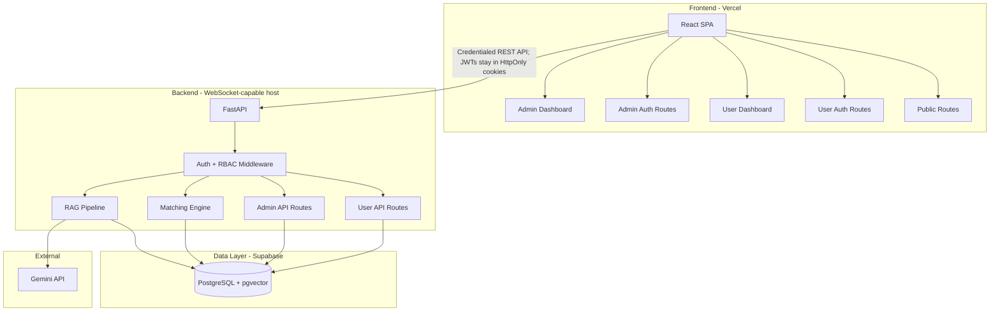

### Level 1A: Admin-Managed Event Slider Data Flow

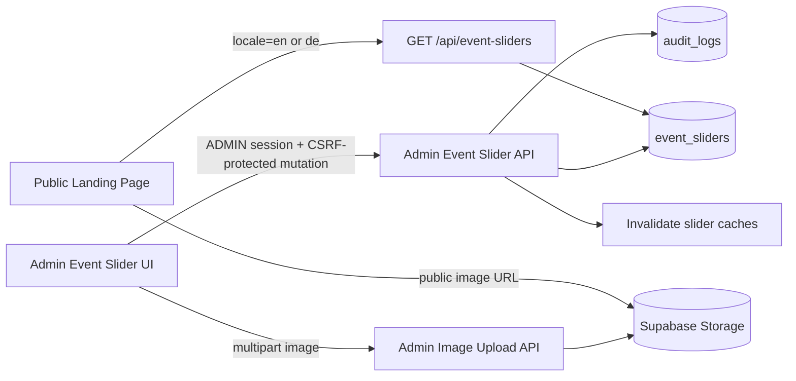

Production frontend code reads slider records only through the public API repository. The local six-slide migration dataset is isolated behind a development-only adapter and is removed by build-time dead-code elimination when `import.meta.env.PROD` is true.

### Level 2: Authentication & Authorization Flow

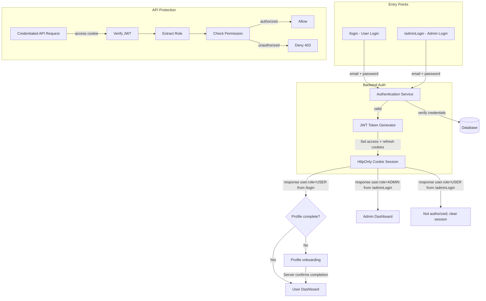

### Level 3: Frontend Route Architecture

```mermaid
graph TB
    ROOT["/"]

    ROOT --> PUBLIC[Public Routes]
    PUBLIC --> LANDING["/ - Landing Page"]
    PUBLIC --> DETAIL["/events/:id - audience-aware detail and recap"]
    PUBLIC --> LOGIN["/login - User Login"]
    PUBLIC --> REGISTER["/register - User Register"]
    PUBLIC --> ADMIN_LOGIN["/adminLogin - Admin Login"]

    ROOT --> USER[User Protected Routes - role=USER]
    USER --> U_DASH["/user/dashboard"]
    USER --> U_PROFILE["/user/profile"]
    USER --> U_EDIT["/user/profile/edit"]
    USER --> U_ONBOARD["/user/onboarding"]
    USER --> U_CAL["/user/calendar - later"]
    USER --> U_MATCHING["/user/matching"]
    USER --> U_BUDDY["/user/buddy"]
    USER --> U_ASSIST["/user/assistant"]
    USER --> U_CAMPUS["/user/campus"]
    USER --> U_EVENTS["/user/events"]
    USER --> U_SETTINGS["/user/settings"]

    ROOT --> ADMIN[Admin Protected Routes - role=ADMIN]
    ADMIN --> A_DASH["/admin/dashboard"]
    ADMIN --> A_USERS["/admin/users"]
    ADMIN --> A_MATCHING["/admin/matching"]
    ADMIN --> A_EVENTS["/admin/events"]
    ADMIN --> A_EVENT_SLIDERS["/admin/event-sliders"]
    ADMIN --> A_ANNOUNCE["/admin/announcements"]
    ADMIN --> A_KB["/admin/knowledge-base"]
    ADMIN --> A_CAMPUS["/admin/campus"]
    ADMIN --> A_ANALYTICS["/admin/analytics"]
    ADMIN --> A_AUDIT["/admin/audit-log"]
    ADMIN --> A_SETTINGS["/admin/settings"]
```

> [!IMPORTANT]
> **Public authentication entry-point policy**: The public Navbar `Sign in` menu exposes only `/login` (User Login) and `/register` (Create Student Account). `/adminLogin` must not be linked from the Navbar, mobile drawer, Footer, User Login page, or User Registration page. Administrators access `/adminLogin` directly by its known URL. This discoverability decision is not a security boundary; Admin authorization remains enforced by JWT role checks, `RoleGuard`, and backend `require_role("ADMIN")`.

### Level 5: Matching Pipeline

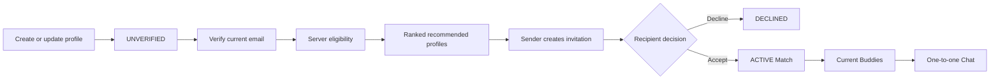

The backend enforces VERIFIED email, active/non-deleted account, complete profile, matching opt-in, valid/opposite student type and no self-match. Recommendations only filter, score and rank; they never allocate, reserve or create a Match. A user may have multiple ACTIVE Buddy relationships, while an unordered pair may have at most one ACTIVE Match. Admin observes aggregate/system state and never previews, publishes, accepts, declines, activates or overrides an individual match. Part 26 defines the complete contract.

### Level 6: RAG Pipeline

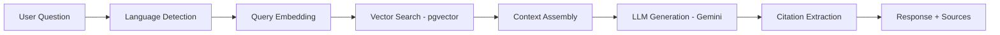

### Level 8: Deployment Architecture

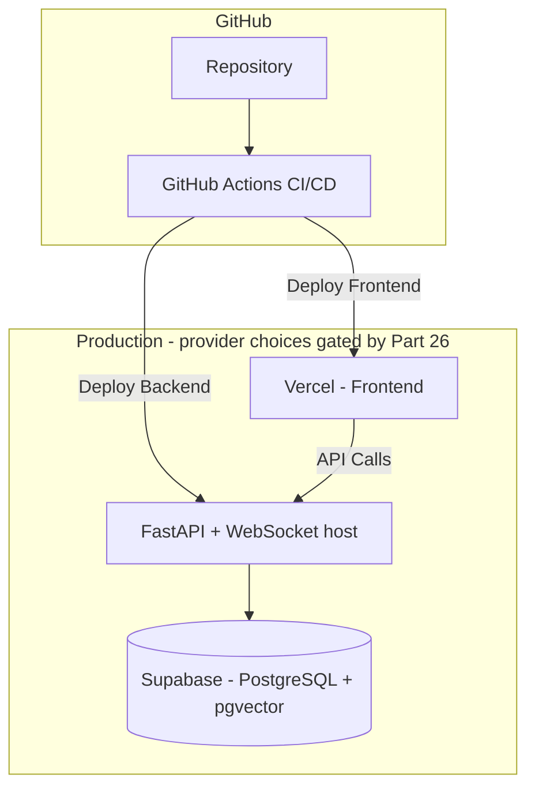

---

## PART 7 — DATABASE DESIGN (Updated with RBAC)

### Core Entity Relationship Diagram


### Key Design Decisions

| Decision | Rationale |
|----------|-----------|
| `role` as enum on User | Simple, extensible to `SUPER_ADMIN \| MODERATOR` later |
| `is_manual_override` on Match | Admin vs algorithm transparency |
| `created_by` / `updated_by` on Event | Track which admin modified what |
| `AUDIT_LOG` table | Every admin mutation is logged with old/new values |
| Event editorial status and derived phase | DRAFT/PUBLISHED/CANCELLED are admin-controlled; UPCOMING/ONGOING/COMPLETED derive from timestamps |
| Event Slider as a separate entity | Keeps landing-page promotion independent from Event registration and lifecycle management |
| Nullable `event_id` on Event Slider | Internal canonical Event projection or standalone promotion; deleting Event sets FK NULL and affected slide DRAFT/no CTA atomically |
| `status` plus `is_active` on Event Slider | Separates editorial publish workflow from an emergency visibility toggle |
| EN/DE columns on Event Slider | Matches the confirmed product languages; Vietnamese is not part of v2.1 |
| `target_audience` on Announcement | Selective notification delivery |
| Soft delete via `deleted_at` | Operational recovery only; not proof of legal compliance; retention/erasure needs a defined policy |

### Profile, readiness and privacy contract (v2.2)

- Replace the two unimplemented StudentProfile/BuddyProfile designs with one profile per USER. This avoids duplicated name/bio/language rules and ambiguous users owning both roles. `student_type` is self-selected program participation type: `VIETNAMESE` seeks an International Buddy and `INTERNATIONAL` seeks a Vietnamese Buddy. It is not authorization and is not inferred from nationality or UI language. Both are USER accounts; ADMIN has no automatic matching profile. No gender field is collected for MVP.
- Required for COMPLETE: trimmed `full_name` (1–120 chars), explicit student_type, one processed private avatar, 1–20 valid interests, 1–10 languages with proficiency. Bio, display name (1–80), major/year, nationality, availability and activities are optional. Percentage = completed required groups / 5 × 100; completion is derived, never accepted from a client. `onboarding_completed_at` is a historical milestone, not an authorization flag. Removing a required field makes the profile incomplete immediately.
- V2 eligibility additionally requires active, non-deleted USER, explicit `matching_opt_in`, current `email_verified_at`, valid student type and opposite type for the candidate. There is no proposed/accepted/active global reservation and no per-user Buddy maximum. Readiness/API reason codes must include the VERIFIED lock and remain backend-derived/localized by the frontend. API errors retain the existing `{detail: ...}` envelope.
- Registration keeps email/password/consent only and redirects to login after backend success. Login and reload first resolve `/auth/me`, then readiness. Incomplete users enter `/user/onboarding`; complete users enter `/user/dashboard`. Profile editing, logout/settings and allowed events remain reachable. ADMIN bypasses onboarding. Invalid session and temporary profile-service failure are distinct states.
- Interests and hobbies share an extensible Interest catalog (including all examples in the brief); Language uses stable codes and proficiency. Admin taxonomy UI is deferred; a documented idempotent backend seed/import expands data without frontend changes. Availability is validated JSON weekly slots, ISO weekday, minutes from midnight, timezone; overnight slots split across days. Preferred activities reference catalog IDs. No duplicate preferences storage: FE-033 writes the own-profile API.
- `student_type` may change only while the USER has no ACTIVE Match. Once at least one ACTIVE Match exists, the backend rejects a type-changing profile update; unchanged resubmission remains valid. The frontend disables the field and explains the lock, but is not the security boundary. Do not rewrite existing Matches or invent a user-level Unmatch. Because this V2 has no user End Buddy Relationship, the type is effectively fixed for the remaining semester; Semester Reset deletes old USER accounts, so the next cohort registers/selects type anew. Opt-out/incomplete state removes recommendation/invitation eligibility but does not delete existing data. Email UNVERIFIED locks every Buddy/chat interaction until re-verification as specified in Part 26.
- Owner can read/update only their profile; coordinator can read minimal list and audited detail via admin endpoints, not edit arbitrary profiles. The V2 safe matching card is available only through authorized recommendation/invitation/Buddy endpoints: avatar, display name (fallback full name), student type, major, interests, languages, preferred activities, score/explanation and normalized display availability. It never includes account email, auth/security/internal fields or signed URLs in logs.
- Unique `user_id`, canonical profile preference relations, one avatar per profile, FK media ownership and reverse indexes remain enforced. V2 `Match` references the two participants with canonical unordered-pair keys; only the same ACTIVE pair is unique, while either user may appear in many ACTIVE Matches. MatchingRun, global live-participant uniqueness, reservation locks and Admin publication are superseded and must not be added.

### Event and recap relationship decision (v2.2)

Choose **Option A: Event + optional EventRecap (1:0..1)**. An Event remains the scheduling source; a recap needs independent draft/publish content after the event. One small related row is simpler than merging scheduling and recap publication flags into Event. EventMedia belongs to Event and can serve its cover or recap. EventRecap inherits Event visibility and date; no duplicate event schedule or attendee directory. Event status is editorial; time phase is derived. Location is localized text in MVP, so events do not wait for Campus schema.

### Indexes

```sql
CREATE INDEX idx_user_email ON users(email);
CREATE INDEX idx_user_role ON users(role);
CREATE INDEX idx_user_active ON users(is_active);
CREATE INDEX idx_match_student ON matches(student_id);
CREATE INDEX idx_match_buddy ON matches(buddy_id);
CREATE INDEX idx_match_status ON matches(status);
CREATE INDEX idx_event_status ON events(status);
CREATE INDEX idx_event_date ON events(start_date);
CREATE INDEX idx_event_slider_public
  ON event_sliders(status, is_active, display_start_at, display_end_at, sort_order);
CREATE INDEX idx_event_slider_event ON event_sliders(event_id);
CREATE INDEX idx_announcement_status ON announcements(status, publish_date);
CREATE INDEX idx_audit_admin ON audit_logs(admin_id, created_at);
CREATE INDEX idx_audit_resource ON audit_logs(resource_type, resource_id);
CREATE INDEX idx_notification_user ON notifications(user_id, is_read);
-- Later RAG/research only; not a Backend/Profile/Matching MVP prerequisite.
CREATE INDEX idx_document_chunk_embedding ON document_chunks
  USING ivfflat (embedding vector_cosine_ops) WITH (lists = 100);
```

---

## PART 8 — MATCHING SYSTEM

> [!WARNING]
> **Superseded matching design:** The v2.2 comparison, greedy-assignment and Admin-control material retained in this Part is historical planning context only. It must not be implemented. Buddy Matching V2 in Part 26 replaces it with verified user-driven recommendations and invitations, supports multiple ACTIVE Buddies, and removes Admin approval/publish/override from the happy path.

### Algorithm Comparison Strategy

| Algorithm | Approach | Strengths | Weaknesses |
|-----------|----------|-----------|------------|
| **Random** | Random assignment | Baseline benchmark | No quality guarantee |
| **Greedy** | Best pair first | Fast, simple | Local optima |
| **Gale-Shapley** | Stable matching | Guarantees stability | Only optimizes one side |
| **Hungarian** | Optimal assignment | Global optimum | O(n³), only 1:1 |
| **CSP/ILP** | Constraint satisfaction | Handles all constraints | Requires solver |
| **Embedding-based** | Semantic similarity | Captures nuance | Needs training data |
| **Hybrid** | Embedding → ILP | Best of both worlds | Complex pipeline |

### Compatibility Scoring — MVP contract

First load canonical eligible profiles and form only VIETNAMESE × INTERNATIONAL candidate pairs (MATCH-007). Score normalized catalog IDs and structured preferences, never auth fields or a separate mock profile store.

| Signal | Initial weight | Rule (0..1) |
|--------|----------------|-------------|
| Interests/hobbies | 0.40 | Jaccard overlap of Interest IDs |
| Languages | 0.25 | Maximum shared-language minimum proficiency; beginner=.25, intermediate=.5, fluent=.75, native=1 |
| Weekly availability | 0.15 | Overlap / union of normalized slots for the run's UTC reference week |
| Major | 0.10 | Case/whitespace-normalized equality; 0 otherwise |
| Preferred activities | 0.10 | Jaccard overlap of selected catalog IDs |

If either side lacks an optional signal, omit that signal and renormalize available weights; do not invent a positive match or silently penalize a skipped optional step. Required interest/language signals are always evaluated. Score = 100 × normalized weighted sum; expose rounded value but sort by full precision and then stable profile IDs. Store signal breakdown, reference week, profile versions, algorithm and weights version in the run/match. Initial weights are product defaults to evaluate, not empirically proven compatibility probabilities. Low score does not override constraints; no additional language/gender/nationality hard rule is introduced.

MVP: deterministic greedy, 1:1 reservation, coordinator preview → explicit atomic publish → proposed → one accept remains proposed → both accept active; rejection releases the reservation. Research: MATCH-005/006 stable/optimal comparisons, followed by embeddings/hybrid and feedback learning after opt-in data/evaluation exist. No ML infrastructure is required to release basic matching.

### Admin Matching Controls

- Admin can trigger algorithm execution via `/api/admin/matching/run`
- Admin can preview results before publishing to users; publish revalidates profile versions and eligibility atomically
- Admin can manually override a match only after the same eligibility/opposite-type/reservation checks, with reason and audit trail
- Admin can view algorithm vs manual match distinction
- Admin can reassign buddies with reason logged

---

## PART 9 — RAG SYSTEM

### Knowledge Base Management (Admin-Controlled)

| Action | Who | Endpoint |
|--------|-----|----------|
| Upload document | ADMIN | `POST /api/admin/knowledge-base/documents` |
| Delete document | ADMIN | `DELETE /api/admin/knowledge-base/documents/:id` |
| Re-index document | ADMIN | `POST /api/admin/knowledge-base/documents/:id/reindex` |
| View all documents | ADMIN | `GET /api/admin/knowledge-base/documents` |
| Ask question | USER | `POST /api/assistant/chat` |
| View conversations | USER | `GET /api/assistant/conversations` |

### Pipeline

```
User Question → Embedding → pgvector Search (top-5) → Context Assembly → Gemini API → Citation Extraction → Response
```

### Hallucination Mitigation
- System prompt: "Only answer based on provided context"
- Every claim must reference a chunk
- "I couldn't find this in the knowledge base" for unknowns
- Show retrieved source documents to user

---

## PART 10 — VIRTUAL CAMPUS

### MVP: 2D Interactive SVG Map

- Interactive SVG campus map with clickable buildings
- Search buildings/services/rooms
- Info panel: rooms, services, hours
- Basic pathfinding between buildings (A* on graph)

### Admin Campus Controls
- Add/edit/delete buildings, rooms, facilities, POIs
- Upload building images
- Set opening hours
- Manage point-of-interest categories

> [!NOTE]
> 3D rendering (Three.js), real-time multiplayer (WebSocket), and gamified exploration are DEFERRED.

---

## PART 11 — SECURITY & GDPR (Updated with RBAC)

### Authentication Architecture

```
┌─────────────────────────────────────────────────┐
│                   Platform                       │
└────────────────────┬────────────────────────────┘
                     │
          ┌──────────┴──────────┐
          │                     │
      USER LOGIN            ADMIN LOGIN
          │                     │
          ↓                     ↓
     /login                /adminLogin
          │                     │
          ↓                     ↓
   Same Auth Endpoint      Same Auth Endpoint
   POST /api/auth/login    POST /api/auth/login
          │                     │
          ↓                     ↓
   HttpOnly JWT cookies    HttpOnly JWT cookies
   + user.role=USER        + user.role=ADMIN
          │                     │
          ↓                     ↓
   → /user/dashboard       → /admin/dashboard
```

> [!IMPORTANT]
> Both `/login` and `/adminLogin` call the **same backend endpoint** (`POST /api/auth/login`). The backend sets access and refresh JWTs only as HttpOnly cookies and returns a sanitized `user` object containing the role; it never returns either token in the JSON body. The frontend routes from `user.role`, while backend authorization independently verifies the access cookie on every protected request. If a USER logs in at `/adminLogin`, the frontend calls logout to clear the newly issued session, shows "not authorized", and redirects to `/`.

### Three Layers of Protection

```
Layer 1: Frontend Route Guards
  → ProtectedRoute (must be authenticated)
  → RoleGuard (must have correct role)
  → Redirect unauthorized users

Layer 2: Backend Authorization Middleware
  → Verify JWT on every request
  → Extract role from token
  → Check permission for endpoint
  → Reject with 403 if unauthorized

Layer 3: Database Constraints
  → Role enum enforced at DB level
  → Foreign keys prevent orphaned data
  → Audit log captures all admin actions
```

### Security Implementation

| Concern | Implementation |
|---------|---------------|
| Password hashing | bcrypt (12 rounds) |
| JWT access token | 15-minute expiry; `HttpOnly`, `Secure`, `SameSite=Lax`, `Path=/` cookie in production |
| JWT refresh token | 7-day expiry; `HttpOnly`, `Secure`, `SameSite=Lax`, `Path=/` cookie; rotate on every use and reject reuse |
| RBAC | `require_role("ADMIN")` FastAPI dependency |
| IDOR prevention | Always filter queries by `current_user.id` for user routes |
| Privilege escalation | Role can only be set via DB seed/CLI, never via API |
| Rate limiting | slowapi: 120 req/min for USER, 60 req/min for ADMIN (approved quota reversal); shared Redis in production |
| SQL injection | SQLAlchemy parameterized queries |
| XSS | React auto-escaping + CSP headers |
| CSRF | Signed session-bound double-submit token in `X-CSRF-Token`, plus exact Origin/Referer validation; SameSite is defense in depth |
| Prompt injection | Input sanitization, system prompt isolation |
| Admin login brute force | 5 failed attempts → 15-minute lockout |

### Approved Authentication Transport Contract (`AUTH-ARCH-001`)

- **Transport**: JWT access and refresh tokens are stored only in backend-set HttpOnly cookies. The API never returns tokens in JSON, and frontend JavaScript never reads, persists, or sends bearer tokens.
- **Cookie policy**: Production uses `Secure`, `HttpOnly`, `SameSite=Lax`, and `Path=/`; omit `Domain` and use a `__Host-` cookie prefix when the final deployment host supports it. Local HTTP development may use explicitly named non-`__Host-`, non-`Secure` development cookies only.
- **Frontend state**: Zustand holds only `status: unknown | loading | authenticated | unauthenticated`, a sanitized `user`, and `role`. It has no `token` or `refreshToken` field and is not persisted to Web Storage. `/api/auth/me` restores the session after reload.
- **Route guards**: `ProtectedRoute` and `RoleGuard` show a neutral pending state while session status is `unknown` or `loading`; they redirect only after `/api/auth/me` resolves, preventing reload-time redirect flicker.
- **API client**: All API calls use a single client configured with `credentials: "include"`. A 401 may trigger one single-flight refresh attempt and one request retry; refresh failure clears in-memory session state and redirects through the normal unauthenticated flow.
- **CSRF**: `GET /api/auth/csrf` establishes a pre-auth CSRF context and returns a signed double-submit value; successful login rotates it and binds the replacement to the refresh session. The readable CSRF value is held in memory and sent as `X-CSRF-Token` on every state-changing request, including register, login, refresh, logout, uploads, and Admin mutations. The backend also validates `Origin`/`Referer`; safe methods never change state.
- **CORS/deployment**: Production must expose the API on the same site as the frontend, preferably through a Vercel `/api` reverse proxy to a WebSocket-capable first-party API host. Credentialed CORS uses an explicit origin allowlist and explicit methods/headers—never `*`. Frontend environment configuration points to the same-site API boundary.
- **RBAC boundary**: Frontend `RoleGuard` is UX only. Every protected backend route derives identity and role solely from the verified access-cookie JWT and enforces `require_auth`/`require_role`; no role value supplied by the client is trusted.
- **Cache/logout**: Auth responses use `Cache-Control: no-store`. Logout revokes/invalidates the refresh session, clears both auth cookies and the CSRF cookie, and clears the frontend session state.

### Admin Account Creation

> [!IMPORTANT]
> **Admin accounts cannot be self-registered.** Admin creation is done exclusively through:

**Recommended approach**: CLI seed command during deployment.

```bash
# Recommended hidden prompt (run once during deployment)
python -m app.cli create-admin --email admin@vgu.edu.vn

# Non-interactive deployment
printf '%s\n' "$ADMIN_SEED_PASSWORD" | python -m app.cli create-admin \
  --email admin@vgu.edu.vn --password-stdin
```

AUTH-019 implements only this explicit operator command. The API does not auto-create an Admin at
startup and does not read `INITIAL_ADMIN_*`; any future first-boot bootstrap or invitation flow
requires its own security contract and task.

### GDPR Compliance

These are planned privacy controls, not a verified legal-compliance claim. Full erasure/export workflows require scoped later tasks before being advertised; the core profile release must still enforce minimization, ownership, private images and removal/replacement.

- Explicit consent checkbox at registration
- Data minimization: only necessary profile fields
- Right to access: user can export data (JSON)
- Right to deletion: soft delete + hard delete after 30 days
- Admin audit log tracks all data access

---

## PART 12 — TESTING STRATEGY

| Layer | Tool | Scope |
|-------|------|-------|
| Frontend Unit | Vitest | Utility functions, hooks, role guards |
| Frontend Component | Vitest + React Testing Library | Components, role-based rendering |
| Frontend E2E | Playwright | User login flow, Admin login flow, permission checks |
| Backend Unit | pytest | Services, algorithms, role verification |
| Backend API | pytest + HTTPX2 | Endpoint contracts, 403 for unauthorized; HTTPX2 is the current Starlette-supported successor to HTTPX |
| Backend Auth | pytest | JWT generation, role extraction, permission denial |
| Backend Integration | pytest + testcontainers | Database + auth + RBAC integration |
| AI Retrieval | RAGAS | Precision, Recall, MRR |
| Matching | pytest + synthetic data | Algorithm correctness, constraints |

### Critical Auth Test Cases

```
✅ User can login at /login → auth cookies set; response and /auth/me report USER
✅ User cannot access /admin/* routes → 403
✅ User cannot call POST /api/admin/* → 403
✅ Admin can login at /adminLogin → auth cookies set; response and /auth/me report ADMIN
✅ Admin can access /admin/* routes
✅ User at /adminLogin → redirected with "not authorized"
✅ Expired JWT → 401
✅ Tampered JWT → 401
✅ Missing JWT → 401
✅ Role claim cannot be modified by client
✅ Login/refresh JSON never exposes access or refresh JWT
✅ Zustand/localStorage/sessionStorage never contains access or refresh JWT
✅ Missing/invalid CSRF header on state-changing request → 403
✅ Credentialed CORS accepts allowlisted frontend origin and rejects unknown origins
✅ Refresh token rotation rejects reuse; logout clears cookies and invalidates refresh session
```

---

## PART 13 — DEVOPS

### Git Workflow (Solo Developer)

**Approved workflow from FE-022 onward:** Implement, commit and push directly on `main` unless
actual repository protection prevents it. Fetch and safely synchronize with `origin/main` from a
clean working tree, implement one task, pass required gates, review diff/secrets, commit on main,
check concurrent incoming commits and push normally. Verify the live SHA, CI and clean/synced state.
Do not create task branches, force push or bypass failed gates/protection. If a real remote rejection
requires a PR, report the evidence without changing repository rules. See CONTRIBUTING.md.

FE-021 was integrated on main by fast-forward to `70fce5c` before FE-022 implementation. Existing
historical task branches/history remain intact; they are not the workflow for subsequent tasks.

### CI/CD Pipeline (GitHub Actions)

```yaml
# On every push:
- Lint (ESLint + Ruff)
- Type check (tsc + mypy)
- Unit tests (Vitest + pytest)
- Build check

# Current main pushes:
- The repository's Frontend and Backend CI jobs run; there is no deployment job

# Future release pipeline, only with explicit deployment authorization:
- Deployed E2E/smoke acceptance
- Frontend/backend deployment configuration and release gates
```

### Hosting: historical estimate (superseded by Part 26)

| Service | What | Free Tier Limits |
|---------|------|-----------------|
| **Vercel** | Frontend | Unlimited for personal, 100GB bandwidth |
| **FastAPI host** | Backend + WebSocket | Provider and quota not selected by this historical section |
| **Supabase** | PostgreSQL + pgvector | 500MB DB, 1GB file storage, 50K MAU |
| **GitHub Actions** | CI/CD | 2000 min/month |
| **Gemini API** | LLM | 15 RPM, 1M tokens/day |

> [!TIP]
> Select and validate the API/WebSocket host under the Part 26 staging gates. Do not infer a current free-tier entitlement from this historical section.

---

## PART 14 — RESEARCH PLAN

| RQ | Question | Metrics |
|----|----------|---------|
| RQ1 | Does hybrid optimization matching outperform greedy/stable matching? | Avg compatibility, constraint violations, stability |
| RQ2 | Do embedding-based semantic profiles improve match quality? | Satisfaction score, acceptance rate |
| RQ3 | Does hybrid retrieval improve RAG accuracy over dense-only? | Precision@5, Recall@5, MRR |
| RQ4 | How does local LLM compare to cloud LLM for student Q&A? | Accuracy, latency, cost, groundedness |
| RQ5 | Does structured onboarding improve student preparedness? | Task completion rate |
| RQ6 | Can feedback-weighted learning improve matching weights? | Score improvement over baseline |
| RQ7 | Does multilingual embedding outperform translate-then-embed? | Cross-language retrieval accuracy |

---

## PART 15 — COMPLETE IMPLEMENTATION ROADMAP (Updated)

> [!IMPORTANT]
> Phase numbers group parallel workstreams; they are not the canonical single-developer execution sequence. **PART 24 — NEW MASTER IMPLEMENTATION ORDER is authoritative.** The Frontend completion and AUTH-ARCH-001 gates, BE-001 through BE-016, AUTH-007 through AUTH-019, AUTH-004/005/006 and AUTH-021/022/023 are recorded complete; AUTH-020 implementation/local/live acceptance are verified with its production operator gate pending. AUTH-024 backend/live and combined frontend/cache acceptance PASS. FE-021, FE-022, FE-023, FE-025, FE-026, FE-027, FE-028, FE-029, FE-038, FE-039, ADMIN-001 through ADMIN-005, EVT-001 through EVT-004, EVT-008, EVT-010 and EVS-003 are complete; MATCH-001 is the next READY development task under the 2026-09-22 demo-priority override. From FE-022 onward, implement/commit/push directly on main unless actual repository protection prevents it. Parts 18/18A remain execution evidence, not a request to redo completed UI. FE-014 builds against the approved API contract with a development-only mock, while EVS-001 through EVS-007, ADMIN-SLIDER-001 through ADMIN-SLIDER-004, and FE-014B later activate end-to-end Admin-managed production content.

### Dependency Graph

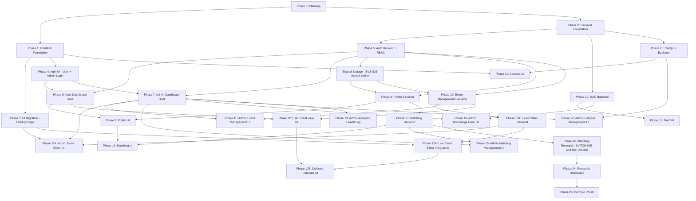

### Phase Timeline — historical estimates (not current commitments)

The original counts/hours below predate added auth, media and recap work and are retained only as historical estimates. The task registry and dependency-driven order in Parts 16/24 govern v2.2. Re-estimate each pending task when scheduling; do not use the ~165/~327 totals as the updated forecast.

| Phase | Name | Tasks | Hours | Weeks (10h/wk) | Priority |
|-------|------|-------|-------|-----------------|----------|
| 0 | Planning & Design | 5 | 8 | 0.8 | P0 |
| 1 | Frontend Foundation | 10 | 15 | 1.5 | P0 |
| 2 | Backend Foundation | 7 | 12 | 1.2 | P0 |
| 3 | UI Migration (Landing) | 10 | 20 | 2.0 | P0 |
| 4 | Auth UI (User + Admin Login) | 6 | 10 | 1.0 | P0 |
| 5 | Auth Backend + RBAC | 10 | 18 | 1.8 | P0 |
| 6 | User Dashboard Shell | 4 | 6 | 0.6 | P0 |
| 7 | Admin Dashboard Shell | 5 | 8 | 0.8 | P0 |
| 8 | Profile Backend | 5 | 8 | 0.8 | P0 |
| 9 | Profile UI | 5 | 10 | 1.0 | P0 |
| 10 | Event Management Backend | 6 | 10 | 1.0 | P0 |
| 10A | Event Slider Backend | 7 | 14 | 1.4 | P0 |
| 11 | Admin Event Management UI | 8 | 14 | 1.4 | P0 |
| 11A | Admin Event Slider UI | 4 | 8 | 0.8 | P0 |
| 12 | User Event View UI | 3 | 5 | 0.5 | P1 |
| 12A | Live Event Slider Integration | 1 | 2 | 0.2 | P0 |
| 13 | Matching Backend | 10 | 22 | 2.2 | P1 |
| 14 | Matching UI | 6 | 12 | 1.2 | P1 |
| 15 | Admin Matching Management | 5 | 8 | 0.8 | P1 |
| 16 | Matching Research | 8 | 25 | 2.5 | P2 |
| 17 | RAG Backend | 8 | 20 | 2.0 | P1 |
| 18 | RAG UI | 4 | 8 | 0.8 | P1 |
| 19 | Admin Knowledge Base UI | 4 | 8 | 0.8 | P1 |
| 20 | Campus Backend | 4 | 8 | 0.8 | P2 |
| 21 | Campus UI | 4 | 10 | 1.0 | P2 |
| 22 | Admin Campus Management | 4 | 6 | 0.6 | P2 |
| 23 | Admin Analytics + Audit | 5 | 10 | 1.0 | P1 |
| 24 | Research Dashboard | 4 | 10 | 1.0 | P2 |
| 25 | Portfolio Polish | 5 | 10 | 1.0 | P1 |
| **Total** | | **~165** | **~327** | **~33 weeks** | |

---

## PART 16 — VIBE CODING TASKS (Complete Breakdown)

### Phase 1: Frontend Foundation

| ID | Task | Cx | Deps | Pri |
|----|------|----|------|-----|
| FE-001 | Initialize React + TypeScript + Vite project | 1 | — | P0 |
| FE-002 | Configure ESLint + Prettier | 1 | FE-001 | P0 |
| FE-003 | Configure Tailwind CSS v3 with VGU brand | 1 | FE-001 | P0 |
| FE-004 | Install and configure shadcn/ui | 2 | FE-003 | P0 |
| FE-005 | Create design system (colors, typography, buttons, cards) | 2 | FE-003 | P0 |
| FE-006 | Setup React Router with layout structure | 2 | FE-001 | P0 |
| FE-007 | Configure environment variables (.env.example) | 1 | FE-001 | P0 |
| FE-008 | Create folder structure (features/, pages/, lib/, stores/) | 1 | FE-001 | P0 |
| FE-009 | Configure react-i18next with EN/DE | 2 | FE-001 | P0 |
| FE-010 | Migrate translations to JSON locale files | 2 | FE-009 | P0 |

### Phase 2: Backend Foundation

| ID | Task | Cx | Deps | Pri |
|----|------|----|------|-----|
| BE-001 | Initialize FastAPI project with pyproject.toml — ✅ Completed | 1 | — | P0 |
| BE-002 | Create project structure (api/, core/, models/, schemas/, services/) — ✅ Completed | 2 | BE-001 | P0 |
| BE-003 | Configure SQLAlchemy 2.0 + Alembic — ✅ Completed | 2 | BE-001 | P0 |
| BE-004 | Configure Supabase PostgreSQL connection and database access boundary — ✅ Completed | 2 | BE-003 | P0 |
| BE-005 | Create Docker Compose for local dev (PostgreSQL + pgvector) — ✅ Completed | 2 | BE-001 | P0 |
| BE-006 | Create base model class with audit fields (id, created_at, updated_at, deleted_at) — ✅ Completed | 1 | BE-003 | P0 |
| BE-007 | Configure credentialed CORS with explicit frontend origins, methods, and headers — ✅ Completed | 1 | BE-001, AUTH-ARCH-001 | P0 |

### Phase 3: UI Migration (Landing Page)

| ID | Task | Cx | Deps | Pri |
|----|------|----|------|-----|
| FE-011 | Create Navbar component (desktop + mobile menu + language toggle) | 3 | FE-005, FE-006, FE-009 | P0 |
| FE-012 | Create Footer component | 2 | FE-005 | P0 |
| FE-013 | Create Hero section with gradient + animations | 3 | FE-005 | P0 |
| FE-014 | Create API-ready Events Slider with development-only mock datasource | 4 | FE-005, FE-007, FE-009 | P0 |
| FE-015 | Create About section | 2 | FE-005 | P0 |
| FE-016 | Create Benefits grid (6 feature cards) | 2 | FE-005 | P0 |
| FE-017 | Create Testimonials marquee | 3 | FE-005 | P0 |
| FE-018 | Create CTA section | 2 | FE-005 | P0 |
| FE-019 | Assemble Landing Page from all sections | 2 | FE-011..FE-018 | P0 |
| FE-020 | Create Language Toggle component (EN/DE with flag icons) | 2 | FE-009, FE-011 | P0 |

### Phase 3A: Frontend Completion Remediation

This phase is an approved completion gate inserted after FE-020 and before Backend Foundation.

| ID | Task | Deps | Pri |
|----|------|------|-----|
| FE-HYGIENE-001 | Review and commit the FE-016..FE-020 baseline | FE-020 | P0 |
| FE-FIX-001 | Hide duplicated testimonial clones from the accessibility tree | FE-HYGIENE-001 | P0 |
| FE-FIX-002 | Fully localize Language Toggle accessible labels and tooltips | FE-HYGIENE-001 | P0 |
| FE-FIX-003 | Remove duplicate SVG IDs from language flag instances | FE-FIX-002 | P1 |
| FE-FIX-004 | Correct Landing Page anchor and layout integration coverage | FE-HYGIENE-001 | P1 |
| FE-FIX-005 | Harden marquee timing, reduced-motion behavior, and interaction tests | FE-FIX-001 | P1 |
| FE-DEMO-001 | Migrate Demo.mp4 and create a WebP poster | FE-HYGIENE-001 | P1 |
| FE-DEMO-002 | Create an accessible responsive Demo Video dialog | FE-DEMO-001, FE-FIX-002 | P1 |
| FE-DEMO-003 | Connect Watch Demo to the video dialog | FE-DEMO-002 | P1 |

### Phase 4: Auth UI

| ID | Task | Cx | Deps | Pri |
|----|------|----|------|-----|
| AUTH-001 | Create User Login page (/login) | 2 | FE-005, FE-006 | P0 |
| AUTH-002 | Create User Registration page (/register) | 3 | FE-005, FE-006 | P0 |
| AUTH-003 | Create Admin Login page (/adminLogin) — distinct visual | 2 | FE-005, FE-006 | P0 |
| AUTH-004 | Create non-persisted Zustand session store (status, user, role; no tokens) — ✅ COMPLETED | 2 | FE-001, AUTH-ARCH-001 | P0 |
| AUTH-005 | Create ProtectedRoute component (requires auth) — ✅ Completed | 2 | AUTH-004, FE-006 | P0 |
| AUTH-006 | Create RoleGuard component (requires specific role) — ✅ Completed | 2 | AUTH-005 | P0 |

> [!IMPORTANT]
> **Approved UI-first exception**: AUTH-001, AUTH-002, and AUTH-003 are implemented as UI-only pages before Backend Foundation. They may include responsive layouts, accessible forms, client-side validation, and loading/error presentation contracts, but must not simulate successful authentication, create fake tokens, or perform fake role redirects. Backend connectivity remains exclusively in AUTH-021 through AUTH-023.
>
> AUTH-003 remains reachable only through the direct `/adminLogin` URL and must not be advertised in public navigation. Admin self-registration is prohibited.

### Phase 4A: Public Auth Entry Integration

| ID | Task | Deps | Pri |
|----|------|------|-----|
| FE-AUTH-ENTRY-001 | Add desktop Sign in menu with User Login and Create Student Account only | AUTH-001, AUTH-002 | P0 |
| FE-AUTH-ENTRY-002 | Add direct User Login and Create Student Account actions to the mobile drawer | AUTH-001, AUTH-002 | P0 |
| FE-AUTH-ENTRY-003 | Route Join the Community to `/register` | AUTH-002 | P1 |
| FE-TECH-001 | Assess and enable TypeScript strict mode without introducing `any` | Frontend functional fixes | P2 |
| FE-VERIFY-001 | Run the final Frontend completion gate | All selected Frontend completion tasks | P0 |
| FE-CLOSEOUT-001 | Restore formatting and type-check quality gates | FE-VERIFY-001 | P0 |
| FE-CLOSEOUT-002 | Isolate modal background content from assistive technology | FE-CLOSEOUT-001 | P0 |
| FE-CLOSEOUT-003 | Finalize public route scroll restoration | FE-CLOSEOUT-002 | P0 |
| FE-HYGIENE-002 | Verify pending auth layout changes and restore a clean working tree | FE-CLOSEOUT-003 | P0 |
| AUTH-ARCH-001 | Decide JWT transport and frontend auth-state boundary before Auth Backend | FE-HYGIENE-002 | P0 |

### Phase 5: Auth Backend + RBAC

| ID | Task | Cx | Deps | Pri |
|----|------|----|------|-----|
| AUTH-007 | Define UserRole enum (USER, ADMIN) in models — ✅ Completed | 1 | BE-006 | P0 |
| AUTH-008 | Create User database model with role field — ✅ Completed | 2 | AUTH-007 | P0 |
| AUTH-009 | Create Alembic migration for users table — ✅ Completed | 1 | AUTH-008 | P0 |
| AUTH-010 | Create password hashing service (bcrypt) — ✅ Completed | 2 | BE-001 | P0 |
| AUTH-011 | Create JWT cookie service (create/verify access + rotating refresh tokens) — ✅ Completed | 3 | BE-001, AUTH-ARCH-001 | P0 |
| AUTH-011A | Create signed CSRF service and `GET /api/auth/csrf` endpoint — ✅ Completed | 2 | BE-001, AUTH-ARCH-001 | P0 |
| AUTH-012 | Create auth service (register, login, verify role) — ✅ Completed | 3 | AUTH-008, AUTH-010, AUTH-011 | P0 |
| AUTH-013 | Create CSRF-protected `POST /api/auth/register` endpoint (role=USER always) — ✅ Completed | 2 | AUTH-012, AUTH-011A | P0 |
| AUTH-014 | Create CSRF-protected `POST /api/auth/login` endpoint (sets cookies; returns sanitized user) — ✅ Completed | 2 | AUTH-012, AUTH-011A | P0 |
| AUTH-015 | Create CSRF-protected `POST /api/auth/refresh` endpoint with rotation/reuse detection — ✅ Completed | 2 | AUTH-011, AUTH-011A | P0 |
| AUTH-016 | Create sanitized current-session endpoint — ✅ Completed | 1 | AUTH-017 | P0 |
| AUTH-017 | Create verified-current-user authentication dependency — ✅ Completed | 2 | AUTH-011, AUTH-009 | P0 |
| AUTH-018 | Create `require_role(role)` FastAPI dependency (verify role) — ✅ Completed | 2 | AUTH-017 | P0 |
| AUTH-019 | Create admin seed CLI command (`python -m app.cli create-admin`) — ✅ Completed | 2 | AUTH-008, AUTH-010 | P0 |
| AUTH-020 | Create rate limiting middleware (slowapi) — Implemented; local/live acceptance PASS; production operator gate pending | 2 | BE-001 | P0 |
| AUTH-021 | Connect session client, registration, and auth bootstrap — ✅ Completed | 2 | AUTH-004, AUTH-013, AUTH-014, AUTH-015, AUTH-016, AUTH-024 | P0 |
| AUTH-022 | Implement login flow: User login → role check → redirect — ✅ Completed | 2 | AUTH-021, AUTH-006 | P0 |
| AUTH-023 | Implement admin login flow: Admin login → role=ADMIN check → redirect — ✅ Completed | 2 | AUTH-021, AUTH-006 | P0 |
| AUTH-024 | Implement session logout endpoint — Backend/live and frontend/cache acceptance PASS | 2 | AUTH-015, AUTH-017, AUTH-011A | P0 |
| AUTH-025 | Implement authenticated password change endpoint | 2 | AUTH-024, AUTH-010 | P1 |

### Phase 6: User Dashboard Shell

| ID | Task | Cx | Deps | Pri |
|----|------|----|------|-----|
| FE-021 | Create UserLayout component (sidebar + content area) — ✅ Completed | 3 | FE-005, AUTH-006 | P0 |
| FE-022 | Create User Sidebar navigation — ✅ Completed | 2 | FE-021 | P0 |
| FE-023 | Create profile-aware User Dashboard home — ✅ Completed | 2 | FE-021, FE-022, BE-012, BE-016, FE-038 | P0 |
| FE-024 | Create User Settings page with real session actions | 2 | FE-021, AUTH-021, AUTH-025 | P1 |

### Phase 7: Admin Dashboard Shell

| ID | Task | Cx | Deps | Pri |
|----|------|----|------|-----|
| ADMIN-001 | Create AdminLayout component (sidebar + content) — clean, data-dense — ✅ Completed | 3 | FE-005, AUTH-006 | P0 |
| ADMIN-002 | Create Admin Sidebar navigation (all 11 modules) — ✅ Completed | 2 | ADMIN-001 | P0 |
| ADMIN-003 | Create Admin Dashboard overview page (stats cards placeholder) — ✅ Completed | 2 | ADMIN-001 | P0 |
| ADMIN-004 | Create reusable DataTable component (sort, filter, search, pagination) — ✅ Completed | 4 | FE-005 | P0 |
| ADMIN-005 | Create reusable ConfirmDialog component — ✅ Completed | 1 | FE-004 | P0 |

### Phase 8: Profile Backend

Shared storage is pulled forward from Phase 10A; its existing task ID is retained.

| ID | Task | Cx | Deps | Pri |
|----|------|----|------|-----|
| EVS-003 | Create shared Supabase image storage service and bucket policies — ✅ Completed | 3 | BE-004, AUTH-018, AUTH-011A | P0 |
| BE-008 | Define unified StudentProfile and ProfilePhoto models — ✅ Completed | 2 | AUTH-008 | P0 |
| BE-009 | Define Interest catalog and profile interest/language relations — ✅ Completed | 2 | BE-008 | P0 |
| BE-010 | Create profile, catalog and photo migrations — ✅ Completed | 1 | BE-008, BE-009, AUTH-009, BE-004 | P0 |
| BE-011 | Create own-profile persistence service — ✅ Completed | 2 | BE-010 | P0 |
| BE-012 | Create own-profile read/update endpoints — ✅ Completed | 2 | BE-011, AUTH-017, AUTH-011A | P0 |
| BE-013 | Create authorized admin user list and detail reads — ✅ Completed | 2 | BE-011, AUTH-018, EVT-008 | P0 |
| BE-014 | Implement own profile photo upload and removal — ✅ Completed | 2 | BE-010, BE-012, EVS-003 | P0 |
| BE-015 | Implement profile interest and language catalog APIs — ✅ Completed | 2 | BE-009, BE-012 | P0 |
| BE-016 | Implement profile completion and matching eligibility read model — ✅ Completed | 2 | BE-012, BE-014, BE-015 | P0 |

### Phase 9: Profile UI

| ID | Task | Cx | Deps | Pri |
|----|------|----|------|-----|
| FE-025 | Create onboarding Step 1: identity and student type — ✅ Completed | 3 | FE-021, BE-012 | P0 |
| FE-026 | Create onboarding Step 2: interests and languages — ✅ Completed | 3 | FE-025, BE-015 | P0 |
| FE-027 | Create onboarding Step 3: availability and preferences — ✅ Completed | 3 | FE-026, BE-012, BE-016, FE-039 | P0 |
| FE-028 | Create own social-style profile view — ✅ Completed | 2 | FE-025, BE-012, BE-014, BE-015 | P0 |
| FE-029 | Create profile edit page using onboarding field components — ✅ Completed | 2 | FE-028, FE-027, BE-016 | P0 |
| FE-038 | Integrate onboarding routing and readiness gate — ✅ Completed | 2 | AUTH-022, AUTH-023, BE-016, FE-027 | P0 |
| FE-039 | Create reusable profile avatar upload control — ✅ Completed | 2 | FE-025, BE-014 | P0 |

### Phase 10: Event Management Backend

| ID | Task | Cx | Deps | Pri |
|----|------|----|------|-----|
| EVT-001 | Define Event editorial state, time and visibility model — ✅ Completed | 2 | BE-006, AUTH-008 | P0 |
| EVT-002 | Create EventRegistration model — ✅ Completed | 1 | EVT-001 | P0 |
| EVT-003 | Create Event, EventMedia and registration migrations — ✅ Completed | 1 | EVT-001, EVT-002, EVT-010, AUTH-009, BE-004 | P0 |
| EVT-004 | Create event CRUD and publication service — ✅ Completed | 3 | EVT-003 | P0 |
| EVT-005 | Create audience-safe event list, detail and calendar queries | 2 | EVT-004, AUTH-017 | P0 |
| EVT-006 | Create admin event list, detail, CRUD and status APIs | 3 | EVT-004, AUTH-018, AUTH-011A | P0 |
| EVT-007 | Create `POST /api/events/:id/register` (user registers for event) | 2 | EVT-002, AUTH-017 | P1 |
| EVT-008 | Create audit log model, migration and service — ✅ Completed | 2 | AUTH-009 | P0 |
| EVT-009 | Integrate event audit and content freshness | 2 | EVT-006, EVT-008 | P0 |
| EVT-010 | Define EventMedia ownership model — ✅ Completed | 2 | EVT-001 | P0 |
| EVT-011 | Implement authorized event media lifecycle API | 2 | EVT-010, EVS-003, EVT-006, EVT-009 | P0 |
| EVT-012 | Define EventRecap model and migration | 2 | EVT-003, EVT-010 | P0 |
| EVT-013 | Implement recap editing and publication APIs | 2 | EVT-012, EVT-011 | P0 |

### Phase 10A: Event Slider Backend

| ID | Task | Cx | Deps | Pri |
|----|------|----|------|-----|
| EVS-001 | Create EventSlider model, status enum, Pydantic schemas, and EN/DE field contract | 3 | BE-006, AUTH-008, EVT-001 | P0 |
| EVS-002 | Create EventSlider migration and Event linkage constraints | 2 | EVS-001, EVT-003 | P0 |
| EVS-004 | Create EventSlider CRUD and canonical linked-event projection | 4 | EVS-002, EVS-003, EVT-009 | P0 |
| EVS-005 | Create public `GET /api/event-sliders` endpoint | 2 | EVS-004 | P0 |
| EVS-006 | Create Admin EventSlider CRUD, status, visibility, reorder, and upload endpoints | 4 | EVS-004, AUTH-018 | P0 |
| EVS-007 | Add EventSlider API/storage/RBAC/audit tests and cache invalidation contract | 3 | EVS-005, EVS-006 | P0 |

### Phase 11: Admin Event Management UI

| ID | Task | Cx | Deps | Pri |
|----|------|----|------|-----|
| ADMIN-006 | Create Admin Events list with editorial/time filters | 3 | ADMIN-004, EVT-006, EVT-009 | P0 |
| ADMIN-007 | Create Event form with managed cover upload | 3 | ADMIN-006, EVT-011 | P0 |
| ADMIN-008 | Create Edit Event form | 2 | ADMIN-007 | P0 |
| ADMIN-009 | Create event publish, unpublish and cancel controls | 2 | ADMIN-006, EVT-009 | P0 |
| ADMIN-010 | Create event deletion with dependency-aware confirmation | 2 | ADMIN-005, ADMIN-006, EVT-009 | P0 |
| ADMIN-011 | Create admin event registration detail view | 2 | ADMIN-006, EVT-007 | P1 |
| ADMIN-012 | Create Admin User Management page (DataTable) | 3 | ADMIN-004, BE-013 | P0 |
| ADMIN-013 | Create User detail view (profile, match status, activity) | 2 | ADMIN-012 | P0 |
| ADMIN-EVT-001 | Create recap editor and publish controls | 2 | ADMIN-008, EVT-013 | P0 |
| ADMIN-EVT-002 | Create recap gallery upload and ordering UI | 2 | ADMIN-EVT-001, EVT-011 | P1 |

### Phase 11A: Admin Event Slider UI

| ID | Task | Cx | Deps | Pri |
|----|------|----|------|-----|
| ADMIN-SLIDER-001 | Create `/admin/event-sliders` list with status/visibility filters and loading/error/empty states | 3 | ADMIN-004, EVS-006 | P0 |
| ADMIN-SLIDER-002 | Create EN/DE EventSlider create/edit form with Event link, CTA, schedule, and image upload | 4 | ADMIN-SLIDER-001, EVS-003 | P0 |
| ADMIN-SLIDER-003 | Add publish/draft/archive, active toggle, and delete confirmation controls | 3 | ADMIN-005, ADMIN-SLIDER-001 | P0 |
| ADMIN-SLIDER-004 | Add transactional drag/drop ordering with optimistic UI and rollback | 3 | ADMIN-SLIDER-001, EVS-006 | P0 |

### Phase 12: User Event View UI

| ID | Task | Cx | Deps | Pri |
|----|------|----|------|-----|
| FE-030 | Create published event list for users | 2 | FE-021, EVT-005 | P1 |
| FE-031 | Create audience-aware Event detail and recap view | 2 | FE-006, EVT-005, EVT-013 | P0 |
| FE-032 | Create Event registration button | 1 | FE-031, EVT-007 | P1 |

### Phase 12A: Live Event Slider Integration

| ID | Task | Cx | Deps | Pri |
|----|------|----|------|-----|
| FE-014B | Verify live Event Slider integration and linked Event freshness | 2 | FE-014, EVS-007, ADMIN-SLIDER-004, ADMIN-010, FE-031 | P0 |

### Phase 12B: Deferred Event Calendar UI

| ID | Task | Cx | Deps | Pri |
|----|------|----|------|-----|
| FE-EVENT-CALENDAR-001 | Create Event Calendar UI after stable Event API | 2 | FE-030, FE-031, FE-014B | P1 |

### Phase 13: Matching Backend

> **Superseded by Part 26:** Do not execute any task in this old Matching Backend table as written. No listed matching task was implemented. MATCH-002/011 feedback and MATCH-005/006/012 research may be reconsidered only after V2 with new dependencies/contracts; they are not release tasks. The V2 registry uses `EMAIL-*`, `PREF-*`, `REC-*`, `INV-*`, `BUDDY-*`, `CHAT-*`, `ADMIN-V2-*`, `SEM-*`, `OPS-*`, and `ACCEPT-*` IDs.

| ID | Task | Cx | Deps | Pri |
|----|------|----|------|-----|
| MATCH-001 | Create Match model and persistence constraints | 2 | BE-010 | P0 |
| MATCH-002 | Create MatchFeedback model + migration | 1 | MATCH-001 | P1 |
| MATCH-003 | Create deterministic rule-based compatibility scoring | 4 | MATCH-007, BE-009 | P0 |
| MATCH-004 | Implement deterministic greedy buddy assignment | 3 | MATCH-003, MATCH-007 | P0 |
| MATCH-007 | Implement shared eligibility and candidate hard-constraint policy | 3 | MATCH-001, BE-016 | P0 |
| MATCH-008 | Create admin matching run and preview persistence | 3 | MATCH-004, AUTH-018, EVT-008 | P0 |
| MATCH-009 | Create own-match result endpoint | 2 | MATCH-014, AUTH-017 | P0 |
| MATCH-010 | Create own-match accept/reject endpoint | 2 | MATCH-009, MATCH-007, AUTH-011A | P0 |
| MATCH-011 | Create `POST /api/matching/feedback` (user feedback) | 2 | MATCH-002, AUTH-017 | P1 |
| MATCH-012 | Create synthetic dataset generator (500 profiles) | 3 | MATCH-003 | P1 |
| MATCH-013 | Create admin matching preview and history read APIs | 2 | MATCH-008 | P0 |
| MATCH-014 | Create guarded match publication and override APIs | 2 | MATCH-013, MATCH-007 | P0 |

### Phase 14: Matching UI

> **Superseded by Part 26:** All tasks in this old Matching UI table remain unimplemented historical proposals. Reuse the `/user/matching` navigation location, but implement the V2 sections and verified lock through the new tasks. Match feedback is deferred and requires a new V2 contract.

| ID | Task | Cx | Deps | Pri |
|----|------|----|------|-----|
| FE-033 | Create matching participation/preferences form | 3 | FE-027, BE-012, BE-016 | P0 |
| FE-034 | Create match result and safe buddy card | 3 | FE-033, MATCH-009 | P0 |
| FE-035 | Create buddy match accept/reject UI | 2 | FE-034, MATCH-010 | P0 |
| FE-036 | Create match feedback form | 2 | FE-034, MATCH-011 | P1 |
| FE-037 | Create My Buddy page | 2 | FE-034, FE-035 | P0 |

### Phase 15: Admin Matching Management UI

> **Superseded by Part 26:** All tasks in this old Admin Matching table are not executable as written. Admin becomes monitoring-only; run/preview/publish/manual override/history assumptions are removed or replaced by `ADMIN-V2-*`.

| ID | Task | Cx | Deps | Pri |
|----|------|----|------|-----|
| ADMIN-014 | Create Admin Matching overview | 2 | ADMIN-003, MATCH-013 | P0 |
| ADMIN-015 | Create Run Matching control panel | 3 | ADMIN-014, MATCH-008 | P0 |
| ADMIN-016 | Create matching preview and publish table | 2 | ADMIN-015, MATCH-013, MATCH-014 | P0 |
| ADMIN-017 | Create constrained manual match override UI | 3 | ADMIN-016, MATCH-014 | P0 |
| ADMIN-018 | Create match history table | 2 | ADMIN-014, MATCH-013 | P1 |

### Phase 16: Matching Research

| ID | Task | Cx | Deps | Pri |
|----|------|----|------|-----|
| MATCH-005 | Implement Gale-Shapley comparison algorithm | 4 | MATCH-003, MATCH-007 | P2 |
| MATCH-006 | Implement Hungarian comparison algorithm | 4 | MATCH-003, MATCH-007 | P2 |

---

## PART 17 — AI CODING AGENT PROMPT TEMPLATE

```markdown
## Task: {TASK_ID} — {TASK_TITLE}

### Context
You are working on the VGU Student Companion Platform.
- Frontend: React + TypeScript + Vite + Tailwind + shadcn/ui
- Backend: FastAPI + Python + SQLAlchemy + PostgreSQL (Supabase)
- The project uses RBAC with two roles: USER and ADMIN
- Project root: `vgu-student-companion/`
- Frontend: `apps/web/`
- Backend: `apps/api/`

### Current Architecture
Read the following files before implementing:
- {LIST_OF_RELEVANT_FILES}

### Objective
{DETAILED_DESCRIPTION}

### Files to Create/Modify
{FILE_TREE}

### Implementation Requirements
1. {REQUIREMENT_1}
2. {REQUIREMENT_2}
3. {REQUIREMENT_3}

### Security Requirements
- All user endpoints must use `require_auth` dependency
- All admin endpoints must use `require_role("ADMIN")` dependency
- Never trust client-side role checks alone
- Filter database queries by current_user.id for user routes
- Log admin actions to audit_log

### Constraints
- Do NOT modify files outside the scope of this task
- Do NOT install unlisted packages
- Do NOT change existing architecture or folder structure
- Follow existing code conventions
- TypeScript strict mode (no `any`)
- All API responses use consistent error format: { "detail": "..." }

### Acceptance Criteria
- [ ] {CRITERION_1}
- [ ] {CRITERION_2}
- [ ] No TypeScript errors (`npm run typecheck`)
- [ ] No lint errors (`npm run lint`)
- [ ] Build succeeds (`npm run build`)

### Git Commit
{CONVENTIONAL_COMMIT_MESSAGE}

### STOP CONDITIONS
- After implementing this task, STOP.
- Do NOT proceed to the next task.
- Report: files changed, tests passed, known issues.
```

---

## PART 18 — FIRST 20 TASKS (Execution Order)

### Task 1: FE-001 — Initialize React + TypeScript + Vite

**Objective**: Create new React project in `vgu-student-companion/apps/web/`
**Command**: `npx -y create-vite@latest ./apps/web -- --template react-ts`
**Acceptance**: `npm run dev` works, `npm run build` succeeds
**Commit**: `feat: initialize react + typescript + vite project`
**Deps**: None

---

### Task 2: FE-002 — Configure ESLint + Prettier

**Objective**: Consistent code style
**Files**: `.eslintrc.cjs`, `.prettierrc`, `package.json` scripts
**Acceptance**: `npm run lint` and `npm run format` work
**Commit**: `chore: configure eslint and prettier`
**Deps**: FE-001

---

### Task 3: FE-003 — Configure Tailwind CSS v3

**Objective**: Install Tailwind with VGU brand colors
**Colors**: `vgu-orange: #FF670D`, `vgu-black: #000000`, `vgu-surface: #1F1F1F`, `vgu-text: #EFEFEF`, `vgu-muted: #BDBDBD`
**Font**: Poppins (Google Fonts)
**Commit**: `feat: configure tailwind css with vgu brand theme`
**Deps**: FE-001

---

### Task 4: FE-004 — Install shadcn/ui

**Commit**: `feat: configure shadcn/ui component library`
**Deps**: FE-003

---

### Task 5: FE-005 — Create Design System

**Objective**: Reusable tokens — buttons (primary/secondary), cards, typography
**Commit**: `feat: create design system with vgu brand tokens`
**Deps**: FE-003, FE-004

---

### Task 6: FE-006 — Setup React Router

**Objective**: Create route structure with 3 layout types:
- **PublicLayout**: Landing, Login, Register, AdminLogin
- **UserLayout**: `/user/*` routes (sidebar + content)
- **AdminLayout**: `/admin/*` routes (sidebar + content)
**Commit**: `feat: setup react router with public/user/admin layouts`
**Deps**: FE-001

---

### Task 7: FE-007 — Configure Environment Variables

**Objective**: `.env.example` with `VITE_API_URL`, `VITE_GA_ID`
**Commit**: `chore: configure environment variables`
**Deps**: FE-001

---

### Task 8: FE-008 — Create Folder Structure

```
src/
├── assets/
├── components/ (ui/, layout/)
├── features/ (auth/, profile/, matching/, assistant/, campus/, admin/)
├── hooks/
├── lib/ (api.ts, utils.ts)
├── locales/ (en/, de/)
├── pages/ (public/, user/, admin/)
├── stores/
└── types/
```
**Commit**: `chore: create standardized folder structure`
**Deps**: FE-001

---

### Task 9: FE-009 — Configure react-i18next

**Objective**: i18n with EN/DE, language detection, localStorage persistence
**Commit**: `feat: configure i18n with en/de locales`
**Deps**: FE-001

---

### Task 10: FE-010 — Migrate Translations

**Objective**: Extract existing EN/DE translations from old `script.js` into `locales/en/common.json` and `locales/de/common.json`
**Commit**: `feat: migrate existing translations to json locale files`
**Deps**: FE-009

---

### Task 11: FE-011 — Create Navbar Component

**Objective**: Responsive navbar — sticky header, mobile hamburger menu, logo, nav links, language toggle placeholder
**Commit**: `feat(frontend): implement responsive navbar component`
**Deps**: FE-005, FE-006, FE-009

---

### Task 12: FE-012 — Create Footer Component

**Objective**: Footer with quick links, social media (Facebook, Instagram), VGU Buddy branding
**Commit**: `feat(frontend): implement footer component`
**Deps**: FE-005

---

### Task 13: FE-013 — Create Hero Section

**Objective**: Hero with gradient background (`hero-gradient`), animated title ("Connect with VGU Buddy"), CTA button, welcome card
**Commit**: `feat(frontend): implement hero section with animations`
**Deps**: FE-005

---

### Task 14: FE-014 — Create Events Slider

**Objective**: API-ready, responsive Event Slider with auto-play, infinite loop, previous/next controls, EN/DE content, and loading/error/empty states. Production data must come from `GET /api/event-sliders`; the six migrated legacy slides may be exposed only through a development mock repository.

**Architecture**:
- Define a runtime-validated `EventSlider` contract with Zod.
- Access data through an `EventSliderRepository`; UI components never import mock records directly.
- Provide an API repository for production and a development-only mock adapter selected by `VITE_EVENT_SLIDER_USE_MOCKS`. Production must reject/ignore mock mode even if the variable is misconfigured.
- Use TanStack Query for request lifecycle, 60-second background refetch, refetch-on-focus, and query invalidation compatibility.
- Pause auto-play on pointer hover and keyboard focus; disable auto-play when `prefers-reduced-motion` is enabled.
- Do not link legacy static `post/*.html` routes. CTA is rendered only when supplied by the API record.

**Acceptance Criteria**:
- [ ] No production slide content is hard-coded or bundled from the development mock datasource.
- [ ] Switching from mock to API requires configuration only; carousel UI is unchanged.
- [ ] Responsive carousel supports previous/next controls, seamless looping, keyboard-accessible controls, localized labels, and preserved poster content without cropping.
- [ ] Loading skeleton, retryable error, and empty state are implemented and localized in EN/DE.
- [ ] API responses are runtime-validated; invalid payloads enter the error state safely.
- [ ] Auto-play runs every 3 seconds, pauses on hover/focus, resumes consistently, and respects reduced-motion preferences.
- [ ] Public data automatically refetches within 60 seconds and when the window regains focus.
- [ ] Component tests cover data states and carousel navigation; lint and production build pass.

**Commit**: `feat(frontend): implement events carousel slider`
**Deps**: FE-005, FE-007, FE-009

---

### Task 15: FE-015 — Create About Section

**Objective**: "Why Choose VGU Buddy?" with 3 feature cards (Social, Events, Campus) + group photo
**Commit**: `feat(frontend): implement about section`
**Deps**: FE-005

---

### Task 16: FE-016 — Create Benefits Grid

**Status**: Completed (✅)
**Objective**: 6-card grid (Merchandise, Calendar, Library, Sports, International Office, Dormitory) with hover effects
**Commit**: `feat(frontend): implement benefits grid`
**Deps**: FE-005

**Implementation Notes**:
- Implemented `BenefitsGrid` in `apps/web/src/components/landing/benefits-grid.tsx`.
- 6 informational cards with icons (Lucide), titles, descriptions, and 3 localized bullet points each.
- Cards are informational (no links/buttons); card navigation is deferred until related pages/routing strategies are established.
- 5 component tests in `apps/web/src/components/landing/benefits-grid.test.tsx`.
- Integrated into `LandingPage` in `apps/web/src/pages/public/landing-page.tsx`.

---

### Task 17: FE-017 — Create Testimonials Marquee

**Status**: Completed (✅)
**Objective**: Horizontally scrolling testimonial cards with requestAnimationFrame, pause on hover, clone-for-seamless-loop
**Commit**: `feat(frontend): implement testimonials marquee`
**Deps**: FE-005

**Architecture & Implementation Details**:
- Implemented `TestimonialsMarquee` in `apps/web/src/components/landing/testimonials-marquee.tsx`.
- 12 testimonials split into 2 marquee rows (top row moving left, bottom row moving right).
- High-performance 60fps scrolling using `requestAnimationFrame` and CSS `translateX`.
- Seamless looping achieved by duplicating cards (`[...keys, ...keys]`) and wrapping offset when half-width is traversed.
- Interactive pause on pointer hover (`onPointerEnter` / `onPointerLeave`).
- Accessibility: respects `prefers-reduced-motion: reduce` by disabling auto-scroll.
- Dark theme styling using `bg-black`, `bg-zinc-900/70`, `border-white/10`, and semantic typography.
- Fully localized in English and German via `react-i18next` (`community.*` translation keys).
- 5 comprehensive component tests in `apps/web/src/components/landing/testimonials-marquee.test.tsx` verifying header rendering, all 12 cards + clones (24 blockquotes), EN/DE language switching, and absence of extraneous interactive elements.
- Integrated directly into `LandingPage` in `apps/web/src/pages/public/landing-page.tsx`.

---

### Task 18: FE-018 — Create CTA Section

**Status**: Completed (✅)
**Objective**: "Ready to Transform Your University Experience?" with Join + Demo buttons
**Commit**: `feat(frontend): implement cta section`
**Deps**: FE-005

**Architecture & Implementation Details**:
- Implemented `CtaSection` in `apps/web/src/components/landing/cta-section.tsx`.
- Centered layout with responsive container, subtle radial ambient glow (`bg-vgu-orange/10 blur-3xl`), and dark surface background (`bg-vgu-surface`).
- Typography tokens using `Typography variant="h2"` with responsive font sizing and `Typography variant="lead"` for the supporting subtitle.
- Action buttons: Primary gradient button ("Join the Community") with VGU orange glow and secondary outline button ("Watch Demo"). Buttons adapt to mobile by stacking vertically with full width, and align side-by-side on desktop.
- The primary action is an accessible internal link to `/register` (connected by FE-AUTH-ENTRY-003); the Demo action remains a keyboard-accessible `type="button"` that opens the local media dialog.
- Fully localized in English and German via `react-i18next` (`cta.*` translation keys).
- 6 comprehensive component tests in `apps/web/src/components/landing/cta-section.test.tsx` covering title/subtitle rendering, action semantics, the approved `/register` route, EN/DE localization, keyboard focusability, Demo dialog integration, and absence of external/Admin navigation leaks.
- Integrated directly into `LandingPage` in `apps/web/src/pages/public/landing-page.tsx`.

---

### Task 19: FE-019 — Assemble Landing Page

**Status**: Completed (✅)
**Objective**: Compose all section components into complete Landing page matching current visual flow
**Commit**: `feat(frontend): assemble landing page from components`
**Deps**: FE-011 through FE-018

**Architecture & Implementation Details**:
- Assembled all section components into `LandingPage` (`apps/web/src/pages/public/landing-page.tsx`) wrapped by `PublicLayout` (`apps/web/src/components/layout/public-layout.tsx`).
- Complete vertical sequence faithfully reproduces the target structure and visual flow:
  1. Header / Navbar (`FE-011`): Brand logo, anchor navigation links, external survival book link, language toggle placeholder, mobile drawer menu.
  2. Hero Section (`FE-013`): `id="home"`, single `<h1>` tag ("Connect with VGU Buddy"), animated subtitle, CTA anchor button, welcome interactive card.
  3. Events Slider (`FE-014`): Dynamic API/mock carousel with autoplay, infinite loop, accessible prev/next controls, localized EN/DE data.
  4. About Section (`FE-015`): `id="about"`, 3 feature cards (Social, Events, Campus), group photo with gradient glow accent.
  5. Benefits Grid (`FE-016`): `id="features"`, 6-card informational benefit grid with hover glow effects and bulleted item lists.
  6. Testimonials Marquee (`FE-017`): `id="community"`, two-row bidirectional infinite loop with `requestAnimationFrame`, hover-to-pause, `prefers-reduced-motion` compliance.
  7. CTA Section (`FE-018`): `id="cta"`, action-driving section with "Join the Community" and "Watch Demo" buttons with ambient backdrop glow.
  8. Footer (`FE-012`): `id="contact"`, branding description, quick links, social media links, localized copyright notice.
- Validated HTML5 semantic structure: single `<header>`, single `<main>`, and single `<footer>`.
- In-page navigation anchors (`/#home`, `/#about`, `/#features`, `/#community`, `/#contact`) tested and verified with smooth scrolling.
- 5 comprehensive integration tests in `apps/web/src/pages/public/landing-page.test.tsx` verifying section sequence, single `<h1>` constraint, section headings, bilingual EN/DE rendering, and anchor existence.

---

### Task 20: FE-020 — Create Language Toggle

**Status**: Completed (✅)
**Objective**: EN/DE toggle button with flag icons, persists to localStorage, updates all i18n text
**Commit**: `feat(frontend): implement language toggle component`
**Deps**: FE-009, FE-011

**Architecture & Implementation Details**:
- Implemented `LanguageToggle` in `apps/web/src/components/layout/language-toggle.tsx` with sharp, scalable inline SVG flag icons for UK (`UkFlag`) and Germany (`GermanFlag`).
- Integrated into `Navbar` (`apps/web/src/components/layout/navbar.tsx`):
  - Desktop: compact button in the header right actions (`<div className="hidden sm:inline-flex"><LanguageToggle /></div>`).
  - Mobile: interactive full-width row in the drawer menu (`<LanguageToggle variant="mobile" onToggle={closeMenu} />`) that toggles language and closes the drawer cleanly.
- Language switching via `i18n.changeLanguage(nextLang)` updates document language `<html lang="...">` and immediately re-renders all localized UI text across the entire platform.
- Persistence: writes to `localStorage` under key `'vgu-language'` managed by `i18next-browser-languagedetector` and confirmed on toggle.
- Accessibility: includes descriptive `aria-label` with current and target languages, tooltips, focus rings, and keyboard accessibility.
- 5 comprehensive unit/component tests in `apps/web/src/components/layout/language-toggle.test.tsx` and 3 integration tests in `apps/web/src/components/layout/navbar.test.tsx`.

---

## PART 18A — FRONTEND COMPLETION REMEDIATION & UI-FIRST AUTH

### Approved Product Decisions

- The public desktop `Sign in` menu contains only User Login (`/login`) and Create Student Account (`/register`).
- The mobile drawer exposes the same two User actions directly, without a nested menu.
- `/adminLogin` is direct-URL-only and is not linked from any public UI surface.
- AUTH-001, AUTH-002, and AUTH-003 may be completed as UI-only pages before Backend Foundation. API authentication, JWT persistence, role redirects, and protected-route behavior remain deferred to AUTH-021 through AUTH-023.
- `Join the Community` will route to `/register` after AUTH-002 exists.
- The approved legacy demo source is `C:/Users/phuoc/Downloads/VGU_Buddy_Website/VGU_Buddy_Website/main/images/Demo.mp4`; its project destination is `apps/web/public/media/vgu-buddy-demo.mp4`, accompanied by a WebP poster.
- The Demo dialog must not autoplay. It must support close button, backdrop click, Escape, focus containment/return, scroll locking, responsive sizing, loading/error fallback, and pause plus reset-to-start on close.
- Captions are not required for the approved demo migration.

### Completion Task Contracts

#### FE-HYGIENE-001 — Establish Frontend Baseline

**Status**: Completed (✅)

- Review FE-016 through FE-020 source, tests, plan notes, and Git status.
- Commit only files belonging to the approved Frontend baseline and plan update.
- Do not include unrelated or unexplained generated files.
- Acceptance: the baseline is recoverable from Git and unrelated working-tree changes remain untouched.

#### FE-FIX-001 — Testimonials Clone Accessibility

**Status**: Completed (✅)

- Preserve the two-row seamless visual loop while exposing each of the 12 unique testimonials only once to assistive technology.
- Mark visual clone groups as accessibility-hidden and update tests so duplicate accessible quotes are treated as a failure.

**Implementation Notes**:
- The 12 duplicated visual cards remain in the DOM so the two marquee rows loop without a seam.
- Each duplicated card is marked with `aria-hidden="true"`; only the 12 unique originals remain in the accessibility tree.
- The component test now verifies both the 24-card visual DOM contract and the 12-blockquote accessibility contract.

#### FE-FIX-002 — Language Toggle Localization

**Status**: Completed (✅)

- Move all current-language, target-language, and tooltip prose into EN/DE locale resources.
- Acceptance: German UI contains no English `Switch to` fragment; language persistence and `<html lang>` behavior remain intact.

**Implementation Notes**:
- Added localized target-language names and `switchToLanguage` templates to both EN and DE locale resources.
- Desktop `aria-label` and tooltip text now share the active locale; the mobile accessible label uses the same localized contract.
- Exact-string tests prevent mixed-language accessible labels from regressing while preserving localStorage and EN/DE toggle behavior.

#### FE-FIX-003 — Language Flag SVG IDs

**Status**: Completed (✅)

- Ensure multiple flag instances cannot create duplicate DOM IDs.
- Preserve the current flag appearance in desktop and mobile variants.

**Implementation Notes**:
- Removed the fixed `uk-flag-clip` definition and its URL reference from `UkFlag`, eliminating the collision rather than introducing runtime-generated IDs.
- The SVG now clips through its existing rounded, `overflow-hidden` outer element while retaining the same viewBox and flag geometry.
- Added a regression test that renders multiple UK flags and verifies that they introduce no IDs or clip paths.

#### FE-FIX-004 — Landing Integration Coverage

**Status**: Completed (✅)

- Test `home`, `about`, `features`, `community`, and `contact` anchors.
- Render through the real PublicLayout/router composition and verify exactly one header, main, footer, and h1.

**Implementation Notes**:
- The Landing integration helper now renders the production composition through `MemoryRouter`, `Routes`, `PublicLayout`, and the index `LandingPage` route.
- Anchor coverage now includes the Footer-owned `contact` target in addition to `home`, `about`, `features`, and `community`.
- A dedicated semantic-layout test verifies exactly one `header`, `main`, and `footer`; the existing SEO test continues to enforce exactly one `h1`.

#### FE-FIX-005 — Marquee Motion Robustness

**Status**: Completed (✅)

- Cover pointer pause, reduced-motion disablement, RAF cleanup, and loop behavior with deterministic tests.
- Use elapsed-time-based movement if timing is changed so refresh rate does not alter perceived speed.

**Implementation Notes**:
- Replaced frame-count-based movement with a 30-pixel-per-second calculation driven by the elapsed `requestAnimationFrame` timestamp, preserving the previous 60 Hz visual speed without tying motion to display refresh rate.
- Pointer pause now uses refs only and continues updating the frame timestamp while paused, so resuming does not create an accumulated-time position jump.
- Added a reactive reduced-motion listener: enabling the preference cancels active RAF loops, and disabling it safely restarts them.
- Loop normalization handles both left- and right-moving rows at the duplicated-content boundary, including elapsed intervals that cross more than one boundary.
- Added deterministic coverage for elapsed-time movement, bidirectional looping, pointer pause/resume, initial and runtime reduced-motion disablement, and two-row RAF cleanup on unmount.

#### FE-DEMO-001 — Demo Video Asset Migration

**Status**: Completed (✅)

- Place the approved MP4 and generated WebP poster under `apps/web/public/media/` without importing the MP4 into the JavaScript graph.

**Implementation Notes**:
- Copied the approved legacy `Demo.mp4` byte-for-byte to `apps/web/public/media/vgu-buddy-demo.mp4`; the source and destination SHA-256 hashes match.
- Generated `apps/web/public/media/vgu-buddy-demo-poster.webp` from the video's designed opening frame at its native 720 × 960 dimensions.
- Kept both assets in Vite's public directory so FE-DEMO-002 can reference stable `/media/...` URLs without adding the MP4 to the JavaScript module graph.
- No dialog, route, or Landing Page trigger was added in this asset-only task.

#### FE-DEMO-002 — Accessible Demo Video Dialog

**Status**: Completed (✅)

- Implement the dialog as an isolated Landing component without creating a new route.
- Mount/load video only after an explicit User action; use native controls and `playsInline`; pause and reset on every close.

**Implementation Notes**:
- Added a portal-based `DemoVideoDialog` controlled through `open` and `onOpenChange`, leaving trigger ownership to FE-DEMO-003.
- The MP4 is mounted only while the dialog is open, uses native controls, `playsInline`, metadata-only preload, the approved WebP poster, and no autoplay or captions track.
- Added localized EN/DE dialog title, description, media label, close action, loading status, and error fallback.
- Implemented close button, backdrop click, Escape, keyboard focus containment and return, body scroll locking, responsive viewport-constrained sizing, and cleanup that pauses and resets playback to the beginning.
- Added seven component tests covering lazy media mounting, playback attributes, every close path, focus management, scroll restoration, media cleanup, loading/error states, and German accessibility copy.

#### FE-DEMO-003 — Connect Watch Demo Trigger

**Status**: Completed (✅)

- Connect the existing `Watch Demo` CTA button to `DemoVideoDialog` without creating a new route.

**Implementation Notes**:
- `CtaSection` now owns the dialog's open state and opens it only from the existing localized `Watch Demo` / `Demo ansehen` button.
- Added `aria-haspopup`, `aria-expanded`, and `aria-controls` to expose the trigger-dialog relationship while preserving the existing responsive CTA layout.
- Kept the MP4 out of the initial DOM and network lifecycle until the User explicitly activates the trigger; no route or external navigation was added.
- Added CTA integration coverage for lazy media mounting, dialog opening, expanded state, closing, and focus return to the trigger.

#### AUTH-001 — UI-only User Login Page

**Status**: Completed (✅)

- Provide an accessible User Login form at `/login`, with a link to `/register` and no Admin Login link.
- The UI-only page must not fake authentication success, JWT creation, or dashboard redirects before the backend contract is connected.

**Implementation Notes**:
- Replaced the `/login` placeholder route with `UserLoginPage` while retaining the existing public layout.
- Added responsive, localized email and password controls with explicit labels, browser-appropriate autocomplete attributes, inline validation, invalid-state announcements, and focus movement to the first invalid field.
- A valid UI-only submit displays a neutral backend-pending status in place; it does not call an API, persist credentials or tokens, or navigate away from `/login`.
- The only auth discovery link on the page points to `/register`; `/adminLogin` is not exposed.
- Added EN/DE locale resources and route-level tests for accessibility semantics, validation, focus behavior, UI-only submission, localization, and the absence of an Admin Login link.

#### AUTH-002 — UI-only Student Registration Page

**Status**: Completed (✅)

- Provide an accessible Student Registration form at `/register`, with no role selector and no ability to register an Admin.
- The UI-only page must not fake account creation, JWT creation, or dashboard redirects before the backend contract is connected.

**Implementation Notes**:
- Replaced the `/register` placeholder route with `UserRegistrationPage` while retaining the existing public layout.
- Limited account fields to the plan's User account contract: email and password. Student profile data remains deferred to the Profile UI phase.
- Added the explicit consent checkbox required by the plan's GDPR section; no role field, Admin option, or `/adminLogin` link is exposed.
- Added responsive EN/DE UI, field-level validation, browser-appropriate autocomplete attributes, and focus movement to the first invalid field.
- A valid UI-only submit displays a neutral backend-pending status without calling an API, persisting account/token data, or navigating away from `/register`.
- Added route-level tests covering semantics, validation, consent, focus behavior, localization, UI-only submission, and the absence of Admin registration paths.

#### AUTH-003 — UI-only Admin Login Page

**Status**: Completed (✅)

- Provide a visually distinct Admin Login form at `/adminLogin`, reachable by direct URL only.
- The UI-only page must not fake authentication success, JWT creation, or dashboard redirects before the backend contract is connected.

**Implementation Notes**:
- Replaced the `/adminLogin` placeholder with `AdminLoginPage`, using a distinct restricted-area visual treatment and explicit administration context.
- Added accessible email/password controls, localized field validation, browser-appropriate autocomplete attributes, and focus movement to the first invalid field.
- Kept the route direct-URL-only: no `/adminLogin` link exists in the Navbar, mobile drawer, Footer, User Login page, or Student Registration page.
- Exposed no registration or role-selection controls and states that Admin accounts are provisioned during deployment, consistent with the plan's no-self-registration policy.
- A valid UI-only submit displays a neutral backend-pending status without calling an API, persisting tokens, checking a fake role, or navigating to an Admin route.
- Added EN/DE resources and route-level tests for the distinct Admin surface, validation, focus, localization, UI-only behavior, and public-discovery boundary.

#### FE-AUTH-ENTRY-001 — Desktop User Auth Discovery

**Status**: Completed (✅)

- Desktop uses one compact `Sign in` trigger so the header is not overloaded.
- Its menu contains only User Login and Create Student Account.

**Implementation Notes**:
- Added a desktop-only localized `Sign in` disclosure to the existing Navbar action area, adjacent to the language toggle.
- The disclosure exposes exactly two internal routes: User Login (`/login`) and Create Student Account (`/register`). It contains no Admin Login entry.
- Added `aria-expanded`, `aria-controls`, a localized navigation label, Escape-to-close with focus return, outside-click dismissal, visible focus states, and close-on-selection behavior.
- Left the mobile drawer unchanged for FE-AUTH-ENTRY-002.
- Added Navbar tests for the closed/open contract, exact route boundary, Escape/focus behavior, outside-click dismissal, and EN/DE localization.

#### FE-AUTH-ENTRY-002 — Mobile User Auth Discovery

**Status**: Completed (✅)

- Mobile exposes those two actions directly in the existing drawer.

**Implementation Notes**:
- Added direct User Login (`/login`) and Create Student Account (`/register`) links to the existing mobile drawer without introducing a nested menu.
- Both actions use internal React Router navigation, share the drawer's visible focus treatment, and close the drawer after selection.
- Preserved the existing dialog semantics, focus containment, Escape handling, focus return, scroll lock, language toggle, and public navigation items.
- Added vertical overflow handling for short mobile viewports so the expanded navigation remains usable.
- Confirmed through EN/DE tests that the mobile drawer contains both User actions and no `/adminLogin` link.

#### FE-AUTH-ENTRY-003 — Connect Landing CTA to Registration

**Status**: Completed (✅)

- `Join the Community` becomes an internal navigation action to `/register` only after AUTH-002 exists.

**Implementation Notes**:
- Converted the CTA Section's localized `Join the Community` action from an inert button to a React Router link targeting `/register`.
- Preserved the existing primary Button visual, responsive full-width/mobile behavior, hover treatment, and visible keyboard focus style through the Button `asChild` composition.
- Kept `Watch Demo` as an independent button with its existing accessible dialog behavior; Hero actions remain outside this task's scope.
- Updated EN/DE component tests to require link semantics, the exact internal destination, keyboard focusability, and the absence of external or Admin navigation.

#### FE-TECH-001 — Enable TypeScript Strict Mode

**Status**: Completed (✅)

- Assess strict TypeScript without masking errors with `any`.

**Implementation Notes**:
- Audited both referenced TypeScript projects with strict mode forced from the CLI before changing configuration; the application source and Vite configuration passed without type errors.
- Enabled `strict: true` explicitly in both `tsconfig.app.json` and `tsconfig.node.json`, ensuring `tsc -b` applies strict checks to browser code, tests, and build tooling.
- Confirmed the source contains no `any` type escape hatch, `@ts-ignore`, or `@ts-expect-error`; no runtime logic or compiler suppression was introduced.
- Kept additional opt-in checks such as `noUncheckedIndexedAccess` and `exactOptionalPropertyTypes` outside this task because they are not part of TypeScript's `strict` family or the approved contract.

#### FE-VERIFY-001 — Frontend Completion Gate

- Final verification includes lint, type-check, all tests, production build, browser console, EN/DE, mobile/tablet/desktop, keyboard focus, accessibility tree, auth entry points, and Demo dialog behavior.
- Backend Foundation may begin only after selected Frontend completion tasks pass this gate and deferred work is explicitly recorded.

#### FE-CLOSEOUT-001 — Restore Formatting and Type-check Gates

**Status**: Completed (✅)

- Restore Prettier compliance for the Testimonials Marquee implementation and its component tests without changing runtime behavior.
- Add a dedicated `typecheck` package script so the strict TypeScript gate can run independently from the production build.

**Implementation Notes**:
- Applied Prettier-only formatting changes to `apps/web/src/components/landing/testimonials-marquee.tsx` and `apps/web/src/components/landing/testimonials-marquee.test.tsx`; no marquee logic or test assertions changed.
- Added `"typecheck": "tsc -b"` to `apps/web/package.json`.
- Confirmed the full Frontend quality suite: Prettier check, ESLint, strict type-check, all 76 tests, and production build pass.
- Existing scroll-to-top test-environment warnings and the remaining accessibility closeout findings stay outside this task and remain pending.

#### FE-CLOSEOUT-002 — Isolate Modal Background Content

**Status**: Completed (✅)

- Prevent content outside the mobile navigation drawer and Demo Video dialog from remaining available to keyboard or assistive-technology navigation while either modal is open.
- Preserve the existing Escape handling, focus containment and return, backdrop behavior, body scroll locking, localization, and responsive presentation.

**Implementation Notes**:
- Added reusable `useModalIsolation` behavior that applies both `inert` and `aria-hidden="true"` to content outside the active modal and restores each element's previous attributes during cleanup.
- Applied the shared behavior to the inline mobile navigation overlay and the portal-based Demo Video dialog without changing their public component contracts.
- Extended Navbar and Demo dialog tests to prevent background-isolation and cleanup regressions.
- Browser verification confirmed the Landing content is isolated while each modal is open, attributes are removed on close, and focus returns to the original trigger.
- Prettier, ESLint, strict type-check, all 76 tests, and production build pass; scroll-to-top test-environment warnings remain assigned to the next closeout task.

#### FE-CLOSEOUT-003 — Finalize Public Route Scroll Restoration

**Status**: Completed (✅)

- Reset the browser scroll position to the top whenever the public route pathname changes, including `/login`, `/register`, and `/adminLogin`.
- Preserve hash-only navigation within the same pathname so Landing page anchor links continue to control their own scroll behavior.
- Add deterministic regression coverage without relying on jsdom's unimplemented native `window.scrollTo` behavior.

**Implementation Notes**:
- Added the reusable `useScrollToTop` hook and mounted it once in `PublicLayout`, covering every current and future public child route through the shared router boundary.
- Scoped the effect to `location.pathname`; query-string or hash-only changes do not cause an unintended jump to the top.
- Added four regression tests covering all three auth path transitions and the same-path hash-navigation exception.
- Added a test-environment `window.scrollTo` mock, removing the previous jsdom warning while keeping calls directly assertable.
- Browser verification confirmed `/ → /register → /login` route transitions reset `scrollY` to `0`, `/adminLogin` opens at the top, and no console error is emitted.
- Prettier, ESLint, strict type-check, all 80 tests, and production build pass. The existing Vite chunk-size advisory remains deferred and is unrelated to scroll restoration.

#### FE-HYGIENE-002 — Verify Auth Layout Changes and Restore Repository Hygiene

**Status**: Completed (✅)

- Review the pending User Login, Student Registration, and Admin Login layout changes before accepting them into the baseline.
- Keep only changes that improve centering, responsive sizing, and overflow containment without altering the UI-only authentication behavior or public Admin discovery policy.
- Remove the two empty, untracked `package-lock.json` files generated outside the actual Frontend package while retaining the canonical tracked `apps/web/package-lock.json`.
- Finish with a clean, recoverable Git working tree and a dedicated scoped commit.

**Implementation Notes**:
- Added horizontal centering to the shared flex layout pattern used by `/login`, `/register`, and `/adminLogin`.
- Balanced the Admin Login desktop grid, increased its bounded maximum width, added shrink-safe `min-w-0` containment to both columns, and made the administration heading scale across breakpoints.
- Browser verification in German at 375, 768, 1280, and 1440 px confirmed centered auth surfaces, the intended one-column/two-column Admin layout, no document-level horizontal overflow, no clipped form content, and no console warnings or errors.
- Removed the empty untracked lockfiles at the repository root and `apps/`; `apps/web/package-lock.json` remains the single canonical npm lockfile.
- Prettier, ESLint, strict type-check, all 80 tests, and production build pass. The existing Vite chunk-size advisory remains deferred.

#### AUTH-ARCH-001 — Finalize JWT Transport and Frontend Session Boundary

**Status**: Completed (✅)

- Choose exactly one browser authentication transport before Backend Foundation and remove the conflict between the existing HttpOnly-cookie security table and the token-bearing Zustand task.
- Define cookie, CSRF, credentialed-request, refresh, logout, RBAC, CORS/deployment, and frontend bootstrap contracts precisely enough for backend and frontend auth tasks to share one implementation target.
- Do not add runtime authentication code during this architecture-only gate.

**Decision**: Use HttpOnly access/refresh JWT cookies. Do not use a frontend-managed bearer token and do not persist auth tokens in Zustand, localStorage, sessionStorage, or IndexedDB.

**Implementation Notes**:
- Updated architecture diagrams, security controls, API permissions, test cases, task descriptions, dependencies, and the Part 22 assessment to use one cookie-based session contract.
- Defined Zustand as a non-persisted view of sanitized session state, restored from `/api/auth/me`; the backend remains the sole authorization authority.
- Added the signed, session-bound double-submit CSRF contract and explicit Origin/Referer validation because SameSite alone is defense in depth, not the complete CSRF control.
- Required a same-site production API boundary, preferably a Vercel `/api` reverse proxy to a WebSocket-capable API host, plus exact credentialed CORS configuration for any cross-origin development or deployment topology.
- Added `AUTH-011A` so CSRF service and endpoint work is independently testable before register/login/refresh mutations are implemented.
- Decision basis: OWASP advises against storing session identifiers in Web Storage and recommends HttpOnly cookies; OWASP also recommends CSRF tokens in addition to SameSite for general deployments. MDN documents cookie credential behavior and secure cookie attributes, while FastAPI requires explicit origins/methods/headers when credentialed CORS is enabled.
- No runtime source or dependency was changed in this architecture-only task. Prettier, ESLint, strict type-check, all 80 Frontend tests, and production build pass; the existing Vite chunk-size advisory remains non-blocking.
- The Frontend completion and authentication architecture gates are satisfied. Backend Foundation may begin with `BE-001`; the literal production hostname/proxy target remains environment-specific deployment configuration, while the required first-party/same-site topology is fixed by this contract.

**Authoritative References**:
- [OWASP HTML5 Security Cheat Sheet](https://cheatsheetseries.owasp.org/cheatsheets/HTML5_Security_Cheat_Sheet.html)
- [OWASP Session Management Cheat Sheet](https://cheatsheetseries.owasp.org/cheatsheets/Session_Management_Cheat_Sheet.html)
- [OWASP CSRF Prevention Cheat Sheet](https://cheatsheetseries.owasp.org/cheatsheets/Cross-Site_Request_Forgery_Prevention_Cheat_Sheet.html)
- [MDN Set-Cookie](https://developer.mozilla.org/en-US/docs/Web/HTTP/Reference/Headers/Set-Cookie)
- [MDN Fetch credentials](https://developer.mozilla.org/en-US/docs/Web/API/Fetch_API/Using_Fetch#including_credentials)
- [FastAPI CORS](https://fastapi.tiangolo.com/tutorial/cors/)

### AUTH-004 — Non-persisted Zustand session store

**Status**: COMPLETED (2026-09-17). Contract derived from Phase 4 registry and approved
AUTH-ARCH-001; detailed operational acceptance is recorded in PART 25. No auth UI wiring performed.

**Implemented**:

- `src/stores/auth-store.ts`: typed status/user/role union, initial neutral `unknown`, atomic
  `startLoading`, `setAuthenticated`, repeat-safe `clearSession` and neutral `resetSession` actions.
  Non-authenticated states always clear user/role; role comes only from the validated User DTO.
- `src/features/auth/session-user.ts`: strict UUID, non-empty email string, USER/ADMIN role and
  boolean `email_verified`; projects only four scalar fields, copies/freezes User and exposes no
  raw payload/Zod diagnostics on failure. Invalid input clears the previous identity (fail closed).
- Zustand **5.0.15** added explicitly, compatible with current React 19.2.8. No persistence/devtools
  middleware, JWT/CSRF fields, storage/cookie/network side effects, backend/schema/env changes.
- Colocated validation/store tests use actual Zustand, React hook selectors, all-state transitions,
  account switching, payload extras, reference mutation, invalid-input sanitization, storage/cookie/
  IndexedDB/network spies and fresh-module reload with stale Web Storage.

**Verification (2026-09-17)**: 41 AUTH-004 tests; full frontend **121/121 PASS**. Prettier, ESLint,
strict TypeScript, production build and npm audit (runtime + dev) PASS; existing 513.01 kB chunk
warning remains. `npm ci` PASS with unchanged lockfile hash. It also reports baseline ESLint 9.39.5
deprecation: ESLint v9 reached EOL on 2026-08-06 ([official support status](https://eslint.org/version-support/)).
Track a separate compatible tooling upgrade; no major lint-stack change in AUTH-004, no detected
npm vulnerabilities. Backend regression **355 PASS, 10 opt-in live checks explicitly skipped** (no DB/Redis
started for frontend-only work); backend Ruff/strict mypy PASS. No live browser/bootstrap/logout
acceptance or deployed production verification claimed.

**Boundaries**: This is client presentation, not authorization; backend role/cookie checks remain
authoritative. Use actions, not native `setState`, for payload mutation. `clearSession` clears only
the store, not server cookies/session or private query caches. AUTH-021 still owns `/api/auth/me`,
credentialed transport, single-flight refresh, late-response coordination and integrated logout/
cache invalidation. AUTH-024's combined frontend AC remains unchecked. Existing access JWT residual
TTL and AUTH-020 production operator gate are unchanged. Gemini remains
**⚠️ Still pending — revoke before any future Gemini/chatbot integration.**

**Files**: Created the schema/store and two colocated test files; modified web package/lockfile,
frontend/API/root READMEs and this plan. Zustand is the only added dependency; no .env/production
secret change.

**Next development task**: `AUTH-021 — Connect session client, registration, and auth bootstrap`;
not implemented by AUTH-004.

---

## PART 18B — BACKEND IMPLEMENTATION RECORD

### BE-001 — Initialize FastAPI project with pyproject.toml

**Status**: Completed (✅) on 2026-09-12
**Objective**: Establish an installable, runnable and verifiable FastAPI foundation in `apps/api/` without implementing later Backend Foundation concerns.

The original registry supplied the task title, priority and dependency only; it did not include a dedicated BE-001 task contract. The operational acceptance checks below make the implemented scope explicit without expanding into BE-002 through BE-007.

**Operational Acceptance Criteria**:

- [x] `apps/api/pyproject.toml` contains valid PEP 621 metadata, requires Python 3.12 or newer, and installs successfully with runtime and development extras.
- [x] `app.main:app` imports as a FastAPI application and serves the generated `/openapi.json` metadata through both an in-process ASGI request and a real Uvicorn smoke start.
- [x] pytest, Ruff, strict mypy, dependency consistency and isolated sdist/wheel builds pass.
- [x] No database, migration, CORS, authentication, authorization or business endpoint is introduced ahead of its planned task.

**Files Created**:

- `apps/api/pyproject.toml`
- `apps/api/README.md`
- `apps/api/app/__init__.py`
- `apps/api/app/main.py`
- `apps/api/tests/test_app.py`

**Implementation Notes**:

- Declared FastAPI, Pydantic v2 and Uvicorn runtime ranges and centralised pytest, Ruff and strict mypy configuration in `pyproject.toml`.
- Used setuptools as the build backend so the project can be installed and built with standard Python tooling; no separate package manager is required.
- Used HTTPX2 2.x for ASGI tests. Current FastAPI 0.141.1 resolves Starlette 1.6, which deprecates legacy HTTPX in `TestClient` and selects HTTPX2 when installed; this is the documented deviation from the older Part 12 `httpx` label.
- Kept the entry point intentionally minimal. BE-002 subsequently established `api/`, `core/`, `models/`, `schemas/` and `services/`; BE-003+ remain responsible for persistence and infrastructure.

**Verification Results**:

- `python -m pip install -e ".[dev]"` — PASS
- `python -m pip check` — PASS, no broken requirements
- `python -m pytest` — PASS, 2 tests, no warnings
- `python -m ruff check .` — PASS
- `python -m mypy app tests` — PASS, strict mode
- `python -m build` — PASS, sdist and wheel created
- Uvicorn request to `/openapi.json` — PASS (`VGU Buddy API` 0.1.0)

**Database Changes**: None.
**Business API Changes**: None; only FastAPI's generated documentation/OpenAPI routes exist.
**Next Task**: `BE-002 — Create project structure (api/, core/, models/, schemas/, services/)`.

### BE-002 — Create project structure (api/, core/, models/, schemas/, services/)

**Status**: Completed (✅) on 2026-09-12
**Objective**: Establish explicit backend module boundaries under `apps/api/app/` without implementing persistence, configuration, routing or business behavior assigned to later tasks.

The original registry supplied the task title, priority and BE-001 dependency only; it did not include a dedicated BE-002 task contract. The operational acceptance checks below keep the implementation narrow and verifiable without expanding into BE-003 or later work.

**Operational Acceptance Criteria**:

- [x] `app.api`, `app.core`, `app.models`, `app.schemas` and `app.services` are explicit Python packages and import successfully.
- [x] Package initialization has no side effects or cross-package imports, so BE-002 introduces no circular import path.
- [x] The existing FastAPI application still passes lint, strict type checking, tests and a real Uvicorn startup smoke check.
- [x] No dependency, environment variable, database change, route, domain model, schema or service implementation is introduced ahead of its planned task.
- [x] Existing frontend lint, type checking, tests and production build remain successful.

**Files Created**:

- `apps/api/app/api/__init__.py`
- `apps/api/app/core/__init__.py`
- `apps/api/app/models/__init__.py`
- `apps/api/app/schemas/__init__.py`
- `apps/api/app/services/__init__.py`
- `apps/api/tests/test_structure.py`

**Architecture Result**:

- `app.api` is reserved for HTTP routes and request dependencies.
- `app.core` is reserved for application infrastructure and configuration.
- `app.models` is reserved for persistence models.
- `app.schemas` is reserved for API validation and serialization schemas.
- `app.services` is reserved for business use cases.
- Each boundary currently contains only a package docstring. No premature implementation or coupling was added.

**Verification Results**:

- Direct import of all five packages — PASS
- `python -m pip check` — PASS, no broken requirements
- `python -m pytest` — PASS, 7 tests
- `python -m ruff check .` — PASS
- `python -m mypy app tests` — PASS, strict mode
- Uvicorn request to `/openapi.json` — PASS (`VGU Buddy API` 0.1.0)
- Frontend `npm run lint` — PASS
- Frontend `npm run typecheck` — PASS
- Frontend `npm test` — PASS, 80 tests
- Frontend `npm run build` — PASS; the existing non-blocking chunk-size warning remains
- Current repository secret scan — PASS, no secret candidate in the working tree or Git history

**Database Changes**: None.
**Environment Variables Added**: None.
**Business API Changes**: None.
**Security Remediation TODO**: The exposed legacy Gemini API key remains pending revocation and must be revoked before any future Gemini/chatbot integration. It was not used by BE-002 and does not block unrelated backend foundation work.
**Next Task**: `BE-003 — Configure SQLAlchemy 2.0 + Alembic`.

### BE-003 — Configure SQLAlchemy 2.0 + Alembic

**Status**: Completed (✅) on 2026-09-12
**Objective**: Establish the ORM and migration-tool foundation without connecting to a database or implementing declarative models and domain revisions assigned to later tasks.

The original registry supplied the task title, priority and BE-001 dependency only; it did not include a dedicated BE-003 task contract. The operational acceptance checks below make the minimal configuration explicit without expanding into BE-004, BE-006 or domain migrations.

**Operational Acceptance Criteria**:

- [x] Runtime dependencies constrain SQLAlchemy to the 2.0 series with asyncio support and Alembic to a compatible pre-2.0 release.
- [x] Alembic reads its project-relative script location from `pyproject.toml`; both `history` and `heads` load successfully with an intentionally empty revision graph.
- [x] The migration environment is async-ready, uses SQLAlchemy's public 2.0 APIs and reserves `target_metadata` for the BE-006 declarative base.
- [x] No database URL, PostgreSQL driver, engine, session, model, migration revision, environment variable or credential is introduced ahead of BE-004/BE-006 and domain tasks.
- [x] Backend quality gates, package build, real startup smoke check and existing frontend regression gates pass.

**Files Created**:

- `apps/api/alembic/README`
- `apps/api/alembic/env.py`
- `apps/api/alembic/script.py.mako`
- `apps/api/alembic/versions/.gitkeep`
- `apps/api/tests/test_migrations.py`

**Files Modified**:

- `apps/api/pyproject.toml`
- `apps/api/README.md`

**Implementation Notes**:

- Added `sqlalchemy[asyncio]>=2.0.0,<2.1.0` and `alembic>=1.16.0,<2.0.0`; verification resolved SQLAlchemy 2.0.52 and Alembic 1.20.0.
- Used Alembic's supported `[tool.alembic]` TOML configuration with a project-relative script directory, avoiding duplicate INI configuration.
- Added an async migration environment based on `async_engine_from_config` and `NullPool`. Database-bound commands fail with a focused message until BE-004 supplies the runtime URL.
- Kept the versions directory intentionally empty; schema revisions belong to BE-006 and later domain tasks.

**Verification Results**:

- `python -m pip install -e ".[dev]"` — PASS
- SQLAlchemy 2.0.52 and Alembic 1.20.0 import/install verification — PASS
- `python -m alembic -c pyproject.toml history` — PASS, empty history
- `python -m alembic -c pyproject.toml heads` — PASS, no heads
- `python -m pip check` — PASS, no broken requirements
- `python -m pytest` — PASS, 10 tests
- `python -m ruff check .` — PASS
- `python -m mypy app alembic tests` — PASS, strict mode
- `python -m build` — PASS, sdist and wheel created
- Uvicorn request to `/openapi.json` — PASS (`VGU Buddy API` 0.1.0)
- Frontend `npm run lint` — PASS
- Frontend `npm run typecheck` — PASS
- Frontend `npm test` — PASS, 80 tests
- Frontend `npm run build` — PASS; the existing non-blocking chunk-size warning remains
- Current repository secret scan — PASS, no secret candidate in the working tree or Git history

**Database Changes**: None.
**Environment Variables Added**: None.
**Business API Changes**: None.
**Security Remediation TODO**: The exposed legacy Gemini API key remains pending revocation and must be revoked before any future Gemini/chatbot integration. It was not used by BE-003 and does not block unrelated backend foundation work.
**Next Task**: `BE-004 — Configure Supabase PostgreSQL connection and database access boundary`.

### BE-004 — Configure Supabase PostgreSQL connection and database access boundary

**Status**: Completed (✅) on 2026-09-12
**Objective**: Provide a server-only async PostgreSQL access boundary with separated runtime/migration credentials and a non-exposed application schema, without provisioning a production Supabase project or adopting Supabase Auth.

**Acceptance Criteria**:

- [x] FastAPI exposes a database smoke endpoint that returns success only after `SELECT 1`; missing or unreachable configuration produces a sanitized 503 response.
- [x] `DATABASE_URL` is isolated to the least-privilege runtime settings while `DATABASE_MIGRATION_URL` is loaded only by Alembic; representations and API responses do not reveal credential values.
- [x] Remote URLs require TLS; direct/session connections use a bounded SQLAlchemy pool, while Supavisor transaction mode disables local pooling and prepared-statement caches.
- [x] Baseline migration creates `app_private`, revokes current and default access from `PUBLIC` and Supabase Data API roles, and grants bounded table/sequence defaults only to `vgu_buddy_runtime`.
- [x] No populated secret or database environment variable appears in frontend code or any `VITE_*` variable.

**Files Created**:

- `apps/api/.env.example`
- `apps/api/app/api/health.py`
- `apps/api/app/core/config.py`
- `apps/api/app/core/database.py`
- `apps/api/app/schemas/health.py`
- `apps/api/app/services/database_health.py`
- `apps/api/alembic/versions/0001_private_app_schema.py`
- `apps/api/tests/test_database.py`

**Files Modified**:

- `apps/api/pyproject.toml`
- `apps/api/README.md`
- `apps/api/app/main.py`
- `apps/api/alembic/env.py`
- `apps/api/tests/test_app.py`
- `apps/api/tests/test_migrations.py`

**Implementation Notes**:

- Added asyncpg 0.31.x and normalized Supabase PostgreSQL URLs to SQLAlchemy's asyncpg dialect without logging or returning raw URLs.
- Kept the engine/session factory lazy so the API and OpenAPI start without database credentials; lifespan cleanup disposes an engine only when one was created.
- Added `GET /api/health/database`; tests exercise the successful SQL round trip through a FastAPI dependency override and the sanitized unconfigured path. No live project credential was used because production provisioning is explicitly out of scope.
- Used a separate Alembic-only URL and rejected transaction-pooler port 6543 for migrations. Offline upgrade compilation validates the PostgreSQL security migration without contacting a database.
- The private schema is outside Supabase's default exposed `public` schema. Explicit revocations remain protective if exposure settings later change; future table migrations must add table-specific RLS/grant tests.

**Verification Results**:

- `python -m pip install -e ".[dev]"` — PASS; asyncpg 0.31.0 installed
- `python -m alembic -c pyproject.toml history` / `heads` — PASS; one linear baseline head
- Alembic offline `upgrade head --sql` through pytest — PASS; schema, role and Data API revocations rendered
- `python -m pip check` — PASS, no broken requirements
- `python -m pytest` — PASS, 18 tests
- `python -m ruff check .` — PASS
- `python -m mypy app alembic tests` — PASS, strict mode over 18 source files
- `python -m build` — PASS, sdist and wheel created
- Uvicorn `/openapi.json` startup smoke — PASS; unconfigured database health returns sanitized 503
- Frontend `npm run lint` and `npm run typecheck` — PASS
- Frontend `npm test` — PASS, 80 tests
- Frontend `npm run build` — PASS; the existing non-blocking chunk-size warning remains
- Current repository secret scan — PASS, no secret candidate in the working tree or Git history

**Database Changes**: One Alembic baseline revision defines the private schema/runtime-role boundary; it was compiled offline but not applied to a live database.
**Environment Variables Added**: `DATABASE_URL` (runtime) and `DATABASE_MIGRATION_URL` (Alembic), both server-only and empty in `.env.example`.
**Business API Changes**: None; `/api/health/database` is an infrastructure health endpoint.
**Security Remediation TODO**: The exposed legacy Gemini API key remains pending revocation and must be revoked before any future Gemini/chatbot integration. It was not used by BE-004 and does not block unrelated backend foundation work.
**Next Task**: `BE-005 — Create Docker Compose for local dev (PostgreSQL + pgvector)`.

### BE-005 — Create Docker Compose for local dev (PostgreSQL + pgvector)

**Status**: Completed (✅) on 2026-09-13
**Objective**: Provide a secure, reproducible local PostgreSQL 17 service with the pgvector package while keeping Alembic as the only application-schema migration source.

**Acceptance Criteria**:

- [x] Repository-level Compose configuration uses a version-and-digest-pinned official pgvector image aligned with PostgreSQL 17.
- [x] PostgreSQL is exposed only on `127.0.0.1`, requires a non-empty local password, has a readiness healthcheck, and persists data in a named volume.
- [x] Safe local environment placeholders and start/stop/migration/runtime-role instructions are documented without committing a populated credential.
- [x] `docker compose config --quiet` validates the resolved configuration and confirms the expected image, binding, healthcheck, and volume.
- [x] A live container proves PostgreSQL readiness, pgvector extension loading and vector-distance queries, Alembic upgrade/downgrade/re-upgrade, and `GET /api/health/database` through the least-privilege runtime role.

**Files Created**:

- `docker-compose.yml`

**Files Modified**:

- `apps/api/.env.example`
- `apps/api/README.md`
- `apps/api/alembic/env.py`
- `apps/api/app/core/database.py`
- `apps/api/tests/test_database.py`
- `apps/api/tests/test_migrations.py`
- `implementation_plan_vgu_buddy.md`

**Implementation Notes**:

- Pinned `pgvector/pgvector:0.8.6-pg17-bookworm` to its multi-platform OCI digest rather than using a moving tag. PostgreSQL 17 matches Supabase's current default major version.
- Required `POSTGRES_PASSWORD` at Compose interpolation time, enabled SCRAM host initialization, and avoided embedding any development or production credential.
- Bound the published port to loopback, added `pg_isready`, a bounded startup window, graceful shutdown, 256 MiB shared memory, and a named `postgres_data` volume.
- The image supplies pgvector, but Compose does not create extensions or application objects. Alembic remains the migration source of truth; the temporary live acceptance probe will create and remove the extension only in an isolated probe database.
- Documented the separate privileged Alembic URL and least-privilege runtime URL, including interactive runtime-role password setup and destructive-volume-reset warning.
- Live acceptance exposed two BE-004 boundary defects: SQLAlchemy expanded `sslmode` into an unsupported asyncpg keyword, and Alembic's environment read an INI-only option despite using `pyproject.toml`. The URL boundary now translates validated `sslmode` values to asyncpg's `ssl` keyword, rejects conflicts, and Alembic reads `get_alembic_option()`.
- Added regression coverage for asyncpg SSL translation/conflicts and for the real Alembic CLI loading `pyproject.toml` during an offline upgrade.

**Verification Results**:

- Official pgvector registry manifest lookup — PASS; the pinned digest resolves for linux/amd64 and linux/arm64.
- `docker compose config --quiet` — PASS; resolved configuration confirms the pinned digest, localhost-only port, password requirement, readiness check, and named volume.
- Docker Desktop 4.80.0 status, `docker version`, `docker info`, Compose version, context and WSL2 backend — PASS; `desktop-linux` is current, Linux Engine 29.6.1 is running, and current-startup logs contain no AF_UNIX/backend-crash match.
- PostgreSQL container — PASS; PostgreSQL 17.11 reached Docker `healthy` state and accepted backend TCP connections on a loopback-only random host port.
- pgvector — PASS; extension 0.8.6 loaded in an isolated probe database and returned the expected nearest neighbor for a real vector-distance query.
- Alembic live migration — PASS; upgraded to `0001_private_app_schema`, verified schema/runtime-role/security grants, downgraded to base with schema/role removal, then re-upgraded to head.
- FastAPI database health — PASS; Uvicorn connected as `vgu_buddy_runtime` and returned HTTP 200 with `{"status":"ok"}` after a real `SELECT 1` round trip.
- Isolated acceptance cleanup — PASS; only the test Compose container, network, probe database and named volume were removed. No pre-existing image, container, volume or development data was deleted.
- `python -m pip check` — PASS, no broken requirements.
- `python -m pytest` — PASS, 20 tests.
- `python -m ruff check .` — PASS.
- `python -m mypy app alembic tests` — PASS, strict mode over 18 source files.
- `python -m build` — PASS, sdist and wheel created.
- Alembic `history` / `heads` — PASS; one linear baseline head.
- Frontend `npm run lint` and `npm run typecheck` — PASS.
- Frontend `npm test -- --run` — PASS, 80 tests.
- Frontend `npm run build` — PASS; the existing non-blocking chunk-size warning remains.
- Current repository secret scan — PASS, no secret candidate in the working tree or Git history.

**Database Changes**: The baseline migration was applied, reverted, and re-applied only in an isolated disposable acceptance database; the test volume was removed afterward. No persistent or production database was changed.
**Environment Variables Added**: `POSTGRES_DB`, `POSTGRES_USER`, `POSTGRES_PASSWORD`, and `POSTGRES_PORT` for local Compose only; the password remains empty in `.env.example`.
**Business API Changes**: None.
**Security Remediation TODO**: The exposed legacy Gemini API key remains pending revocation and must be revoked before any future Gemini/chatbot integration. It was not used by BE-005 and does not block unrelated backend foundation work.
**Next Task**: `BE-006 — Create base model class with audit fields (id, created_at, updated_at, deleted_at)`.

### BE-006 — Create base model class with audit fields (id, created_at, updated_at, deleted_at)

**Status**: Completed (✅) on 2026-09-16
**Objective**: Provide one typed SQLAlchemy declarative foundation for future private-schema domain models without creating a domain table or an empty migration revision.

The registry supplied the task title, priority and BE-003 dependency but no dedicated contract. The operational acceptance criteria below define the minimal shared behavior required by AUTH-008, EVT-001 and later persistence tasks.

**Operational Acceptance Criteria**:

- [x] `Base` is an unmapped SQLAlchemy 2.0 declarative base; every concrete subclass inherits `id`, `created_at`, `updated_at` and `deleted_at`.
- [x] Metadata defaults all application tables to `app_private` and uses deterministic Alembic constraint/index naming conventions.
- [x] `id` is a native UUID primary key with Python `uuid4` generation for ORM writes and PostgreSQL `gen_random_uuid()` as a server fallback.
- [x] Audit timestamps compile to timezone-aware PostgreSQL `timestamptz`; creation/update values are non-null, while `deleted_at` is nullable.
- [x] SQLAlchemy writes automatically include `updated_at = now()` when the caller updates a row without supplying that field.
- [x] Alembic `target_metadata` uses `Base.metadata`; no domain table or unnecessary empty migration is introduced.
- [x] Unit, strict typing, PostgreSQL DDL and isolated PostgreSQL 17 round-trip checks pass, including runtime-role default grants and acceptance cleanup.

**Files Created**:

- `apps/api/app/models/base.py`
- `apps/api/tests/test_models.py`

**Files Modified**:

- `apps/api/app/models/__init__.py`
- `apps/api/alembic/env.py`
- `apps/api/README.md`
- `implementation_plan_vgu_buddy.md`

**Implementation Notes**:

- Reused the BE-004 `APPLICATION_SCHEMA` constant so model metadata, migrations and the runtime search boundary cannot silently diverge.
- Added deterministic names for primary keys, foreign keys, unique constraints, checks and indexes so future Alembic diffs remain stable.
- Used native `Uuid(as_uuid=True)` and timezone-aware `DateTime`; PostgreSQL DDL resolves these to `UUID` and `TIMESTAMP WITH TIME ZONE`.
- `updated_at` is an SQLAlchemy `onupdate=now()` expression. Direct SQL writers must maintain it themselves; PostgreSQL has no implicit cross-client update trigger in this task.
- `deleted_at` is an explicit persistence primitive only. It does not install a hidden ORM filter and is not a retention/erasure policy.
- Kept domain tables and migrations out of scope; the revision graph remains the single `0001_private_app_schema` baseline head.

**Verification Results**:

- `python -m pip check` — PASS, no broken requirements.
- `python -m pytest -q` — PASS, 24 tests.
- `python -m ruff check .` — PASS.
- `python -m mypy app alembic tests` — PASS, strict mode over 20 source files.
- `python -m build` — PASS, sdist and wheel include the model base.
- Alembic `history` / `heads` / live `upgrade head` — PASS; `0001_private_app_schema` remains the only head.
- Docker Desktop 4.80.0 / Linux Engine 29.6.1 — PASS after moving only stale AF_UNIX runtime-socket directories to recoverable BE-006 backups; no image, volume or development database was removed.
- Isolated PostgreSQL 17.11 container — PASS, Docker health `healthy`.
- Live model probe — PASS for UUID generation, timezone-aware timestamps, `updated_at` refresh, soft-delete persistence, deterministic primary-key name and runtime-role DML grants.
- Acceptance cleanup — PASS; the probe table was dropped and the isolated container, network and volume were removed, with zero project resources remaining.
- Current repository secret scan — PASS, no secret candidate in the working tree or Git history.

**Database Changes**: No persistent schema change. The disposable acceptance database received the baseline migration and a temporary `app_private.be006_live_probe` table; both its table and isolated volume were removed afterward.
**Environment Variables Added**: None.
**Business API Changes**: None.
**Security Remediation TODO**: The exposed legacy Gemini API key remains pending revocation and must be revoked before any future Gemini/chatbot integration. It was not used by BE-006 and does not block unrelated backend foundation work.
**Next Task**: `BE-007 — Configure credentialed CORS with explicit frontend origins, methods, and headers`.

---

### BE-007 — Configure credentialed CORS with explicit frontend origins, methods, and headers

**Status**: Completed (✅) on 2026-09-16  
**Objective**: Enforce the approved HttpOnly-cookie browser boundary with an exact frontend-origin allowlist and explicit credentialed CORS methods and headers, without implementing authentication endpoints ahead of their tasks.

The original registry supplied the task title and its BE-001/AUTH-ARCH-001 dependencies only. The operational acceptance checks below make the minimal security boundary explicit without expanding into AUTH-007 or later authentication work.

**Operational Acceptance Criteria**:

- [x] FastAPI installs `CORSMiddleware` with credentials enabled and no wildcard origin, method, header or origin regex.
- [x] Local development defaults only to `http://localhost:5173` and `http://127.0.0.1:5173`; `CORS_ALLOWED_ORIGINS` supplies deployment-specific exact origins.
- [x] Configured origins are trimmed, normalized and deduplicated; wildcard, non-HTTP(S), credential-bearing, path/query/fragment, empty and invalid-port values fail fast.
- [x] Allowed methods are explicitly limited to `GET`, `POST`, `PUT`, `PATCH`, `DELETE` and `OPTIONS`; allowed application headers are `Accept`, `Content-Type` and `X-CSRF-Token`.
- [x] Allowlisted credentialed simple requests and preflights return the exact origin plus `Access-Control-Allow-Credentials: true` and `Vary: Origin`.
- [x] Unknown origins, methods and request headers fail preflight without emitting an allow-origin header.
- [x] Existing API, database, migration and model tests remain green; no authentication route, dependency or database change is introduced.

**Files Created**:

- `apps/api/tests/test_cors.py`

**Files Modified**:

- `apps/api/app/core/config.py`
- `apps/api/app/main.py`
- `apps/api/.env.example`
- `apps/api/README.md`
- `implementation_plan_vgu_buddy.md`

**Implementation Notes**:

- Kept deployment origins server-only and comma-separated. Missing configuration uses only the two documented Vite development origins; production must set its first-party frontend origin explicitly.
- Canonicalized host casing and default ports before deduplication so equivalent entries do not silently create policy drift.
- Rejected a trailing slash as a path because a CORS origin is scheme, host and optional non-default port only.
- Allowed `X-CSRF-Token` now so the approved double-submit CSRF transport can be implemented later without widening CORS to arbitrary headers. `Authorization` remains disallowed because AUTH-ARCH-001 prohibits frontend-managed bearer tokens.
- Added no dependency: FastAPI exposes Starlette's `CORSMiddleware` directly.

**Verification Results**:

- Targeted CORS suite — PASS, 19 tests.
- `python -m pip check` — PASS, no broken requirements.
- `python -m pytest -q -p no:cacheprovider` — PASS, 43 tests.
- `python -m ruff check --no-cache .` — PASS.
- `python -m mypy app alembic tests` — PASS, strict mode over 21 source files.
- `python -m build` — PASS, sdist and wheel include the CORS configuration.
- Real Uvicorn preflight — PASS: configured origin returned 200 with exact allow-origin and credentials; unknown origin returned 400 without allow-origin; credentialed simple request returned 200 with the exact origin.

**Database Changes**: None.  
**Environment Variables Added**: `CORS_ALLOWED_ORIGINS` (server-only exact-origin list; no secret value).  
**Business API Changes**: None; only the cross-origin browser boundary changed.  
**Security Remediation TODO**: The exposed legacy Gemini API key remains pending revocation and must be revoked before any future Gemini/chatbot integration. It was not used by BE-007 and does not block unrelated backend foundation work.  
**Next Task**: `AUTH-007 — Define UserRole enum (USER, ADMIN) in models`.

### AUTH-007 — Define UserRole enum (USER, ADMIN) in models

**Status**: Completed (✅) on 2026-09-16
**Objective**: Establish one shared, string-compatible application role contract for the future User
model, API schemas and authorization dependencies without creating persistence or authentication
behavior ahead of AUTH-008 and later tasks.

The registry supplied the task title, priority and BE-006 dependency but no dedicated task contract.
The operational acceptance criteria below keep the implementation deliberately limited to the role
primitive required by the next authentication tasks.

**Operational Acceptance Criteria**:

- [x] `UserRole` is defined in the model layer with exactly `USER` and `ADMIN` members and exact
  uppercase string values.
- [x] The enum is string- and JSON-compatible for future SQLAlchemy, Pydantic and API reuse.
- [x] `UserRole` is exported from `app.models` as the canonical import path.
- [x] Unknown, lowercase, empty and expanded role values are rejected rather than normalized.
- [x] No User table, migration, password/session/token logic, route guard, permission grant or RLS
  policy is introduced ahead of its owning task.
- [x] Focused tests cover membership, values, serialization and invalid inputs; all backend quality
  gates remain green.

**Files Created**:

- `apps/api/app/models/user.py`
- `apps/api/tests/test_user_role.py`

**Files Modified**:

- `apps/api/app/models/__init__.py`
- `apps/api/README.md`
- `implementation_plan_vgu_buddy.md`

**Implementation Notes**:

- Used Python 3.12 `StrEnum`, so role members behave as strings while retaining an explicit enum
  type. The member names and stored/API values are both uppercase to match the approved auth flow.
- Kept the enum in `models/user.py`, the planned home of the AUTH-008 User model, and re-exported it
  through `app.models` to avoid competing definitions in services or schemas.
- Role labels are data, not authorization. Later endpoints must derive roles from verified server
  state; public registration must always assign `USER`, and admin APIs must still enforce the
  server-side `require_role(ADMIN)` dependency.

**Verification Results**:

- Focused `UserRole` tests — PASS; exact members/values, string and JSON serialization, and four
  invalid-value classes are covered.
- `python -m pytest` — PASS, 50 tests.
- `ruff check .` — PASS.
- `mypy app tests` — PASS, strict mode over 21 source files.
- Alembic `history` / `heads` — PASS; no migration was added and the existing baseline remains the
  single head.
- `python -m build --no-isolation` — PASS on a clean Python 3.12 dependency installation.
- `python -m pip_audit --strict -r requirements.lock` — PASS, no known vulnerabilities found.
- Frontend format, lint, type-check, 80 tests and production build — PASS.

**Database Changes**: None.
**Environment Variables Added**: None.
**Business API Changes**: None.
**Security Remediation TODO**: The exposed legacy Gemini API key remains pending revocation and must
be revoked before any future Gemini/chatbot integration. It was not used by AUTH-007 and does not
block unrelated authentication foundation work.
**Next Task**: `AUTH-008 — Create User database model with role field`.

### AUTH-008 — Create User database model with role field

**Status**: Completed (✅) on 2026-09-16
**Objective**: Define the backend-owned account model and its PostgreSQL metadata contract without
creating the physical table ahead of AUTH-009.

The registry supplied the task title, priority and AUTH-007 dependency but no dedicated task
contract. The operational acceptance criteria below align the ERD, private-schema boundary and
least-privilege authentication design.

**Operational Acceptance Criteria**:

- [x] `User` maps `app_private.users`, inherits the UUID/audit/soft-delete fields from `Base`, and is
  exported from `app.models`.
- [x] The model persists a required unique email and a required `password_hash`; it has no plaintext
  password column, relationship, response schema or logging behavior.
- [x] `role` uses the private native PostgreSQL `user_role` enum with exact `USER`/`ADMIN` labels,
  validates strings and defaults to least-privilege `USER` in both ORM and database writes.
- [x] `is_active` defaults to true, `email_verified` defaults to false, and nullable `last_login`
  uses a timezone-aware timestamp.
- [x] Blank email and password-hash values are rejected by named database constraints.
- [x] Role and active-state indexes are declared; the email unique constraint supplies the email
  index so a redundant second B-tree is not created.
- [x] Unit, strict typing, PostgreSQL DDL and isolated PostgreSQL 17 live checks pass, including
  defaults, negative cases and least-privilege runtime-role grants.
- [x] No Alembic revision, auth endpoint, password hashing, cookie/JWT logic, admin provisioning or
  persistent database change is introduced ahead of its owning task.

**Files Created**:

- `apps/api/tests/test_user_model.py`

**Files Modified**:

- `apps/api/app/models/user.py`
- `apps/api/app/models/__init__.py`
- `apps/api/README.md`
- `implementation_plan_vgu_buddy.md`

**Implementation Notes**:

- Used PostgreSQL `TEXT` for email and password hashes, avoiding storage-equivalent artificial
  `varchar(n)` limits; request-level length and email syntax validation remain owned by later auth
  schemas/services.
- Kept email uniqueness across soft deletion so an old account identity cannot be silently reused.
  AUTH-012 must trim and canonicalize email before persistence; the model does not mutate input.
- Declared ORM and server defaults together so SQLAlchemy inserts and direct/runtime-role inserts
  share the same least-privilege behavior.
- Kept `password_hash` as the only credential field. Sanitized API DTOs must continue to use an
  allowlist and never serialize the ORM object directly.
- AUTH-009 remains responsible for reviewing and committing the generated enum/table migration,
  including upgrade/downgrade behavior and production rollout considerations.

**Verification Results**:

- Focused User/UserRole suite — PASS, 14 tests.
- Full backend suite — PASS, 57 tests.
- `ruff check .` — PASS.
- `mypy app alembic tests` — PASS, strict mode over 24 source files.
- `python -m build` — PASS; isolated build contains the User model in both sdist and wheel.
- Alembic `history` / `heads` — PASS; no revision was added and the baseline remains the single
  head.
- Docker Desktop 4.91.0 / Linux Engine 29.8.0 — PASS using `desktop-linux`.
- Isolated PostgreSQL 17.11 live probe — PASS; native enum labels, four named constraints, role and
  active indexes, ORM/server defaults, invalid-role rejection and blank-email rejection verified.
- Runtime-role live insert — PASS with only `SELECT`, `INSERT`, `UPDATE`, `DELETE` table grants; the
  raw insert received `USER`, active and unverified defaults.
- Acceptance cleanup — PASS; the probe table/enum and isolated container, network and volume were
  removed, while the baseline migration remained intact until the disposable volume was removed.
- `pip-audit --strict -r requirements.lock` and `npm audit` — PASS, no known vulnerabilities.
- Frontend format, lint, type-check, 80 tests and production build — PASS; only the existing
  non-blocking chunk-size warning remains.

**Database Changes**: No persistent schema change. The disposable acceptance database received the
baseline migration and temporary metadata-created `app_private.users`/`user_role` objects; all
acceptance resources were removed afterward.
**Environment Variables Added**: None.
**Business API Changes**: None.
**Security Remediation TODO**: The exposed legacy Gemini API key remains pending revocation and must
be revoked before any future Gemini/chatbot integration. It was not used by AUTH-008 and does not
block unrelated authentication foundation work.
**Next Task**: `AUTH-009 — Create Alembic migration for users table`.

### AUTH-009 — Create Alembic migration for users table

**Status**: Completed (✅) on 2026-09-16
**Objective**: Persist the AUTH-008 User metadata through one reversible Alembic revision while
preserving the private-schema, least-privilege and FastAPI-owned authentication boundaries.

The registry supplied the task title, priority and AUTH-008 dependency but no dedicated task
contract. The operational acceptance criteria below define the migration and security behavior
required before password/authentication services can depend on the users table.

**Operational Acceptance Criteria**:

- [x] One linear revision after `0001_private_app_schema` creates the private `user_role` enum and
  `users` table with all AUTH-008 columns, defaults, constraints and indexes.
- [x] The migration creates exactly `USER` and `ADMIN`, defaults role to `USER`, active to true and
  email verification to false, and keeps `last_login`/`deleted_at` nullable and timestamps
  timezone-aware.
- [x] Email uniqueness, non-blank email/hash checks, UUID primary key and deterministic object names
  match SQLAlchemy metadata; the unique constraint supplies the email index without duplication.
- [x] `PUBLIC`, `anon`, `authenticated` and `service_role` receive no users-table or enum access;
  `vgu_buddy_runtime` receives only table CRUD and enum usage.
- [x] RLS is enabled as defense in depth with one permissive all-row policy scoped only to the
  backend runtime role. No Supabase JWT/`auth.uid()` assumption is introduced.
- [x] Alembic reflection is limited to the owned `app_private` schema/tables so drift checks do not
  inspect or propose deletion of Supabase-managed schemas.
- [x] Offline SQL, live upgrade, runtime CRUD, negative constraints, downgrade to the previous
  revision, re-upgrade and live metadata drift checks all pass on PostgreSQL 17.
- [x] No password hashing, auth endpoint, session/JWT behavior, seeded account or persistent
  production/development data is introduced.

**Files Created**:

- `apps/api/alembic/versions/0002_users_create_users_table.py`

**Files Modified**:

- `apps/api/alembic/env.py`
- `apps/api/tests/test_migrations.py`
- `apps/api/README.md`
- `.github/workflows/ci.yml`
- `implementation_plan_vgu_buddy.md`

**Implementation Notes**:

- Generated the revision from SQLAlchemy metadata against a baseline-only acceptance database,
  then reviewed and hardened it with explicit enum lifecycle, grants, revocations and RLS policy.
- Kept Alembic as the sole migration history. No parallel Supabase CLI migration was introduced.
- The runtime policy intentionally permits all rows only to `vgu_buddy_runtime`; FastAPI will derive
  identity/role from verified application sessions in later tasks. Data API roles remain unable to
  reach the schema, table or enum.
- Did not force RLS on the table owner so the privileged Alembic connection can perform controlled
  migrations. The non-owner runtime role remains subject to the backend-only policy.
- Added schema-aware, allowlisted reflection. This fixed a real false-positive drift condition where
  Alembic recorded `0002_users` but `alembic check` could not see the non-default-schema table.

**Verification Results**:

- Focused migration/model/role suite — PASS, 20 tests.
- Full backend suite — PASS, 58 tests.
- `ruff check .` — PASS.
- `mypy app alembic tests` — PASS, strict mode over 25 source files.
- `python -m build` — PASS; isolated sdist and wheel build completed.
- Alembic `history` / `heads` — PASS; `0002_users` is the only head in a linear graph.
- Offline upgrade/downgrade SQL — PASS for enum/table/index creation, security statements and clean
  table/type removal.
- Docker Desktop 4.91.0 / Linux Engine 29.8.0 — PASS using `desktop-linux`.
- PostgreSQL 17.11 live upgrade — PASS; 10 columns, two enum labels, four named constraints and four
  physical indexes verified.
- Live security probe — PASS; RLS/policy verified, runtime CRUD and type usage succeeded, while
  `anon`, `authenticated` and `service_role` had no schema/table/type privileges.
- Live negative cases — PASS; unknown role and blank hash were rejected.
- Live downgrade/re-upgrade — PASS; downgrade removed only users/table enum objects and retained the
  baseline schema/runtime role; re-upgrade restored head and `alembic check` reported no drift.
- `pip-audit --strict -r requirements.lock` and `npm audit` — PASS, no known vulnerabilities.
- Frontend format, lint, type-check, 80 tests and production build — PASS; only the existing
  non-blocking chunk-size warning remains.

**Database Changes**: No persistent database was changed. Revision `0002_users` is ready to create
the private users table when deployed; all live acceptance changes occurred in a disposable Docker
database and were removed with its isolated volume.
**Environment Variables Added**: None.
**Business API Changes**: None.
**Security Remediation TODO**: The exposed legacy Gemini API key remains pending revocation and must
be revoked before any future Gemini/chatbot integration. It was not used by AUTH-009 and does not
block unrelated authentication foundation work.
**Next Task**: `AUTH-010 — Create password hashing service (bcrypt)`.

### AUTH-010 — Create password hashing service (bcrypt)

**Status**: Completed (✅) on 2026-09-16
**Objective**: Provide the shared application-owned password hashing and verification primitives
needed by registration, login, admin seeding and future password changes.

The registry specified bcrypt with 12 rounds but did not define a dedicated password-service
contract. The operational acceptance criteria below establish the technical security boundary;
product password-strength and minimum-length policy remains owned by the future input schemas.

**Operational Acceptance Criteria**:

- [x] The service hashes UTF-8 passwords directly with bcrypt `2b`, cost 12 and a fresh
  cryptographically secure salt for every hash.
- [x] Only the encoded bcrypt hash is returned. The service does not trim, Unicode-normalize, log,
  persist or otherwise expose plaintext passwords.
- [x] Empty passwords and values longer than bcrypt's 72-byte limit are rejected during hash
  creation; length is measured after UTF-8 encoding and no silent truncation occurs.
- [x] Verification delegates comparison to `bcrypt.checkpw` and returns `False` for wrong,
  empty or overlong candidates and malformed/non-ASCII stored hashes instead of surfacing an
  authentication error.
- [x] Boundary coverage includes random salts, correct and wrong candidates, exact whitespace,
  Unicode normalization differences, exactly 72 bytes, multibyte input, overlong input and corrupt
  stored hashes.
- [x] Bcrypt is a pinned runtime dependency in both reproducible Python 3.12 lockfiles; clean
  install, package build, dependency consistency and vulnerability audit pass.
- [x] No account, database, API route, password-strength rule, JWT/cookie or persistent session
  behavior is introduced.

**Files Created**:

- `apps/api/app/services/passwords.py`
- `apps/api/tests/test_passwords.py`

**Files Modified**:

- `apps/api/app/services/__init__.py`
- `apps/api/pyproject.toml`
- `apps/api/requirements.lock`
- `apps/api/requirements-dev.lock`
- `apps/api/README.md`
- `implementation_plan_vgu_buddy.md`

**Implementation Notes**:

- Used `bcrypt` directly rather than an additional password-framework abstraction. The locked
  runtime version is `bcrypt==5.0.0` and the service explicitly requests prefix `2b` and cost 12.
- Centralized the algorithm constraints as `BCRYPT_ROUNDS` and `BCRYPT_MAX_PASSWORD_BYTES` so
  later registration/password-change schemas can enforce the same byte boundary.
- Hash creation raises a domain-specific `PasswordHashingError` for invalid technical input;
  verification intentionally fails closed to avoid converting malformed attacker-controlled data
  into a server error.
- Did not pre-hash, trim or normalize input because doing so would alter the user's secret and
  expand the contract beyond the implementation plan. A future algorithm migration can be handled
  explicitly with versioned hashes if required.

**Verification Results**:

- Focused password-service suite — PASS, 11 tests.
- Full backend suite — PASS, 69 tests.
- `ruff check .` — PASS.
- `mypy app alembic tests` — PASS, strict mode over 27 source files.
- Python 3.12 clean locked dependency install and `pip check` — PASS.
- `python -m build --no-isolation` — PASS; sdist and wheel include the password service.
- Alembic `history` / `heads` — PASS; `0002_users` remains the only head.
- `pip-audit --strict -r requirements.lock` and `npm audit --omit=dev` — PASS, no known
  vulnerabilities.
- Frontend format, lint, type-check, 80 tests and production build — PASS; only the existing
  non-blocking chunk-size warning remains.
- Credential-pattern repository scan — PASS, no credential-shaped matches.

**Database Changes**: None; AUTH-010 is a pure application service and did not require Docker or a
live database acceptance run.
**Environment Variables Added**: None.
**Business API Changes**: None.
**Security Remediation TODO**: The exposed legacy Gemini API key remains pending revocation and must
be revoked before any future Gemini/chatbot integration. It was not used by AUTH-010 and does not
block unrelated authentication foundation work.
**Next Task**: `AUTH-011 — Create JWT cookie service (create/verify access + rotating refresh tokens)`.

### AUTH-011 — Create JWT cookie service (create/verify access + rotating refresh tokens)

**Status**: Completed (✅) on 2026-09-16
**Objective**: Provide hardened JWT creation/verification, cookie transport, and the cryptographic
half of one-use refresh rotation without implementing auth endpoints or pretending stateless JWTs
can detect replay.

The registry and AUTH-ARCH-001 fixed the browser transport and lifetimes but did not specify a JWT
algorithm, claim schema, signing-key contract, token-confusion controls, cookie names or the
stateful boundary required for refresh reuse detection. The operational acceptance criteria below
make those security decisions explicit for dependent auth tasks.

**Operational Acceptance Criteria**:

- [x] Access and refresh JWTs use pinned HS256 with a dedicated URL-safe-base64 signing secret that
  decodes to at least 32 bytes; configuration is server-only, lazy-loaded, redacted and secure by
  default.
- [x] Access tokens expire after 15 minutes and refresh tokens after seven days. Both require
  `iss`, `aud`, `sub`, `sid`, `jti`, `token_type`, `iat`, `nbf` and `exp`; access additionally
  requires a valid `USER`/`ADMIN` role.
- [x] Verification hardcodes the algorithm and validates JOSE `typ`, issuer, strict single
  audience, signature, temporal claims, exact lifetime, UUID identifiers, role and expected token
  type. Malformed, expired, future, wrong-key and untrusted-claim inputs return one sanitized error.
- [x] Every pair has fresh access/refresh `jti` values; a new login may generate a fresh `sid` and a
  prepared rotation preserves that `sid` while returning the consumed refresh `jti` and two new
  token identifiers.
- [x] Token strings are excluded from dataclass representations and are never returned through a
  business API in this task.
- [x] Production cookies are host-only `__Host-` cookies with `Secure`, `HttpOnly`, `SameSite=Lax`,
  `Path=/`, no `Domain`, fixed Max-Age/Expires and no-store response headers. Explicit local HTTP
  mode uses distinct non-`__Host-` `_dev` names and omits only `Secure`.
- [x] Cookie clearing uses matching names/scope/security attributes so production and local
  sessions are expired reliably.
- [x] Rotation does not claim stateless replay protection. AUTH-015 must atomically compare/consume
  the persisted refresh `jti` before sending replacements and revoke the session family on reuse.
- [x] No auth/CSRF endpoint, refresh-session table, persistent revocation state, frontend token
  storage, account mutation or database change is introduced.

**Files Created**:

- `apps/api/app/services/tokens.py`
- `apps/api/tests/test_auth_tokens.py`

**Files Modified**:

- `apps/api/app/core/config.py`
- `apps/api/app/services/__init__.py`
- `apps/api/.env.example`
- `apps/api/pyproject.toml`
- `apps/api/requirements.lock`
- `apps/api/requirements-dev.lock`
- `apps/api/README.md`
- `implementation_plan_vgu_buddy.md`

**Implementation Notes**:

- Selected HS256 because the monolithic FastAPI backend is both the only issuer and the only
  verifier. A fixed algorithm allowlist plus a dedicated 256-bit-or-larger random secret avoids
  algorithm/key confusion without adding unnecessary public-key infrastructure.
- Locked `PyJWT==2.14.0`. Decode never derives the algorithm or verification key from attacker-
  controlled header fields and does not accept `none` or alternate token types.
- The refresh token intentionally omits role. Rotation accepts the current database role so role
  changes are reflected when AUTH-015 issues a new access token; AUTH-017 must still reload active,
  non-deleted user state and authoritative role on protected requests.
- A 30-second clock-skew allowance covers normal host drift, while exact signed lifetimes prevent a
  mistakenly extended token from being accepted.
- Added `AUTH_JWT_SECRET` and `AUTH_COOKIE_SECURE`. The latter defaults to production-safe `true`;
  `false` is an explicit local HTTP development exception only.

**Verification Results**:

- Focused JWT/config/cookie suite — PASS, 28 tests.
- Full backend suite — PASS, 97 tests.
- `ruff check .` — PASS.
- `mypy app alembic tests` — PASS, strict mode over 29 source files.
- Python 3.12 clean locked dependency install and `pip check` — PASS.
- `python -m build --no-isolation` — PASS; sdist and wheel include the token service.
- Alembic `history` / `heads` — PASS; `0002_users` remains the only head.
- `pip-audit --strict -r requirements.lock` and `npm audit --omit=dev` — PASS, no known
  vulnerabilities.
- Frontend format, lint, type-check, 80 tests and production build — PASS; only the existing
  non-blocking chunk-size warning remains.
- Credential-pattern repository scan — PASS, no credential-shaped matches.

**Database Changes**: None; AUTH-011 is a pure token/cookie service and did not require Docker or a
live database acceptance run. Persistent refresh-session state remains explicitly owned by
AUTH-015.
**Environment Variables Added**: `AUTH_JWT_SECRET`, `AUTH_COOKIE_SECURE`.
**Business API Changes**: None.
**Security Remediation TODO**: The exposed legacy Gemini API key remains pending revocation and must
be revoked before any future Gemini/chatbot integration. It was not used by AUTH-011 and does not
block unrelated authentication foundation work.
**Next Task**: `AUTH-011A — Create signed CSRF service and GET /api/auth/csrf endpoint`.

### AUTH-011A — Create signed CSRF service and `GET /api/auth/csrf` endpoint

**Status**: Completed (✅) on 2026-09-16
**Objective**: Establish the signed double-submit CSRF boundary before any auth or domain mutation
endpoint is introduced, including an independently testable pre-auth bootstrap and primitives for
refresh-session-bound authenticated requests.

**Operational Acceptance Criteria**:

- [x] `GET /api/auth/csrf` returns a fresh one-hour pre-auth token in a sanitized JSON schema and
  sets the identical signed value in an HttpOnly, host-only cookie; responses are `no-store` and
  `no-cache`.
- [x] Tokens use HMAC-SHA256 with a dedicated URL-safe-base64 `AUTH_CSRF_SECRET` that decodes to at
  least 32 bytes. The secret is lazy-loaded, server-only, redacted, independently generated from
  the JWT secret, and never exposed to the frontend.
- [x] The signed canonical payload has an explicit version, scope, 256-bit nonce, issue/expiry time
  and binding tag. Verification checks the signature in constant time, exact key set, exact scope,
  exact lifetime, clock skew, nonce length and sanitized failure behavior.
- [x] Pre-auth and authenticated CSRF tokens are not interchangeable. Authenticated tokens are
  HMAC-bound to one refresh-session UUID and expire with that seven-day session; the session UUID is
  not exposed in the token payload.
- [x] Unsafe requests require exactly one `X-CSRF-Token`, the matching cookie, a valid signed token,
  and one exact allowlisted `Origin`; the origin portion of `Referer` is accepted only when Origin
  is absent. Missing, duplicate, suffix-confused, `null`, non-ASCII and malformed evidence fails
  closed with one generic error.
- [x] Production uses `__Host-vgu_buddy_csrf` with `Secure`, `HttpOnly`, `SameSite=Lax`, `Path=/`,
  no `Domain`, and fixed expiry. Explicit local HTTP mode uses the distinct
  `vgu_buddy_csrf_dev` name and omits only `Secure`; clearing preserves matching attributes.
- [x] Direct construction of CSRF settings still rejects weak keys, empty origin sets, wildcards,
  paths and other unsafe origin syntax; the endpoint returns a sanitized 503 if its secret is
  absent or invalid.
- [x] The readable token is returned only by the bootstrap response for in-memory frontend use; no
  localStorage/sessionStorage contract, auth endpoint, user mutation, database table or migration
  is introduced by this task.

**Files Created**:

- `apps/api/app/api/auth.py`
- `apps/api/app/schemas/auth.py`
- `apps/api/app/services/csrf.py`
- `apps/api/tests/test_csrf.py`

**Files Modified**:

- `apps/api/app/core/config.py`
- `apps/api/app/main.py`
- `apps/api/app/schemas/__init__.py`
- `apps/api/app/services/__init__.py`
- `apps/api/.env.example`
- `apps/api/README.md`
- `README.md`
- `implementation_plan_vgu_buddy.md`

**Implementation Notes**:

- Used a compact versioned HMAC token instead of another JWT so CSRF evidence cannot be confused
  with access/refresh credentials. All untrusted-token failures collapse to
  `CSRF validation failed.` without reflecting token material.
- The cookie is HttpOnly even though this is double-submit: the bootstrap endpoint returns the same
  value in JSON for memory-only use, so frontend JavaScript never needs `document.cookie` access.
- The HMAC binding contains the refresh-session UUID only for authenticated scope. Login/refresh
  tasks must rotate to that scope, and logout must clear the cookie; those stateful flows remain in
  AUTH-014/AUTH-015/AUTH-024.
- Exact source-origin validation complements signed double-submit and `SameSite=Lax`; CORS and
  SameSite remain defense in depth rather than substitutes for request validation.

**Verification Results**:

- Focused CSRF/config/origin/cookie/endpoint suite — PASS, 29 tests.
- Full backend suite — PASS, 126 tests.
- `ruff check .` — PASS; Ruff format check — PASS on all eight changed Python files.
- `mypy app alembic tests` — PASS, strict mode over 33 source files.
- Python 3.12.10 clean locked dependency install and `pip check` — PASS.
- `python -m build --no-isolation` — PASS; sdist and wheel include the CSRF service, schema, route,
  and tests.
- Alembic `history` / `heads` — PASS; `0002_users` remains the only head.
- `pip-audit --strict -r requirements.lock` and `npm audit --omit=dev` — PASS, no known
  vulnerabilities.
- Frontend format, lint, type-check, 80 tests and production build — PASS; only the existing
  non-blocking chunk-size warning remains.
- Credential-pattern scan of tracked source/config files — PASS, no credential-shaped matches.

**Database Changes**: None; AUTH-011A is a stateless cryptographic/request-boundary task and did not
require Docker or a live database acceptance run.
**Environment Variables Added**: `AUTH_CSRF_SECRET`; existing `AUTH_COOKIE_SECURE` and
`CORS_ALLOWED_ORIGINS` are reused for the matching cookie and exact source-origin policies.
**Business API Changes**: Added public safe bootstrap `GET /api/auth/csrf`; no state-changing or
authenticated business endpoint was added.
**Security Remediation TODO**: The exposed legacy Gemini API key remains pending revocation and must
be revoked before any future Gemini/chatbot integration. It was not used by AUTH-011A and does not
block unrelated authentication foundation work.
**Next Task**: `AUTH-012 — Create auth service (register, login, verify role)`.

### AUTH-012 — Create auth service (register, login, verify role)

**Status**: Completed (✅) on 2026-09-17
**Objective**: Provide a transaction-aware service boundary for safe public registration,
credential authentication and exact persisted-role verification without prematurely implementing
the AUTH-013/AUTH-014 HTTP endpoints or refresh-session persistence.

The registry supplied only the task title and dependencies. The operational criteria below make
email identity, account-enumeration, transaction ownership and authorization behavior explicit for
the endpoint tasks that consume this service.

**Operational Acceptance Criteria**:

- [x] Email identities are trimmed, limited to the conservative ASCII mailbox contract, validated
  to 254 total/64 local-part characters, and case-folded before every insert or lookup. Blank,
  malformed, Unicode-ambiguous, whitespace, invalid-label and overlong inputs fail with one
  non-reflective validation error.
- [x] Registration hashes the password without trimming/normalizing it, explicitly stages active,
  unverified role `USER`, and exposes no role argument through which public input could create an
  Admin.
- [x] Registration performs the insert/flush and relies on PostgreSQL's unique constraint as the
  race-safe email authority. SQLSTATE `23505` is rolled back and mapped to generic
  `Account registration failed.` without reflecting the email; unrelated integrity errors remain
  visible to infrastructure handling rather than being mislabeled as duplicates.
- [x] Login looks up only the canonical email, verifies bcrypt for known and unknown accounts,
  rejects missing/wrong-password/inactive/soft-deleted accounts with the same
  `Invalid email or password.` error, and never returns tokens.
- [x] A fixed non-secret cost-12 dummy bcrypt hash prevents the missing-account path from skipping
  the expensive password verification step. Passwords and hashes are not placed in SQL predicates,
  exceptions, logs or result representations.
- [x] Successful login stages a timezone-aware `last_login` and returns the actual database User
  role. It never accepts or trusts the frontend login page, expected role, body role or UI store.
- [x] Role verification requires an active, non-deleted User and the exact persisted `USER` or
  `ADMIN` role; failures use the generic `Insufficient permissions.` message.
- [x] Registration and login flush but do not commit, issue JWTs, set cookies or create refresh
  state. AUTH-013/AUTH-014 and later AUTH-015 retain ownership of the request transaction so account,
  login metadata and session persistence can be committed atomically.
- [x] Focused unit/security tests and a disposable PostgreSQL 17 runtime-role acceptance run prove
  canonical persistence, bcrypt verification, duplicate races, last-login writes and role denial.

**Files Created**:

- `apps/api/app/services/auth.py`
- `apps/api/tests/test_auth_service.py`

**Files Modified**:

- `apps/api/app/services/__init__.py`
- `apps/api/README.md`
- `README.md`
- `implementation_plan_vgu_buddy.md`

**Implementation Notes**:

- The service uses the existing bcrypt/User/UserRole contracts without adding a dependency or
  changing lockfiles. The product minimum-strength policy remains owned by the future request
  schema; the existing non-empty/72-byte bcrypt safety boundary is preserved.
- ASCII mailbox validation is deliberately conservative for deterministic identity and uniqueness;
  internationalized mailbox support would require an explicit product decision and dedicated
  normalization dependency rather than silently widening this account-key contract.
- Login performs the database lookup before one bcrypt check for all syntactically valid emails.
  Disabled and soft-deleted accounts still traverse password verification before the same generic
  denial, reducing account-state and identifier enumeration signals.
- Each FastAPI request retains its own `AsyncSession`; service operations are sequential and never
  share a session across concurrent tasks.

**Verification Results**:

- Focused authentication-service suite — PASS, 36 tests.
- Full backend suite — PASS, 162 tests.
- `ruff check .` and Ruff format check for all three changed Python files — PASS.
- `mypy app alembic tests` — PASS, strict mode over 35 source files.
- Python 3.12.10 clean locked dependency install and `pip check` — PASS.
- `python -m build --no-isolation` — PASS; sdist and wheel include the auth service and tests.
- Alembic `history` / `heads` — PASS; `0002_users` remains the only head.
- Docker context `desktop-linux` and Linux Engine 29.8.0 — PASS.
- Disposable PostgreSQL 17 Compose acceptance — PASS: healthy container, migrations at
  `0002_users`, runtime-role register/login/update, persisted `USER`, `last_login`, exact role check
  and duplicate-email generic failure. The isolated container, network and volume were removed.
- `pip-audit --strict -r requirements.lock` and `npm audit --omit=dev` — PASS, no known
  vulnerabilities.
- Frontend format, lint, type-check, 80 tests and production build — PASS; only the existing
  non-blocking chunk-size warning remains.
- Credential-pattern repository scan — PASS, no credential-shaped matches.

**Database Changes**: None; the existing `0002_users` schema is sufficient. Live acceptance inserted
only into the disposable database and removed its project-specific volume afterward.
**Environment Variables Added**: None.
**Business API Changes**: None; AUTH-013/AUTH-014 own the public register/login routes.
**Security Remediation TODO**: The exposed legacy Gemini API key remains pending revocation and must
be revoked before any future Gemini/chatbot integration. It was not used by AUTH-012 and does not
block unrelated authentication foundation work.
**Next Task**: `AUTH-013 — Create CSRF-protected POST /api/auth/register endpoint (role=USER always)`.

### AUTH-013 — Create CSRF-protected `POST /api/auth/register` endpoint (role=USER always)

**Status**: Completed (✅) on 2026-09-17
**Objective**: Expose the AUTH-012 registration service through a narrow public HTTP boundary that
requires pre-auth CSRF evidence, accepts explicit consent, always creates role `USER`, owns the
request transaction, and returns no authentication or account material.

The registry supplied only the task title and dependencies. The operational criteria below make
the request schema, password boundary, validation disclosure, transaction, and response behavior
explicit for frontend integration in AUTH-021.

**Operational Acceptance Criteria**:

- [x] `POST /api/auth/register` requires the signed pre-auth CSRF cookie/header pair and exact
  trusted source origin. Every invalid, mismatched, missing, wrong-scope or wrong-origin condition
  returns the same generic `403` before the database dependency is opened.
- [x] The strict request schema accepts only `email`, `password`, and JSON boolean `consent: true`;
  missing/false/string consent and extra fields such as `role` fail validation before mutation.
- [x] Email uses the shared canonical identity contract. Passwords require at least 8 characters,
  permit Unicode/whitespace without trimming or normalization, and reject values over bcrypt's
  72-byte UTF-8 limit rather than truncating them.
- [x] Validation responses retain field/type/message diagnostics but omit raw `input` and validator
  context, preventing rejected passwords and other submitted values from being reflected. Password
  is also excluded from the Pydantic request representation.
- [x] The endpoint delegates hashing and least-privilege construction to AUTH-012, commits only
  after a successful flush, and rolls back unexpected commit failures. Client input cannot choose
  a role; persisted accounts are active, unverified `USER` records.
- [x] Success returns only `201 {"status":"registered"}` with no user identifiers, password/hash,
  JWT, access/refresh cookie, or authenticated session. Responses are `no-store`/`no-cache`.
- [x] PostgreSQL unique-email conflicts return generic `409 Account registration failed.` without
  reflecting the canonical address; unexpected infrastructure failures remain generic `500`s.
- [x] Focused security tests, full regression, and disposable PostgreSQL 17 runtime-role acceptance
  prove real health, persistence, duplicate conflict, cleanup, and migration round-trip behavior.

**Files Created**:

- `apps/api/tests/test_auth_registration_api.py`

**Files Modified**:

- `apps/api/app/api/auth.py`
- `apps/api/app/main.py`
- `apps/api/app/schemas/auth.py`
- `apps/api/app/schemas/__init__.py`
- `apps/api/README.md`
- `README.md`
- `implementation_plan_vgu_buddy.md`

**Implementation Notes**:

- The endpoint deliberately does not log a user in. AUTH-014 owns login and AUTH-015 owns persisted
  refresh-session rotation/reuse detection; issuing partial session state during registration would
  cross those transaction and security boundaries.
- Public STUDENT registration uses the confirmed 8-character product minimum. The existing bcrypt
  architecture retains the stricter technical ceiling of 72 UTF-8 bytes; all character classes,
  including Unicode and whitespace, otherwise remain allowed without composition rules. The ADMIN
  provisioning policy remains a separate 15-character minimum.
- The mandatory consent boolean is a registration gate, not a claimed legal audit ledger. Durable
  consent version/time/source evidence requires a dedicated product contract and migration if the
  applicable privacy policy later requires it.
- Request-validation sanitization is application-wide so future secret-bearing endpoints cannot
  accidentally inherit FastAPI's raw invalid-input reflection. The response keeps the established
  `detail` envelope and non-sensitive error location/message/type fields.

**Verification Results**:

- Focused registration endpoint/security suite — PASS, 20 tests.
- Full backend suite — PASS, 182 tests.
- `ruff check app alembic tests` — PASS.
- `mypy app alembic tests` — PASS, strict mode over 36 source files.
- Locked development environment synchronization and `pip check` — PASS.
- `python -m build --no-isolation` — PASS; sdist and wheel include the endpoint, schemas and tests.
- Docker Desktop 4.91.0 / Linux Engine 29.8.0 — PASS on `desktop-linux` after moving only stale
  AF_UNIX runtime-socket directories to recoverable AUTH-013 backups; no image, existing volume or
  development database was removed.
- Disposable PostgreSQL 17 Compose acceptance — PASS: healthy container, Alembic at `0002_users`,
  least-privilege API database health `200`, real registration/persisted `USER`, duplicate `409`,
  test-row cleanup, and downgrade/base/re-upgrade/head. Its isolated container, network and volume
  were removed afterward.
- `pip-audit --strict -r requirements.lock` and `npm audit --omit=dev` — PASS, no known
  vulnerabilities.
- Frontend format, lint, type-check, 80 tests and production build — PASS; only the existing
  non-blocking chunk-size warning remains.
- Credential-pattern repository scan — PASS, no credential-shaped matches.

**Database Changes**: None; AUTH-013 uses the existing `app_private.users` schema. Live acceptance
inserted and removed one disposable account before deleting its project-specific test volume.
**Environment Variables Added**: None.
**Business API Changes**: Added public state-changing `POST /api/auth/register`, protected by the
existing pre-auth CSRF contract; it never creates an authenticated session.
**Security Remediation TODO**: The exposed legacy Gemini API key remains pending revocation and must
be revoked before any future Gemini/chatbot integration. It was not used by AUTH-013 and does not
block unrelated authentication core work.
**Next Task**: `AUTH-014 — Create CSRF-protected POST /api/auth/login endpoint (sets cookies; returns sanitized user)`.

### AUTH-014 — Create CSRF-protected `POST /api/auth/login` endpoint

**Status**: Completed (✅) on 2026-09-17
**Objective**: Expose the AUTH-012 credential service through the shared public login endpoint,
establish cookie-only JWT credentials, rotate pre-auth CSRF evidence into a session-bound context,
and return only the sanitized database identity required for later frontend role routing.

The registry supplied the task title, dependencies and AUTH-ARCH-001 transport contract. The
operational criteria below make failure uniformity, transaction ordering, cookie/CSRF rotation and
the boundary with AUTH-015 explicit.

**Operational Acceptance Criteria**:

- [x] `POST /api/auth/login` accepts only strict string `email` and `password` fields and requires
  the signed pre-auth CSRF cookie/header pair plus an exact trusted Origin/Referer. Invalid CSRF is
  rejected with the generic `403` before the database dependency opens.
- [x] The endpoint never accepts a requested role or login-page identity. It authenticates the
  canonical email and returns the actual persisted `USER`/`ADMIN` role.
- [x] Unknown email, malformed email, wrong/empty/overlong password, inactive account and
  soft-deleted account return the same no-store `401 Invalid email or password.` without reflecting
  submitted values or setting auth cookies.
- [x] Successful login stages a timezone-aware `last_login`, creates a fresh access/refresh JWT
  pair, commits the database transaction, then sets both credentials only as hardened HttpOnly
  cookies. Neither JWT, the password nor its hash appears in JSON or object representations.
- [x] The response returns only a sanitized User DTO (`id`, canonical `email`, persisted `role`,
  `email_verified`) plus the readable session CSRF token. The matching CSRF cookie replaces the
  pre-auth token and is HMAC-bound to the JWT session identifier.
- [x] Token/CSRF configuration failures fail closed with a sanitized no-store `503`; unexpected
  database/commit failures roll back and expose neither internal diagnostics nor partial cookies.
- [x] AUTH-014 introduces no client token storage, role trust, database migration or claim of
  refresh replay protection. Persisted refresh-session rotation/reuse detection remains AUTH-015.
- [x] Focused API/security tests, full regression and disposable PostgreSQL 17 live acceptance
  prove successful login, real `last_login` persistence, wrong-password and missing-user denial.

**Files Created**:

- `apps/api/tests/test_auth_login_api.py`

**Files Modified**:

- `apps/api/app/api/auth.py`
- `apps/api/app/main.py`
- `apps/api/app/schemas/auth.py`
- `apps/api/app/schemas/__init__.py`
- `apps/api/README.md`
- `README.md`
- `implementation_plan_vgu_buddy.md`

**Implementation Notes**:

- Both `/login` and `/adminLogin` must later call this one endpoint. The backend does not accept an
  expected role; AUTH-022/AUTH-023 route from the returned persisted role, while future protected
  APIs independently reload authorization state through AUTH-017/AUTH-018.
- Auth and session-CSRF credentials are prepared before commit but attached to the response only
  after commit succeeds. This prevents a failed database transaction from returning a usable
  partial cookie session.
- Login rotates the readable/cookie CSRF pair into `session` scope using the token pair's fresh
  `sid`. AUTH-015 remains responsible for persisting and atomically consuming refresh `jti` state;
  AUTH-024 later revokes that state and clears all cookies.
- Login credentials intentionally use generic authentication failure rather than request-level
  email/password policy disclosure. Registration and future password change retain ownership of
  password-strength validation.

**Verification Results**:

- Focused login endpoint/security suite — PASS, 19 tests.
- Full backend suite — PASS, 201 tests.
- `ruff check .` — PASS; changed Python files pass Ruff formatting.
- `mypy app alembic tests` — PASS, strict mode over 37 source files.
- Locked dependency consistency and backend package build — PASS.
- Alembic `history` / `heads` — PASS; `0002_users` remains the only head.
- Disposable PostgreSQL 17 Compose acceptance — PASS: healthy container, migrations at
  `0002_users`, real registration/login through the runtime role, persisted `last_login`, actual
  `USER` role, generic wrong-password/missing-user `401`, and complete isolated resource cleanup.
- Backend runtime dependency audit — PASS, no known vulnerabilities.
- Frontend format, lint, type-check, 80 tests and production build — PASS; only the existing
  non-blocking chunk-size warning remains.
- Frontend production dependency audit — PASS, no known vulnerabilities.

**Database Changes**: None; AUTH-014 uses the existing `app_private.users` schema and does not yet
create persisted refresh-session state. The live test database and its isolated volume were
removed after acceptance.
**Environment Variables Added**: None; the existing `AUTH_JWT_SECRET`, `AUTH_CSRF_SECRET`,
`AUTH_COOKIE_SECURE`, `CORS_ALLOWED_ORIGINS` and `DATABASE_URL` contracts are reused.
**Business API Changes**: Added `POST /api/auth/login`, protected by pre-auth CSRF and exact source
origin validation; success returns a sanitized User/session-CSRF payload and cookie-only JWTs.
**Security Remediation TODO**: The exposed legacy Gemini API key remains pending revocation and must
be revoked before any future Gemini/chatbot integration. It was not used by AUTH-014 and does not
block unrelated authentication core work.
**Next Task**: `AUTH-015 — Create CSRF-protected POST /api/auth/refresh endpoint with rotation/reuse detection`.

### AUTH-015 — Create CSRF-protected `POST /api/auth/refresh` endpoint with rotation/reuse detection

**Status**: Completed (✅) on 2026-09-17
**Objective**: Make refresh credentials one-use and server-authoritative by persisting each session
family's current refresh identifier, rotating it atomically, and revoking the family when an older
valid token is presented again.

The registry supplied the task title, dependencies and AUTH-ARCH-001 cookie transport contract. The
operational criteria below make transaction ownership, concurrency, authoritative role reload,
generic failure behavior and the boundary with logout explicit.

**Operational Acceptance Criteria**:

- [x] Login persists one `app_private.refresh_sessions` row in the same transaction as `last_login`.
  The row uses JWT `sid` as its family ID and stores the owning User, current refresh `jti`, expiry,
  and nullable revocation timestamp; no raw token is persisted.
- [x] `POST /api/auth/refresh` accepts no body and reads only the environment-specific HttpOnly
  refresh cookie. It verifies the refresh JWT before opening the database dependency, then requires
  a matching session-scoped CSRF cookie/header and exact trusted Origin/Referer.
- [x] Rotation row-locks the session family, accepts only its current `jti`, reloads the active,
  non-deleted User and current database role, and atomically replaces the `jti` and expiry while
  preserving the `sid`.
- [x] Presenting an older valid refresh token is reuse: the endpoint commits `revoked_at` for the
  entire family and returns the same no-store generic `401` as missing, malformed, expired,
  already-revoked, wrong-user, inactive-user and deleted-user session failures.
- [x] Successful rotation commits before setting a fresh 15-minute access cookie, seven-day refresh
  cookie, and new HMAC session-bound CSRF context. JSON contains only the sanitized current User and
  readable CSRF value; no JWT or password material is exposed.
- [x] Commit failures roll back and set no replacement cookies. Duplicate concurrent refreshes are
  intentionally not both accepted: clients must single-flight refresh, which remains AUTH-021.
- [x] Alembic revision `0003_refresh_sessions` creates the foreign key, unique current-`jti`
  constraint and lookup indexes, revokes `PUBLIC`/Data API access, and grants only the backend
  runtime role through RLS. Upgrade/downgrade/re-upgrade succeeds on PostgreSQL 17.
- [x] Focused unit/API/migration tests, full regression and disposable live PostgreSQL acceptance
  prove initial persistence, successful rotation, role refresh, old-token reuse revocation, and
  rejection of the newest token after family revocation.

**Files Created**:

- `apps/api/alembic/versions/0003_refresh_sessions.py`
- `apps/api/app/models/refresh_session.py`
- `apps/api/app/services/refresh_sessions.py`
- `apps/api/tests/test_auth_refresh_api.py`
- `apps/api/tests/test_refresh_session_model.py`
- `apps/api/tests/test_refresh_sessions.py`

**Files Modified**:

- `apps/api/app/api/auth.py`
- `apps/api/app/models/__init__.py`
- `apps/api/app/schemas/auth.py`
- `apps/api/app/schemas/__init__.py`
- `apps/api/app/services/tokens.py`
- `apps/api/app/services/__init__.py`
- `apps/api/tests/test_auth_login_api.py`
- `apps/api/tests/test_migrations.py`
- `apps/api/README.md`
- `README.md`
- `implementation_plan_vgu_buddy.md`

**Implementation Notes**:

- The database row is the replay authority; JWT signature validity alone does not prove freshness.
  `SELECT ... FOR UPDATE` serializes one family so a consumed `jti` cannot be rotated twice.
- Reuse revocation is deliberately committed rather than rolled back with the `401`. Once reuse is
  detected, every token in that family remains invalid, including a newer token already returned by
  a concurrent request.
- Refresh tokens omit role. Rotation reloads the User under lock and supplies the persisted role to
  the replacement access token. AUTH-017 will still reload User state on protected requests rather
  than treating that access claim as final authorization.
- Failed refresh does not claim logout or clear cookies. AUTH-024 owns explicit family revocation
  and matching cookie clearing; AUTH-021 owns frontend single-flight and private-cache handling.

**Verification Results**:

- Focused login/refresh/model/service/migration suite — PASS, 58 tests.
- Full backend suite — PASS, 234 tests.
- `ruff check .` and Ruff format checks for all AUTH-015 Python files — PASS. The repository-wide
  format-only check still reports seven historical out-of-scope files; none was modified.
- `mypy app alembic tests` — PASS, strict mode over 43 source files.
- Locked dependency consistency and `pip check` — PASS.
- `python -m build --no-isolation` — PASS; sdist and wheel contain the refresh model, service,
  endpoint and tests.
- Alembic `history` / `heads` — PASS; `0003_refresh_sessions` is the only head in a linear graph.
- Docker Desktop 4.91.0 / Linux Engine 29.8.0 / Compose 5.5.1 — PASS on `desktop-linux`; current
  Compose configuration validates successfully.
- Disposable PostgreSQL 17 live acceptance — PASS: healthy container, upgrade to `0003`, runtime
  connection, login family persistence, successful rotation with the same `sid` and new `jti`/CSRF,
  old-token reuse `401` with persisted revocation, newest-token rejection, downgrade to `0002`,
  re-upgrade to head, and complete isolated container/network/volume cleanup.
- `pip-audit --strict -r requirements.lock` and `npm audit --omit=dev` — PASS, no known
  vulnerabilities.
- Frontend format, lint, type-check, 80 tests and production build — PASS; only the existing
  non-blocking chunk-size warning remains.
- Credential-pattern and AUTH-015 temporary-file scans — PASS.

**Database Changes**: Added Alembic revision `0003_refresh_sessions` and the backend-only
`app_private.refresh_sessions` table. No persistent development database was changed; live checks
used and removed an isolated Compose volume.
**Environment Variables Added**: None; existing database, JWT, CSRF, cookie and CORS contracts are
reused.
**Business API Changes**: Added CSRF-protected `POST /api/auth/refresh`; success returns a sanitized
User/session-CSRF payload and rotates cookie-only JWTs.
**Security Remediation TODO**: The exposed legacy Gemini API key remains pending revocation and must
be revoked before any future Gemini/chatbot integration. It was not used by AUTH-015 and does not
block unrelated authentication core work.
**Next Task**: `AUTH-017 — Create verified-current-user authentication dependency`.

### AUTH-017 — Create verified-current-user authentication dependency

**Status**: Completed (✅) on 2026-09-17
**Objective**: Give every future protected API a reusable server-authoritative identity boundary by
verifying the HttpOnly access cookie first, then loading the current active, non-deleted User and
role from PostgreSQL.

The task contract supplied the dependency boundary and two security acceptance criteria. The
operational criteria below make credential ordering, generic failures, client-identity rejection,
database-role authority and the boundary with AUTH-016/AUTH-018 explicit.

**Operational Acceptance Criteria**:

- [x] `require_access_claims` reads only the environment-specific access cookie and verifies the
  existing pinned JWT contract before the database dependency opens. Missing, malformed, expired,
  and refresh-token-in-access-cookie credentials share one no-store generic `401`.
- [x] `require_auth` queries the signed `sub` only and returns an active, non-deleted database User.
  A missing, inactive or soft-deleted account receives the same generic `401` without account-state
  disclosure.
- [x] Query parameters, request-body fields and UI state cannot select or replace current identity;
  only the verified access-token subject reaches the database predicate.
- [x] The signed role claim is not used for authorization. The returned User carries the current
  persisted role, so an old `ADMIN` claim cannot restore privileges after a database downgrade.
- [x] The dependency returns the ORM User for composition by future endpoints and role gates; it
  does not serialize password hashes, create a current-session endpoint, or add premature RBAC.
- [x] Focused security tests, full regression and disposable PostgreSQL 17 acceptance prove valid
  identity, client-identity rejection, stale-role downgrade, generic invalid-token/account failures,
  and runtime-role database access.

**Files Created**:

- `apps/api/app/api/dependencies.py`
- `apps/api/tests/test_auth_dependencies.py`

**Files Modified**:

- `apps/api/app/services/tokens.py`
- `apps/api/app/services/__init__.py`
- `apps/api/README.md`
- `README.md`
- `implementation_plan_vgu_buddy.md`

**Implementation Notes**:

- Access JWT verification is split from the database lookup so invalid credentials fail before a
  connection is requested. This keeps malformed public traffic outside the database pool.
- The JWT role remains a signed routing hint, not an authorization source. `require_auth` trusts the
  signed subject for lookup and the database User for current account state and role.
- Safe-route authentication does not require CSRF. State-changing endpoints must compose
  `require_auth` with the existing session-scoped CSRF dependency; AUTH-016 is a safe current-session
  read and AUTH-018 owns exact role enforcement.
- No product endpoint was added. This avoids implementing `/api/auth/me` early and preserves the
  established API/service boundaries while making the dependency ready for reuse.

**Verification Results**:

- Focused AUTH-017 dependency/security suite — PASS, 10 tests.
- Full backend suite — PASS, 244 tests.
- `ruff check .` and Ruff format checks for all AUTH-017 Python files — PASS.
- `mypy app alembic tests` — PASS, strict mode over 45 source files.
- Locked dependency consistency and `pip check` — PASS.
- `python -m build --no-isolation` — PASS; sdist and wheel contain the dependency and tests.
- Alembic `history` / `heads` — PASS; existing `0003_refresh_sessions` remains the only head.
- Docker Linux Engine 29.8.0 / Compose 5.5.1 — PASS on `desktop-linux`.
- Disposable PostgreSQL 17 live acceptance — PASS: healthy isolated container, migrations at
  `0003`, runtime database health, signed-subject identity, DB-authoritative role downgrade,
  inactive/deleted denial, generic anonymous denial, and `alembic check` with no schema drift.
  Its isolated container, network and volume were removed afterward.
- `pip-audit --strict -r requirements.lock` and `npm audit --omit=dev` — PASS, no known
  vulnerabilities.
- Frontend format, lint, type-check, 80 tests and production build — PASS; only the existing
  non-blocking chunk-size warning remains.
- Credential-pattern and AUTH-017 temporary-file/resource scans — PASS.

**Database Changes**: None; AUTH-017 reads the existing `app_private.users` table. Live acceptance
used and removed an isolated Compose volume.
**Environment Variables Added**: None; existing `DATABASE_URL`, `AUTH_JWT_SECRET` and
`AUTH_COOKIE_SECURE` contracts are reused.
**Business API Changes**: None; added reusable `require_access_claims` and `require_auth`
dependencies for later protected endpoints.
**Security Remediation TODO**: The exposed legacy Gemini API key remains pending revocation and must
be revoked before any future Gemini/chatbot integration. It was not used by AUTH-017 and does not
block unrelated authentication core work.
**Next Task**: `AUTH-016 — Create sanitized current-session endpoint`.

### AUTH-016 — Create sanitized current-session endpoint

**Status**: Completed (✅) on 2026-09-17
**Objective**: Expose one safe session-bootstrap read that restores the current server-verified User
after a browser reload without exposing credentials, account internals, or profile state.

The task contract supplied the endpoint, dependency and DTO boundary. The operational criteria
below make caching, mutation, CSRF, role freshness, profile independence and response minimization
explicit.

**Operational Acceptance Criteria**:

- [x] `GET /api/auth/me` composes the completed `require_auth` dependency and accepts no body,
  query-selected identity, bearer token, role input or frontend session assertion.
- [x] Success returns exactly the existing sanitized User DTO: `id`, canonical `email`, current
  persisted `role`, and `email_verified`. JWTs, password/hash, `sid`/`jti`, refresh/CSRF state,
  audit fields and profile data are absent.
- [x] Every successful response sets `Cache-Control: no-store` and `Pragma: no-cache`; the endpoint
  does not set or rotate cookies, flush, commit, roll back, or otherwise mutate session/database
  state.
- [x] Missing, malformed, expired and wrong-token-type access cookies retain AUTH-017's same generic
  no-store `401 Authentication required.` behavior; invalid credentials fail before a database
  connection is requested.
- [x] The response reflects the current database role even when the signed access-token role is
  stale. Anonymous and inactive accounts are rejected during live acceptance.
- [x] Authentication depends only on the User row. No StudentProfile lookup or onboarding-readiness
  requirement is introduced; FE-038 and the profile APIs retain that separate responsibility.
- [x] Focused API/OpenAPI tests, full regression and disposable PostgreSQL 17 live acceptance prove
  the minimized response, role freshness, no-store behavior and generic unauthenticated response.

**Files Created**:

- `apps/api/tests/test_auth_me_api.py`

**Files Modified**:

- `apps/api/app/api/auth.py`
- `apps/api/README.md`
- `README.md`
- `implementation_plan_vgu_buddy.md`

**Implementation Notes**:

- The existing `SanitizedUserResponse` is reused so login, refresh and reload share one identity
  shape instead of introducing a divergent session DTO.
- `/me` is a safe GET and therefore does not require CSRF. It performs no session rotation; expired
  access recovery remains the frontend single-flight refresh flow in AUTH-021.
- Profile absence is not an authentication failure. The endpoint intentionally cannot infer
  onboarding completeness or matching eligibility from an account-only read.
- The skill-guided change preserves the completed auth dependency and token logic; AUTH-016 adds
  only the smallest route adapter and security-focused contract tests.

**Verification Results**:

- Focused AUTH-016 endpoint/security/OpenAPI suite — PASS, 8 tests; combined AUTH-016/AUTH-017
  focused suite — PASS, 18 tests.
- Full backend suite — PASS, 252 tests.
- `ruff check .` and Ruff format checks for all AUTH-016 Python files — PASS.
- `mypy app alembic tests` — PASS, strict mode over 46 source files.
- Locked dependency consistency and `pip check` — PASS.
- `python -m build --no-isolation` — PASS; sdist and wheel contain the endpoint and tests.
- Alembic `history` / `heads` — PASS; existing `0003_refresh_sessions` remains the only head.
- Docker Linux Engine 29.8.0 / Compose 5.5.1 — PASS on `desktop-linux`.
- Disposable PostgreSQL 17 live acceptance — PASS: healthy isolated container, migrations at
  `0003`, API database health `200`, exact sanitized ADMIN response, current USER role after a live
  downgrade with the same token, no cookie mutation, inactive/anonymous `401`, and `alembic check`
  with no schema drift. Its isolated container, network and volume were removed afterward.
- `pip-audit --strict -r requirements.lock` and `npm audit --omit=dev` — PASS, no known
  vulnerabilities.
- Frontend format, lint, type-check, 80 tests and production build — PASS; only the existing
  non-blocking chunk-size warning remains.
- Credential-pattern and AUTH-016 temporary-file/resource scans — PASS.

**Database Changes**: None; AUTH-016 reads the existing `app_private.users` table through AUTH-017.
Live acceptance used and removed an isolated Compose volume.
**Environment Variables Added**: None.
**Business API Changes**: Added authenticated, no-store `GET /api/auth/me` returning only the
sanitized current User DTO.
**Security Remediation TODO**: The exposed legacy Gemini API key remains pending revocation and must
be revoked before any future Gemini/chatbot integration. It was not used by AUTH-016 and does not
block unrelated authentication core work.
**Next Task**: `AUTH-018 — Create require_role(role) FastAPI dependency (verify role)`.

### AUTH-018 — Create `require_role(role)` FastAPI dependency (verify role)

**Status**: Completed (✅) on 2026-09-17
**Objective**: Provide one reusable server-declared exact-role dependency that composes verified
authentication with current database authorization for every protected USER or ADMIN route.

**Operational Acceptance Criteria**:

- [x] `require_role(required_role)` accepts a server-owned `UserRole` enum member and fails fast on
  an invalid dependency configuration; no request field, query value or frontend role can choose
  the required role.
- [x] The role dependency composes `require_auth`, so the access-cookie signature and subject plus
  the current active, non-deleted database User are verified before authorization runs.
- [x] Authorization uses exact current persisted role semantics. The signed access-token role is
  never an authority: a current database `ADMIN` passes despite a stale `USER` claim, while a
  database downgrade to `USER` immediately defeats a stale `ADMIN` claim.
- [x] Missing/invalid credentials and missing, inactive or deleted Users retain the shared generic
  no-store `401 Authentication required.` contract. An authenticated wrong-role User receives a
  separate generic no-store `403 Insufficient permissions.` response with neither role disclosed.
- [x] Success returns the same persisted `User` produced by `require_auth` for downstream ownership
  and audit decisions; the dependency does not mutate cookies, tokens, sessions or database state.
- [x] Exact `USER` and `ADMIN` gates, stale-claim cases, client-supplied role attempts, response
  sanitization, inactive/anonymous denial, full regression and disposable PostgreSQL acceptance
  are covered.
- [x] No product endpoint, migration, environment variable or new dependency is introduced ahead
  of its owning task. Later admin and user APIs can now apply this completed boundary.

**Files Created**:

- `apps/api/tests/test_role_dependency.py`

**Files Modified**:

- `apps/api/app/api/dependencies.py`
- `apps/api/README.md`
- `README.md`
- `implementation_plan_vgu_buddy.md`

**Implementation Notes**:

- The factory closes over a typed `UserRole` selected in route source code and delegates the actual
  active/deleted/exact-role decision to the completed `verify_user_role` service.
- The dependency translates only `RoleVerificationError` into HTTP 403. Authentication errors from
  `require_auth` remain HTTP 401, preserving an explicit authentication/authorization boundary.
- The generic authorization response is marked `Cache-Control: no-store` and `Pragma: no-cache`;
  it does not reflect expected or actual roles and never sets a cookie.
- The skill-guided change preserves the existing auth service and current-user dependency instead
  of duplicating token or database logic; AUTH-018 is only the smallest authorization adapter.

**Verification Results**:

- AUTH-018 dependency/security suite — PASS, 10 tests; combined role/current-user/auth-service
  focused suite — PASS, 56 tests.
- Full backend suite — PASS, 262 tests.
- `ruff check .` — PASS; Ruff format check for both AUTH-018 Python files — PASS. The optional
  repository-wide format-only check still identifies seven untouched legacy files with pre-existing
  formatting/line-ending differences; no AUTH-018 file is affected.
- `mypy app alembic tests` — PASS, strict mode over 47 source files; `pip check` — PASS.
- `python -m build --no-isolation` — PASS; sdist and wheel contain the role dependency and tests.
- Alembic `history` / `heads` — PASS; existing `0003_refresh_sessions` remains the only head.
- Docker Desktop 4.91.0 / Linux Engine 29.8.0 / Compose 5.5.1 — PASS on `desktop-linux`.
- Disposable PostgreSQL 17 + pgvector 0.8.6 acceptance — PASS: healthy isolated container,
  migrations at `0003`, `alembic check` with no drift, vector distance query, runtime database
  health `200`, DB-authoritative promotion/demotion over stale claims, exact USER gate, generic
  wrong-role `403`, and inactive/anonymous `401`. Its container, network and volume were removed.
- `pip-audit --strict -r requirements.lock` and `npm audit --omit=dev` — PASS, no known
  vulnerabilities.
- Frontend format, lint, type-check, 80 tests and production build — PASS; only the existing
  non-blocking chunk-size warning remains.
- Credential-pattern and AUTH-018 temporary-file/resource scans — PASS.

**Database Changes**: None; AUTH-018 reads the existing `app_private.users` authorization state
through AUTH-017. Live acceptance used and removed an isolated Compose volume.
**Environment Variables Added**: None.
**Business API Changes**: None; this task adds the reusable dependency for later protected routes.
**Security Remediation TODO**: The exposed legacy Gemini API key remains pending revocation and must
be revoked before any future Gemini/chatbot integration. It was not used by AUTH-018 and does not
block unrelated authentication core work.
**Next Task**: `AUTH-019 — Create admin seed CLI command (python -m app.cli create-admin)`.

### AUTH-019 — Create admin seed CLI command (`python -m app.cli create-admin`)

**Status**: Completed (✅) on 2026-09-17
**Objective**: Provide a trusted, explicit deployment command that creates an initial Admin without
exposing any public role-assignment API or silently modifying an existing account.

**Operational Acceptance Criteria**:

- [x] `python -m app.cli create-admin --email <email>` uses a hidden password prompt plus
  confirmation. `--password-stdin` supports non-interactive secret delivery. Command-line
  `--password` and `--password=<value>` forms are rejected so secrets cannot enter shell history
  or process listings.
- [x] The command uses only server-side `DATABASE_URL`, canonicalizes the email, requires at least
  15 characters and at most 72 UTF-8 bytes, then hashes the exact password with bcrypt cost 12.
- [x] A successful transaction creates one `ADMIN` with `is_active=true`,
  `email_verified=true`, no deletion timestamp and no login/session/token side effect.
- [x] The service flushes but does not commit; the CLI owns the transaction, commits once on
  success, rolls back commit failures and disposes the process engine in all outcomes.
- [x] Duplicate addresses fail closed with a sanitized non-zero exit. Existing USER or ADMIN rows
  are not promoted, reactivated, password-reset, or otherwise changed.
- [x] Invalid email, weak/overlong password, database configuration and database availability
  failures never reflect a password, URL, credential or internal diagnostic in terminal output.
- [x] No API endpoint, startup hook, `INITIAL_ADMIN_*` environment contract, migration or external
  dependency is introduced. Future automatic bootstrap/invitation behavior remains separate work.
- [x] Unit/CLI transaction tests, full regression and disposable PostgreSQL acceptance prove
  persistence, hashing, authentication, duplicate/no-promotion behavior and sanitized errors.

**Files Created**:

- `apps/api/app/cli.py`
- `apps/api/tests/test_admin_cli.py`

**Files Modified**:

- `apps/api/app/services/auth.py`
- `apps/api/app/services/__init__.py`
- `apps/api/tests/test_structure.py`
- `apps/api/README.md`
- `README.md`
- `implementation_plan_vgu_buddy.md`

**Implementation Notes**:

- Standard-library `argparse` and `getpass` satisfy the small CLI contract without adding Click or
  another production dependency. Hidden prompting is the operator default; stdin is the preferred
  automation channel.
- `create_admin` reuses canonical email and password primitives but exposes no role argument. Its
  role, active state and verified state are fixed server-side.
- Unique enforcement remains race-safe in PostgreSQL. The CLI never upgrades an account just
  because its email matches the requested Admin address.
- The skill-guided change preserves the existing auth and database transaction boundaries while
  adding the smallest testable operational adapter; no API startup behavior was broadened.

**Verification Results**:

- AUTH-019 Admin service/CLI suite — PASS, 17 tests; combined Admin/auth/password focused suite —
  PASS, 64 tests.
- Full backend suite — PASS, 280 tests.
- `ruff check .` and Ruff format checks for all five modified AUTH-019 Python files — PASS.
- `mypy app alembic tests` — PASS, strict mode over 49 source files; `pip check` — PASS.
- `python -m build --no-isolation` — PASS; sdist and wheel contain `app/cli.py` and its tests.
- CLI top-level/create-admin help smoke tests — PASS; argument surface is email plus mutually
  exclusive password, password-stdin or hidden-prompt input.
- Alembic `history` / `heads` — PASS; existing `0003_refresh_sessions` remains the only head.
- Docker Linux Engine 29.8.0 / Compose 5.5.1 — PASS on `desktop-linux`.
- Disposable PostgreSQL 17 + pgvector 0.8.6 acceptance — PASS: healthy isolated container,
  migrations at `0003`, `alembic check` with no drift, vector distance query, real runtime-role CLI
  commit, canonical active/verified ADMIN, bcrypt verification and login, duplicate/weak-password
  non-zero exits, existing USER preserved, and API database health `200`. Its container, network
  and volume were removed afterward.
- `pip-audit --strict -r requirements.lock` and `npm audit --omit=dev` — PASS, no known
  vulnerabilities.
- Frontend format, lint, type-check, 80 tests and production build — PASS; only the existing
  non-blocking chunk-size warning remains.
- Credential-pattern and AUTH-019 temporary-file/resource scans — PASS.

**Database Changes**: None; the CLI writes the existing `app_private.users` model. Live acceptance
created rows only inside a removed disposable Compose volume.
**Environment Variables Added**: None; the existing server-only `DATABASE_URL` is reused.
**Business API Changes**: None; Admin privilege creation remains outside HTTP routes.
**Security Remediation TODO**: The exposed legacy Gemini API key remains pending revocation and must
be revoked before any future Gemini/chatbot integration. It was not used by AUTH-019 and does not
block unrelated authentication core work.
**Next Task**: `AUTH-020 — Create rate limiting middleware (slowapi)`.

### AUTH-020 — Rate limiting middleware (SlowAPI)

**Status**: Implemented; local/live acceptance PASS; production acceptance pending operator
configuration (2026-09-17). See PART 25 for the approved detailed contract and acceptance checklist.

- User-approved quotas: USER 120/minute, ADMIN 60/minute, fixed 60-second windows.
- Explicit ASGI IP gate and persisted-user quota checks cover the five current auth endpoints;
  safe generic 429/Retry-After, credentialed CORS and uniform 5-failure/15-minute account lockout.
- Shared TLS Redis is required in production; memory is explicitly local/test only. Missing/unsafe
  configuration and storage failure produce sanitized 503 with no fallback. No migration/compose
  change, new public recovery endpoint, production secret generation or external provisioning.
- Regression security hardening: reject noncanonical base64 CSRF encodings. Original tampering
  test remains enabled; deterministic pad-bit regression added. Generated valid tokens are unchanged.
- Full backend 324 tests PASS on Python 3.14 and CI-compatible Python 3.12 (43 AUTH-020 checks plus canonical-CSRF regression); Redis/process/
  concurrency and real least-privilege PostgreSQL auth/database-health acceptance PASS. Backend
  lint/format/strict typecheck/build/dependency audit and frontend 80 tests/quality gates PASS.
- Production Redis URI, real TLS/network access, trusted-proxy allowlist and deployed smoke remain
  **not verified**. Configure secrets on the server, not in source or chat, before release acceptance.
- Legacy Gemini: **⚠️ Still pending — revoke before any future Gemini/chatbot integration.**

**Next development task**: `AUTH-024 — Implement session logout endpoint`; not executed by AUTH-020.

### AUTH-024 — Session logout endpoint

**Status**: Implemented; backend/local/live acceptance PASS (2026-09-17). Overall cross-task
acceptance remains **PARTIAL**: frontend session/private-cache clearing is owned by
AUTH-004/AUTH-021 and is not implemented or claimed verified here. Backend dependency is satisfied,
so this outstanding frontend acceptance does not block development of AUTH-004.

- Added cookie-only `POST /api/auth/logout`, empty `204`; exact trusted origin and signed
  session-bound CSRF are mandatory when either cookie identifies a valid family. Valid refresh is
  preferred, so expired access does not trap users. Verified access is a fallback when refresh is
  missing/invalid; no User/verification/role gate prevents wrong-role or inactive-account cleanup.
- Owner-bound `sid`/`sub` selection and the refresh service's `FOR UPDATE` lock serialize logout
  against rotation. Stale JTI logout revokes the latest family member. Other families are unaffected.
  Missing/deleted/revoked rows are indistinguishable idempotent no-ops. Commit precedes clearing all
  three host-only cookies; SQLAlchemy failures roll back with generic no-store `503` and no cookies.
- Anonymous/invalid-credential cleanup requires a fresh signed pre-auth CSRF context and trusted
  origin; it has no database query/commit and does not claim server revocation. An unprotected repeat
  still gets `403`. The configured database session factory remains required (no connection used).
- Added logout to the existing 120/minute transport-IP gate. No role quota is applied to logout;
  USER 120/minute and ADMIN 60/minute quotas elsewhere remain unchanged. IP quota/storage errors
  still fail closed (`429`/Retry-After or `503`); production operator gate is unchanged.
- 35 logout unit/security checks + 5 opt-in PostgreSQL/Redis live cases PASS. Full backend **365
  tests PASS on Python 3.14 and 3.12**, including AUTH-020 shared Redis regression. Real row-lock
  wait observed in both race orders; login/logout/replay/isolation/runtime DB health PASS.
- Ruff lint/changed-file format, strict mypy (55 files), pip check, sdist/wheel build and pip-audit
  PASS; frontend format/lint/typecheck/**80 tests**/build/npm audit PASS. Existing 513.01 kB frontend
  chunk warning only. Alembic upgrade to `0003_refresh_sessions` and schema-drift check PASS against
  a disposable database; no schema/compose/dependency/runtime config change, so no new downgrade
  migration is required. Docker Desktop 4.91.0/Engine 29.8.0, `desktop-linux`, verified running.
- Acceptance isolation: project `vgu_auth024_acceptance` (PostgreSQL port 55441/database
  `vgu_buddy_auth024`) and task-labelled Redis on 56381. Ownership labels were checked before
  removing only these test containers/network/database volume. Post-cleanup inventory empty;
  disposable test data removed, reproducible by migrations/tests. Existing images/dev data untouched.
- Files: modified root README, API README, `app/api/auth.py`, `app/core/rate_limits.py`,
  `app/services/refresh_sessions.py` and this plan; created `tests/test_auth_logout.py` and
  `tests/test_auth_logout_live.py`. No secret/actual .env change; only public synthetic fixtures.
- **Access-token limitation:** existing AUTH-017 does not consult refresh-family revocation. A
  copied access JWT may work until its 15-minute TTL + 30-second skew. In-flight refresh may also
  deliver cookies after logout; its family still cannot refresh. No immediate access denylist is
  claimed. AUTH-021 must coordinate these frontend requests and invalidate private query caches.
- Production Redis/TLS/trusted-ingress/deployed smoke remains **not verified** (AUTH-020). Gemini
  remains **⚠️ Still pending — revoke before any future Gemini/chatbot integration.**

**Next development task**: `AUTH-004 — Create non-persisted Zustand session store`; not executed here.

---

## PART 19 — EVENT MANAGEMENT SYSTEM

### Event Status Workflow

Store editorial `status = DRAFT | PUBLISHED | CANCELLED` and `visibility = PUBLIC | MEMBERS` (default MEMBERS). Admin may publish/unpublish/cancel; a cancelled event may return to DRAFT for correction before republishing. Derive `phase` in API at request time: UPCOMING if now < start; ONGOING if start <= now < end; COMPLETED if now >= end. No scheduled worker or manual complete button is required. A cancelled published event stays readable to its intended audience with cancellation state; it cannot accept registration. A cancelled never-published draft remains hidden (`published_at` absent).

`registration_enabled` and deadline/capacity belong to optional internal RSVP, not editorial status. MVP external registration link is optional HTTPS; internal registration (EVT-007/FE-032) is SHOULD HAVE and must enforce capacity/deadline atomically when implemented.

All event timestamps are timezone-aware instants persisted in UTC; `timezone` defaults to `Asia/Ho_Chi_Minh` for admin entry/display. `GET /api/events?from=...&to=...&phase=...&category=...&locale=en|de` powers both lists and the deferred Calendar. Overlap means `start_date < to AND end_date > from`, not just start within range. Date bounds must include offsets, use half-open intervals, default to an upcoming view when omitted, allow at most 93 days per range, and paginate (20 default, 100 max). Dates for multi-day and exact-midnight events require tests. No separate Calendar table.

Public API exposes only audience-safe event DTOs. Optional valid USER session adds MEMBERS events; an invalid supplied session gets 401 rather than being silently trusted. ADMIN uses `/api/admin/events` for drafts and all statuses. Canonical public detail route is `/events/:id`, also shared by the user-area event list. Member-only content must never enter a shared cache; private results use no-store. Public updates are visible at the next successful refetch within 60 seconds; background tab/network suspension is not a real-time guarantee.

### Content validation bounds

Event titles: 1–120 chars per language; descriptions: 1–10,000; location: 1–200; category: 1–80; organizer: 1–200. Recap titles: 1–120; summaries: 1–500; bodies: 1–20,000; highlights: at most 10 items of 200 chars per language. Media alt text: 1–200. Drafts may omit publish-required fields, but supplied values still obey type/length rules. URLs must parse as HTTPS; public DTOs omit participant/contact and internal creator IDs. Linked slide descriptions derive a plain-text excerpt of at most 500 characters so the existing slider parser never rejects a long Event description; its title already shares the 120-char bound. UI may shorten presentation further without modifying source content.

### Recap lifecycle and media

Admin creates one draft recap under an existing Event, uploads a cover, edits localized title/summary/body and optional highlights/count, then publishes only after the non-cancelled Event has ended and is published. Content is plain text/structured text (no arbitrary HTML). Basic recap is MVP; multi-photo gallery management is SHOULD HAVE. Gallery order/alt metadata uses EventMedia. Unpublishing an Event hides its recap; changing the event into a future occurrence requires first unpublishing the recap. Delete of an event with a published recap or active registrations returns 409; admin resolves those dependencies explicitly. Eligible delete removes draft recap/media references transactionally, preserves detached slider rows as DRAFT, then retries storage cleanup.

EventMedia upload/read is authorized against parent Event and, for recap media, recap publication. Store bucket/key/size/type/dimensions, not client URLs. Event/recap originals remain in private `event-media`; API returns short-lived signed HTTPS URLs only after verifying audience, with a maximum 5-minute validity. Revoking visibility prevents new URLs immediately; already issued URLs may remain usable until expiry. If immediate revocation becomes required, use authenticated streaming instead. No public participant names or contact details; count is optional aggregate.

### Event Permissions

| Action | User | Admin |
|--------|------|-------|
| View published events | ✅ | ✅ |
| View draft events | ❌ | ✅ |
| Create event | ❌ | ✅ (audit logged) |
| Edit event | ❌ | ✅ (audit logged) |
| Delete event | ❌ | ✅ (audit logged) |
| Change event status | ❌ | ✅ (audit logged) |
| Register for event | ✅ | ❌ |
| View registrations | ❌ | ✅ |

### Event Slider Boundary and Lifecycle

`EventSlider` is a landing-page content entity, not a replacement for `Event`. It has its own publishing, visibility, ordering, localization, and display scheduling. An optional `event_id` connects a slide to `/events/:id`; standalone slides retain safe relative/HTTPS CTAs. Linked public title/description/dates/location derive from Event at read time; the slide owns poster, localized alt/CTA label, order and promotion window. A linked slide requires a PUBLIC PUBLISHED Event; cancelled/unpublished/member-only events are suppressed. Deleting an Event sets `event_id` to NULL and sets affected slides to DRAFT with no CTA in the same transaction; it preserves the promotion row without accidentally exposing stale content.

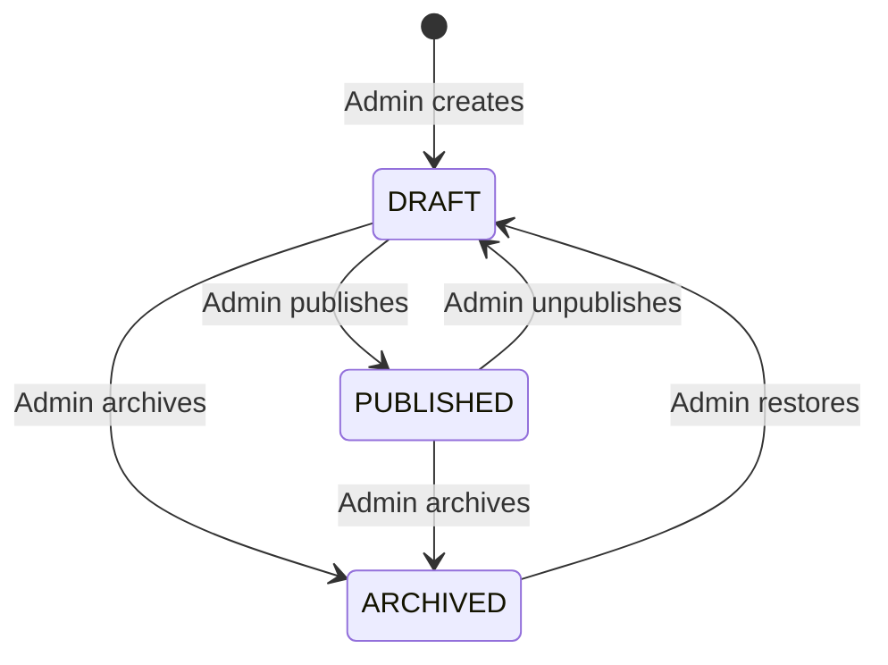

`is_active` is an independent emergency toggle. The public API returns a slide only when it is `PUBLISHED`, active, and inside its optional `display_start_at`/`display_end_at` window.

The public response is localized and does not expose draft metadata or both language columns. **Wire format uses snake_case**, matching `features/events/event-slider.ts`; the existing parser maps to the following frontend camelCase model. Keep the JSON array shape unchanged:

```ts
interface PublicEventSlider {
  id: string
  title: string
  description: string | null
  imageUrl: string
  imageAlt: string
  eventStartAt: string | null
  eventEndAt: string | null
  location: string | null
  cta: { label: string; href: string } | null
  sortOrder: number
}
```

Admin read/write schemas expose both EN/DE variants, status, visibility, display window, optional `event_id`, audit timestamps, and storage metadata required to replace or clean up an image.

### Event Slider Permissions

| Action | Public/User | Admin |
|--------|-------------|-------|
| View active published sliders | ✅ | ✅ |
| View drafts, archived, inactive, or scheduled sliders | ❌ | ✅ |
| Create/edit/delete slider | ❌ | ✅ (audit logged) |
| Publish/unpublish/archive slider | ❌ | ✅ (audit logged) |
| Toggle visibility | ❌ | ✅ (audit logged) |
| Reorder sliders | ❌ | ✅ (transactional + audit logged) |
| Upload/replace slider image | ❌ | ✅ |

### Event Slider Validation and Storage

- Languages are EN/DE only. Both titles and image alt texts are required; descriptions, CTA labels, event dates, and locations are optional but must be complete in both languages when provided.
- Published records require titles of 1–120 characters and image alt texts of 1–200 characters in both languages. Descriptions are limited to 500 characters, locations to 200 characters, and CTA labels to 40 characters per language. Drafts may be incomplete but cannot be published until the full publish schema passes.
- `display_end_at` must be after `display_start_at`; `event_end_at` must be after `event_start_at`.
- CTA accepts a safe relative path or HTTPS URL only. A CTA label requires either `event_id` or `cta_url`; conflicting Event and custom destinations are rejected. When `event_id` is set, the API emits the canonical Event detail URL; legacy static `post/*.html` links are forbidden.
- `sort_order` is a non-negative integer. Reordering is validated and committed in one database transaction.
- Slider posters keep the existing public `event-slider-images` bucket, for non-sensitive promotional assets only; drafts are not confidential media because public URLs are readable by anyone holding them. Private event/profile images are never copied here automatically. Only verified JPEG/PNG/WebP up to 5 MiB and 4096×4096 are accepted; shared EVS-003 decoding/metadata removal/security rules apply. A private event may not be attached to public promotion.
- Replacing or deleting a slider cleans up the superseded object after the database transaction succeeds. A periodic orphan cleanup is retained as a recovery mechanism.

### Event Slider Freshness and Cache Invalidation

- Public responses use no-cache revalidation or max-age no greater than 60 seconds and are invalidated after successful Admin mutations, including linked Event edits. Private/signed-URL responses use no-store; global shared caches never hold member content.
- TanStack Query keys include locale. Admin mutations invalidate both admin and public Event Slider query families in the current client.
- Public clients refetch on mount, window focus, and every 60 seconds. This provides dynamic updates without source changes or frontend redeployment; real-time WebSocket/Supabase Realtime push is outside MVP scope.
- The Admin UI uses optimistic ordering with rollback on API failure. Create/edit/status/delete operations update only after server confirmation.
- Public UI must provide localized loading, retryable error, and empty states. A failed slider request must not block the rest of the landing page.

### Event Slider End-to-End Acceptance Criteria

- [ ] Admin can create, edit, publish/unpublish/archive, activate/deactivate, reorder, and delete sliders without changing frontend source or redeploying it.
- [ ] Public API requires no authentication and returns only active `PUBLISHED` records inside their display window, ordered by `sort_order` and localized for `locale=en|de`.
- [ ] Admin API returns both language variants and rejects unauthenticated requests with 401 and non-Admin requests with 403.
- [ ] Every successful Admin mutation is recorded in `AUDIT_LOG` with old/new values; reorder is represented as one logical audited operation.
- [ ] Image upload rejects invalid type, MIME mismatch, oversize, and over-dimension files; replacement/deletion does not leave permanent orphan objects.
- [ ] An eligible linked Event deletion preserves slider rows with NULL FK, DRAFT status and no CTA; blocked dependencies return 409. Linked Event date/title changes propagate from the database without editing a slide separately.
- [ ] Public users see confirmed Admin changes on the next mount/focus or within the 60-second refetch interval, without a source edit or frontend deployment.
- [ ] Loading, error/retry, empty, single-slide, multiple-slide, reduced-motion, and EN/DE behaviors are tested.
- [ ] Production builds contain no development mock records or legacy event-poster assets.

---

## PART 20 — ADMIN DASHBOARD ARCHITECTURE

### 11 Admin Modules

| Module | Path | Purpose |
|--------|------|---------|
| **Overview** | `/admin/dashboard` | Stats cards, quick metrics |
| **Users** | `/admin/users` | View/search/filter users, view profiles |
| **Matching** | `/admin/matching` | Run algorithms, preview, override, history |
| **Events** | `/admin/events` | CRUD, publication, cover media, recap tab; later gallery |
| **Event Sliders** | `/admin/event-sliders` | Localized slider CRUD, image upload, publish/visibility controls, ordering |
| **Announcements** | `/admin/announcements` | Create/publish announcements to target audiences |
| **Knowledge Base** | `/admin/knowledge-base` | Upload/manage RAG documents |
| **Campus** | `/admin/campus` | Manage buildings, rooms, POIs |
| **Analytics** | `/admin/analytics` | Charts for users, matching, events, AI |
| **Audit Log** | `/admin/audit-log` | Searchable log of all admin actions |
| **Settings** | `/admin/settings` | Admin account settings |

### Admin Overview Stats Cards

```
┌──────────────────┬──────────────────┬──────────────────┬──────────────────┐
│  Total Users     │  Active Matches  │  Published Events│  AI Queries Today│
│  142             │  67              │  12              │  89              │
└──────────────────┴──────────────────┴──────────────────┴──────────────────┘
┌──────────────────┬──────────────────┐
│ Unmatched        │ Upcoming Events  │
│ Students: 8      │ 3 this week      │
└──────────────────┴──────────────────┘
```

### Admin UI Design Principles

- **Clean, functional, data-dense** — not flashy
- **Tables with sort/filter/search** for all list views
- **Forms with validation** for all create/edit operations
- **Confirmation dialogs** for destructive actions
- **Loading/empty/error states** on every data view
- **VGU brand colors** but clearly distinguishable from User UI (e.g., darker sidebar, admin badge)
- **Responsive** — works on tablet but optimized for desktop

---

## PART 21 — COMPLETE API PERMISSION MATRIX

### Authentication

| Endpoint | Method | User | Admin | Auth Required |
|----------|--------|------|-------|---------------|
| `/api/auth/csrf` | GET | ✅ | ✅ | No |
| `/api/auth/register` | POST | ✅ (creates USER) | ❌ | No; CSRF required |
| `/api/auth/login` | POST | ✅ | ✅ | No; CSRF required |
| `/api/auth/refresh` | POST | ✅ | ✅ | Yes (refresh token) |
| `/api/auth/me` | GET | ✅ | ✅ | Yes |
| `/api/auth/change-password` | POST | ✅ | ✅ | Yes; CSRF required |
| `/api/auth/logout` | POST | ✅ | ✅ | Yes; CSRF required |

All authenticated requests rely on HttpOnly cookies and `credentials: "include"`; state-changing endpoints additionally require the approved CSRF header. No endpoint accepts a frontend-managed bearer token as the browser session contract.

### Profile

All these reads are authenticated, no-store; all mutations require CSRF. Photo delivery checks ownership/coordinator/live-match relationship and never trusts a client object path.

| Endpoint | Method | USER | ADMIN | Owner task |
|----------|--------|------|-------|------------|
| `/api/profile` | GET/PUT | Own only | No | BE-012 |
| `/api/interests`, `/api/languages` | GET | Yes | Yes | BE-015 |
| `/api/profile/interests`, `/api/profile/languages` | PUT | Own only | No | BE-015 |
| `/api/profile/completion` | GET | Own only | No | BE-016 |
| `/api/profile/photos` | POST | Own only | No | BE-014 |
| `/api/profile/photos/:id` | DELETE | Own only | No | BE-014 |
| `/api/profile/photos/:id/url` | GET | Own or live-match photo | Audited coordinator access | BE-014 |
| `/api/admin/users`, `/api/admin/users/:id` | GET | No | Minimal list / audited detail | BE-013 |

### Events and Recaps

Admin routes always require verified ADMIN; mutations additionally require CSRF. Public/member reads use the audience rule even when the request happens to come from an ADMIN.

| Endpoint | Method | Access / behavior | Owner task |
|----------|--------|-------------------|------------|
| `/api/events`, `/api/events/:id` | GET | PUBLIC published/cancelled; valid USER additionally MEMBERS; no drafts | EVT-005 |
| `/api/admin/events`, `/api/admin/events/:id` | GET | ADMIN all editorial states | EVT-006 |
| `/api/admin/events` | POST | ADMIN create draft | EVT-006 |
| `/api/admin/events/:id` | PUT/DELETE | ADMIN edit/delete with dependency and version checks | EVT-006 |
| `/api/admin/events/:id/status` | PATCH | ADMIN editorial transition | EVT-006 |
| `/api/admin/events/:id/media` | POST | ADMIN upload to private storage | EVT-011 |
| `/api/admin/events/:id/media/:mediaId` | PATCH/DELETE | ADMIN same-event metadata/order/removal | EVT-011 |
| `/api/events/:id/media/:mediaId/url` | GET | Parent/recap audience authorization; short-lived URL | EVT-011 |
| `/api/admin/events/:id/recap` | GET/PUT/DELETE | ADMIN own event recap management | EVT-013 |
| `/api/admin/events/:id/recap/status` | PATCH | ADMIN publish/unpublish after ended-event validation | EVT-013 |
| `/api/events/:id/recap` | GET | Published recap AND readable published parent | EVT-013 |
| `/api/events/:id/register` | POST | USER, optional internal registration later | EVT-007 |
| `/api/admin/events/:id/registrations` | GET | ADMIN, later internal registration | EVT-007 / ADMIN-011 |

### Event Sliders

| Endpoint | Method | Public/User | Admin | Auth Required |
|----------|--------|-------------|-------|---------------|
| `/api/event-sliders?locale=en\|de` | GET | ✅ (active published only) | ✅ | No |
| `/api/admin/event-sliders` | GET | ❌ | ✅ | ADMIN session |
| `/api/admin/event-sliders` | POST | ❌ | ✅ | ADMIN session + CSRF |
| `/api/admin/event-sliders/:id` | GET | ❌ | ✅ | ADMIN session |
| `/api/admin/event-sliders/:id` | PUT | ❌ | ✅ | ADMIN session + CSRF |
| `/api/admin/event-sliders/:id` | DELETE | ❌ | ✅ | ADMIN session + CSRF |
| `/api/admin/event-sliders/:id/status` | PATCH | ❌ | ✅ | ADMIN session + CSRF |
| `/api/admin/event-sliders/:id/visibility` | PATCH | ❌ | ✅ | ADMIN session + CSRF |
| `/api/admin/event-sliders/reorder` | PATCH | ❌ | ✅ | ADMIN session + CSRF |
| `/api/admin/event-sliders/images` | POST | ❌ | ✅ | ADMIN session + CSRF |

### Matching

> **Superseded by Part 26.** The endpoint matrix immediately below documents the abandoned v2.2 Admin-published flow and must not be implemented. The authoritative V2 API groups are recommendations, invitations, current Buddies, conversations/messages and monitoring/reset APIs in Part 26.

| Endpoint | Method | User | Admin |
|----------|--------|------|-------|
| `/api/profile` (matching preference fields) | PUT | ✅ (own; BE-012) | ❌ |
| `/api/matching/my-match` | GET | ✅ (own) | ❌ |
| `/api/matching/respond` | POST | ✅ (own match) | ❌ |
| `/api/matching/feedback` | POST | ✅ | ❌ |
| `/api/admin/matching/run` | POST | ❌ | ✅ |
| `/api/admin/matching/preview` | GET | ❌ | ✅ (MATCH-013) |
| `/api/admin/matching/publish` | POST | ❌ | ✅ (MATCH-014; revalidate + CSRF) |
| `/api/admin/matching/override` | POST | ❌ | ✅ |
| `/api/admin/matching/stats` | GET | ❌ | ✅ |
| `/api/admin/matching/history` | GET | ❌ | ✅ |

### AI Assistant

| Endpoint | Method | User | Admin |
|----------|--------|------|-------|
| `/api/assistant/chat` | POST | ✅ | ✅ |
| `/api/assistant/conversations` | GET | ✅ (own) | ❌ |
| `/api/admin/knowledge-base/documents` | GET | ❌ | ✅ |
| `/api/admin/knowledge-base/documents` | POST | ❌ | ✅ |
| `/api/admin/knowledge-base/documents/:id` | DELETE | ❌ | ✅ |
| `/api/admin/knowledge-base/documents/:id/reindex` | POST | ❌ | ✅ |

### Campus

| Endpoint | Method | User | Admin |
|----------|--------|------|-------|
| `/api/campus/locations` | GET | ✅ | ✅ |
| `/api/campus/locations/:id` | GET | ✅ | ✅ |
| `/api/campus/search` | GET | ✅ | ✅ |
| `/api/admin/campus/locations` | POST | ❌ | ✅ |
| `/api/admin/campus/locations/:id` | PUT | ❌ | ✅ |
| `/api/admin/campus/locations/:id` | DELETE | ❌ | ✅ |

### Admin Management

| Endpoint | Method | User | Admin |
|----------|--------|------|-------|
| `/api/admin/users` | GET | ❌ | ✅ |
| `/api/admin/users/:id` | GET | ❌ | ✅ |
| `/api/admin/users/:id/activate` | PATCH | ❌ | ✅ |
| `/api/admin/users/:id/deactivate` | PATCH | ❌ | ✅ |
| `/api/admin/announcements` | GET/POST | ❌ | ✅ |
| `/api/admin/announcements/:id` | PUT/DELETE | ❌ | ✅ |
| `/api/admin/analytics/*` | GET | ❌ | ✅ |
| `/api/admin/audit-log` | GET | ❌ | ✅ |

### Notifications

| Endpoint | Method | User | Admin |
|----------|--------|------|-------|
| `/api/notifications` | GET | ✅ (own) | ✅ (own) |
| `/api/notifications/:id/read` | PATCH | ✅ (own) | ✅ (own) |

---

## PART 22 — AUTHENTICATION ARCHITECTURE ASSESSMENT

### Design: Same Backend, Different Frontend Entry Points

The existing auth diagram below shows role routing. In v2.2, FE-038 adds a readiness check before the USER dashboard destination: incomplete profile → onboarding, complete profile → dashboard. This does not change the completed HttpOnly-cookie transport decision.

```
/login              →  POST /api/auth/login  →  Set HttpOnly cookies + user.role=USER   →  /user/dashboard
/adminLogin         →  POST /api/auth/login  →  Set HttpOnly cookies + user.role=ADMIN  →  /admin/dashboard

If USER tries /adminLogin:
/adminLogin         →  POST /api/auth/login  →  user.role=USER  →  logout/clear cookies  →  ❌ "Not authorized as admin"  →  redirect to /
```

> [!IMPORTANT]
> **This is secure because:**
> 1. The backend doesn't care which page the login request came from — it sets HttpOnly auth cookies and returns the real role in a sanitized user object, never a token
> 2. Frontend checks if `role === "ADMIN"` when on `/adminLogin` — if not, redirects
> 3. Even if user manually navigates to `/admin/*`, the `RoleGuard` blocks rendering
> 4. Even if user calls admin APIs directly, `require_role("ADMIN")` dependency rejects with 403
> 5. `/adminLogin` is NOT a security boundary — it's a UX convenience
> 6. Zustand contains only non-sensitive session state; reload recovery comes from `/api/auth/me`, and backend authorization never trusts the client-side role

---

## PART 23 — ADMIN ACCOUNT CREATION

### Operator CLI Seed — Implemented by AUTH-019

Run `python -m app.cli create-admin --email admin@vgu.edu.vn` for a hidden password prompt and
confirmation. Non-interactive deployment can pass one password line with `--password-stdin`.
Command-line `--password` and `--password=<value>` forms are rejected because process listings and
shell history may expose command-line arguments.

The command uses the configured least-privilege `DATABASE_URL`, canonicalizes the email, applies
the shared bcrypt boundary, and commits one active, verified `ADMIN`. Duplicate email and weak or
invalid credentials exit non-zero. Existing USER/ADMIN rows are never promoted, reactivated,
reset, or otherwise modified, and database failures roll back with sanitized terminal output.

No startup hook or `INITIAL_ADMIN_*` environment contract is implemented. An automatic bootstrap
would need a separate task to define concurrency, rotation, secret delivery and idempotency.

> [!NOTE]
> **Future expansion**: Add admin invitation flow where existing ADMIN can invite new admins via email. Not needed at MVP.

---

## PART 24 — NEW MASTER IMPLEMENTATION ORDER

> [!CAUTION]
> **Buddy Matching entries in this v2.2 order are superseded.** Preserve the completed history below, but do not execute any `Next: MATCH-*`, `FE-033..037`, or `ADMIN-014..017` line as written. The exact V2 order and parallel branches are in Part 26. Non-matching Event/Admin work remains independently planned.

Historical completed steps are retained below; the pending dependency-sorted sequence is updated for v2.2. Legacy ordinal labels are retained for cross-reference and are not required to remain contiguous after the approved UI-first insertion.

```
Task 1:  FE-001  Initialize React + TypeScript + Vite
Task 2:  FE-002  Configure ESLint + Prettier
Task 3:  FE-003  Configure Tailwind CSS v3 with VGU brand
Task 4:  FE-004  Install shadcn/ui
Task 5:  FE-005  Create design system (buttons, cards, typography)
Task 6:  FE-006  Setup React Router (public/user/admin layouts)
Task 7:  FE-007  Configure environment variables
Task 8:  FE-008  Create folder structure
Task 9:  FE-009  Configure react-i18next (EN/DE)
Task 10: FE-010  Migrate existing translations to JSON
Task 11: FE-011  Create Navbar component
Task 12: FE-012  Create Footer component
Task 13: FE-013  Create Hero section
Task 14: FE-014  Create API-ready Events Slider with development-only mock repository
Task 15: FE-015  Create About section
Task 16: FE-016  Create Benefits grid
Task 17: FE-017  Create Testimonials marquee
Task 18: FE-018  Create CTA section
Task 19: FE-019  Assemble Landing Page
Task 20: FE-020  Create Language Toggle
                 ── Frontend completion remediation ──
Done:    FE-HYGIENE-001  Establish recoverable FE-016..FE-020 baseline [completed 2026-09-10]
Done:    FE-FIX-001      Fix testimonial clone accessibility [completed 2026-09-10]
Done:    FE-FIX-002      Fully localize Language Toggle labels/tooltips [completed 2026-09-10]
Done:    FE-FIX-003      Remove duplicate flag SVG IDs [completed 2026-09-10]
Done:    FE-FIX-004      Correct Landing integration coverage [completed 2026-09-10]
Done:    FE-FIX-005      Harden marquee motion and tests [completed 2026-09-10]
Done:    FE-DEMO-001     Migrate Demo.mp4 and create WebP poster [completed 2026-09-10]
Done:    FE-DEMO-002     Create accessible Demo Video dialog [completed 2026-09-10]
Done:    FE-DEMO-003     Connect Watch Demo to the dialog [completed 2026-09-10]
                 ── UI-only authentication pages (approved before backend) ──
Done:    AUTH-001        Create User Login UI (/login) [completed 2026-09-10]
Done:    AUTH-002        Create Student Registration UI (/register) [completed 2026-09-10]
Done:    AUTH-003        Create direct-URL-only Admin Login UI (/adminLogin) [completed 2026-09-11]
Done:    FE-AUTH-ENTRY-001  Add desktop User Sign in menu [completed 2026-09-11]
Done:    FE-AUTH-ENTRY-002  Add mobile User auth actions [completed 2026-09-11]
Done:    FE-AUTH-ENTRY-003  Route Join the Community to /register [completed 2026-09-11]
Done:    FE-TECH-001        Assess TypeScript strict mode [completed 2026-09-11]
Done:    FE-VERIFY-001      Run Frontend completion gate [completed 2026-09-11]
Done:    FE-CLOSEOUT-001    Restore formatting and type-check gates [completed 2026-09-11]
Done:    FE-CLOSEOUT-002    Isolate modal background content [completed 2026-09-11]
Done:    FE-CLOSEOUT-003    Finalize public route scroll restoration [completed 2026-09-11]
Done:    FE-HYGIENE-002     Verify auth layouts and restore repository hygiene [completed 2026-09-11]
Done:    AUTH-ARCH-001      Decide JWT transport and frontend auth-state boundary [completed 2026-09-11]
                 ── Frontend UI and auth architecture complete ──
Done: BE-001                  Initialize FastAPI project with pyproject.toml [P0; Phase 2; completed 2026-09-12]
Done: BE-002                  Create project structure (api/, core/, models/, schemas/, services/) [P0; Phase 2; completed 2026-09-12]
Done: BE-003                  Configure SQLAlchemy 2.0 + Alembic [P0; Phase 2; completed 2026-09-12]
Done: BE-004                  Configure Supabase PostgreSQL connection and database access boundary [P0; Phase 2; completed 2026-09-12]
Done: BE-005                  Create Docker Compose for local dev (PostgreSQL + pgvector) [P0; Phase 2; completed 2026-09-13]
Done: BE-006                  Create base model class with audit fields (id, created_at, updated_at, deleted_at) [P0; Phase 2; completed 2026-09-16]
Done: BE-007                  Configure credentialed CORS with explicit frontend origins, methods, and headers [P0; Phase 2; completed 2026-09-16]
Done: AUTH-007                Define UserRole enum (USER, ADMIN) in models [P0; Phase 5; completed 2026-09-16]
Done: AUTH-008                Create User database model with role field [P0; Phase 5; completed 2026-09-16]
Done: AUTH-009                Create Alembic migration for users table [P0; Phase 5; completed 2026-09-16]
Done: AUTH-010                Create password hashing service (bcrypt) [P0; Phase 5; completed 2026-09-16]
Done: AUTH-011                Create JWT cookie service (create/verify access + rotating refresh tokens) [P0; Phase 5; completed 2026-09-16]
Done: AUTH-011A               Create signed CSRF service and `GET /api/auth/csrf` endpoint [P0; Phase 5; completed 2026-09-16]
Done: AUTH-012                Create auth service (register, login, verify role) [P0; Phase 5; completed 2026-09-17]
Done: AUTH-013                Create CSRF-protected `POST /api/auth/register` endpoint (role=USER always) [P0; Phase 5; completed 2026-09-17]
Done: AUTH-014                Create CSRF-protected `POST /api/auth/login` endpoint (sets cookies; returns sanitized user) [P0; Phase 5; completed 2026-09-17]
Done: AUTH-015                Create CSRF-protected `POST /api/auth/refresh` endpoint with rotation/reuse detection [P0; Phase 5; completed 2026-09-17]
Done: AUTH-017                Create verified-current-user authentication dependency [P0; Phase 5; completed 2026-09-17]
Done: AUTH-016                Create sanitized current-session endpoint [P0; Phase 5; completed 2026-09-17]
Done: AUTH-018                Create `require_role(role)` FastAPI dependency (verify role) [P0; Phase 5; completed 2026-09-17]
Done: AUTH-019                Create admin seed CLI command (`python -m app.cli create-admin`) [P0; Phase 5; completed 2026-09-17]
Gate: AUTH-020                Implemented; local/live acceptance PASS; production Redis/TLS/ingress smoke pending [P0; Phase 5]
Done: AUTH-024                Backend/live and frontend/cache integration acceptance PASS [P0; Phase 5; integration completed 2026-09-18]
Done: AUTH-004                Create non-persisted Zustand session store (status, user, role; no tokens) [P0; Phase 4; completed 2026-09-17]
Done: AUTH-021                Connect session client, registration, and auth bootstrap [P0; Phase 5; completed 2026-09-18]
Done: AUTH-005                Create ProtectedRoute component (requires auth) [P0; Phase 4; completed 2026-09-18]
Done: AUTH-006                Create RoleGuard component (requires specific role) [P0; Phase 4; completed 2026-09-18]
Done: AUTH-022                Implement login flow: User login → role check → redirect [P0; Phase 5; completed 2026-09-18]
Done: AUTH-023                Implement admin login flow: Admin login → role=ADMIN check → redirect [P0; Phase 5; completed 2026-09-18]
Done: FE-021                  Create UserLayout component (sidebar + content area) [P0; Phase 6; completed 2026-09-18]
Done: FE-022                  Create User Sidebar navigation [P0; Phase 6; completed 2026-09-18]
Done: ADMIN-001               Create AdminLayout component (sidebar + content) — clean, data-dense [P0; Phase 7; completed 2026-09-18]
Done: ADMIN-002               Create Admin Sidebar navigation (all 11 modules) [P0; Phase 7; verified 2026-09-19]
Done: ADMIN-003               Create Admin Dashboard overview page (stats cards placeholder) [P0; Phase 7; verified 2026-09-19]
Done: ADMIN-004               Create reusable DataTable component (sort, filter, search, pagination) [P0; Phase 7; verified 2026-09-19]
Done: ADMIN-005               Create reusable ConfirmDialog component [P0; Phase 7; completed 2026-09-19]
Done: EVT-008                 Create audit log model, migration and service [P0; Phase 10; completed 2026-09-19]
Done: EVS-003                 Create shared Supabase image storage service and bucket policies [P0; Phase 8; completed 2026-09-19]
Done: BE-008                  Define unified StudentProfile and ProfilePhoto models [P0; Phase 8; completed 2026-09-19]
Done: BE-009                  Define Interest catalog and profile interest/language relations [P0; Phase 8; completed 2026-09-19]
Done: BE-010                  Create profile, catalog and photo migrations [P0; Phase 8; completed 2026-09-19]
Done: BE-011                  Create own-profile persistence service [P0; Phase 8; completed 2026-09-19]
Done: BE-012                  Create own-profile read/update endpoints [P0; Phase 8; completed 2026-09-20]
Done: BE-013                  Create authorized admin user list and detail reads [P0; Phase 8; completed 2026-09-20]
Done: BE-014                  Implement own profile photo upload and removal [P0; Phase 8; completed 2026-09-20]
Done: BE-015                  Implement profile interest and language catalog APIs [P0; Phase 8; completed 2026-09-20]
Done: BE-016                  Implement profile completion and matching eligibility read model [P0; Phase 8; completed 2026-09-20]
Done: FE-025                  Create onboarding Step 1: identity and student type [P0; Phase 9; completed 2026-09-20]
Done: FE-026                  Create onboarding Step 2: interests and languages [P0; Phase 9; completed 2026-09-20]
Done: FE-028                  Create own social-style profile view [P0; Phase 9; completed 2026-09-20]
Done: FE-039                  Create reusable profile avatar upload control [P0; Phase 9; completed 2026-09-20]
Done: FE-027                  Create onboarding Step 3: availability and preferences [P0; Phase 9; completed 2026-09-20]
Done: FE-029                  Create profile edit page using onboarding field components [P0; Phase 9; completed 2026-09-20]
Done: FE-038                  Integrate onboarding routing and readiness gate [P0; Phase 9; completed 2026-09-20]
Done: FE-023                  Create profile-aware User Dashboard home [P0; Phase 6; completed 2026-09-21]
Done: EVT-001                 Define Event editorial state, time and visibility model [P0; Phase 10; completed 2026-09-21]
Done: EVT-002                 Create EventRegistration model [P0; Phase 10; completed 2026-09-21]
Done: EVT-010                 Define EventMedia ownership model [P0; Phase 10; completed 2026-09-21]
Done: EVT-003                 Create Event, EventMedia and registration migrations [P0; Phase 10; completed 2026-09-21]
Done: EVT-004                 Create event CRUD and publication service [P0; Phase 10; completed 2026-09-22]
Superseded: MATCH-001          Old Match/reservation persistence contract; use Part 26 BUDDY-001
Superseded: MATCH-007          Old reservation eligibility contract; use Part 26 REC-001
Superseded: MATCH-003          Old weights contract; use Part 26 REC-002
Superseded: MATCH-004          Greedy assignment removed by V2
Superseded: MATCH-008          Admin matching run removed by V2
Superseded: MATCH-013          Admin preview/history contract removed by V2
Superseded: MATCH-014          Admin publish/override removed by V2
Superseded: MATCH-009          Old own-match endpoint; use Part 26 INV/BUDDY APIs
Superseded: MATCH-010          Two-party response removed; use Part 26 INV-005/006
Superseded: FE-033             Use Part 26 REC-004/INV-007 Buddy Matching page
Superseded: FE-034             Use Part 26 safe recommendation/invitation/Buddy cards
Superseded: FE-035             Use Part 26 INV-007 recipient decision UI
Superseded: FE-037             Use Part 26 BUDDY-003 route-compatible Current Buddies
Superseded: ADMIN-014          Use Part 26 ADMIN-V2-001/002 monitoring
Superseded: ADMIN-015          Admin Run Matching removed by V2
Superseded: ADMIN-016          Admin preview/publish removed by V2
Superseded: ADMIN-017          Admin manual override removed by V2
Next: EVT-005                 Create audience-safe event list, detail and calendar queries [P0; Phase 10]
Next: EVT-006                 Create admin event list, detail, CRUD and status APIs [P0; Phase 10]
Next: EVT-009                 Integrate event audit and content freshness [P0; Phase 10]
Next: EVT-011                 Implement authorized event media lifecycle API [P0; Phase 10]
Next: EVT-012                 Define EventRecap model and migration [P0; Phase 10]
Next: EVT-013                 Implement recap editing and publication APIs [P0; Phase 10]
Next: EVS-001                 Create EventSlider model, status enum, Pydantic schemas, and EN/DE field contract [P0; Phase 10A]
Next: EVS-002                 Create EventSlider migration and Event linkage constraints [P0; Phase 10A]
Next: EVS-004                 Create EventSlider CRUD and canonical linked-event projection [P0; Phase 10A]
Next: EVS-005                 Create public `GET /api/event-sliders` endpoint [P0; Phase 10A]
Next: EVS-006                 Create Admin EventSlider CRUD, status, visibility, reorder, and upload endpoints [P0; Phase 10A]
Next: EVS-007                 Add EventSlider API/storage/RBAC/audit tests and cache invalidation contract [P0; Phase 10A]
Next: ADMIN-006               Create Admin Events list with editorial/time filters [P0; Phase 11]
Next: ADMIN-007               Create Event form with managed cover upload [P0; Phase 11]
Next: ADMIN-008               Create Edit Event form [P0; Phase 11]
Next: ADMIN-009               Create event publish, unpublish and cancel controls [P0; Phase 11]
Next: ADMIN-010               Create event deletion with dependency-aware confirmation [P0; Phase 11]
Next: ADMIN-012               Create Admin User Management page (DataTable) [P0; Phase 11]
Next: ADMIN-013               Create User detail view (profile, match status, activity) [P0; Phase 11]
Next: ADMIN-EVT-001           Create recap editor and publish controls [P0; Phase 11]
Next: ADMIN-SLIDER-001        Create `/admin/event-sliders` list with status/visibility filters and loading/error/empty states [P0; Phase 11A]
Next: ADMIN-SLIDER-002        Create EN/DE EventSlider create/edit form with Event link, CTA, schedule, and image upload [P0; Phase 11A]
Next: ADMIN-SLIDER-003        Add publish/draft/archive, active toggle, and delete confirmation controls [P0; Phase 11A]
Next: ADMIN-SLIDER-004        Add transactional drag/drop ordering with optimistic UI and rollback [P0; Phase 11A]
Next: FE-031                  Create audience-aware Event detail and recap view [P0; Phase 12]
Next: FE-014B                 Verify live Event Slider integration and linked Event freshness [P0; Phase 12A]
Next: AUTH-025                Implement authenticated password change endpoint [P1; Phase 5]
Next: FE-024                  Create User Settings page with real session actions [P1; Phase 6]
Next: EVT-007                 Create `POST /api/events/:id/register` (user registers for event) [P1; Phase 10]
Next: ADMIN-011               Create admin event registration detail view [P1; Phase 11]
Next: ADMIN-EVT-002           Create recap gallery upload and ordering UI [P1; Phase 11]
Next: FE-030                  Create published event list for users [P1; Phase 12]
Next: FE-032                  Create Event registration button [P1; Phase 12]
Next: FE-EVENT-CALENDAR-001   Create Event Calendar UI after stable Event API [P1; Phase 12B]
Deferred/recontract: MATCH-002/011 + FE-036  Match feedback is outside confirmed V2 and depends on a future V2 contract
Deferred/recontract: MATCH-012               Synthetic research data is not a V2 release dependency
Superseded: ADMIN-018                         Old algorithm/publication history is removed; monitoring uses ADMIN-V2
Deferred/recontract: MATCH-005/006            1:1 assignment research does not drive V2 recommendations
```

### Execution gates and independent tracks

The list above is topologically sorted within the selected delivery lane; completed task IDs and historical ordinal labels are retained above it. Phase labels group responsibilities; storage is Phase 8 shared work, and FE-023 is integrated after profile readiness even though it remains in Dashboard Phase 6. Dependencies take precedence over a numeric ID. P0 is the core release; P1/P2 tasks follow it unless explicitly a prerequisite. No completed task is reopened by this audit. The 2026-09-22 demo-priority override selects the independent Matching lane before the remaining Event lane; it does not claim that Event dependencies changed or that Event work is no longer part of the core release.

Shared: **BE-001 → BE-002..007 → Auth Backend/RBAC + AUTH-024 → AUTH-004..006/021..023 → guarded layouts**, plus EVT-008 audit and EVS-003 storage.

User/Profile/Matching: **BE-008/009 → BE-010 → BE-011/012 → BE-014/015 → BE-016 → FE-025/026/039/027 → FE-038 → FE-023/028/029 → MATCH-001 → MATCH-007 → MATCH-003 → MATCH-004 → MATCH-008/013/014 → MATCH-009/010 → FE-033/034/035/037 + ADMIN-014/015/016/017 → real two-user cross-type plus Admin acceptance**. The code-level Profile dependencies and local Profile/avatar persistence acceptance are complete, so MATCH-001 is ready.

Event/Admin: **EVT-001/002/010 → EVT-003 → EVT-004/005/006 → EVT-009/011 → EVT-012/013 → ADMIN-006..010 + ADMIN-EVT-001 → EVS-001/002/004/005/006/007 → ADMIN-SLIDER-001..004 → FE-031 → FE-014B**. Existing EVS-003 has already supplied shared storage. The two tracks may proceed independently after shared auth/storage/audit; for the demo deadline, pause the Event lane after completed EVT-004 and resume it after the Matching demo slice. This is sequencing guidance, not an instruction to spawn agents.

Core release gate: all P0 contracts, including basic matching and basic recap, pass their integration/security acceptance criteria. The landing-only milestone in the previous order is not the complete Buddy MVP. A working API plus admin-to-public checks must prove content updates without a redeploy. Calendar UI (FE-EVENT-CALENDAR-001), full recap gallery (ADMIN-EVT-002), internal registration (EVT-007/FE-032), settings password change and feedback follow as P1. MATCH-005/006 are Phase 16 research.

Later RAG/Knowledge Base/Campus/Analytics/Notifications/Portfolio tracks retain their product intent in Parts 9–14. The old master-order shorthand reused FE-035..037 for RAG and ADMIN-019..027 without actual task contracts; those ambiguous aliases are withdrawn, not renumbered completed tasks. Allocate unique IDs and full contracts before starting those future tracks. Numerical completion progress is optional UI in FE-023; notifications remain a later track, not a prerequisite for reading a match or an event.

### Demo priority classes (temporary delivery order)

- **P0 — MUST HAVE FOR DEMO:** MATCH-001, MATCH-007, MATCH-003, MATCH-004, MATCH-008, MATCH-013, MATCH-014, MATCH-009, MATCH-010, FE-033, FE-034, FE-035, FE-037, ADMIN-014, ADMIN-015 and ADMIN-016; then a real two-student plus Admin local acceptance run against migrated PostgreSQL and configured private image storage.
- **P1 — SHOULD HAVE:** ADMIN-017 constrained manual override and clear seeded/demo operator notes. These improve recovery during the demo but do not replace the algorithmic run/publish path.
- **P2 — POST-DEMO for this deadline:** the remaining Event/EventSlider/Admin Event lane, AUTH-025/FE-024, event registration/calendar, feedback/history and MATCH-005/006 research. Their existing product-release priorities and dependencies are unchanged; this label is only the September 22 demo schedule.

### DEMO CRITICAL PATH

`MATCH-001 → MATCH-007 → MATCH-003 → MATCH-004 → MATCH-008 → MATCH-013 → MATCH-014 → MATCH-009 → MATCH-010 → FE-033 → FE-034 → FE-035 → FE-037 → ADMIN-014 → ADMIN-015 → ADMIN-016 → real local two-user cross-type plus Admin acceptance`

The prerequisite Profile path is no longer a MATCH-001 blocker: the configured local environment, migrated PostgreSQL database, backend-owned session flow and real avatar upload/crop/reload persistence have passed, while automated coverage verifies both Vietnamese and international Profile rules. The final runtime gate belongs at the end of the vertical slice and must verify the complete two-user cross-type matching workflow.

The final acceptance is a gate, not a new implementation task: create one Admin through AUTH-019, register one Vietnamese and one international USER through AUTH-013/AUTH-021, complete both profiles through the existing Profile flow, run/preview/publish through the new Admin UI, accept from both user sessions, and verify the active Buddy result after reload. It must use PostgreSQL and the configured private storage service; no fake users, fake match result or frontend-only success state may satisfy it.

**Next development task: MATCH-001 — Create Match model and persistence constraints. Dependency BE-010 is DONE and the local Profile/runtime prerequisite has passed, so MATCH-001 is READY. AUTH-020 production acceptance remains pending operator-provided Redis/TLS/ingress configuration and is a deployment gate, not a blocker for local Matching development. Continue the direct-to-main workflow; execute MATCH-001 only when explicitly requested.**

---

## Repository Structure (Final)

```
vgu-student-companion/
├── apps/
│   ├── web/                    # React frontend
│   │   ├── src/
│   │   │   ├── assets/
│   │   │   ├── components/
│   │   │   │   ├── ui/         # shadcn/ui
│   │   │   │   ├── layout/     # PublicLayout, UserLayout, AdminLayout
│   │   │   │   └── landing/    # Hero, dynamic Event Slider, About, Benefits, Testimonials, CTA
│   │   │   ├── features/
│   │   │   │   ├── auth/       # Login, Register, AdminLogin, guards
│   │   │   │   ├── events/     # Event + Event Slider contracts, repositories, queries, dev mocks
│   │   │   │   ├── profile/
│   │   │   │   ├── matching/
│   │   │   │   ├── assistant/
│   │   │   │   ├── campus/
│   │   │   │   └── admin/      # All admin module components
│   │   │   ├── hooks/
│   │   │   ├── lib/            # api.ts, utils.ts
│   │   │   ├── locales/        # en/, de/
│   │   │   ├── pages/          # public/, user/, admin/
│   │   │   ├── stores/         # authStore.ts, uiStore.ts
│   │   │   └── types/
│   │   ├── public/
│   │   ├── package.json
│   │   └── vite.config.ts
│   └── api/                    # FastAPI backend
│       ├── app/
│       │   ├── api/
│       │   │   ├── auth.py
│       │   │   ├── profile.py
│       │   │   ├── events.py
│       │   │   ├── event_sliders.py
│       │   │   ├── matching.py
│       │   │   ├── assistant.py
│       │   │   ├── campus.py
│       │   │   ├── notifications.py
│       │   │   └── admin/      # Admin-only endpoints
│       │   │       ├── users.py
│       │   │       ├── events.py
│       │   │       ├── event_sliders.py
│       │   │       ├── matching.py
│       │   │       ├── knowledge_base.py
│       │   │       ├── campus.py
│       │   │       ├── announcements.py
│       │   │       ├── analytics.py
│       │   │       └── audit_log.py
│       │   ├── core/
│       │   │   ├── config.py
│       │   │   ├── security.py   # JWT, hashing, require_auth, require_role
│       │   │   ├── database.py
│       │   │   └── startup.py    # Admin seed on boot
│       │   ├── models/
│       │   │   ├── user.py       # User + UserRole enum
│       │   │   ├── profile.py
│       │   │   ├── event.py
│       │   │   ├── event_slider.py
│       │   │   ├── match.py
│       │   │   ├── document.py
│       │   │   ├── campus.py
│       │   │   ├── notification.py
│       │   │   ├── announcement.py
│       │   │   └── audit_log.py
│       │   ├── schemas/          # Pydantic schemas
│       │   ├── services/
│       │   │   ├── auth.py
│       │   │   ├── profile.py
│       │   │   ├── event.py
│       │   │   ├── event_slider.py
│       │   │   ├── storage.py
│       │   │   ├── matching/
│       │   │   ├── rag/
│       │   │   ├── campus.py
│       │   │   └── audit.py
│       │   ├── cli.py            # create-admin command
│       │   └── main.py
│       ├── alembic/
│       ├── tests/
│       ├── pyproject.toml
│       └── Dockerfile
├── docs/
├── research/
├── scripts/
├── docker-compose.yml
├── .github/workflows/ci.yml
└── README.md
```

---

## OPEN QUESTIONS (Resolved from v1)

| Question | Decision |
|----------|----------|
| Tech stack | ✅ Confirmed: FastAPI + React/TS + Supabase |
| Database | ✅ Supabase managed PostgreSQL + pgvector |
| Repository | ✅ New repository: `vgu-student-companion` |
| Hosting budget | Superseded: provider cost and quota approval is controlled by Part 26.17; no paid fallback is automatic |
| Vietnamese language | ✅ Not needed. EN/DE only |
| RBAC | ✅ USER + ADMIN roles, integrated throughout |
| Event Slider ownership | ✅ Admin-managed dynamic entity with optional Event link; never production-hard-coded |
| Event Slider freshness | ✅ API-driven; refetch on mount/focus and every 60 seconds; no real-time push in MVP |
| Event Slider storage | ✅ Supabase Storage; JPEG/PNG/WebP, 5 MB, 4096×4096 limits |


---

## PART 25 — PROFILE, MATCHING AND EVENT TASK CONTRACTS (v2.2)

Tasks in this section remain **PLANNED / NOT IMPLEMENTED** unless their own status records completion; BE-004 was completed after this audit on 2026-09-12. Existing IDs extend their original responsibility; newly added IDs fill missing API/UI work. Priority: P0=MUST HAVE, P1=SHOULD HAVE, P2=LATER/RESEARCH. Shared acceptance requirements apply in addition to each task's criteria: backend mutations enforce server auth/role/ownership, approved CSRF and input validation; private reads never use shared caches; user-facing UI preserves EN/DE and keyboard access. Backend tasks include relevant API/service/migration tests; UI integration tasks verify the real contract and failure states.

### BE-004 — Configure Supabase PostgreSQL connection and database access boundary

**Task ID:** `BE-004`  
**Change:** Updated existing; **Status:** Completed (✅) on 2026-09-12; **Priority:** P0; **Phase:** 2  
**Goal:** Use the existing database provider without creating a second authentication authority.  
**Dependencies:** BE-003  
**Scope:** SQLAlchemy server connection, separate migration/runtime credentials, non-exposed application schema, environment documentation.

**Acceptance Criteria:**

- [x] A database smoke check succeeds through FastAPI; no database or service secret is emitted in a VITE variable.
- [x] Application tables cannot be read through anonymous Supabase Data API; migrations explicitly preserve grants/RLS boundaries.

**Out of Scope:** Supabase Auth migration, provider changes, production provisioning in this audit.

### AUTH-017 — Create verified-current-user authentication dependency

**Task ID:** `AUTH-017`  
**Change:** Updated existing; **Status:** Completed (✅) on 2026-09-17; **Priority:** P0; **Phase:** 5
**Goal:** Give profile/media/matching endpoints a current server identity.  
**Dependencies:** AUTH-011, AUTH-009  
**Scope:** Verify access-cookie JWT and load active, non-deleted User; role is checked against the database.

**Acceptance Criteria:**

- [x] Invalid/expired/missing cookie or deleted/inactive user is rejected; stale JWT role cannot restore removed privileges.
- [x] Current identity is never supplied by a body, query string or UI store.

**Out of Scope:** Replacing the completed auth transport design.

### AUTH-016 — Create sanitized current-session endpoint

**Task ID:** `AUTH-016`  
**Change:** Updated existing; **Status:** Completed (✅) on 2026-09-17; **Priority:** P0; **Phase:** 5
**Goal:** Restore a verified session before profile routing.  
**Dependencies:** AUTH-017  
**Scope:** GET /api/auth/me through require_auth with no-store and sanitized User DTO.

**Acceptance Criteria:**

- [x] Reload returns verified current role without tokens/password hash; unauthenticated request returns 401.
- [x] Profile absence does not prevent authentication; onboarding readiness is fetched separately by FE-038.

**Out of Scope:** Returning whole profile or modifying AUTH-ARCH-001.

### AUTH-004 — Create non-persisted Zustand session store

**Task ID:** `AUTH-004`
**Status:** COMPLETED (✅) on 2026-09-17; **Priority:** P0; **Phase:** 4
**Dependencies:** FE-001, AUTH-ARCH-001 (both completed).
**Goal:** Provide an in-memory presentation of the backend-owned session without token storage.
**Scope:** Zustand store and shared sanitized User types/validation, ready for AUTH-021 integration.

**Operational Acceptance Criteria** (derived from the registry and AUTH-ARCH-001 before coding):

- [x] Fresh store starts `unknown` with null user/role; explicit loading/authenticated/unauthenticated/reset transitions work. — All-state transition and fresh-module tests PASS.
- [x] Authenticated state retains only sanitized User fields and role; role updates atomically with User and cannot retain a previous account through supported actions. — USER/ADMIN, switching and subscription tests PASS; malformed data clears previous identity.
- [x] No JWT, refresh token, password/hash, CSRF or private-profile fields retained; no persistence/storage, cookie or network access. — Payload projection/immutability and storage/cookie/IndexedDB/network checks PASS.
- [x] React selectors update; clear/reset preserve reusable actions; reload ignores stale Web Storage and requires later `/api/auth/me` bootstrap. — Actual Zustand + React hook and isolated fresh-module tests PASS.
- [x] Existing UI-only auth/public routes and quality gates remain healthy. — Full frontend 121 tests, format/lint/strict typecheck/build/npm audit PASS; backend regression 355 PASS/10 explicit opt-in skips.

**Out of Scope:** API/client bootstrap, refresh/retry, actual logout/cache invalidation, login wiring,
route guards, production deployment, Gemini. These remain AUTH-021/022/023/005/006 or existing gates.
**Evidence:** See PART 18A AUTH-004 record and `apps/web/README.md`; 41 dedicated tests, Zustand
5.0.15 pinned with lockfile. Store is a client-only SPA singleton, never a backend authorization
source. No live browser/deployed auth claim. AUTH-024 frontend/cache AC remains pending AUTH-021.

### AUTH-005 — Create ProtectedRoute component (requires auth)

**Task ID:** `AUTH-005`
**Status:** COMPLETED (✅) on 2026-09-18; **Priority:** P0; **Phase:** 4
**Dependencies:** AUTH-004, FE-006; current AUTH-021 bootstrap integration is reused.
**Goal:** Gate private route rendering on verified session state without reload redirect flicker.
**Scope:** Reusable outlet guard, User/Admin route integration and neutral localized pending UI.

The Phase 4 registry provides title/dependencies only. These operational acceptance checks derive
from that registry and the approved AUTH-ARCH-001 guard contract, rather than a new role policy:

- [x] `unknown`/`loading` show accessible neutral EN/DE pending; private children/layouts do not mount and the requested URL remains intact. — All-state tests, child mount/unmount checks and unknown base-route tests PASS.
- [x] Confirmed `unauthenticated` redirects with history replacement to the fixed internal login surface; public routes stay reachable. — User/Admin direct/deep-link, Back-history, path/search/hash state and public route integration tests PASS.
- [x] Validated `authenticated` renders the nested outlet and existing index routes; store clear/re-verification removes private content immediately. — Actual Zustand/router selector transitions, USER/ADMIN outlet and logout/account-loading checks PASS.
- [x] AUTH-021 reload/refresh remains bounded without early private UI; existing auth/public/cache regressions and required gates pass. — StrictMode bootstrap, held final `/me` 200/401, rejected refresh, 503 feedback and pending logout/private-public cache tests PASS; real local browser cookies/database reload/logout acceptance PASS.

**Implementation:** Added `features/auth/protected-route.tsx` and two colocated test files; wrapped
all declared `/user` and `/admin` descendants in App. Anonymous login paths are `/login` and
`/adminLogin`; router state preserves only pathname/search/hash and is not consumed as a redirect.
No network/storage/cookie side effects in the guard. EN/DE copy added. A focused test exposed
AUTH-021 installing refreshed identity before bootstrap's final `/me`; bootstrap now validates
refresh User but keeps loading until `/me` succeeds. Ordinary private-request refresh is unchanged.

**Verification:** **31 focused tests PASS; full frontend 206 PASS**, Prettier/ESLint/strict
TypeScript/production build PASS. Full backend **384 PASS / 10 existing Redis live SKIP** with
3 isolated PostgreSQL live cases enabled; backend Ruff/strict mypy (57 files)/pip check PASS.
Production npm audit and strict pip-audit PASS; Git diff/credential signature review PASS with
no .env/config/dependency change or generated/lab file in Git scope.
Real browser verifies anonymous User/Admin redirects, authenticated profile deep-link reload
retaining query/hash, immediate logout redirect and denied re-entry, EN/DE surfaces, empty error
console. No source backend, dependencies, runtime .env, migrations or secrets changed.

**Out of Scope:** AUTH-006 role isolation, AUTH-022/023 login role checks/redirects, layout/profile
features, immediate access denylisting, cross-tab locking and production deployment. Authentication
guard alone permits either valid role; backend authorization remains authoritative. Existing
frontend chunk advisory, AUTH-020 production operator gate and Gemini remediation remain pending.
**Next development task:** AUTH-006 — RoleGuard; not started by AUTH-005.

### AUTH-006 — Create RoleGuard component (requires specific role)

**Task ID:** `AUTH-006`
**Status:** COMPLETED (✅) on 2026-09-18; **Priority:** P0; **Phase:** 4
**Dependencies:** AUTH-005; reuses AUTH-004 sanitized role and AUTH-021 verified bootstrap.
**Goal:** Prevent rendering private route descendants for a verified session with the wrong role.

The registry has no separate detailed AC. Operational checks below derive from its specific-role
requirement, AUTH-ARCH-001 pending contract and PART 22 authorization layering:

- [x] Unknown/loading delegate to ProtectedRoute's accessible neutral EN/DE pending, retain URL and never mount private descendants. — Both roles/statuses, localized pending and private mount checks PASS.
- [x] Anonymous sessions retain fixed User/Admin login redirects; authenticated USER can enter only User routes and ADMIN only Admin routes. — Actual router/store, both-role direct/deep/index and all 20 declared private route denial cases PASS; AUTH-005 regression preserved.
- [x] Wrong-role requests replace history with fixed public `/`, never mount private layout/children, never follow caller-supplied destinations and preserve the valid session. — Child-effect, history/Back, query/hash, unchanged identity and no-network checks PASS.
- [x] Verified role changes and session clear/re-verification immediately remove incompatible private content; bootstrap waits for final `/me`, with bounded refresh/retry and existing private-cache clearing. — StrictMode held `/me`, refresh versus final `/me` role, both refresh role transitions/private-public cache, malformed role fail-closed tests PASS.
- [x] Focused/router/client integration, real local browser cookies/database, regression and quality/security gates pass. Backend role checks remain authoritative; no credentials/persistence/network added to the guard. — 50 focused and full frontend 256 PASS; backend 384 PASS/10 existing opt-in Redis live SKIP; quality/dependency/credential checks PASS.

**Implementation:** Added reusable typed `features/auth/role-guard.tsx`, two colocated test files
and exact USER/ADMIN guards in App. Non-authenticated states reuse ProtectedRoute directly; role
selectors subscribe to sanitized verified identity. Wrong role redirects with replacement to `/`
without logout or destination state. No change to API/bootstrap/CSRF/cookies/store/backend schema.

**Verification:** Frontend format/lint/strict typecheck/production build PASS (existing >500 kB
chunk advisory). Backend Ruff/strict mypy (57 files)/pip check PASS; three PostgreSQL live cases
enabled in full regression. Production npm audit: zero vulnerabilities. Strict pip-audit: all 77
pinned external installed distributions, no known vulnerabilities. Environment-wide strict audit
rejects the local editable `vgu-buddy-api` source (not published on PyPI), so excluded editable
source via a pinned external-only audit input in the ignored disposable lab; no dependency change
or external dependency skip. Repository source is covered by regression/static/security review.
Git diff/credential-signature review PASS; no env/config/dependency, generated or lab files in Git.
Real browser + isolated PostgreSQL: anonymous Admin redirect, USER/ADMIN login, matching deep-link
reload retaining query/hash, both cross-role denials to public home retaining sessions, both index
routes, EN/DE, immediate logout and denied re-entry PASS. Browser error console empty. Acceptance
is local only; no deployed production authorization or completed business-page claim.

**Scope:** RoleGuard and existing route integration, focused tests and implementation evidence.
Login form role checks, success redirects and wrong-role Admin-login cleanup remain AUTH-022/023.
Existing User/Admin placeholder layouts/pages stay scaffolding. No backend/API/schema change or
production deployment. The wrong-role destination is public `/`, which avoids login or role loops;
direct navigation denial does not log out an otherwise valid session.

**Next development task:** AUTH-022 — User login role check and redirect; not started by AUTH-006.

### AUTH-022 — Implement login flow: User login → role check → redirect

**Task ID:** `AUTH-022`
**Status:** COMPLETED (✅) on 2026-09-18; **Priority:** P0; **Phase:** 5
**Dependencies:** AUTH-021, AUTH-006 (complete on this branch).
**Scope:** Complete `/login` session-role routing using the existing credentialed CSRF login client.

The registry provides title/dependencies only. These operational checks derive from its role-check
requirement, AUTH-ARCH-001, the approved sanitized login response and PART 22 role-routing diagram:

- [x] Real login installs only validated sanitized identity; USER routes to `/user/dashboard`, ADMIN to `/admin/dashboard`, with history replacement and correct RoleGuard subtree. — Actual client/store/router EN/DE pending→response tests, payload projection, body/CSRF/credentials and Back checks PASS.
- [x] Existing verified sessions visiting `/login`, including recovered reload sessions, use the same fixed destinations; unknown/loading/anonymous and malformed/failed verification never trigger premature success routing. — Both roles, all non-authenticated statuses, four malformed identities, held final `/me` and expired-access final-role tests PASS.
- [x] Existing validation/focus, pending/duplicate-submit protection, safe EN/DE errors and manual retry remain; success clears password even if the form has detached. — Existing form validation/focus and new pending/duplicate/error/retry/EN-DE/attached-detached password checks PASS.
- [x] Query/hash/router state/stale storage cannot choose a destination or role; unmounted form completion, superseded login/logout and bootstrap responses cannot produce stale navigation or private content. — External/protocol-relative/wrong-subtree inputs, navigation away, logout versus held login, new login versus held bootstrap PASS.
- [x] Existing account-switch/logout/private-cache behavior, public cache, guards/forms/backend auth regression and quality/security gates pass, with actual local browser cookie/database acceptance. — Both account-switch role destinations/private-public cache tests, 31 dedicated AUTH-022 and full frontend 287 PASS; backend 384 PASS/10 explicit existing Redis live SKIP; local real cookie/database browser PASS.

**Implementation:** `UserLoginPage` uses primitive verified status/role selectors and fixed
declarative history-replacing redirects. Success no longer remains a notice on the login form.
The submitted password input is cleared after successful client login even if detached; errors
retain manual retry. AUTH-021 form integration and User-page tests updated for resulting routing;
new `features/auth/user-login-flow.test.tsx` covers actual singleton client/store/StrictMode router.
No change to API/session client/bootstrap/CSRF/cookies/store/backend/layout contracts.

**Workspace/Git preflight:** Default cwd, writable root and Git root are
`C:\Users\phuoc\Downloads\buddyWebVer2`; initial checkout was clean `main` at `636218a`.
Prerequisites were verified on pushed `codex/auth-006` at `d15bd58`; created `codex/auth-022` from
that existing commit without reset/discard/merge. Remote is `https://github.com/dat1507/buddyWebVer2.git`.

**Verification:** Full frontend **287 PASS**, format/ESLint/strict TypeScript/build PASS; the
existing chunk above 500 kB is advisory. Full backend **384 PASS / 10 opt-in live Redis SKIP**, including
three isolated PostgreSQL cases; Ruff/strict mypy (57 files)/pip check/Alembic single head PASS.
Production npm audit reports zero vulnerabilities. Strict runtime pip-audit against
`requirements.lock` with `--no-deps --disable-pip` (fully pinned transitive input) reports no known
vulnerabilities; no editable local-source or dependency skip. Git diff/credential signature review
PASS, with no env/config/dependency/generated/lab file change in Git scope.
Real browser + isolated PostgreSQL: actual USER login in DE, ADMIN via `/login` in EN, correct
dashboard roles, recovered sessions visiting `/login`, ignored redirect queries, dashboard reload,
logout and denied re-entry PASS. Browser error console empty. No fake successful auth/store role,
production deployment, complete dashboard/business-page or onboarding-readiness claim.

Fixed role destinations follow the current auth diagram; no unapproved return-to URL contract is
introduced. AUTH-005's `state.from` stays descriptive and is not consumed. USER readiness/onboarding
is FE-038 after its backend/UI prerequisites; AUTH-022 targets the existing dashboard scaffold.
ADMIN can use the shared `/login` endpoint and routes from its verified persisted role; no public
link to `/adminLogin` is added. That surface's role check, logout/denial remains AUTH-023.
No new API calls, auth transport/storage, backend/schema/env/dependency or production deployment.

**Next development task:** AUTH-023 — Admin login role check, cleanup and redirect; not started by AUTH-022.

### AUTH-023 — Implement Admin login role check, cleanup and redirect

**Task ID:** `AUTH-023`
**Status:** COMPLETED (✅) on 2026-09-18; **Priority:** P0; **Phase:** 5
**Dependencies:** AUTH-021, AUTH-006 (complete on this branch).
**Scope:** `/adminLogin` uses the shared login endpoint and verifies actual ADMIN role before identity installation.

The registry supplies title/dependencies only. Operational checks derive from AUTH-ARCH-001,
the sanitized response contract, PART 22 and its explicit newly issued USER-session logout rule:

- [x] Validated ADMIN login routes to `/admin/dashboard` with history replacement; no caller input chooses role/destination and no expected-role field is sent to the backend. — Actual client/store/StrictMode router ADMIN EN/DE held-response, sanitized projection, body/CSRF/cookie request, spoofed destination/storage and Back checks PASS.
- [x] Successful USER login never installs authenticated identity or mounts private UI; session-bound CSRF logout revokes the newly issued session before denial/redirect to `/`, with fixed accessible EN/DE notice and cleared password. — Held logout/store subscription/private-layout absence, exact session-CSRF request, EN/DE public notice/password/history PASS; real browser logout and anonymous private-route re-entry PASS.
- [x] Failed revocation stays locally unauthenticated and redirects with denial plus safe logout error/manual retry; one bounded CSRF recovery/retry, no false claim of server revocation. — Service/network cleanup failures and manual logout retry without credential resubmission; 403 recovered retry success and repeated rejection bounded at one retry PASS.
- [x] Existing verified ADMIN and recovered final `/me` ADMIN redirect to the fixed dashboard; existing verified USER redirects to public denial without revoking a previously established valid session. Unknown/loading/anonymous/malformed/error states do not trigger success routing. — Both verified roles, statuses, final `/me` hold, expired-access interim ADMIN/final USER, invalid role/ID and real browser recovered entries PASS.
- [x] Validation/focus, pending/duplicate protection, safe API/network errors/manual retry, unmount and superseding intents remain safe; private cache clears while public cache remains. — Existing form checks, API 401/403/422/429/503 and DE network, both roles unmounted completion, new login/logout superseding held cleanup, signout→Admin cookie ordering/private-public cache PASS.
- [x] Focused/full regression, frontend/backend quality/security gates, Git review and real local browser cookie/database acceptance pass; no transport/storage/backend/schema/env/dependency changes. — 34 dedicated AUTH-023, full frontend 321 PASS; backend 384 PASS/10 explicit opt-in Redis live SKIP; quality/audit and local acceptance PASS.

**Workspace/Git preflight:** Default cwd, writable root and Git root are
`C:\Users\phuoc\Downloads\buddyWebVer2`, writable YES. Clean `codex/auth-022` at
`9767a2f` supplies the verified prerequisites; `codex/auth-023` branches directly from it.
Remote: `https://github.com/dat1507/buddyWebVer2.git`. No reset/discard/merge.

**Implementation:** Shared client adds a frontend-only required ADMIN option and a sanitized
denial error carrying nullable safe cleanup failure. Role validation precedes identity installation;
internal session-CSRF logout stays in the same cookie queue and cannot deadlock through public logout.
Cleanup errors use existing global logout retry on the public page. The form uses primitive store
selectors/fixed redirects and clears its captured password after handled success/denial even if
detached. Landing renders only a whitelisted localized notice. AUTH-021 integration/Admin unit
tests updated; new actual client/store/router flow suite supplies the acceptance evidence.

**Verification:** Full frontend **321 PASS**, dedicated **34 PASS**, and post-type-syntax fix
client/User/Admin focused regression **96 PASS**. Prettier/ESLint/strict TypeScript/build PASS;
existing bundle above 500 kB is advisory. Full backend **384 PASS / 10 opt-in Redis live SKIP**,
including three isolated PostgreSQL cases; Ruff/strict mypy (57 files)/pip check/single Alembic head
PASS. Production npm audit zero vulnerabilities; strict pip-audit of fully pinned runtime
`requirements.lock` with `--no-deps --disable-pip` reports no known vulnerabilities. No local editable
package/dependency skip, env/config/dependency/generated/lab file in Git scope.
Real browser/API/isolated PostgreSQL acceptance: ADMIN login and recovered `/adminLogin` redirect,
new USER login denial/logout EN/DE, anonymous private-route re-entry after cleanup, valid User login
and previously established USER denial/session retention PASS. Browser error console empty.
Git diff/credential-signature review PASS. No production deployment or complete business dashboard claim.

Existing verified USER entry retention follows AUTH-006's public denial policy; the plan's explicit
logout applies to a newly issued USER login session. JWTs stay HttpOnly-only, CSRF stays memory-only,
backend current-role authorization remains independent. Copied-access TTL and AUTH-020 production
operator gate remain. Readiness/onboarding is FE-038; dashboard/layout pages remain scaffolding.

**Next development task after completion:** FE-021 — UserLayout; not started by AUTH-023.

### AUTH-020 — Rate limiting middleware (SlowAPI)

**Task ID:** `AUTH-020`

**Change:** Detailed contract approved during execution; **Status:** Implemented; local/live acceptance PASS; production operator gate pending; **Priority:** P0; **Phase:** 5
**Dependencies:** BE-001; current AUTH-013/014/015/016 identity and transaction contracts.

**Approved Contract:**

- The user explicitly reversed the historical quotas: **USER = 120 requests/minute; ADMIN = 60
  requests/minute**. Fixed 60-second windows start on the first counted request; request N passes,
  N+1 is rejected. Fixed-window boundary bursts are a documented limitation, not a rolling guarantee.
- Scope: the five implemented auth endpoints (`csrf`, `me`, `register`, `login`, `refresh`), including
  trailing-slash/mount-prefix forms. Health/docs/unknown routes/OPTIONS are not limited by this task.
  Password reset is not implemented. Later protected routes must explicitly join the scope.
- All scoped traffic shares a 120/minute canonical transport-IP gate before validation/CSRF/database.
  Login after credential verification, `me`, and refresh after current-user reload additionally share
  the role quota by persisted user UUID. Never use caller-provided role, stale JWT role, session UUID,
  new login cookie or IP rotation to grant a fresh user quota. No extra identity query on public routes.
- Only use `request.client.host`; the limiter does not parse arbitrary forwarded headers. Uvicorn's
  trusted-proxy peer allowlist and real ingress path require deployment verification; no wildcard
  trust or guessed provider IP ranges. Normalize IPv6 aliases and IPv4-mapped IPv6. Distinct real IPs
  can distribute anonymous traffic, and shared NAT clients share the IP gate.
- Five credential failures in a fixed 15-minute failure window trigger a separate 15-minute lockout
  from the fifth failure. First five responses remain generic 401; subsequent attempts return generic
  429 before opening the database. Successful login resets failures but never clears an active lock.
  Apply the same policy to USER/ADMIN/unknown login identifiers to avoid role/account disclosure;
  invalid CSRF/shape/config/database errors do not count as wrong credentials. Existing admitted
  concurrent attempts can finish; targeted account denial of service is a known lockout tradeoff.
- Generic `429 {"detail":"Too many requests. Please try again later."}` plus positive integer
  `Retry-After`, no-store/no-cache; expose Retry-After via credentialed CORS. No new schema/migration.
- SlowAPI's public `limiter`/limits backend with an explicit pure-ASGI adapter avoids included-router
  discovery bypasses on current FastAPI. Redis I/O uses the thread pool with bounded socket timeouts.
- Shared Redis is required for production; memory is explicitly local/test only. Missing/invalid
  configuration or storage outage returns sanitized 503 without silent memory fallback. Production
  defaults to `APP_ENV=production` and requires a server-only TLS `rediss://` URL; Vercel environment
  markers prohibit memory. All instances must share URI/prefix; separate environments use separate
  storage/prefixes. Redis needs Lua support, retained TTL counters, sufficient capacity/no eviction.
- Keep the existing Vercel frontend + separate FastAPI backend architecture. Final Redis credentials,
  network/TLS, audited proxy allowlist and deployed smoke acceptance are operator-provided release
  gates. No production secret is generated/guessed or external infrastructure provisioned here.

**Acceptance Criteria:**

- [x] Exact USER 120 / ADMIN 60 quotas derive from current database role, not JWT/input.
- [x] All current auth routers are actually guarded; unrelated routes/OPTIONS remain unaffected.
- [x] Generic 429, Retry-After, safe cache/CORS headers; reset and identifier isolation pass.
- [x] Five wrong/unknown/Admin logins cause uniform 15-minute lockout, with no IP/instance bypass.
- [x] Valid login/register/me/refresh and cookie/CSRF/transaction regression remain correct.
- [x] Shared live Redis counters survive worker reconstruction and concurrent admission is atomic.
- [x] Missing/unsafe config and storage outages fail closed, without credential disclosure/fallback.
- [x] Full backend/frontend quality gates and dependency/secret review pass.
- [ ] Operator configures production Redis/TLS/ingress and deployed multi-instance/proxy smoke passes.

**Out of Scope:** Production provisioning/secrets, logout, recovery/unlock, Gemini/chatbot integration.

**Verification evidence (2026-09-17):** Full backend 324 tests PASS on Python 3.14 and 3.12, including 43 AUTH-020
memory/live Redis/database checks and a deterministic canonical-CSRF regression. Live Redis 8.10.1
acceptance proves exact role quotas across independent limiter instances and a separate OS process,
worker reconstruction, 140 concurrent requests admitting exactly 120, and shared account lockout.
Disposable PostgreSQL 17 acceptance passed Alembic upgrade/check and least-privilege runtime
registration/login/me/refresh/database health. Ruff lint/format, strict mypy (53 source files), pip
check, backend sdist/wheel build, pip-audit and frontend format/lint/typecheck/80 tests/build/npm audit
PASS. Only the existing frontend chunk-size warning remains. No schema/compose/production secret
change; populated .env files are not committed. Deployed production TLS/proxy/multi-instance smoke
is **not verified** and remains the sole operator acceptance gate.

**Regression hardening:** A full-suite run exposed an existing intermittent CSRF tampering-test
failure: noncanonical base64 pad bits could decode to the same signature. Canonical round-trip
validation now rejects those variants without changing generated valid tokens or the HMAC/CSRF
architecture; the original test is retained and a deterministic pad-bit test was added.

### AUTH-024 — Implement session logout endpoint

**Task ID:** `AUTH-024`  
**Change:** New; **Status:** Implemented; backend/live and combined frontend/cache acceptance PASS (integration 2026-09-18); **Priority:** P0; **Phase:** 5
**Goal:** Make the approved logout and wrong-role admin-login flows executable.  
**Dependencies:** AUTH-015, AUTH-017, AUTH-011A  
**Scope:** POST /api/auth/logout; revoke refresh session and clear cookies.

**Acceptance Criteria:**

- [x] CSRF-protected logout revokes the current refresh session and clears auth/CSRF cookies; repeated logout safely clears cookies. — Unit/security and real PostgreSQL/Redis API acceptance PASS.
- [x] A revoked refresh token cannot mint another session; frontend clears session and private query caches. — Existing backend replay/race acceptance retained; AUTH-021 PostgreSQL live replay/revocation PASS, real browser logout persists family revocation, frontend clears AUTH-004 and cancels/removes private queries while public slider cache survives. Late rotation/private-response and account-switch tests PASS.

**Out of Scope:** New authentication transport, logout UI redesign.

**Verified contract/evidence (2026-09-17):** Empty no-store `204`; trusted-origin signed session
CSRF with verified cookie identity, or fresh pre-auth CSRF for anonymous cookie cleanup only. Commit
owner-bound family revocation before expiring all three cookies. See PART 18B AUTH-024 execution
record and `apps/api/README.md` for repeat/error flows, IP-only quota, test commands and access-token
residual TTL. 35 unit/security + 5 live tests PASS; full backend 365 PASS (Python 3.14/3.12), frontend
80 regression tests/quality gates PASS. No browser session-client/cache/logout UI acceptance claim.
Production release still requires AUTH-020 operator configuration/smoke; Gemini remediation pending.

### AUTH-021 — Connect session client, registration, and auth bootstrap

**Task ID:** `AUTH-021`  
**Change:** Updated existing; **Status:** Completed (2026-09-18); **Priority:** P0; **Phase:** 5
**Goal:** Connect existing auth forms and session state to real backend responses.  
**Dependencies:** AUTH-004, AUTH-013, AUTH-014, AUTH-015, AUTH-016, AUTH-024  
**Scope:** Credentialed client, CSRF, single-flight refresh, registration submission, /auth/me bootstrap, private-cache clearing.

**Acceptance Criteria:**

- [x] Registration creates USER and returns to /login; valid login restores actual role without local tokens. — Real browser + isolated PostgreSQL registration/login/reload PASS; live database checks confirm USER/unverified and actual USER/ADMIN roles. Integrated forms/client/store tests validate the real request/response contract, success-only navigation and absence of storage/cookie reads.
- [x] Session errors expose retry/pending states; logout or account switch clears profile/match/private-media queries; current public slider GETs continue working. — Pending/duplicate/error/retry tests (409/422/503/network), serialized old-family logout before account switch, targeted query cancellation/removal, late-response rejection, public GET/cache regressions and post-logout browser slider/EN-DE rendering PASS.

**Out of Scope:** Redesigning completed AUTH-001..003; profile routing is FE-038.

**Approved backend extension:** Reload loses readable memory-only CSRF while HttpOnly JWT/CSRF
cookies survive. `/me` returns User only, and pre-auth `/csrf` cannot authorize refresh/logout.
Added `GET /api/auth/csrf/session` using existing trusted-Origin/Referer utility, verified cookie
identity and owner-bound live family/current refresh JTI. Reuse valid same-session CSRF or issue
existing session-bound form; no-store/no-cache, no JWT response/rotation/session creation, no CORS
widening or persistence. Existing pre-auth and unsafe-method CSRF contracts remain unchanged.

**Verification (2026-09-18):** 25 recovery unit/security + 3 isolated PostgreSQL live tests PASS;
full backend **384 PASS / 10 existing opt-in Redis live SKIP**. Frontend **175 PASS**, including
transport, controller, real Zustand, integrated forms, cache and existing public UI checks.
Ruff lint/changed-file format, strict mypy (57 files), pip check/audit, frontend format/lint/strict
typecheck/build/npm audit PASS. Backend sdist/wheel build PASS. Real local browser registration →
login → reload recovery → logout PASS; runtime database inspection confirms USER and family
revocation; landing slider and German rendering work after logout, browser error console empty.
No new dependencies, runtime configuration, migrations or secrets committed.

**Limits retained:** Coordination is tab-local; copied access JWT residual 15-minute TTL + 30-second
skew remains AUTH-017's contract. AUTH-020 production Redis/TLS/ingress acceptance and legacy Gemini
revocation remain separate gates. Existing frontend chunk-size advisory and seven untouched backend
baseline formatter discrepancies do not fail required CI gates. AUTH-005/006 and role-specific
redirects/denial in AUTH-022/023 are not implemented here.

### FE-021 — Create UserLayout component (sidebar + content area)

- **Task ID:** `FE-021`
- **Status:** Completed — 2026-09-18
- **Priority:** P0
- **Phase:** 6 — User Dashboard
- **Dependencies:** FE-005, AUTH-006

**Contract / delivered scope:** A responsive USER shell with a sidebar region and a main content
region rendering nested routes through React Router `Outlet`. Reuse Card, Typography, the brand
asset, spacing tokens and LanguageToggle. Detailed navigation belongs to FE-022; dashboard
business behavior belongs to FE-023 after its profile/readiness dependencies. No new dependency,
API, auth architecture, backend contract, role model or persistence/token behavior is introduced.

**Acceptance / Definition of Done:**

- Sidebar and content stack on mobile; desktop uses a 16rem sidebar and a flexible content column
  within `max-w-7xl`. Real 320px browser viewport has no horizontal overflow. Existing body owns
  the viewport minimum height so global session controls do not add a second viewport height.
- One main landmark contains the Outlet. User placeholders use a div; Public/Admin page main
  landmarks remain unchanged. The labeled aside/main and focus-visible skip link support EN/DE.
  A unique main ID and `tabIndex={-1}` allow the skip link to move keyboard focus to content.
- Existing App guard composition remains unchanged. Verified USER can render dashboard/profile
  descendants; unknown/loading never mounts the shell, anonymous redirects to login, and ADMIN
  cannot bypass USER RoleGuard. Final `/auth/me` after bounded refresh controls reload rendering;
  logout unmounts the shell and denies subsequent private re-entry.
- No business sidebar links, readiness/onboarding, profile/dashboard logic or fabricated domain
  API are supplied. At FE-021 completion, FE-022 remained Planned and was the next task in Part 24.

**Verification evidence (2026-09-18):** Two colocated FE-021 suites contain 12 passing rendering,
Outlet/locale/landmark/guard/bootstrap/refresh/logout cases. Full frontend: 333 PASS; format, lint,
typecheck and build PASS; production npm audit reports zero vulnerabilities. Backend regression:
384 PASS / 10 existing opt-in Redis live SKIP, including isolated PostgreSQL live acceptance.
Ruff, strict mypy, pip check, Alembic single-head graph, package build, strict runtime lockfile
pip-audit and Compose config validation PASS. Actual local browser/API/PostgreSQL checks cover
desktop/320px layout, EN/DE, keyboard focus, recovered session, logout and denied re-entry;
browser error console empty. Existing bundle advisory and AUTH-020 production operator gate remain.

**Next development task after FE-021 completion:** FE-022 — User Sidebar navigation; not started by FE-021.

### FE-022 — Create User Sidebar navigation

- **Task ID:** `FE-022`
- **Change:** Updated existing; **Status:** Completed — 2026-09-18; **Priority:** P0; **Phase:** 6
- **Goal:** Keep a coherent student area while features arrive incrementally.
- **Dependencies:** FE-021
**Scope:** Dashboard, My Profile, Edit Profile, Buddy Matching, My Buddy, Events and Settings; Calendar and Notifications only when delivered.

**Acceptance Criteria:**

- [x] Active-route and keyboard behavior work in EN/DE; no link points at an undelivered page. — Current scaffold locations use aria-current; unavailable entries have no href/tab stop. Released-page component inputs verify native NavLink clicks, focus, nested active states and segment boundaries. Actual browser keyboard/mobile checks PASS.
- [x] Sidebar uses existing /user route names; no admin link is exposed to USER. — Route descriptors are shared with App; all current USER pages remain placeholders. Edit Profile has no existing route, so no destination is invented. Calendar/Notifications and assistant/campus are omitted.

**Definition of Done / delivered scope:** The seven localized sidebar items and named navigation
landmark are integrated into FE-021 without changing guards/session/CSRF. Route descriptors
distinguish placeholders from delivered page components; only the latter create actionable links.
Unavailable entries remain informative and identify the current requested scaffold route. This
completes navigation infrastructure, not FE-023/profile/onboarding/matching/events/settings business
pages. No API, mock domain backend, persistence, environment or dependency changes are supplied.

**Responsive/accessibility evidence:** Desktop sidebar and mobile stacked shell remain intact;
navigation uses one narrow column, two at sm, and one at lg. EN/DE labels/status wrap independently.
Remove the body's fixed 320px minimum width so a 320px viewport with vertical scrollbar fits its
305px available width without horizontal overflow. Named nav/aside/main, one main landmark,
focus-visible native links and FE-021 keyboard skip-to-content remain. Unavailable destinations are
aria-disabled spans with a shared localized description and no keyboard trap/tab stop.

**Verification (2026-09-18):** 21 dedicated FE-022 PASS; FE-021 12 PASS; full frontend 354 PASS.
Format/lint/typecheck/build and production dependency audit PASS. Backend full suite 381 PASS /
13 opt-in live SKIP; three additional PostgreSQL live cases PASS (ten Redis cases remain opt-in).
Ruff/mypy/pip check/Alembic/package build, strict lockfile pip-audit and Compose validation PASS.
Actual browser/API/PostgreSQL checks cover USER/deep-link reload, desktop/320px EN/DE navigation,
keyboard skip/focus, logout and denied re-entry; private/public mobile width fits, error console
empty. Existing bundle advisory and AUTH-020 production operator gate remain pending.

**Git workflow:** FE-021 fast-forwarded/pushed to main at 70fce5c with green main CI before FE-022.
FE-022 is implemented/committed/pushed directly on main; subsequent tasks use this workflow unless
actual repository protection prevents it. No new task branch or deployment is performed.

**Next development task after FE-022 completion:** ADMIN-001 — AdminLayout, P0; dependencies FE-005 and AUTH-006 are DONE.
FE-023 still awaits BE-012, BE-016 and FE-038. ADMIN-001 is not started by FE-022.

**Out of Scope:** New social feed or messaging navigation.

### ADMIN-001 — Create AdminLayout component (sidebar + content) — clean, data-dense

- **Task ID:** `ADMIN-001`
- **Status:** Completed — 2026-09-18; **Priority:** P0; **Phase:** 7; **Cx:** 3
- **Dependencies:** FE-005, AUTH-006 — both DONE; shared Card/Typography/buttons and actual ADMIN RoleGuard acceptance verified.
- **Goal/scope:** Deliver the Admin sidebar/content shell described by Phase 7 and Part 20. The existing routed Outlet wrapper was partial; module navigation is ADMIN-002 and overview stats are ADMIN-003.

**Definition of Done / acceptance derived from the existing shell scope and Part 20 design principles:**

- [x] Compact sidebar/content shell distinguishes the Admin area using existing VGU branding, a dark sidebar and localized Admin badge; shared UI primitives are reused.
- [x] Existing nested `/admin/*` routes render inside the content Outlet without route/guard changes. AdminLayout owns one named main; private placeholders do not add another main. Public page and USER layout acceptance remain intact.
- [x] Desktop/tablet two-column layout and narrow-screen stacked regions fit their available widths; actual 1280px, 768px and 320px browser checks pass without horizontal overflow.
- [x] EN/DE named aside/main, unique skip-link target and keyboard skip-to-main/language toggle work. Existing bootstrap/final-me/refresh/CSRF/logout/role separation remain authoritative.

**Implementation:** 14rem sidebar and 96rem maximum-width shell, compact spacing, `minmax(0,1fr)`
content track, `md` breakpoint/sticky sidebar, wrapping narrow-screen controls and unique `useId`
main target. Card/Typography/LanguageToggle and the existing brand image are reused. RoutePlaceholder
uses a div for User/Admin content and retains a main for Public pages. App, guards, session client,
cache, token/persistence behavior, backend, dependency and environment files are unchanged.

**Verification (2026-09-18):** 14 dedicated ADMIN-001 PASS, FE-021/FE-022 33 PASS, full frontend
368 PASS. Format/lint/typecheck/build and production npm audit PASS (zero vulnerabilities).
Backend 381 PASS / 13 opt-in live SKIP; three additional PostgreSQL live cases PASS. Ruff, strict
mypy, pip check, Alembic graph, package build, strict runtime lockfile pip-audit and Compose PASS.
Actual local browser/API/least-privilege PostgreSQL Admin login, deep-link reload, desktop/tablet/
320px EN/DE, keyboard skip/toggle, logout and denied re-entry PASS; console errors absent. Ten Redis
live cases remain unconfigured. Existing bundle advisory and AUTH-020 production operator gate remain.

**Git workflow:** Implement/commit/normal push directly on main after gates, diff and secret review;
verify live remote SHA, CI and clean/synced working tree. No new task branch or deployment.

**Completion accounting:** Retain FE-021/FE-022 weights/rubric; ADMIN-001 weight 3 moves PARTIAL
credit `[0, .25, .5]` to DONE `[1, 1, 1]`. Best earned delta is 2.25, preserving prior scaffold credit.
No security/integration/deployment readiness credit is added for the shell.

**Next development task after ADMIN-001:** ADMIN-002 — Create Admin Sidebar navigation (all 11 modules), P0;
dependency ADMIN-001 is DONE. Do not execute ADMIN-002 unless explicitly requested.

**Out of Scope:** ADMIN-002 module links, ADMIN-003 stats, tables/dialogs, domain APIs, profile,
matching, events/sliders, onboarding and deployments.

### ADMIN-002 — Create Admin Sidebar navigation (all 11 modules)

- **Task ID:** `ADMIN-002`
- **Status:** Completed — 2026-09-19; **Priority:** P0; **Phase:** 7; **Cx:** 2
- **Dependencies:** ADMIN-001 — DONE; source shell, tests and accepted Git/CI evidence verified.
- **Goal/scope:** Deliver the eleven module destinations defined in Part 20 inside the existing guarded AdminLayout. Existing ten destinations were scaffolds; the canonical Event Sliders scaffold was missing.

**Definition of Done / acceptance derived from the registry scope and Part 20:**

- [x] All eleven localized native links: Overview, Users, Matching, Events, Event Sliders, Announcements, Knowledge Base, Campus, Analytics, Audit Log and Settings.
- [x] Canonical URLs share one route/navigation registry; the new `/admin/event-sliders` scaffold remains inside the existing ADMIN guard. Existing paths/titles are preserved; scaffold status is visible, with no business completion claim.
- [x] Exact Overview and segment-safe nested module matching, query/hash-independent selection, one `aria-current="page"`, decorative icons, visible keyboard focus and native Tab/Enter navigation.
- [x] EN/DE switching preserves route/session/content identity. Narrow stacked, `sm` two-column and `md` sidebar navigation fit available width. Short desktop sidebar scroll keeps the last link keyboard reachable; skip-to-main still works.
- [x] Unknown/loading/anonymous/USER access cannot expose the menu. Authoritative bootstrap and logout remain intact. Required regression, CI/security gates, actual browser/API/PostgreSQL, diff and credential review pass.

**Implementation:** `admin-routes.ts` owns canonical module descriptors, used by App and the new
`AdminSidebarNavigation`. Existing button variants, Typography, icons and EN/DE resources are reused.
AdminLayout adds the menu below its identity/toggle and bounds desktop sidebar height with scrolling.
No API/session/auth/cache implementation, backend, dependencies or environment files are changed.
The Event Sliders URL is defined by Part 20; its addition supplies guarded routing infrastructure,
not ADMIN-SLIDER CRUD, image upload, publication or ordering.

**Verification (2026-09-19):** 26 dedicated ADMIN-002 PASS; ADMIN-001 14 PASS; full frontend
394 PASS in 33 files with two workers. Format/lint/typecheck/build PASS; production npm audit zero
vulnerabilities. Initial high-concurrency execution hit two old login timeouts; no auth test changes
were needed for the passing complete rerun. Backend 381 PASS / 13 opt-in live SKIP plus three
PostgreSQL live PASS. Ruff, strict mypy, pip check, Alembic graph, package build, strict lockfile
pip-audit and Compose PASS. Local Compose config-read and pytest cache-write warnings are non-failing.
Actual browser/API/least-privilege PostgreSQL login, all eleven links, deep-link reload, EN/DE,
1280px/768px/640px/320px width fit, 1280×500 sidebar keyboard scrolling, skip-main focus, CSRF logout
and denied re-entry PASS; error console empty. Temporary tab/viewport/listeners cleaned up.

**Git workflow:** Implement/commit/normal push directly on main after gates/diff/secret review;
verify exact live SHA, Frontend/Backend CI and clean/synced working tree. No branch or deployment.

**Completion accounting:** Same 160 task IDs, fixed weights/partial-credit bounds and release rubric
as FE-021/FE-022/ADMIN-001. Only ADMIN-002 weight 2 moves NOT STARTED `[0, 0, 0]` to DONE `[1, 1, 1]`.
No module business, security/integration or deployment credit is added by navigation.

**Next development task after ADMIN-002:** ADMIN-003 — Create Admin Dashboard overview page (stats cards placeholder),
P0; dependency ADMIN-001 DONE, READY. Do not implement it unless explicitly requested.

**Out of Scope:** ADMIN-003 stats; data tables/dialogs; module CRUD/domain APIs; sliders content,
profile/readiness/onboarding/matching; AUTH-020 production operator gate; deployment.

### ADMIN-003 — Create Admin Dashboard overview page (stats cards placeholder)

- **Task ID:** `ADMIN-003`
- **Status:** Completed — 2026-09-19; **Priority:** P0; **Phase:** 7; **Cx:** 2
- **Dependencies:** ADMIN-001 — DONE; guarded shell, tests and accepted Git/CI evidence verified. ADMIN-002 is also already on main but is not a declared dependency.
- **Goal/scope:** Replace the Dashboard scaffold with the six stats-card placeholders defined in Part 20. Part 16 defines task scope and Part 24 defines execution order; no extended ADMIN-003 contract existed before this acceptance record.

**Definition of Done / acceptance derived from the registry scope and Part 20:**

- [x] Canonical `/admin/dashboard` renders the overview in the existing ADMIN guard/layout; `/admin` redirects there. Other ten module destinations remain scaffolds.
- [x] Total Users, Active Matches, Published Events, AI Queries Today, Unmatched Students and Upcoming Events have EN/DE labels and explicit unavailable values. No fabricated operational totals, plan illustration values, zero counts, stats requests or fake loading/error states.
- [x] Shared Card/Typography/icons, semantic definition list, localized page h1/named section and one main. Decorative icons/dashes are hidden from assistive technology; unavailable status remains accessible.
- [x] Responsive one/two/four-column grid and wrapping fit actual available desktop/tablet/mobile width in EN/DE. Native module links, current Overview selection, language switching and skip-to-main remain keyboard usable.
- [x] Unknown/loading/anonymous/USER states cannot expose the page. Authoritative final-me bootstrap, query/hash reload, session identity, logout/failed logout and denied re-entry remain intact.
- [x] Dedicated and regression tests, required CI/security gates, actual browser/API/PostgreSQL, diff/React/credential review pass.

**Implementation:** `AdminOverviewPage` uses static metric descriptors and localization, with no
session/store/query effects. The Admin route registry gains a page/placeholder union following
existing USER delivery metadata; App renders the overview component inside the unchanged ADMIN
boundary. Every value is a decorative em dash plus Not available/Nicht verfügbar, with an honest
page description. Labels/title wrap; grid columns are one below sm, two at sm and four at xl.
No auth/session/API/cache/backend implementation, dependencies or environment files change.

**Verification (2026-09-19):** 17 dedicated ADMIN-003 PASS; ADMIN-001/002 regression 40 PASS; full
frontend 411 PASS in 35 files with two workers. Format/lint/typecheck/production build PASS;
production npm audit zero vulnerabilities. Backend 381 PASS / 13 opt-in live SKIP plus three
separate PostgreSQL live PASS. Ruff, strict mypy (57 files), pip check, Alembic graph, package build,
strict lockfile pip-audit and Compose validation PASS. Ten Redis live cases remain unconfigured.
Local pytest cache-write, Docker config-read and existing >500kB bundle warnings are non-failing.

Actual browser/API/least-privilege PostgreSQL ADMIN login, six unavailable values, module navigation,
query/hash deep-link reload, native Enter language switching, 1280px/768px/640px/320px width fit,
skip-main focus, logout and denied re-entry PASS; console errors empty. German title initially
overflowed the 320px viewport (321px document vs 305px available); wrapping fixes measured fit to
305/305px. Two existing DE login assertions expected the former English scaffold title; they now
assert the localized h1 while retaining session/password/routing/history assertions. Full final
frontend gates were rerun with a saved log after earlier background handles disappeared. Temporary
tab/viewport cleaned up; listener inventory confirms zero active lab listeners.

**Git workflow:** Implement/commit/normal push directly on main after gates/diff/secret review;
verify exact live SHA, Frontend/Backend CI and clean/synced working tree in the external completion
receipt. No new task branch, force push, history rewrite or deployment.

**Completion accounting:** Same 160 task IDs, fixed weights/partial-credit bounds and release rubric
as FE-021/FE-022/ADMIN-001/002. Only ADMIN-003 weight 2 moves NOT STARTED `[0, 0, 0]` to DONE
`[1, 1, 1]`, earning 2 points. No layout/navigation double count or real stats, matching, module CRUD,
security/integration/deployment credit. ADMIN-014 still awaits MATCH-013.

**Next development task after ADMIN-003:** ADMIN-004 — Create reusable DataTable component (sort, filter, search,
pagination), P0 / Phase 7 / Cx 4; dependency FE-005 DONE, READY. Shared primitives and test evidence
verified; ADMIN-004 is not implemented here. Do not execute it unless explicitly requested.

**Out of Scope:** Real dashboard stats/APIs, module CRUD, data tables/dialogs, matching, profile/
readiness/onboarding/events/sliders, AUTH-020 production Redis/TLS/ingress operator gate and deployment.

### ADMIN-004 — Create reusable DataTable component (sort, filter, search, pagination)

- **Task ID:** `ADMIN-004`
- **Status:** Completed — 2026-09-19; **Priority:** P0; **Phase:** 7; **Cx:** 4
- **Dependencies:** FE-005 — DONE; design-system Button/Card/Typography/theme source and existing regression evidence verified. FE-004 shadcn configuration/Radix Slot is also present but is not a declared dependency.
- **Goal/scope:** Reusable table infrastructure for complete bounded caller-owned client datasets. Part 16 defines the four required capabilities; Part 24 defines execution order. This task had no extended DoD before this derived acceptance record. Domain lists and server APIs/pagination belong to subsequent module tasks.

**Definition of Done / acceptance derived from the registry scope and existing design conventions:**

- [x] Generic typed data/column descriptors and stable row/column IDs; plain accessors, custom cells/actions, opt-out search, canonical filter values and custom comparator support.
- [x] Non-mutating global search plus AND exact column filters before stable locale-aware string/numeric sort and pagination. Single-column ascending/descending/source-order cycle; built-in missing values remain last in both directions.
- [x] Configurable valid page sizes, correct filtered totals/ranges and bounded Previous/Next. Search/filter/sort/page-size changes reset to page one; dataset/options shrink clamps page state without resurrecting stale out-of-range state.
- [x] EN/DE built-in controls/states, labels and announcements; caller-localized headers/options/cells/caption/public error. Locale changes retain view state with stable IDs.
- [x] Native table/caption/scoped headers, native labeled controls and instance-unique IDs, one active aria-sort and visible focus. Named focusable table scroller contains mobile overflow and allows off-screen cell actions to be reached by keyboard.
- [x] Caller-driven loading/error/optional retry/empty/no-results states hide stale rows/totals. No fabricated data, stats, fetch, API route, storage or automatic retry.
- [x] Meaningful processing/component tests, existing full regressions, required CI/security gates, isolated synthetic browser checks and diff/React/credential review pass.

**Implementation:** `data-table-model.ts` defines the public column/value/filter types and pure
processing; `data-table.tsx` owns view/paging state and native presentation. Existing Button/theme
tokens and `cn` are reused; no table-library dependency is added. Accessor text drives search;
custom React cell content is not introspected. Reset retains page size. Missing values, unsafe page
options, empty vs constrained results, multiple instances, stable custom-cell state and metadata/
data changes are covered. Server-side processing is deliberately outside this component contract.
No product route, backend/auth/session/cache/API/dependency/environment implementation changes.

**Verification (2026-09-19):** 27 dedicated ADMIN-004 PASS; full frontend 438 PASS / 37 files / two
workers, including previous ADMIN/auth/USER regressions. Format/lint/typecheck/production build PASS;
production npm audit zero vulnerabilities. Backend 381 PASS / 13 opt-in live SKIP; pip check, Ruff,
strict mypy (57 files), Alembic graph, package build, strict lockfile pip-audit and Compose PASS.
Live PostgreSQL/Redis cases are not rerun for this pure component scope; no fresh browser-to-auth-
API/database acceptance is claimed. Existing bundle advisory and local cache/config warnings remain.

Actual isolated browser harness outside Git imports the real component with 13 synthetic records.
Numeric sort by Enter, filter + cross-page case-insensitive search, reset/source order, EN↔DE state
retention, loading/error/retry/empty/no-results, data shrink/grow clamp, page size and custom action
PASS. EN/DE document width fits 1280/768/640/320px; the 512px table stays inside a focusable scroller
at mobile. Arrow keys scroll horizontally and Tab scrolls an off-screen action into view. Console
errors empty; tab, language/viewport override and owned server cleaned up. Review fixed sort-only
empty messaging and removed-page-size restoration; native Windows harness imports were corrected
outside Git. Final verification receipt records any setup findings and exact CI SHA.

**Git workflow:** Implement/commit/normal push directly on main after gates/diff/secret review;
verify live exact SHA, Frontend/Backend CI and clean/synced state in the external completion receipt.
No new task branch, force push, history rewrite or deployment.

**Completion accounting:** Keep all accepted 160 IDs, Cx/deps/priorities/weights, bounds and release
rubric. ADMIN-004 has three direct dependents, so its existing weight is Cx4 × P0 1 × acceptance 1 ×
fanout 1.15 = 4.6; only its credit moves NOT STARTED `[0,0,0]` → DONE `[1,1,1]`. No domain list/API,
matching, security or deployment credit. ADMIN-006/012/ADMIN-SLIDER-001 still need backend contracts.

**Next development task:** ADMIN-005 — Create reusable ConfirmDialog component, P0 / Phase7 / Cx1;
dependency FE-004 DONE, READY. It is not implemented here; do not execute unless explicitly requested.

**Out of Scope:** ConfirmDialog, domain Admin lists/CRUD/APIs, manual server pagination, auth, real
business stats/profile/readiness/onboarding/events/sliders/matching, production operator gate/deployment.

### ADMIN-005 — Create reusable ConfirmDialog component

- **Task ID:** `ADMIN-005`
- **Status:** Completed — 2026-09-19; **Priority:** P0; **Phase:** 7; **Cx:** 1
- **Dependencies:** FE-004 — DONE; shadcn configuration, shared Button primitive and modal-isolation convention verified.
- **Goal/scope:** Reusable caller-controlled confirmation UI. The registry supplied no extended task contract, so the acceptance record below is derived from its scope, existing modal/accessibility conventions and the needs of declared dependents. Domain mutations and deletion policies remain in later tasks.

**Definition of Done / acceptance derived from the registry scope and existing design conventions:**

- [x] Controlled open state and confirmation callback, caller-owned localized title/description/action labels, default or destructive action styling, and optional dependency-disabled confirmation.
- [x] Caller-driven pending and error states; pending prevents duplicate confirmation and cancellation through button, Escape or backdrop without inventing mutation behavior or automatic close.
- [x] Portalled `alertdialog` with instance-unique accessible name/description/error relationships, modal background isolation, body scroll lock, safe initial focus, keyboard focus containment and focus/state restoration.
- [x] Reuses shared Button/theme and modal-isolation infrastructure. No dependency, locale key, API, route, auth/session, persistence, environment or secret change.
- [x] Dedicated interaction/accessibility tests plus required frontend regressions, build/audit, browser behavior and repository CI/security review pass.

**Implementation:** `confirm-dialog.tsx` owns only modal presentation and interaction. The caller owns
business copy, async state, errors, dependency checks, mutation execution and the decision to close.
This keeps ADMIN-010 and ADMIN-SLIDER-003 domain policy outside the primitive while allowing them to
reuse its destructive, disabled, pending and error states.

**Verification (2026-09-19):** 8 dedicated ADMIN-005 tests PASS; full frontend 446 PASS / 38 files.
Format, lint, typecheck, production build and production npm audit (zero vulnerabilities) PASS.
Isolated browser acceptance PASS for portal isolation, safe initial focus, keyboard loop, Escape/
focus restoration, dependency-disabled confirmation and pending duplicate/dismissal protection; a
real-browser pending focus-loss edge was found and fixed. Backend CI regression remains 381 PASS /
13 configured live skips; pip check, Ruff, strict mypy (57 files), Alembic graph, package build,
strict lockfile pip-audit and Compose validation PASS. No live database/API gate applies to this pure
frontend primitive.

**Next development task:** EVT-008 — Create audit log model, migration and service, P0 / Phase 10 /
Cx2; dependency AUTH-009 DONE, READY. It is not implemented here.

**Out of Scope:** Event/slider list, mutation, deletion dependency resolution, API/cache/database,
audit implementation, AUTH-020 production operator gate and deployment.

### EVT-008 — Create audit log model, migration and service

**Task ID:** `EVT-008`  
**Change:** Updated existing; **Status:** Completed — 2026-09-19; **Priority:** P0; **Phase:** 10
**Goal:** Make admin content changes attributable before they ship.  
**Dependencies:** AUTH-009  
**Scope:** Audit schema/migration and service shared by events, sliders, profile admin reads and matching.

**Acceptance Criteria:**

- [x] Successful mutation and audit commit atomically; failed changes never report success.
- [x] Log actor/action/resource/time and redacted changes; exclude passwords, tokens, signed URLs and full profile content.

**Implementation:** `AuditLog` persists the Admin FK, action, polymorphic resource identity, JSONB
before/after values and metadata in `app_private`. Revision `0004_audit_logs` adds the planned actor/
time and resource indexes, preserves actor attribution with `ON DELETE RESTRICT`, revokes browser/
Data API access and grants the runtime role append-only `SELECT`/`INSERT` under matching RLS
policies. `record_audit_log` accepts only a current active Admin, sanitizes JSON-compatible values,
redacts credentials/tokens/signed URLs/profile content, adds and flushes on the caller's existing
session, and never commits or rolls back. Domain mutation endpoints therefore own one short commit;
an audit flush failure propagates and cannot be reported as mutation success.

**Verification (2026-09-19):** 27 focused model/service/offline-migration tests PASS; full backend
401 PASS / 13 configured live skips. Ruff and strict mypy (62 files) PASS. Alembic history/head and
offline upgrade/downgrade SQL verify revision chain, constraints, indexes, grants, revocations and
RLS policies. Disposable live PostgreSQL was unavailable because the local Docker engine did not
start; no live-database acceptance is claimed. Package build, strict runtime lockfile pip-audit and
Compose validation PASS. Unchanged frontend format/lint/typecheck, 446 tests / 38 files, production
build and production npm audit (zero vulnerabilities) PASS.

**Next development task:** EVS-003 — Create shared Supabase image storage service and bucket
policies, P0 / Phase 8 / Cx3; dependencies BE-004, AUTH-018 and AUTH-011A DONE, READY. It is not
implemented here.

**Out of Scope:** Audit-log dashboard or separate logging infrastructure.

### EVS-003 — Create shared Supabase image storage service and bucket policies

**Task ID:** `EVS-003`  
**Change:** Updated existing; **Status:** Completed 2026-09-19; **Priority:** P0; **Phase:** 8
**Goal:** Reuse the existing storage decision for profile, event, recap and slider images.  
**Dependencies:** BE-004, AUTH-018, AUTH-011A  
**Scope:** Shared validation/encoding/object-key service; private profile-images and event-media buckets; existing public event-slider-images bucket; cleanup reconciliation command.

**Acceptance Criteria:**

- [x] Verify signatures, MIME and extension, decode/re-encode JPEG/PNG/WebP, strip metadata, reject SVG/animated files, enforce 5 MiB and 4096x4096 plus decoded-pixel limits.
- [x] Generate UUID keys server-side; reject client bucket/path selection and external URL ingestion. Unauthorized uploads and CSRF failures leave no object.
- [x] Storage failures preserve old references; failed DB attachment cleans new objects; post-commit cleanup is retryable and protects referenced objects.

**Implementation:** The idempotent `configure-storage` operator command uses the Supabase Storage
API to create or converge private `profile-images`/`event-media` and public
`event-slider-images` with 5 MiB/MIME limits. Revision `0005_storage_buckets` adds restrictive
policies that deny `anon`/`authenticated` operations when the Supabase Storage schema exists;
the backend secret maps to the RLS-bypassing `service_role`. `image_storage` verifies
magic/MIME/extension, fully decodes and metadata-free
re-encodes static JPEG/PNG/WebP with Pillow, enforces size/dimension/pixel limits, generates UUIDv4
keys and exposes only server-owned bucket enums. The replacement helper preserves the old DB
reference until upload and commit succeed, compensates failed attachments, reference-checks old
objects after commit, and leaves failed cleanup retryable. `reconcile-storage` is dry-run by default,
discovers canonical `bucket`/`object_key` references, protects recent/referenced/unmanaged objects
and refuses apply mode before any reference table exists.

**Verification (2026-09-19):** 55 focused storage/config/CLI/offline-migration tests PASS; full
backend 448 PASS / 13 configured live skips. Ruff and strict mypy (67 files), dependency consistency,
Alembic history/head, offline upgrade/downgrade, package build, runtime dependency audit and Compose
validation PASS. Unchanged frontend format/lint/typecheck, 446 tests / 38 files, production build and
production dependency audit PASS. No live Supabase project credential, CLI or Docker engine is
available, so no remote/local live bucket mutation is claimed.

**Next development task:** BE-008 — Define unified StudentProfile and ProfilePhoto models, P0 /
Phase 8 / Cx2; dependency AUTH-008 DONE, READY. It is not implemented here.

**Out of Scope:** Cloudinary/S3 migration, generic media CMS, client-side direct privileged uploads.

### BE-008 — Define unified StudentProfile and ProfilePhoto models

**Task ID:** `BE-008`  
**Change:** Updated existing; **Status:** Completed 2026-09-19; **Priority:** P0; **Phase:** 8
**Goal:** Provide one canonical profile for both sides of the Buddy Program.  
**Dependencies:** AUTH-008  
**Scope:** StudentProfile 1:1 User, VIETNAMESE/INTERNATIONAL student_type, photos and matching preferences; replace unimplemented duplicated BuddyProfile proposal.

**Acceptance Criteria:**

- [x] One profile per USER; student_type is independent of USER/ADMIN and nationality; draft fields may be null.
- [x] Models include fields, ownership and constraints in Part 7; no password/credentials or required gender in profile.

**Implementation:** `StudentProfile` is the single private-schema profile owned through a unique
`user_id`; its completion fields remain nullable for resumable drafts, while trimmed name lengths,
study year, bio, date order, JSON object shape, matching opt-in and optimistic version constraints
match Part 7. `StudentType` is a separate nullable `VIETNAMESE`/`INTERNATIONAL` enum and neither
duplicates account role nor derives from nationality. `ProfilePhoto` owns canonical private Storage
metadata through `profile_id`, unique `object_key`, fixed `profile-images` bucket, verified image
limits/status, and a PostgreSQL partial unique index that permits only one active avatar per profile. The
models contain no password, credential, role or gender field. Migration remains assigned to BE-010.

**Verification (2026-09-19):** 7 focused profile-model contract/DDL tests PASS; full backend 455
PASS / 13 configured live skips. Ruff and strict mypy (69 files), dependency consistency, Alembic
history/head, package build and Compose validation PASS. No dependency or migration was added.

**Next development task:** BE-009 — Define Interest catalog and profile interest/language
relations, P0 / Phase 8 / Cx2; dependency BE-008 DONE, READY. It is not implemented here.

**Out of Scope:** Multi-photo UI, social interactions, embeddings; no existing database data migration is assumed.

### BE-009 — Define Interest catalog and profile interest/language relations

**Task ID:** `BE-009`  
**Change:** Updated existing; **Status:** Completed 2026-09-19; **Priority:** P0; **Phase:** 8
**Goal:** Use extensible normalized inputs for onboarding and scoring.  
**Dependencies:** BE-008  
**Scope:** Interest catalog, ProfileInterest join, Language catalog, ProfileLanguage proficiency.

**Acceptance Criteria:**

- [x] Stable unique codes and unique profile/catalog pairs; EN/DE labels; inactive catalog values retained for historical references.
- [x] Hobbies and interests share one catalog; arbitrary duplicate strings are not separate matching dimensions.

**Implementation:** `Interest` provides one localized, active-state catalog for hobbies and interests,
with canonical unique codes. `Language` uses a stable normalized code as its natural key and localized
EN/DE labels. `ProfileInterest` and `ProfileLanguage` use composite primary keys so a profile cannot
select a catalog value twice; their catalog foreign keys restrict deletion to preserve historical
references, while profile deletion cascades. Language proficiency is a required native enum with the
four scoring levels from Part 7. Reverse catalog indexes support matching and administration reads.
Migration, catalog seeds and APIs remain assigned to BE-010 and BE-015.

**Verification (2026-09-19):** 6 focused catalog/relation contract and PostgreSQL DDL tests PASS;
full backend 461 PASS / 13 configured live skips. Ruff and strict mypy (71 files), dependency
consistency, Alembic history/head, package build and Compose validation PASS. No dependency or
migration was added.

**Next development task:** BE-010 — Create profile, catalog and photo migrations, P0 / Phase 8 /
Cx1; dependencies BE-008, BE-009, AUTH-009 and BE-004 DONE, READY. It is not implemented here.

**Out of Scope:** Admin taxonomy UI or free-form user taxonomy creation.

### BE-010 — Create profile, catalog and photo migrations

**Task ID:** `BE-010`  
**Change:** Updated existing; **Status:** Completed 2026-09-19; **Priority:** P0; **Phase:** 8
**Goal:** Persist the canonical model with reversible migrations.  
**Dependencies:** BE-008, BE-009, AUTH-009, BE-004  
**Scope:** Profile tables, catalog seeds, indexes and privacy grants.

**Acceptance Criteria:**

- [x] Clean DB upgrade/downgrade works, unique owners/catalog pairs and one-avatar constraint reject invalid records.
- [x] Seed interests cover the examples in the brief and can grow through idempotent data import without frontend edits.

**Implementation:** Alembic revision `0006_profile_catalogs` creates the three native enums and six
private-schema profile/catalog/relation/photo tables matching BE-008/BE-009 metadata. It enforces
one profile per User, composite catalog pairs, reverse catalog indexes, unique object keys and the
partial one-active-avatar index. Every table retains runtime-only grants and RLS; browser/Data API
roles and PUBLIC receive no access. Thirteen localized Interest examples and eight Language rows are
seeded by stable code with idempotent upserts that preserve identifiers and inactive state. The API
README documents the immutable-code/deactivation import contract and disposable live test.

**Verification (2026-09-19):** 11 focused revision graph/offline upgrade/downgrade, seed, constraint
and privacy tests PASS; full backend 463 PASS / 14 configured live skips. The BE-010 PostgreSQL live
acceptance test is committed with a strict disposable loopback guard but skipped on this host because
no PostgreSQL/Docker Engine is available. Ruff, strict mypy (74 files), dependency consistency,
Alembic history/head, package build, Compose validation and frontend gates PASS; audits report zero
known vulnerabilities. No dependency was added.

**Next development task:** BE-011 — Create own-profile persistence service, P0 / Phase 8 / Cx2;
dependency BE-010 DONE, READY. It is not implemented here.

**Out of Scope:** Importing nonexistent profile data or destructive resets.

### BE-011 — Create own-profile persistence service

**Task ID:** `BE-011`  
**Change:** Updated existing; **Status:** Completed 2026-09-19; **Priority:** P0; **Phase:** 8
**Goal:** Support resumable onboarding and safe edits.  
**Dependencies:** BE-010  
**Scope:** Idempotent lazy draft creation on own GET; PUT documented as partial field update, field allowlist, version checking and validated preferences.

**Acceptance Criteria:**

- [x] Two simultaneous first reads create one profile; omitted fields retain values and explicit null clears only optional fields.
- [x] Server derives owner from session; supplied role/user_id/completion fields fail validation; stale version returns 409.

**Implementation:** The owner-bound service accepts the authenticated `User` object, permits only an
active, non-deleted USER, and lazily inserts one draft inside a savepoint. A concurrent unique-owner
race reads the winning row without rolling back the caller's transaction. Partial updates lock the
profile row, require the current optimistic version, validate all changes before mutation, preserve
omitted fields and increment the version once. Strict allowlisted schemas reject owner, role and
derived fields; required values cannot be cleared, while optional values accept explicit null.
Availability uses ISO weekdays, bounded local-minute slots, canonical overnight splitting and an
IANA timezone. Structured activity preferences contain unique active catalog IDs only. The service
flushes without committing so BE-012 retains request transaction ownership. The official `tzdata`
runtime package is locked for consistent IANA validation on Windows and minimal containers.

**Verification (2026-09-19):** 28 focused schema/service, race, ownership, partial-update, version,
availability and catalog-validation tests PASS; full backend 491 PASS / 14 configured live skips.
Ruff, strict mypy (78 files), dependency consistency, Alembic history/head, package build and Compose
validation PASS. Unchanged frontend format/lint/typecheck, 446 tests / 38 files and production build
PASS. Runtime and frontend production dependency audits report zero known vulnerabilities.

**Next development task:** BE-012 — Create own-profile read/update endpoints, P0 / Phase 8 / Cx2;
dependencies BE-011, AUTH-017 and AUTH-011A DONE, READY. It is not implemented here.

**Out of Scope:** Editing another user or matching score calculation.

### BE-012 — Create own-profile read/update endpoints

**Task ID:** `BE-012`  
**Change:** Updated existing; **Status:** Completed 2026-09-20; **Priority:** P0; **Phase:** 8
**Goal:** Expose profile persistence without IDOR.  
**Dependencies:** BE-011, AUTH-017, AUTH-011A  
**Scope:** GET/PUT /api/profile and own-only DTO; no-store responses.

**Acceptance Criteria:**

- [x] USER can save/reload each onboarding step; anonymous request is 401, ADMIN on own student endpoint is 403.
- [x] Unknown fields and cross-user identifiers are rejected; validation failures do not partly mutate relations.

**Implementation:** `GET /api/profile` authenticates the current persisted USER, lazily creates the
owner-bound resumable draft through BE-011, commits it and returns a no-store own-profile DTO.
`PUT /api/profile` uses the same exact persisted-role boundary plus trusted-origin, double-submit
CSRF evidence bound to the access-session ID. It applies the BE-011 allowlisted partial update,
commits once, returns 409 for stale versions and sanitized 422 responses for cross-field/catalog
validation. All expected failures roll back. The response excludes account email, role, `user_id`,
completion/readiness fields, credentials and storage paths; completion and media remain assigned to
BE-016 and BE-014. A reusable authenticated-session CSRF dependency is added without a new package.

**Verification (2026-09-20):** 44 focused endpoint/schema/service tests PASS, covering lazy draft,
save/reload, omitted/null semantics, current database role, anonymous/admin denial, missing and
wrong-session CSRF, unknown/cross-user fields, stale version, atomic validation and OpenAPI DTO.
Full backend 507 PASS / 14 configured live skips; Ruff, strict mypy (80 files), dependency
consistency, Alembic history/head, package build and Compose validation PASS. Unchanged frontend
format/lint/typecheck, 446 tests / 38 files and production build PASS. Runtime dependency audit
reports zero known vulnerabilities; the unchanged frontend audit endpoint returned npm maintenance
503 on three attempts and is recorded as an external gate outage rather than a source failure.

**Next development task:** BE-013 — Create authorized admin user list and detail reads, P0 / Phase 8 /
Cx2; dependencies BE-011, AUTH-018 and EVT-008 DONE, READY. It is not implemented here.

**Out of Scope:** Public profile directory; photo bytes and completion calculations belong to BE-014/016.

### BE-013 — Create authorized admin user list and detail reads

**Task ID:** `BE-013`  
**Change:** Updated existing; **Status:** Completed 2026-09-20; **Priority:** P0; **Phase:** 8
**Goal:** Allow coordinators to inspect profiles with a bounded permission.  
**Dependencies:** BE-011, AUTH-018, EVT-008  
**Scope:** GET /api/admin/users and /:id, pagination/search, minimal summaries, audited detail access.

**Acceptance Criteria:**

- [x] USER receives 403; lists exclude credentials, raw preferences and storage paths; detail includes only coordinator-needed fields.
- [x] No admin edit profile capability is implied; profile inspection is audited without copying full personal content.

**Implementation:** `GET /api/admin/users` requires the current persisted ADMIN role and returns a
stable, bounded page of non-deleted student accounts searchable by email, full name or display name.
Both list and detail queries select explicit allowlisted columns, excluding credentials, last-login,
raw availability/preferences and all storage metadata. `GET /api/admin/users/:id` returns only the
coordinator-facing account/profile DTO and commits a `profile.admin_read` audit record containing
actor/action/resource identity only. Missing users are not audited; audit persistence failure rolls
back and prevents a successful response. The router exposes no profile mutation operation.

**Verification (2026-09-20):** 12 focused BE-013 query/RBAC/DTO/audit/rollback/OpenAPI tests PASS.
Full backend 519 PASS / 14 configured live skips; Ruff, strict mypy (85 files), dependency
consistency, Alembic history/head, package build and Compose validation PASS. Unchanged frontend
format/lint/typecheck, 446 tests / 38 files and production build PASS. Runtime dependency audit
reports zero known vulnerabilities; the unchanged frontend audit endpoint returned npm maintenance
503 on three attempts and is recorded as an external gate outage rather than a source failure.

**Next development task:** BE-014 — Implement own profile photo upload and removal, P0 / Phase 8 /
Cx2; dependencies BE-010, BE-012 and EVS-003 DONE, READY. It is not implemented here.

**Out of Scope:** Admin profile mutation and broad activity analytics.

### BE-014 — Implement own profile photo upload and removal

**Task ID:** `BE-014`  
**Change:** New; **Status:** Completed 2026-09-20; **Priority:** P0; **Phase:** 8
**Goal:** Store a validated private avatar with a reliable replacement lifecycle.  
**Dependencies:** BE-010, BE-012, EVS-003  
**Scope:** POST /api/profile/photos, DELETE /api/profile/photos/:id, authorized image delivery and metadata attachment.

**Acceptance Criteria:**

- [x] One MVP avatar; uploaded object belongs to current profile; other-user metadata/object IDs cannot be attached, read or deleted.
- [x] Replacement preserves prior photo on failure; removal updates completion on next read; private URLs expire within 5 minutes and are never persisted in DB.

**Implementation:** `POST /api/profile/photos` accepts one CSRF-protected raw JPEG/PNG/WebP body,
uses the shared decode/re-encode and private Storage service, and attaches server-generated metadata
only to the authenticated USER's locked profile. Replacement uploads first, hard-deletes the prior
metadata and inserts the new avatar in one transaction; upload/attachment/commit failures preserve
the previous avatar and compensate the new object. `DELETE /api/profile/photos/:id` commits an
owner-bound metadata deletion before Storage cleanup so readiness reads immediately see removal and
failed cleanup remains eligible for reconciliation. Own-profile and audited admin detail responses
include safe avatar metadata without bucket/object key. Authorized owner or coordinator reads issue
an unpersisted signed URL with a fixed 300-second TTL; coordinator delivery logs only actor/action/
resource identity. No multipart dependency, public URL or gallery behavior was added.

**Verification (2026-09-20):** 25 new/updated BE-014 service/API/profile tests PASS, covering safe
metadata attachment, owner isolation, CSRF/RBAC, raw-size/image validation, replacement rollback and
compensation, delete ordering/orphan retry, signed URL lifetime, coordinator audit and sanitized
storage failures. Full backend 544 PASS / 14 configured live skips; Ruff and strict mypy (90 files)
PASS. Dependency consistency, Alembic history/head, package build and Compose validation PASS.
Unchanged frontend format/lint/typecheck, 446 tests / 38 files and production build PASS. Runtime and
frontend production dependency audits report zero known vulnerabilities.

**Next development task:** BE-015 — Implement profile interest and language catalog APIs, P0 /
Phase 8 / Cx2; dependencies BE-009 and BE-012 DONE, READY. It is not implemented here.

**Out of Scope:** Profile gallery UI, photo moderation service, public avatar URLs.

### BE-015 — Implement profile interest and language catalog APIs

**Task ID:** `BE-015`  
**Change:** New; **Status:** Completed 2026-09-20; **Priority:** P0; **Phase:** 8
**Goal:** Connect the existing Step 2 UI tasks to real catalog data.  
**Dependencies:** BE-009, BE-012  
**Scope:** GET /api/interests and /api/languages; PUT /api/profile/interests and /languages; owner/version validation.

**Acceptance Criteria:**

- [x] Localized catalogs allow selection by stable ID; unknown IDs, duplicates, excessive counts and invalid proficiency fail safely.
- [x] Updating one relation preserves unrelated profile fields; edits invalidate completion/candidate snapshots.

**Implementation:** Authenticated USER and ADMIN catalog reads return only active Interest/Language
rows with stable IDs/codes and the requested EN/DE label. CSRF-protected USER-only relation PUTs
replace an exact bounded set under the locked owner profile and optimistic `version`, reject unknown
or inactive catalog values, duplicates and invalid proficiency, and commit atomically. Semantic edits
increment the shared profile version so derived completion and future matching candidate snapshots
cannot reuse stale selections; no-op replacements avoid version churn. Own-profile reads attach the
normalized selections for resumable onboarding without exposing owner/account fields.

**Verification (2026-09-20):** 32 new/updated BE-015 schema/service/API/profile tests PASS, covering
localized active catalogs, stable identifiers, owner/RBAC/CSRF isolation, exact relation replacement,
limits, duplicates, invalid proficiency, unknown/inactive values, stale versions, atomic rollback,
no-op behavior and reload attachment. Full backend 576 PASS / 14 configured live skips; Ruff, strict
mypy (96 files), dependency consistency, Alembic single-head validation, package build and Compose
validation PASS. Unchanged frontend format/lint/typecheck, 446 tests / 38 files with two workers and
extended host timeout, and production build PASS. Runtime and frontend production dependency audits
report zero known vulnerabilities.

**Next development task:** BE-016 — Implement profile completion and matching eligibility read model,
P0 / Phase 8 / Cx2; dependencies BE-012, BE-014 and BE-015 DONE, READY. It is not implemented here.

**Out of Scope:** Additional taxonomy provider or hard-coded frontend option list.

### BE-016 — Implement profile completion and matching eligibility read model

**Task ID:** `BE-016`  
**Change:** New; **Status:** Completed 2026-09-20; **Priority:** P0; **Phase:** 8
**Goal:** Make readiness a backend-owned result shared by onboarding and matching.  
**Dependencies:** BE-012, BE-014, BE-015  
**Scope:** GET /api/profile/completion; derived readiness, percentage and reason codes under Part 7 rules. Before MATCH-001 ships, reservation count is zero; MATCH-007 integrates the real reservation reader and removes this staged assumption before matching release.

**Acceptance Criteria:**

- [x] Missing type, full name, processed avatar, interest or language prevents COMPLETE; client cannot set readiness.
- [x] Complete but opted-out, inactive or already-reserved profiles are ineligible for new pairing; persisted draft survives logout/reload.
- [x] Tests cover every required field removal, invalid avatar, opt-out and draft-to-complete transition.

**Implementation:** USER-only `GET /api/profile/completion` returns a no-store, backend-derived
projection with status, percentage, stable missing-field codes, matching eligibility and reason
codes for frontend localization. Completion counts five required groups from the persisted profile, active catalog
relations and one READY private avatar; the first complete transition records the historical
`onboarding_completed_at` milestone without creating a mutable completion flag. Eligibility also
checks active/non-deleted USER state, explicit opt-in and an isolated reservation reader whose
documented pre-MATCH-001 result is zero for later replacement by MATCH-007.

**Verification (2026-09-20):** 23 BE-016 service/API tests PASS, covering all required-field
removals, invalid counts/avatar query constraints, active catalog filtering, account state, opt-out,
reservation, milestone persistence, RBAC, transaction rollback and the read-only OpenAPI contract.
Full backend 599 PASS / 14 configured live skips; Ruff, strict mypy (100 files), dependency
consistency, Alembic single-head validation, package build and Compose validation PASS. Unchanged
frontend format/lint/typecheck, 446 tests / 38 files and production build PASS. Runtime and frontend
production dependency audits report zero known vulnerabilities.

**Next development task:** FE-025 — Create onboarding Step 1: identity and student type, P0 / Phase 9
/ Cx3; dependencies FE-021 and BE-012 DONE, READY. It is not implemented here.

**Out of Scope:** Progress analytics or storing a second mutable completion flag.

### FE-025 — Create onboarding Step 1: identity and student type

**Task ID:** `FE-025`  
**Change:** Updated existing; **Status:** Completed (2026-09-20); **Priority:** P0; **Phase:** 9
**Goal:** Begin a real resumable profile, separate from account registration.  
**Dependencies:** FE-021, BE-012  
**Scope:** Full/display name, major/year, nationality, bio; explicit Vietnamese/International choice; save/resume.

**Acceptance Criteria:**

- [x] No preselected student type based on nationality; EN/DE help explains the opposite-group buddy.
- [x] Save/reload preserves data; failed save stays on the step with accessible server validation.

**Implementation (2026-09-20):** Added the guarded `/user/onboarding` Step 1 form and a typed
own-profile client/query layer over the authenticated CSRF-aware session client. The form resumes
all persisted Step 1 fields, requires an explicit student type independently of nationality,
normalizes optional values, preserves the optimistic-concurrency version, and keeps entries in
place while announcing sanitized validation/conflict/save failures. EN/DE copy explains the
opposite-group buddy for both choices.

**Verification (2026-09-20):** Seven focused FE-025 tests PASS for explicit selection, persisted
resume/save/reload, client and server validation, retry, and EN/DE guidance. Full frontend
format/lint/typecheck, 453 tests / 39 files, production build and production dependency audit PASS.
Unchanged backend CI gates remain green: 599 PASS / 14 configured live skips, Ruff, strict mypy
(100 files), dependency consistency, Alembic single-head validation, package build, Compose
validation and runtime dependency audit PASS.

**Next development task:** FE-026 — Create onboarding Step 2: interests and languages, P0 / Phase 9
/ Cx3; dependencies FE-025 and BE-015 DONE, READY. It is not implemented here.

**Out of Scope:** Changing completed registration UI or adding gender requirement.

### FE-026 — Create onboarding Step 2: interests and languages

**Task ID:** `FE-026`  
**Change:** Updated existing; **Status:** Completed (2026-09-20); **Priority:** P0; **Phase:** 9
**Goal:** Collect structured compatibility data.  
**Dependencies:** FE-025, BE-015  
**Scope:** Searchable interest selection and language/proficiency picker from API.

**Acceptance Criteria:**

- [x] No static short list; saved selections round-trip and localized labels preserve stable IDs.
- [x] Unavailable catalogs show retry; duplicate selections and over-limit counts are prevented.

**Implementation (2026-09-20):** Added the guarded `/user/onboarding/interests` Step 2 page,
typed catalog/selection parsers and authenticated query/mutation adapters for the BE-015 endpoints.
Interests are searchable from the localized API catalog; languages use stable codes with localized
labels and explicit proficiency. The UI resumes persisted selections, enforces the 20-interest and
10-language limits without duplicates, saves both versioned replacement sets in order, and
reconciles the profile snapshot before retrying a partially completed save.

**Verification (2026-09-20):** Seven focused FE-026 tests PASS for API-backed search,
save/reload round-trip, stable EN/DE selection identity, independent catalog retry, duplicate/limit
prevention, accessible save failures and partial-save version recovery. Full frontend
format/lint/typecheck, 460 tests / 40 files, production build and production dependency audit PASS.
Unchanged backend CI gates remain green: 599 PASS / 14 configured live skips, Ruff, strict mypy
(100 files), dependency consistency, Alembic single-head validation, package build, Compose
validation and runtime dependency audit PASS.

**Next development task:** FE-028 — Create own social-style profile view, P0 / Phase 9 / Cx2;
dependencies FE-025, BE-012, BE-014 and BE-015 DONE, READY. It is not implemented here.

**Out of Scope:** Free-form interest creation or embeddings.

### FE-028 — Create own social-style profile view

**Task ID:** `FE-028`  
**Change:** Updated existing; **Status:** Completed (2026-09-20); **Priority:** P0; **Phase:** 9
**Goal:** Present a student identity useful for the Buddy Program.  
**Dependencies:** FE-025, BE-012, BE-014, BE-015  
**Scope:** Avatar, display/full name, type, bio, major/year, nationality, interests and languages; edit link.

**Acceptance Criteria:**

- [x] View reflects persisted fields and handles missing optional values; private image renewal works.
- [x] Passwords, raw credentials and private matching details never appear in a shareable card.

**Implementation (2026-09-20):** Replaced the guarded profile placeholder with an EN/DE
social-style own-profile card covering the persisted avatar, display/full name, student type, bio,
major, study year, nationality, localized interests and localized language proficiencies. Missing
optional values have explicit fallback states and edit links reuse the existing onboarding routes.
The typed client accepts only sanitized profile fields, validates short-lived HTTP(S) photo URLs,
renews them before expiry or after image failure, and keeps their cache under the private profile
query root so session cleanup removes it.

**Verification (2026-09-20):** Five focused FE-028 tests PASS for persisted and missing fields,
private-field exclusion, signed-image renewal, EN/DE catalog labels and request recovery. Full
frontend format/lint/typecheck, 463 tests / 41 files, production build and production dependency
audit PASS. Unchanged backend CI gates remain green: 599 PASS / 14 configured live skips, Ruff,
strict mypy (100 files), dependency consistency, Alembic single-head validation, package build,
Compose validation and runtime dependency audit PASS.

**Next development task:** FE-039 — Create reusable profile avatar upload control, P0 / Phase 9 /
Cx2; dependencies FE-025 and BE-014 DONE, READY. It is not implemented here.

**Out of Scope:** Public directory, likes, posts or Tinder-style browsing.

### FE-039 — Create reusable profile avatar upload control

**Task ID:** `FE-039`  
**Change:** New; **Status:** Completed (2026-09-20); **Priority:** P0; **Phase:** 9
**Goal:** Provide upload/replace/remove in onboarding and editing.  
**Dependencies:** FE-025, BE-014  
**Scope:** Accessible file input, preview, optional client resize, pending/error/retry; server remains final validator.

**Acceptance Criteria:**

- [x] Failed uploads preserve saved avatar; file input and preview are keyboard accessible; local object URLs are revoked.
- [x] Upload/removal refetches own profile and completion; browser never sees privileged storage credentials.

**Implementation (2026-09-20):** Added a reusable EN/DE profile avatar control to the existing
identity onboarding/edit route. It provides a native accessible file input, local preview,
upload/replace retry states, and confirmed removal while retaining the saved avatar after failed
mutations. The authenticated transport now sends the selected image as a CSRF-protected raw body
to the backend; responses are reduced to public photo metadata. Successful upload/removal
refetches the own-profile and completion query roots, while short-lived signed URLs stay within
the private profile cache lifecycle. Local object URLs are revoked on clear, replacement,
successful mutation and unmount.

**Verification (2026-09-20):** Four focused FE-039 UI tests and binary transport/session coverage
PASS for keyboard access, preview lifecycle, failed upload/remove recovery, confirmation, EN/DE,
CSRF raw-body delivery, private metadata exclusion and profile/completion invalidation. Full
frontend format/lint/typecheck, 469 tests / 42 files, production build and production dependency
audit PASS. Unchanged backend CI gates remain green: 599 PASS / 14 configured live skips, Ruff,
strict mypy (100 files), dependency consistency, Alembic single-head validation, package build,
Compose validation and runtime dependency audit PASS.

**Next development task:** FE-027 — Create onboarding Step 3: availability and preferences, P0 /
Phase 9 / Cx3; dependencies FE-026, BE-012, BE-016 and FE-039 DONE, READY. It is not implemented
here.

**Out of Scope:** Camera capture, gallery or image editor.

### FE-027 — Create onboarding Step 3: availability and preferences

**Task ID:** `FE-027`  
**Change:** Updated existing; **Status:** Completed (2026-09-20); **Priority:** P0; **Phase:** 9
**Goal:** Finish onboarding with explicit participation choice.  
**Dependencies:** FE-026, BE-012, BE-016, FE-039  
**Scope:** Weekly availability/timezone, preferred activities, opt-in, final server completion check.

**Acceptance Criteria:**

- [x] Optional availability can be skipped without fabricating a schedule; matching opt-in is explicit and revocable.
- [x] Finish refetches authoritative completion; missing fields link back to the step and a successful complete profile opens dashboard.

**Implementation (2026-09-20):** Added the EN/DE `/user/onboarding/preferences` final step using
the existing own-profile, interest-catalog and authenticated-session architecture. Users can omit
availability as `null` or save bounded weekday/minute slots with an IANA timezone, choose active
catalog activities, and explicitly opt in or out of matching. Finish persists through the
optimistic-version profile API, refetches the backend-derived completion projection, links each
missing requirement to Step 1 or Step 2, and only opens the dashboard after authoritative
`COMPLETE` status.

**Verification (2026-09-20):** Focused FE-027 and affected FE-028 tests PASS for optional schedule
semantics, persisted availability/preferences, opt-in revocation, local validation, EN/DE,
missing-step links, private response parsing and server-authoritative dashboard navigation. Full
frontend format/lint/typecheck, 474 tests / 43 files, production build and production dependency
audit PASS. Unchanged backend CI gates remain green: 599 PASS / 14 configured live skips, Ruff,
strict mypy (100 files), dependency consistency, Alembic single-head validation, package build,
Compose validation and runtime dependency audit PASS.

**Next development task:** FE-029 — Create profile edit page using onboarding field components, P0 /
Phase 9 / Cx2; dependencies FE-028, FE-027 and BE-016 DONE, READY. It is not implemented here.

**Out of Scope:** Calendar integration, personality questionnaire or learned preferences.

### FE-029 — Create profile edit page using onboarding field components

**Task ID:** `FE-029`  
**Change:** Updated existing; **Status:** Done (2026-09-20); **Priority:** P0; **Phase:** 9
**Goal:** Let users maintain their own profile without duplicate form logic.  
**Dependencies:** FE-028, FE-027, BE-016  
**Scope:** Reuse onboarding fields and photo control; reload and version-conflict resolution.

**Acceptance Criteria:**

- [x] Saving/removing a required field refreshes readiness and disables new matching; stale edits show conflict recovery.
- [x] Student-type changes during a reserved/live match show backend 409 and preserve existing data.

**Implementation (2026-09-20):** Added the released `/user/profile/edit` route and navigation entry,
composed the existing identity/photo, interests/languages and availability/preferences forms in edit
mode, and added the server-authoritative completion/readiness card. Every profile/photo mutation keeps
the existing completion invalidation behavior. Conflict responses retain local edits and expose an
explicit reload action that restores the persisted profile; the same recovery covers the backend 409
used when a reserved/live match blocks student-type changes.

**Verification (2026-09-20):** Focused FE-029 and affected profile/onboarding/navigation tests PASS,
including required avatar/interest removal, readiness refresh, matching disablement and 409 recovery.
Full frontend format, lint, typecheck, 477 tests / 44 files, production build and production dependency
audit PASS. Unchanged backend CI gates remain green: 599 PASS / 14 configured live skips, Ruff,
strict mypy (100 files), dependency consistency, Alembic single-head validation, package build,
Compose validation and runtime dependency audit PASS.

**Next development task:** FE-038 — Integrate onboarding routing and readiness gate, P0 / Phase 9 /
Cx2; dependencies AUTH-022, AUTH-023, BE-016 and FE-027 DONE, READY. It is not implemented here.

**Out of Scope:** Editing another user profile.

### FE-038 — Integrate onboarding routing and readiness gate

**Task ID:** `FE-038`  
**Change:** New; **Status:** Completed (✅) on 2026-09-20; **Priority:** P0; **Phase:** 9
**Goal:** Extend the approved login redirect with profile readiness.  
**Dependencies:** AUTH-022, AUTH-023, BE-016, FE-027  
**Scope:** /user/onboarding and readiness-aware /user/dashboard and /user/matching entry; /auth/me resolves first.

**Acceptance Criteria:**

- [x] Incomplete USER after login goes to onboarding; complete USER to dashboard; ADMIN bypasses student onboarding.
- [x] Direct matching URL cannot bypass eligibility; loading or network failure does not masquerade as incomplete profile.
- [x] Own profile editing, settings/logout and event viewing stay reachable; reload, back navigation and resume have no redirect loop.

**Implementation (2026-09-20):** Added a localized profile-readiness gate backed by the existing
server completion query. USER dashboard, onboarding steps and matching entry now declare their exact
readiness requirement in the shared route registry; role/bootstrap guards still resolve `/auth/me`
first. Incomplete and complete users are redirected with replacement history, matching also requires
server eligibility, and pending/error states remain in place with explicit retry. Profile view/edit,
settings/logout and event routes remain outside this gate.

**Verification (2026-09-20):** Dedicated readiness routing tests cover incomplete/complete USER login,
ADMIN bypass, direct matching denial, neutral loading, retryable network failure and `/auth/me` ordering.
Full frontend format, lint, typecheck, 483 tests / 45 files, production build and production dependency
audit PASS. Unchanged backend CI gates remain green: 599 PASS / 14 configured live skips, Ruff, strict
mypy (100 files), dependency consistency, Alembic single-head validation, package build, Compose
validation and runtime dependency audit PASS.

**Next development task:** FE-023 — Create profile-aware User Dashboard home, P0 / Phase 6 / Cx2;
dependencies FE-021, FE-022, BE-012, BE-016 and FE-038 DONE, READY. It is not implemented here.

**Out of Scope:** Changing the cookie/CSRF design or redirecting all authenticated routes blindly.

### FE-023 — Create profile-aware User Dashboard home

**Task ID:** `FE-023`  
**Change:** Updated existing; **Status:** Completed (✅) on 2026-09-21; **Priority:** P0; **Phase:** 6
**Goal:** Give completed users a useful home after login.  
**Dependencies:** FE-021, FE-022, BE-012, BE-016, FE-038  
**Scope:** Own profile card, completeness/missing-field callout, matching and events entry points.

**Acceptance Criteria:**

- [x] Dashboard uses saved own profile; loading/error/retry are distinct from incomplete status.
- [x] Links use delivered routes; no invented match, notification or event counts.

**Implementation (2026-09-21):** Replaced the dashboard scaffold with a localized, responsive page
using the existing own-profile and completion queries. It presents saved identity details, explicit
loading/error/retry and completion states, missing-field guidance, and canonical profile, matching
and event actions. Matching-ineligible users are directed to the delivered profile editor instead of
the guarded matching route; no synthetic counts, notifications or analytics are displayed.

**Verification (2026-09-21):** Dedicated FE-023 tests cover saved profile rendering, exact route
links, matching eligibility, incomplete readiness, neutral loading and retryable failures. Full
frontend format, lint, typecheck, 487 tests / 46 files, production build and production dependency
audit PASS. Unchanged backend CI gates remain green: 599 PASS / 14 configured live skips, Ruff,
strict mypy (100 files), dependency consistency, Alembic single-head validation, package build,
Compose validation and runtime dependency audit PASS.

**Next development task:** EVT-001 — Define Event editorial state, time and visibility model, P0 /
Phase 10 / Cx2; dependencies BE-006 and AUTH-008 DONE, READY. It is not implemented here.

**Out of Scope:** Full analytics, social feed, live notifications.

### EVT-001 — Define Event editorial state, time and visibility model

**Task ID:** `EVT-001`  
**Change:** Updated existing; **Status:** Completed 2026-09-21; **Priority:** P0; **Phase:** 10
**Goal:** Represent events independently of promotion and registration.  
**Dependencies:** BE-006, AUTH-008  
**Scope:** Part 7 fields; DRAFT/PUBLISHED/CANCELLED editorial status plus derived temporal phase; visibility and external registration URL.

**Acceptance Criteria:**

- [x] Timezone-aware start/end with end > start; text location works without Campus module.
- [x] DRAFT and member-only events cannot leak to public listing; UPCOMING/ONGOING/COMPLETED are derived, never manually stale.

**Implementation:** `Event` models the Part 7 draft-capable localized content, text locations,
timezone-aware schedule and optional external HTTPS registration URL. Editorial `EventStatus` and
audience `EventVisibility` are persisted separately with least-public `MEMBERS` defaults, while
`EventPhase` is derived from the current instant and is never stored. The shared anonymous-list
predicate admits only non-deleted, previously published `PUBLIC` events in `PUBLISHED` or
`CANCELLED` state, keeping drafts, members-only content and never-published cancellations hidden.
The nullable cover UUID intentionally receives its circular EventMedia FK in EVT-003 after EVT-010
defines media ownership.

**Verification (2026-09-21):** 9 focused Event model/domain/DDL tests PASS; full backend 608 PASS /
14 configured live skips. Ruff and strict mypy (102 files), dependency consistency, Alembic
single-head validation, package build, Compose validation and runtime dependency audit PASS. No
dependency or migration was added.

**Next development task:** EVT-002 — Create EventRegistration model, P0 / Phase 10 / Cx1;
dependency EVT-001 DONE, READY. It is not implemented here.

**Out of Scope:** Recurring events and mandatory internal registration.

### EVT-002 — Create EventRegistration model

**Task ID:** `EVT-002`
**Status:** Completed 2026-09-21; **Priority:** P0; **Phase:** 10
**Goal:** Represent optional internal Event RSVPs independently of Event editorial state.
**Dependencies:** EVT-001
**Scope:** Part 7 EventRegistration ownership, registration timestamp and
registered/cancelled/attended lifecycle.

**Acceptance Criteria:**

- [x] One registration row belongs to exactly one Event and one User; each Event/User pair is
  unique and the registration timestamp is a timezone-aware immutable instant.
- [x] Registration lifecycle uses only registered/cancelled/attended, defaults to registered and
  exposes one shared active predicate without changing Event editorial status.

**Implementation:** `EventRegistration` uses backend-owned UUID/audit fields, cascading Event/User
foreign keys and a unique `(event_id, user_id)` constraint so retries cannot create duplicate RSVPs.
`registered_at` is a timezone-aware server timestamp. `EventRegistrationStatus` persists the Part 7
lowercase lifecycle values and the active predicate counts only live `registered` rows, excluding
cancelled, attended and soft-deleted records.

**Verification (2026-09-21):** 6 focused registration model/domain/DDL tests PASS; full backend
614 PASS / 14 configured live skips. Ruff and strict mypy (103 files), dependency consistency,
Alembic single-head validation, package build, Compose validation and runtime dependency audit PASS.
No dependency or migration was added.

**Next development task:** EVT-010 — Define EventMedia ownership model, P0 / Phase 10 / Cx2;
dependency EVT-001 DONE, READY. It is not implemented here.

**Out of Scope:** Migration execution (EVT-003), capacity/deadline transactions, registration APIs
or admin registration views (EVT-007/ADMIN-011).

### EVT-010 — Define EventMedia ownership model

**Task ID:** `EVT-010`  
**Change:** New; **Status:** Completed 2026-09-21; **Priority:** P0; **Phase:** 10
**Goal:** Store media ownership and lifecycle outside source files.  
**Dependencies:** EVT-001  
**Scope:** EventMedia FK, bucket/key, dimensions/MIME/size, owner, usage, order and localized alt text.

**Acceptance Criteria:**

- [x] Cover and recap-media ownership belongs to one Event; keys are unique and metadata records processing state.
- [x] Deletion/replacement reference checks can detect retained cover/gallery media; no signed URL is persisted.

**Implementation:** `EventMedia` owns every event/recap image through a required Event FK and the
fixed private `event-media` bucket. Unique object keys, localized bounded alt text, shared image
size/type/dimension limits, non-negative order, creator attribution, explicit usage and processing
status provide the storage metadata required by EVT-011 without persisting a public or signed URL.
Derived cover/gallery/readiness roles support safe reference checks. The unique `(id, event_id)`
pair prepares EVT-003 to enforce same-Event cover ownership with a composite circular FK.

**Verification (2026-09-21):** 7 focused EventMedia model/domain/DDL tests PASS; full backend
621 PASS / 14 configured live skips. Ruff and strict mypy (104 files), dependency consistency,
Alembic single-head validation, package build, Compose validation and runtime dependency audit PASS.
No dependency or migration was added.

**Next development task:** EVT-003 — Create Event, EventMedia and registration migrations, P0 /
Phase 10 / Cx1; dependencies EVT-001, EVT-002, EVT-010, AUTH-009 and BE-004 DONE, READY. It is not
implemented here.

**Out of Scope:** Migration execution (EVT-003), upload transport or advanced gallery UI.

### EVT-003 — Create Event, EventMedia and registration migrations

**Task ID:** `EVT-003`  
**Change:** Updated existing; **Status:** Completed 2026-09-21; **Priority:** P0; **Phase:** 10
**Goal:** Install Event and cover-media foreign keys in a valid migration order.  
**Dependencies:** EVT-001, EVT-002, EVT-010, AUTH-009, BE-004  
**Scope:** Create Event/registration/media tables; add circular cover FK after tables exist; indexes and grants.

**Acceptance Criteria:**

- [x] Clean upgrade/downgrade works; cover must reference media owned by the same Event and deletion constraints are enforced.
- [x] Timestamp ordering and visibility/status values reject invalid records; later recap migration can add its FK without rebuilding Event.

**Implementation:** Revision `0007_event_tables` creates the five Event enum types, then installs
`events`, `event_media` and `event_registrations` in dependency-safe order. A post-create composite
FK `(cover_media_id, events.id) → (event_media.id, event_media.event_id)` enforces same-Event cover
ownership and prevents deletion of referenced media. Query/FK indexes, cascade/restrict behavior,
backend-only grants, RLS policies and Data API revocations match the existing private-schema
conventions. SQLAlchemy metadata now mirrors the migration and leaves EventRecap as a later table.

**Verification (2026-09-21):** 33 focused model/migration tests PASS with one configured disposable
PostgreSQL live skip; full backend 623 PASS / 15 configured live skips. Offline upgrade/downgrade,
Ruff, strict mypy (107 files), dependency consistency, Alembic single-head validation, package build,
Compose validation and runtime dependency audit PASS. Docker Desktop is stopped, so the guarded
`EVT003_TEST_DATABASE_URL` live acceptance was not executed and no live database result is claimed.

**Next development task:** EVT-004 — Create event CRUD and publication service, P0 / Phase 10 /
Cx3; dependency EVT-003 DONE, READY. It is not implemented here.

**Out of Scope:** Recap content or internal RSVP implementation.

### EVT-004 — Create event CRUD and publication service

**Task ID:** `EVT-004`  
**Change:** Updated existing; **Status:** Completed 2026-09-22; **Priority:** P0; **Phase:** 10
**Goal:** Allow event updates without repository edits.  
**Dependencies:** EVT-003  
**Scope:** Draft save, validated publish/cancel, version checking, deletion policy and API projections.

**Acceptance Criteria:**

- [x] Publish requires EN/DE titles/descriptions, cover, valid times and location; drafts permit incomplete fields.
- [x] Delete rejects published recap or active registrations with 409; removing an eligible event detaches sliders and schedules safe media cleanup.
- [x] Editing dates beyond a published recap boundary is rejected until recap is unpublished.

**Implementation:** Strict draft/update/status schemas and an allowlisted Admin projection now back a
transaction-owned Event service. It derives creator/updater from the active Admin, locks mutations,
checks optimistic versions, validates publication and managed covers, preserves the first publication
timestamp, enforces registration/recap deletion conflicts, and returns post-commit storage cleanup
work. A typed relation boundary supplies recap and slider checks when their later-owned tables land;
the service already invokes that boundary transactionally and does not commit independently.

**Verification (2026-09-22):** 19 focused EVT-004 tests and 41 related Event tests PASS; full backend
642 PASS / 15 configured live skips. Ruff, strict mypy (111 files), dependency consistency, Alembic
single-head validation, package build, Compose validation and runtime dependency audit PASS. No
dependency or migration was added.

**Next development task:** EVT-005 — Create audience-safe event list, detail and calendar queries,
P0 / Phase 10 / Cx2; dependencies EVT-004 and AUTH-017 DONE, READY. It is not implemented here.

**Out of Scope:** Manual completion, recurrence and recurring jobs for temporal phase.

### EVT-005 — Create audience-safe event list, detail and calendar queries

**Task ID:** `EVT-005`  
**Change:** Updated existing; **Status:** Planned; **Priority:** P0; **Phase:** 10  
**Goal:** Provide one Event API for upcoming list, detail and later calendar.  
**Dependencies:** EVT-004, AUTH-017  
**Scope:** GET /api/events and /:id; optional verified session, locale/category/phase/from/to and pagination.

**Acceptance Criteria:**

- [ ] Anonymous reads only PUBLIC published/cancelled records; USER additionally reads MEMBERS; admin drafts are available only under /api/admin/events.
- [ ] Calendar uses start < to AND end > from, half-open range, UTC instants and timezone metadata; date-spanning events appear once.
- [ ] Invalid/reversed or >93-day ranges return 422; default pagination 20, max 100; no raw participant list in public payload.

**Out of Scope:** Separate calendar entity/API or month-grid UI.

### EVT-006 — Create admin event list, detail, CRUD and status APIs

**Task ID:** `EVT-006`  
**Change:** Updated existing; **Status:** Planned; **Priority:** P0; **Phase:** 10  
**Goal:** Supply every operation required by existing Admin Event tasks.  
**Dependencies:** EVT-004, AUTH-018, AUTH-011A  
**Scope:** GET/POST /api/admin/events, GET/PUT/DELETE /:id, PATCH /:id/status.

**Acceptance Criteria:**

- [ ] Anonymous is 401, USER is 403 on every read/write; mutations verify CSRF and derive creator/updater from session.
- [ ] Validation/version conflicts preserve existing content; publish/cancel/delete work with storage and audit through release dependencies.

**Out of Scope:** Recap endpoints or accepting client role/creator fields.

### EVT-009 — Integrate event audit and content freshness

**Task ID:** `EVT-009`  
**Change:** Updated existing; **Status:** Planned; **Priority:** P0; **Phase:** 10  
**Goal:** Close the release gap between CRUD and observable public content.  
**Dependencies:** EVT-006, EVT-008  
**Scope:** Transactional audit; invalidate event and linked-slider query/cache families.

**Acceptance Criteria:**

- [ ] Every admin event operation including status/deletion is audited; rollback leaves neither partial content nor false audit.
- [ ] A separate public client observes changed title/date/cancellation within 60 seconds on successful requests; private responses are no-store.

**Out of Scope:** WebSocket, Supabase Realtime or global event bus.

### EVT-011 — Implement authorized event media lifecycle API

**Task ID:** `EVT-011`  
**Change:** New; **Status:** Planned; **Priority:** P0; **Phase:** 10  
**Goal:** Let admins upload event and recap images through Dashboard.  
**Dependencies:** EVT-010, EVS-003, EVT-006, EVT-009  
**Scope:** POST /api/admin/events/:id/media; PATCH/DELETE /:id/media/:mediaId; private read delivery via authorized API.

**Acceptance Criteria:**

- [ ] Reject cross-event media attachment and USER access; cover selection requires ready media; replacing/deleting is failure-safe.
- [ ] Draft/member images remain private; anonymous delivery requires currently published PUBLIC parent and published recap for recap media.
- [ ] MVP supports event and recap cover; backend order/alt metadata supports later gallery with max 20 images per event.

**Out of Scope:** Putting images into /public/images, anonymous bucket listing or rich gallery editing.

### EVT-012 — Define EventRecap model and migration

**Task ID:** `EVT-012`  
**Change:** New; **Status:** Planned; **Priority:** P0; **Phase:** 10  
**Goal:** Allow an event to gain a recap without overwriting its original description.  
**Dependencies:** EVT-003, EVT-010  
**Scope:** Separate optional 1:1 recap, localized content, publication fields, author and cover relationship.

**Acceptance Criteria:**

- [ ] UNIQUE(event_id), FK author, valid editorial enum; recap cover must belong to same event.
- [ ] Original event date/title/content remain accessible; published recap does not require internal registration records.

**Out of Scope:** Generic CMS, comments, multiple recap versions.

### EVT-013 — Implement recap editing and publication APIs

**Task ID:** `EVT-013`  
**Change:** New; **Status:** Planned; **Priority:** P0; **Phase:** 10  
**Goal:** Make recap publishing an admin action with safe audience reads.  
**Dependencies:** EVT-012, EVT-011  
**Scope:** GET/PUT/DELETE /api/admin/events/:id/recap, PATCH /recap/status; GET /api/events/:id/recap.

**Acceptance Criteria:**

- [ ] Only ADMIN+CSRF can mutate; publish needs ended, non-cancelled published Event, localized title/summary/body and valid cover.
- [ ] Unpublished recap is hidden even for public Event; event visibility applies to recap/media; plain text or safe structured text only.
- [ ] Author and published_at are server-set; edits audit and invalidate event/recap caches; participant data is aggregate count only.

**Out of Scope:** Arbitrary HTML, attendee directory or gallery editor.

### EVS-002 — Create EventSlider migration and Event linkage constraints

**Task ID:** `EVS-002`  
**Change:** Updated existing; **Status:** Planned; **Priority:** P0; **Phase:** 10A  
**Goal:** Create slider storage after its referenced Event table exists.  
**Dependencies:** EVS-001, EVT-003  
**Scope:** Migration, indexes and nullable Event FK; retain slider rows on Event deletion.

**Acceptance Criteria:**

- [ ] Upgrade/downgrade works on migrated Event schema; FK rejects nonexistent Event IDs.
- [ ] Deletion preserves slider row; EVS-004 applies DRAFT/no-CTA behavior transactionally with Event deletion.

**Out of Scope:** New carousel model or storage provider.

### EVS-004 — Create EventSlider CRUD and canonical linked-event projection

**Task ID:** `EVS-004`  
**Change:** Updated existing; **Status:** Planned; **Priority:** P0; **Phase:** 10A  
**Goal:** Keep promotion independent while avoiding duplicate event facts.  
**Dependencies:** EVS-002, EVS-003, EVT-009  
**Scope:** Existing ordering/publish window rules plus effective Event-derived content for linked slides.

**Acceptance Criteria:**

- [ ] Linked slides use canonical event title/description/date/location and /events/:id CTA; slide image and promo timing/order remain independent.
- [ ] Public linked slides require PUBLIC published Event; cancelled linked events are suppressed; deletes detach and draft affected slides atomically, preserving slide rows.
- [ ] Standalone slides retain existing bilingual fields; URLs disallow protocol-relative/backslash destinations and legacy post/*.html.

**Out of Scope:** Duplicating Events or auto-creating a slide for every Event.

### ADMIN-006 — Create Admin Events list with editorial/time filters

**Task ID:** `ADMIN-006`  
**Change:** Updated existing; **Status:** Planned; **Priority:** P0; **Phase:** 11  
**Goal:** Let coordinators find and manage event content.  
**Dependencies:** ADMIN-004, EVT-006, EVT-009  
**Scope:** Event table, status/visibility/date filters, pagination and loading/error/empty states.

**Acceptance Criteria:**

- [ ] List includes drafts via admin API and derives phase labels correctly.
- [ ] Create/edit/recap links use authorized routes; cancelled events are distinguishable.

**Out of Scope:** Calendar grid or analytics charts.

### ADMIN-007 — Create Event form with managed cover upload

**Task ID:** `ADMIN-007`  
**Change:** Updated existing; **Status:** Planned; **Priority:** P0; **Phase:** 11  
**Goal:** Create upcoming event content without code changes.  
**Dependencies:** ADMIN-006, EVT-011  
**Scope:** EN/DE fields, time/timezone, text location, category, organizer, visibility, optional HTTPS registration URL and cover upload.

**Acceptance Criteria:**

- [ ] Create draft before upload; failed upload/save remains recoverable; no manual image path entry.
- [ ] Client displays backend field errors and refuses incomplete publication.

**Out of Scope:** Bulk import or recurrence.

### ADMIN-008 — Create Edit Event form

**Task ID:** `ADMIN-008`  
**Change:** Updated existing; **Status:** Planned; **Priority:** P0; **Phase:** 11  
**Goal:** Maintain existing event content safely.  
**Dependencies:** ADMIN-007  
**Scope:** Reuse event fields, replace cover, optimistic version check.

**Acceptance Criteria:**

- [ ] Edit persists to API and survives reload; conflicting updates offer reload/review.
- [ ] Successful edit invalidates event and linked-slider data; no source edit or deployment is necessary.

**Out of Scope:** Different form schema or copied hard-coded events.

### ADMIN-009 — Create event publish, unpublish and cancel controls

**Task ID:** `ADMIN-009`  
**Change:** Updated existing; **Status:** Planned; **Priority:** P0; **Phase:** 11  
**Goal:** Expose editorial actions separately from the clock.  
**Dependencies:** ADMIN-006, EVT-009  
**Scope:** DRAFT/PUBLISHED/CANCELLED controls; display derived temporal phase.

**Acceptance Criteria:**

- [ ] No manual Complete action; publication checks show actionable missing fields.
- [ ] Cancellation remains visible to intended audience, disables registration, and unpublishing hides linked public promotion.

**Out of Scope:** Automated emails or notifications.

### ADMIN-010 — Create event deletion with dependency-aware confirmation

**Task ID:** `ADMIN-010`  
**Change:** Updated existing; **Status:** Planned; **Priority:** P0; **Phase:** 11  
**Goal:** Delete eligible content without leaving broken relationships.  
**Dependencies:** ADMIN-005, ADMIN-006, EVT-009  
**Scope:** Confirm dialog and API dependency/conflict feedback.

**Acceptance Criteria:**

- [ ] Blocking registrations/published recap are explained; 409 leaves UI record intact.
- [ ] Successful deletion refreshes lists and linked sliders; users never type filesystem paths.

**Out of Scope:** Bulk destructive deletion.

### ADMIN-EVT-001 — Create recap editor and publish controls

**Task ID:** `ADMIN-EVT-001`  
**Change:** New; **Status:** Planned; **Priority:** P0; **Phase:** 11  
**Goal:** Allow coordinators to publish summaries of completed events.  
**Dependencies:** ADMIN-008, EVT-013  
**Scope:** Recap tab under /admin/events/:id; localized title/summary/body, cover and publication.

**Acceptance Criteria:**

- [ ] Draft recap survives reload; publishing invalid or future-event recap reports server validation.
- [ ] Published recap opens on canonical detail route and appears without frontend redeployment.

**Out of Scope:** Rich text HTML editor and gallery ordering.

### FE-031 — Create audience-aware Event detail and recap view

**Task ID:** `FE-031`  
**Change:** Updated existing; **Status:** Planned; **Priority:** P0; **Phase:** 12  
**Goal:** Provide a working destination for public sliders and published recaps.  
**Dependencies:** FE-006, EVT-005, EVT-013  
**Scope:** /events/:id under PublicLayout; same detail component reachable from User Events; authorized recap and image reads.

**Acceptance Criteria:**

- [ ] Public event link works without login; member-only detail asks for login without leaking content; nonexistent/hidden event returns safe not-found.
- [ ] Event details plus published recap render from API in EN/DE; draft recap is absent; text is escaped and external URLs are safe.

**Out of Scope:** Calendar grid and rich social interactions.

### FE-014B — Verify live Event Slider integration and linked Event freshness

**Task ID:** `FE-014B`  
**Change:** Updated existing; **Status:** Planned; **Priority:** P0; **Phase:** 12A  
**Goal:** Finish the existing carousel integration without rebuilding its UI.  
**Dependencies:** FE-014, EVS-007, ADMIN-SLIDER-004, ADMIN-010, FE-031  
**Scope:** Existing repository/schema, live admin-to-public exercise and build-time mock boundary.

**Acceptance Criteria:**

- [ ] Live API returns snake_case array accepted by current Zod parser; production contains no mock poster records.
- [ ] Separate browser session sees admin edit within 60 seconds on successful request; event date/title/cancel/unpublish/delete tests also update linked slide.
- [ ] No broken internal CTA; reject protocol-relative/backslash URL tricks; verify timezone display and existing carousel accessibility.

**Out of Scope:** Replacing /api/event-sliders with a new carousel endpoint or redesigning completed FE-014.

### MATCH-001 — Create Match model and persistence constraints

> **SUPERSEDED — DO NOT IMPLEMENT:** This historical matching block assumes global 1:1 reservation and/or Admin-run/publish/override. No task in the block was implemented. Use the V2 contracts in Part 26; feedback/research tasks require later V2 re-contracting, and completed historical tasks elsewhere remain untouched.

**Task ID:** `MATCH-001`  
**Change:** Updated existing; **Status:** Planned — READY; **Priority:** P0; **Phase:** 13
**Goal:** Record accountable pairs without duplicate active allocations.  
**Dependencies:** BE-010  
**Scope:** Match and MatchingRun models/migrations (run table before run_id FK); international student_id and Vietnamese buddy_id reference profiles; score metadata, statuses and user responses.

**Acceptance Criteria:**

- [ ] No self-pair, duplicate live participant or pair; proposed/accepted/active reserve both users in MVP 1:1.
- [ ] Database trigger validates opposite stored student types and serializes participant reservations; service locking also rechecks eligibility.

**Out of Scope:** Multiple concurrent program cohorts or 1:N capacity scheduling.

### MATCH-007 — Implement shared eligibility and candidate hard-constraint policy

**Task ID:** `MATCH-007`  
**Change:** Updated existing; **Status:** Planned; **Priority:** P0; **Phase:** 13  
**Goal:** Filter impossible candidates before any scoring or algorithm.  
**Dependencies:** MATCH-001, BE-016  
**Scope:** Build opposite-group candidate pairs from complete active opted-in profiles; exclude reserved users; policy reused at run/publish/respond/override.

**Acceptance Criteria:**

- [ ] VIETNAMESE↔VIETNAMESE and INTERNATIONAL↔INTERNATIONAL are always rejected, including admin override.
- [ ] Both profiles require valid name/type/avatar/interest/language, and no self/disabled/opted-out/reserved candidates; empty or unequal pools leave explicit unmatched reasons.
- [ ] Concurrent type changes or match allocation cannot bypass commit-time checks.

**Out of Scope:** Algorithm ranking, nationality inference or gender constraint.

### MATCH-003 — Create deterministic rule-based compatibility scoring

**Task ID:** `MATCH-003`  
**Change:** Updated existing; **Status:** Planned; **Priority:** P0; **Phase:** 13  
**Goal:** Score real saved profile data after admissibility filtering.  
**Dependencies:** MATCH-007, BE-009  
**Scope:** Part 8 normalized interest/language/schedule/major/activity score, versioned weights and explanations.

**Acceptance Criteria:**

- [ ] Candidate input uses profile IDs and versions; scoring cannot admit an invalid pair; weights sum to one before missing-data normalization.
- [ ] Fixtures cover disjoint/shared interests and languages, absent availability, stable ties and bounded 0..100 results.

**Out of Scope:** Personality inference, embeddings, learning-to-rank and vector DB requirement.

### MATCH-004 — Implement deterministic greedy buddy assignment

**Task ID:** `MATCH-004`  
**Change:** Updated existing; **Status:** Planned; **Priority:** P0; **Phase:** 13  
**Goal:** Produce understandable MVP recommendations for 100–150 users.  
**Dependencies:** MATCH-003, MATCH-007  
**Scope:** Sort allowed pairs by score then stable profile IDs; select non-conflicting pairs and unmatched reasons.

**Acceptance Criteria:**

- [ ] Same input yields same pair set; each profile used at most once; empty/unequal groups never force invalid pairs.
- [ ] Tests cover same-type exclusion and reservation conflicts; run remains bounded for 150 profiles.

**Out of Scope:** Optimization solvers or second algorithm required for MVP.

### MATCH-008 — Create admin matching run and preview persistence

**Task ID:** `MATCH-008`  
**Change:** Updated existing; **Status:** Planned; **Priority:** P0; **Phase:** 13  
**Goal:** Generate a reviewable proposal before user-visible publication.  
**Dependencies:** MATCH-004, AUTH-018, EVT-008  
**Scope:** POST /api/admin/matching/run; persisted MatchingRun with algorithm/weights/profile versions and expiry.

**Acceptance Criteria:**

- [ ] Run computes proposals from DB profiles and returns a run ID; no user-visible match is created until publish.
- [ ] MVP only accepts greedy; ADMIN+CSRF enforced; audit contains no unnecessary personal data.

**Out of Scope:** Publishing automatically or executing research algorithms before delivery.

### MATCH-013 — Create admin matching preview and history read APIs

**Task ID:** `MATCH-013`  
**Change:** New; **Status:** Planned; **Priority:** P0; **Phase:** 13  
**Goal:** Supply the existing admin preview/history UI with real data.  
**Dependencies:** MATCH-008  
**Scope:** GET /api/admin/matching/preview?run_id=..., /history and /stats with pagination.

**Acceptance Criteria:**

- [ ] ADMIN reads run scores, explanations and unmatched reasons; USER receives 403.
- [ ] Expired/stale preview is labelled and cannot be mistaken for an active match; no candidate directory is exposed publicly.

**Out of Scope:** Finalizing or overriding pairs.

### MATCH-014 — Create guarded match publication and override APIs

**Task ID:** `MATCH-014`  
**Change:** New; **Status:** Planned; **Priority:** P0; **Phase:** 13  
**Goal:** Apply reviewed assignments atomically without breaking hard rules.  
**Dependencies:** MATCH-013, MATCH-007  
**Scope:** POST /api/admin/matching/publish and /override; idempotency, row locks, revalidation, reason/audit.

**Acceptance Criteria:**

- [ ] Publish rejects changed profile versions, expired run, same-type pair or occupied participant with 409; all-or-nothing transaction.
- [ ] Repeated publication creates no duplicates; override must pass same policy and log reason; failure rolls back match and audit.
- [ ] Pending pair responses reset on reassignment; users see only published proposals for themselves.

**Out of Scope:** Admin ability to bypass eligibility, multi-service queues or notifications backend.

### MATCH-009 — Create own-match result endpoint

**Task ID:** `MATCH-009`  
**Change:** Updated existing; **Status:** Planned; **Priority:** P0; **Phase:** 13  
**Goal:** Show students only their authorized published match.  
**Dependencies:** MATCH-014, AUTH-017  
**Scope:** GET /api/matching/my-match including safe buddy card, own response and explanation.

**Acceptance Criteria:**

- [ ] Membership check filters both participants; no foreign match ID yields another pair; no-match is a normal empty result.
- [ ] Buddy view excludes email/contact/raw availability and private preferences; private avatar access requires owner/coordinator/live-match relationship.

**Out of Scope:** Global candidate browsing or public profiles.

### MATCH-010 — Create own-match accept/reject endpoint

**Task ID:** `MATCH-010`  
**Change:** Updated existing; **Status:** Planned; **Priority:** P0; **Phase:** 13  
**Goal:** Make assignment confirmation explicit for both students.  
**Dependencies:** MATCH-009, MATCH-007, AUTH-011A  
**Scope:** POST /api/matching/respond with match/version; two participant responses and transactional status changes.

**Acceptance Criteria:**

- [ ] Only a participant can respond; retries are idempotent; first accept keeps proposal reserved, both accept activate, rejection releases both.
- [ ] Recheck hard constraints before activation; stale/withdrawn match yields 409; participants can decline even after profile becomes incomplete.

**Out of Scope:** Direct messaging, reminders or automatic reassignment after rejection.

### FE-033 — Create matching participation/preferences form

**Task ID:** `FE-033`  
**Change:** Updated existing; **Status:** Planned; **Priority:** P0; **Phase:** 14  
**Goal:** Reuse profile preferences as matching input.  
**Dependencies:** FE-027, BE-012, BE-016  
**Scope:** /user/matching eligibility notice and preferences using own-profile API, explicit opt-in/out.

**Acceptance Criteria:**

- [ ] Ineligible user sees server reason and onboarding/edit action; client cannot fabricate eligibility.
- [ ] Saved preferences invalidate readiness; no duplicate matching-preferences store or dead API endpoint.

**Out of Scope:** Advanced filtering or AI controls.

### FE-034 — Create match result and safe buddy card

**Task ID:** `FE-034`  
**Change:** Updated existing; **Status:** Planned; **Priority:** P0; **Phase:** 14  
**Goal:** Display actual published proposals and current assignments.  
**Dependencies:** FE-033, MATCH-009  
**Scope:** Results, compatibility explanation, pending/no-match/error states and private avatar.

**Acceptance Criteria:**

- [ ] Shows only current user result and approved buddy DTO; no fictitious score in empty state.
- [ ] Refresh/logout clears private data; locale and accessible keyboard controls work.

**Out of Scope:** Candidate swiping or public match directory.

### FE-035 — Create buddy match accept/reject UI

**Task ID:** `FE-035`  
**Change:** Updated existing; **Status:** Planned; **Priority:** P0; **Phase:** 14  
**Goal:** Connect both-party decision workflow to backend.  
**Dependencies:** FE-034, MATCH-010  
**Scope:** Versioned respond mutation and actual pending/active/rejected states.

**Acceptance Criteria:**

- [ ] Stale/conflict response refetches and explains the current state; buttons prevent duplicate submission.
- [ ] One-sided acceptance is not shown as active; rejection updates result.

**Out of Scope:** Notifications or chat.

### FE-037 — Create My Buddy page

**Task ID:** `FE-037`  
**Change:** Updated existing; **Status:** Planned; **Priority:** P0; **Phase:** 14  
**Goal:** Keep an authenticated home for the active Buddy relationship.  
**Dependencies:** FE-034, FE-035  
**Scope:** /user/buddy uses same authorized result query, status and safe profile card.

**Acceptance Criteria:**

- [ ] Active relationship is shown only after both accept; no-match and proposed states are clear.
- [ ] No contact information is auto-exposed; profile images obey the same visibility boundary.

**Out of Scope:** Social feed or messaging.

### ADMIN-014 — Create Admin Matching overview

**Task ID:** `ADMIN-014`  
**Change:** Updated existing; **Status:** Planned; **Priority:** P0; **Phase:** 15  
**Goal:** Show real operational matching counts.  
**Dependencies:** ADMIN-003, MATCH-013  
**Scope:** Server stats for eligible, unmatched, proposed and active users/pairs.

**Acceptance Criteria:**

- [ ] Counts come from authorized stats API and are labelled accurately.
- [ ] Empty/error states do not report fabricated operational totals.

**Out of Scope:** Research dashboard.

### ADMIN-015 — Create Run Matching control panel

**Task ID:** `ADMIN-015`  
**Change:** Updated existing; **Status:** Planned; **Priority:** P0; **Phase:** 15  
**Goal:** Let coordinators generate MVP matching proposals.  
**Dependencies:** ADMIN-014, MATCH-008  
**Scope:** Greedy run action; later algorithm choices only after their tasks deliver.

**Acceptance Criteria:**

- [ ] Pending/failure/success states reflect API; run does not imply publication.
- [ ] Research options are absent until supported.

**Out of Scope:** Running embeddings or algorithms unavailable on backend.

### ADMIN-016 — Create matching preview and publish table

**Task ID:** `ADMIN-016`  
**Change:** Updated existing; **Status:** Planned; **Priority:** P0; **Phase:** 15  
**Goal:** Review proposed assignments before making them visible.  
**Dependencies:** ADMIN-015, MATCH-013, MATCH-014  
**Scope:** Pair scores, constraint explanations, unmatched reasons and explicit publish action.

**Acceptance Criteria:**

- [ ] Stale preview cannot publish; conflicts request rerun rather than silently changing candidates.
- [ ] Publication updates visible states using confirmed server response.

**Out of Scope:** Editing raw matching data in browser.

### ADMIN-017 — Create constrained manual match override UI

**Task ID:** `ADMIN-017`  
**Change:** Updated existing; **Status:** Planned; **Priority:** P0; **Phase:** 15  
**Goal:** Support coordinator correction under the same program rules.  
**Dependencies:** ADMIN-016, MATCH-014  
**Scope:** Reassignment selection, required reason and backend validation feedback.

**Acceptance Criteria:**

- [ ] Same-type/ineligible candidate is rejected even if UI request is modified; reason appears in audit.
- [ ] Concurrent change returns 409 and offers reload.

**Out of Scope:** Bypassing hard constraints or bulk manual SQL.

### AUTH-025 — Implement authenticated password change endpoint

**Task ID:** `AUTH-025`  
**Change:** New; **Status:** Planned; **Priority:** P1; **Phase:** 5  
**Goal:** Supply the backend dependency already implied by Settings.  
**Dependencies:** AUTH-024, AUTH-010  
**Scope:** POST /api/auth/change-password with current-password verification and session revocation.

**Acceptance Criteria:**

- [ ] Wrong current password and invalid CSRF fail; password changes invalidate refresh sessions and require login again.
- [ ] Response/logs contain no password, hash or session token.

**Out of Scope:** Forgot-password email delivery or passwordless login.

### FE-024 — Create User Settings page with real session actions

**Task ID:** `FE-024`  
**Change:** Updated existing; **Status:** Planned; **Priority:** P1; **Phase:** 6  
**Goal:** Connect settings to the existing auth authority.  
**Dependencies:** FE-021, AUTH-021, AUTH-025  
**Scope:** Change password and logout using shared auth client.

**Acceptance Criteria:**

- [ ] Server validation and expired-session handling work; successful password change/log out clears private caches.
- [ ] Keyboard and EN/DE error states are covered.

**Out of Scope:** Notification preferences backend or account export workflow.

### ADMIN-011 — Create admin event registration detail view

**Task ID:** `ADMIN-011`  
**Change:** Updated existing; **Status:** Planned; **Priority:** P1; **Phase:** 11  
**Goal:** Use registration data only after internal RSVP is delivered.  
**Dependencies:** ADMIN-006, EVT-007  
**Scope:** Admin registration list from /api/admin/events/:id/registrations.

**Acceptance Criteria:**

- [ ] Only ADMIN sees bounded attendee fields; lists support empty/pagination states.
- [ ] External-link-only event shows no internal registrations rather than fabricated counts.

**Out of Scope:** Publishing attendee names in recaps.

### ADMIN-EVT-002 — Create recap gallery upload and ordering UI

**Task ID:** `ADMIN-EVT-002`  
**Change:** New; **Status:** Planned; **Priority:** P1; **Phase:** 11  
**Goal:** Extend recap media when the core flow is working.  
**Dependencies:** ADMIN-EVT-001, EVT-011  
**Scope:** Up to 20 images, localized alt text, ordering, remove/replace and cover reuse.

**Acceptance Criteria:**

- [ ] Keyboard ordering and upload errors work; removed image is cleaned only when unreferenced.
- [ ] Every attachment belongs to the same event; gallery survives reload.

**Out of Scope:** Video processing or external media providers.

### FE-030 — Create published event list for users

**Task ID:** `FE-030`  
**Change:** Updated existing; **Status:** Planned; **Priority:** P1; **Phase:** 12  
**Goal:** Provide upcoming/past event browsing from shared API.  
**Dependencies:** FE-021, EVT-005  
**Scope:** Authenticated /user/events, published audience filter, date/category controls.

**Acceptance Criteria:**

- [ ] Data comes from API; correct timezone and cancelled label are shown.
- [ ] No draft/member data leaks after logout; list has loading/empty/error states.

**Out of Scope:** Month calendar, RSVP implementation.

### FE-EVENT-CALENDAR-001 — Create Event Calendar UI after stable Event API

**Task ID:** `FE-EVENT-CALENDAR-001`  
**Change:** New; **Status:** Planned; **Priority:** P1; **Phase:** 12B  
**Goal:** Deliver the deferred calendar using existing event data.  
**Dependencies:** FE-030, FE-031, FE-014B  
**Scope:** /user/calendar with accessible month/agenda views, date navigation and category filter; then connect the landing Calendar card.

**Acceptance Criteria:**

- [ ] Uses EVT-005 date-range query; multi-day and timezone-boundary events render once correctly.
- [ ] EN/DE, mobile agenda, keyboard, empty/error states work; legacy files are visual/content reference only.

**Out of Scope:** Recurrence, Google Calendar sync, advanced filtering or a second event store.

### FE-036 — Create match feedback form

**Task ID:** `FE-036`  
**Change:** Updated existing; **Status:** Planned; **Priority:** P1; **Phase:** 14  
**Goal:** Connect the planned feedback UI to its actual backend.  
**Dependencies:** FE-034, MATCH-011  
**Scope:** Rating/comment submission for an owned match.

**Acceptance Criteria:**

- [ ] Real endpoint validates match ownership; successful feedback persists.
- [ ] Duplicate/invalid submission and expired session are handled without invented success.

**Out of Scope:** Learned weights or public reviews.

### ADMIN-018 — Create match history table

**Task ID:** `ADMIN-018`  
**Change:** Updated existing; **Status:** Planned; **Priority:** P1; **Phase:** 15  
**Goal:** Show auditable algorithm/manual history.  
**Dependencies:** ADMIN-014, MATCH-013  
**Scope:** Paginated runs and match transitions from server.

**Acceptance Criteria:**

- [ ] History distinguishes proposal, publish, user response and override.
- [ ] No placeholder statistics or duplicated frontend history store.

**Out of Scope:** Research charts.

### MATCH-005 — Implement Gale-Shapley comparison algorithm

**Task ID:** `MATCH-005`  
**Change:** Updated existing; **Status:** Planned; **Priority:** P2; **Phase:** 16  
**Goal:** Compare stable matching after MVP establishes a baseline.  
**Dependencies:** MATCH-003, MATCH-007  
**Scope:** Reuse candidate matrix, deterministic rankings and hard constraints.

**Acceptance Criteria:**

- [ ] Same admissible data as greedy; constraint violation count is zero.
- [ ] Benchmark documents stability and tradeoffs on synthetic data.

**Out of Scope:** MVP release dependency or learned ranking.

### MATCH-006 — Implement Hungarian comparison algorithm

**Task ID:** `MATCH-006`  
**Change:** Updated existing; **Status:** Planned; **Priority:** P2; **Phase:** 16  
**Goal:** Compare assignment quality without changing candidate eligibility.  
**Dependencies:** MATCH-003, MATCH-007  
**Scope:** Optimization over valid pairs, explicit dummy unmatched assignments.

**Acceptance Criteria:**

- [ ] Forbidden pairs remain forbidden regardless of weight; unequal pools are supported.
- [ ] Benchmark reports compatibility/runtime against greedy.

**Out of Scope:** MVP release dependency or increasing capacity to 1:N.

### Shared storage/auth boundary and verification references

FastAPI remains the only application auth authority and SQLAlchemy the database access path; Supabase provides PostgreSQL and Storage. The custom HttpOnly JWT is not assumed to be a Supabase Auth JWT. The browser uploads via FastAPI; backend verifies owner/ADMIN+CSRF before any privileged storage operation. Service credentials stay server-only and bypass-sensitive calls require application authorization. Keep application tables in a non-exposed schema with limited runtime grants; if any table is exposed, explicit grants plus RLS are required, and policy must reflect the actual auth path rather than blindly using auth.uid(). Alembic remains the migration source of truth; no parallel Supabase migration history is introduced.

Profile originals and event/recap media are private. Existing public slider poster bucket is retained only for explicitly public promotional media. Short-lived private signed URLs are bearer URLs until expiry, so do not log them or persist them in profile rows. Database/media attachment uses upload-new → validate → commit reference → delete superseded unreferenced object; failed DB commit removes the new object, and a periodic retryable reconciliation command handles cross-service failures. One API process plus PostgreSQL and existing storage is sufficient for the 100–150-user MVP; no queue cluster or separate media microservice is required.

Verification consulted official documentation on 2026-09-12:

- [Supabase bucket access models](https://supabase.com/docs/guides/storage/buckets/fundamentals): public retrieval bypasses read access checks; private content can be served by time-limited signed URLs.
- [Supabase Storage access control](https://supabase.com/docs/guides/storage/security/access-control): privileged service access must not be exposed to clients.
- [Securing the Data API](https://supabase.com/docs/guides/api/securing-your-api): grants and RLS are separate controls.
- [Data API default-exposure changelog](https://supabase.com/changelog/45329-breaking-change-tables-not-exposed-to-data-and-graphql-api-automatically): direct ORM connections are distinct from Data API exposure. Inspect actual grants instead of relying on defaults.

These references support platform boundaries; proposed size limits, eligibility fields, matching weights and recap structure are project design decisions. The v2.5 audit in Part 26 rechecked current official Supabase Cron/Edge limits and Resend quotas, but did not inspect a live account, deploy infrastructure or provide legal/compliance certification.

---

## PART 26 — BUDDY MATCHING V2 AUDIT AND CONTROLLING IMPLEMENTATION PLAN

### 26.1 Workspace verification and audit boundary

Audit refreshed 2026-09-26 from current `origin/main` before OPS-003 implementation.

| Item | Verified state |
|---|---|
| Workspace / Git root | `C:\Users\phuoc\Downloads\buddyWebVer2` / `C:/Users/phuoc/Downloads/buddyWebVer2` |
| Branch | `main` |
| HEAD inspected before OPS-003 edits | `d2b7bf3bde2bb52dfa84b070d250c4cefe55f4cb` (`docs(ops): record email worker staging acceptance`) |
| Remote | `origin https://github.com/dat1507/buddyWebVer2.git` (fetch/push) |
| Instructions | No `AGENTS.md` found in the repository |
| Scope | OPS-002 evidence/status reconciliation and OPS-003 observability/runbooks/tests only. No PREF/REC/INV/BUDDY/CHAT feature work, account secret, infrastructure resource or paid service change is authorized. |

The OPS-003 audit re-read the API readiness/Redis boundaries, MAIL/EMAIL source, migrations `0008`/`0009`/`0010`, Edge Function/Cron SQL, current tests and every operations document. OPS-002's deployed account actions are accepted only from the sanitized staging evidence and owner completion statement; no secret value or provider response was copied into this repository. OPS-003 repository gates exercise redaction, failure/recovery logic and runbook contracts locally. Primary and backup alert delivery and acknowledgement are accepted from the sanitized account-owner evidence rather than a simulated result.

### 26.2 Current source audit

| Area | State | Source evidence | V2 consequence |
|---|---|---|---|
| Register/Login/Logout/Refresh/`/me` | **Implemented** | `app/api/auth.py`, `services/auth.py`, `services/refresh_sessions.py`, `services/tokens.py`; frontend `features/auth/session-client.ts` | Reuse cookie session, rotation, sanitized session projection and client bootstrap. Registration creates an unverified USER and no session. |
| CSRF / protected routes / roles | **Implemented** | Signed origin-bound double-submit CSRF in `services/csrf.py`; persisted role checks in `api/dependencies.py`; `RoleGuard`/`ProtectedRoute` are presentation gates | Reuse for every unsafe HTTP API; add a verified-user backend dependency for matching/chat. WebSocket auth needs a separate handshake/origin design. |
| Email identity | **Implemented; deployed verification acceptance passed** | `0008_email_verification.py`, `models/user.py`, `models/email_verification.py`, `services/email_verification*.py`, auth APIs and frontend verification/email-change UX implement nullable `email_verified_at`, digest-only one-use tokens, 15-minute expiry, resend and change-email re-verification | Reuse unchanged. `EMAIL-001..005` and `AUTH-V2-001` are code-complete; OPS-002 proved request → outbox → Cron → Edge → Resend → confirm-once → generic replay rejection. ADMIN login/RBAC remains independent from the USER verification timestamp. |
| Profile identity/completion | **Implemented foundation** | `StudentProfile`, `ProfilePhoto`, StudentType, interests/languages, availability, preferences, opt-in; backend-derived completion in `services/profile_completion.py` | Reuse profile, type, avatar, availability and opt-in. Update eligibility: VERIFIED required; remove the reservation rule. |
| Custom preferences | **Missing / partial conflict** | Only predefined Interest and Language relations exist. Preferred activity IDs are stored inside profile JSON and validated against `Interest`, not an Activity catalog. No custom labels/normalization exist | Add Activity catalog/relation and profile-owned custom preference rows normalized by NFKC → trim → whitespace collapse → Unicode casefold. Do not create global catalog rows. |
| Matching persistence/algorithm/APIs | **Missing** | No Match/MatchingRun/Invitation model, migration, service or router is imported by `models/__init__.py` or `main.py`; `count_active_match_reservations()` is an explicit stub returning 0 | Nothing from old matching is implemented. Build V2 directly; do not first implement the superseded greedy/Admin pipeline. |
| Matching frontend | **Placeholder / conflict** | `/user/matching`, `/user/buddy`, `/admin/matching` are placeholders in route registries; current `/user/matching` gate uses old `matching_eligible` including reservation logic | Reuse the Buddy Matching navigation concept. Replace with four V2 sections and a server-backed UNVERIFIED lock; `/user/buddy` may redirect to/focus Current Buddies. |
| Dashboard routing | **Partial / conflict** | `user-dashboard-page.tsx` exists, but `App.tsx` redirects both `/user` and `/user/dashboard` to `/user/profile/edit` | Fix/re-accept intended post-onboarding navigation in a separately scoped integration task or fold it into REC-004; do not claim the dashboard flow is release-ready. |
| Email delivery | **Implemented; deployed verification acceptance passed** | Migration `0009` creates private `app_private.transactional_outbox`; `0010` adds least-privilege claim/complete/fail functions; the Resend adapter, allowlisted template contract, Python fallback, `supabase/functions/email-worker`, one-minute Cron SQL and runbook are present; OPS-002 evidence records A–F and HTTP 200 | Reuse the outbox/provider/template contracts unchanged. Production is application/backend -> outbox -> Supabase Cron -> Edge Function -> Resend. Delivery failure never rolls back committed application state. Invitation/accepted templates remain owned by INV-008/009. |
| Chat/realtime | **Missing** | No conversation/message models, chat API or WebSocket route. `websockets` is only an indirect Uvicorn dependency | Add FastAPI WebSocket endpoint, persistent PostgreSQL messages and Redis Pub/Sub. Do not add Supabase Realtime. |
| Redis | **Implemented foundation** | Auth rate limits retain their Redis backend; Docker Compose now supplies loopback-only Redis and the backend has an async, environment-prefixed boundary with production `rediss://` enforcement | Reuse this boundary for later realtime/job coordination; Redis Pub/Sub remains owned by CHAT-003. |
| Background work | **Implemented; deployed mail schedule accepted** | `python -m app.cli email-worker` is retained for local/debug/manual fallback; the deployed Edge worker and single Cron job reuse the same PostgreSQL leases, retry and idempotency contract | Production schedules only the bounded Edge worker once per minute with Supabase Cron. OPS-002 evidence confirms Python did not run in parallel. Disable/unschedule Cron before manually starting the fallback. |
| Supabase Storage | **Implemented foundation** | Server-only REST transport, UUID object keys, private `profile-images`/`event-media`, public slider bucket, 300-second signed URLs, storage configure/reconcile CLI | Reuse for avatars. Add a distinct private semester-backup bucket/prefix and actual object-copy/export behavior; DB paths alone are insufficient. |
| Admin auth/user views/audit | **Partial** | Admin CLI, role protection, `/api/admin/users`, audited detail/photo reads exist; overview statistics are em dashes; audit log is append-only but Admin-linked with `ON DELETE RESTRICT` | Reuse RBAC, tables/components and redaction. Add monitoring-only matching stats and dedicated reset-operation audit that survives student deletion. |
| Frontend deployment | **Partial** | Vite production build passes; `apps/web/vercel.json` supplies SPA rewrite and basic security headers; `VITE_API_URL` exists | Vercel Root Directory must be `apps/web`; validate HTTPS, exact API URL and deep links on staging. Current separate-site cookies need a verified same-site topology. |
| Backend/DB deployment | **Staging foundation accepted; production pending** | FastAPI staging, separated runtime/migration roles, migration `0010`, DB/Redis/email/storage readiness, WSS upgrade and trusted proxy gates are recorded in OPS-002 evidence | Keep the accepted staging topology. OPS-003 supplies rollback/recovery; production still requires the later V2 and ACCEPT-001 gates. |
| Observability/operations | **OPS-003 DONE — 2026-09-26** | Fixed-field API/Edge JSON logs, sanitized Cron/outbox SQL and `docs/operations/ops-003-*` cover alerting, rollback, migration/email/Redis/backup recovery, rotation and primary/backup alert-routing acceptance | Preserve the redacted evidence boundary; continue to monitor the accepted staging routes. |
| Secrets | **Staging configured; repository boundary preserved** | `.env` and `.env.local` remain ignored/untracked; only templates are tracked. Edge reads six server-side secrets and Cron reads two Vault entries; source does not require a Supabase service-role key | Keep values only in server-side stores. OPS-003 defines rotation order without recording values; production still requires a fresh secret scan and rotation acceptance. |

### 26.3 Conflicts with the old implementation plan

| Old assumption | Current source | V2 requirement | Required plan change |
|---|---|---|---|
| Deterministic greedy 1:1 assignment | Not implemented | Recommendation only; no assignment | Withdraw MATCH-004; use `REC-*`. |
| Proposed/accepted users are globally reserved | Readiness stub returns zero; no Match table | Multiple ACTIVE Buddies; no global reservation | Remove `ACTIVE_MATCH_RESERVATION`; do not block recommendations because a user has another Buddy. |
| Admin run → preview → publish → override | Admin page is placeholder | Admin monitoring only | Withdraw MATCH-008/013/014 and ADMIN-015/016/017. |
| Both users respond to a proposed match | No runtime support | Sender consents by sending; recipient Accept creates ACTIVE Match | Replace MATCH-009/010 and FE-035 with invitation state-machine tasks. |
| `email_verified: bool` without workflow | Boolean exists; always false for new USER | Nullable verification timestamp, 15-minute one-use link, resend and change-email re-verification | Add `EMAIL-*`; update session/profile UI and backend locks. |
| Profile type remains freely editable | Existing own-profile update can change `student_type`; no Match table exists yet | Backend rejects a type change whenever either participant has at least one ACTIVE Match | Add `PROFILE-V2-001/002`; serialize the update against Accept and expose a stable lock reason. Do not mutate existing Matches or add Unmatch. |
| Invitation message limit is underspecified | No invitation schema/service exists | Trim outer whitespace; count maximal non-whitespace runs; maximum 500 words and 10,000 Unicode code points | Freeze the same validation fixtures for backend and frontend in `INV-003/007`; backend remains authoritative and all rendering is plain text. |
| Languages 25%, activities 10%, major 10%; missing-signal renormalization | No scorer exists | Fixed 40/35/15/5/5 signals | `REC-002` implements the confirmed weights; optional empty sets score zero rather than changing weights. |
| Matching requires at least one language/interest through profile completion | Implemented completion rule | V2 also allows custom values, but still requires complete profile | Count valid predefined + custom values without weakening completion. |
| Preferred activities reuse Interest IDs | Implemented JSON workaround | Activities are an independent 35% signal with predefined + custom values | Add Activity catalog/relation and migrate profile preference handling in `PREF-*`. |
| Safe buddy view hides raw availability | No buddy DTO exists | Availability time may be shown | Create one explicit safe matching DTO that includes normalized display availability but excludes email/auth/internal fields. |
| `Match` has PROPOSED/rejected/completed/Admin fields | Not implemented | Accept creates ACTIVE; no user Unmatch; semester reset ends lifecycle | New minimal ACTIVE Match model with unordered-pair uniqueness and invitation provenance. |
| “Conversation/chat” in ERD means AI assistant | No peer chat exists | One peer conversation per ACTIVE Match, text only | Add separate BuddyConversation/BuddyMessage tables and `CHAT-*`. |
| `$0/month` asserted as permanent | Historical estimates were not a guarantee | Current official docs were rechecked on 2026-09-26; Free quotas currently cover the proposed mail schedule, but terms can change and workload spikes can exceed them | Record dated assumptions in 26.17, monitor actual use and revalidate before deployment. A limit failure blocks deployment; it does not authorize a paid fallback. |

### 26.4 Final Buddy Matching V2 architecture

`Create/complete profile → UNVERIFIED → verify current email → VERIFIED → recommendations → sender invitation → recipient Accept/Decline → ACTIVE Match → Current Buddies → 1:1 text chat`.

- FastAPI/PostgreSQL is authoritative for verification, eligibility, scores, invitation transitions, Matches, authorization, read state, retention and reset boundaries.
- Recommendations are recalculated from eligible persisted profiles, ranked by server score, and have no side effect.
- Accept is the only path from PENDING invitation to ACTIVE Match. It locks/revalidates the invitation, both users/profiles and unordered pair in one transaction.
- Accept revalidates the `VIETNAMESE ↔ INTERNATIONAL` invariant and activates the `student_type` edit lock for both users in the same concurrency domain. A profile update that would change type after any ACTIVE Match exists is rejected; existing Match rows are never migrated.
- Decline/Cancel/expiry do not create a Match and impose no cooldown. Accepted invitations remain visible to the sender until `sender_hidden_at` is set.
- Email changes retain invitations, Matches, conversations and messages but make every Buddy/Chat operation unavailable until the new address is verified.
- PostgreSQL persists chat; Redis distributes realtime events/coordinates connections. REST history remains the recovery path after reconnect.
- Admin sees monitoring data and safe profile fields only. Admin cannot create, approve, publish, accept, decline or override an individual relationship.
- Semester Reset is a separately authorized, backed-up, audited system operation. It removes USER-owned data/accounts, keeps ADMIN/shared catalogs/configuration and establishes a persisted cohort boundary.

Current production email path (the Python path is deliberately outside normal production scheduling):

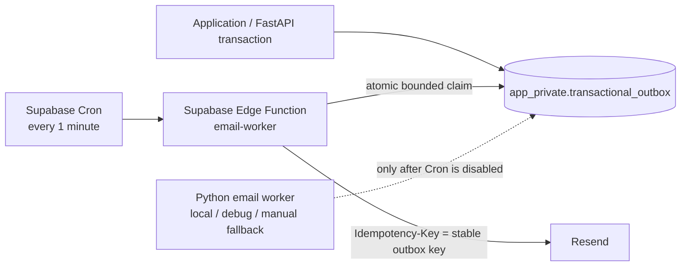

The mail transport contract is fixed as follows:

- `idempotency_key` is unique in the outbox. Claiming is one atomic statement using `FOR UPDATE SKIP LOCKED`; the default batch is 20 and callers cannot exceed 100.
- Each invocation has a unique lease owner. Claim writes a five-minute lease; complete/fail updates require the same owner. Two normally overlapping Edge invocations therefore receive disjoint rows and cannot both send the same claimed row.
- The Edge Function delivers at most five claimed rows concurrently. A failed row is retried up to five total attempts with 1/2/4/8-minute delays; an expired lease becomes claimable for recovery.
- Resend receives the stable outbox idempotency key. This protects the sent-but-not-finalized/lost-acknowledgement case within Resend's documented 24-hour retention window.
- This is not an absolute exactly-once claim. PostgreSQL prevents concurrent ownership, and Resend suppresses retries inside its retention window; an outage or unresolved acknowledgement older than that window may still permit a duplicate and must remain observable/recoverable.
- Application commits never depend on provider availability. Terminal failure remains recorded with sanitized state for operator action; it cannot roll back the originating verification, invitation or Match transaction.

### 26.5 Data model changes (planning contract; no migration in this task)

| Model/table | Required shape and constraints |
|---|---|
| `users` amendment | Add nullable `email_verified_at timestamptz`; USER verification derives from a non-null timestamp for the current email. Migration sets every legacy USER to NULL unless an authoritative verification timestamp source is explicitly imported. Do not derive a timestamp from `email_verified`, creation time, last login, profile update or activity. The legacy boolean is only an initialization/status flag: USER registration writes false and Admin CLI bootstrap writes true. ADMIN authentication/RBAC must not depend on `email_verified_at`; preserve bootstrap access without manufacturing a timestamp. USER email change and timestamp clear are atomic. Keep role/is_active/deleted_at. |
| `student_profiles` amendment | No new relationship lifecycle column is required. `student_type` remains editable only while its USER has zero ACTIVE Matches. Profile update and invitation Accept enforce the invariant transactionally through the ACTIVE Match query/participant locks; a frontend editable flag is derived, never stored as authority. |
| `email_verification_tokens` | `id`, `user_id`, token digest only, `email_snapshot`, `created_at`, `expires_at` (15 minutes), `consumed_at`, `superseded_at`; one-use and never logged. New issue supersedes earlier active tokens. |
| `app_private.transactional_outbox` (**implemented by `0009`**) | Base UUID/timestamp/soft-delete fields plus `event_type`, `aggregate_id`, nullable `recipient_user_id`, `recipient_email`, unique `idempotency_key`, object-only JSONB `payload`, non-negative `attempts`, `next_attempt_at`, paired `lease_owner`/`lease_expires_at`, mutually exclusive `sent_at`/`failed_at`, `provider_message_id` and sanitized `last_error_code`. Ready/lease indexes support bounded claims. Business transactions insert; delivery is asynchronous. Migration `0010` exposes only `SECURITY INVOKER` claim/complete/fail functions to `vgu_buddy_runtime`. |
| `activities` / `profile_activities` | Shared predefined catalog plus per-profile selections; replaces Interest IDs inside `preferences.preferred_activity_ids` as the canonical activity signal. |
| `profile_custom_preferences` | `profile_id`, kind (`INTEREST`,`LANGUAGE`,`ACTIVITY`), display label, `normalized_key`, optional language proficiency, timestamps; unique `(profile_id, kind, normalized_key)`. Never creates shared catalog records. |
| `matching_invitations` | Required fields from V2; store a canonical outer-trimmed plain-text `message`, `status`, 7-day `expires_at`, response/cancel/hide timestamps. Valid message has at most 500 maximal non-whitespace runs and at most 10,000 Unicode code points; backend enforces both and the canonical stored column has a defensive 10,000-character/code-point-equivalent PostgreSQL check. Store canonical pair keys or equivalent for reciprocal-PENDING protection. Partial unique index/constraint prevents more than one PENDING invitation per unordered pair. |
| `matches` | `id`, two participant user/profile IDs, canonical `pair_low_user_id`/`pair_high_user_id`, `status=ACTIVE`, accepted invitation ID, score/breakdown snapshot, `activated_at`, semester ID. Service transaction verifies opposite student types at activation. Partial unique index allows at most one ACTIVE row per unordered pair; no uniqueness per participant. The existence of any ACTIVE row for a USER prevents future changes to that USER's `student_type`; no existing Match is rewritten. |
| `buddy_conversations` | Exactly one row per ACTIVE Match (`match_id` unique), timestamps/semester ID. |
| `buddy_messages` | `id`, `match_id` or conversation ID, sender USER, plain body, created/read/expires timestamps. Initial expiry = created+90d; first recipient read atomically sets `read_at` and `expires_at=min(read+30d, created+90d)`. |
| `semesters` | Persisted cohort/reset boundary: ID, status, started/closed timestamps, reset operation ID, and a monotonic `student_accounts_created`/`first_student_created_at` marker updated in the same locked registration transaction and never decremented. Every new USER is also stamped with current semester/cohort ID. Restore blocking therefore survives later deletion of that new USER. |
| `semester_backups` | ID, source semester/boundary, state (`CREATING`,`READY`,`RESTORE_BLOCKED_NEW_DATA`,`EXPIRED`,`FAILED`), private DB/avatar manifest locations/checksums/counts, created/verified/expires/restored metadata. |
| `semester_operations` | Operation ID, type/reset/restore state, Admin actor, request/start/complete timestamps, backup ID/status/expiry, counts/result/restore actor/time. Must remain after USER deletion. |

Concurrency rules: outgoing PENDING maximum 30 is enforced in a serializable/locked transaction (for example lock the sender account/advisory key, expire stale rows, count PENDING, insert). Reciprocal PENDING and ACTIVE unordered-pair uniqueness require database constraints in addition to service checks. Accept and a type-changing profile update use one documented stable participant-lock order: Accept revalidates opposite types before inserting ACTIVE, while profile update checks for any ACTIVE Match before persisting the new type. Neither race may commit a same-type ACTIVE relationship. Expired rows are treated as EXPIRED in every read/mutation even before the scheduled transition job runs.

### 26.6 API contract changes

All unsafe HTTP endpoints require authenticated session CSRF; all Buddy endpoints additionally require current USER + VERIFIED. Error envelopes remain `{detail: ...}` with stable machine-readable reason codes added where the UI must distinguish locks/conflicts.

| Group | Planned endpoints |
|---|---|
| Verification/account | `POST /api/auth/email-verification/request`, `POST /api/auth/email-verification/confirm`, `PUT /api/auth/email`; `/api/auth/me` returns derived verification state/timestamp without token data |
| Profile/update | Existing own-profile update keeps its current contract, but a request whose normalized `student_type` differs from the persisted value returns `409 Conflict` with reason `STUDENT_TYPE_LOCKED_ACTIVE_MATCH` when the USER has at least one ACTIVE Match. Unchanged type resubmission is allowed. The own-profile/readiness projection exposes a derived editable/locked state plus this reason so the UI can explain the restriction; frontend state never bypasses the backend check. Preference endpoints extend predefined/custom interests, languages/proficiency and activities; catalog reads remain authenticated. |
| Recommendations | `GET /api/matching/recommendations` returns paginated safe profiles, server score/explanation and availability; no email |
| Invitations | `POST /api/matching/invitations` trims leading/trailing whitespace, then validates `message`: words are maximal non-whitespace runs, maximum 500; the trimmed value is maximum 10,000 Unicode code points. Either overflow is rejected with a distinct stable validation reason. The request/OpenAPI schema documents both algorithms and boundary fixtures; JavaScript must count code points rather than UTF-16 code units. `GET .../incoming`; `GET .../sent`; `POST .../{id}/accept`; `.../decline`; `.../cancel`; `DELETE .../{id}` means hide accepted sender row only. All message values remain plain text. |
| Current Buddies | `GET /api/matching/buddies`; no user unmatch/end/delete relationship endpoint |
| Chat | `GET /api/chat/conversations/{match_id}/messages`, `POST` fallback send if retained, `POST .../read`; `WS /api/ws/chat/{match_id}` with authenticated origin-checked handshake |
| Admin monitoring | `GET /api/admin/matching/stats`, participant/buddy-count/zero-Buddy paginated reads with safe projection; no run/publish/override/respond endpoints |
| Semester management | preflight/counts, create reset request, confirm/re-auth and execute, list/get backups, restore, backup expiry/cleanup operations; destructive actions use CSRF, ADMIN, recent re-auth, operation idempotency and audit |

Deep links are allowlisted internal routes only. Anonymous `Open Invitation` and `Start Chatting` links go to login with a validated relative `returnTo`, never an arbitrary origin. The server reauthorizes the target after login.

### 26.7 Frontend changes

- Reuse User Dashboard → Buddy Matching at `/user/matching`; make it a real page with Recommended Buddies, Matching Invitations, Sent Invitations and Current Buddies.
- Replace the old readiness-only route gate with a page-level verified lock plus backend enforcement. An UNVERIFIED user sees status, Verify/Resend actions and cannot preload protected Buddy data.
- Add Verified/Unverified state to profile/settings and an email-change flow that clearly relocks preserved Buddy/chat data until re-verification.
- In own-profile edit, disable/lock `student_type` when backend profile/readiness state reports at least one ACTIVE Match and explain that the existing Buddy relationship requires opposite types. Still surface `STUDENT_TYPE_LOCKED_ACTIVE_MATCH` from a stale tab/race and refetch; the control is UX only.
- Safe cards show avatar, display name, type, major, interests, languages, activities, score, explanation and availability; never email.
- Invitation composer trims outer whitespace for submission, counts maximal non-whitespace runs, displays `x / 500 words`, and separately validates at most 10,000 Unicode code points. It uses the same shared contract fixtures as the backend and shows which limit failed; server validation remains authoritative.
- Sent UI displays only PENDING and non-hidden ACCEPTED. Pending has Cancel, never Delete. Accepted has Start Chatting and Delete/hide.
- Current Buddies supports multiple cards and Start Chatting. `/user/buddy` should redirect to or focus this section to preserve existing links without creating a second data model.
- Add accessible text-only chat with reconnect/history/read states. Never use `dangerouslySetInnerHTML` for invitation/message content.
- Replace Admin matching controls with monitoring tables/cards. Add guarded Semester Management UI with counts, detailed keep/delete warning, 30-day backup notice, explicit second confirmation phrase and re-auth.

### 26.8 Security architecture and mandatory controls

- Keep populated `.env*` ignored/untracked and every database, Redis, email, storage and backup credential server-only; no secret may use `VITE_*`. Run current-tree and full-history secret scanning before release, inspect the diff before every commit and rotate any credential ever exposed elsewhere.
- Hash verification tokens with a purpose-separated keyed digest or strong digest over high-entropy random tokens; compare safely; 15-minute expiry, one-time use, supersession and no token/query logging. Rate-limit request/resend by account and transport IP without storing raw email in keys.
- Treat legacy verification as evidence-based: absent an authoritative verification timestamp, set every legacy USER `email_verified_at` to NULL. Never synthesize it from the legacy boolean, account creation, last login, profile updates or activity. ADMIN bootstrap/login/RBAC remains a separate architecture path and must stay usable without a fake verification timestamp.
- Apply per-user/IP rate limits to recommendation refresh, invitation send and message send. Make invitation limit/reciprocal/accept rules concurrency-safe at database level.
- Enforce the `student_type` lock and opposite-type activation invariant in backend transactions with stable participant locking/revalidation. A disabled frontend field is not authorization; no repair job may mutate existing Matches and no Unmatch endpoint is added.
- Authorization must be resource-based: invitation owner/recipient, ACTIVE Match participant, or ADMIN monitoring role. Email is not an authorization identifier.
- WebSocket handshake validates allowed Origin, cookie session/current DB user, VERIFIED status and ACTIVE Match participation; authorize again on reconnect and close access when verification/account/match state changes. Do not accept bearer credentials in URL query strings.
- Render invitation/message body as text and never use `dangerouslySetInnerHTML`. For invitation messages, trim leading/trailing whitespace; count words as maximal non-whitespace runs; reject more than 500 words or more than 10,000 Unicode code points server-side. Frontend counters are advisory and must share boundary fixtures with the backend.
- Transactional outbox payloads/logs exclude secrets and unnecessary profile data. Delivery errors expose no provider response body to clients.
- Reset requires ADMIN + CSRF + recent re-auth/step-up, explicit phrase, immutable operation ID, counts, exclusive maintenance/write barrier, verified DB and avatar backups, abort-on-backup-failure and post-reset verification. Backup bucket is private with least privilege and access audit.
- Expired messages are filtered in every backend read even if cleanup lags. Cleanup and backup-expiry jobs are idempotent, observable and protected against deleting records outside exact retention predicates.
- Production uses Secure HttpOnly SameSite cookies behind audited trusted proxies, exact CORS/CSRF origins, HTTPS/WSS, TLS Redis, least-privilege runtime DB credentials and separate migration credentials.

### 26.9 Updated V2 task registry

Every task below is **Planned** unless its task contract is explicitly marked **Done**. Existing implemented Auth/Profile/Storage/Audit components are dependencies to reuse, not claims that any other V2 behavior exists.

| Task | Purpose | Strict dependencies | Acceptance summary | Required tests/gates |
|---|---|---|---|---|
| EMAIL-001 (**Done 2026-09-24**) | Verification persistence + legacy migration | AUTH-008/009 | Legacy USER→NULL absent evidence; ADMIN access preserved; digest-only one-use 15m token persistence | Migration/model/Admin-regression/security tests |
| EMAIL-001A (**Done 2026-09-24**) | Cryptographic verification token service | EMAIL-001 | High-entropy issue/digest/consume/supersede contract | Unit/property/replay tests |
| MAIL-001 (**Done 2026-09-24**) | Provider + transactional outbox | BE-004, EMAIL-001 | Commit independent of delivery; retry/idempotency | Fake-provider/lease/failure tests |
| EMAIL-002 (**Done 2026-09-24**) | Request/resend verification | EMAIL-001A, MAIL-001, AUTH-020 | Current address only; rate-limited; old token superseded | API/rate/concurrency tests |
| EMAIL-003 (**Done 2026-09-24**) | Confirm verification | EMAIL-001A | One valid token atomically stamps current email | Expiry/replay/race tests |
| EMAIL-004 (**Done 2026-09-24**) | Change email + reverify | EMAIL-001, EMAIL-002 | Unique new email; clears verification; data retained | Auth/CSRF/session/data tests |
| EMAIL-005 (**Done 2026-09-24**) | Verification/change-email UX | EMAIL-002..004, AUTH-021 | Accurate Verified/Unverified UX and safe links | Component/integration/a11y tests |
| AUTH-V2-001 (**Done 2026-09-24**) | Shared VERIFIED capability guard | EMAIL-001, BE-016 | Backend locks all Buddy/chat actions and candidacy | Dependency/matrix tests |
| PREF-001 (**Done 2026-09-27**) | Custom/activity persistence | BE-009/010 | Profile-owned normalized custom values; Activity catalog | Migration/constraint tests |
| PREF-002 | Normalized preference identity service | PREF-001 | NFKC/casefold rules and deterministic keys | Unicode/property tests |
| PREF-003 | Preference services/APIs | PREF-001/002, BE-012/015 | Owner CRUD, proficiency, bounded inputs | API/version/concurrency tests |
| PREF-004 | Preference tag UI | PREF-003, FE-026/027/029 | Add/edit/display predefined + custom values | Component/a11y/integration tests |
| REC-001 | V2 eligibility + safe DTO | AUTH-V2-001, PREF-003 | Opposite type, complete/opted-in/verified; no reservation | Policy/privacy tests |
| REC-002 | Compatibility scorer | REC-001 | Exact 40/35/15/5/5 deterministic score | Unit/property/fixtures |
| REC-003 | Ranked recommendation API | REC-002 | Paginated deterministic safe results, no side effect | API/auth/query tests |
| REC-004 | Recommended Buddies UI | REC-003, EMAIL-005 | Cards/explanation/availability and locked state | UI/a11y/contract tests |
| BUDDY-001 | ACTIVE Match persistence | REC-002 | Opposite-type activation; multiple Buddies; unique ACTIVE unordered pair | Migration/type/race tests |
| PROFILE-V2-001 | Lock `student_type` after ACTIVE Match | BUDDY-001, BE-012 | Backend rejects type change; Accept/update race preserves opposite types | API/policy/concurrency tests |
| PROFILE-V2-002 | Locked `student_type` profile UX | PROFILE-V2-001, FE-029 | Disabled field, explanation and stale-conflict handling | Component/a11y/integration tests |
| INV-001 | Invitation persistence/state machine | REC-001 | Required statuses/fields, reciprocal PENDING constraint | Migration/model tests |
| INV-002 | Expiry semantics | INV-001 | 7-day transition and immediate re-invite | Boundary/job/read tests |
| INV-003 | Send invitation API | INV-002, REC-003, MAIL-001 | Trimmed plain text; ≤500 non-whitespace runs and ≤10,000 code points; max 30 outgoing PENDING | Schema/boundary/CSRF/rate/race tests |
| INV-004 | Incoming/sent read APIs | INV-002, REC-002 | Correct visibility, safe profiles/scores/expiry | Privacy/filter tests |
| INV-005 | Atomic Accept | INV-003, BUDDY-001, PROFILE-V2-001, CHAT-001 | Recipient-only revalidation creates opposite-type ACTIVE Match/conversation once | Transaction/type-update-race/idempotency tests |
| INV-006 | Decline/Cancel/Hide | INV-003, INV-005 | Owner transitions; accepted hide is non-destructive | State/auth/data-retention tests |
| INV-007 | Invitation UI | INV-004..006, REC-004 | Incoming/Sent/composer states match contract | UI/a11y/integration tests |
| INV-008 | Invitation email notification | INV-003, MAIL-001 | Post-commit retryable Open Invitation email | Template/outbox/delivery tests |
| INV-009 | Accepted email + safe deep links | INV-005, MAIL-001 | Start Chatting email and allowlisted `returnTo` | Template/outbox/link tests |
| BUDDY-002 | Current Buddies API | BUDDY-001, INV-005 | All ACTIVE buddies with safe snapshots | Auth/privacy/query tests |
| BUDDY-003 | Current Buddies UI | BUDDY-002, INV-007 | Multiple cards; Start Chatting; no Unmatch | UI/routing/a11y tests |
| CHAT-001 | Conversation/message persistence | BUDDY-001 | One conversation/Match; text messages and retention fields | Migration/model tests |
| CHAT-002 | History/read/retention service | CHAT-001, AUTH-V2-001 | Participant-only reads; first-read retention formula | API/time/auth tests |
| CHAT-003 | WebSocket + Redis realtime | CHAT-002, OPS-001 | Authenticated WSS, Redis Pub/Sub, reconnect recovery | Integration/multi-worker/security tests |
| CHAT-004 | Text chat frontend | CHAT-003, BUDDY-003 | History/send/receive/read/reconnect; safe text rendering | UI/e2e/a11y tests |
| CHAT-005 | Message cleanup job | CHAT-002, OPS-001 | Hard-delete expired; API never returns expired | Clock/job/idempotency tests |
| ADMIN-V2-001 | Monitoring APIs | INV-006, BUDDY-002 | Counts by invitation state, Buddy counts, zero-Buddy users | RBAC/aggregate/privacy tests |
| ADMIN-V2-002 | Monitoring UI | ADMIN-V2-001, ADMIN-003/004 | No run/publish/override controls | UI/RBAC/a11y tests |
| SEM-001 | Semester/boundary/backup metadata | BUDDY-001, CHAT-001 | Persisted cohort boundary and operation states | Migration/invariant tests |
| SEM-002 | Database backup export | SEM-001, OPS-003 | Private restorable scoped DB backup + manifest | Disposable DB restore test |
| SEM-003 | Avatar binary backup | SEM-001, EVS-003 | Actual private objects, keys/owners/metadata | Storage copy/checksum/restore tests |
| SEM-004 | Backup verify/retention | SEM-002/003 | READY only after both verified; expire after 30 days | Failure/clock/cleanup tests |
| SEM-005 | Safe reset execution | SEM-004, AUTH-018, EVT-008 | Re-auth, write barrier, verified backup, USER data deletion only | Destructive staging tests |
| SEM-006 | Restore + new-cohort block | SEM-005 | Exact restore; backend blocks after any new USER | Restore/idempotency/block tests |
| SEM-007 | Semester Management UI | SEM-005/006, ADMIN-005 | Counts/warnings/phrase/re-auth/status/restore UX | UI/a11y/e2e tests |
| OPS-001 | Local Redis/worker/config foundation | MAIL-001 | Local Redis, worker/scheduler, health/readiness, no heavyweight queue | Startup/failure/compose tests |
| OPS-002 | Early staging infrastructure validation + free-tier email-worker acceptance | EMAIL-003, OPS-001 | Existing staging topology plus Supabase Cron -> Edge Function -> Resend with atomic claim, bounded batch, retry, idempotency, overlap safety and Free-plan validation | Restore rehearsal + deployed Edge-worker acceptance record |
| OPS-003 | Observability/backup/rollback runbooks | OPS-002 | Redacted logs, alerts, rollback and credential rotation | Game-day/tabletop gate |
| ACCEPT-001 | Full V2 staging acceptance | All functional tasks, SEM-007, OPS-003 | Real two-user happy path + reset/restore/block scenarios | Signed acceptance record |
| PROD-001 | Production release and verification | ACCEPT-001 | All release gates met; rollback point captured | Production smoke/monitoring gate |

### 26.10 Full task contracts — Email, preferences and recommendations

#### EMAIL-001 — Verification persistence and token model

- **Status:** **Done 2026-09-24.** The implementation adds persistence/schema support only; token generation, validation and consumption remain owned by `EMAIL-001A`.
- **Purpose:** Make the current verified email a timestamp-backed server fact.
- **Scope / likely files:** `models/user.py`, new verification model, model exports, schemas and one Alembic revision. Audit result: the legacy boolean is written as false by USER registration and true by trusted CLI ADMIN bootstrap; admin list/detail only reads it, and no verification event timestamp is recorded. Therefore migrate every legacy USER to `email_verified_at=NULL` unless operators supply a separate authoritative timestamp source. Never convert `email_verified=true` into a fabricated timestamp. Handle ADMIN separately: keep current bootstrap/login/RBAC usable and independent of student verification; an ADMIN with no trustworthy timestamp may remain NULL.
- **Dependencies / ownership:** AUTH-008/009; Backend + Database.
- **Security:** verification status is evidence-based. Account creation, last login, profile update, activity history and the unaudited legacy boolean are forbidden timestamp sources. Use high-entropy tokens, digest only, no token repr/log/audit, 15-minute expiry, one use, email snapshot and supersession.
- **Acceptance / DoD:** `email_verified_at` is nullable and authoritative for USER Buddy access; every legacy USER without an authoritative imported timestamp is UNVERIFIED after migration; ADMIN can still authenticate and use RBAC without a synthetic timestamp; constraints/indexes support one current usable token; downgrade/recovery and any evidence-import mechanism are documented; generated schema and docs agree.
- **Tests/gates:** disposable PostgreSQL upgrade fixtures cover legacy USER false, legacy USER true and ADMIN true/false; both USER booleans become NULL absent evidence; no created/login/profile/activity timestamp is copied; an explicit authoritative timestamp fixture is preserved/imported; ADMIN login/RBAC regression passes; downgrade, expiry and secret-redaction tests pass.
- **Non-goals:** sending email, UI, matching unlock.

#### EMAIL-001A — Cryptographic verification token service

- **Status:** **Done 2026-09-24.** The implementation is limited to cryptographic token value objects and transaction-safe persistence helpers; HTTP endpoints and email delivery remain in later tasks.
- **Purpose:** Isolate secure issue, digest, validate, consume and supersede behavior from transport endpoints.
- **Scope / likely files:** dedicated token service/value objects and model repository helpers; injectable UTC clock/random source for tests.
- **Dependencies / ownership:** EMAIL-001; Backend.
- **Security:** at least 32 random bytes from a CSPRNG, URL-safe encoding, purpose-separated digest, constant-safe comparison where applicable, no plaintext persistence/repr/log, 15-minute exact TTL.
- **Acceptance / DoD:** issue returns plaintext once and persists only digest/email snapshot; consume is atomic one-use; newest issue supersedes prior tokens; expired/changed-email/deleted-user tokens fail generically.
- **Tests/gates:** entropy/format, digest-not-plaintext, exact expiry, replay, supersession, concurrent consume and log-redaction tests.
- **Non-goals:** HTTP endpoints or email delivery.

#### MAIL-001 — Transactional email provider and outbox foundation

- **Status:** **Done 2026-09-24; hosted transport repository work added 2026-09-25 under OPS-002.** MAIL-001 adds the private outbox, provider-neutral contract with a Resend adapter, explicit template allowlist, bounded leased Python worker and server-only configuration. OPS-002 reuses those contracts through migration `0010`, the Edge Function and Cron SQL; it does not rewrite MAIL-001. Only `email_verification.requested` is implemented today. Invitation and accepted templates/events remain owned by INV-008/009.
- **Purpose:** Decouple committed business state from fallible delivery.
- **Scope / source:** `models/transactional_outbox.py`, migrations `0009`/`0010`, `services/email_outbox.py`, `services/email_provider.py`, worker command, `supabase/functions/email-worker`, `supabase/cron/email-worker.sql`, server-only config and `docs/operations/supabase-email-worker.md`.
- **Dependencies / ownership:** BE-004, EMAIL-001; Backend + Database + Infrastructure.
- **Security:** provider key server-only; recipient/body/provider errors redacted; unique event idempotency keys; no arbitrary template selection; private schema and function execute rights are withheld from PUBLIC and the Supabase `anon`, `authenticated` and `service_role` Data API roles.
- **Acceptance / DoD:** transaction inserts one outbox row; default batch 20/max 100, five-minute owner lease, max five attempts, 1/2/4/8-minute retry and terminal observability are preserved; provider failure cannot roll back originating state; no heavyweight broker or always-on hosted email process is added.
- **Tests/gates:** fake-provider success/failure, unique-key duplicate prevention, overlapping `SKIP LOCKED` claims, owner-only finalization, lease recovery, bounded batch, retry/terminal states, config fail-closed and log-redaction tests.
- **Non-goals:** marketing/bulk email or pricing commitment.

#### EMAIL-002 — Request and resend verification

- **Status:** **Done 2026-09-24.** The authenticated USER endpoint now stages the newest digest-only token and a durable current-address outbox event atomically; AES-GCM sealed delivery payloads keep the plaintext token out of persistence while preserving worker retries.
- **Purpose:** Issue a safe 15-minute link to the current address.
- **Scope / likely files:** auth router/schema/service, rate-limit policy, verification email template/outbox event, environment base URL.
- **Dependencies / ownership:** EMAIL-001A, MAIL-001, AUTH-020; Backend.
- **Security:** authenticated current USER, CSRF, per-user/IP rate limits, generic response, supersede old tokens, allowlisted HTTPS base URL.
- **Acceptance / DoD:** first request and resend create at most one usable latest token and post-commit email event; already-verified behavior is explicit/idempotent; raw token never persists or logs.
- **Tests/gates:** API, CSRF, rate, expiry, resend concurrency, outbox and sanitized-log tests.
- **Non-goals:** verifying the token or changing email.

#### EMAIL-003 — Confirm verification token

- **Status:** **Done 2026-09-24.** The authenticated USER endpoint atomically consumes a valid current-address token and stamps `email_verified_at`; failures stay generic and the response exposes only a fixed internal redirect target.
- **Purpose:** Atomically verify only the token's current user/email snapshot.
- **Scope / likely files:** auth endpoint/service/schema and frontend-safe redirect result contract.
- **Dependencies / ownership:** EMAIL-001A; Backend + Database.
- **Security:** constant-safe digest lookup/compare, one transaction, no open redirect, generic invalid/expired response.
- **Acceptance / DoD:** one valid unexpired unused token sets `email_verified_at`, consumes/supersedes tokens and succeeds once; changed email, replay and race fail safely.
- **Tests/gates:** exact 15-minute boundary, replay, simultaneous confirmations, changed-email and deleted/inactive account tests.
- **Non-goals:** login or automatic invitation action.

#### EMAIL-004 — Authenticated email change and re-verification

- **Status:** **Done 2026-09-24.** The current-password and CSRF-protected USER endpoint atomically replaces the unique canonical address, clears timestamp verification, supersedes the prior token, and enqueues verification to the replacement address while retaining sessions and User-owned data.
- **Purpose:** Let a USER replace the login email without losing Buddy data.
- **Scope / likely files:** auth schema/router/service, session projection and docs; update canonical email, clear timestamp, revoke tokens and enqueue verification.
- **Dependencies / ownership:** EMAIL-001/002, existing sessions; Backend + Database.
- **Security:** CSRF plus current-password or recent step-up verification, uniqueness protection, generic conflict, session policy explicitly tested.
- **Acceptance / DoD:** verified or unverified USER can change to a valid unique address; verification clears atomically; invitations/Matches/chat remain; protected interactions lock immediately; notifications target only the verified current address.
- **Tests/gates:** auth/CSRF, uniqueness/race, session reload, data-retention and re-unlock integration tests.
- **Non-goals:** merging accounts or forwarding old-address mail.

#### EMAIL-005 — Verified/Unverified and email-change UX

- **Status:** **Done 2026-09-24.** The frontend now preserves the timestamp-backed session projection, exposes verified/unverified state on profile/settings, supports resend and current-password email change, and confirms opaque URL tokens without persistence before refreshing `/auth/me` and using the fixed `/user` return path.
- **Purpose:** Expose the backend state and safe recovery actions.
- **Scope / likely files:** session parser, profile/settings pages, auth client, locale strings, confirmation route/page and tests.
- **Dependencies / ownership:** EMAIL-002..004, AUTH-021; Frontend.
- **Security:** no token persistence/analytics; safe internal return path; do not infer verification from a sent email.
- **Acceptance / DoD:** status survives refresh/login; Verify/Resend handles throttle/expiry; email change immediately shows locked state; successful confirm refreshes session state.
- **Tests/gates:** component/integration, EN/DE, keyboard/screen-reader, reload and safe-link tests.
- **Non-goals:** Buddy feature implementation.

#### AUTH-V2-001 — Shared VERIFIED Buddy capability guard

- **Status:** **Done 2026-09-24.** The implementation adds one current-database USER/profile capability policy, reusable HTTP and WebSocket dependencies, the `EMAIL_VERIFICATION_REQUIRED` completion reason and its frontend parser/localization. Later Buddy/chat tasks remain responsible for attaching the guard to their own transports and resource queries.
- **Purpose:** Enforce the UNVERIFIED lock once for all Buddy/chat transports.
- **Scope / likely files:** backend dependencies/policies, completion reason schema/service and frontend reason parser.
- **Dependencies / ownership:** EMAIL-001, BE-016; Backend contract + Frontend integration.
- **Security:** current database timestamp, role/account state and profile ownership; never trust JWT/client verification fields alone.
- **Acceptance / DoD:** UNVERIFIED users cannot be recommended, receive new invitations, list/interact with invitations/Buddies, or read/send chat; preserved records unlock after reverify if still valid.
- **Tests/gates:** endpoint permission matrix plus WebSocket dependency tests; no protected query executes before guard.
- **Non-goals:** deleting or expiring preserved data on email change.

#### PREF-001 — Activity and custom-preference persistence

- **Status:** **Done 2026-09-27.** Revision `0011_preference_persistence` adds the independent Activity catalog, profile/activity relation and profile-owned custom preference persistence with least-privilege backend access.
- **Purpose:** Represent all confirmed matching signals without polluting shared catalogs.
- **Scope / likely files:** Activity/ProfileActivity/ProfileCustomPreference models, exports, seed strategy and migration from current preferred-activity IDs.
- **Dependencies / ownership:** BE-009/010; Database + Backend.
- **Security:** bounded lengths/counts, kind/proficiency checks, backend-only schema/grants, cascade with profile.
- **Acceptance / DoD:** predefined activities are independent from Interests; custom values are profile-owned and unique by normalized key/kind; catalogs survive semester reset, custom rows do not.
- **Tests/gates:** migration, constraint, cascade, seed idempotency and permission tests.
- **Non-goals:** globalizing custom values or synonym/AI matching.

**Implementation:** `Activity` is a separate localized shared catalog and `ProfileActivity` uses a
unique profile/catalog pair with profile cascade and catalog restrict semantics.
`ProfileCustomPreference` stores only profile-owned `INTEREST`, `LANGUAGE` or `ACTIVITY` values,
bounded display/normalized fields, scoped language proficiency and unique
`(profile_id, kind, normalized_key)` identity. The migration snapshots every legacy Interest row
that could have supplied `preferences.preferred_activity_ids` into the independent Activity catalog
while preserving stable IDs/labels and materializes profile selections; malformed or orphaned legacy
values fail the migration instead of being discarded. Catalog seed/import is idempotent, and the new
tables revoke browser/Data API access before granting only the required runtime operations.

**Verification (2026-09-27):** Model/offline migration tests and the guarded disposable PostgreSQL
upgrade/constraint/cascade/permission/downgrade/re-upgrade acceptance pass. Full backend: 805 passed /
20 configured live skips; Ruff, strict mypy (154 files), dependency consistency/audit, Alembic
history/head/check, package build and Compose validation pass. No dependency, API or frontend change
was added.

#### PREF-002 — Normalized preference identity service

- **Status:** **Done 2026-09-27.** The backend now owns one bounded, deterministic preference identity contract with a display-safe label and an NFKC/whitespace/casefold key; PREF-003/PREF-004 remain unimplemented.
- **Purpose:** Define the single deterministic identity rule shared by persistence, duplicate detection and scoring.
- **Scope / likely files:** pure normalization/value-object service implementing NFKC → trim → collapse whitespace → Unicode casefold, with display-label validation.
- **Dependencies / ownership:** PREF-001; Backend.
- **Security:** bound input before/after normalization; reject empty/control-character output; never use locale-dependent comparison.
- **Acceptance / DoD:** `Photography` equals `photography`; compatibility-equivalent Unicode/whitespace forms share a key; `Football` differs from `Soccer`; output is deterministic across supported runtime.
- **Tests/gates:** Unicode normalization vectors, whitespace/case/property/idempotency and pathological input tests.
- **Non-goals:** persistence, semantic translation, fuzzy matching or AI.

**Implementation:** `PreferenceIdentity` is an immutable value object that returns the cleaned
display label separately from the deterministic comparison key. Display labels preserve valid
Unicode and casing while trimming/collapsing whitespace; keys apply NFKC, trim/collapse whitespace
and Unicode casefold in that order. The service reuses the PREF-001 120/255-character storage
bounds, rejects oversized input before normalization and rejects empty, unsafe control/format and
post-normalization oversized values. It has no database, locale, timezone or external-service
dependency.

**Verification (2026-09-27):** Golden Unicode/casefold/NFKC/whitespace, immutability, idempotency,
pathological-input and PREF-001 identity-compatibility tests pass. Full backend: 836 passed / 20
configured live skips; Ruff, strict mypy (156 files), dependency consistency/audit, Alembic
history/head, package build and Compose validation pass. No migration, persistence, API or frontend
change was added.

#### PREF-003 — Preference services and owner APIs

- **Purpose:** Persist/read predefined and custom interests, languages and activities consistently.
- **Scope / likely files:** profile schemas/services/routes and readiness calculation using PREF-002 keys.
- **Dependencies / ownership:** PREF-001/002, BE-012/015; Backend.
- **Security:** owner-only mutations, CSRF, optimistic version, bounded arrays/labels and no unsafe reflection.
- **Acceptance / DoD:** custom languages retain proficiency; combined selections round-trip deterministically; completion counts valid predefined + custom selections; duplicate normalized values are rejected/merged by contract.
- **Tests/gates:** API/version/race/authorization/readiness and invalid-input tests.
- **Non-goals:** Admin taxonomy UI or global catalog writes.

#### PREF-004 — Custom preference tag/input/display UI

- **Purpose:** Let users manage and view the three combined signal sets.
- **Scope / likely files:** onboarding/profile form components, own-profile view, clients/types/locales.
- **Dependencies / ownership:** PREF-003, FE-026/027/029; Frontend.
- **Security:** render labels as text; client limits mirror but never replace server validation.
- **Acceptance / DoD:** accessible add/remove/edit for predefined/custom values; duplicate normalized labels prevented/explained; reload round-trip preserves labels and proficiency.
- **Tests/gates:** component, keyboard/a11y, normalization-contract and API integration tests.
- **Non-goals:** public catalog creation or AI suggestions.

#### REC-001 — V2 eligibility policy and safe matching profile

- **Purpose:** Centralize candidate eligibility and privacy projection.
- **Scope / likely files:** replace reservation stub, new matching policy/service/schema and avatar authorization extension.
- **Dependencies / ownership:** AUTH-V2-001, PREF-003; Backend.
- **Security:** active, non-deleted, complete, opted-in, VERIFIED, valid opposite types, no self; explicit allowlist DTO excludes email/auth/internal fields.
- **Acceptance / DoD:** policy is reused by recommendation, send and Accept; having one or many ACTIVE Matches never disqualifies a user; availability is included only in the approved normalized display form.
- **Tests/gates:** exhaustive eligibility matrix, privacy snapshot and multiple-Buddy regression tests.
- **Non-goals:** score/ranking, reservation or Admin override.

#### REC-002 — Deterministic V2 compatibility scoring

- **Purpose:** Compute the confirmed server-owned score and explanation.
- **Scope / likely files:** scoring service/value objects and fixtures using combined predefined/custom sets.
- **Dependencies / ownership:** REC-001; Backend.
- **Security:** consume safe normalized profile data, bound computation and explanation; no auth/contact data.
- **Acceptance / DoD:** exact weights Interests 40%, Activities 35%, Availability 15%, Languages 5%, Major 5%; Jaccard for first two, normalized overlap for availability, exact code/custom-key language match, normalized major equality; total always 0..100 and deterministic.
- **Tests/gates:** golden fixtures, symmetry/property tests, empty-set/Unicode/timezone/tie cases and exact-weight assertion.
- **Non-goals:** greedy assignment, semantic inference, ML or missing-weight renormalization.

#### REC-003 — Ranked recommendation API

- **Purpose:** Return current compatible candidates without changing state.
- **Scope / likely files:** matching router/service/query schemas, pagination and score explanations.
- **Dependencies / ownership:** REC-002, AUTH-V2-001; Backend.
- **Security:** verified guard, bounded pagination/rate limit, safe DTO only, no cache across users.
- **Acceptance / DoD:** score-descending deterministic order with stable tie-break; excludes ineligible/same-type/self; includes already-matched users unless the same pair is ACTIVE; does not create Match/Invitation/run rows.
- **Tests/gates:** API/RBAC/privacy/query-count/rate/determinism tests.
- **Non-goals:** Admin approval, allocation, swiping or invite mutation.

#### REC-004 — Recommended Buddies frontend section

- **Purpose:** Present ranked safe profiles in the existing Buddy Matching page.
- **Scope / likely files:** real `/user/matching` page, recommendation query/client/card/locales and route metadata; restore the existing accepted `UserDashboardPage` as the actual `/user/dashboard` destination instead of the current profile-edit redirect.
- **Dependencies / ownership:** REC-003, EMAIL-005; Frontend.
- **Security:** no email rendering/preload for locked users; explanation is structured text.
- **Acceptance / DoD:** responsive accessible loading/error/empty/cards; score/explanation/availability render from server; Send Invitation opens the V2 composer; refresh/logout clears private cache; completed-profile login/onboarding lands on the real dashboard and can open Buddy Matching.
- **Tests/gates:** component, a11y, route, schema rejection and mocked contract tests.
- **Non-goals:** locally calculating scores or creating a new navigation concept.

### 26.11 Full task contracts — Invitations and Current Buddies

#### BUDDY-001 — ACTIVE Match persistence and unordered-pair uniqueness

- **Purpose:** Persist accepted Buddy relationships while allowing multiple Buddies per user.
- **Scope / likely files:** new Match model/status/schema, exports and Alembic migration; canonical unordered user pair and invitation provenance.
- **Dependencies / ownership:** REC-002; Database + Backend.
- **Security:** FKs to current users/profiles, backend-only grants, immutable participants after activation, score snapshot excludes sensitive data; service activation requires one VIETNAMESE and one INTERNATIONAL profile.
- **Acceptance / DoD:** only ACTIVE is needed for MVP; no per-user reservation/unique constraint; database prevents a second ACTIVE row for the same unordered pair; both participant directions query efficiently; accepted types are revalidated at activation and no process rewrites existing Match participants/types.
- **Tests/gates:** migration upgrade/downgrade, pair-order uniqueness, opposite/same-type activation, concurrent insert and multi-Buddy tests.
- **Non-goals:** PROPOSED, ADMIN_APPROVED, user Unmatch/End Buddy or Admin activation.

#### PROFILE-V2-001 — Backend `student_type` lock after ACTIVE Match

- **Purpose:** Preserve the opposite-type invariant of every current Buddy relationship.
- **Scope / likely files:** existing own-profile update schema/service/router plus a shared ACTIVE-Match policy/query and stable conflict mapping; coordinate participant locks with INV-005 Accept.
- **Dependencies / ownership:** BUDDY-001, BE-012; Backend + Database.
- **Security:** backend is authoritative. A request that changes the normalized persisted type must lock/recheck the USER's ACTIVE Matches in the same transaction; use the same stable participant lock order as Accept. Never trust a disabled frontend field.
- **Acceptance / DoD:** with zero ACTIVE Matches, a valid type change still works; with one or many ACTIVE Matches, a changed type is rejected as `STUDENT_TYPE_LOCKED_ACTIVE_MATCH`; unchanged resubmission is allowed; existing Matches are unchanged; no Unmatch/End workaround is introduced. Reset deletes old USER accounts, so a new-cohort registration selects type from scratch.
- **Tests/gates:** backend API/service tests cover zero/one/many ACTIVE Matches, both current types, unchanged resubmission, stale clients and authorization; deterministic Accept-vs-profile-update concurrency tests prove neither interleaving can commit a same-type ACTIVE Match.
- **Non-goals:** automatically migrating Matches, editing the other participant, Unmatch/End Buddy, or carrying the old account into the next semester.

#### PROFILE-V2-002 — Locked `student_type` frontend UX

- **Purpose:** Explain the confirmed backend restriction before a user submits an impossible edit.
- **Scope / likely files:** own-profile query/schema/client, profile edit field, help/error copy and locales; consume backend lock state/reason and conflict code.
- **Dependencies / ownership:** PROFILE-V2-001, FE-029; Frontend.
- **Security:** disabled/readonly UI is advisory only; submit handling must display the backend conflict and refetch after stale-tab/race responses.
- **Acceptance / DoD:** a user with at least one ACTIVE Match sees the type field locked with an accessible explanation that current Buddies require opposite types; users without an ACTIVE Match can edit it; no Unmatch action or promise of automatic migration is shown.
- **Tests/gates:** component/a11y/integration tests cover unlocked, locked, one/many Buddy-equivalent state, stale unlocked tab receiving `STUDENT_TYPE_LOCKED_ACTIVE_MATCH`, reload and localized explanation.
- **Non-goals:** enforcing security in the browser or adding relationship-ending controls.

#### INV-001 — Invitation model, migration and state machine

- **Purpose:** Create the durable request/response business record.
- **Scope / likely files:** MatchingInvitation model/enums/schema, model exports and Alembic migration with required fields/statuses, including a defensive PostgreSQL length check on the canonical trimmed message.
- **Dependencies / ownership:** REC-001; Database + Backend.
- **Security:** sender/recipient must differ; plain bounded message; indexed owners/status/expiry; backend-only tables.
- **Acceptance / DoD:** PENDING/ACCEPTED/DECLINED/CANCELLED/EXPIRED transitions are explicit; unordered pair keys prevent reciprocal simultaneous PENDING; terminal timestamps agree with status; no hard delete in normal flow.
- **Tests/gates:** model/migration/constraint/state-transition tests including both pair directions.
- **Non-goals:** APIs, email delivery or Match creation.

#### INV-002 — Seven-day expiry semantics and transition job

- **Purpose:** Make invitation expiry authoritative even when the scheduler is delayed.
- **Scope / likely files:** invitation service/query predicate and worker/scheduler task.
- **Dependencies / ownership:** INV-001; Backend + Infrastructure.
- **Security:** trusted UTC database/server time; idempotent bounded updates; no client timer authority.
- **Acceptance / DoD:** PENDING becomes unusable at `created_at + 7 days`; reads/mutations treat it as EXPIRED before cleanup; job persists the status; sender may immediately invite again with no cooldown.
- **Tests/gates:** exact-boundary/frozen-clock, delayed-job, concurrent Accept-vs-expire and retry tests.
- **Non-goals:** deleting expired history or reminder email.

#### INV-003 — Send invitation API and concurrency limits

- **Purpose:** Let an eligible verified sender invite one eligible recommended recipient.
- **Scope / likely files:** invitation POST schema/router/service, one documented validation helper with cross-layer fixtures, and per-user/IP rate-limit policy; enqueue outbox event in same transaction. Canonicalize by trimming leading/trailing whitespace; count words as maximal consecutive non-whitespace runs in the trimmed value; count Unicode code points in that same value.
- **Dependencies / ownership:** INV-002, REC-003, MAIL-001; Backend + Database.
- **Security:** auth/VERIFIED/CSRF, revalidate both users, server rejects more than 500 words as `INVITATION_MESSAGE_TOO_MANY_WORDS` and more than 10,000 Unicode code points as `INVITATION_MESSAGE_TOO_MANY_CODE_POINTS`; store/render plain text only; locks/advisory key protect count and pair.
- **Acceptance / DoD:** the stored message is outer-trimmed; spaces, tabs and newlines only delimit runs, so `Hello my friend` is 3 words regardless of repeated spaces; exactly 500 words and exactly 10,000 code points are allowed, while 501/10,001 are rejected with the corresponding validation reason. Request 31 is rejected while only outgoing effective PENDING counts; no A→B and B→A PENDING race; ACTIVE same pair is rejected; successful DB commit survives email failure; response never includes recipient email.
- **Tests/gates:** shared backend/frontend vectors cover repeated spaces, tabs, newlines, non-ASCII text, combining sequences and supplementary-plane emoji; 500/501-word and 10,000/10,001-code-point boundaries; HTML-looking text remains inert plain text. Ownership, rate, 30/31, reciprocal and concurrent transaction tests also pass.
- **Non-goals:** auto-match, Admin approval or sender acceptance.

#### INV-004 — Incoming and Sent Invitations read APIs

- **Purpose:** Return exactly the user-visible invitation subsets and safe detail.
- **Scope / likely files:** invitation GET routes/query services/schemas with pagination and current score/explanation calculation.
- **Dependencies / ownership:** INV-002, REC-002, AUTH-V2-001; Backend.
- **Security:** owner/recipient filters in query, no IDOR, no email/internal fields, private no-store responses.
- **Acceptance / DoD:** incoming PENDING includes sender safe profile, availability, message, score/explanation, expiry/actions; sent returns only PENDING and unhidden ACCEPTED; declined/expired/cancelled never appear in normal sent UI.
- **Tests/gates:** visibility/status/expiry/privacy/pagination and foreign-ID tests.
- **Non-goals:** mutation or Admin listing.

#### INV-005 — Atomic recipient Accept

- **Purpose:** Make recipient consent the final action that creates the Buddy relationship.
- **Scope / likely files:** accept endpoint/service, row locking, eligibility revalidation, ACTIVE Match and conversation creation transaction, accepted outbox event.
- **Dependencies / ownership:** INV-003, BUDDY-001, PROFILE-V2-001, CHAT-001 when conversation creation is included; Backend + Database.
- **Security:** current VERIFIED recipient ownership, CSRF, PENDING/not-expired, account/profile eligibility, opposite types, active-pair uniqueness, stable participant locking shared with profile update and safe idempotency.
- **Acceptance / DoD:** one commit revalidates VIETNAMESE↔INTERNATIONAL, sets ACCEPTED/responded_at, creates exactly one ACTIVE Match and one conversation; concurrent/replayed accepts cannot duplicate; concurrent type edits cannot produce a same-type ACTIVE Match; sender need not accept; notification failure does not roll back.
- **Tests/gates:** transaction rollback, IDOR, expired/ineligible/email-change, same-type, duplicate-pair, concurrent Accept and Accept-vs-type-update tests.
- **Non-goals:** Admin or sender acceptance, global capacity or user unmatch.

#### INV-006 — Decline, Cancel and accepted-row hide

- **Purpose:** Complete the remaining authorized state transitions without destructive relationship deletion.
- **Scope / likely files:** recipient decline, sender cancel and accepted sender hide endpoints/services.
- **Dependencies / ownership:** INV-003/005; Backend + Database.
- **Security:** strict actor ownership, CSRF, verified guard, state-conditional atomic updates and idempotent safe retries.
- **Acceptance / DoD:** recipient alone PENDING→DECLINED; sender alone PENDING→CANCELLED; neither creates Match/chat; re-invite is immediately allowed; hide sets only `sender_hidden_at` on ACCEPTED and leaves invitation/Match/conversation/messages intact.
- **Tests/gates:** permission/state/race/idempotency and data-retention tests.
- **Non-goals:** deleting Pending, declining after Accept, deleting Buddy or chat.

#### INV-007 — Invitation composer, Incoming and Sent UI

- **Purpose:** Implement all invitation interactions inside Buddy Matching.
- **Scope / likely files:** matching page sections/components, query/mutation clients, locales and safe word/code-point counter using the same contract fixtures as INV-003; code-point counting must not use JavaScript UTF-16 `.length` semantics.
- **Dependencies / ownership:** INV-004..006, REC-004; Frontend.
- **Security:** render body as text; no `dangerouslySetInnerHTML`; locked state makes no protected calls; conflict responses refetch.
- **Acceptance / DoD:** composer trims outer whitespace for submission, shows `x / 500 words`, validates the separate 10,000-code-point ceiling, and gives the matching error when either limit is exceeded; repeated whitespace never increases the count beyond non-whitespace runs. Incoming Accept/Decline and sent Cancel work; PENDING has no Delete; ACCEPTED has Start Chatting/Delete-hide; hidden/declined/expired/cancelled disappear according to server result.
- **Tests/gates:** component/a11y and shared contract vectors cover repeated whitespace, 500/501 words, 10,000/10,001 code points, emoji and inert HTML-looking text; duplicate-submit, stale conflict, reload and endpoint contract tests pass; source check forbids `dangerouslySetInnerHTML` in invitation rendering.
- **Non-goals:** chat implementation or client-side state authority.

#### INV-008 — Invitation email notification

- **Purpose:** Notify the recipient after a committed invitation without coupling delivery to the transaction.
- **Scope / likely files:** invitation email template/event/outbox handler and Open Invitation route contract.
- **Dependencies / ownership:** INV-003, MAIL-001; Backend + Infrastructure.
- **Security:** send only to the recipient's current VERIFIED email at delivery policy point; escape all template data; no message/token/signed URL in logs.
- **Acceptance / DoD:** committed invitation enqueues exactly one idempotent event; CTA opens the correct invitation after authentication; provider failure retries and never removes/rolls back invitation; address change/unverified state is handled by the documented current-address resolver.
- **Tests/gates:** template escaping, provider failure/retry, deduplication, recipient-address change and real staging delivery tests.
- **Non-goals:** marketing mail, SMS or push notifications.

#### INV-009 — Accepted email and safe authenticated deep links

- **Purpose:** Notify the sender after Accept and route both email CTAs safely through login when needed.
- **Scope / likely files:** accepted email template/event/handler, frontend login `returnTo` allowlist and invitation/conversation target routing.
- **Dependencies / ownership:** INV-005, MAIL-001; Backend + Frontend + Infrastructure.
- **Security:** sender's current VERIFIED email only; opaque target IDs; allowlist same-origin relative routes; server reauthorizes destination; no open redirect.
- **Acceptance / DoD:** accepted commit enqueues one retryable event; CTA opens exact conversation when authenticated or login→conversation when anonymous; invitation CTA also uses the same validated mechanism; foreign/invalid targets fail closed.
- **Tests/gates:** template/outbox, duplicate event, authenticated/anonymous links, changed-email suppression and open-redirect/IDOR tests.
- **Non-goals:** automatic login, bearer token in URL or non-email notifications.

#### BUDDY-002 — Current Buddies API

- **Purpose:** Return all ACTIVE relationships for the verified participant.
- **Scope / likely files:** matching router/query/schema, safe profile/availability/shared-signal projections and conversation link/ID.
- **Dependencies / ownership:** BUDDY-001, INV-005, AUTH-V2-001; Backend.
- **Security:** participant filter at query, no email/auth/internal fields, private no-store response, signed avatar authorization extended to active participants.
- **Acceptance / DoD:** zero/one/many ACTIVE matches return deterministically; same Buddy cannot duplicate; email change locks but never deletes; each item points only to its correct conversation.
- **Tests/gates:** multi-Buddy, IDOR/privacy, locked/unlocked and query-count tests.
- **Non-goals:** Unmatch/End Buddy/Delete relationship.

#### BUDDY-003 — Current Buddies UI and route compatibility

- **Purpose:** Present multiple relationships and preserve the existing navigation surface.
- **Scope / likely files:** Current Buddies matching-page section; `/user/buddy` redirect/focus behavior; cards and Start Chatting action.
- **Dependencies / ownership:** BUDDY-002, INV-007; Frontend.
- **Security:** use only safe DTO; clear cache on logout; no hidden contact fields.
- **Acceptance / DoD:** accessible zero/one/many states; availability/shared explanation display; Start Chatting opens exact match conversation; no Unmatch/End/Delete Buddy control exists.
- **Tests/gates:** routing, component/a11y, multi-Buddy and verification-lock tests.
- **Non-goals:** separate Buddy data store or relationship mutation.

### 26.12 Full task contracts — Chat and Admin monitoring

#### CHAT-001 — Buddy conversation and message persistence

- **Purpose:** Establish one durable 1:1 text conversation for each ACTIVE Match.
- **Scope / likely files:** BuddyConversation/BuddyMessage models/enums, exports and Alembic migration; Match relationship and retention indexes.
- **Dependencies / ownership:** BUDDY-001; Database + Backend.
- **Security:** FK sender must be a participant enforced by service/trigger strategy; body bounds/plain text; backend-only grants; indexes support authorized time-ordered reads/cleanup.
- **Acceptance / DoD:** one conversation per Match; fields include sender/body/created/read/expires; initial `expires_at=created_at+90d`; cascades/reset behavior documented without normal user delete.
- **Tests/gates:** migration/model/constraint/index/cascade tests.
- **Non-goals:** images, files, audio, voice, video, reactions or group chat.

#### CHAT-002 — Authorized history, send fallback and first-read retention

- **Purpose:** Make PostgreSQL the complete recoverable chat authority.
- **Scope / likely files:** chat schemas/services/HTTP routes, cursor pagination, send/read transactions and retention helper.
- **Dependencies / ownership:** CHAT-001, AUTH-V2-001; Backend.
- **Security:** VERIFIED ACTIVE participant only; per-user send rate/size limits; safe text; expired predicate applied in every read; no foreign match enumeration.
- **Acceptance / DoD:** ordered pagination and idempotent send key; first recipient read sets `read_at` once and `expires_at=min(read+30d, created+90d)`; never-read expires at +90d; later reads never extend retention.
- **Tests/gates:** frozen-clock formula, sender-vs-recipient, pagination, IDOR, rate, duplicate send and expired-filter tests.
- **Non-goals:** realtime transport or frontend.

#### CHAT-003 — Authenticated FastAPI WebSocket and Redis Pub/Sub

- **Purpose:** Deliver realtime messages across backend workers while retaining REST recovery.
- **Scope / likely files:** async Redis config/client, WebSocket router/connection manager, origin/session authorization and publish/subscribe adapter; backend host/deployment docs.
- **Dependencies / ownership:** CHAT-002, OPS-001; Backend + Infrastructure.
- **Security:** cookie session handshake, exact Origin allowlist, current DB VERIFIED/ACTIVE participation, message/rate limits, reauthorization on reconnect/state change, no URL tokens.
- **Acceptance / DoD:** two participants receive committed messages through WSS; outsider/unverified rejected; multi-worker delivery uses Redis; Redis outage degrades safely without losing committed DB messages; reconnect catches up via REST.
- **Tests/gates:** WebSocket auth/origin, Redis integration/TLS config, two-worker pub/sub, disconnect/reconnect and outage tests.
- **Non-goals:** Supabase Realtime, presence guarantees or typing indicators.

#### CHAT-004 — Accessible text chat frontend

- **Purpose:** Provide the actual 1:1 conversation experience.
- **Scope / likely files:** chat page/route/client/hooks/components/locales; REST history + WSS state and read acknowledgement.
- **Dependencies / ownership:** CHAT-003, BUDDY-003; Frontend.
- **Security:** plain-text rendering, no HTML execution, no token URL/local persistence, verified lock and private cache cleanup.
- **Acceptance / DoD:** correct conversation from Buddy/email CTA; history, send/receive, optimistic state reconciliation, reconnect/catch-up, first-read update, expired-message absence and accessible announcements work.
- **Tests/gates:** component/a11y, malicious text, reconnect/duplicate event, logout/email-change lock and browser E2E tests.
- **Non-goals:** attachments, media, calls, groups or permanent client archive.

#### CHAT-005 — Expired-message cleanup job

- **Purpose:** Enforce retention physically without relying on clients.
- **Scope / likely files:** worker/scheduler cleanup service/command, batch/lease metrics and runbook.
- **Dependencies / ownership:** CHAT-002, OPS-001; Backend + Infrastructure.
- **Security:** exact server-time predicate, bounded batches, idempotency, least-privilege delete and redacted metrics.
- **Acceptance / DoD:** expired messages are hard-deleted; non-expired rows are untouched; repeated/concurrent workers are safe; API filtering protects privacy if cleanup lags.
- **Tests/gates:** clock/boundary, batch/concurrency, failure resume and disposable DB tests.
- **Non-goals:** deleting conversations/Matches or manual user history deletion.

#### ADMIN-V2-001 — Matching monitoring and safe participant APIs

- **Purpose:** Give Admin operational visibility without decision power.
- **Scope / likely files:** admin matching schemas/services/router for participants, verified count, invitation state totals, ACTIVE Match total, Buddy count per user and zero-Buddy users.
- **Dependencies / ownership:** INV-006, BUDDY-002, existing AUTH-018/EVT-008; Backend.
- **Security:** ADMIN-only, paginated bounded safe projection, audited sensitive detail reads, no email in matching-safe response unless existing user-management endpoint explicitly requires it.
- **Acceptance / DoD:** counts reconcile to DB states including effective expiry; USER gets 403; no run/publish/override/respond mutation exists; multiple-Buddy counts are correct.
- **Tests/gates:** RBAC, aggregate fixtures, expiration, privacy/pagination/query tests.
- **Non-goals:** approving, activating, declining or manually changing a relationship.

#### ADMIN-V2-002 — Monitoring-only Admin Matching UI

- **Purpose:** Replace placeholder/old controls with accurate monitoring.
- **Scope / likely files:** `/admin/matching` page, stats/cards/tables/filters/locales using existing AdminLayout/DataTable.
- **Dependencies / ownership:** ADMIN-V2-001, ADMIN-003/004; Frontend.
- **Security:** no mutation controls; safe DTO only; private cache/session handling.
- **Acceptance / DoD:** participant/verification/invitation/ACTIVE/Buddy-count/zero-Buddy states render with loading/empty/error; old Run/Preview/Publish/Override controls are absent from UI and routes.
- **Tests/gates:** component/a11y, role integration and explicit absence tests for superseded controls.
- **Non-goals:** research algorithm dashboard or individual matching actions.

### 26.13 Full task contracts — Semester management

#### SEM-001 — Semester boundary, operation and backup metadata

- **Purpose:** Persist the server-side cohort boundary and durable reset/restore state machine.
- **Scope / likely files:** Semester, SemesterOperation, SemesterBackup models/enums/migration; stamp new USER with current semester at registration.
- **Dependencies / ownership:** BUDDY-001, CHAT-001, existing User/Audit; Database + Backend.
- **Security:** ADMIN actor attribution, immutable boundary timestamps/IDs, backend-only tables; operation log must survive student deletion.
- **Acceptance / DoD:** current semester is unambiguous; every post-reset USER permanently flips a monotonic restore-block marker even if that USER is later deleted; backup states include CREATING/READY/RESTORE_BLOCKED_NEW_DATA/EXPIRED/FAILED; required audit fields persist.
- **Tests/gates:** migration/invariant/concurrent registration/boundary and Admin-survival tests.
- **Non-goals:** performing backup/reset/restore.

#### SEM-002 — Restorable database backup adapter and manifest

- **Purpose:** Export all and only pre-reset student-owned relational data needed for exact restore.
- **Scope / likely files:** backup service/provider/command, private object location, manifest schema/checksum/counts and operator docs; use a provider-native snapshot/export where available plus application manifest.
- **Dependencies / ownership:** SEM-001, OPS-003; Backend + Database + Infrastructure.
- **Security:** encryption/private storage, least privilege, no output/log content, stable operation ID, separate backup credentials if provider requires.
- **Acceptance / DoD:** backup is created before delete, includes accounts/profile/preferences/invitations/Matches/conversations/messages/outbox-owned records and relationship order; shared Admin/catalog/config rows are identified as restore references, not duplicated.
- **Tests/gates:** disposable populated DB export/import, checksum/count reconciliation, partial failure/abort and access-control tests.
- **Non-goals:** avatar binaries (SEM-003) or reset execution.

#### SEM-003 — Private avatar object backup and restore manifest

- **Purpose:** Back up actual avatar bytes with ownership and metadata.
- **Scope / likely files:** Supabase Storage backup adapter/bucket configuration, object-copy/download-upload strategy, manifest linkage and restore helper.
- **Dependencies / ownership:** SEM-001, EVS-003; Backend + Storage Infrastructure.
- **Security:** dedicated private bucket/prefix, server-only credentials, checksums, exact managed-key validation, no signed URL persistence/logging.
- **Acceptance / DoD:** every referenced student avatar binary/key/owner/mime/size/checksum is present and independently verifiable; missing/corrupt object fails backup; restore recreates objects and mappings.
- **Tests/gates:** fake and staging Storage copy/checksum, missing object, rollback/retry and private-access tests.
- **Non-goals:** backing up shared public event/slider media unless student-owned policy later changes.

#### SEM-004 — Backup verification, 30-day retention and expiry

- **Purpose:** Gate reset on a proven complete backup and enforce the retention window.
- **Scope / likely files:** orchestration state transitions, verification reports, expiration/cleanup worker and admin read DTO.
- **Dependencies / ownership:** SEM-002/003, OPS-001; Backend + Infrastructure.
- **Security:** READY only after DB+avatar verification; cleanup exact to `expires_at`; private metadata access; audit every state transition.
- **Acceptance / DoD:** any DB/avatar failure marks FAILED and aborts reset; successful backup expires exactly 30 days from reset completion; blocked restore remains retained until expiry; cleanup is idempotent/observable.
- **Tests/gates:** fault injection, checksum/count mismatch, frozen-clock 30-day boundary and cleanup concurrency tests.
- **Non-goals:** indefinite/archive retention or reset itself.

#### SEM-005 — Safeguarded Semester Reset execution

- **Purpose:** Remove USER accounts and all student-owned data only after verified backups.
- **Scope / likely files:** preflight/count API, reset orchestration/service, maintenance/write barrier, storage deletion/reconciliation, operation audit and verification.
- **Dependencies / ownership:** SEM-004, AUTH-018, EVT-008; Backend + Database + Storage + Operations.
- **Security:** ADMIN + CSRF + recent re-auth, confirmation phrase, idempotency, exclusive barrier covering registration/profile/matching/chat writes, fail closed, no secret logs.
- **Acceptance / DoD:** exact sequence warning→confirm→auth→DB backup→avatar backup→verify→barrier→delete→verify→new semester→reopen; USER accounts and all listed owned rows/avatars are gone; Admin/shared catalogs/config/migrations remain; no orphans.
- **Tests/gates:** destructive test only on disposable staging/test environment, injected backup/delete failure, concurrent write attempts, counts/integrity and Admin-login-after-reset tests.
- **Non-goals:** production execution during implementation, user-level unmatch or clearing shared catalogs.

#### SEM-006 — Restore and new-cohort blocking

- **Purpose:** Restore the pre-reset student dataset only while the new semester is still empty.
- **Scope / likely files:** restore preflight/orchestration, DB import, avatar restore, reconciliation, backup state/audit updates and maintenance barrier.
- **Dependencies / ownership:** SEM-005; Backend + Database + Storage + Operations.
- **Security:** ADMIN + CSRF + recent re-auth, READY/unexpired backup, backend query of persisted boundary, idempotency, no merge/overwrite of a new cohort.
- **Acceptance / DoD:** READY + zero post-boundary USER restores accounts/data/avatars/relationships exactly without duplicating Admin/catalogs; one post-reset USER atomically changes/returns RESTORE_BLOCKED_NEW_DATA and restore cannot delete/merge/overwrite it.
- **Tests/gates:** complete restore, checksum/count verification, replay/failure recovery, concurrent registration-vs-restore and one-new-user block tests.
- **Non-goals:** partial restore, cohort merge or overriding the block.

#### SEM-007 — Admin Semester Management safety UI

- **Purpose:** Make reset/backup/restore consequences explicit and hard to trigger accidentally.
- **Scope / likely files:** Admin route/navigation/page, preflight counts, warning/keep-delete lists, phrase confirmation, re-auth dialog, operation progress, backup expiry/restore state.
- **Dependencies / ownership:** SEM-005/006, ADMIN-005; Frontend.
- **Security:** no optimistic success for destructive actions; phrase and credentials are not logged/persisted; server remains authoritative for block/readiness.
- **Acceptance / DoD:** Admin sees affected counts, retained data, 30-day policy and explicit second confirmation; failure/abort/status survive reload; Restore disappears/blocks correctly after new USER; no generic one-click “Clear Database”.
- **Tests/gates:** component/a11y, typed phrase, re-auth, reload/resume, blocked-state and safe staging E2E tests.
- **Non-goals:** exposing backup downloads to browser or bypassing server checks.

### 26.14 Full task contracts — Operations, staging and acceptance

#### OPS-001 — Local Redis, worker/scheduler and readiness foundation

- **Status:** **Done 2026-09-24.** Local Compose now starts PostgreSQL, Redis, migrations, API, leased worker and web; sanitized liveness/readiness, environment-isolated Redis config and restart/failure recovery are covered by focused and isolated-stack gates.
- **Purpose:** Make realtime/outbox/expiry/cleanup dependencies reproducible locally and observable.
- **Scope / likely files:** Docker Compose Redis service, async Redis/server config, worker/scheduler entry point, liveness/readiness checks and `.env.example`/README updates.
- **Dependencies / ownership:** MAIL-001; Infrastructure + Backend.
- **Security:** local-only bindings; production rejects non-TLS Redis; distinct prefixes/environments; credentials redacted; no reuse of auth secret.
- **Acceptance / DoD:** one documented command set starts Postgres+Redis+API+worker+web; health distinguishes DB/Redis/email/storage dependencies; worker leases survive restart; config fails closed in production.
- **Tests/gates:** compose validation, startup/readiness, Redis outage/recovery, config and worker smoke tests.
- **Non-goals:** Kubernetes, Celery cluster or production provisioning.

#### OPS-002 — Early staging infrastructure validation

- **Status:** **DONE 2026-09-26.** Commit `bdd105a` added migration `0010`, the Edge Function, one-minute Cron SQL, tests and runbook; `35186ee` recorded the current Resend daily limit; `d2b7bf3` recorded deployed mail acceptance. Sanitized evidence now reconciles the disposable restore/migration/rollback rehearsal, account-owner Free-plan/capacity and secret-store confirmation, migration `0010`, the single Cron job, scheduled Edge HTTP 200, A–F, full verification request/delivery/confirm/replay rejection, application smoke and Redis outage/recovery. No Python worker ran alongside Cron.
- **Purpose:** Validate the scheduled Free-plan topology before the full V2 vertical slice hides infrastructure defects, without changing email behavior. **Rejected alternatives:** Google Cloud e2-micro/VM requires a one-time prepayment and adds unnecessary VM/patching/process complexity at roughly 150 users; a Render Background Worker requires a paid worker. Neither is a current deployment dependency or authorized fallback.
- **Scope / implemented files:** preserve the existing PostgreSQL transactional outbox and Python worker; use the least-privilege SQL claim/finalize entry points in migration `0010`, `supabase/functions/email-worker`, `supabase/cron/email-worker.sql`, focused tests and `docs/operations/supabase-email-worker.md`. Keep Vercel `apps/web`, the WebSocket-capable FastAPI host, Supabase PostgreSQL/Storage, TLS Redis and Resend.
- **Dependencies / ownership:** EMAIL-003, OPS-001; Infrastructure + Operations. Downstream, OPS-003 depends directly on OPS-002; SEM-002 depends on OPS-003 and therefore SEM-004..007 and ACCEPT-001 depend indirectly on this gate. Invitation/accepted email tasks retain their MAIL-001 dependencies and their functional requirements; this deployment decision does not remove or weaken them.
- **Approved primary target:** application/backend -> `app_private.transactional_outbox` -> Supabase Cron (`* * * * *`) -> Supabase `email-worker` Edge Function -> Resend. There is no continuously running hosted email process. The Python worker remains available for local development, debugging and manual fallback; disable/unschedule Cron before starting it.
- **Database path:** `OUTBOX_DATABASE_URL` is the Supabase **transaction-pooler** URI with mandatory TLS and the existing custom `vgu_buddy_runtime` database role. Never use the migration owner, `postgres`, DB password for an administrative role, or a Supabase service-role/secret API key. Migration `0010` uses `SECURITY INVOKER`, revokes function access from PUBLIC/`anon`/`authenticated`/`service_role`, and grants execute only to `vgu_buddy_runtime`; the private table/functions are not a browser/Data API surface.
- **Atomicity/concurrency proof:** `claim_transactional_email_outbox` accepts `1..100`, defaults to 20, and atomically selects ready rows with `FOR UPDATE SKIP LOCKED` and writes a five-minute lease. Every Edge invocation generates a unique owner; complete/fail requires that exact owner. Simultaneous invocations lock/skip the same candidate and therefore receive disjoint claims. The committed five-minute lease is longer than the 150-second hosted Edge wall-clock limit, preventing a normally overlapping invocation from reclaiming the row. Resend receives the stable unique outbox idempotency key for a sent-but-not-finalized acknowledgement gap. This proves overlap safety, not unbounded distributed exactly-once: Resend retains keys for 24 hours, so an outage/uncertain acknowledgement beyond that window can still duplicate and must alert an operator.
- **Bounded delivery/retry/recovery:** default batch 20, database/function maximum 100 and Edge delivery concurrency five. Preserve five total attempts and 1/2/4/8-minute backoff. Expired leases return to the queue; non-retryable errors or the fifth failed attempt become terminal `failed_at` rows with sanitized error codes. The originating business transaction remains committed.
- **Edge Function Secrets (six):** `OUTBOX_DATABASE_URL`, `RESEND_API_KEY`, `EMAIL_FROM_ADDRESS`, `PUBLIC_APP_BASE_URL`, `EMAIL_VERIFICATION_SEALING_KEY`, `EMAIL_WORKER_CRON_SECRET`. `EMAIL_VERIFICATION_SEALING_KEY` must be exactly the same value used by the backend/API to AES-GCM seal verification payloads; `PUBLIC_APP_BASE_URL` must be the canonical public application origin.
- **Supabase Vault (two):** `buddy_project_url` and `buddy_email_worker_cron_secret`. `buddy_email_worker_cron_secret` must be exactly the same value as Edge secret `EMAIL_WORKER_CRON_SECRET`; it is sent only as `x-cron-secret`. Enter every value directly in the Dashboard/server-side secret store—never in chat, Git, tracked `.env`, logs, screenshots or acceptance evidence.
- **Free-plan gate (official docs rechecked 2026-09-26):** Supabase Cron and scheduled Edge HTTP calls are available; Free includes 500,000 Edge invocations/month with 150-second wall clock, 2-second CPU and 256 MB memory. A one-minute schedule is approximately 43,200 invocations in a 30-day month. Resend Free permits 3,000 emails/month and 100/day, so approximately 150 registered users per semester is viable only when delivery is spread below the daily cap; 150 same-day verifications are not. The mail path has no mandatory monthly charge while both accounts remain on Free plans and inside every quota. Free availability/terms are not guaranteed forever; a quota/term failure blocks deployment and never authorizes automatic paid service.
- **Required staging acceptance A–F:** **A Empty queue** returns zero counts; **B Normal email delivery** sends one real verification email and the 15-minute link confirms once; **C Idempotency** retries the same outbox key and observes one provider delivery; **D Retry after failure** records a retryable failure/backoff and later succeeds without an extra delivery; **E Concurrent executions** starts two authenticated Edge calls together and proves one ready row is claimed/sent once; **F Bounded batch** queues more than 20 ready rows and proves one default invocation claims exactly 20. Also prove expired-lease recovery, terminal failure state, outbox consistency, sanitized responses/logs and absence of secret leakage. Invitation/accepted-email delivery remains pending until INV-008/009 implement those events/templates.
- **Observability/fallback:** record `cron.job_run_details`; Edge invocation status/runtime and redacted logs; sanitized outbox counts/state (`ready`, leased, retry, `sent_at`, terminal `failed_at`, error code only); and Resend delivery status keyed by non-secret provider/outbox identifiers. Disable/unschedule the Cron job before a manual Python fallback run, then re-enable only after the fallback stops and leases/state are reconciled.
- **Scale/capacity assumption:** plan for approximately 150 registered users per semester and judge readiness from measured workload, not account count alone. Monitor Supabase invocation/CPU/wall-clock/database/egress quotas and Resend Free quota, especially around semester-start bursts. A quota risk is a blocker/capacity report, not approval to upgrade.
- **Avatar/bandwidth dependency note:** preserve client/server crop, resize and compression where the current architecture supports it; avoid unnecessary full-resolution images in recommendation lists and prefer thumbnails/optimized delivery when implemented. Avatar optimization is not implemented by OPS-002 and requires its own scoped task if audit finds a gap.
- **Acceptance / Definition of Done:** disposable restore rehearsal PASS; migration/restore gates PASS; migration `0010` and Edge/Cron deployment PASS; A–F PASS locally and on staging where applicable; the full verification request -> email -> confirm-once -> replay-rejected flow PASS; Free-plan usage and secret handling verified; and sanitized evidence recorded. Local/repository tests alone do not complete OPS-002.
- **Non-goals:** rewriting the outbox; removing the Python fallback before acceptance; implementing invitation/accepted templates early; changing unrelated services; declaring V2 production ready; or approving paid infrastructure.

#### OPS-003 — Observability, rollback, recovery and credential runbooks

- **Status:** **DONE — 2026-09-26.** Fixed-field redacted API/Edge JSON events, sanitized Cron/outbox monitoring SQL, alert thresholds, deployment rollback, DB migration decision tree, email/Redis/backup recovery, credential rotation and repository tabletop evidence are present. Account-owner evidence records PASS for primary and backup delivery and acknowledgement across API 5xx, Cron/Edge failure and backup failure without committing destinations or credentials.
- **Purpose:** Make failures diagnosable and recoverable before destructive/data-retention features ship.
- **Scope / likely files:** operations documentation/config for structured redacted logs, error monitoring, metrics/alerts, deploy rollback, DB migration recovery, email/outbox, Redis/WSS and backup/restore runbooks.
- **Dependencies / ownership:** OPS-002; Infrastructure + Operations.
- **Security:** no secrets/tokens/signed URLs/messages in telemetry; least-privilege dashboard access; credential rotation procedure.
- **Acceptance / DoD:** operators can detect API/worker/outbox/WSS/cleanup/backup failures; named rollback point and DB recovery decision tree exist; reset/restore runbook requires staging rehearsal.
- **Tests/gates:** tabletop/game-day evidence for failed migration, Redis loss, email outage and backup failure; alert routing verified.
- **Non-goals:** a specific paid observability vendor.

#### ACCEPT-001 — Full Buddy Matching V2 staging acceptance

- **Purpose:** Prove the complete product and recovery story on production-like infrastructure.
- **Scope / likely files:** E2E fixtures/scripts and signed acceptance checklist; no new business behavior.
- **Dependencies / ownership:** EMAIL/PREF/PROFILE/REC/INV/BUDDY/CHAT/ADMIN V2 tasks, SEM-007, CHAT-005, OPS-003; QA + Product + Engineering + Operations.
- **Security:** dedicated test users/data; destructive scenarios only in isolated staging; secrets/redaction review and diff inspection.
- **Acceptance / DoD:** production-like migration proves legacy USER rows are UNVERIFIED without authoritative timestamp evidence while ADMIN bootstrap/login remains usable. Real Vietnamese and International accounts verify real emails; recommendation/invitation email/Accept/accepted email/multiple Buddies/chat/read/retention/F5/logout/login work. Invitation composer/API agree on trimming, non-whitespace-run word counts and 500/501 plus 10,000/10,001-code-point boundaries, with inert plain-text rendering. After Accept, backend and stale-tab UI both reject a type change, the profile field is locked/explained, and existing Matches remain unchanged. Email change locks and reverify unlocks; Admin monitoring reconciles; reset backs up DB+avatars, deletes USER data, restores, then a second rehearsal proves restore blocked after a new USER. A completed reset/new cohort proves the deleted old account does not carry its type lock and a newly registered account can choose its type normally.
- **Tests/gates:** all automated suites, migration/live Redis/Storage/email/WSS tests, browser E2E, accessibility smoke, shared message-validation fixtures, Accept-vs-type-update load/race tests and recorded manual evidence pass.
- **Non-goals:** production deployment or synthetic-only acceptance.

#### PROD-001 — Production release, smoke and rollback hold point

- **Purpose:** Release only after every functional, security, infrastructure and operational gate is satisfied.
- **Scope / likely files:** release checklist/change record; apply migrations with backup, deploy the Cron/Edge email transport plus backend/frontend, smoke, observe and retain rollback point. No always-on hosted Python email worker is part of PROD-001.
- **Dependencies / ownership:** ACCEPT-001 and explicit release approval; Operations + Engineering.
- **Security:** final secret/history scan, credential rotation status, secure cookie/CORS/CSRF/proxy/TLS verification, private backup access and destructive-control review.
- **Acceptance / DoD:** production smoke covers auth/profile/verification/recommendations/invitation/Current Buddies/chat/Admin read paths without destructive reset; monitoring stable through hold period; rollback/recovery owners are available. Semester Reset is not run in production merely to prove deployment.
- **Tests/gates:** signed release approval, migration backup/check, health/WSS/email smoke, error-rate observation and rollback readiness.
- **Non-goals:** using production as the first reset/restore test environment.

### 26.15 Exact dependency graph and execution order

Dependency graph (arrows mean “must complete before”):

This graph shows V2 tasks; already-existing prerequisite IDs such as AUTH-008/009, BE-012, FE-029, EVS-003 and ADMIN-005 remain mandatory exactly as listed in each task contract.

```text
EMAIL-001 → EMAIL-001A
EMAIL-001 → MAIL-001
EMAIL-001 → AUTH-V2-001
(EMAIL-001A + MAIL-001) → EMAIL-002
EMAIL-001A → EMAIL-003
(EMAIL-001 + EMAIL-002) → EMAIL-004
(EMAIL-002 + EMAIL-003 + EMAIL-004) → EMAIL-005

PREF-001 → PREF-002 → PREF-003 → PREF-004

(AUTH-V2-001 + PREF-003) → REC-001 → REC-002 → REC-003
(REC-003 + EMAIL-005) → REC-004
REC-002 → BUDDY-001
BUDDY-001 → PROFILE-V2-001 → PROFILE-V2-002
BUDDY-001 → CHAT-001
REC-001 → INV-001 → INV-002
(INV-002 + REC-003 + MAIL-001) → INV-003
(INV-002 + REC-002 + AUTH-V2-001) → INV-004
INV-003 → INV-008
(INV-003 + BUDDY-001 + PROFILE-V2-001 + CHAT-001) → INV-005
INV-005 → INV-006
(INV-004 + INV-005 + INV-006 + REC-004) → INV-007
INV-005 → INV-009
INV-005 → BUDDY-002
(BUDDY-002 + INV-007) → BUDDY-003
(CHAT-001 + AUTH-V2-001) → CHAT-002
(CHAT-002 + OPS-001) → CHAT-003
(CHAT-003 + BUDDY-003) → CHAT-004
(CHAT-002 + OPS-001) → CHAT-005
(INV-006 + BUDDY-002) → ADMIN-V2-001 → ADMIN-V2-002

(BUDDY-001 + CHAT-001) → SEM-001
(SEM-001 + OPS-003) → SEM-002
(SEM-001 + EVS-003) → SEM-003
(SEM-002 + SEM-003) → SEM-004
(SEM-004 + AUTH-018 + EVT-008) → SEM-005 → SEM-006
(SEM-005 + SEM-006 + ADMIN-005) → SEM-007

MAIL-001 → OPS-001
(EMAIL-003 + OPS-001) → OPS-002 → OPS-003

All functional branches + CHAT-005 + ADMIN-V2-002 + SEM-007 + OPS-003
  → ACCEPT-001 → PROD-001
```

Clarification of the intertwined invitation path: `BUDDY-001` starts after REC-002; `PROFILE-V2-001` and `CHAT-001` then branch from it and both must finish before INV-005. INV-001/002/003/004 proceed in parallel with that persistence branch. INV-005 then uses the shared profile/participant locking policy and atomically creates the opposite-type ACTIVE Match and its one conversation. `PROFILE-V2-002` may proceed as soon as the backend profile contract is stable.

Recommended topological delivery order:

1. `EMAIL-001` first; then `EMAIL-001A`, `MAIL-001` and `AUTH-V2-001` as their dependencies permit.
2. `EMAIL-002..005`, `OPS-001`, `OPS-002` and `OPS-003` are complete. Proceed with `PREF-001..004` in dependency order.
3. Complete `REC-001..004`, with `INV-001..004` beginning at their listed REC dependencies.
4. Complete `BUDDY-001`, then `PROFILE-V2-001`, `PROFILE-V2-002` and `CHAT-001`; `INV-008` may proceed once `INV-003` is complete.
5. Complete `INV-005`, then branch to `INV-006/007/009`, `BUDDY-002/003`, `CHAT-002..005` and `ADMIN-V2-001/002` according to the graph.
6. Complete `SEM-001..007` with `OPS-003` before the database-backup/destructive staging gates.
7. Converge all functional branches at `ACCEPT-001`; only then run `PROD-001` after explicit release approval.

Parallelizable after contracts are frozen:

- PREF-001/002/003 can run alongside EMAIL-001/001A/MAIL-001/EMAIL-002.
- EMAIL-005 and PREF-004 can use contract fixtures after API schemas stabilize.
- BUDDY-001→PROFILE-V2-001/CHAT-001 can run alongside INV-001→INV-004 after REC-001/002.
- REC-004 can run alongside invitation persistence/API work.
- INV-008 can proceed after send; after INV-005, INV-006/007/009, BUDDY-002/003 and CHAT-002 may branch; CHAT-003/004 follows CHAT-002 and OPS-001.
- ADMIN-V2 and Semester branches can run in parallel after their listed data dependencies; Semester backup/reset work also requires OPS-003 before destructive staging acceptance.

The task-level dependency graph is unchanged by the worker-provider decision: `MAIL-001 → OPS-001 → OPS-002 → OPS-003`. The new order is entirely inside OPS-002. If a Supabase Free-plan gate fails, stop and report the constraint; do not substitute a paid worker.

Final integration convergence: EMAIL-005 + PREF-004 + PROFILE-V2-002 + REC-004 + INV-007/008/009 + BUDDY-003 + CHAT-004/005 + ADMIN-V2-002 + SEM-007 + OPS-003 must all pass before ACCEPT-001.

### 26.16 Deployment roadmap and gates

#### Local development status

**NOT READY for the Buddy Matching V2 flow.** Existing Auth/Profile foundations are usable, backend tests pass and frontend builds, but local V2 requires all functional migrations/services/UI, a local Redis service, worker/scheduler, email sandbox/provider, WebSocket transport, storage backup adapter and live migration/integration tests. Stabilize the default frontend test runner or document/enforce a resource-safe CI mode. Repair the host's npm installation separately; it is not a repository-code task.

Local is considered stable only when:

- Frontend typecheck/lint/tests/build pass in the same supported command path; Buddy page/chat flows, locked `student_type` UX and shared invitation-validation boundaries pass browser E2E.
- Backend lint/mypy/unit/integration pass, including real disposable PostgreSQL legacy-verification migrations, message boundaries and Accept-vs-type-update concurrency tests.
- Postgres is at the new head; Redis Pub/Sub/rate limits and worker leases pass; Supabase private avatar/backup behavior passes against a disposable project/emulator.
- Verification/invitation/accepted emails deliver through a sandbox with safe links; provider failure/retry is proven.
- WSS authentication, reconnect and multi-worker Redis delivery pass; retention/expiry jobs work with frozen clock and delayed-job cases.

#### First staging milestone — concrete answer

The **first reasonable staging deployment is OPS-002**, immediately after **EMAIL-003 + OPS-001** and existing Auth/Profile/avatar foundations pass locally. This is an early infrastructure-validation deployment, not a product release. Its purpose is to validate Vercel→FastAPI same-site cookie/CSRF topology, HTTPS, migrations, TLS Redis, private Supabase Storage, Cron/Edge/outbox email delivery, deep links and WSS-capable hosting before building the remaining vertical slice.

The **second mandatory staging milestone** is after the complete user vertical slice **through PROFILE-V2-002 and CHAT-004 plus INV-008/009 and ADMIN-V2-002**. It validates two real verified users from recommendation through invitation/email/Accept/Current Buddies/chat, including exact invitation boundaries and the post-Accept type lock. Staging remains incomplete until **SEM-007 + CHAT-005 + OPS-003** and ACCEPT-001 prove reset/backup/restore/blocking and retention.

#### Staging prerequisites

- **Frontend:** Vercel Root Directory `apps/web`; exact `VITE_API_URL`; mock Event Slider disabled where relevant; SPA rewrite/deep links; production build; HTTPS; security headers; no server secret in build variables.
- **Backend:** production-like persistent/WebSocket-capable FastAPI host; public HTTPS API; WSS; exact CORS/CSRF origins; audited trusted proxy; Secure cookie topology compatible with frontend; liveness/readiness; migration command separated from runtime. The request service does not host or impersonate the worker.
- **Worker:** Supabase Cron every minute invokes the reviewed `email-worker` Edge Function; atomic database claims, five-minute lease recovery, provider idempotency and bounded delivery pass. The Python worker is local/debug/fallback only.
- **Database:** isolated staging PostgreSQL; new Alembic head; pre-migration backup; restore rehearsal; least-privilege runtime and distinct migration credentials where required; connection/pool limits tested. The Edge worker uses the Supabase transaction pooler with the runtime role, never the migration/admin role.
- **Redis:** isolated TLS service with credentials/ACL/prefixes; rate limit + Pub/Sub + worker coordination checks; outage/reconnect behavior tested.
- **Supabase:** isolated staging project/buckets; private profile and semester-backup storage; server-only key; 300-second avatar signed URL policy; backup object checksums/restore and access denial tested.
- **Email:** verified sandbox/sender/domain as provider requires; server-only key; verification/invitation/accepted templates; canonical staging base URL; retry/dead-letter observability; no delivery to unintended real users.
- **Chat:** host preserves WebSocket upgrades/timeouts; WSS origin/cookie auth; multi-worker Redis Pub/Sub and REST recovery tested.
- **Observability/operations:** redacted structured logs, errors/alerts, health dashboards, Cron run history, Edge invocation/runtime limits, outbox/job/cleanup/backup metrics, deployment rollback and DB recovery steps.

#### Production timing and final release gate

**Production is NOT READY.** The final production gate is **ACCEPT-001 completed on production-like staging, followed by explicit PROD-001 approval**. Unit tests alone can never satisfy this gate.

Mandatory production release gates:

- **Functional:** Register/Login/Logout/refresh; profile/avatar/custom preferences; evidence-only legacy USER verification migration with Admin access preserved; verification and email re-verification; recommendations with exact weights; invitation message trimming and exact 500-word/10,000-code-point limits; invitation/send email/Accept/Decline/Cancel/sent hide; post-Accept `student_type` lock; multiple Buddies; Current Buddies; accepted email; chat/read/retention/cleanup; Admin monitoring; full Semester Reset DB+avatar backup, restore and new-cohort blocking.
- **Launch-scope integrity:** existing non-V2 P0 features (notably the Event/Event Slider/Admin Event track) must either pass their own acceptance gates or be explicitly excluded from the production launch; release navigation must not advertise placeholder routes as delivered features.
- **Security:** current-tree/history secret scan and credential rotation; no tracked populated `.env`; bcrypt passwords; Secure HttpOnly cookies; exact CSRF/CORS/proxy; no synthesized legacy verification timestamps; backend-enforced type lock/opposite-type activation; authoritative invitation limits/plain-text rendering; verification/invitation/message rate limits; resource authorization and WSS Origin/auth; private backups; destructive phrase + recent re-auth + audit; diff inspection.
- **Infrastructure:** production PostgreSQL and verified migration backup; least-privilege runtime/separate migration access; TLS Redis; private Supabase avatar and backup buckets; production email sender/provider; DNS/HTTPS; verified same-site cookie topology; WebSocket host; health/readiness plus the Cron/Edge email transport.
- **Operational:** error/health/job/outbox/WSS/backup monitoring; rollback owners/procedure; migration recovery; credential rotation; backup restore and Semester Reset runbooks; staging game-day evidence.
- **Acceptance:** legacy USER migration plus Admin-login regression; real Vietnamese + International accounts; two verified delivered emails; real invitation/Accept/chat; 500/501 and 10,000/10,001 message limits; backend/UI `student_type` lock and Accept/update race; refresh/F5/logout/login persistence; Admin reconciliation; safe destructive staging reset; DB+avatar backup/restore; new-cohort type selection; then restore-blocked-after-new-USER scenario.

### 26.17 Cost and infrastructure impact

Provider terms remain subject to change and must be rechecked before deployment. As verified from official documentation on 2026-09-26, Supabase Free includes 500,000 Edge invocations/month; a one-minute schedule uses approximately 43,200 in a 30-day month and has no mandatory mail-worker charge while all Supabase and Resend Free quotas are respected. This dated finding is not a promise that Free plans remain available forever.

Official sources checked for this decision: [Supabase Cron](https://supabase.com/docs/guides/cron), [Scheduling Edge Functions](https://supabase.com/docs/guides/functions/schedule-functions), [Edge Function limits](https://supabase.com/docs/guides/functions/limits), [Edge Function pricing](https://supabase.com/docs/guides/functions/pricing), [Resend pricing](https://resend.com/pricing) and [Resend idempotency retention](https://resend.com/changelog/idempotency-keys). The Supabase breaking-change scan also confirms jobs must be created/changed through `cron.schedule`/`cron.alter_job`, not direct writes to `cron.job`; the committed Cron SQL uses `cron.schedule` and remains compliant.

| Service category | Local | Staging | Practical production implication |
|---|---|---|---|
| FastAPI/WebSocket hosting | Developer machine | One WSS-capable request/realtime service | Chat hosting is a separate decision; transactional email does not require this service to run a mail loop or keep a Python worker alive |
| PostgreSQL | Docker volume | Isolated managed DB + backup | Managed durable DB, migration backup/recovery and enough connections/storage for messages |
| Redis | New local container | Small TLS Redis | Shared TLS Redis for rate limits + Pub/Sub/coordination; ephemeral Pub/Sub is acceptable because PostgreSQL is truth |
| Supabase Storage | Optional disposable project/emulator | Private avatar + backup buckets | Private object storage plus egress/capacity for 30-day avatar backups |
| Transactional email | Local fake/sandbox | Provider sandbox/verified sender | Deliverability-capable provider/domain and retry volume |
| Worker/scheduler | Python local/debug/fallback process | Supabase Cron -> Edge Function, once per minute | Approximately 43,200 invocations/month; no mandatory worker charge inside current Supabase and Resend Free quotas |
| Semester backup storage | Local temporary test only | Private staging backup location | Encrypted/private DB export + avatar copies retained 30 days; capacity spikes near dataset size |

Maximum-savings architecture: keep Vercel for the SPA; keep the FastAPI request service on its WebSocket-capable host; run hosted email delivery through Supabase Cron -> Edge Function -> Resend; keep Supabase PostgreSQL/Storage and TLS Redis. Do not trade away TLS, private backups, verified delivery, database backups, restore testing or outbox correctness merely to stay on a free tier. No paid fallback is authorized automatically.

### 26.18 Deployment decision and recommended next task

| Environment | Decision | Concrete blockers / milestone |
|---|---|---|
| **LOCAL** | **NOT READY (V2)** | `EMAIL-001`, `EMAIL-001A`, `MAIL-001`, `EMAIL-002`, `EMAIL-003`, `EMAIL-004`, `EMAIL-005`, `AUTH-V2-001` and `OPS-001` are complete; realtime Redis Pub/Sub/WebSocket and end-to-end flows remain absent. |
| **STAGING** | **OPS-002 AND OPS-003 DONE** | Early infrastructure, restore/migration, Edge/Cron A–F, real verification acceptance and primary/backup alert routing passed. Full vertical-slice staging follows PROFILE-V2-002 + CHAT-004 + INV-008/009 + ADMIN-V2-002; release-candidate staging requires ACCEPT-001. |
| **PRODUCTION** | **NOT READY** | Requires all functional/security/infrastructure/operational gates, destructive staging rehearsal and ACCEPT-001; PROD-001 is the final release gate. |

**Next step: `PREF-001`.** OPS-003 alert-routing acceptance is complete with sanitized primary/backup PASS evidence. `PREF-001` is the next unimplemented functional task in the recommended order.

### 26.19 Documentation-change boundary

The v2.6 amendment reconciles OPS-002 evidence and implements only OPS-003 operational telemetry, monitoring SQL, runbooks and tests. `MAIL-001` retains the private transactional outbox, provider/template boundaries, bounded Python fallback and server-only configuration. OPS-002 retains the least-privilege Edge claim/finalize functions and scheduled Edge transport. No PREF/REC/INV/BUDDY/CHAT behavior, migration or provider topology is introduced. Before committing, inspect the final diff and confirm that no generated build/cache artifact or secret became tracked.

### 26.20 Confirmed product decisions — implementation requirements

All three former stop gates were confirmed by the product owner on 2026-09-24. They are no longer unresolved questions:

1. **`student_type` after ACTIVE Match.** Backend rejects a changed `student_type` whenever the USER has at least one ACTIVE Match. Frontend locks the field and explains why, but backend is the authority. Existing Matches are not changed or migrated, and no Unmatch/End Buddy feature is added. The type is therefore fixed for the remainder of that account's semester after its first ACTIVE Match. Semester Reset deletes old USER accounts; a new cohort registers and selects type normally. This requirement is implemented by `PROFILE-V2-001/002` and is a dependency of `INV-005`.
2. **Invitation-message validation.** First trim leading/trailing whitespace. In the resulting value, a word is one maximal run of non-whitespace characters; `Hello my friend` is 3 words regardless of repeated separating spaces. Maximums are 500 words and 10,000 Unicode code points. Backend rejects either overflow and is the source of truth; frontend uses the same fixtures for counter/validation and displays the corresponding error. Message content stays plain text and is never rendered with `dangerouslySetInnerHTML`.
3. **Legacy USER email verification migration.** Source provenance is limited to an initialization/status boolean: USER registration writes false, trusted CLI ADMIN bootstrap writes true, and current admin services read the flag; no trustworthy verification event timestamp exists. Therefore every legacy USER receives `email_verified_at=NULL` unless a separately auditable authoritative timestamp source is supplied. Never infer a timestamp from account creation, last login, profile update, activity history or the boolean itself. An old `true` is not converted into a fake time. ADMIN is handled separately: current Admin authentication/bootstrap/RBAC must remain usable and must not depend on student `email_verified_at`; an Admin without timestamp evidence may stay NULL. Correctness and Buddy-access security take priority over preserving legacy USER access.

No additional business rule is implied by these confirmations. Any unrelated ambiguity remains subject to its existing task contract rather than being silently resolved here.
